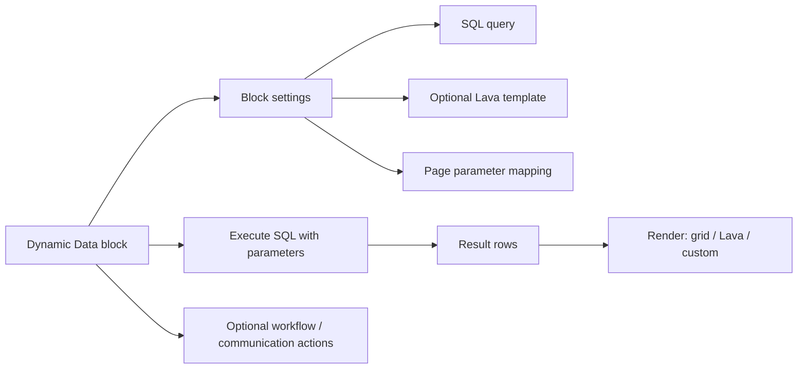

# Dynamic Data Block

## Overview

The Dynamic Data block lets administrators write SQL (or Lava) and render the results as a grid, list, or custom Lava-rendered output. It's the universal "I need a custom report" surface: parameterized via page parameters or block settings, optionally tied to workflow launches and bulk communications, and security-gated by block-level authorization. Used heavily by deployments that need site-specific reports without custom-block development.

The recent fix wave (`11f2341602`, `338879f4b0`, `37e87ed26f`) addressed reliability gaps in the Person ID and recipient field passing layer. Custom Dynamic Data block usage that pre-dates these fixes is suspect.

## Why It Exists

Hardcoding every report as a custom block would multiply development cost; modeling each as a Dynamic Data instance with admin-authored SQL gives administrators flexibility without code. The cost is admin-trust requirements (SQL execution is dangerous if the admin is untrusted), so block-level authorization gates access.

The Lava integration on top of SQL makes the block usable for non-trivial output formatting: standard tabular grid, summary rollups, custom card layouts, even Lava-rendered email content driven by SQL data.

## Mental Model

The admin writes SQL, optionally a Lava template for custom rendering, page-parameter mappings for filtering, and optionally workflow / communication action configuration for selected rows.

## What You Need to Know

**SQL execution requires admin trust.** Block-level authorization gates access. Dynamic Data should NOT be exposed to untrusted users.

**Page parameters can be used as SQL parameters.** `WHERE GroupId = @GroupId` reads the GroupId page parameter. Standard parameterization protects against SQL injection.

**Lava templates render custom output.** Result rows get exposed to Lava as a collection; templates iterate and format. Useful for cards, custom HTML, embedded computations.

**Workflow launch on selected rows.** Per `37e87ed26f` (Fixes #6588, 2025-11-24), selected rows are now correctly passed to the launched workflow. Pre-fix, selection state was lost. Per `11f2341602` (Fixes #6657, 2026-01-22), Person IDs in particular are correctly passed.

**Communication on selected rows.** Per `338879f4b0` (Fixes #6609, 2025-12-09), the Communication Recipient Fields block setting is now correctly applied. Pre-fix, only the first Person field per row was used.

**Grid features (sorting, filtering, paging) work on grid output.** Lava-rendered output is one chunk; for grid features, use the grid output mode.

**Multiple result sets.** A SQL query that returns multiple result sets can have each rendered separately. Useful for "summary plus detail" layouts.

**Persisted Datasets are an alternative.** `PersistedDataset` rows store pre-computed JSON; useful when the SQL is expensive and results don't need to be live. Different mechanism, different use case.

**Security review per Dynamic Data instance.** Each instance is admin-authored SQL; security teams should review. The block's authorization is the only gate.

## Common Scenarios

**"Build a custom 'Top Givers This Year' report."** Dynamic Data block. SQL aggregating FinancialTransactionDetail by AuthorizedPersonAlias for the year. Render as grid; configure column visibility.

**"Custom dashboard with multiple metrics."** Dynamic Data block with Lava template. SQL returns the data; Lava formats as tile cards.

**"Launch a follow-up workflow for selected report rows."** Configure Launch Workflow action; per-row Person ID is passed. Workflow runs with the selected Person.

**"Send a communication to selected rows."** Configure Send Communication action with Communication Recipient Fields. Per `338879f4b0`, the configured fields are correctly applied.

**"Filter the report by a page parameter."** Use `@ParamName` in SQL. Page parameter `ParamName` populates the SQL parameter.

**"Diagnose a workflow launch missing data."** Verify the fix `11f2341602` (or later) is in your build. Pre-fix, Person IDs could be missing.

## Key Architectural Decisions

### SQL + optional Lava

SQL is the universal data-retrieval language; Lava is the universal formatting language. Combining gives flexibility without per-report code.

### Block-level authorization

Standard Rock authorization. Admins control access; SQL execution is admin-trusted.

### Parameter mapping from page parameters

Reuses standard page-parameter resolution; same `Site.DisablePredictableIds` semantics.

### Per-row actions for selected rows

Operator workflow: see results, select, take action. Workflow / communication launches are the standard action types.

### Persisted Dataset as an alternative

Some reports are too expensive for live SQL; PersistedDataset handles pre-computation.

## Considered but Rejected

### Anonymous Dynamic Data

Rejected. SQL execution must be admin-trusted.

### Lava-only output

Rejected. Grid features (sorting, paging) need first-class support.

### Per-row launch is implicit

Rejected. Explicit configuration of which row data passes prevents accidental data exposure.

## Technical Reference

### Block

`Rock.Blocks/Reporting/DynamicData.cs`: the Obsidian Dynamic Data block.

### Block Settings

- Query (SQL)
- Lava template (optional)
- Update page (auto-detect SQL changes)
- Stored procedure mode
- Page parameter list
- Workflow launch action configuration
- Communication launch action configuration
- Person Id Field (per-row Person identifier)
- Communication Recipient Fields

### Service / API

The block runs SQL through `RockContext`; results are materialized for grid / Lava rendering.

### Persisted Dataset

`PersistedDataset` and `PersistedDatasetService` for pre-computed datasets. See [docs/reporting/reporting-overview.md](reporting-overview.md).

### Affected Blocks

- **Admin:** Dynamic Data block placements; Persisted Dataset Detail/List.

### Related Docs

- [docs/reporting/reporting-overview.md](reporting-overview.md)
- [docs/reporting/dataview-filter-components.md](dataview-filter-components.md) (filter alternative)
- [docs/lava/lava-overview.md](../lava/lava-overview.md) for the Lava layer.

## Recent Impactful Changes

- **2026-01-22** ([commit `11f2341602`](https://github.com/SparkDevNetwork/Rock/commit/11f2341602)). Obsidian Dynamic Data correctly passes Person IDs to launched Workflows (Fixes #6657).
- **2025-12-09** ([commit `338879f4b0`](https://github.com/SparkDevNetwork/Rock/commit/338879f4b0)). Communication Recipient Fields setting now correctly applied for the launch-communication action (Fixes #6609).
- **2025-11-24** ([commit `37e87ed26f`](https://github.com/SparkDevNetwork/Rock/commit/37e87ed26f)). Selected rows correctly passed to the Launch Workflow action (Fixes #6588).
