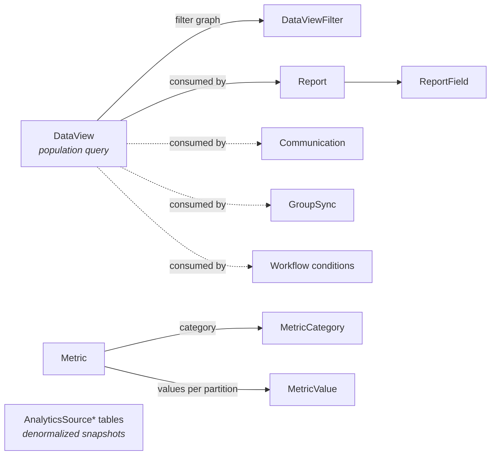

# Reporting Domain Overview

## Overview

Reporting is Rock's data-querying surface for non-developers: **DataViews** (saved, filterable population queries; "active givers in the last 90 days"), **Reports** (column-projection on top of DataViews; "show me their contact info"), **Metrics** (aggregated values over time; "weekly attendance count"), **Dynamic Data blocks** (admin-authored SQL with parameterization), and the **Analytics Source** tables (denormalized point-in-time roll-ups feeding the Analytics blocks).

DataViews are the foundation. Almost every other domain integrates with them: communications target a DataView for recipient lists, Group Sync uses one for membership, check-in eligibility filters use them, workflow conditions evaluate them.

## Why It Exists

Most reporting questions in a church are population questions ("who are the people who...") with a follow-up display step ("...and show me their phone number"). Forcing administrators to write SQL for every report would be unworkable; embedding the queries as code would prevent customization. DataViews are the answer: configurable, filterable, persistable population queries authored through a UI, that any other Rock subsystem can consume.

The Metric system exists for the parallel question: "What is the trend over time?" Weekly attendance, monthly giving, year-over-year baptism counts. Modeling Metrics as `MetricValue` rows with a `MetricValueDateTime` axis lets time-series reporting work without per-block custom code.

The recent Dynamic Data fixes (`11f2341602` Person ids workflow, `338879f4b0` Communication Recipient Fields, `37e87ed26f` selected rows workflow) are about closing reliability gaps: the block lets admins write SQL and trigger workflows or send communications based on results, which is powerful but error-prone in the parameter-passing layer.

The AnalyticsSourcePostalCode update (`195c755816`, 2026-03-23) is a data refresh, not code: ACS 5-year income estimates were updated. This matters because demographic reporting depends on the lookup being current.

## Mental Model

Three primary entities, plus a metric-time-series subsystem:

A DataView selects rows of an `EntityType` (Person, Group, Attendance, etc.) using a tree of `DataViewFilter`s (AND/OR groups, leaf filter components). Reports use a DataView as their population and project columns via `ReportField`. Metrics use partition entities (Campus, Schedule) to slice values; `MetricValue` is one row per (Metric, Partition, DateTime) combination.

Analytics Source tables (`AnalyticsSourcePostalCode`, `AnalyticsSourceFamilyHistorical`, `AnalyticsSourcePersonHistorical`, etc.) are denormalized snapshots maintained by jobs; the Analytics blocks query them directly for fast aggregations.

## What You Need to Know

**DataView filter components are pluggable.** Each leaf filter is a `DataViewFilterComponent` (e.g., "Has any group of type X"). Custom filters land as new components without core changes.

**Reports cannot do their own filtering beyond the DataView.** Filter at the DataView level; project at the Report level. Mixing the two has been a recurring source of confusion.

**Metric Values can be partitioned.** A Metric "Weekend Attendance" might be partitioned by Campus and Schedule, producing one MetricValue per (Campus, Schedule, Date). The job that computes the metric (or manual entry) writes the partitioned rows.

**The metric job preserves manually-entered values.** Commit `de9db6b0fe` (Fixes #6180, 2025-03-12) fixed a case where the job overwrote manually-entered values for the same date. Custom metric jobs that write directly should respect manual entries similarly.

**Dynamic Data + Workflow integration is delicate.** Three fixes in 2025-2026 (`11f2341602`, `338879f4b0`, `37e87ed26f`) address Person id passing, recipient field selection, and selected-row workflow launching. Custom Dynamic Data block usage that pre-dates the fixes is suspect; verify behavior on upgrade.

**Attendance Analytics is sensitive to group naming.** Commit `736ee7d4e7` (Fixes #6691) addressed a case where multiple groups sharing a name caused chart counts to use only the first group. Custom analytics built on the same data should query by GroupId, not name.

**Reports on `Group` entity-type were broken in `f83e3c45a8`.** Pre-fix (2025-11-14), Reports could not be created with Group as the source entity. Custom reporting tooling that pre-dates this is suspect.

**`AnalyticsSourcePostalCode` data refreshes periodically.** Last refresh 2026-03-23 (`195c755816`); demographic reporting accuracy depends on the table being current.

**DataView graceful failure on broken references.** Pre-fix `a12f627fbe` (Fixes #6756, 2026-04-08), a DataView that referenced a deleted RegistrationTemplate would fail to load. The fix handles missing templates so the DataView still loads.

**Site Session DataView filter has Site/Channel id mapping.** `b3bd46edb0` (and earlier `dbaa28bc75`) addressed a case where the filter's configured Site Id did not match the InteractionChannel Id; the filter now maps between them.

## Common Scenarios

**"List active givers in the last 90 days."** DataView with Person entity-type, filter "Has given to the General Fund in the last 90 days." Save and reuse.

**"Show those givers' contact info."** Report on top of the DataView, with ReportField rows for FirstName, LastName, Email, Phone.

**"Weekly attendance metric by campus."** Metric entity, partition on Campus and Schedule. Configure source SQL; the metric job computes weekly. The Metric Value Detail block lets staff manually enter values when the source is a count not in Rock.

**"Build a custom block that uses an existing DataView."** Reference the DataView by Guid; resolve via `DataViewService`; the resulting `IQueryable<Person>` (or whatever entity) is your population.

**"Show family income demographics by postal code."** AnalyticsSourcePostalCode joined to Family Group addresses. Refresh of the source data is on a separate cadence (`195c755816`).

## Key Architectural Decisions

### DataView as the population primitive

Almost every "who matches X" question reduces to a DataView. Modeling it once and exposing to communications, groups, workflows, check-in, and reports keeps the surface area manageable.

### Pluggable filter components

Each leaf filter is a class implementing `DataViewFilterComponent`. New filters are a one-class change.

### Reports as projection-only

Reports do not filter; they project. The DataView is the filter. The split keeps the model clear.

### Metric partitioning at the value level

Storing partitioned values (Metric, Partition, Date) lets one Metric serve campus/schedule slices without per-partition Metric definitions.

### Analytics Source denormalization

Real-time reporting against full normalized data is slow at church-data scale. Snapshot tables let demographic and historical analytics run quickly.

## Considered but Rejected

### Reports filtering on top of DataView

Rejected. DataView is the filter. Adding a second filter layer would have produced unclear semantics ("which one wins?").

### Real-time Metric computation on every query

Rejected. Metrics are time-series aggregates; the cost of computing on every read is unjustifiable. Job-driven pre-computation gives bounded cost.

## Technical Reference

### Data Model

| Entity | Purpose |
|---|---|
| `DataView` | Population query: name, EntityType, top-level filter, optional persisted/cached results. |
| `DataViewFilter` | Tree node: AND/OR group, or leaf filter with component reference. |
| `DataViewPersistedValue` | Cached results for persisted DataViews. |
| `Report` | Column projection on top of a DataView. |
| `ReportField` | One column in a Report. |
| `Metric` | Time-series aggregate definition. |
| `MetricCategory` | Category grouping. |
| `MetricValue` | One value per (Metric, Partition, DateTime). |
| `MetricPartition`, `MetricValuePartition` | Partition definitions and per-value partition values. |
| `AnalyticsSource*` (PostalCode, FamilyHistorical, PersonHistorical, etc.) | Denormalized snapshot tables. |

### Service / API Surface

`DataViewService` exposes the DataView graph and result execution.

`MetricService` and `MetricValueService` handle metric writes and read aggregations.

`MetricCalculatedSourceComponent` and similar are extension points for custom metric sources.

### Affected Blocks and UI Surfaces

- **DataView/Report:** DataView Detail/List/Results, Report Detail/Field Type, Categories.
- **Dynamic Data:** Dynamic Data block (Obsidian as of 2025).
- **Metrics:** Metric Detail/List, Metric Value Detail, Metric Value List.
- **Analytics:** Attendance Analytics, Email Analytics, Giving Analytics, Pledge Analytics, Group Attendance Analytics.
- **Interactions:** Interaction Channel/Component/Session/Detail/List.
- **Persisted Datasets:** Persisted Dataset Detail/List.
- **Merge Templates:** Merge Template Detail/List (used for export).

### Extension Points

- **Custom DataView filter components.** Implement `DataViewFilterComponent`.
- **Custom Metric source components.** Implement `MetricCalculatedSourceComponent`.
- **Custom data-source attribute formatters.** Used in Reports and Dynamic Data.

### File Index

- `Rock/Model/Reporting/` (entities)
- `Rock/Reporting/` (components, source helpers)
- `Rock/Reporting/DataFilter/` (built-in DataView filters)
- `Rock.Blocks/Reporting/` (Obsidian-aware C# blocks)

## Recent Impactful Changes

- **2026-04-08** ([commit `a12f627fbe`](https://github.com/SparkDevNetwork/Rock/commit/a12f627fbe)). DataViews now load gracefully when a referenced Registration Template is deleted (Fixes #6756).
- **2026-03-23** ([commit `195c755816`](https://github.com/SparkDevNetwork/Rock/commit/195c755816)). AnalyticsSourcePostalCode refreshed with the latest U.S. Census ACS 5-year income estimates.
- **2026-02-24** ([commit `736ee7d4e7`](https://github.com/SparkDevNetwork/Rock/commit/736ee7d4e7)). Attendance Analytics now correctly aggregates per-group when multiple groups share a name (Fixes #6691).
- **2026-01-22** ([commit `11f2341602`](https://github.com/SparkDevNetwork/Rock/commit/11f2341602)). Obsidian Dynamic Data block correctly passes Person IDs to launched Workflows (Fixes #6657).
- **2025-11-14** ([commit `f83e3c45a8`](https://github.com/SparkDevNetwork/Rock/commit/f83e3c45a8)). Reports can be created on the Group entity type.
