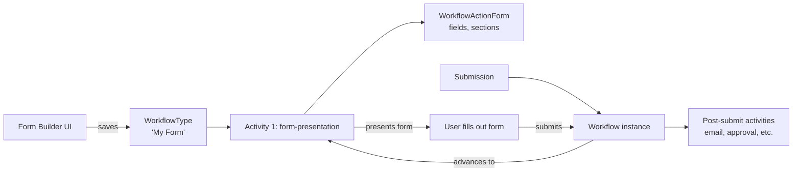

# Form Builder

## Overview

Form Builder is Rock's visual form designer. Each form is, under the hood, a `WorkflowType` whose first activity is a form-presentation action; the Form Builder UI is a friendlier authoring surface over that. Reuse of the workflow runtime gives forms persistence, attribute storage, history tracking, trigger integration, and notification routing for free. Submissions create `Workflow` instances that progress through whatever post-submission activities the form designer wired up.

## Why It Exists

Churches need many forms: baptism requests, prayer requests, volunteer signups, event applications, contact-us forms, feedback surveys. Building each as a custom block would be hostile to admins and impossible to maintain. The Form Builder gives admins a drag-and-drop designer; the workflow runtime gives the result the structure to handle approval, notification, follow-up workflows, and audit history.

The Forms-from-Workflow approach was a deliberate decision: workflows already have form-presentation actions, attribute systems, persistence, history, and triggers. Building Forms as a separate system would have duplicated all of that. The cost of reusing workflow is a slight UX impedance (a form is conceptually simpler than a workflow); the benefit is one engine to maintain.

The 2025-04-28 enhancements (commit `e1641b7a82`) added shareable form links, preview pop-ups, and a "Form Builder" System Communications category for automated responses. Operationally, these took the Form Builder from "you can build a form" to "you can share, preview, and respond to it cleanly."

The Category-based security inheritance fix (commit `a3a28629be`, Fixes #6712, 2026-03-05) addressed a real Form Builder bug: workflow types (including forms) did not inherit security from their Category, so admins with Category Edit access could not clone or delete forms in their own folder. The fix made Category the parent security authority.

The v20 refresh (commit `e3a2516d63`, 2026-05-20) rebuilt the Form Builder Detail UI around the v20 Obsidian polish targets, renamed the Communications tab to **Automations** (so non-email post-submission actions can legitimately live there), restructured the Person Entry side panel into collapsible sections, and added two net-new automations: a **Both** option on the Confirmation Email recipient picker (sends to the Person Entry primary person and spouse together) and a **Connection Requests** section that opens a Connection Request on submission with per-form-field attribute mapping. The same commit converted the Form Submission List and Form Analytics blocks from WebForms to Obsidian so the entire Form Builder family is visually consistent.

## Mental Model

The form is one or more sections, each containing fields. Fields are workflow attributes (with FieldType-specific configurations: text, date, person picker, etc.). Submission populates the workflow's attribute values; subsequent activities operate on those values.

A form can have post-submit actions: send an email confirmation, route to staff for approval, launch additional workflows, write to a Group / DataView. The Form Builder UI surfaces these as "what happens after submission."

## What You Need to Know

**A form IS a WorkflowType.** Editing the form is editing the workflow type. The Form Builder is a layer over the standard workflow designer; behind it, you can still see the standard `WorkflowActivityType` / `WorkflowActionType` rows.

**Forms inherit security from their Category since `a3a28629be`.** Pre-fix, Category-level access did not imply form-level access. Now, Category Edit access is sufficient to clone and delete forms in that folder.

**Shareable form links (since `e1641b7a82`) generate a public URL.** Admins can share without exposing the internal Workflow Entry path. The shareable link encodes the form reference; deep-linking with pre-filled fields is supported.

**Preview pop-ups let admins test forms.** Before sharing, the admin can preview to see exactly what the user sees. Reduces "I shared a broken form" mistakes.

**Form Builder System Communications.** The "Form Builder" SystemCommunication category contains templates for automated responses (submission confirmation, admin notification). Custom templates go here so they're discoverable in the Form Builder's response configuration.

**Form-presentation actions wait for human input.** This is the canonical wait pattern in workflows. The action does not advance until the user submits; while waiting, the workflow is persisted (so the runtime can be torn down and reborn without losing state).

**The Obsidian Workflow Entry block (`8dffa3c1a2`, 2025-04-03) is the new render path.** Legacy WebForms Workflow Entry still renders forms; new sites should adopt the Obsidian variant. Both produce the same workflow lifecycle.

**Section-and-field structure mirrors the underlying workflow attributes.** A form section becomes a `WorkflowActionFormSection`; each field becomes a `WorkflowActionFormAttribute` referencing a workflow attribute. The Form Builder hides this; advanced users can drop into the workflow designer for finer control.

**User actions on the form.** `WorkflowActionFormUserAction` rows define the buttons the user sees: "Submit", "Save Draft", "Cancel". Each is a configured workflow continuation; multiple buttons can route to different next activities (e.g., "Submit for Review" vs "Save and Continue Later").

**Cloning a form clones the underlying WorkflowType.** Per `a3a28629be`, cloning is permitted by Category-level Edit access. The cloned WorkflowType has a new Guid; relationships (referencing workflows, scheduled activations) are not auto-rewritten.

**Form Detail has three tabs: Settings, Form Builder, Automations.** Top-anchored pills (`<TabbedBar type="pills">`). The Automations tab hosts Confirmation Email, Notification Email, and Connection Requests. Each section is a `<ContentSection>` with `hideToggleButton` set, so the chevron is hidden and the section's Enable switch in `headerActions` drives `:isCollapsed` directly.

**Confirmation Email recipient has four options.** Email (the form's Email field), Person (Person Entry primary person), Spouse (Person Entry primary person's spouse), Both. The Both option only appears when Person Entry is enabled. Backend lives in `Rock/Workflow/Action/WorkflowControl/UserForm.cs` `SendFormBuilderConfirmationEmail`: when `Recipient = Both`, the workflow's auto-generated `Person` attribute supplies the primary recipient and `Person.GetSpouse( rockContext )` supplies the spouse; if no spouse exists on the family record, the spouse delivery is skipped with an `AddLogEntry` warning and the primary still receives the email.

**Notification Email uses an EmailBox with `allowMultiple`** for the Email Address(es) Send-To option, so a comma-separated list of addresses persists and round-trips cleanly. The other two Send-To options are Individual (a Person picker) and Campus Topic Address (Lava lookup against the Person Entry primary person's campus).

**Connection Requests requires Person Entry.** When Person Entry is off, the section's Enable switch is disabled and a NotificationBox explains why ("Person Entry must be enabled on the Form Builder tab. The primary person will be used as the connection requestor."). The section is gated because the requestor must come from somewhere; the form has no other native source of a person.

**Attribute Matching maps form fields to Connection Request data.** For each form field, a dropdown picks one of: blank (unmapped — the field is dropped, no Connection Request attribute is set, no comment line is appended), `:comment` sentinel ("Add to Connection Request Comment" — the value is folded into the Connection Request's Comment field in form order), or a specific Connection Opportunity attribute Guid. The dropdown uses `showBlankItem`; the runtime entry-removal logic lives in `connectionRequests.partial.obs` `onMappingChanged`.

**Form Submission List and Form Analytics are Obsidian blocks** as of the v20 refresh. Both are reached only through the per-card affordances on Form List (the list icon and the chart-bar icon). Cross-block nav tabs that the legacy WebForms versions exposed have been removed; the per-card entry points are the only way in.

**Person Entry side panel is collapsible.** Six sections: General, Campus, Personal Information, Address, Family, Demographics. The Family section configures Marital Status, Spouse Entry, and Spouse Label (each Marital Status and Spouse Entry is a Hidden / Optional / Required radio). Spouse Entry is independent of Marital Status by design; the underlying data model has no "Type" dropdown on Family.

## Common Scenarios

**"Build a baptism request form."** Form Builder. Add sections (Personal Info, Service Selection). Add fields (FirstName, LastName, Email, Preferred Date). Configure post-submit: send confirmation email, notify pastor, create a Connection Request.

**"Share a form publicly."** Form Builder share action. Generates a URL; embed in announcements or emails.

**"Customize the confirmation email."** Edit the SystemCommunication referenced in the form's post-submit configuration. Use Lava merge fields for personalization.

**"Get notified on every submission."** Configure a "Send Email" action in the post-submit activity, addressed to the staff email. Or set the WorkflowType's notification recipient.

**"Approve before recording."** Multi-activity workflow: form-presentation -> Pending Review activity -> Approved activity. The approval step is another form-presentation action targeted at staff.

**"Delete or clone a form I own."** Requires Category Edit access (since `a3a28629be`). Older versions required per-form permission.

**"Send the confirmation email to the submitter AND their spouse."** Enable the Confirmation Email automation, pick `Recipient = Both`. Requires Person Entry to be on so the runtime can resolve the spouse.

**"Open a Connection Request on submission."** Enable the Connection Requests automation. Pick a Connection Type and Opportunity. In Attribute Matching, point each form field at either a Connection Opportunity attribute or `Add to Connection Request Comment` (leave blank to skip a field).

## Key Architectural Decisions

### Forms as Workflows

Reuse of the workflow runtime gives persistence, attribute storage, history, and trigger integration for free. Forking would duplicate all of that.

### Category-based security inheritance

Forms naturally group by Category (Volunteer Forms, Member Forms, Event Forms). Granting Category-level access to a Form Builder admin lets them work freely within their folder.

### Shareable links separate from internal Workflow Entry

Public-facing URL is its own concern (admins should be able to share without exposing the internal admin path). Shareable links wrap the public access.

### Preview as a feature, not a separate environment

Preview-in-place lets admins iterate quickly without "deploy to staging." Lower friction for non-developers.

### "Form Builder" SystemCommunication category

A discoverable home for form-specific email templates. Without the category, admins would have to know the global SystemCommunication landscape to find the right template.

### Connection Requests routes the requestor through Person Entry

The new Connection Requests automation reuses the form's Person Entry primary person as the Connection Request's requestor. Adding parallel person-attribute pickers for the requestor (or for Connector / Campus overrides) would reintroduce the workflow-attribute friction the feature is removing. The runtime falls back to the opportunity's default connector and the primary person's primary campus, which covers the realistic configuration space; Connector overrides remain a workflow-author concern, not a form-author concern.

### Attribute Matching instead of a Lava CommentTemplate

Form responses either land on a structured Connection Request attribute (queryable, filterable, displayable on the request detail page) or are appended to Comments verbatim, in form order, with a label prefix. A free-form Lava template accomplishes the same routing in theory but requires admins to know merge-field syntax for what is otherwise a point-and-click mapping; it also bypasses Connection Opportunity attributes entirely.

### Communications tab renamed to Automations

Once a non-email automation lives in the same tab (Connection Requests), the "Communications" name no longer reads accurately. Renaming the tab in the same release that introduced the new section avoided a cosmetic-only rename in a follow-up.

### `hideToggleButton` on `<ContentSection>` instead of expanding `<SectionContainer>`

The Automations sections specifically use `contentSection` (the shared low-level component). Promoting the switch into `SectionContainer` would require either rewriting Automations to use `SectionContainer` (large blast radius across other blocks that depend on `contentSection`'s exact API) or adding parallel switch handling in two components. The minimal `watch` on `props.isCollapsed` in `contentSection` is non-breaking and unblocks the feature with one line of code.

## Considered but Rejected

### Forms as a separate domain

Rejected. Reusing Workflow infrastructure was the right cost-benefit.

### Per-form security only (no Category inheritance)

Rejected. Operational pain too high; admins wanted Category-level access to suffice.

### Auto-deploy preview to a public URL

Rejected. Preview should not be public; the share action is the explicit publish path.

### Explicit Person / Connector / Campus attribute pickers for Connection Requests

Rejected. The requestor comes from Person Entry's primary person, which is the only person the form natively knows about post-submission. Adding parallel person-attribute pickers reintroduces the workflow-attribute friction the feature is removing.

### Lava `CommentTemplate` for Connection Request Comments

Rejected. Attribute Matching is a stronger model: structured attribute landing or labeled append-to-comment. A free-form Lava template requires merge-field syntax for what should be a point-and-click mapping and bypasses Connection Opportunity attributes entirely.

### Connection Requests as a completion-action option in CompletionSettings

Rejected. CompletionSettings configures what the user sees after submit (message, redirect). Bolting "open connection request" into it would conflate "what does the user see next" with "what does Rock do behind the scenes." Email shortcuts already established the right precedent: their own section, their own toggle, their own settings JSON, separate from CompletionSettings.

### A separate "Connections" tab next to Automations

Rejected for v1. A whole tab is overweight for one settings panel. The Automations rename already broadens the tab's name to legitimately host non-email post-submission automations. Revisit the tab split if multi-action Connection support lands later.

### Defer Form Submissions and Form Analytics conversions to v20.1

Rejected. The v20 Form Builder family ships visually consistent or it doesn't. Leaving Submissions and Analytics on WebForms while the rest of the family is in Obsidian would create a half-and-half experience where a v20 admin clicks "Submissions" from the new Form List and lands on a WebForms page. The conversions are basic (no new feature work) so the additional cost is bounded; the consistency win is large.

### Cross-block nav tabs across Submissions, Analytics, and the runtime form

Rejected. Form List is the only entry point into a specific form's Submissions and Analytics views in the new design. Cross-tabs would duplicate that navigation and require a `LinkedPage` block setting on every other block; the per-card affordances on Form List replace them.

## Technical Reference

### Schema (relevant subset)

`WorkflowFormBuilderTemplate`:
- `Name`, `Description`
- `IsActive`
- Stores a reusable form-builder layout template.

`WorkflowActionForm`:
- `WorkflowActionTypeId` (the action this form is on)
- `Header`, `Footer`
- `IncludeActionsInNotification`, `AllowNotes`
- `NotificationSystemCommunicationId`
- `ActionAttributeGuid`

`WorkflowActionFormSection`:
- `WorkflowActionFormId`
- `Title`, `Description`
- `Order`
- `Type` (single column, two-column)
- `ShowHeadingSeparator`

`WorkflowActionFormAttribute`:
- `WorkflowActionFormId`
- `WorkflowActionFormSectionId`
- `AttributeId` (the workflow attribute it surfaces)
- `Order`, `IsVisible`, `IsReadOnly`, `IsRequired`
- `PreHtml`, `PostHtml`

`WorkflowActionFormUserAction`:
- The buttons (Submit / Save / Cancel) and their behaviors.

### Affected Blocks

- **Form List**: the Category Tree + card grid that catalogs all forms. Per-card affordances (Submissions, Analytics, Copy Link, Edit, Overflow) are the only entry points into a specific form's downstream views.
- **Form Builder Detail**: the visual designer. Top-anchored Settings / Form Builder / Automations tabs. Sidebar on the right of the canvas. Header/Footer editing lives in the sidebar (not a modal).
- **Form Template Detail**: shared form-template editor. Does not currently expose `Recipient = Both` (known follow-up; the template-level UI is gated to Person / Spouse).
- **Form Submission List** (`Rock.Blocks/WorkFlow/FormBuilder/FormSubmissionList.cs`, `formSubmissionList.obs`): per-form submissions grid. Obsidian. Person + Campus filter modal at `FormSubmissionList/filtersModal.partial.obs`, preferences scoped per workflow type via `MakeKeyUniqueToWorkflowType`.
- **Form Analytics** (`Rock.Blocks/WorkFlow/FormBuilder/FormAnalytics.cs`, `formAnalytics.obs`): KPI cards + LineChart of views and completions. Obsidian. Backend groups Form Viewed / Form Completed interactions by day for short ranges and by month for year-scale ranges; the client densifies the sparse series via `XYPointEnumerable.selectFilledOverDateRange`.
- **Workflow Entry / Obsidian Workflow Entry**: renders the form for the user.
- **Workflow Type Detail**: editing the underlying type directly.

### Related Docs

- [docs/workflow/workflow-overview.md](workflow-overview.md)
- [docs/workflow/the-runtime.md](the-runtime.md)
- [docs/workflow/writing-action-components.md](writing-action-components.md) for custom post-submit actions.

## Recent Impactful Changes

- **2026-05-20** ([commit `e3a2516d63`](https://github.com/SparkDevNetwork/Rock/commit/e3a2516d63)). Form Builder Detail UI refresh (Settings / Automations / Person Entry panels). Form Submission List and Form Analytics blocks converted to Obsidian. Confirmation Email gains a Both option for sending to the Person Entry primary person and spouse together; Notification Email gains a multi-address EmailBox and a Campus Topic Address Send-To option; a new Connection Requests automation opens a Connection Request on submission with per-form-field Attribute Matching.
- **2026-03-05** ([commit `a3a28629be`](https://github.com/SparkDevNetwork/Rock/commit/a3a28629be)). Workflow Types now inherit security from their Category; Form Builder users with Category Edit access can clone and delete workflows in that category (Fixes #6712).
- **2025-04-28** ([commit `e1641b7a82`](https://github.com/SparkDevNetwork/Rock/commit/e1641b7a82)). Form Builder enhancements: shareable form links, preview pop-ups, and a "Form Builder" SystemCommunications category for automated responses.
- **2025-04-03** ([commit `8dffa3c1a2`](https://github.com/SparkDevNetwork/Rock/commit/8dffa3c1a2)). Preview version of Obsidian Workflow Entry block for testing.

## Related Specs

- [Form Builder Updates](../../specs/completed/workflow/260508-form-builder-updates.md) — 2026-05-08 (Joshua Henninger)
