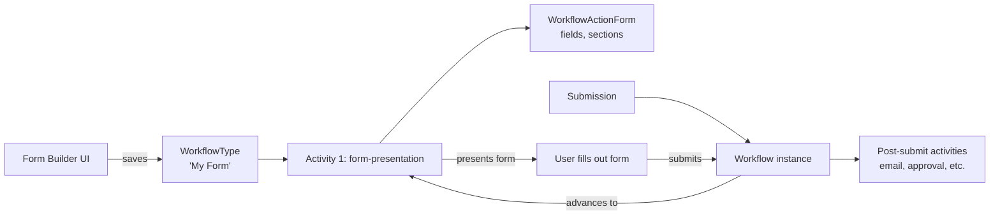

# Form Builder

## Overview

Form Builder is Rock's visual form designer. Each form is, under the hood, a `WorkflowType` whose first activity is a form-presentation action; the Form Builder UI is a friendlier authoring surface over that. Reuse of the workflow runtime gives forms persistence, attribute storage, history tracking, trigger integration, and notification routing for free. Submissions create `Workflow` instances that progress through whatever post-submission activities the form designer wired up.

## Why It Exists

Churches need many forms: baptism requests, prayer requests, volunteer signups, event applications, contact-us forms, feedback surveys. Building each as a custom block would be hostile to admins and impossible to maintain. The Form Builder gives admins a drag-and-drop designer; the workflow runtime gives the result the structure to handle approval, notification, follow-up workflows, and audit history.

The Forms-from-Workflow approach was a deliberate decision: workflows already have form-presentation actions, attribute systems, persistence, history, and triggers. Building Forms as a separate system would have duplicated all of that. The cost of reusing workflow is a slight UX impedance (a form is conceptually simpler than a workflow); the benefit is one engine to maintain.

The 2025-04-28 enhancements (commit `e1641b7a82`) added shareable form links, preview pop-ups, and a "Form Builder" System Communications category for automated responses. Operationally, these took the Form Builder from "you can build a form" to "you can share, preview, and respond to it cleanly."

The Category-based security inheritance fix (commit `a3a28629be`, Fixes #6712, 2026-03-05) addressed a real Form Builder bug: workflow types (including forms) did not inherit security from their Category, so admins with Category Edit access could not clone or delete forms in their own folder. The fix made Category the parent security authority.

## Mental Model

The form is one or more sections, each containing fields. Fields are workflow attributes (with FieldType-specific configurations: text, date, person picker, etc.). Submission populates the workflow's attribute values; subsequent activities operate on those values.

A form can have post-submit actions: send an email confirmation, route to staff for approval, launch additional workflows, write to a Group / DataView. The Form Builder UI surfaces these as "what happens after submission."

## What You Need to Know

**A form IS a WorkflowType.** Editing the form is editing the workflow type. The Form Builder is a layer over the standard workflow designer; behind it, you can still see the standard `WorkflowActivityType` / `WorkflowActionType` rows.

**Forms inherit security from their Category since `a3a28629be`.** Pre-fix, Category-level access did not imply form-level access. Now, Category Edit access is sufficient to clone and delete forms in that folder.

**Shareable form links (since `e1641b7a82`) generate a public URL.** Admins can share without exposing the internal Workflow Entry path. The shareable link encodes the form reference; deep-linking with pre-filled fields is supported.

**Preview pop-ups let admins test forms.** Before sharing, the admin can preview to see exactly what the user sees. Reduces "I shared a broken form" mistakes.

**Form Builder System Communications.** The "Form Builder" SystemCommunication category contains templates for automated responses (submission confirmation, admin notification). Custom templates go here so they're discoverable in the Form Builder's response configuration.

**Form-presentation actions wait for human input.** This is the canonical wait pattern in workflows. The action does not advance until the user submits; while waiting, the workflow is persisted (so the runtime can be torn down and reborn without losing state).

**The Obsidian Workflow Entry block (`8dffa3c1a2`, 2025-04-03) is the new render path.** Legacy WebForms Workflow Entry still renders forms; new sites should adopt the Obsidian variant. Both produce the same workflow lifecycle.

**Section-and-field structure mirrors the underlying workflow attributes.** A form section becomes a `WorkflowActionFormSection`; each field becomes a `WorkflowActionFormAttribute` referencing a workflow attribute. The Form Builder hides this; advanced users can drop into the workflow designer for finer control.

**User actions on the form.** `WorkflowActionFormUserAction` rows define the buttons the user sees: "Submit", "Save Draft", "Cancel". Each is a configured workflow continuation; multiple buttons can route to different next activities (e.g., "Submit for Review" vs "Save and Continue Later").

**Cloning a form clones the underlying WorkflowType.** Per `a3a28629be`, cloning is permitted by Category-level Edit access. The cloned WorkflowType has a new Guid; relationships (referencing workflows, scheduled activations) are not auto-rewritten.

## Common Scenarios

**"Build a baptism request form."** Form Builder. Add sections (Personal Info, Service Selection). Add fields (FirstName, LastName, Email, Preferred Date). Configure post-submit: send confirmation email, notify pastor, create a Connection Request.

**"Share a form publicly."** Form Builder share action. Generates a URL; embed in announcements or emails.

**"Customize the confirmation email."** Edit the SystemCommunication referenced in the form's post-submit configuration. Use Lava merge fields for personalization.

**"Get notified on every submission."** Configure a "Send Email" action in the post-submit activity, addressed to the staff email. Or set the WorkflowType's notification recipient.

**"Approve before recording."** Multi-activity workflow: form-presentation -> Pending Review activity -> Approved activity. The approval step is another form-presentation action targeted at staff.

**"Delete or clone a form I own."** Requires Category Edit access (since `a3a28629be`). Older versions required per-form permission.

## Key Architectural Decisions

### Forms as Workflows

Reuse of the workflow runtime gives persistence, attribute storage, history, and trigger integration for free. Forking would duplicate all of that.

### Category-based security inheritance

Forms naturally group by Category (Volunteer Forms, Member Forms, Event Forms). Granting Category-level access to a Form Builder admin lets them work freely within their folder.

### Shareable links separate from internal Workflow Entry

Public-facing URL is its own concern (admins should be able to share without exposing the internal admin path). Shareable links wrap the public access.

### Preview as a feature, not a separate environment

Preview-in-place lets admins iterate quickly without "deploy to staging." Lower friction for non-developers.

### "Form Builder" SystemCommunication category

A discoverable home for form-specific email templates. Without the category, admins would have to know the global SystemCommunication landscape to find the right template.

## Considered but Rejected

### Forms as a separate domain

Rejected. Reusing Workflow infrastructure was the right cost-benefit.

### Per-form security only (no Category inheritance)

Rejected. Operational pain too high; admins wanted Category-level access to suffice.

### Auto-deploy preview to a public URL

Rejected. Preview should not be public; the share action is the explicit publish path.

## Technical Reference

### Schema (relevant subset)

`WorkflowFormBuilderTemplate`:
- `Name`, `Description`
- `IsActive`
- Stores a reusable form-builder layout template.

`WorkflowActionForm`:
- `WorkflowActionTypeId` (the action this form is on)
- `Header`, `Footer`
- `IncludeActionsInNotification`, `AllowNotes`
- `NotificationSystemCommunicationId`
- `ActionAttributeGuid`

`WorkflowActionFormSection`:
- `WorkflowActionFormId`
- `Title`, `Description`
- `Order`
- `Type` (single column, two-column)
- `ShowHeadingSeparator`

`WorkflowActionFormAttribute`:
- `WorkflowActionFormId`
- `WorkflowActionFormSectionId`
- `AttributeId` (the workflow attribute it surfaces)
- `Order`, `IsVisible`, `IsReadOnly`, `IsRequired`
- `PreHtml`, `PostHtml`

`WorkflowActionFormUserAction`:
- The buttons (Submit / Save / Cancel) and their behaviors.

### Affected Blocks

- **Form Builder**: the visual designer.
- **Workflow Entry / Obsidian Workflow Entry**: renders the form for the user.
- **Workflow Type Detail**: editing the underlying type directly.

### Related Docs

- [docs/workflow/workflow-overview.md](workflow-overview.md)
- [docs/workflow/the-runtime.md](the-runtime.md)
- [docs/workflow/writing-action-components.md](writing-action-components.md) for custom post-submit actions.

## Recent Impactful Changes

- **2026-03-05** ([commit `a3a28629be`](https://github.com/SparkDevNetwork/Rock/commit/a3a28629be)). Workflow Types now inherit security from their Category; Form Builder users with Category Edit access can clone and delete workflows in that category (Fixes #6712).
- **2025-04-28** ([commit `e1641b7a82`](https://github.com/SparkDevNetwork/Rock/commit/e1641b7a82)). Form Builder enhancements: shareable form links, preview pop-ups, and a "Form Builder" SystemCommunications category for automated responses.
- **2025-04-03** ([commit `8dffa3c1a2`](https://github.com/SparkDevNetwork/Rock/commit/8dffa3c1a2)). Preview version of Obsidian Workflow Entry block for testing.
