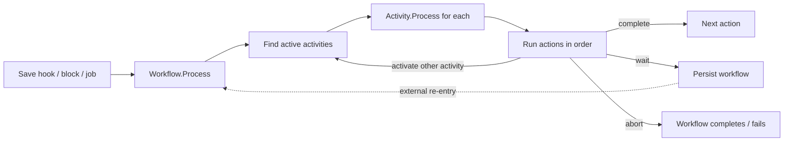

# The Workflow Runtime

## Overview

The Workflow Runtime is the engine that drives a `Workflow` instance through its activities and actions. Two execution paths: **synchronous** (the runtime is invoked directly from a block, save hook, or workflow trigger; it processes activities as far as it can in one call), and **asynchronous via the `ProcessWorkflows` job** (sweeps active non-persisted workflows and resumes them on the job's schedule). Persistent workflows wait between explicit re-entries (form submission, scheduled action); non-persistent workflows advance through synchronous calls until they complete, abort, or hit a wait point.

## Why It Exists

Workflows have two natural execution shapes: short-lived (an action triggers a workflow, the workflow runs end-to-end in milliseconds) and long-lived (the workflow waits for human input across days or weeks). The runtime supports both: synchronous execution for the short case, persistence + scheduled re-entry for the long case. Forcing everything through one or the other would compromise the unsupported case (synchronous-only would block the calling thread; async-only would multiply latency for trivial workflows).

The activity-double-activation fix (commit `852ab83da4`, Fixes #6289, 2025-06-09) addresses an important edge case: an activity processing during a `ProcessWorkflows` job kick could be unexpectedly re-activated. The fix makes the runtime safer; component authors still must handle re-runs gracefully, but the framework no longer multiplies the surface.

## Mental Model

A workflow has activities; each activity has actions in order. The runtime processes activities by walking the active ones and running their pending actions. Each action returns:

- **complete** -> next action.
- **wait** -> persist, exit (re-entry on external trigger).
- **activate other activity** -> branching: a new activity starts.
- **abort / completed** -> the workflow finishes.

`Workflow.Status` tracks the lifecycle: Active, Completed, Aborted, etc. `Workflow.IsPersisted` controls whether the runtime saves the workflow between calls (persistent) or discards it on completion (transient).

## What You Need to Know

**Persistent vs transient is a per-workflow flag.** `Workflow.IsPersisted` says whether to save the workflow row between executions. Persistent workflows survive process restarts; transient workflows live only in the synchronous call.

**The `ProcessWorkflows` job is the heartbeat.** Runs on its configured cadence. Sweeps active non-persisted workflows and resumes them. Workflows that need real-time-ish advancement should be persistent and explicitly re-entered, not relying on the job sweep.

**Synchronous calls advance the workflow as far as possible.** The caller (a block, save hook, etc.) invokes `Workflow.Process()`; the runtime walks activities and actions until it hits a wait point or completes. Exceptions propagate back to the caller.

**Activities can branch.** A workflow does not need to be linear. Activities can activate other activities; conditional branching is expressed as activate-or-not based on action results.

**Action idempotency is the component's responsibility.** Pre-fix `852ab83da4`, the runtime could re-activate a processing activity. The fix prevents this, but component authors should still defend against re-runs in case of partial failures or external retries.

**Form actions are the canonical wait point.** A form-presentation action does not advance until human submission. While waiting, the workflow is persisted (so the runtime can be torn down without losing state).

**Activated activities can be assigned to a Group.** The activity's `AssignedGroupId` makes it visible to active group members. Pre-fix `c64c42d4c2`, inactive group members could see assignments; the fix excludes them.

**Logging is per-WorkflowType configurable.** The WorkflowType controls log retention and log-on-action behavior. Heavy logging on a high-volume workflow generates significant DB churn; tune retention.

**Completion deletes (per retention policy).** Completed workflows are auto-deleted after the configured retention period (since `05d1441337` fixed the validation logic). Workflows that need permanent retention should set retention to never; alternatively, persist their key data outside the workflow row.

**Exception handling is per-action.** An action that throws causes the workflow to log the error; downstream actions do not run; the workflow stays in its current state for retry. Components should populate `errorMessages` and return false rather than letting exceptions escape unless the situation is truly unrecoverable.

**Workflow attributes are scoped to the workflow.** `Workflow.AttributeValues` are visible to every activity and action in the workflow. Activity-level attributes are scoped to a single activity (unusual; most attributes are workflow-level).

**The runtime can be invoked recursively.** A workflow action that activates another workflow (or activates an additional activity in the current workflow) is a normal pattern. Be aware of the stack depth on long chains.

## Common Scenarios

**"Run a workflow that completes synchronously in one call."** Mark the WorkflowType as non-persistent. Activate from the calling block / hook. The runtime processes through completion. The workflow row is discarded.

**"Run a workflow that waits for human input."** Mark persistent. Use a form-presentation action. The runtime persists the workflow and exits. On submission, the form's submit handler re-enters the runtime to advance.

**"Run a workflow that polls every hour."** Persistent + a "delay" action that waits an hour. The `ProcessWorkflows` job picks up the workflow when the delay expires. Custom delay actions exist; rolling your own is a one-class change.

**"Activate another activity from within an action."** The action returns true and calls `Activate(workflow, activityName)` to start an additional activity. Branching pattern.

**"Abort a running workflow."** Set `Workflow.Status` to Aborted, persist. The runtime stops processing on next iteration.

**"Investigate why a workflow stuck."** Open the workflow detail block. Check the activity / action state, the log, the most recent error. Common causes: form action waiting for unfound submission, action throwing on every retry, workflow has been disabled mid-flight.

## Key Architectural Decisions

### Two execution paths (sync + async)

Different workflow shapes need different runtimes. Forcing one would compromise the other.

### Persistent vs transient as a flag

The "should this workflow survive across executions" decision is per WorkflowType.

### `ProcessWorkflows` job as the heartbeat

Bounds DB churn for the common transient case while giving explicit re-entry for the persistent case.

### Activity branching, not linear

Real workflows have conditional paths. The activity activation model lets actions decide what comes next.

### Component idempotency is the component's responsibility

Framework-level exactly-once would require infrastructure that does not justify its cost.

## Considered but Rejected

### One execution model

Rejected. Sync-only blocks; async-only multiplies latency.

### Auto-retry on action failure

Rejected. Hides component bugs and invites unintended behavior with non-idempotent components.

### Workflow attributes scoped strictly to activities

Rejected. Cross-activity reads are common; workflow-level scoping is the right default.

## Technical Reference

### Lifecycle Methods

`Workflow.Process(rockContext, errorMessages)`: the synchronous execution entry point. Returns true if processing completed (workflow completed or hit wait); false on error.

`WorkflowActivity.Process()`: drives a single activity through its actions.

`Activate(WorkflowType, name)`: factory for new instances.

`Activate(workflow, activityName)`: starts an additional activity on a running instance.

### `ProcessWorkflows` Job

[Rock/Jobs/ProcessWorkflows.cs](../../Rock/Jobs/ProcessWorkflows.cs):

1. Find active, non-persisted workflows (or persistent workflows whose delay has expired).
2. Process each.
3. Save changes; update logs.

Configurable cadence (default: every 5-10 minutes depending on deployment).

### State Storage

`Workflow.AttributeValues` (via `IHasAttributes`): workflow-scoped key-value pairs.

`WorkflowActivity.AttributeValues`: activity-scoped (rare).

### Affected Areas

The runtime is invoked from:
- Save hooks (when a `WorkflowTrigger` matches).
- Blocks (form submissions, manual launches).
- The `ProcessWorkflows` job (sweeping active workflows).
- Other workflow actions (activating sub-workflows).

### Related Docs

- [docs/workflow/workflow-overview.md](workflow-overview.md)
- [docs/workflow/writing-action-components.md](writing-action-components.md)
- [docs/workflow/workflow-triggers.md](workflow-triggers.md)
- [docs/workflow/form-builder.md](form-builder.md)

## Recent Impactful Changes

- **2026-04-09** ([commit `c64c42d4c2`](https://github.com/SparkDevNetwork/Rock/commit/c64c42d4c2)). Workflow activities assigned to a group exclude inactive group members in queries (Fixes #6757).
- **2025-06-09** ([commit `852ab83da4`](https://github.com/SparkDevNetwork/Rock/commit/852ab83da4)). Fixed an issue where an activity could be unexpectedly activated a second time during the Process Workflows job (Fixes #6289).
- **2025-01-10** ([commit `05d1441337`](https://github.com/SparkDevNetwork/Rock/commit/05d1441337)). Fixed delete-validation logic for completed workflows past the retention period (Fixes #6144).
