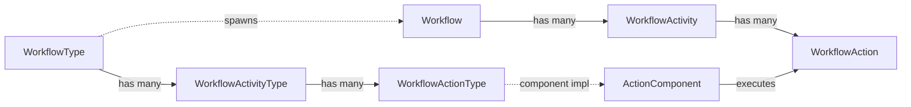

# Workflow Domain Overview

## Overview

Workflow is Rock's process automation and form-building engine. A `WorkflowType` is a template (the design); a `Workflow` is one execution of that template (the runtime instance). Each workflow has one or more `WorkflowActivity` rows (phases), each holding one or more `WorkflowAction` rows (the steps that actually do work). Actions have configurable types (`WorkflowActionType`) that map to `ActionComponent` implementations: send an email, set an attribute, assign to a person, present a form, run SQL, launch another workflow, dozens of others.

Form Builder is the workflow UI's other face: a visual designer that produces a WorkflowType whose first activity is a form-presentation step. Each Form Builder form is a Workflow under the hood.

## Why It Exists

Churches need to automate processes that have human-in-the-loop steps: a new visitor follow-up sequence (collect contact info -> assign to a connector -> send weekly check-in -> close after 30 days), a baptism request flow (signup form -> pastor approval -> schedule -> certificate), a benevolence application (intake form -> staff review -> committee decision -> payout). Hardcoding each as a custom block would multiply development cost. Modeling the steps as configurable types and letting administrators wire them together is what makes Rock customizable for ministries the platform team did not anticipate.

The split between `Type` and `Activity/Action` (template-vs-instance) is the same pattern as `GroupType` -> `Group`: it lets one design serve many runs without duplication, and lets administrators edit the design without touching live instances. The cost is the indirection on every read; the benefit is administrability at scale.

The Form Builder shipped on top of Workflow because forms are essentially "a single-activity workflow with a form-presentation action" plus some UX. Reusing the workflow runtime got persistence, attribute storage, history, and triggers for free.

## Mental Model

Three entity layers, each with a `Type` and a `Runtime` form:

- **Workflow** = `WorkflowType` (template) + `Workflow` (instance).
- **Activity** = `WorkflowActivityType` (template) + `WorkflowActivity` (instance).
- **Action** = `WorkflowActionType` (template) + `WorkflowAction` (instance).

A workflow runs by sequentially activating activities, and each active activity processes its actions in order. An action can:

- **Complete**, allowing the next action to run.
- **Wait** (e.g., a form action waits for human submission).
- **Activate other activities** (effectively branching).
- **Persist or destroy the workflow** (`PersistImmediately`, `Complete`, `Destroy`).

The `ProcessWorkflows` job sweeps non-persisted active workflows and resumes them. Persistent workflows are stored in `Workflow` and re-enter processing when externally triggered (form submitted, attribute set, time elapsed).

`WorkflowTrigger` rows are the entity-event glue: "when a Person is updated, launch this WorkflowType." Triggers fire from the model save hooks across Rock; a workflow built to react to an event subscribes via a trigger row.

## What You Need to Know

**A "form" is a workflow.** Form Builder forms are workflows whose first activity is a form-presentation action. Edit the form, and you are editing a workflow type. The Obsidian Workflow Entry block (preview as of `8dffa3c1a2`, 2025-04-03) is the new render path; the legacy WebForms block still exists.

**Workflow Type security inherits from Category.** Since `a3a28629be` (2026-03-05, Fixes #6712), a Workflow Type's parent security authority is its Category. Edit access on the Category implies Edit access on the workflow types it contains. This was a deliberate change; pre-fix, Form Builder users with category access could not edit/clone forms in their own categories.

**`ProcessWorkflows` job is the heartbeat.** Active workflows that are not persisted-immediately wait for the next job sweep to advance. Tight loops that need sub-job-cycle latency must use persistent workflows with explicit triggers, not scheduled-poll patterns.

**Activity double-activation is a class of bug.** Commit `852ab83da4` (2025-06-09, Fixes #6289) fixed an issue where an activity processing during a `ProcessWorkflows` job kick could be re-activated. Custom action components that are not idempotent must be defensively coded; the framework cannot guarantee exactly-once execution against external systems.

**Group-assigned activities respect member status.** Until `c64c42d4c2` (2026-04-09, Fixes #6757), inactive group members could see workflow activities assigned to their group. The fix excludes non-active members. Custom Group-assignment queries should follow the pattern.

**Attribute storage is per-workflow and per-activity.** Workflow Attributes are global to the workflow; Activity Attributes are scoped to the activity. The `RockBlocks.Common.Lava` merge fields and the form builder access both. Cross-activity reads work because the workflow object holds the full attribute graph in memory during execution.

**`WorkflowLog` writes can be expensive.** Rock workflows can be configured to log every action's start/complete/result. For a high-volume workflow (visitor follow-up across thousands of new visitors), this produces significant DB churn. The `LogRetentionPeriod` and `MaximumWorkflowLogEntries` controls on WorkflowType bound the cost.

**Completed workflows are deleted by retention.** Since `05d1441337` (Fixes #6144), the validation logic for deleting completed workflows past their retention period is correctly applied. Workflows that need long-term reference (audit purposes, ministry records) should set `CompletedWorkflowRetentionPeriod` to null on the type or persist their key data outside the workflow row.

**Form Builder gained sharing/preview/communication tooling in `e1641b7a82`.** The "Form Builder" System Communications category exists for automated responses; shareable links and preview pop-ups are admin features. Custom form-handling code that pre-dates this should be reviewed for compatibility.

**Workflow Action components are extensible.** Custom action types ship as `ActionComponent` implementations; new ones (like the Chat-related actions added `6774847b62`, 2025-10-29) plug in without core changes. Every action type is a single C# class with config attributes describing its inputs.

## Common Scenarios

**"Build a baptism request form."** Form Builder. Define fields (name, contact, preferred date), set notification recipients, configure confirmation. The form persists as a WorkflowType; submissions become Workflow instances.

**"Send a workflow when a Person record is created."** WorkflowTrigger row pointing at the Person entity-type with a Pre/PostSave trigger. The save hook on Person fires the configured workflows.

**"Add a custom action that calls an external API."** Implement `ActionComponent`. Register via the `EntityType` system. Configure attributes (URL, headers, payload template). Use in any WorkflowType.

**"Pause a workflow until a person submits a form."** A form-presentation action waits for submission. The workflow persists between job runs; the form submission re-enters processing through the action's completion.

**"Schedule a follow-up step 7 days after intake."** A "Delay" action plus the `ProcessWorkflows` job. The delay tracks `ActivatedDateTime`; the action completes when the configured duration has elapsed.

## Key Architectural Decisions

### Type vs instance separation

Same pattern as `GroupType` -> `Group`. Edit the design once, every running instance picks up the next version where applicable. Live instances retain their compiled form for stability mid-execution.

### Form Builder as a workflow on top

Reusing the workflow runtime for forms gave persistence, attributes, history, and trigger integration for free. The cost is some UX impedance (a form is conceptually simpler than a multi-activity workflow); the benefit is one engine to maintain.

### Action as the unit of extensibility

The smallest pluggable unit is the action component. Activities are mostly grouping; types are mostly templating. New behavior almost always lands as a new action type, which is a single class.

### Category as the security parent

After `a3a28629be`, Category-level security is the supported way to grant Form Builder users access to their own forms. Per-Workflow-Type security still works but requires per-form admin work.

### `ProcessWorkflows` job for sweep-driven advance

Persistent workflows resume on event (form submitted, trigger fired); non-persistent loops advance on the job heartbeat. This bounds DB churn for the common transient case and gives explicit re-entry for the persistent case.

## Considered but Rejected

### Real-time activation across all active workflows

Rejected. The cost of waking every active workflow on every event would dominate the system. The job-heartbeat model bounds the cost.

### Hardcoding form rendering instead of using workflow runtime

Rejected. Forms need the same persistence, attribute storage, and trigger integration as workflows. Reusing the runtime is cheaper than maintaining two parallel systems.

### Per-action-instance retry semantics

Rejected. Action components are responsible for their own idempotency. A framework-level retry would mask poorly-written components and make external-system interactions unpredictable.

## Technical Reference

### Data Model (high-level)

| Entity | Purpose |
|---|---|
| `WorkflowType` | The template. Categorized, security-controlled, persistence policy. |
| `Workflow` | Runtime instance. Status, activated/completed timestamps, attribute values. |
| `WorkflowActivityType` | Activity template (a phase of the workflow). |
| `WorkflowActivity` | Runtime activity instance. |
| `WorkflowActionType` | Action template (one step). References an `EntityType` for the component. |
| `WorkflowAction` | Runtime action instance. Started/completed, last-processed timestamps. |
| `WorkflowActionForm` | Form-presentation config for an action type. |
| `WorkflowActionFormSection` | Section grouping inside a form. |
| `WorkflowActionFormAttribute` | Per-attribute display config (visible, editable, required). |
| `WorkflowFormBuilderTemplate` | Reusable form-builder visual template. |
| `WorkflowTrigger` | Entity-event hook (Pre/PostSave on a model triggers a WorkflowType). |
| `WorkflowLog` | Step-by-step log entries (when logging is enabled). |

### Save Hook Behavior

`Workflow.SaveHook` ([Rock/Model/Workflow/Workflow/Workflow.SaveHook.cs](../../Rock/Model/Workflow/Workflow/Workflow.SaveHook.cs)) handles attribute serialization and history.

`WorkflowType.SaveHook` clears the `WorkflowTypeCache` and refreshes the trigger map.

`WorkflowAction` has lifecycle hooks invoked by the runtime, not save hooks.

### The Runtime

`Workflow.Process` and `WorkflowActivity.Process` drive forward execution. Each tick:

1. Identify the next active activity.
2. For each active action in order, call `ActionComponent.Execute`.
3. Honor the action's return: complete, wait, activate other activity, abort.
4. Persist if `IsPersisted` or any action requires persistence.

The `ProcessWorkflows` job re-enters this loop for active, non-persisted workflows on schedule.

### Service / API Surface

`WorkflowService.Process(workflow)` is the entry point most blocks call. `WorkflowTriggerService` queries triggers by entity type and event.

`Activate(WorkflowType, name)` factory creates a new instance; `Activate(Workflow, activityName)` activates an additional activity on a running instance.

### Affected Blocks and UI Surfaces

- **Workflow Type Detail/List.** Edit the templates.
- **Workflow Detail/List.** Inspect runtime instances.
- **Workflow Entry.** Render forms (legacy WebForms; Obsidian preview as of `8dffa3c1a2`).
- **Form Builder.** Visual form designer over Workflow.
- **Workflow Action Type configuration.** Per-action inputs in Workflow Type Detail.

### Extension Points

- **Custom action components.** Implement `ActionComponent`, register via `EntityType`.
- **Custom workflow trigger types.** New entity-event hook points (rarely needed).
- **Form builder templates.** `WorkflowFormBuilderTemplate` rows for reusable layouts.

### File Index

- `Rock/Model/Workflow/` (entities)
- `Rock/Workflow/Action/` (built-in action components)
- `Rock.Blocks/Workflow/` (Obsidian-aware C# blocks)
- `Rock/Jobs/ProcessWorkflows.cs` (the runtime sweep)

## Recent Impactful Changes

- **2026-04-09** ([commit `c64c42d4c2`](https://github.com/SparkDevNetwork/Rock/commit/c64c42d4c2)). Workflow activities assigned to a group no longer surface to inactive group members; the activity-query now filters by Group Member Status (Fixes #6757).
- **2026-03-05** ([commit `a3a28629be`](https://github.com/SparkDevNetwork/Rock/commit/a3a28629be)). Workflow Types now inherit security from their Category; Form Builder users with category Edit access can clone and delete workflows in that category (Fixes #6712).
- **2025-10-29** ([commit `6774847b62`](https://github.com/SparkDevNetwork/Rock/commit/6774847b62)). Two new Workflow Action Types: Chat Channel Message Send and Chat Direct Message Send.
- **2025-06-09** ([commit `852ab83da4`](https://github.com/SparkDevNetwork/Rock/commit/852ab83da4)). Fixed an issue where an activity processing during a Process Workflows job kick could be unexpectedly activated a second time (Fixes #6289).
- **2025-04-28** ([commit `e1641b7a82`](https://github.com/SparkDevNetwork/Rock/commit/e1641b7a82)). Form Builder gained shareable links, preview pop-ups, and a "Form Builder" System Communications category for automated responses.
