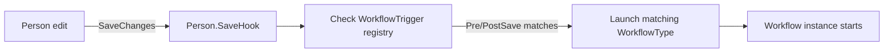

# Workflow Triggers

## Overview

A Workflow Trigger is the entity-event hook that launches a Workflow when something happens to a Rock entity. A `WorkflowTrigger` row says "when this entity type is saved (Pre or Post), with optional qualifier criteria, launch this WorkflowType." Save hooks across Rock check the trigger registry and launch matching workflows. The mechanism is the universal "fire on data change" extension point.

## Why It Exists

Hardcoding "fire workflow X when Person Y is saved" would lock the system to whatever events the team imagined. Trigger-as-data lets administrators wire any save event to any workflow without touching code. The mechanism is mature; almost every domain in Rock has triggers wired up for one workflow scenario or another.

The trigger model intentionally fires on entity-save events (not on arbitrary application events). Save events are the most reliable change signal: the database transaction is the source of truth, the save hook is guaranteed to run on every committed change. Ad-hoc "event bus" alternatives lose changes that bypass the bus.

## Mental Model

Triggers are checked during save-hook execution. PreSave triggers fire before the database write commits (used for validation that needs to abort the save). PostSave triggers fire after a successful commit (the typical case: react to a change that has already happened).

A trigger can be filtered by qualifier: only fire when the entity meets specific criteria (the WorkflowType has a Defined Person Connection Status, the Person's birthdate just changed). Qualifier evaluation happens in the trigger's `WorkflowTriggerService`.

## What You Need to Know

**Triggers fire on entity save.** Not on application-level events ("the user clicked a button"). For non-save events, use a different launch mechanism: a Workflow action in a previous workflow, a job that scans for conditions, an explicit launch from a block.

**`PreSave` triggers can abort the save.** The triggered workflow's first activity runs synchronously; if it throws or sets a particular state, the save can fail. Use sparingly; PreSave triggers add latency to every save.

**`PostSave` triggers fire after commit.** Cannot abort the save (it has already committed). Used for the typical "react to a change" pattern.

**Triggers can be qualified.** `WorkflowTrigger.EntityTypeQualifierColumn` and `EntityTypeQualifierValue` narrow the trigger to a subset (e.g., only Persons with a specific RecordTypeValueId). Without qualifiers, the trigger fires on every save of the entity type.

**Trigger evaluation is per save.** A bulk save of 1000 entities fires triggers 1000 times. Workflow launches in tight saves are expensive; consider whether the workflow needs to run per-row or whether a job sweep at the end of the bulk operation is more appropriate.

**Entity-save triggers cover the universal cases.** Person edit, Group join, GroupMember role change, transaction record - all are save events.

**Some domains have specialized trigger entities.** `GroupMemberWorkflowTrigger` and `ConnectionWorkflow` and `BenevolenceWorkflow` are domain-specific trigger tables that hook events more specific than entity-save (membership transitions, connection-status changes, benevolence approvals). The standard `WorkflowTrigger` covers entity-save; domain-specific triggers cover domain events.

**Group activity assignment respects member status (since `c64c42d4c2`).** Pre-fix, workflow activities assigned to a group were visible to inactive group members. The fix excludes non-active members from assignment evaluation.

**Custom code that needs trigger-like behavior should use the trigger system, not bypass.** Adding a save hook directly in a domain entity would couple the domain to a specific workflow; the trigger registry decouples them.

**Disabled WorkflowTypes are skipped.** A WorkflowType with `IsActive = false` does not fire even if a matching trigger exists. Useful for temporary disabling without deleting the trigger row.

**Triggers can be filtered by Age Classification or DataView (Connection-specific).** Connection workflows (per `90cae56911`) added filtering by Age Classification and include / exclude DataView filters. The standard WorkflowTrigger does not have these out of the box; domain-specific triggers can extend.

## Common Scenarios

**"Fire a workflow when a new Person is created."** WorkflowTrigger row with `EntityTypeId = Person`, `WorkflowTriggerType = PostSave`, `WorkflowTypeId = WelcomeWorkflow.Id`. Optional qualifier: only fire when `RecordTypeValueId = Person` (not Business or REST User).

**"Fire a workflow when a transaction is recorded."** Same shape with `EntityTypeId = FinancialTransaction`, `PostSave` trigger.

**"Validate before saving a Group."** PreSave trigger; the workflow runs synchronously and can fail the save by throwing.

**"Notify staff when an attribute value changes on a Person."** Entity-save trigger plus a workflow action that compares the original and new attribute values; only proceed if the value actually changed.

**"Fire on a Connection Request status change."** Use `ConnectionWorkflow` (the domain-specific trigger entity), not `WorkflowTrigger`. Configure on the Connection Type or Opportunity. Filter by Age Classification or DataView since `90cae56911`.

**"Disable a trigger temporarily."** Set `WorkflowTrigger.IsActive = false` (or set the WorkflowType to inactive). Re-enable later.

## Key Architectural Decisions

### Triggers tied to entity save events

Save events are the most reliable change signal. Application-level event-bus alternatives lose changes that bypass the bus.

### PreSave can abort, PostSave cannot

Reflects the lifecycle: PreSave runs before the database write, PostSave after.

### Qualifier-based filtering

Lets one trigger row narrow to a subset without fanning out across many rows.

### Domain-specific trigger entities for richer events

Connection-status changes, group-membership transitions, benevolence approvals do not map cleanly to entity-save. Domain triggers handle these explicitly.

### Trigger evaluation per save

Forces authors to consider the cost of triggers on bulk saves; some workflows are inappropriate as triggers and belong in jobs instead.

## Considered but Rejected

### Application-level event bus for triggers

Rejected. Bypassable; not all changes go through it.

### Async PreSave triggers

Rejected. Validation needs synchronous abort; async PreSave loses the abort capability.

### Auto-batching trigger fires for bulk saves

Rejected. Some workflows must run per-row; auto-batching would be wrong for those.

## Technical Reference

### Schema

`WorkflowTrigger`:
- `EntityTypeId` (the entity type whose saves should trigger)
- `EntityTypeQualifierColumn`, `EntityTypeQualifierValue` (optional narrowing)
- `WorkflowTriggerType` (PreSave / PostSave)
- `WorkflowTypeId` (the workflow to launch)
- `WorkflowName` (optional override for the launched workflow's name)
- `IsActive`

### Service / API

`WorkflowTriggerService`:
- Standard CRUD.
- `GetTriggers(entityTypeId, triggerType)`: lookup triggers for a given entity-save event.

### Domain-Specific Trigger Entities

| Entity | Domain | Triggers on |
|---|---|---|
| `GroupMemberWorkflowTrigger` | Group | Group member add/remove/role change |
| `ConnectionWorkflow` | Connection | Connection request lifecycle |
| `BenevolenceWorkflow` | Finance/Benevolence | Benevolence request lifecycle |
| `StepWorkflow`, `StepWorkflowTrigger` | Engagement | Step completion / change |

These are evaluated by domain-specific code, not the universal trigger registry.

### Affected Areas

Triggers fire from save hooks across Rock. The trigger registry is consulted in:
- `Person.SaveHook`
- `Group.SaveHook`
- `GroupMember.SaveHook`
- Many other entity save hooks.

### Related Docs

- [docs/workflow/workflow-overview.md](workflow-overview.md)
- [docs/workflow/the-runtime.md](the-runtime.md)
- [docs/workflow/writing-action-components.md](writing-action-components.md)
- [docs/core/save-hook-pattern.md](../core/save-hook-pattern.md)

## Recent Impactful Changes

- **2026-04-09** ([commit `c64c42d4c2`](https://github.com/SparkDevNetwork/Rock/commit/c64c42d4c2)). Group-assigned workflow activities no longer surface to inactive group members; activity-query filters by Group Member Status (Fixes #6757).
- **2025-07-30** ([commit `90cae56911`](https://github.com/SparkDevNetwork/Rock/commit/90cae56911)). Connection Type / Opportunity workflows can filter by Age Classification and include / exclude DataView filters.
