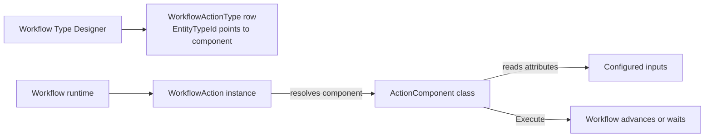

# Writing Workflow Action Components

## Overview

A Workflow Action Component is a C# class that implements one step's worth of behavior in a workflow: send an email, set an attribute, assign to a person, run SQL, launch another workflow. Each component subclasses `ActionComponent`, declares its configuration via attributes, and implements `Execute`. The component is registered as a Rock entity type; administrators reference it in `WorkflowActionType` rows when designing a workflow type.

Custom components are the primary extension point for workflow behavior. The runtime ships with dozens; new components plug in without touching core.

## Why It Exists

Hardcoding every possible workflow step would lock the system to whatever the team imagined; modeling the smallest pluggable unit as a component class lets administrators (or plugin authors) extend the workflow runtime without core changes. The component pattern is the same one used for FieldType, BadgeComponent, BackgroundCheckComponent, GatewayComponent, etc.: configuration-as-data plus a registered class implementation.

## Mental Model



When the runtime advances a workflow to an action:

1. Resolve the action's `WorkflowActionType.EntityTypeId` to the component class.
2. Instantiate the component.
3. Read attribute values configured on the action (URL, recipient, message body, etc.).
4. Call `Execute(rockContext, action, entity, errorMessages)`.
5. The component returns true (advance) or false (do not advance / handle errors).

## What You Need to Know

**Subclass `ActionComponent`.** The base class provides the standard plumbing: attribute resolution, error logging, the runtime entry point.

**Declare configuration via attributes on the class.** Standard `Field` attributes (`TextField`, `IntegerField`, `WorkflowAttribute`, `EntityTypeField`) on the class are the action's inputs. The Workflow Type Designer uses these to render the configuration UI for instances of the action.

**Configuration values come from `action.Attributes`.** At Execute time, read the configured values via `GetAttributeValue(action, "AttributeKey")`. Some inputs are static (set when designing the workflow type); others are workflow-attribute references (set when the workflow runs).

**Return true to advance, false to wait or fail.** A return of true means "this step is done, move to the next action." False means "something went wrong" or "wait for an external trigger." For wait semantics, also call `action.MarkComplete()` to NOT advance and `action.AddLogEntry()` for the runtime log.

**Idempotency is the component's responsibility.** The runtime can re-run an action in some failure scenarios (commit `852ab83da4` fixed an unintended double-activation, but framework-level exactly-once is not guaranteed). Components that talk to external systems must handle "I might be called twice" gracefully.

**Form actions are special.** A form-presentation action does not advance until human submission; this is the standard wait pattern.

**Long-running operations should not block.** A component that takes 10 seconds blocks the workflow runtime thread. For genuinely long operations, queue work for an async path and have the action complete immediately; a separate workflow step can wait for the async result.

**Logging is via `action.AddLogEntry`.** The workflow log captures these entries when the WorkflowType has logging enabled. Do NOT log inside tight loops; the log table grows fast.

**Errors should populate the `errorMessages` parameter.** The runtime collects them into the workflow's log and surfaces them on the workflow detail block.

**Custom components ship as plugins or in core.** Plugin authors create their own; core ships dozens in `Rock/Workflow/Action/`. Discovery is via `EntityType` registration; the workflow designer auto-detects new components.

**Recent additions:** Chat Channel Message Send and Chat Direct Message Send (commit `6774847b62`, 2025-10-29) added two new built-in action types tied to the Chat system. They illustrate the pattern: implement the component, register the EntityType.

## Common Scenarios

**"Build a custom action that sends a Slack message."**

```csharp
public class SendSlackMessage : ActionComponent
{
    [TextField( "Channel", "The Slack channel name", true, "", "", 0 )]
    public const string ChannelKey = "Channel";

    [TextField( "Message", "The message body", true, "", "", 1 )]
    public const string MessageKey = "Message";

    public override bool Execute( RockContext rockContext, WorkflowAction action, object entity, out List<string> errorMessages )
    {
        errorMessages = new List<string>();
        var channel = GetAttributeValue( action, ChannelKey );
        var message = GetAttributeValue( action, MessageKey );
        try
        {
            // call Slack API
            return true;
        }
        catch ( Exception ex )
        {
            errorMessages.Add( ex.Message );
            return false;
        }
    }
}
```

Register the EntityType. Add as a `WorkflowActionType` in any workflow.

**"Resolve a workflow attribute reference."** Many configuration inputs let admins pick "use a workflow attribute" via a `WorkflowAttribute` field. Read the configured key, then resolve through `action.GetWorkflowAttributeValue(key)`.

**"Wait for an external system to call back."** Component returns false (or sets activated state) without advancing. Some external trigger (REST endpoint, webhook, separate workflow) re-enters the workflow and completes the action.

**"Handle errors that are recoverable."** Add to `errorMessages`, return false. The workflow surfaces the errors; an admin can re-run.

**"Test a custom component."** Mock the WorkflowAction and RockContext; instantiate the component; call Execute; assert behavior.

## Key Architectural Decisions

### Component pattern for action types

Hardcoded steps would lock the system; pluggable components match the rest of Rock's extension model.

### Configuration via attributes

Same authoring path as field types and other components. Attributes describe inputs; the designer renders them.

### Idempotency is the component's responsibility

Framework-level exactly-once is not guaranteed; the cost of guaranteeing it is too high. Components must defend against re-runs.

### Sync execution model

Long-running components block the runtime thread by design; this keeps the runtime simple. Async work is the component's responsibility (queue and complete fast).

### Logging via `AddLogEntry`

Centralized log path lets the WorkflowType-level logging policy gate the actual writes.

## Considered but Rejected

### Async by default

Rejected. Most actions are fast; async would multiply complexity for negligible benefit. Long-running components handle async themselves.

### Auto-retry on failure

Rejected. Hides component bugs and invites unexpected behavior with non-idempotent components.

### Component registration via configuration files

Rejected. EntityType registration is the standard Rock pattern.

## Technical Reference

### `ActionComponent` Base

Provides:
- `GetAttributeValue(action, key)`: read a configured value.
- `GetActionAttributeValue(action, key)`: read action-instance-level attribute.
- `AddLogEntry`: log to the workflow log.
- Standard EntityType integration.

### Standard Idiom

```csharp
[ActionCategory( "My Domain" )]
[Description( "Sends a Slack message." )]
[Export( typeof( ActionComponent ) )]
[ExportMetadata( "ComponentName", "Send Slack Message" )]
[TextField( "Channel", "...", true, "", "", 0 )]
[TextField( "Message", "...", true, "", "", 1 )]
public class SendSlackMessage : ActionComponent
{
    public override bool Execute( RockContext rockContext, WorkflowAction action, object entity, out List<string> errorMessages )
    {
        // ... implementation ...
    }
}
```

### Built-in Action Types (selected from `Rock/Workflow/Action/`)

The directory has dozens. Common categories:

- Communication: Send Email, Send SMS, Send Push Notification, Send Chat Message.
- Data: Set Attribute Value, Get Attribute Value, Set Person Attribute, Get Person From Fields.
- Workflow: Activate Workflow, Activate Activity, Complete Workflow.
- Group: Add Person To Group, Remove Person From Group, Update Group Member Status.
- Form: Form Builder action types.
- HTTP: HTTP Request, REST Connect.
- SQL: Run SQL.

### Affected Areas

Custom components become available in the Workflow Type Designer immediately on registration. Existing Workflow Types do not need editing to use new components; admins reference them in new actions.

### Related Docs

- [docs/workflow/workflow-overview.md](workflow-overview.md)
- [docs/workflow/the-runtime.md](the-runtime.md) for the lifecycle that calls Execute.
- [docs/workflow/workflow-triggers.md](workflow-triggers.md) for how workflows get launched.

## Recent Impactful Changes

- **2025-10-29** ([commit `6774847b62`](https://github.com/SparkDevNetwork/Rock/commit/6774847b62)). New action types: Chat Channel Message Send, Chat Direct Message Send.
- **2025-06-09** ([commit `852ab83da4`](https://github.com/SparkDevNetwork/Rock/commit/852ab83da4)). Fixed an issue where a workflow activity could be unexpectedly activated a second time during the Process Workflows job (Fixes #6289). Component idempotency is still the author's responsibility but the framework-level double-activation case is fixed.
