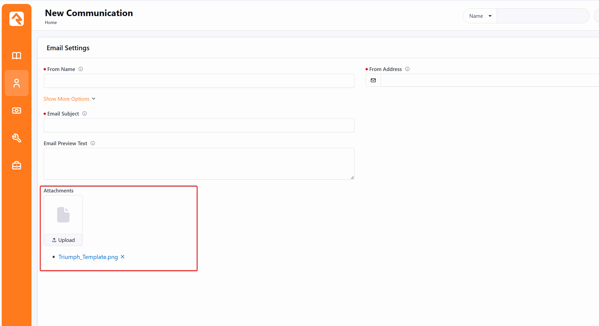
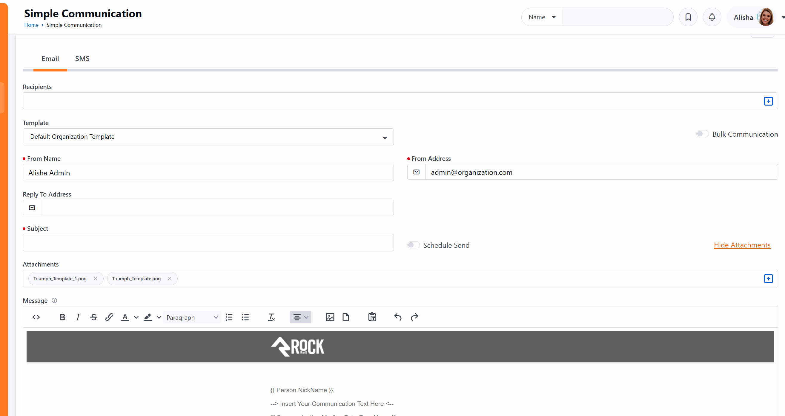
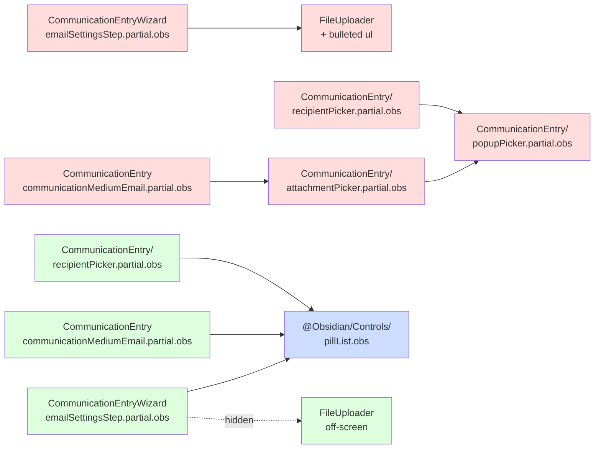

# Communication Wizard Attachment UI Consistency

## Summary

The Communication Wizard's **Email Settings → Attachments** field renders a card-style `FileUploader` placeholder followed by a bulleted list of attached files, while the newer Simple Communication block renders attachments as a horizontal row of rounded-pill chips with a `+` add button and a Hide/Show toggle. This spec replaces the wizard's attachment UI with the shared [`PillList`](Rock.JavaScript.Obsidian/Framework/Controls/pillList.obs) framework control, which already provides chips, a `+` add button, an `x` remove affordance per chip, and a built-in expand/collapse toggle that maps onto the "Hide/Show Attachments" behavior. The Simple Communication block's email-attachment UI is migrated to the same control so both blocks render attachments identically. As a small framework enhancement, this spec also makes the existing "X more" overflow pill clickable by adding a new `onMoreClick: () => void` callback prop so that future migrations such as the recipient picker can wire the overflow into a "view all" modal.

## Motivation

Rock has two email composition experiences: the legacy-feeling **Communication Wizard** (`communicationEntryWizard.obs`) and the newer **Simple Communication** block (`communicationEntry.obs`). They share the same data model (`EmailAttachmentBinaryFiles: List<ListItemBag>`) but render attachments very differently. Users moving between blocks see a different visual vocabulary, and the wizard's variant occupies more vertical space and forces a separate "Upload" affordance instead of inline pill-chip selection. The Asana task ([DEV-12482](https://app.asana.com/1/20866866924293/project/1208321217019996/task/1212839478042383)) is the product team's call to converge on the chip/pill pattern.

Rock already ships a generic `PillList` framework control (`@Obsidian/Controls/pillList.obs`) that delivers all three target affordances out of the box: chips with optional remove buttons, an optional `+` add button, and an optional expand/collapse toggle. Using it in both blocks lets us delete the wizard's bespoke `FileUploader`-plus-bulleted-list UI and the Simple Communication block's local `attachmentPicker.partial.obs` in a single move, removing duplication instead of just shifting it.

### Current (Communication Wizard)

### Target (Simple Communication)

## Requirements

- `PillList` MUST gain a new `onMoreClick` prop typed as `Function as PropType<(() => void) | undefined>` with `default: undefined`. This follows the established Obsidian framework pattern for optional callbacks (see `barChart.obs`'s `tooltip` / `tooltipTitle` props for prior art). The `on` prefix is intentional: Vue's listener syntax compiles `@moreClick="handler"` to `onMoreClick: handler` on the vnode props, so consumers can write the natural `@moreClick="handler"` (or `:onMoreClick="handler"`) and both forms resolve to this prop. When the prop is defined, the "X more" overflow indicator pill (already shown conditionally by `isOverflowIndicatorShown`) MUST be clickable and MUST invoke the callback on click without changing PillList's internal expand state. When the prop is `undefined`, the overflow pill MUST render exactly as it does today (no clickable affordance, no cursor pointer, no hover state). `onMoreClick` and `canExpand` MAY coexist: the chevron button still expands inline; the overflow pill invokes the callback for parents that want to open a modal instead.
- The Communication Wizard's Email Settings step MUST render its email attachments using the shared `PillList` framework control with `canAdd=true`, `canRemove=true`, and `canExpand=true`. The expand/collapse button surfaces only when chips overflow the row, which is the desired "Hide / Show Attachments" behavior.
- The Simple Communication block's email attachment UI MUST also be migrated to `PillList` with the same configuration so both blocks render attachments identically. The local `attachmentPicker.partial.obs` SHOULD be deleted once it has no other consumers.
- The wizard's `@add` handler MUST trigger a hidden / off-screen `FileUploader` instance to preserve today's upload behavior, including `binaryFileTypeGuid` and max-file-size enforcement.
- The Simple Communication block's `@add` handler MUST open the existing async-picker flow over existing binary files (the same flow `attachmentPicker.partial.obs` invokes today).
- The change MUST preserve the existing data shape: the bag property `EmailAttachmentBinaryFiles: List<ListItemBag>` continues to be the source of truth, with no C# bag changes.
- Each pill MUST display the attached file's name (`item.text`) and provide an `x` to remove that file from the attachment list.
- The change MUST NOT alter the wizard's SMS attachment UI in this iteration; SMS lives in a separate step and uses its own bag property (`SmsAttachmentBinaryFiles`). Out of scope.
- The Simple Communication block's recipient picker MUST also be migrated to `PillList`. The custom-pill rendering is implemented via PillList's `#item` slot so that each recipient chip continues to display:
  - A `default` or `danger` token color based on whether the recipient can receive the chosen medium (replicating today's `label-default` / `label-danger` behavior).
  - The recipient's photo avatar inline.
  - A reactive tooltip explaining why the recipient is invalid, when applicable.
  - An `x` to remove that recipient from the list.
- The recipient picker's `+` (add) button MUST continue to open the existing `PersonPicker`. The "X more" overflow pill MUST open the existing `RecipientModal` via the new `onMoreClick` prop, wired with `@moreClick` listener syntax in the consumer template.
- After both attachment migrations and the recipient migration, [popupPicker.partial.obs](Rock.JavaScript.Obsidian.Blocks/src/Communication/CommunicationEntry/popupPicker.partial.obs) MUST have no remaining consumers and MUST be deleted.

## Design

### Surface area

- **Wizard partial that renders attachments today:** [emailSettingsStep.partial.obs:82-94](Rock.JavaScript.Obsidian.Blocks/src/Communication/CommunicationEntryWizard/emailSettingsStep.partial.obs:82) — uses `FileUploader` plus a bulleted `<ul>` list. Imports `FileUploader` from `@Obsidian/Controls/fileUploader.obs` and wires `onAttachmentAdded()` / `onAttachmentRemoved()`.
- **Simple Communication partial that renders attachments today:** [communicationMediumEmail.partial.obs:163-181](Rock.JavaScript.Obsidian.Blocks/src/Communication/CommunicationEntry/communicationMediumEmail.partial.obs:163) — wraps a local `AttachmentPicker` ([attachmentPicker.partial.obs](Rock.JavaScript.Obsidian.Blocks/src/Communication/CommunicationEntry/attachmentPicker.partial.obs)), which in turn wraps [popupPicker.partial.obs](Rock.JavaScript.Obsidian.Blocks/src/Communication/CommunicationEntry/popupPicker.partial.obs).
- **Shared framework control to use:** [pillList.obs](Rock.JavaScript.Obsidian/Framework/Controls/pillList.obs) — generic over `T`, takes `modelValue: T[]`, exposes `canAdd` / `canRemove` / `canExpand` props, emits `add` and `remove` events, and provides `#item` and `#itemContent` slots for custom pill content. Already used by other blocks (see [pillListGallery.partial.obs](Rock.JavaScript.Obsidian.Blocks/src/Example/ControlGallery/pillListGallery.partial.obs) for usage reference).
- **Bags (already aligned, no C# changes needed):**
  - Wizard: [CommunicationEntryWizardCommunicationBag.cs:163](Rock.ViewModels/Blocks/Communication/CommunicationEntryWizard/CommunicationEntryWizardCommunicationBag.cs:163) — `EmailAttachmentBinaryFiles: List<ListItemBag>`.
  - Simple: [CommunicationEntryCommunicationBag.cs:233](Rock.ViewModels/Blocks/Communication/CommunicationEntry/CommunicationEntryCommunicationBag.cs:233) — same property name and shape.

### Proposed approach

0. In [pillList.obs](Rock.JavaScript.Obsidian/Framework/Controls/pillList.obs):
   - Add a new `onMoreClick` prop typed as `Function as PropType<(() => void) | undefined>` with `default: undefined`, following the framework's existing optional-callback pattern. The `on` prefix lets consumers use Vue's `@moreClick="handler"` listener syntax in addition to the explicit `:onMoreClick="handler"` form.
   - In the template, toggle a `clickable` class on the existing `.overflow-indicator` element based on `!!onMoreClick`, and bind `@click="onMoreClick?.()"` directly. Add scoped CSS so that `.overflow-indicator.clickable` shows `cursor: pointer` and, on hover, transitions the inner pill's `border-color` to `var(--color-interface-strong)` (a stronger contrast against the default soft border). When `onMoreClick` is undefined, the indicator has no `clickable` class and renders exactly as it does today.
   - Update the gallery ([pillListGallery.partial.obs](Rock.JavaScript.Obsidian.Blocks/src/Example/ControlGallery/pillListGallery.partial.obs)) to expose a new toggle setting (Switch) labeled something like "Wire moreClick?" that controls whether the callback is supplied to the demo `<PillList>`. When the toggle is on, the handler calls `alert("More Clicked!")`. When the toggle is off, no handler is bound (so the overflow pill renders without the clickable affordance). Implement the conditional via a small computed: `const moreClickHandler = computed(() => isMoreClickEnabled ? onMoreClick : undefined);`, then bind it in the template as `@moreClick="moreClickHandler"`. Update the example code string to reflect `@moreClick="onMoreClick"` so the help text matches. This lets developers flip the toggle and observe the conditional clickability of the overflow pill at the same time as they trigger the alert.
1. In the wizard's [emailSettingsStep.partial.obs](Rock.JavaScript.Obsidian.Blocks/src/Communication/CommunicationEntryWizard/emailSettingsStep.partial.obs):
   - Remove the visible `FileUploader` and the bulleted `<ul>` block (lines 82-94).
   - Import `PillList` from `@Obsidian/Controls/pillList.obs`.
   - Bind `:modelValue="emailAttachmentBinaryFiles"` (or whichever ref backs the bag property) and set `canAdd`, `canRemove`, and `canExpand` to `true`.
   - Use the `#itemContent` slot to render `item.text` (the filename) inside each pill.
   - Keep a hidden / off-screen `FileUploader` instance in the same partial. Wire `PillList`'s `@add` event to programmatically click that uploader's file input so the existing upload flow (validation, `binaryFileTypeGuid`, max-file-size) runs unchanged. Wire the uploader's "file uploaded" callback to push onto the model array.
   - Wire `@remove` to the existing remove handler.
2. In the Simple Communication block's [communicationMediumEmail.partial.obs](Rock.JavaScript.Obsidian.Blocks/src/Communication/CommunicationEntry/communicationMediumEmail.partial.obs):
   - Replace the `AttachmentPicker` import + usage with the same `PillList` import + usage, wired to `EmailAttachmentBinaryFiles`.
   - Wire `@add` to invoke the existing binary-file-picker flow (whatever modal or async picker the current `AttachmentPicker` opens internally — extract that logic out of `AttachmentPicker` into the parent partial as the `attachmentPicker.partial.obs` file is deleted).
3. Delete [attachmentPicker.partial.obs](Rock.JavaScript.Obsidian.Blocks/src/Communication/CommunicationEntry/attachmentPicker.partial.obs) once it has no other consumers in the block. Confirm via repo-wide grep before deleting.
4. In [recipientPicker.partial.obs](Rock.JavaScript.Obsidian.Blocks/src/Communication/CommunicationEntry/recipientPicker.partial.obs):
   - Replace the `PopupPicker` import + usage with `PillList` plus a custom `#item` slot.
   - Render each chip as a `<Pill>` with `tokenType="danger"` when the recipient can't receive the medium (else `default`), `tooltip` from the existing `getTooltipRef` helper, and an inline `` for the photo when present.
   - Wire `@add` to the existing `onOpenPopupClicked` (opens `PersonPicker`).
   - Wire `@remove` to a new handler that splices the recipient out of `props.modelValue` and emits `update:modelValue`.
   - Wire `@moreClick` to a new handler that sets `isRecipientModalShown.value = true` (opens `RecipientModal`).
   - Drop the `recipientListItems` ref and its two watchers; replace with a `computed<ListItemBag[]>` derived from `props.modelValue`. The `getArrayDiff` / `updateArray` helpers and `getListItemBagGuidSet` are no longer needed in this partial.
5. Delete [popupPicker.partial.obs](Rock.JavaScript.Obsidian.Blocks/src/Communication/CommunicationEntry/popupPicker.partial.obs). Confirm via repo-wide grep that no other partial in the same folder imports it before deleting.
6. Validate that the wizard's "Show More Options" collapse, save-draft round-trip, and final send all continue to surface attachments correctly; that Simple Communication's existing async-picker flow still functions through the new `@add` handler; and that the recipient picker still opens `PersonPicker` on `+`, opens `RecipientModal` on the overflow pill, and renders danger-state recipients with the same visual styling as before.

## Out of Scope

- **Migrating the SMS attachment UI** in either block. SMS attachments use a separate bag property (`SmsAttachmentBinaryFiles`) and a different step in the wizard.
- **Other consumers of `popupPicker.partial.obs` outside `CommunicationEntry/`.** A repo-wide grep before deletion confirms scope; if a future block adds an import, the deletion would have to wait. As of writing, the only consumers are `attachmentPicker` (deleted earlier in this spec) and `recipientPicker` (migrated by this spec).

## Considered but Rejected

### Promote the local `attachmentPicker` / `popupPicker` partials to a shared folder
Rejected. Initial draft of this spec proposed relocating the local partials into a shared `Communication/Shared/` directory so both blocks could import them. Switching to the existing `PillList` framework control achieves the same consistency goal without introducing a new shared-folder convention and without keeping the bespoke implementation alive. Less code, more reuse of an already-used framework primitive.

### Duplicate the picker partials into `CommunicationEntryWizard/`
Rejected. Doubles the maintenance surface for an attachment-chip UI that the framework already provides. Two implementations of the same chip pattern is exactly the inconsistency the task is trying to remove.

### Restyle the existing `FileUploader` to look like chips instead of replacing it
Rejected. `FileUploader` is used elsewhere in Rock and changing its visual contract would have unintended ripple. The chip/pill UI is structurally a list-of-tags presentation, not a drop target — `PillList` is the right primitive. Note: the wizard still uses `FileUploader` internally as a hidden file-picker driver, but its visual contract is unchanged.

### Add a toggle attribute to the wizard's existing UI to render either old or new shape
Rejected. Backward-compat shim with no real upside; v20 is a single-version change and there is no plugin surface broken by replacing the partial outright. The Prime Directive says to follow established patterns, and the existing established pattern in the framework is `PillList`.

## Related

- Asana: [DEV-12482 "Make Attachments Consistent"](https://app.asana.com/1/20866866924293/project/1208321217019996/task/1212839478042383) (canonical requirements; the two reference screenshots in `artifacts/` were exported from this task on 2026-05-06).
- Framework control: [pillList.obs](Rock.JavaScript.Obsidian/Framework/Controls/pillList.obs)
- Usage example: [pillListGallery.partial.obs](Rock.JavaScript.Obsidian.Blocks/src/Example/ControlGallery/pillListGallery.partial.obs)
- Source (wizard, current): [emailSettingsStep.partial.obs](Rock.JavaScript.Obsidian.Blocks/src/Communication/CommunicationEntryWizard/emailSettingsStep.partial.obs)
- Source (simple, current): [communicationMediumEmail.partial.obs](Rock.JavaScript.Obsidian.Blocks/src/Communication/CommunicationEntry/communicationMediumEmail.partial.obs)
- Source (to remove): [attachmentPicker.partial.obs](Rock.JavaScript.Obsidian.Blocks/src/Communication/CommunicationEntry/attachmentPicker.partial.obs)
- Source (to remove): [popupPicker.partial.obs](Rock.JavaScript.Obsidian.Blocks/src/Communication/CommunicationEntry/popupPicker.partial.obs)
- Source (to migrate): [recipientPicker.partial.obs](Rock.JavaScript.Obsidian.Blocks/src/Communication/CommunicationEntry/recipientPicker.partial.obs)
- Bag: [CommunicationEntryWizardCommunicationBag.cs](Rock.ViewModels/Blocks/Communication/CommunicationEntryWizard/CommunicationEntryWizardCommunicationBag.cs)
- Bag: [CommunicationEntryCommunicationBag.cs](Rock.ViewModels/Blocks/Communication/CommunicationEntry/CommunicationEntryCommunicationBag.cs)
