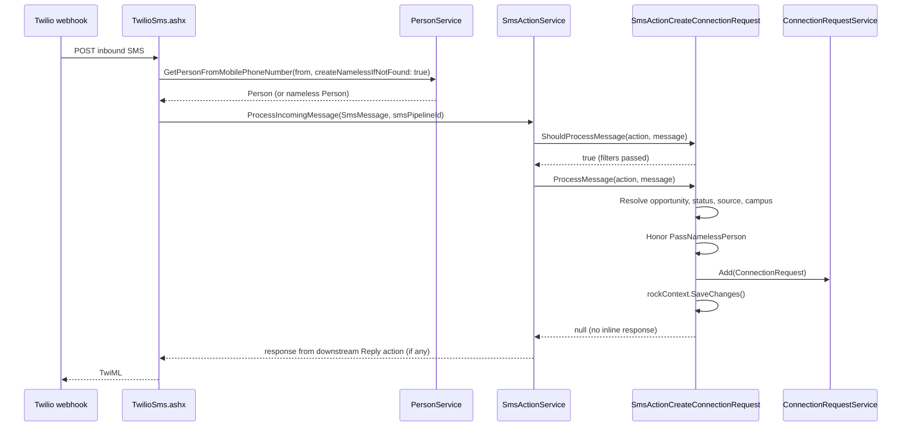

# Create Connection Request SMS Action

## Summary

Add a new `SmsActionCreateConnectionRequest` component to Rock's SMS pipeline so an inbound text message can create a Connection Request without needing a workflow as an intermediary. The action mirrors `SmsActionLaunchWorkflow` in shape: it filters by phone number and message body, resolves the inbound person (with nameless-person handling), and writes a `ConnectionRequest` row to the configured Connection Opportunity. Configuration lives on the `SmsAction` entity through the standard component attribute pattern, so no new admin UI is required for the feature itself. A separate effort to convert `SmsPipelineDetail.ascx` to Obsidian is estimated below.

## Motivation

Today, churches that want to capture a Connection Request from an inbound text have to chain two configurations together: an SMS pipeline action (Launch Workflow) and a workflow whose only real job is to call the existing `Rock.Workflow.Action.Connections.CreateConnectionRequest` workflow action. That double-hop is friction for staff, doubles the number of moving parts to debug when something breaks, and gives the message body a long path before it lands as `ConnectionRequest.Comments`. The Launch Workflow shape is already proven and the Connection Request entity model is stable, so a direct SMS-action shortcut is straightforward to build and removes the workflow-as-glue requirement.

## Requirements

### Registration and filters

The new action MUST:

- Register itself as a MEF `SmsActionComponent` with `[Export]` and `[ExportMetadata("ComponentName", "Create Connection Request")]`, identical to the registration pattern used by `SmsActionLaunchWorkflow.cs`.
- Carry a stable `[Rock.SystemGuid.EntityTypeGuid("...")]` so per-instance attribute values survive component metadata updates.
- Inherit the `PhoneNumbers` filter from `SmsActionComponent` and add a `Message` body filter (`TextValueFilterField`), matching Launch Workflow's filter shape.

### Per-action settings

The new action MUST expose the following settings, categorized for UX parity with Launch Workflow:

- **`ConnectionTypeSettings`** (required for this SMS action). A single attribute backed by a new composite field type (see Design) that internally renders four pickers: Connection Type (parent), Connection Opportunity, Connection Status, Connection Type Source. The three child pickers are filtered to the parent Type's scope. All four slots are persisted as nullable GUIDs (`type-guid|opportunity-guid|status-guid|source-guid`); the field type permits any combination of nulls. The SMS action layers its own non-null requirement on top: the Opportunity slot must be set at runtime.
- **`Campus`** (optional, `CampusField`). Overrides the inbound person's `PrimaryCampusId`.
- **`CommentTemplate`** (optional, Lava-enabled `CodeEditor`). Lava template merged into `connectionRequest.Comments`. Default value: `{{ Message }}`.
- **`PassNamelessPerson`** (boolean, default `true`). Same semantics as Launch Workflow's setting of the same name.

### Behavior

The new action MUST:

- Refuse to process the message and return a structured `errorMessage` when the configured Connection Opportunity cannot be resolved (deleted, deactivated, or never set).
- Honor `PassNamelessPerson`. When `false` and `message.FromPerson.IsNameless()` is `true`, set `errorMessage`, return `null`, and write nothing.
- Use the same status-fallback chain as `Rock.Workflow.Action.Connections.CreateConnectionRequest`: explicit Status from `ConnectionTypeSettings`, then the first `IsDefault` status on the opportunity's connection type.
- Use the same campus-fallback chain: explicit `Campus` setting, then `fromPerson.PrimaryCampusId`, then null (allowed).
- Set `ConnectionTypeSourceId` from the Source slot of `ConnectionTypeSettings` when present. The cascade in the picker guarantees the source belongs to the chosen Type, so no runtime cross-type validation is needed.
- Set `ConnectorPersonAliasId` from `ConnectionOpportunity.GetDefaultConnectorPersonAliasId( campusId )`, matching the workflow action.
- Lava-merge `CommentTemplate` against the inbound `SmsMessage` (which implements `ILavaDataDictionary`) and `message.FromPerson`. Reuse the merge approach in `SmsActionReply.cs:198`.
- Save the new `ConnectionRequest` in a single `RockContext.SaveChanges()` call, with audit columns populated by Rock's normal `Model<T>` plumbing.
- Set `ConnectionState = ConnectionState.Active` and `ConnectionTypeId = opportunity.ConnectionTypeId`.
- Return `null` from `ProcessMessage`. Sending an outbound acknowledgement is the responsibility of a downstream `Reply` action in the pipeline, not this action.

The new action SHOULD:

- Surface the same kind of structured error messages that Launch Workflow does so SMS pipeline tracing remains useful.
- Live alongside the other actions at `Rock\Communication\SmsActions\SmsActionCreateConnectionRequest.cs` so future maintainers find it next to `SmsActionLaunchWorkflow.cs`.
- Ship with a unit test covering: (1) successful creation with a known person, (2) creation with a nameless person when `PassNamelessPerson = true`, (3) blocked creation with a nameless person when `PassNamelessPerson = false`, (4) opportunity-not-found error path.

The new action MAY:

- In a follow-up release, create a `ConnectionRequestActivity` row recording "Created via SMS" with the inbound number. Not in v1; see Out of Scope.

## Design

### Component shape

```csharp
[Description( "Creates a connection request from an inbound SMS message." )]
[Export( typeof( SmsActionComponent ) )]
[ExportMetadata( "ComponentName", "Create Connection Request" )]
[Rock.SystemGuid.EntityTypeGuid( "<NEW UPPERCASE GUID>" )]
public class SmsActionCreateConnectionRequest : SmsActionComponent
{
    public override string IconCssClass => "fa fa-handshake";
    public override string Title => "Create Connection Request";
    public override string Description => "Creates a connection request from an inbound SMS message.";
    // ...attribute declarations...
}
```

Registration is automatic. `SmsActionContainer.Refresh()` (`Rock\Communication\SmsActions\SmsActionContainer.cs:53`) picks up new MEF components on app start and creates the per-action `Attribute` records. The existing `SmsPipelineDetail.ascx` admin UI lists "Create Connection Request" in the action-type dropdown without code changes.

### Pipeline flow



### Field resolution rules

| Field on `ConnectionRequest` | Source |
|---|---|
| `PersonAliasId` | `message.FromPerson.PrimaryAliasId` (after `PassNamelessPerson` check) |
| `ConnectionOpportunityId` | Opportunity slot of `ConnectionTypeSettings` |
| `ConnectionTypeId` | `opportunity.ConnectionTypeId` |
| `ConnectionStatusId` | Status slot of `ConnectionTypeSettings`, falling back to `opportunity.ConnectionType.ConnectionStatuses.First( s => s.IsDefault )` |
| `ConnectionState` | `ConnectionState.Active` |
| `ConnectionTypeSourceId` | Source slot of `ConnectionTypeSettings`, or null |
| `CampusId` | `Campus` setting, falling back to `fromPerson.PrimaryCampusId`, or null |
| `ConnectorPersonAliasId` | `opportunity.GetDefaultConnectorPersonAliasId( campusId )` |
| `Comments` | Lava-merged `CommentTemplate` (default `{{ Message }}`) |

### Composite field type

A new field type, `ConnectionTypeSettingsFieldType`, is the heart of the configuration UX. It is modeled directly on `StepProgramStepTypeFieldType` (`Rock\Field\Types\StepProgramStepTypeFieldType.cs`) and `StepProgramStepStatusFieldType`, the established Rock pattern for "composite field type with internal cascade."

**What it stores conceptually:** an aggregate of selections scoped to a single Connection Type. The three child slots (Opportunity, Status, Source) are sibling children of `ConnectionType`. Each carries its own `ConnectionTypeId`, and they are not nested under one another. The Type itself is also persisted as the fourth slot, not because it cannot be derived from the children (it can), but because storing it explicitly gives the field type an authoritative anchor against which to verify the children on load. If a future migration moved an Opportunity to a different Type, the persisted Type would surface the drift instead of silently following it. All four slots are nullable; the field type permits partial fills, and individual consumers (such as this SMS action) layer their own non-null requirements on top.

**Naming rationale.** Rock's `{Parent}{Leaf}` field-type naming convention (`StepProgramStepTypeFieldType`) assumes a single leaf. With three sibling leaves under a single parent, naming by enumeration is impractical (`ConnectionTypeOpportunityStatusSourceFieldType`), and naming by parent plus one leaf falsely implies the other two are nested under it (`ConnectionTypeOpportunityFieldType` would suggest Source and Status hang off the Opportunity, which is structurally false). Naming by parent plus an aggregate noun (`ConnectionTypeSettings`) stays parent-anchored, doesn't privilege any sibling, and keeps the field type neutral about consumer intent so that workflow actions, block attributes, or any other consumer that needs typed-scope Connection picks can reuse it without the name implying a specific use case. The implementation pattern (composite plus cascading picker) matches the StepProgram precedent exactly; only the name shape differs because the storage is a sibling-aggregate rather than a parent-and-leaf chain.

`Settings` was chosen over `Selection` and `Reference` because it is in Rock's working vocabulary (block settings, attribute settings, pipeline settings) and reads correctly to anyone scanning `Rock\Field\Types\`. `Selection` would be technically more precise (the picked value is a selection; the field type's qualifiers are its settings), but there is no `*SelectionFieldType` precedent in Rock today.

**Storage.**

- **Private value** (database): pipe-delimited GUIDs in fixed slot order, `type-guid|opportunity-guid|status-guid|source-guid`. Empty slots are allowed for any position (e.g. `type-guid|opportunity-guid||source-guid` if Status was not chosen). Mirrors the `StepProgram.Guid|StepType.Guid` shape, extended to four slots.
- **Public edit value** (over the wire): JSON object with `ListItemBag` instances per pick, each nullable:
  ```json
  {
    "connectionType": { "value": "guid", "text": "..." } | null,
    "connectionOpportunity": { "value": "guid", "text": "..." } | null,
    "connectionStatus": { "value": "guid", "text": "..." } | null,
    "connectionTypeSource": { "value": "guid", "text": "..." } | null
  }
  ```
- **Editor load:** the persisted Type drives the picker's parent dropdown directly, and the children render filtered to that Type. On load, the field type SHOULD verify each non-null child's `ConnectionTypeId` matches the persisted Type. On mismatch, surface a warning in the editor (the most likely cause is data drift from a migration). Concrete drift-handling policy is implementation detail (clear the drifted child, re-pin to the child's actual Type, flag for explicit user re-confirmation); the requirement is that drift is *visible*, not silently accepted.

**Editor.** A new `connectionTypeSettingsPicker.obs` Vue control composes one Type picker and three child pickers (Opportunity, Status, Source) and owns the cascade with `v-if="connectionTypeGuid"` plus a `watch` on the Type picker that clears all three children when the Type changes. The shape mirrors `stepProgramStepTypePicker.obs:3-26, 85-103`, extended from one child to three siblings. The Type picker reflects the persisted Type slot directly rather than being derived.

**Platform support.** `[RockPlatformSupport( WebForms, Obsidian )]` to match the parent precedent. The WebForms editor uses Rock's existing `ConnectionTypePicker`, `ConnectionOpportunityPicker`, and similar controls, wiring up a postback-driven cascade in code-behind the same way `StepProgramStepStatusFieldType`'s WebForms `EditControl` does. Cost is real but bounded; precedent removes design risk.

**Why a composite, not three separate field types with reactive qualifiers.** Rock's generic attribute editor does not support runtime cross-attribute qualifier filtering (verified by inspecting `Rock\Attribute\` for any `DependsOn`-style mechanism; no such pattern exists). The composite approach moves the cascade *inside one field type*, which makes it work in any host: the existing WebForms `SmsPipelineDetail.ascx`, the future Obsidian conversion, workflow actions, block attributes, and so on. No host-block changes required.

**Why Type IS persisted (despite being derivable).** Storing Type explicitly turns the persisted value into a self-validating record. Each child slot is checked against the persisted Type on load; any mismatch is surfaced as a drift warning instead of silently following the child's current Type. This trades a small amount of denormalization for visibility into integrity issues, useful in a system where migrations and admin edits regularly reshape Connection metadata.

### Forward-looking design

The field type is intended to grow into a configurable base for typed-scope Connection picks. Two evolutions are anticipated and the v1 file layout should leave room for both:

1. **Qualifier-driven sub-picker visibility.** `ConnectionTypeSettingsFieldType` will gain qualifiers controlling which sub-pickers appear in the editor (`showOpportunity`, `showStatus`, `showSource`, all defaulting to true). Consumers that only care about a subset can hide irrelevant slots without forking the field type. The persisted shape stays the same; hidden slots simply persist as null.
2. **Specific pickers reusing the same control.** The underlying `connectionTypeSettingsPicker.obs` should be authored as a composable Vue control that future single-purpose pickers (`connectionTypeSourcePicker.obs`, `connectionTypeOpportunityPicker.obs`) can use as a base or shared building block. The cascade and Type-derivation logic live in one place; specialized pickers slot in with reduced visibility surface.

These are explicitly not v1 work. v1 ships the field type with all four pickers visible and no qualifiers. Capture the extensibility intent in code comments at the top of the field type and picker so future contributors don't strip the hooks during a refactor.

### File touch list

- New: `Rock\Communication\SmsActions\SmsActionCreateConnectionRequest.cs`. The SMS action component.
- New: `Rock\Field\Types\ConnectionTypeSettingsFieldType.cs`. The composite field type. Implements `IEntityReferenceFieldType` for proper indexing of the up-to-four referenced entities (mirrors `StepProgramStepTypeFieldType`).
- New: `Rock.JavaScript.Obsidian\Framework\Controls\connectionTypeSettingsPicker.obs`. The cascading picker control.
- New: `Rock.JavaScript.Obsidian\Framework\FieldTypes\connectionTypeSettingsFieldComponents.ts`. The Obsidian field-type editor wrapping the picker (thin, pattern from `stepProgramStepTypeFieldComponents.ts`).
- New: SystemGuid entries for the new field type and the SMS action component.
- New: hotfix plugin migration registering the new field type entity-type row (the field type GUID must be a SQL-known row, like every other field type).
- Tests: `Rock.Tests.Integration\Communication\SmsActionCreateConnectionRequestTests.cs` (new file).

No changes to:

- `SmsActionComponent`, `SmsActionContainer`, `SmsActionService`, `SmsMessage`, `SmsActionCache`.
- `ConnectionRequest` entity, `ConnectionRequestService`, any Connection migrations.
- `RockWeb\Webhooks\TwilioSms.ashx` (the inbound webhook is unchanged).
- The SMS Pipeline admin UI (the new component shows up via MEF discovery).

## Resolved Questions

Captured for traceability. All sub-questions raised during the spec drafting have been answered.

1. **Composite field-type design.**
   - **Name and location:** `Rock\Field\Types\ConnectionTypeSettingsFieldType.cs`. Parent-anchored aggregate noun avoids falsely privileging any sibling and keeps the field type consumer-neutral. The implementation pattern (composite plus cascading picker) matches the `StepProgramStepTypeFieldType` precedent exactly; only the name shape differs because the storage is a sibling-aggregate rather than a parent-and-leaf chain. There is no field-type-level interface required (`IFieldType`, `IEntityFieldType`, `IEntityReferenceFieldType` are the only contracts), and there is no runtime cross-attribute qualifier system anywhere in `Rock\Attribute\` (verified, no `DependsOn`-style mechanism), so the cascade has to live inside the field type's own editor.
   - **Include `ConnectionStatus` in the composite:** yes. Costs almost nothing structurally and keeps the field type covering the full required-and-optional set in one place. The SMS action's status-fallback chain kicks in when the Status slot is null.
   - **Persist `ConnectionType` as a fourth slot:** yes. Storing Type explicitly turns the value into a self-validating record. Each child is checked against the persisted Type on load, and drift surfaces as a warning rather than being silently followed. Trades a small amount of denormalization for visibility into integrity issues.
2. **Connection Type setting.** Resolved by the composite. Type is the parent picker inside the composite field type and is persisted as the Type slot, so it is neither a separate attribute nor inferred at runtime.
3. **Activity row.** v1 does not create a `ConnectionRequestActivity` row. The audit columns plus `Comments` already capture "when, by what, what was said." Keeps v1 targeted.

## Considered but Rejected

### Build it as a Workflow Action and rely on Launch Workflow plus an empty workflow

Rejected. This is the status quo and exactly what the ticket is trying to remove. Two configurations to maintain, two sources of failure, and a workflow whose only job is to be a shim is hard to discover in a directory of real workflows.

### Add a `ConnectionType` setting alongside `ConnectionOpportunity`

Rejected. Redundant; an Opportunity already has a Type. Two pickers introduce a misconfiguration mode (Type does not equal the Opportunity's parent Type) for zero benefit.

### Derive `ConnectionType` from the Opportunity rather than persisting it

Rejected. An earlier draft of this spec proposed deriving Type to avoid denormalization. The reverse is the better call: persisting Type as a fourth slot lets the field type validate each child against an authoritative anchor on load and surface drift as a warning instead of silently following whichever Type the children happen to point at. The denormalization concern is real but small; the visibility win is larger in a system where Connection metadata can be reshaped by migrations and admin edits.

### Carry `Response` and `SaveResponse` settings on this action (matching Launch Workflow)

Rejected. The dedicated `Reply` SMS action exists specifically for sending response text; pipeline composition (Create Connection Request → Reply, with `ContinueAfterProcessing` enabled) is Rock's documented pattern for "do X then say Y." Launch Workflow has these settings only because the workflow may produce response text *dynamically* via `out string response`. Our action would just render a static or Lava-merged template, which is what `Reply` already does. Dropping these settings keeps the action's purpose unambiguous (one job: create the request) and reduces config surface. The narrow win lost (exposing the newly created `ConnectionRequest` as a Lava merge field in the response) is recoverable via Launch Workflow plus a workflow when richer responses are genuinely needed.

### Use a Defined Value (`ConnectionRequestSource` DefinedType) instead of `ConnectionTypeSource`

Rejected. `ConnectionRequest` already has `ConnectionTypeSourceId` (FK to the `ConnectionTypeSource` table), and that table is the canonical Rock home for "where did this connection request come from." Adding a parallel DefinedType would duplicate concepts and split the data model.

### Use the existing static `connectionTypeFilter` qualifier on `[ConnectionOpportunityField]` to scope the picker

Rejected. The qualifier is set at attribute-definition time, which would force every SmsAction row using this component to target the same Connection Type. SMS pipelines are configured per-instance and need to point different rows at different opportunities, so a globally-scoped filter is the wrong product.

### Build a generic runtime cross-attribute qualifier system in `Rock\Attribute\`

Rejected. A "DependsOn another attribute" capability in the generic attribute editor is a real gap, but it is far broader than this feature and would touch every block that renders attributes generically. The composite field type sidesteps the gap by moving the cascade *inside one field type's editor*, which is Rock's existing pattern for this exact problem (`StepProgramStepTypeFieldType`). If demand grows for cross-attribute reactivity in non-composite contexts, that belongs in its own spec.

### Build the cascade as a feature of the Obsidian SMS Pipeline Detail block

Rejected. The composite field type is a strictly better answer: it works in any host (existing WebForms editor, future Obsidian editor, workflow actions, anywhere else the field type is used), follows the established `StepProgramStep*` precedent, and decouples the SMS action's ship date from the block conversion.

### Use three separate field types (`ConnectionOpportunityField`, `ConnectionStatusField`, new `ConnectionTypeSourceField`) as separate attributes

Rejected. To filter the children by the chosen Type, this approach requires runtime cross-attribute reactivity in the generic attribute editor, which does not exist in Rock. Either we build that infrastructure (rejected above) or we ship without filtering and validate at runtime (worse UX than the composite). The composite field type achieves the cascade with a much smaller and more localized change.

### Resolve the inbound phone number inside the action

Rejected. `RockWeb\Webhooks\TwilioSms.ashx:125` already calls `PersonService.GetPersonFromMobilePhoneNumber(..., createNamelessPersonIfNotFound: true)` before the pipeline runs. The action only has to read `message.FromPerson` and decide what to do with a nameless record. Re-resolving would be a duplicate query and an opportunity for drift.

## Out of Scope

- Schema changes to `ConnectionRequest` or `ConnectionTypeSource`. The existing model is sufficient.
- Auto-creating a `ConnectionRequestActivity` row on creation.
- A new Lava filter for resolving phone numbers to persons (already covered by `PersonService.GetPersonFromMobilePhoneNumber`).
- The SMS Pipeline Detail block conversion to Obsidian (estimated below, not part of this feature spec).
- Wiring `ConnectionTypeSettings` into the existing `Rock.Workflow.Action.Connections.CreateConnectionRequest` workflow action. That action also leaves the source column null today; bringing parity is a separate, low-risk change once the field type lands.
- Building a generic runtime cross-attribute qualifier system in `Rock\Attribute\`. The composite field type sidesteps the need; if the gap matters elsewhere it warrants its own spec.

---

## Obsidian Conversion Estimate: SMS Pipeline Detail Block

The PO asked for a separate estimate to convert the related admin block to Obsidian and polish the UI.

### What needs converting

`RockWeb\Blocks\Communication\SmsPipelineDetail.ascx` plus `.ascx.cs` (BlockTypeGuid `44C32EB7-4DA3-4577-AC41-E3517442E269`).

The list counterpart `Rock.Blocks\Communication\SmsPipelineList.cs` is already on Obsidian.

### Block classification

This is a **Custom** block, not a clean Detail block. It shows the pipeline's own fields (Detail-shaped) but also embeds:

- An ordered, drag-to-reorder list of configured `SmsAction` rows.
- An inline edit panel for the selected action that renders the action's per-instance attribute values (the dynamic attribute editor; the same shape as Workflow Action edit, where the attribute set varies by chosen `SmsActionComponent`).
- Add, remove, and reorder action behavior.

### Effort estimate

Rough estimate, in days, assuming the developer is fluent in Rock's Obsidian conversion patterns:

| Phase | Work | Estimate |
|---|---|---|
| Research / spec | Read WebForms block end to end, capture every UI control and behavior, classify as Custom, draft conversion-spec stub via `/convert-block`. | 0.5 day |
| C# block plus bags | New `Rock.Blocks\Communication\SmsPipelineDetail.cs`, request/response bags, viewmodels for both pipeline shape and inline action editor. | 1.0 day |
| Vue SFC plus partials | Main `.obs`, action-list partial (drag and drop reorder), action-edit partial (dynamic attribute renderer). | 2.0 days |
| Dynamic attribute editor parity | The hardest part: rendering the per-instance attribute set for the selected component, including category grouping (Filters, Workflow, Connection, Response). Likely reuses the existing `AttributeValuesContainer` Obsidian component. | 1.0 day |
| WebForms chop | Remove `.ascx` and `.ascx.cs`, add the standard "obsoleted by" engineering note, plugin migration to swap the block instance to the new entity-based BlockType. | 0.5 day |
| UI polish | Replace any inline styles with Rock utilities, light layout cleanup, consistent spacing, empty-state and loading-state coverage (per `css-cleanup` skill rules). | 0.5 day |
| Review pass via `/review-conversion` | Catch spec gaps against the WebForms ground truth, fix findings. | 0.5 day |
| QA / smoke / regression | Configure all four existing actions (Reply, Launch Workflow, Conversations, Give) plus the new Create Connection Request action through the converted block; verify save, reorder, delete. | 0.5 day |
| **Total** | | **~6.5 dev-days (≈1.5 weeks)** |

Risk factors that could push the upper end:

- The dynamic attribute editor is the riskiest piece. If the existing `AttributeValuesContainer` Obsidian component does not already handle component-driven per-instance attribute editing (i.e. attribute set varies by which `EntityTypeId` the user picks in the same form), a small enhancement to that component will be needed. Add about 1 day if so.
- Drag-to-reorder with `IOrdered` persistence has been done in Rock before; reuse the existing reorder pattern from a comparable block (e.g. CheckIn or Connection settings) rather than reinventing.

Realistic range: **6 to 9 dev-days** (1.5 to 2 weeks of focused work, including review and polish).

The cascading-picker UX is **not** part of this conversion estimate. It lives inside the new `ConnectionTypeSettingsFieldType` and ships with the SMS action feature itself, working in both the existing WebForms editor and the future Obsidian editor.

## Related

- Reference SMS action: `Rock\Communication\SmsActions\SmsActionLaunchWorkflow.cs`
- Reference workflow action: `Rock\Workflow\Action\Connections\CreateConnectionRequest.cs:53`
- Composite field-type precedent (C#): `Rock\Field\Types\StepProgramStepTypeFieldType.cs:34-40`
- Composite field-type precedent (Obsidian picker): `Rock.JavaScript.Obsidian\Framework\Controls\stepProgramStepTypePicker.obs:3-26, 85-103`
- Composite field-type precedent (Obsidian editor wrapper): `Rock.JavaScript.Obsidian\Framework\FieldTypes\stepProgramStepTypeFieldComponents.ts`
- SMS pipeline entry point: `RockWeb\Webhooks\TwilioSms.ashx:125`
- SMS action service: `Rock\Communication\SmsActions\SmsActionService.cs`
- SMS action base: `Rock\Communication\SmsActions\SmsActionComponent.cs`
- SMS pipeline detail block (WebForms, conversion target): `RockWeb\Blocks\Communication\SmsPipelineDetail.ascx`
- Source entity: `Rock\Model\Connection\ConnectionTypeSource\ConnectionTypeSource.cs`
- Source FK on connection request: `Rock\Model\Connection\ConnectionRequest\ConnectionRequest.cs:208`
- Asana task: Product: Add Connection Request Features to SMS Pipeline
