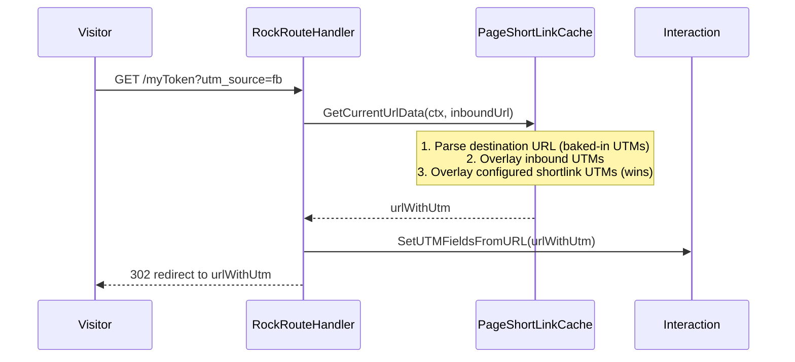

# Inbound Shortlink URL UTM Fallback

## Summary

`/myToken?utm_source=fb` does not write the UTM today. UTMs appended to the inbound shortlink URL are ignored: `RockRouteHandler` reads UTMs only from the resolved destination URL, so inbound `utm_*` query parameters are dropped before the interaction is written and are not forwarded to the redirect. This spec proposes a per-key fallback: a configured shortlink value still wins, but inbound values fill in for any UTM key the shortlink does not set.

## Motivation

Shortlinks are routinely shared in places where the channel cannot be predetermined at link-creation time. A single token (`/give`, `/easter`) may be promoted across email, social, SMS, and print, and partners want per-channel attribution without minting and configuring a separate shortlink per channel. Today the only way to differentiate channels is to create N shortlinks; the obvious workaround of appending `?utm_source=fb` to the shared link silently does nothing.

## Requirements

- For each UTM key (`utm_source`, `utm_medium`, `utm_campaign`, `utm_term`, `utm_content`), the precedence MUST be:
  1. Value configured on the active shortlink (or active scheduled redirect).
  2. Value present on the inbound request URL.
  3. Value already baked into the destination URL.
- The fallback MUST apply per-key. If the shortlink configures only `utm_source`, an inbound `utm_medium` MUST still flow through.
- The interaction record (`Interaction.SourceValueId` / `MediumValueId` / `CampaignValueId` / `Term` / `Content`) MUST reflect the resolved precedence.
- The destination URL the visitor is redirected to MUST also reflect the resolved precedence so downstream analytics on the destination site see the same UTMs that were logged.
- Configured shortlink values MUST NOT be overridden by inbound values. This is the current contract and existing customers depend on it.
- The change MUST NOT alter behavior when the inbound request URL has no `utm_*` parameters.

## Problem Statement

Shortlink interactions today record only the UTMs configured on the shortlink (or baked into the destination URL). UTM parameters appended to the inbound shortlink URL by the marketer or sharer are dropped before the interaction is written and are not forwarded to the destination redirect.

## Reproduction

1. Create a `PageShortLink` with token `test`, destination `https://example.com/landing`, and **no** UTM values configured.
2. Visit `https://{rock-site}/test?utm_source=facebook&utm_campaign=spring`.
3. Inspect the resulting row in `Interaction` for that shortlink: `Source`, `Medium`, `Campaign` are all empty.
4. Inspect the redirect URL the browser landed on: `https://example.com/landing` — no UTMs.

Expected: `utm_source=facebook` and `utm_campaign=spring` are recorded on the interaction and present on the redirect URL.

## Root Cause

In [Rock/Web/RockRouteHandler.cs:204](../Rock/Web/RockRouteHandler.cs):

```csharp
var (_, urlWithUtm, purposeKey) = pageShortLinkCache.GetCurrentUrlData( rockContext );

// Dummy interaction to get UTM source value from the Request/ShortLink url.
var interactionUtm = new Interaction();

// First, set the UTM field values associated with the shortlink;
// then overwrite with any values that are specified in the original request.
interactionUtm.SetUTMFieldsFromURL( urlWithUtm );
```

`urlWithUtm` is built by [PageShortLinkCache.GetUrlWithUtm](../Rock/Web/Cache/Entities/PageShortLinkCache.cs) at line 171 from the **destination URL** plus the shortlink's configured UTMs. The inbound request URL is never inspected for UTMs.

The comment block at lines 209-210 describes a two-pass strategy ("First, set the UTM field values associated with the shortlink; then overwrite with any values that are specified in the original request"), but only one call to `SetUTMFieldsFromURL` exists, against `urlWithUtm`. The intended second pass was never implemented, and the desired precedence per the comment ("inbound overwrites configured") is also the opposite of what customers expect today, so the comment alone is not a sufficient design.

After the interaction is queued, the same `urlWithUtm` is used to redirect the visitor at line 234, so inbound UTMs are also lost on the way to the destination.

## Affected Code Paths

Primary:

- [Rock/Web/Cache/Entities/PageShortLinkCache.cs:152](../Rock/Web/Cache/Entities/PageShortLinkCache.cs) — `GetCurrentUrlData` — needs to accept the inbound URL (or its parsed query parameters) so the merge logic can see them.
- [Rock/Web/Cache/Entities/PageShortLinkCache.cs:171](../Rock/Web/Cache/Entities/PageShortLinkCache.cs) — `GetUrlWithUtm` — extend to merge inbound UTMs with shortlink-config precedence preserved.
- [Rock/Web/RockRouteHandler.cs:204](../Rock/Web/RockRouteHandler.cs) — pass the inbound request URL (or its query string) into the new merge call.

Secondary (read-only verification, no change expected):

- [Rock/Model/Core/Interaction/Interaction.Logic.cs:35](../Rock/Model/Core/Interaction/Interaction.Logic.cs) — `SetUTMFieldsFromURL` continues to be the parser; no change to its contract.
- [Rock/Tasks/AddShortLinkInteraction.cs](../Rock/Tasks/AddShortLinkInteraction.cs) — consumes the message produced by the route handler; should continue to work without changes.
- [Rock/Cms/Utm/UtmHelper.cs](../Rock/Cms/Utm/UtmHelper.cs) — defined-value resolution helpers, unchanged.

## Proposed Approach

Push the merge responsibility down into `PageShortLinkCache` so the precedence is computed in one place, and have `RockRouteHandler` supply the inbound URL.

### Public surface change

Add a new internal overload (or optional parameter) on `PageShortLinkCache.GetCurrentUrlData` that accepts the inbound request URL:

```csharp
internal (string Url, string UrlWithUtm, string PurposeKey) GetCurrentUrlData(
    RockContext rockContext,
    string inboundRequestUrl );
```

Keep the existing parameterless and single-argument forms intact (do not change their signatures, per the project's backward-compatibility rule). The new overload delegates to the existing one when `inboundRequestUrl` is null.

### Merge precedence in `GetUrlWithUtm`

Update the helper so it walks the destination URL's query parameters, overlays inbound UTM values, then overlays configured shortlink UTM values. Pseudocode:

```csharp
// queryParameters starts as the destination URL's parsed query string
// (so any UTM baked into the destination is already there).

foreach ( var key in new[] { "utm_source", "utm_medium", "utm_campaign", "utm_term", "utm_content" } )
{
    var inboundValue = inboundQuery[key];

    if ( inboundValue.IsNotNullOrWhiteSpace() )
    {
        queryParameters.Set( key, inboundValue.Trim().ToLower() );
    }
}

// Existing shortlink-config logic runs AFTER the inbound overlay,
// so a configured value still wins.
hasUtmValues |= AddUtmValueToQueryString( queryParameters, "utm_source",   ... );
hasUtmValues |= AddUtmValueToQueryString( queryParameters, "utm_medium",   ... );
hasUtmValues |= AddUtmValueToQueryString( queryParameters, "utm_campaign", ... );

if ( utmSettings.UtmTerm.IsNotNullOrWhiteSpace() )
{
    queryParameters.Set( "utm_term", utmSettings.UtmTerm.Trim().ToLower() );
}

if ( utmSettings.UtmContent.IsNotNullOrWhiteSpace() )
{
    queryParameters.Set( "utm_content", utmSettings.UtmContent.Trim().ToLower() );
}
```

Two notes on the existing code that are subsumed by this change:

- The current `utm_term` / `utm_content` blocks call `queryParameters.Add(...)`, not `Set(...)`. With a `NameValueCollection`, `Add` appends to the existing value list, producing `utm_term=baked,configured` if the destination URL already contained a value. Switching these to `Set` to match the precedence model also fixes that latent bug.
- `AddUtmValueToQueryString` already uses `Set`, so it does not need to change.

### Route handler wiring

In `RockRouteHandler`, pass the inbound URL (or just its raw query string) into the new overload:

```csharp
var inboundUrl = routeHttpRequest?.Url?.OriginalString;
var (_, urlWithUtm, purposeKey) = pageShortLinkCache.GetCurrentUrlData( rockContext, inboundUrl );
```

Everything downstream (`SetUTMFieldsFromURL`, the `AddShortLinkInteraction` message, the redirect) then operates on a `urlWithUtm` that already encodes the resolved precedence. No further changes are needed in the handler. The misleading `// First, set the UTM field values... ; then overwrite ...` comment block is removed.

### Sequence



## Fix Risks

- **Behavior change for customers who have inbound UTMs in the wild today and were relying on them being silently dropped.** Considered low risk: dropping inbound UTMs is not a documented behavior, and the change only writes additional fields when the shortlink itself does not specify them.
- **`utm_term` / `utm_content` no longer concatenate with destination-baked values.** This is a fix to a latent bug; mention in release notes so anyone depending on the concatenation is warned.
- **Lowercasing the inbound value** (matching how `AddUtmValueToQueryString` lowercases the configured value) means an inbound `utm_source=Facebook` lands as `facebook` in the interaction. This is consistent with how Rock stores configured UTMs and avoids splitting the same source into multiple `DefinedValue` rows on case alone.
- **Cache safety.** `PageShortLinkCache` is shared. The new overload accepts the inbound URL as a parameter and does not store it on the cache instance, so per-request data does not leak across requests.
- **Visitor cookie / interaction ordering.** The cookie write at `RockRouteHandler.cs:248` already uses the request URL directly via `SetUTMFieldsFromURL` and is unaffected by this change.

## Verification Steps

1. Shortlink with no UTMs configured, inbound URL `?utm_source=fb&utm_campaign=spring` → interaction records `Source=fb`, `Campaign=spring`; redirect URL contains both params.
2. Shortlink with `utm_source=email` configured, inbound URL `?utm_source=fb` → interaction records `Source=email` (configured value wins); redirect URL contains `utm_source=email`.
3. Shortlink with `utm_source=email` configured, inbound URL `?utm_medium=newsletter` → interaction records `Source=email`, `Medium=newsletter` (per-key fallback); redirect URL contains both.
4. Shortlink with no UTMs configured, destination URL hard-coded with `?utm_source=baked`, inbound URL with no UTMs → interaction records `Source=baked` (destination baked-in survives, current behavior preserved).
5. Shortlink with no UTMs configured, destination URL hard-coded with `?utm_source=baked`, inbound URL `?utm_source=fb` → interaction records `Source=fb` (inbound overrides destination baked-in); redirect URL contains `utm_source=fb`.
6. Shortlink with `utm_term=alpha` configured, destination URL hard-coded with `?utm_term=baked` → interaction records `Term=alpha` and the redirect URL contains a single `utm_term=alpha` (regression check on the `Add` → `Set` fix).
7. Active scheduled redirect with its own UTM settings — same matrix as above using the schedule's `UtmSettings` instead of the shortlink's default settings.
8. Inbound URL with mixed-case UTM (`?utm_source=Facebook`) → interaction records `Source=facebook` (lowercased on write).
9. Inbound URL with no `utm_*` params → behavior identical to today (regression guard).
10. `PageShortLinkTests` integration suite passes; add new tests covering cases 1, 2, 3, 5, and 6.

## Out of Scope

- Capturing arbitrary non-UTM query parameters from the inbound URL onto the interaction. This spec covers only the five canonical UTM keys.
- Forwarding non-UTM query parameters from the inbound URL to the destination redirect. Existing behavior (drop) is preserved.
- A UI change in the shortlink editor to surface the new fallback semantics. The block UI does not need to change; the precedence is documented in code comments and the release note.
- The `RockLiquid` legacy path. This issue is specific to `RockRouteHandler`, which is already shared.

## Considered but Rejected

### Have inbound UTMs override configured shortlink values
Rejected. This is what the existing code comment ("then overwrite with any values that are specified in the original request") suggests, but it breaks the contract customers rely on today: shortlinks are configured to enforce a known channel, and a marketer pasting `?utm_source=fb` on a `utm_source=email`-configured shortlink should not silently corrupt the email channel's analytics.

### Capture inbound UTMs only when the shortlink has zero UTMs configured (all-or-nothing)
Rejected. Real shortlinks routinely set `utm_source` and `utm_campaign` but leave `utm_medium` blank for the channel-of-the-day. A per-key fallback is materially more useful and not meaningfully harder to implement.

### Do the merge in `RockRouteHandler` rather than `PageShortLinkCache`
Rejected. `PageShortLinkCache.GetUrlWithUtm` is already the single source of truth for "merge UTMs into a URL"; centralizing the new precedence rule there keeps the route handler small and means future callers (mobile shortlink resolution, REST helpers, etc.) inherit the same behavior automatically.

## Related

- [Rock/Web/RockRouteHandler.cs:178-235](../Rock/Web/RockRouteHandler.cs) — shortlink branch of the route handler.
- [Rock/Web/Cache/Entities/PageShortLinkCache.cs:152](../Rock/Web/Cache/Entities/PageShortLinkCache.cs) — `GetCurrentUrlData` and `GetUrlWithUtm`.
- [Rock/Model/Core/Interaction/Interaction.Logic.cs:35](../Rock/Model/Core/Interaction/Interaction.Logic.cs) — `SetUTMFieldsFromURL`.
- [Rock.Migrations/Migrations/Version 16.0/Version 1.16.6/202406221248188_AddPageShortLinkUtmProperties.cs](../Rock.Migrations/Migrations/Version 16.0/Version 1.16.6/202406221248188_AddPageShortLinkUtmProperties.cs) — original introduction of UTM settings on shortlinks.
- [Rock.Tests.Integration/Core/Model/PageShortLinkTests.cs](../Rock.Tests.Integration/Core/Model/PageShortLinkTests.cs) — existing test surface to extend.
