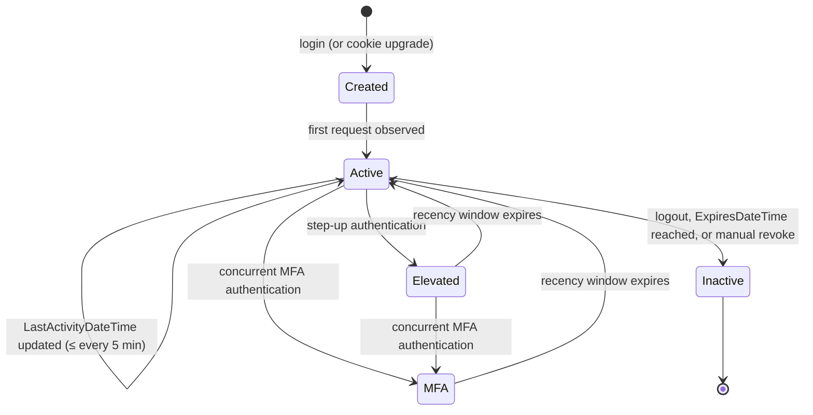

# PersonSession as Session Authority

## Summary

Rock currently treats the `.ROCK` authentication cookie as the source of truth for an authenticated session. The cookie carries the user identity and a handful of flags, and the rest of the system reconstructs everything else (last activity, online status, etc.) by side-channels on `UserLogin`. This spec proposes a new `PersonSession` entity that becomes the authoritative record of a session. The cookie is reduced to a reference (a row pointer plus integrity bits) and the database row carries the lifecycle, recency, and policy data the platform needs to make authorization decisions.

The change unlocks step-up and MFA recency tracking, deterministic session expiration, and a clean policy hook (`AuthenticationStrength` and `AuthenticationRequirement`) that blocks can consume without rolling their own logic.

## Motivation

Several long-standing problems all trace back to the cookie-as-authority model:

- **No notion of session recency.** "User authenticated with password 90 days ago and has clicked around since" looks identical to "user just typed their password". Blocks that should require recent (re-)authentication (giving history, profile edits, financial settings) have no platform-supplied way to ask the question.
- **MFA is invisible after the fact.** Rock cannot tell whether the current session ever involved a second factor, and so cannot enforce MFA-gated features after login.
- **Activity tracking is bolted on.** `UserLogin.LastActivityDateTime` and `UserLogin.IsOnLine` are updated on every page load via a bus task and then read in a handful of places. There is no clean separation between "user exists" and "user has an active session".
- **Persistent ("remember me") sessions are not modeled.** Cleanup behavior, expiration semantics, and revocation are all implicit.
- **Session events have nowhere to hang.** "Send an email when a new session starts on a new device" requires an event the platform does not currently fire.

Adopting an industry-standard session model lets the rest of the platform stop guessing at session state and gives blocks a single policy primitive to enforce.

## Requirements

- A new `PersonSession` entity MUST exist and MUST be the authoritative record for an authenticated session.
- The `.ROCK` cookie MUST be reduced to a reference to a `PersonSession` row. The cookie no longer carries authoritative session data.
- Existing `.ROCK` cookies SHOULD be upgraded transparently on first request after the rollout (no forced logout) by creating a `PersonSession` from the cookie's `UserLogin` name.
- The platform MUST expose an `AuthenticationStrength` value for the current request reflecting whether the session is unauthenticated, authenticated (stale), elevated (recent), or MFA (recent + second factor).
- The platform MUST expose a `MeetsRequirement(AuthenticationRequirement)` check on the request context.
- Step-up and MFA recency MUST be tracked as distinct timestamps on the session.
- Persistent ("remember me") sessions MUST be distinguishable from transient sessions and SHOULD have a longer cleanup horizon.
- Expired sessions MUST be retained (marked inactive, not deleted) so historical reporting and forensics still work. The Rock Cleanup job is responsible for marking them inactive when `ExpiresDateTime` is reached.
- API key authentication MUST continue to work unchanged and MUST NOT create a `PersonSession`.
- `InteractionSession` MUST gain a nullable `PersonSessionId` set once on creation, and the platform MUST keep the two in sync across login, logout, and impersonation events.
- Existing public methods MUST NOT change signatures. New behavior is added via new methods/overloads.

## Design

### Entity: `PersonSession`

Inherits from `Rock.Data.Model<PersonSession>` (gains the standard `Id`, `Guid`, audit columns, and `Foreign*` columns automatically) and implements `IHasAdditionalSettings` so impersonation-restore state and other future per-session metadata can be persisted as categorized JSON without schema sprawl.

| Column | Type | Nullable | Notes |
|---|---|---|---|
| `PersonAliasId` | int (FK PersonAlias) | No | Owner of the session. Standard Rock `PersonAlias` semantics apply: on Person merge, `PersonSession` rows are left pointing at their original alias (no fix-up). `PersonAlias` deletion is an admin-only direct-SQL operation requiring manual FK cleanup, not a supported runtime path; no cascade behavior is defined for it. |
| `UserLoginId` | int (FK UserLogin) | Yes | Null for impersonation tokens, passwordless flows, and other cases where there is no concrete `UserLogin`. |
| `IsActive` | bool | No | Set to `false` once `ExpiresDateTime` is reached or the session is manually revoked. Inactive sessions cannot be used for validation and do not appear in admin UI by default. |
| `IssuedDateTime` | datetime | No | When the session was created. Public setter on purpose so unit tests and legitimate backdating scenarios can write it. Unlike `InactiveDateTime`, it has no co-dependent column whose state could be corrupted by an inconsistent caller. |
| `InactiveDateTime` | datetime | Yes | When `IsActive` flipped to `false`. MUST be a private-set property, set automatically by the service during the `PreSave` event. The reason is to keep this column in lockstep with `IsActive`: a caller should never be able to set `IsActive = false` without an `InactiveDateTime`, or stamp an `InactiveDateTime` without flipping `IsActive`. Contradictory states would leave operators unsure how to interpret the row. |
| `ExpiresDateTime` | datetime | Yes | Past this point the session is invalid. Rock Cleanup deactivates rows once exceeded. |
| `LastActivityDateTime` | datetime | No | Updated by the activity bus task. Throttled to once every ~5 minutes (existing `UserLogin` activity update runs every 2 minutes; the session update is intentionally cheaper). |
| `LastStepUpAuthenticationDateTime` | datetime | Yes | Last time the person successfully provided any credential (password, SMS, TOTP) during this session. |
| `LastMultiFactorAuthenticationDateTime` | datetime | Yes | Last time MFA happened. Only updated when MFA is used *concurrently*: password + TOTP in one flow qualifies, password followed by a TOTP-only prompt 10 minutes later does not. The user must re-enter the primary credential together with the second factor for this timestamp to advance. (Industry-standard semantics.) |
| `IsPersistent` | bool | No | `true` when the session was created from a "remember me" login. Drives cleanup horizon. |
| `UserAgent` | nvarchar | Yes | Captured at session creation for forensics and "new device" emails. Null or empty is permitted; SignalR, server-side REST, and OIDC flows may not have a meaningful UA string. Long-term retention inherits the same PII considerations that already apply to other UA-storing tables in Rock; a platform-wide PII / retention policy is out of scope for this spec. |
| `AuthenticationComponentId` | int (FK EntityType) | Yes | Component used for initial authentication. |
| `CreationSource` | enum `PersonSessionCreationSource` | No | How the session was created. Values: `Unknown` (safe default, should not be persisted in normal flows), `Component` (regular authentication via an `AuthenticationComponent`), `Impersonation` (admin-initiated impersonation, restorable to the impersonator's prior session), `UserToken` (user-facing token like an `rckipid` email link, not restorable). Drives `IsImpersonated()`, `GetImpersonatorSession()`, and `EndImpersonationAndRestore()` semantics on `PersonSessionService`. |
| `AdditionalSettingsJson` | nvarchar(max) | Yes | Backing store for `IHasAdditionalSettings`. Read and written exclusively through the categorized extension methods, never touched directly. Known consumers: (1) admin-impersonation restore state, under a dedicated key, carrying the impersonator's prior `PersonSession.Guid`; (2) for `UserToken` sessions, a possible link to the originating `PersonToken` row (e.g. its Guid) so per-request validation can re-check page-scope, expiration, or revocation against the source token. Whether (2) is required depends on the page-scope research in Pre-Implementation Research. Future per-session metadata (device fingerprint hints, channel-specific context, etc.) can be added under additional keys without a schema change. |

### Method: `GetAuthenticationStrength()`

Returns an `AuthenticationStrength` value derived from the session's recency timestamps. The thresholds themselves come from `PersonSessionService` (see below) so the entity stays free of time-dependent constants. The mapping:

```
NotAuthenticated   no PersonSession or IsActive == false
Authenticated      session valid but neither step-up nor MFA is recent enough
Elevated           LastStepUpAuthenticationDateTime >= GetElevatedAuthenticationThreshold()
MultiFactor        LastMultiFactorAuthenticationDateTime >= GetMultiFactorAuthenticationThreshold()
```

`MultiFactor` takes precedence over `Elevated` when both windows are satisfied; the strength reported is the strongest one that applies.

### Service: `PersonSessionService`

Exposes the recency thresholds used by `GetAuthenticationStrength()` and by any caller that wants to filter sessions or evaluate a `MeetsRequirement` check inside an EF query:

```csharp
public DateTime GetElevatedAuthenticationThreshold()
    => RockDateTime.Now.AddMinutes( -ElevatedWindowMinutes );

public DateTime GetMultiFactorAuthenticationThreshold()
    => RockDateTime.Now.AddMinutes( -MultiFactorWindowMinutes );
```

**Defaults (v1):**

| Window | Value | Source |
|---|---|---|
| `ElevatedWindowMinutes` | 30 | `private const int` on the service. |
| `MultiFactorWindowMinutes` | 60 | `private const int` on the service. |

Defaults reflect industry practice for admin/operational tools (GitHub sudo mode, Microsoft elevated session, Auth0 step-up). The MFA window is intentionally longer than the step-up window because passing a second factor is a stronger identity signal and warrants more grace before re-prompting.

**Why methods return a threshold `DateTime` (not the raw int):**

- Callers compare with a single semantic: `if ( session.LastStepUpAuthenticationDateTime >= threshold )`. No minute/hour unit confusion at the call site.
- The expression composes naturally inside EF: `query.Where( s => s.LastStepUpAuthenticationDateTime >= threshold )`.
- A future migration from `private const int` to a system setting is a one-line change inside the service. Call sites do not change.
- A single call yields one consistent `RockDateTime.Now` reference. Callers evaluating strength against multiple timestamps in the same pass are not subject to drift mid-evaluation.

The raw window values stay private. If a future UI needs to display "session expires in N minutes", a separate accessor can be added at that point. Do not expose preemptively.

**Impersonation helpers (sketch).** The service is also the single seam for impersonation queries. Callers MUST NOT read the cookie's side payload directly; they call:

```csharp
bool IsImpersonated( PersonSession session );
PersonSession GetImpersonatorSession( PersonSession session );  // null if not admin-impersonation
PersonSession EndImpersonationAndRestore( PersonSession session );  // admin only; null if no impersonator to restore
ImpersonationProcessResult ProcessImpersonationToken( string rckipidToken );  // pattern B entry point
```

See the "Impersonation: two distinct cases" subsection below for what each helper does in each impersonation flow. Keeping these on the service preserves the cookie payload as a black box. If the cookie container later changes (see Open Questions) only these methods change; callers don't.

### Enums

#### `AuthenticationStrength` (Rock.Enums)

```
NotAuthenticated   safe default; rarely returned because the session would be null
Authenticated      authenticated, but not recently
Elevated           (re-)authenticated recently
MultiFactor        (re-)authenticated recently with MFA
```

#### `AuthenticationRequirement` (Rock.Enums)

```
Elevated           caller requires a recent (re-)authentication
MultiFactor        caller requires a recent MFA event
```

Two enums (rather than one shared enum) so the requirement set can grow independently of the strength set. A future `TrustedNetwork` requirement, for example, would let a block say "show giving history if the session meets `Elevated` OR the request is on a trusted network", without contaminating the strength enum, which describes only what the session itself can attest to. (Industry-standard split.)

### `RockRequestContext` integration

`RockRequestContext` gains:

- A property exposing the current `PersonSession` (nullable). This property IS the per-request cache: the session is resolved once at request entry and held there for the duration of the request. There is intentionally no separate `PersonSessionCache` entity cache; cross-request caching would add complexity (invalidation on session deactivation, web-farm consistency) without obvious benefit, since per-request resolution is cheap once the cookie has been decoded. Anonymous and API-key / bearer-token requests legitimately have no `PersonSession`, so consumers MUST handle null. For the rare call site not running inside `RockRequestContext`, `HttpContext.Items` is an acceptable fallback covering the same request lifetime.
- A `MeetsRequirement(AuthenticationRequirement)` method that returns a bool. Centralizing this here means blocks stop rolling custom recency checks and the policy can evolve in one place.

### Session lifecycle



`Inactive` rows are retained for history. They are never deleted by Rock Cleanup.

### Central creation path

All session creation MUST flow through `PersonSessionService.CreateSession`. This is the seam where downstream events (new-device email, audit logging, anomaly detection) get hooked in later. Direct construction of `PersonSession` rows outside this method is prohibited.

The service surface is intentionally split into three methods to decouple cookie production from HTTP-environment manipulation:

```csharp
PersonSession CreateSession( ... );                                // creates the DB row
string         GetCookieValue( PersonSession session );            // opaque encrypted cookie value
void           SetAuthCookie( PersonSession session, RockRequestContext context );  // attaches cookie via context
```

`SetAuthCookie` internally calls `GetCookieValue` and then writes the cookie through `RockRequestContext`, which abstracts the HTTP response. `GetCookieValue` MUST NOT touch `HttpContext` directly; it returns a pure opaque string suitable for any caller (browser cookie, device token, test fixture). The architectural rule applies to all helpers on `PersonSessionService`: no direct `HttpContext` access. Cookie/HTTP work routes through `RockRequestContext`. The reason is .NET Core portability: `HttpContext` semantics differ enough between System.Web and ASP.NET Core that direct dependencies create migration friction.

This separation is what unblocks non-cookie flows (Mobile and TV device authentication, server-side test fixtures, future SignalR / push integrations) from going through the central creation seam without needing a fake HTTP response.

### Interaction with `InteractionSession` and ASP.NET Session

`InteractionSession` gains a nullable `PersonSessionId`. The column is populated by either of two paths:

1. **Stamp at creation.** When `InteractionSession` is created and a `PersonSession` already exists on the current request, the new row is inserted with `PersonSessionId` set to that session's Id. This covers the "user arrives already authenticated via a persisted cookie" case.
2. **Adopt by update at login.** When a person logs in mid-session (the common visitor-becomes-authenticated flow: browse anonymously → eventually log in), the existing `InteractionSession` for the current browser session is updated to set `PersonSessionId` to the new `PersonSession`. The full pre-auth journey thereby attaches retroactively to the now-known person, which is the whole point of adopting rather than creating a fresh row.

The SQL-driven upsert at `Rock/Model/Core/Interaction/InteractionService.cs:583` is insert-only today; it must gain a path that updates `PersonSessionId` on an existing row keyed by `RockSessionId`. The race-condition surface is unchanged from today (the unique key on `RockSessionId` continues to mediate concurrent inserts; the new column just rides along).

To keep the three (`PersonSession`, `InteractionSession`, ASP.NET Session) in sync, authentication events drive resets:

| Event | PersonSession | InteractionSession | ASP.NET Session |
|---|---|---|---|
| Login, not already authenticated | Create new | Adopt existing | Create new |
| Login, already authenticated, different person | Create new | Create new | Create new |
| Login, already authenticated, same person (step-up only) | Reuse existing | Reuse existing | Reuse existing |
| Logout | Mark inactive | Create new | Create new |
| Admin impersonation, start | Create new (impersonator's session Guid stashed in cookie side payload) | Create new | Create new |
| Admin impersonation, end / restore | Mark current inactive; restore prior session from cookie side payload | Create new | Create new |
| User-token impersonation (`rckipid` email link) | Create new (no impersonator session) | Create new | Create new |

For impersonation specifically, the original `PersonSession` Guid (and any companion resume state) is stashed inside the new auth cookie so it can be restored on impersonation exit, giving a clean resumption. ASP.NET Session is deliberately not used for this. Beyond the technical fit (rare feature, short-lived, small payload), the long-term direction for Rock is to move off ASP.NET Session entirely because it enforces single-page-per-session processing (the session lock serializes requests for the same user, hurting concurrent page loads and API calls). This spec does not migrate every ASP.NET Session use case off the platform, but it deliberately does not add a new dependency on it either.

`InteractionSession` for website viewing always recycles on app pool recycle (so practical session duration is bounded at ~24 hours). Creating fresh sessions on auth events is therefore not a meaningful behavior change.

### API key requests

Requests authenticated by API key continue to work as today. No `PersonSession` is created, no `InteractionSession` is recorded.

This same "no session created" rule applies to the other bearer-token paths handled by `Rock.Rest/Filters/AuthenticateAttribute.cs`: JWT tokens (`HeaderTokens.JWT`) and OAuth bearer tokens via ASOS. These are treated as API-key-class authentication: the request is authenticated against the bearer, the current user is set for the duration of the request, but no `PersonSession` row exists and `UpdatePersonSessionLastActivity` is not invoked. The rationale: like API keys, these tokens are issued out-of-band and validated on each request from their own state (signature, issuer claims, ASOS authorization grant). Persisting a session per request would add database churn without giving the platform any new authority it doesn't already have from the token itself.

The OIDC password-grant flow (`Rock.Oidc/Authorization/AuthorizationProvider.cs:120-182`) falls under the same rule. That endpoint exchanges username/password for an access token via `context.Validate(ticket)`; it does NOT authenticate the requesting HTTP connection. The issued token is later replayed via the ASOS bearer path above, which is already classified. OAuth access tokens and `.ROCK` cookies are different artifacts (different transport, different validation middleware, different consumers), so an OIDC-issued token cannot authenticate a RockPage / Obsidian page load even if a caller tried to inject it as a cookie. `AuthenticateAndTrack` continues to update `UserLogin.LastLoginDateTime` as a side effect; that behavior is preserved.

### Mobile and TV device authentication

Mobile and TV clients today authenticate by storing an encrypted `FormsAuthenticationTicket` on the device and replaying it via the `Authorization` header on every API call. The ticket is produced by `Rock/Mobile/MobileHelper.cs:206` and `Rock/Tv/TvHelper.cs:193` and never goes through `Authorization.SetAuthCookie`. Under the new model these flows participate in `PersonSession` fully:

- Mobile and TV sessions are **full persistent sessions**, not API keys. `CreationSource = Component`, `IsPersistent = true`, `AuthenticationComponentId` set to whichever component authenticated the login. They are long-lived authenticated sessions tied to a specific person and device.
- Mobile and TV login flows obey the same auth-state-transition rules as the web login flow (per the InteractionSession sync table above): anonymous → new session; same-person re-login → reuse the existing active session; different-person → new session; logout → mark inactive.
- The mobile/TV login block calls `CreateSession` (or selects an existing active session per the transition rules), then calls `GetCookieValue` to obtain the opaque value to hand back to the device. It does NOT call `SetAuthCookie`, because mobile/TV clients do not store cookies in the browser sense.
- Device token refresh (the device asks for a new token without re-entering credentials) is the pure reuse case: the existing `PersonSession` is unchanged and `GetCookieValue` is called against it to produce a fresh opaque value for the device.
- `Rock.Rest/Filters/AuthenticateAttribute.cs` is updated so the mobile/TV branch (Authorization header carrying an encrypted Rock cookie value) decodes the value, resolves the `PersonSession.Guid`, validates the session, sets the current user, and triggers the standard `UpdatePersonSessionLastActivity` bus task. This makes mobile/TV requests participate in activity tracking exactly the way browser requests do.
- The `IsImpersonated` and `IsTwoFactorAuthenticated` flags previously embedded in the device's ticket are dropped, consistent with the new cookie format. Impersonation context lives on `PersonSession`; MFA recency lives on `LastMultiFactorAuthenticationDateTime`.
- Today's `Authorization.GetSimpleAuthCookie` (`Rock/Security/Authorization.cs:853`) is the existing non-emitting variant used by the mobile login block; the new `GetCookieValue` supersedes it cleanly. The old method becomes a thin wrapper during deprecation.

**Out of scope for this subsection:** the JWT (`HeaderTokens.JWT`) and ASOS bearer-token paths in `AuthenticateAttribute` are not mobile/TV device tokens; they are independent authentication mechanisms that happen to share the same filter. Both are classified as API-key-pattern flows (see "API key requests" above): they do not create a `PersonSession` and do not participate in activity tracking.

### MFA detection

For the initial rollout, MFA is detected via `AuthenticationComponent.IsConfiguredForTwoFactorAuthentication()`. This is a global on/off switch with no parameters and is currently only called by the Login block, but it is enough to set `LastMultiFactorAuthenticationDateTime` correctly for the path that matters. A proper per-request signal from the component is deferred to a future authentication-component rewrite.

### Current cookie format

Today, `Rock.Security.Authorization.GetAuthCookie()` (`Rock/Security/Authorization.cs:823`) builds a `FormsAuthenticationTicket` (machine-key encrypted, version 1) carrying:

| Ticket field | Meaning |
|---|---|
| `Name` | The `UserLogin` name. This is the only identity carried on the wire. |
| `IssueDate` | `RockDateTime.SystemDateTime` at issue time. |
| `Expiration` | `IssueDate + FormsAuthentication.Timeout` (or the explicit override). |
| `IsPersistent` | Mirrors the "remember me" flag. |
| `UserData` | A JSON-serialized `AuthenticationTicketUserData` (`Authorization.cs:1561`) with two fields: `IsImpersonated` (bool), `IsTwoFactorAuthenticated` (bool). |
| `CookiePath` | `FormsAuthentication.FormsCookiePath`. |

A companion `{FormsCookieName}_DOMAIN` cookie stores the cookie domain so cross-subdomain logout can clear the auth cookie correctly. It carries no auth data.

### New cookie format

The cookie carries **only** the `PersonSession.Guid`. Everything else (the `UserLogin` name, persistence, MFA recency, expiration, impersonation kind, impersonation-restore state) lives on the `PersonSession` row and is looked up server-side per request. The cookie remains signed/encrypted so it cannot be forged.

- The browser-side cookie expiration mirrors `PersonSession.ExpiresDateTime` so the cookie self-cleans when persistence is implicit, but the authoritative expiration check happens against the row.
- `IsImpersonated` and `IsTwoFactorAuthenticated` are dropped from the cookie payload. Impersonation context is recorded by `PersonSession.CreationSource` and the impersonator's prior session Guid lives in `PersonSession.AdditionalSettingsJson` (under a dedicated key). MFA recency lives on `LastMultiFactorAuthenticationDateTime`. Callers reach all of this through `PersonSessionService`, never the cookie.

### Cookie upgrade path

When a request arrives with a legacy `.ROCK` cookie and no corresponding `PersonSession`:

1. If the legacy cookie's `UserData.IsImpersonated == true`, **drop the cookie and treat the request as unauthenticated.** Impersonation cookies were always meant to be short-lived ("let me impersonate Ted real quick to see what he sees"); silently upgrading them into long-lived `PersonSession` rows would extend impersonation past its intended lifetime. The impersonator can simply re-impersonate after the rollout.
2. Otherwise, create a `PersonSession` from the cookie's `UserLogin` name (the ticket's `Name` field). Reissue the cookie in the new format (session Guid only). The user is not forced to log in again.
3. `LastStepUpAuthenticationDateTime` and `LastMultiFactorAuthenticationDateTime` start null on the upgraded row, so it reports `Authenticated` (not `Elevated` or `MultiFactor`) until the user next authenticates. The legacy `IsTwoFactorAuthenticated` flag is intentionally not honored on upgrade because the old cookie does not carry a timestamp, so we cannot decide whether it should count as "recent" under the new model.

### Impersonation: two distinct cases

Rock currently uses the term "impersonation" for two different flows that share an `rckipid` query parameter today but have different lifecycles and different session semantics. The spec preserves both and treats them as separate cases.

**Admin impersonation.** An administrator opens a person's record and clicks "Impersonate" on the Person Bio block (`RockWeb/Blocks/Crm/PersonDetail/Bio.ascx.cs`). Today this sets `Session["ImpersonatedByUser"]` and redirects to the same page (or a configured target) with an `rckipid` query parameter. The admin can later restore their original session. Under the new model:

- A new `PersonSession` is created for the impersonated person with `CreationSource = Impersonation`.
- The admin's prior `PersonSession.Guid` is written into `AdditionalSettingsJson` (under a dedicated impersonation-restore key) so `EndImpersonationAndRestore` can revert.
- `LastStepUpAuthenticationDateTime` and `LastMultiFactorAuthenticationDateTime` are copied from the impersonator's prior session to the new impersonation session at creation. This preserves the admin's recency so an admin who recently authenticated does not get re-prompted by high-security blocks during impersonation. (Current `ProcessImpersonation` accomplishes this by force-setting `isTwoFactorAuthenticated: true` on the reissued cookie; an engineering note in that method calls out the intent.)
- Ending impersonation via `EndImpersonationAndRestore` does NOT touch the restored session's recency timestamps. The admin's prior session resumes with its own original values.
- The block that initiates impersonation SHOULD switch to a flow that fully sets up the new session (cookie reissued, restore state written) and redirects to a token-free URL. Today's implementation bounces `rckipid` back into the redirect target's URL, which leaks the token into browser history and triggers `ProcessImpersonation` on every subsequent page load. The new flow drops the parameter at the first redirect.

**User-token impersonation.** Rock generates `rckipid` tokens for use in email links so recipients can view personalized content (end-of-year giving statements, event registration receipts, prayer-team responses) without logging in. The recipient is not "an impersonator" in the admin sense; they are the legitimate owner of the data being viewed and may never have logged in to Rock at all. Under the new model:

- A new `PersonSession` is created for the token's target person with `CreationSource = UserToken`.
- `AdditionalSettingsJson` carries no impersonation-restore state; there is no impersonator session to restore to.
- `AdditionalSettingsJson` MAY carry a reference to the originating `PersonToken` row (e.g. its Guid) so per-request validation can re-check page-scope, expiration, or revocation against the source token on every request, not just at session creation. Whether this link is required depends on the page-scope research item in Pre-Implementation Research; if page-scoped tokens must continue to enforce their page restriction across an active session, the link is required.
- The session is not restorable. `GetImpersonatorSession` returns null, `EndImpersonationAndRestore` is a no-op.

**Distinguishing the two.** Both flows produce a `PersonSession` and both make `IsImpersonated` return true. `CreationSource` is the authoritative discriminator: `Impersonation` for admin (restorable), `UserToken` for email-link (not restorable), `Component` for normal authenticated sessions. The cookie does not need to carry this distinction.

**Pattern A vs Pattern B (callers).** Existing code that parses `"rckipid=" + token` out of the cookie's `Name` field falls into two patterns. The migration target is different for each:

- **Pattern A** (most callers): the code only wants to know "is this an impersonated session?". This is a simple boolean read against `PersonSession`. `IsImpersonated()` covers it. `Rock/Web/UI/RockPage.cs:2076`, `Rock/Model/CRM/UserLogin/UserLogin.WebForms.cs:101`, and similar audit-and-display call sites are Pattern A.
- **Pattern B** (request-init only): the code is inspecting the `rckipid` query parameter on an incoming request to decide whether to start a new session. This belongs at a single seam, `PersonSessionService.ProcessImpersonationToken()`, which applies these rules in order:
  1. If the token is invalid or expired, return failure and leave the current session unchanged.
  2. If the current session has `CreationSource = UserToken` and its target person matches the token's target, do NOT create a new session row, but DO return redirect-required so the token is stripped from the URL. The session continues unchanged. This both protects against row-spam and prevents the token from persisting in browser history when the same `rckipid` URL is followed across multiple page loads.
  3. If the current session has `CreationSource = Impersonation` (admin impersonation), abandon the impersonation session and create a fresh `UserToken` session for the token, **even if the token's target matches the admin or the currently-impersonated person**. Admin impersonation carries restore state, audit context, and MFA recency from the admin's prior session that should not be inherited by a token-driven access. The case is an edge that should not happen in normal flows, but explicit handling avoids subtle confusion.
  4. If the current session has `CreationSource = Component` AND the token's target matches the currently-logged-in person, do NOT change session state but DO return redirect-required so the token is stripped from the URL. The session is already sufficient to view the content; reissuing a cookie or creating a row would be churn, and no authentication event has actually occurred. The redirect prevents the token from persisting in browser history and from being re-processed on every subsequent page load. `LastActivityDateTime` advancement is unaffected because it happens through the activity bus task, not through this seam.
  5. Otherwise (Anonymous, `Component` for a different person, or `UserToken` for a different target), mark any current session inactive and create a new `UserToken` session for the token.
  6. Return a status indicating whether the caller must redirect to a token-free URL. Redirect is required for rules 2, 3, 4, and 5 (anywhere a token reached the helper). Only rule 1 (invalid token) and the never-called-because-no-token case return no-redirect.

Pattern B callers MUST go through this helper and MUST NOT reimplement token processing. `Rock/Web/UI/RockPage.cs:2111` (`ProcessImpersonation`) is the canonical Pattern B caller and is the single highest-priority migration target during implementation. The `rckipid=` prefix parsing in `Rock.Rest/ApiControllerBase.cs:103`, `Rock/Web/HttpModules/RockGateway.cs:499`, and the `UserLogin.WebForms.cs` helpers are also Pattern B and must move to the same seam.

This subsection answers most of the impersonation Blocker, but the `PersonSession` representation question (flag vs enum vs side table) is still open and is what the user's next prompt is intended to settle.

### Cookie container: WebForms FormsAuthenticationTicket vs custom cookie (TODO)

The spec deliberately leaves the underlying cookie container undecided. Two options are on the table:

1. **Keep `FormsAuthenticationTicket`.** Smallest change. The ticket's `Name` field carries the session Guid (as a string), the rest of the ticket is ignored. Compatible with the existing WebForms auth pipeline and the `FormsAuthentication.SignOut()` / `FormsAuthentication.Encrypt()` plumbing already in `Authorization.cs`.
2. **Switch to a custom cookie format.** A signed, opaque token (e.g. session Guid + integrity HMAC, or a JWT). Decouples Rock from the WebForms auth pipeline and is portable to .NET Core / .NET 8.

The motivating reason to consider option 2 now: `FormsAuthenticationTicket` is a WebForms-era construct that has no direct equivalent in .NET Core. If Rock is going to change the cookie payload anyway as part of this work, it might be worth changing the container at the same time so that the eventual .NET Core port does not need a second cookie migration. The countervailing argument is scope: container change widens the blast radius of this spec significantly (encryption keys, machine-key portability across web farm nodes, third-party tools that read the cookie, etc.). Decision deferred. Capture in Open Questions.

### Deprecations and removals

**Scope note.** The deprecations below apply only to the specific `UserLogin.*` properties named in the table. Other entities in Rock have their own `LastActivityDateTime` columns (notably `ConnectionRequest`, and the `ConnectionListGridUpdateBag` view-model used by the Connection blocks); those are unrelated to authentication and are NOT in scope for deprecation.

| Item | Action |
|---|---|
| `UserLogin.LastActivityDateTime` | Deprecate. Core call sites (Active Users block, Data Automation job) move to `PersonSession`. |
| `UserLogin.IsOnLine` | Deprecate, and remove ALL writers wholesale. The new model derives "is the user online?" from `PersonSession.LastActivityDateTime`, so there is no boolean flag to clear on app start/stop or on logout. Code being deleted: `MarkOnlineUsersOffline()` at app startup and shutdown (`RockWeb/App_Code/Global.asax.cs:203,782,834`), the `Session_End` handler's offline-flag write (`Global.asax.cs:547-568`), and every `UpdateUserLastActivity.Message.Send( ..., IsOnline = false )` call from logout paths (`Rock.Blocks/Security/Logout.cs:109`, `LoginStatus.cs:332`, `ConfirmAccount.cs:391`, `Rock/Web/UI/RockPage.cs:843`, `Rock/Model/CRM/UserLogin/UserLoginService.WebForms.cs:78`). Readers (Active Users block) move to `PersonSession`. The bus task's `IsOnline` property is deprecated alongside. |
| `UserLastActivityTransaction` | Remove (already deprecated in v13). |
| `UpdateUserLastActivity` bus task | Deprecate. Add a new `UpdatePersonSessionLastActivity` bus task that updates `PersonSession.LastActivityDateTime`. The new task name pairs with the new entity, and a clean split (rather than a property-deprecation pass on the old task) avoids leaving the legacy message class half-meaningful for plugins still on the old API. |
| `UserLogin.IsAuthenticated`, `UserLogin.IsTwoFactorAuthenticated` | Mark `[Obsolete]` and `[RockObsolete( "X.Y" )]`. Both properties keep their current signatures but always return `false` after the change. Their original semantics depended on the WebForms auth ticket's `UserData` payload (which the new cookie format does not carry), so faithful preservation is not possible. Known consumers: `Rock.Blocks/Security/ChangePassword.cs:132,228`, `RockWeb/Blocks/Security/Authorize.ascx.cs`, `Rock/Web/UI/RockPage.cs:941`. Each is updated to check the current session via `RockRequestContext` (and `MeetsRequirement()` where the original intent was "user authenticated recently / with MFA"). Lava templates that referenced these properties on a `UserLogin` will silently get `false` after the upgrade; the visible breakage is intentional so template authors notice and migrate. |

`UserLogin.LastLoginDateTime` is set only on actual credential entry (password or impersonation) and is preserved as-is.

### Touch-points to update

- Active Users block.
- Rock Cleanup job: mark sessions inactive once `ExpiresDateTime` passes.
- Data Automation job: re-activate people based on `PersonSession.LastActivityDateTime`.
- All places with bespoke recency / step-up logic move to `MeetsRequirement()`.
- `AuthController.Login` (`Rock.Rest/Controllers/AuthController.cs:43-58`): **No behavior change.** Continues to produce a `Component` `PersonSession` with MFA recency stamped to `Now`, preserving the endpoint's current `isTwoFactorAuthenticated: true` semantics. The implementer MUST add an engineering note at the method body stating that this endpoint stamps MFA recency without verifying a second factor, that the security concern is intentionally deferred to the v2 REST conversion, and that the v2 replacement endpoint MUST coordinate with the product owner on the desired behavior before going live. Retrofitting the legacy endpoint risks breaking external API consumers that depend on the current MFA-equivalence semantics; a new endpoint is the right place to make the change.
- `RejectAuthenticationCookiesIssuedBefore` (`RockWeb/App_Code/Global.asax.cs:582-603`, setting in `Rock/Security/SecuritySettings.cs:123`): redirect the kill-switch check from the cookie ticket's `IssueDate` to `PersonSession.IssuedDateTime`. The check fires after cookie validation has resolved a `PersonSession.Guid` and the session is loaded. Sessions whose `IssuedDateTime` precedes the threshold are marked inactive and the cookie is expired. This also closes the long-standing weakness where the kill switch could be bypassed by anyone whose cookie had been reissued (the new `IssuedDateTime` reflects the session's actual start, not the cookie's last refresh). The hook's exact location depends on the cookie-container decision (Open Questions): if we keep `FormsAuthenticationTicket`, the existing `Application_AuthenticateRequest` hook can be extended; if we switch to a custom container, the equivalent check lives in our own validation pipeline.

## Pre-Implementation Research

The items below are NOT design decisions; they are behaviors of the existing system that must be understood before the new implementation can faithfully replicate or intentionally diverge from them. Each item should be investigated and the findings folded back into the spec (as updates to Design, Test Plan, or Open Questions) before coding begins.

### Page-scoped `rckipid` tokens

`Rock/Web/UI/RockPage.cs` routes incoming `rckipid` values through `PersonService.GetByImpersonationToken( token, pageId, ... )`, which loads the row from the `PersonToken` table and performs additional validation including a page-scope check. Tokens can be issued bound to a specific page, meaning the token authorizes access to page 123 but NOT page 456. The spec's Pattern B description treats `rckipid` as a single concept; in practice the existing validation is richer.

Investigate the current behavior in these scenarios so we can replicate it correctly:

- Email link takes the recipient to page 123 (which the token authorizes). The recipient clicks a link to page 456 (which the token does NOT authorize). Does the user get access denied? A login prompt? Silent fallback to anonymous? Does the session persist?
- Same as above, but the recipient also has a regular Component session in another tab.
- Token has no page restriction (page-id = null on the token row): does navigation continue to work across pages, or is the token consumed after first use?
- Token has expired (past its `ExpireDateTime` on `PersonToken`): does the existing flow swallow it silently or surface an error?

Findings feed back into:
- The Pattern B rule list (Design): may need a rule about "token is valid but not for this page".
- The Test Plan matrix: add page-scope cases.
- The `PersonSession` schema: may need to record the page-scope or token Guid so subsequent requests can re-validate against the same `PersonToken` row.

### `PersonToken` and admin-impersonation

Determine whether the admin-impersonation flow (Person Bio block "Impersonate" action) creates a row in the `PersonToken` table, or whether it uses a different mechanism. If a row IS created:

- Is it used for anything beyond seeding the initial cookie? (audit trail, replay protection, page-scope enforcement?)
- Can admin-impersonation function with NO `PersonToken` row, given that the new model stores the restore reference in `PersonSession.AdditionalSettingsJson` and the impersonator's audit context on the impersonator's prior `PersonSession`?

If `PersonToken` is only used by admin-impersonation as a transient handoff (Person Bio writes a row, RockPage reads and consumes it on the next request), the new flow can replace that with a direct cookie reissue and never write to `PersonToken`. If `PersonToken` carries longer-lived state (e.g. is referenced by audit reporting), keeping the row is the right call.

Findings feed back into:
- Design: whether admin-impersonation continues to write a `PersonToken` row or not.
- Touch-points: whether `PersonTokenService.CreateNew` or similar needs a deprecation pass.

### MFA overstamp on user-token flow

`Rock/Web/UI/RockPage.cs` `ProcessImpersonation` sets `isTwoFactorAuthenticated: true` on the reissued cookie, with an engineering note stating the purpose is to avoid requiring an admin to re-enter MFA when starting impersonation. The code path appears to fire for user-token (`rckipid` email link) flows as well, not only the admin "Impersonate from Bio" flow. Verify:

- Does `ProcessImpersonation` actually run for user-token email links, or only for the admin-initiated impersonation flow? Trace the call path from each entry point and confirm.
- If user-token flows DO reach `ProcessImpersonation`, is the `isTwoFactorAuthenticated: true` flag actually applied to the cookie issued for the email recipient? Or does some upstream guard skip the flag for non-admin paths?
- Where is `IsTwoFactorAuthenticated` consumed outside of `RockPage`'s general high-security-profile check? Any other readers change the scope of the security implication described in Open Questions.

Findings feed back into the Open Questions item "MFA recency for user-token sessions" and into Test Plan (add user-token + MFA-required-profile cases).

### Other auth flows not yet audited

The earlier codebase audit ran out of time before reaching these. Each must be verified before implementation:

- Auth0 plugin auth flow (where does `SetAuthCookie` get called from after the redirect?).
- SignalR real-time hub authentication — does a hub connection count as a session?
- Stream-based chat authentication via `ChatHelper.GetChatUserAuthenticationAsync` (`Rock.Rest/Controllers/MobileController.cs:136`).
- Mobile/TV equivalents of `RejectAuthenticationCookiesIssuedBefore`.
- WebForms blocks that call `FormsAuthentication.RedirectToLoginPage()` and any assumptions about cookie format.

## Test Plan

The implementation MUST be accompanied by unit and integration tests covering the lifecycle, recency, and impersonation behaviors described in Design. This section is a starter; it is expected to grow during implementation as additional edge cases surface.

### `PersonSession` entity invariants

- `IsActive` defaults to `true` on creation.
- `InactiveDateTime` is null while `IsActive` is true.
- Setting `IsActive = false` via the service stamps `InactiveDateTime` in `PreSave`. Direct caller writes to `InactiveDateTime` are rejected (compile-time, private setter).
- `IssuedDateTime` accepts caller-supplied values (test fixtures, backdating).
- `AdditionalSettingsJson` is round-trip stable under `IHasAdditionalSettings` extension methods.

### Recency thresholds and strength mapping

- `GetElevatedAuthenticationThreshold()` returns `RockDateTime.Now` minus 30 minutes (within tolerance).
- `GetMultiFactorAuthenticationThreshold()` returns `RockDateTime.Now` minus 60 minutes (within tolerance).
- `GetAuthenticationStrength` returns `NotAuthenticated` for a null session.
- `GetAuthenticationStrength` returns `NotAuthenticated` for a session with `IsActive = false`.
- `GetAuthenticationStrength` returns `Authenticated` when the session is active but neither step-up nor MFA timestamp is within window.
- `GetAuthenticationStrength` returns `Elevated` when `LastStepUpAuthenticationDateTime` is within window.
- `GetAuthenticationStrength` returns `MultiFactor` when `LastMultiFactorAuthenticationDateTime` is within window.
- `MultiFactor` is reported when both windows are satisfied (strongest applicable wins).

### `MeetsRequirement` policy

- `MeetsRequirement(Elevated)` is true when strength is `Elevated` or `MultiFactor`.
- `MeetsRequirement(MultiFactor)` is true only when strength is `MultiFactor`.
- Both return false for a `NotAuthenticated` session.

### Impersonation: query helpers

- `IsImpersonated` returns false for `CreationSource = Component` or `Unknown`.
- `IsImpersonated` returns true for `CreationSource = Impersonation` or `UserToken`.
- `GetImpersonatorSession` returns the prior session for an `Impersonation` session whose `AdditionalSettings` carries a valid restore Guid.
- `GetImpersonatorSession` returns null for `UserToken` sessions.
- `GetImpersonatorSession` returns null for `Component` sessions.
- `EndImpersonationAndRestore` on an `Impersonation` session marks the current session inactive and returns the impersonator's session.
- `EndImpersonationAndRestore` on an `Impersonation` session whose restore reference is dangling (impersonator session deleted or itself inactive) returns null AND marks current inactive (the impersonation does not silently continue).
- `EndImpersonationAndRestore` on a `UserToken` session is a no-op and returns null.
- `EndImpersonationAndRestore` on a `Component` session is a no-op and returns null.
- Admin-impersonation creation copies `LastStepUpAuthenticationDateTime` from the impersonator's prior session to the new impersonation session.
- Admin-impersonation creation copies `LastMultiFactorAuthenticationDateTime` from the impersonator's prior session to the new impersonation session.
- Admin-impersonation creation when the impersonator's prior session has null recency timestamps leaves the new session's recency timestamps null (no-op copy, not stamped to now).
- `EndImpersonationAndRestore` does NOT modify the restored session's recency timestamps.
- `UserToken` session recency on creation: TBD (see Open Questions: "MFA recency for user-token sessions"). Tests follow once the security decision is made.

### Impersonation: `ProcessImpersonationToken` matrix

The full state matrix. The "Current session" column shows `CreationSource`-for-target; "Token" shows token-for-target. Same letter means same person.

| Current session | Token | Expected outcome | Status |
|---|---|---|---|
| Anonymous | Valid token for X | Create `UserToken`-for-X | Redirect required |
| Anonymous | Invalid / expired token | No session change | Failure |
| `UserToken`-for-X | Token for X | No new session row | Redirect required (clean URL) |
| `UserToken`-for-X | Token for Y | Mark inactive, create `UserToken`-for-Y | Redirect required |
| `Impersonation` (admin A → person B) | Token for A | Abandon impersonation, create `UserToken`-for-A | Redirect required |
| `Impersonation` (admin A → person B) | Token for B | Abandon impersonation, create `UserToken`-for-B | Redirect required |
| `Impersonation` (admin A → person B) | Token for C | Abandon impersonation, create `UserToken`-for-C | Redirect required |
| `Component`-for-X | Token for X | No session change (rule 4); user is already viewing own data | Redirect required (clean URL) |
| `Component`-for-X | Token for Y | Mark inactive, create `UserToken`-for-Y | Redirect required |

### Cookie format and upgrade

- Cookie carrying a valid `PersonSession.Guid` resolves to that session.
- Cookie with tampered Guid (signature mismatch) is rejected; request is unauthenticated.
- Legacy `FormsAuthenticationTicket` with `IsImpersonated = true` is dropped on first request; the request is unauthenticated and no `PersonSession` is created.
- Legacy `FormsAuthenticationTicket` with `IsImpersonated = false` and a valid `UserLogin` name upgrades to a new `PersonSession` with `CreationSource = Component`.
- Upgrade sets `LastStepUpAuthenticationDateTime` and `LastMultiFactorAuthenticationDateTime` to null, so the upgraded session reports `Authenticated`, not `Elevated` or `MultiFactor`.
- A session whose `IssuedDateTime` is before the `RejectAuthenticationCookiesIssuedBefore` setting is marked inactive on first request and its cookie is expired.
- A session whose cookie was recently reissued, but whose `PersonSession.IssuedDateTime` precedes the kill-switch threshold, is still rejected (closes the prior bypass-via-reissue weakness).

### Activity tracking

- `LastActivityDateTime` advances when the activity bus task fires after the throttle window.
- `LastActivityDateTime` does NOT advance when the activity bus task fires within the throttle window.

### Lifecycle and cleanup

- Sessions past `ExpiresDateTime` are marked inactive by the Rock Cleanup job.
- Inactive sessions are NOT deleted by the Rock Cleanup job.
- Marking inactive stamps `InactiveDateTime`.

### Mobile and TV device authentication

- Mobile login creates a `PersonSession` with `CreationSource = Component` and `IsPersistent = true`.
- TV login creates a `PersonSession` with `CreationSource = Component` and `IsPersistent = true`.
- `GetCookieValue` returns a non-empty opaque string for a valid session.
- `GetCookieValue` does NOT access `HttpContext` (verify via a test harness that runs without an `HttpContext.Current`).
- Device token refresh (re-fetch with valid credentials and an existing active session for the same person) returns a cookie value pointing at the existing session; no new `PersonSession` row is created.
- Mobile login as a different person on a device that already had a session creates a new `PersonSession` and marks the prior session inactive.
- `AuthenticateAttribute` resolves a mobile cookie value in the `Authorization` header to a `PersonSession` and triggers the `UpdatePersonSessionLastActivity` bus task.
- `AuthenticateAttribute` rejects a mobile cookie value whose `PersonSession` is inactive or expired.

### `InteractionSession` integration

- Login when not already authenticated: the existing `InteractionSession` for the browser session is updated in place to set `PersonSessionId` to the new `PersonSession.Id` (adopt by update; no new `InteractionSession` row).
- Already-authenticated user arrives with no `InteractionSession`: the first interaction creates an `InteractionSession` row with `PersonSessionId` already set (stamp at creation).
- Login as a different person: a new `InteractionSession` is created with the new `PersonSessionId`.
- Logout: a new `InteractionSession` is created on the next request, with `PersonSessionId = null`.
- Concurrent first-request race: two requests for the same brand-new browser session arrive concurrently, one anonymous and one with a fresh cookie. Verify that exactly one `InteractionSession` row is created (the unique key on `RockSessionId` mediates), and that the final `PersonSessionId` reflects the authenticated request (either set at insert by the authenticated request, or adopted by update from the anonymous insert).

## Out of Scope

The following came up during design but are explicitly NOT addressed by this spec. They are noted here so future implementers don't try to retrofit them and so reviewers know the boundary.

- **`HistoryLogin.PersonSessionId` correlation.** Adding a `PersonSessionId` column to `HistoryLogin` would let "when did this session start, what audit record was written?" be answered in a single join. Useful but not required for `PersonSession` itself to function. A follow-on enhancement if the correlation becomes valuable.
- **Platform-wide PII / retention policy for `UserAgent`.** Rock already stores UA strings indefinitely in several tables. The new `PersonSession.UserAgent` column inherits that same behavior; this spec does not introduce a UA-strip horizon or a retention policy.
- **Remote session revocation / "sign out everywhere".** `Authorization.SignOut()` continues to invalidate only the current session; the corresponding `PersonSession` is marked inactive and the current cookie is expired. A future feature can layer on top: a UI that lists a person's active `PersonSession` rows and lets the person (or an admin) flip selected sessions to `IsActive = false`. The data model already supports this (querying `PersonSession` for a `PersonAliasId` with `IsActive = true`), but the UI and authorization story for that feature are out of scope here.

## Open Questions

A codebase audit surfaced a number of items that need decisions before or during implementation. Severity tags: **Blocker** forces design rework, **Significant** needs a decision before coding, **Minor** is worth capturing but not blocking.

### Cookie container and payload

- **Cookie container: `FormsAuthenticationTicket` vs custom format.** [Significant] See the "Cookie container" subsection under Design. The cookie only needs to carry the session Guid (everything else, including impersonation-restore state, lives on the `PersonSession` row via `AdditionalSettingsJson`), so the container question is purely about WebForms compatibility vs .NET Core portability. Smallest change is keep the ticket and put the session Guid in `Name`. Forward-compatible change is to switch to a custom signed token now (e.g. Guid + HMAC), sparing a second cookie migration during the eventual .NET Core port. Needs a decision before implementation.

### Impersonation

The "Impersonation: two distinct cases" subsection under Design addresses the original Blocker by partitioning impersonation into admin vs user-token flows (discriminated by `CreationSource`), storing admin-impersonation restore state in `AdditionalSettingsJson`, and naming the Pattern A / Pattern B migration targets. The remaining items:

- **MFA recency for user-token sessions: security implication.** [Significant] Today's `ProcessImpersonation` (`Rock/Web/UI/RockPage.cs:2096,2163`) force-sets `isTwoFactorAuthenticated: true` on the reissued cookie. The engineering note in that method states the intent is admin-impersonation (so admins don't re-prompt MFA), but the code path appears to also fire for user-token (`rckipid` email link) flows. Verification is captured in Pre-Implementation Research. If the verification confirms user-token flows hit this overstamp, the new model has to make a call:
  1. **Preserve current behavior.** On `UserToken` session creation, stamp `LastMultiFactorAuthenticationDateTime = Now`. Pro: no behavior change, existing `rckipid` email links continue to work for users in high-security protection profiles. Con: the `rckipid` link in an email lets such a user bypass the MFA gate they would otherwise be forced through, which is a security concern.
  2. **Diverge from current behavior.** Leave `LastMultiFactorAuthenticationDateTime` null on `UserToken` session creation. Pro: closes the bypass; the high-security protection profile's MFA requirement is enforced consistently. Con: this is a behavior change. Users in those profiles who click an `rckipid` email link land at content that prompts them to authenticate properly first.

  This is a security / product-level decision and cannot be settled inside this spec alone. Needs explicit sign-off before implementation. Admin impersonation is unaffected; its handling is settled in Design (copy recency from impersonator).

### Activity tracking, logout, and app lifecycle

- **API-key `UserLogin` activity tracking.** [Significant] Today `UserLogin.LastActivityDateTime` and `UserLogin.LastLoginDateTime` are updated for API-key `UserLogin` rows. ("API key" is a property of `UserLogin`: a row is treated as an API key when its `ApiKey` property is set; there is no separate entity type.) API-key requests do NOT currently create a `PersonSession` (settled), so the `PersonSession.LastActivityDateTime` path does not cover them. Three options:

  1. **Keep `UserLogin.LastActivityDateTime` alive, scoped to API-key callers only.** Stop writing it from every page load (the deprecation) but continue writing it from API-key request handling. Update its XML doc to state that the column is now updated exclusively from `?apikey=` and `Authorization: ApiKey ...` requests; all other consumers move to `PersonSession`. API keys stay on `UserLogin` exactly as today. Minimal-disruption path.

  2. **Bring API-key callers into `PersonSession`; keep the key on `UserLogin`.** API keys remain a property of `UserLogin` (`UserLogin.ApiKey`). On each API-key request, find an active `PersonSession` with `CreationSource = ApiKey` for the resolved `UserLogin` and reuse it; create one if none exists. `LastActivityDateTime` flows through the normal `PersonSession` path. Requires adding `ApiKey` to the `PersonSessionCreationSource` enum and defining the API-key session lifecycle (when does it go inactive: when `UserLogin.ApiKey` is cleared? on a schedule? never?). Medium cost; activity tracking moves under one roof.

  3. **Move API keys out of `UserLogin` entirely.** The `UserLogin.ApiKey` property goes away. An API key IS an active `PersonSession` with `CreationSource = ApiKey`; the key itself becomes a direct column on `PersonSession` (NOT stored in `AdditionalSettingsJson`, because it needs to be queryable / indexable for the per-request lookup). Requires both the new `CreationSource = ApiKey` enum value AND a new `ApiKey` column on `PersonSession`, plus a data migration that moves existing `UserLogin.ApiKey` values onto new `PersonSession` rows, plus deprecation passes on every reader of `UserLogin.ApiKey`. Architecturally the cleanest: one model for "credential that authenticates as a person". Largest change; warrants its own follow-on spec rather than riding in on this one.

  Decision deferred. Option 1 is the safe default for this spec. Option 2 is the natural next step if the "ghost column" on `UserLogin` feels awkward. Option 3 is the eventual end-state but should be sequenced as a separate piece of work.


## Considered but Rejected

### Make MFA a recency check on the same field as step-up
Rejected. Industry practice distinguishes "user proved themselves recently" from "user proved themselves recently *with a second factor*". Conflating the two would lose the ability to gate features specifically behind MFA.

### Delete expired sessions instead of marking inactive
Rejected. Retaining inactive rows preserves historical reporting (when did this user last have a session, on what device, with what component) and gives forensics a trail. Storage cost is negligible compared to the lost signal.

### Track a `CommunicationId` for new-session notification emails
Rejected (excluded from scope). Finding "the email that was sent for this session" has no clear consumer; the standard communication record is sufficient.

### Force logout on rollout
Rejected. Existing `.ROCK` cookies can be upgraded transparently to a new `PersonSession` using the embedded `UserLogin` name. No reason to inconvenience users.

### Use a single `AuthenticationLevel` enum for both the session's strength and a block's requirement
Rejected. Future requirements (`TrustedNetwork`, IP allow-list, device-bound, etc.) describe properties of the request, not the session, and have no analog on the strength side. Keeping the two enums separate prevents one from polluting the other.

### Name the entity `UserSession`
Rejected. `UserSession` is the industry-standard term (OWASP, NIST, Auth0, Okta, Keycloak, ASP.NET, Firebase all use it) and pairs grammatically with the existing `UserLogin` table. It was the working name during the original proposal. The reason for choosing `PersonSession` instead: Rock names tables after the non-null parent relationship (`PersonAlias`, `PersonAttribute`, `PersonSearchKey`, `PersonHistory`, `PersonViewed`), and on this entity `UserLoginId` is nullable while `PersonAliasId` is required. Calling it `UserSession` would imply a relationship the schema does not enforce and would read as a contradiction for impersonation and passwordless flows. Industry "user" maps cleanly to Rock's "Person" for this purpose. Readers searching for "user session" should still find this entity via the spec and a class-level comment noting the synonym.

## Related

- `UserLastActivityTransaction` (deprecated in v13, scheduled for removal as part of this work)
- `AuthenticationComponent.IsConfiguredForTwoFactorAuthentication()` (used for MFA detection in v1)
- "Document Interaction Session Findings" (referenced in proposal; capture link when published)
