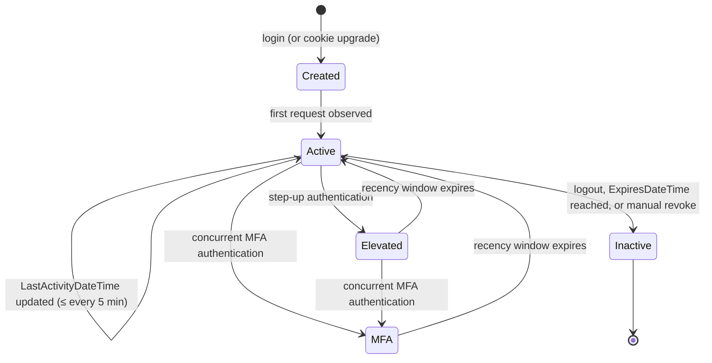

# PersonSession as Session Authority

## Summary

Rock currently treats the `.ROCK` authentication cookie as the source of truth for an authenticated session. The cookie carries the user identity and a handful of flags, and the rest of the system reconstructs everything else (last activity, online status, etc.) by side-channels on `UserLogin`. This spec proposes a new `PersonSession` entity that becomes the authoritative record of a session. The cookie is reduced to a reference (a row pointer plus integrity bits) and the database row carries the lifecycle, recency, and policy data the platform needs to make authorization decisions.

The change unlocks step-up and MFA recency tracking, deterministic session expiration, and a clean policy hook (`AuthenticationStrength` and `AuthenticationRequirement`) that blocks can consume without rolling their own logic.

## Motivation

The triggering motivation is the parallel work to replace Rock's WebForms-based page rendering system with a Lava-based engine intended to run on both WebForms (today) and the in-progress .NET Core branch (tomorrow). That work surfaced a hard prerequisite: most of Rock's session and authorization state lives **inside** `RockPage.cs`, embedded directly in the page lifecycle rather than exposed through helpers that an external engine could call. Even lifting the logic into the new engine wholesale would not help, because the lifted code would still depend on `FormsAuthentication`, `FormsAuthenticationTicket`, `FormsAuthenticationModule`, and ASP.NET Session — none of which exist on .NET Core. The new rendering engine would inherit exactly the WebForms tie-in it was created to escape, defeating the point.

The path forward is to lift session state out of `RockPage` and into a first-class entity (`PersonSession`) with a service surface (`PersonSessionService`) that does not depend on any WebForms infrastructure. The new rendering engine consumes that surface today on WebForms; the .NET Core port consumes the same surface tomorrow. This spec is the foundation work that unblocks both.

Beyond that triggering prerequisite, several long-standing problems trace back to the cookie-as-authority model and get solved by the same change:

- **No notion of session recency.** "User authenticated with password 90 days ago and has clicked around since" looks identical to "user just typed their password". Blocks that should require recent (re-)authentication (giving history, profile edits, financial settings) have no platform-supplied way to ask the question.
- **MFA is invisible after the fact.** Rock cannot tell whether the current session ever involved a second factor, and so cannot enforce MFA-gated features after login.
- **Activity tracking is bolted on.** `UserLogin.LastActivityDateTime` and `UserLogin.IsOnLine` are updated on every page load via a bus task and then read in a handful of places. There is no clean separation between "user exists" and "user has an active session".
- **Persistent ("remember me") sessions are not modeled.** Cleanup behavior, expiration semantics, and revocation are all implicit.
- **Session events have nowhere to hang.** "Send an email when a new session starts on a new device" requires an event the platform does not currently fire.
- **Existing sessions can't be terminated.** The only way to kill an existing cookie session is with the emergency kill-switch that revokes all cookies.

Adopting an industry-standard session model lets the rest of the platform stop guessing at session state and gives blocks a single policy primitive to enforce.

## Requirements

- A new `PersonSession` entity MUST exist and MUST be the authoritative record for an authenticated session.
- The `.ROCK` cookie MUST be reduced to a reference to a `PersonSession` row. The cookie no longer carries authoritative session data.
- Existing `.ROCK` cookies SHOULD be upgraded transparently on first request after the rollout (no forced logout) by creating a `PersonSession` from the cookie's `UserLogin` name.
- The platform MUST expose an `AuthenticationStrength` value for the current request reflecting whether the session is unauthenticated, authenticated (stale), elevated (recent), or MFA (recent + second factor).
- The platform MUST expose a `MeetsRequirement(AuthenticationRequirement)` check on the request context.
- Step-up and MFA recency MUST be tracked as distinct timestamps on the session.
- Persistent ("remember me") sessions MUST be distinguishable from transient sessions and SHOULD have a longer cleanup horizon.
- Expired sessions MUST be retained (marked inactive, not deleted) so historical reporting and forensics still work. The Rock Cleanup job is responsible for marking them inactive when `ExpiresDateTime` is reached.
- API key authentication MUST continue to function for external callers without changes to the request shape (the existing `Authorization-Token` header and `?apikey=` query parameter remain valid). Internally, API-key requests participate in `PersonSession` via a long-lived find-or-create session per `UserLogin` with `CreationSource = ApiKey` (see "API key requests" under Design).
- JWT and OAuth bearer token authentication MUST NOT create a `PersonSession` and MUST NOT participate in activity tracking.
- `InteractionSession` MUST gain a nullable `PersonSessionId` set once on creation, and the platform MUST keep the two in sync across login, logout, and impersonation events.
- Existing public methods MUST NOT change signatures. New behavior is added via new methods/overloads.

## Design

### Entity: `PersonSession`

Inherits from `Rock.Data.Model<PersonSession>` (gains the standard `Id`, `Guid`, audit columns, and `Foreign*` columns automatically) and implements `IHasAdditionalSettings` so impersonation-restore state and other future per-session metadata can be persisted as categorized JSON without schema sprawl.

| Column | Type | Nullable | Notes |
|---|---|---|---|
| `PersonAliasId` | int (FK PersonAlias) | No | Owner of the session. Standard Rock `PersonAlias` semantics apply: on Person merge, `PersonSession` rows are left pointing at their original alias (no fix-up). `PersonAlias` deletion is an admin-only direct-SQL operation requiring manual FK cleanup, not a supported runtime path; no cascade behavior is defined for it. |
| `UserLoginId` | int (FK UserLogin) | Yes | Null for impersonation tokens, passwordless flows, and other cases where there is no concrete `UserLogin`. The FK uses `ON DELETE SET NULL` so deleting a `UserLogin` (which is also how an API key gets revoked under the current Rock model) leaves the historical `PersonSession` row in place with `UserLoginId = null`, rather than cascading the deletion through all of the user's sessions. |
| `IsActive` | bool | No | Set to `false` once `ExpiresDateTime` is reached or the session is manually revoked. Inactive sessions cannot be used for validation and do not appear in admin UI by default. |
| `IssuedDateTime` | datetime | No | When the session was created. Public setter on purpose so unit tests and legitimate backdating scenarios can write it. Unlike `InactiveDateTime`, it has no co-dependent column whose state could be corrupted by an inconsistent caller. |
| `InactiveDateTime` | datetime | Yes | When `IsActive` flipped to `false`. MUST be a private-set property, set automatically by the service during the `PreSave` event. The reason is to keep this column in lockstep with `IsActive`: a caller should never be able to set `IsActive = false` without an `InactiveDateTime`, or stamp an `InactiveDateTime` without flipping `IsActive`. Contradictory states would leave operators unsure how to interpret the row. |
| `ExpiresDateTime` | datetime | Yes | Past this point the session is invalid. Rock Cleanup deactivates rows once exceeded. |
| `LastActivityDateTime` | datetime | No | Updated by the activity bus task. Throttled to once every ~5 minutes (existing `UserLogin` activity update runs every 2 minutes; the session update is intentionally cheaper). |
| `LastStepUpAuthenticationDateTime` | datetime | Yes | Last time the person successfully provided any credential (password, SMS, TOTP) during this session. |
| `LastMultiFactorAuthenticationDateTime` | datetime | Yes | Last time MFA happened. Only updated when MFA is used *concurrently*: password + TOTP in one flow qualifies, password followed by a TOTP-only prompt 10 minutes later does not. The user must re-enter the primary credential together with the second factor for this timestamp to advance. (Industry-standard semantics.) |
| `IsPersistent` | bool | No | `true` when the session was created from a "remember me" login. Drives cleanup horizon. |
| `UserAgent` | nvarchar | Yes | Captured at session creation for forensics and "new device" emails. Null or empty is permitted; SignalR, server-side REST, and OIDC flows may not have a meaningful UA string. Long-term retention inherits the same PII considerations that already apply to other UA-storing tables in Rock; a platform-wide PII / retention policy is out of scope for this spec. |
| `AuthenticationComponentId` | int (FK EntityType) | Yes | Component used for initial authentication. |
| `CreationSource` | enum `PersonSessionCreationSource` | No | How the session was created. Values: `Unknown` (safe default, should not be persisted in normal flows), `Component` (regular authentication via an `AuthenticationComponent`), `Impersonation` (admin-initiated impersonation, restorable to the impersonator's prior session), `UserToken` (user-facing token like an `rckipid` email link, not restorable), `ApiKey` (long-lived session tied to a `UserLogin` whose `ApiKey` property is set; reused across all requests from that key, see "API key requests" subsection), `Legacy` (created during legacy `FormsAuthenticationTicket` cookie upgrade; isolates the upgrade row from real `Component` sessions so the composite-key lookup in "Cookie upgrade path" cannot accidentally collide with a live session for the same user, see "Cookie upgrade path"). Drives `IsImpersonated()`, `GetImpersonatorSession()`, and `EndImpersonationAndRestore()` semantics on `PersonSessionService`. |
| `AdditionalSettingsJson` | nvarchar(max) | Yes | Backing store for `IHasAdditionalSettings`. Read and written exclusively through the categorized extension methods, never touched directly. Known consumers: (1) admin-impersonation restore state, under a dedicated key, carrying the impersorator's prior `PersonSession.Guid`; (2) for `UserToken` sessions, a link to the originating `PersonToken` row (its Guid) so per-request validation can re-check page-scope, expiration, and revocation against the source token. Consumer (2) is required: page-scope enforcement happens on every request while in a `UserToken` session, not just at session creation. Future per-session metadata (device fingerprint hints, channel-specific context, etc.) can be added under additional keys without a schema change. |

### Method: `GetAuthenticationStrength()`

Returns an `AuthenticationStrength` value derived from the session's recency timestamps. The thresholds themselves come from `PersonSessionService` (see below) so the entity stays free of time-dependent constants. The mapping:

```
NotAuthenticated   no PersonSession or IsActive == false
Authenticated      session valid but neither step-up nor MFA is recent enough
Elevated           LastStepUpAuthenticationDateTime >= GetElevatedAuthenticationThreshold()
MultiFactor        LastMultiFactorAuthenticationDateTime >= GetMultiFactorAuthenticationThreshold()
```

`MultiFactor` takes precedence over `Elevated` when both windows are satisfied; the strength reported is the strongest one that applies.

### Service: `PersonSessionService`

Exposes the recency thresholds used by `GetAuthenticationStrength()` and by any caller that wants to filter sessions or evaluate a `MeetsRequirement` check inside an EF query:

```csharp
public DateTime GetElevatedAuthenticationThreshold()
    => RockDateTime.Now.AddMinutes( -ElevatedWindowMinutes );

public DateTime GetMultiFactorAuthenticationThreshold()
    => RockDateTime.Now.AddMinutes( -MultiFactorWindowMinutes );
```

**Defaults (v1):**

| Window | Value | Source |
|---|---|---|
| `ElevatedWindowMinutes` | 30 | `private const int` on the service. |
| `MultiFactorWindowMinutes` | 60 | `private const int` on the service. |

Defaults reflect industry practice for admin/operational tools (GitHub sudo mode, Microsoft elevated session, Auth0 step-up). The MFA window is intentionally longer than the step-up window because passing a second factor is a stronger identity signal and warrants more grace before re-prompting.

**Why methods return a threshold `DateTime` (not the raw int):**

- Callers compare with a single semantic: `if ( session.LastStepUpAuthenticationDateTime >= threshold )`. No minute/hour unit confusion at the call site.
- The expression composes naturally inside EF: `query.Where( s => s.LastStepUpAuthenticationDateTime >= threshold )`.
- A future migration from `private const int` to a system setting is a one-line change inside the service. Call sites do not change.
- A single call yields one consistent `RockDateTime.Now` reference. Callers evaluating strength against multiple timestamps in the same pass are not subject to drift mid-evaluation.

The raw window values stay private. If a future UI needs to display "session expires in N minutes", a separate accessor can be added at that point. Do not expose preemptively.

**Impersonation helpers (sketch).** The service is also the single seam for impersonation queries. Callers MUST NOT read impersonation state directly from `PersonSession.AdditionalSettingsJson` (or any other field); they go through the helpers:

```csharp
bool IsImpersonated( PersonSession session );
PersonSession GetImpersonatorSession( PersonSession session );  // null if not admin-impersonation
internal PersonSession EndImpersonationAndRestore( PersonSession session );  // admin-impersonation only; returns the impersonator session on success, null if restore reference is dangling (and marks current inactive), throws on a non-Impersonation CreationSource
internal ImpersonationProcessResult ProcessImpersonationToken( string rckipidToken );  // pattern B entry point
```

`EndImpersonationAndRestore` and `ProcessImpersonationToken` are `internal` because starting and ending impersonation are not extension points — only core code drives those state transitions. `IsImpersonated` and `GetImpersonatorSession` remain `public` because they are read-only and legitimately useful to plugins, blocks, and Lava.

See the "Impersonation: two distinct cases" subsection below for what each helper does in each impersonation flow. Keeping these on the service preserves the cookie payload as a black box. If the cookie container or payload format ever changes in the future, only these methods change; callers don't.

### Enums

#### `AuthenticationStrength` (Rock.Enums)

```
NotAuthenticated   safe default; rarely returned because the session would be null
Authenticated      authenticated, but not recently
Elevated           (re-)authenticated recently
MultiFactor        (re-)authenticated recently with MFA
```

#### `AuthenticationRequirement` (Rock.Enums)

```
Elevated           caller requires a recent (re-)authentication
MultiFactor        caller requires a recent MFA event
```

Two enums (rather than one shared enum) so the requirement set can grow independently of the strength set. A future `TrustedNetwork` requirement, for example, would let a block say "show giving history if the session meets `Elevated` OR the request is on a trusted network", without contaminating the strength enum, which describes only what the session itself can attest to. (Industry-standard split.)

#### `PersonSessionCreationSource` (Rock.Enums)

Backs the `PersonSession.CreationSource` column. Drives the `IsImpersonated()`, `GetImpersonatorSession()`, and `EndImpersonationAndRestore()` semantics on `PersonSessionService`, and is the discriminator used by the legacy-cookie composite-key lookup under "Cookie upgrade path."

```
Unknown            safe default; should not be persisted in normal flows
Component          regular authentication via an AuthenticationComponent
Impersonation      admin-initiated impersonation, restorable to the impersonator's prior session
UserToken          user-facing token (e.g. rckipid email link), not restorable
ApiKey             long-lived session tied to a UserLogin whose ApiKey property is set
Legacy             created during the FormsAuthenticationTicket cookie upgrade
```

Notes on specific values:

- `Component` covers every standard authentication flow: web login, mobile login, TV login, Auth0, and any other `IExternalRedirectAuthentication` provider. The component that authenticated the session is recorded on `PersonSession.AuthenticationComponentId`.
- `ApiKey` sessions are reused across requests for the same `UserLogin.ApiKey`. See "API key requests" under Design. `ExpiresDateTime` is null on these rows.
- `Legacy` is created exclusively by the upgrade path defined under "Cookie upgrade path." The value isolates upgrade rows from real `Component` sessions so the composite-key lookup `(UserLoginId, IssuedDateTime, CreationSource = Legacy)` cannot collide with a live session for the same user. `Legacy` is NOT deprecated alongside the upgrade code itself: when the migration helpers are removed (`RockObsolete( "20.0" )`, expected removal around v23), historical rows with `CreationSource = Legacy` remain queryable and continue to report their origin correctly.
- `Unknown` exists as a safe default so the column never has to be nullable, but no normal code path produces this value.

### Result types

#### `ImpersonationProcessResult` (internal)

Return type for `PersonSessionService.ProcessImpersonationToken`. A small POCO, not an enum — the value carries both the resulting session reference and the redirect signal in one shape so callers do not have to fetch one and infer the other.

```csharp
internal class ImpersonationProcessResult
{
    /// <summary>
    /// True if the caller MUST redirect to a URL without the rckipid query parameter.
    /// Set for every rule defined in the ProcessImpersonationToken matrix (1 through 5),
    /// including the failure case where the token did not resolve to a valid session.
    /// The flag is explicit rather than implicit ("always true") so future code paths
    /// that do not require redirect (AJAX, server-side fixtures) can produce a result
    /// with IsRedirectRequired = false without breaking the contract.
    /// </summary>
    public bool IsRedirectRequired { get; init; }

    /// <summary>
    /// The PersonSession the request is associated with after processing.
    /// Null if the request is now anonymous (e.g., the token was invalid and there was
    /// no other auth context). Callers can also fetch the current session from
    /// RockRequestContext; this property is exposed primarily for audit / test convenience.
    /// </summary>
    public PersonSession Session { get; init; }
}
```

The type is `internal` for the same reason the methods that return it are `internal`: starting impersonation is a core-only operation, and the result shape should be free to evolve without a breaking-change cost on plugins.

### `RockRequestContext` integration

`RockRequestContext` gains:

- A property exposing the current `PersonSession` (nullable). This property IS the per-request cache: the session is resolved once at request entry and held there for the duration of the request. There is intentionally no separate `PersonSessionCache` entity cache; cross-request caching would add complexity (invalidation on session deactivation, web-farm consistency) without obvious benefit, since per-request resolution is cheap once the cookie has been decoded. Anonymous and API-key / bearer-token requests legitimately have no `PersonSession`, so consumers MUST handle null. For the rare call site not running inside `RockRequestContext`, `HttpContext.Items` is an acceptable fallback covering the same request lifetime.
- A `MeetsRequirement(AuthenticationRequirement)` method that returns a bool. Centralizing this here means blocks stop rolling custom recency checks and the policy can evolve in one place.

### Session lifecycle



`Inactive` rows are retained for history. They are never deleted by Rock Cleanup.

### Central creation path

All session creation MUST flow through `PersonSessionService`. Direct construction of `PersonSession` rows outside the service is prohibited. The service surface exposes one entry point per creation flow because the required inputs diverge enough between flows that a single options POCO would carry illegal-state combinations (e.g. `OriginatingTokenGuid` set on a `Component` flow). Naming reflects whether the method saves:

- **`Start*Session` methods populate but do not save.** They return a fully-initialized `PersonSession` entity. The caller is responsible for `rockContext.PersonSessions.Add(...)` and `rockContext.SaveChanges()`. This is what allows session creation to participate in a larger transaction (e.g. admin impersonation also writes `HistoryLogin` in the same logical operation).
- **`FindOrCreate*Session` methods save when they create.** Their canonical callers are single, well-known paths (`AuthenticateAttribute` for API keys; the legacy-cookie upgrade hook) that have no natural coupling with other writes and that must coordinate concurrent first-request races internally via the upsert-with-unique-key pattern. Auto-saving inside these methods keeps that race-handling self-contained.

```csharp
// Populate-but-don't-save creation flows. Caller commits.
internal PersonSession StartComponentSession( int personAliasId, int userLoginId, int authComponentId, bool isPersistent, DateTime? mfaRecency = null );
internal PersonSession StartImpersonationSession( int targetPersonAliasId, PersonSession impersonatorSession );
internal PersonSession StartUserTokenSession( int targetPersonAliasId, PersonToken token );

// Find-or-create flows. Save internally when a create is needed.
internal PersonSession FindOrCreateApiKeySession( UserLogin userLogin );
internal PersonSession FindOrCreateLegacyUpgradeSession( int userLoginId, DateTime ticketIssueDate );

// Cookie production (orthogonal to creation).
string GetCookieValue( PersonSession session );                                       // opaque encrypted cookie value
void   SetAuthCookie( PersonSession session, RockRequestContext context );           // attaches cookie via context
```

All `Start*` and `FindOrCreate*` methods delegate to a private `PopulateNewSession(...)` helper that owns the shared invariants (`IsActive = true`, audit-column wiring, `IssuedDateTime` defaulting to `RockDateTime.Now` if not supplied, `IsPersistent` default, etc.). This is the structural seam for any future cross-cutting validation.

Downstream events (new-device email, audit logging, anomaly detection) fire from `PersonSession.PostSave` rather than from the creation methods themselves. This is intentional and has two consequences:

1. Events fire **only on successful commit**, not on object construction. A caller that builds a session and then rolls back the transaction does not trigger spurious notifications.
2. Events fire **regardless of which entry point built the session**. A new code path that calls `StartComponentSession` later inherits the same downstream behavior without re-registering.

`SetAuthCookie` internally calls `GetCookieValue` and writes the cookie through `RockRequestContext`, which abstracts the HTTP response. `GetCookieValue` MUST NOT touch `HttpContext` directly; it returns a pure opaque string suitable for any caller (browser cookie, device token, test fixture). The architectural rule applies to all helpers on `PersonSessionService`: no direct `HttpContext` access. Cookie/HTTP work routes through `RockRequestContext`. The reason is .NET Core portability: `HttpContext` semantics differ enough between System.Web and ASP.NET Core that direct dependencies create migration friction.

This separation is what unblocks non-cookie flows (Mobile and TV device authentication, server-side test fixtures, future SignalR / push integrations) from going through the central creation seam without needing a fake HTTP response.

### Interaction with `InteractionSession` and ASP.NET Session

`InteractionSession` gains a nullable `PersonSessionId`. The column is populated by one of three paths:

1. **Stamp at creation.** When `InteractionSession` is created and a `PersonSession` already exists on the current request, the new row is inserted with `PersonSessionId` set to that session's Id. This covers the "user arrives already authenticated via a persisted cookie" case.
2. **Adopt by update at login.** When a person logs in mid-session (the common visitor-becomes-authenticated flow: browse anonymously → eventually log in), the existing `InteractionSession` for the current browser session is updated to set `PersonSessionId` to the new `PersonSession`. The full pre-auth journey thereby attaches retroactively to the now-known person, which is the whole point of adopting rather than creating a fresh row.
3. **Adopt by update at legacy cookie upgrade.** When a request arrives with a legacy `.ROCK` cookie and `FindOrCreateLegacyUpgradeSession` resolves or creates a `Legacy` `PersonSession`, any existing `InteractionSession` for the current browser session is updated to set `PersonSessionId` to that session. Mechanically identical to path 2; the trigger differs (cookie upgrade rather than fresh login). This matters because a user who has been browsing under the legacy cookie may already have an `InteractionSession` row that pre-dates the upgrade, and that row's downstream activity should be attached to the upgraded `PersonSession` rather than left orphaned.

The SQL-driven upsert at `Rock/Model/Core/Interaction/InteractionService.cs:583` is insert-only today; it must gain a path that updates `PersonSessionId` on an existing row keyed by `RockSessionId`. The same update path serves both adoption flows (paths 2 and 3). The race-condition surface is unchanged from today (the unique key on `RockSessionId` continues to mediate concurrent inserts; the new column just rides along).

To keep the three (`PersonSession`, `InteractionSession`, ASP.NET Session) in sync, authentication events drive resets:

| Event | PersonSession | InteractionSession | ASP.NET Session |
|---|---|---|---|
| Login, not already authenticated | Create new | Adopt existing | Create new |
| Login, already authenticated, different person | Create new | Create new | Create new |
| Login, already authenticated, same person (step-up only) | Reuse existing | Reuse existing | Reuse existing |
| Logout | Mark inactive | Create new | Create new |
| Admin impersonation, start | Create new (impersonator's session Guid stamped in `AdditionalSettingsJson` on the new row) | Create new | Create new |
| Admin impersonation, end / restore | Mark current inactive; restore prior session from `AdditionalSettingsJson` on the impersonation session | Create new | Create new |
| User-token impersonation (`rckipid` email link) | Create new (no impersonator session) | Create new | Create new |
| Legacy cookie upgrade | Find or create (composite key `UserLoginId`, `IssuedDateTime`, `CreationSource = Legacy`) | Adopt existing | Reuse existing |

For impersonation specifically, the original `PersonSession` Guid (and any companion resume state) is stamped into `AdditionalSettingsJson` on the new impersonation `PersonSession` under a dedicated key, so it can be read back on impersonation exit and the prior session restored cleanly. The cookie itself carries only the session Guid; the restore state never appears on the wire. ASP.NET Session is also deliberately not used for this. Beyond the technical fit (rare feature, short-lived, small payload), the long-term direction for Rock is to move off ASP.NET Session entirely because it enforces single-page-per-session processing (the session lock serializes requests for the same user, hurting concurrent page loads and API calls). This spec does not migrate every ASP.NET Session use case off the platform, but it deliberately does not add a new dependency on it either.

`InteractionSession` for website viewing always recycles on app pool recycle (so practical session duration is bounded at ~24 hours). Creating fresh sessions on auth events is therefore not a meaningful behavior change.

### API key requests

Requests authenticated by a Rock API key (`UserLogin.ApiKey` matched via the `Authorization-Token` header or `?apikey=` query parameter) participate in `PersonSession`. The API key remains a property of `UserLogin`; nothing about the key's storage or issuance changes. What changes is the activity-tracking model.

On each API-key request, `AuthenticateAttribute` (after resolving the `UserLogin` by `ApiKey`) calls `PersonSessionService.FindOrCreateApiKeySession( userLogin )`. The service returns the active `PersonSession` for that `UserLogin` with `CreationSource = ApiKey`, or creates a new one if none exists. The session is long-lived: subsequent API-key requests from the same key reuse the same row, and `LastActivityDateTime` flows through the standard `UpdatePersonSessionLastActivity` bus task (throttled the same way it is for browser requests). The session has no `ExpiresDateTime` (API keys are intentionally durable; cleanup is by `UserLogin` deletion, not session expiration).

The find-or-create logic uses the same upsert-with-unique-key pattern that `InteractionSession` adoption uses (`Rock/Model/Core/Interaction/InteractionService.cs:583`), so concurrent API-key requests for the same `UserLogin` cannot race to create duplicate rows.

`InteractionSession` is NOT created for API-key requests; that behavior is unchanged from today. API-key requests participate in `PersonSession.LastActivityDateTime` tracking, but they do not generate interaction records.

When a `UserLogin` is deleted (the way an API key is revoked under the current Rock model), the FK's `ON DELETE SET NULL` behavior sets the associated `PersonSession.UserLoginId` to null, leaving an orphaned historical row that no subsequent request can resurrect (no `UserLogin` matches the deleted key). Rock Cleanup can mark such orphaned rows inactive based on activity staleness.

**JWT and OAuth bearer tokens are different.** The other bearer-token paths handled by `Rock.Rest/Filters/AuthenticateAttribute.cs` (JWT via `HeaderTokens.JWT`, OAuth bearer via ASOS) do NOT create a `PersonSession` and do not participate in activity tracking. The rationale: these tokens are issued out-of-band by third-party clients and validated per-request from their own state (signature, issuer claims, ASOS authorization grant). Persisting a session per token-bearing request would add database churn without giving the platform any authority it doesn't already have from the token itself. The OIDC password-grant flow (`Rock.Oidc/Authorization/AuthorizationProvider.cs:120-182`) is in the same category: it exchanges credentials for an access token but does not authenticate the requesting HTTP connection. OAuth access tokens and `.ROCK` cookies are different artifacts (different transport, different validation middleware, different consumers), so an OIDC-issued token cannot authenticate a RockPage / Obsidian page load even if a caller tried to inject it as a cookie. `AuthenticateAndTrack` continues to update `UserLogin.LastLoginDateTime` as a side effect; that behavior is preserved.

### Mobile and TV device authentication

Mobile and TV clients today authenticate via the same `.ROCK` cookie as browsers. The mobile login endpoint produces an encrypted `FormsAuthenticationTicket` (`Rock/Mobile/MobileHelper.cs:206`, `Rock/Tv/TvHelper.cs:193`) and returns it to the client as a string in the response body (rather than as a `Set-Cookie` header, because the device manages cookie storage manually). The client then sends the ticket back as a `Cookie: .ROCK=...` header on every subsequent request. The standard `FormsAuthenticationModule` (registered in `web.config`) decrypts the cookie on the inbound ASP.NET pipeline and sets the request principal. By the time `AuthenticateAttribute` runs, the principal is already populated and its lines 70-77 short-circuit (`AuthenticateAttribute.cs:215-219` comment: "this is normally already set from the .ROCK cookie"). So mobile and TV requests use the cookie pipeline, not a separate `Authorization`-header branch.

Under the new model:

- Mobile and TV sessions are **full persistent sessions**, not API keys. `CreationSource = Component`, `IsPersistent = true`, `AuthenticationComponentId` set to whichever component authenticated the login. They are long-lived authenticated sessions tied to a specific person and device.
- Mobile and TV login flows obey the same auth-state-transition rules as the web login flow (per the InteractionSession sync table above): anonymous → new session; same-person re-login → reuse the existing active session; different-person → new session; logout → mark inactive.
- The mobile/TV login block calls `StartComponentSession` (or selects an existing active session per the transition rules), saves the rock context, then calls `GetCookieValue` to obtain the opaque value to hand back to the device in the response body. It does NOT call `SetAuthCookie`, because the device is responsible for cookie storage, not the server response.
- Device token refresh (the device asks for a new token without re-entering credentials) is the pure reuse case: the existing `PersonSession` is unchanged and `GetCookieValue` is called against it to produce a fresh opaque value for the device.
- Subsequent mobile/TV API requests carry the cookie value as a `Cookie: .ROCK=...` header. The cookie validation path defined under "Cookie container" (the `Application_BeginRequest` handler for new-format cookies; the legacy `FormsAuthenticationModule` + `Application_PostAuthenticateRequest` upgrade hook for legacy cookies) decodes it, resolves the `PersonSession.Guid`, validates the session, sets the current user, and triggers the standard `UpdatePersonSessionLastActivity` bus task. No special branch in `AuthenticateAttribute` is required: the existing "principal already set" short-circuit (`AuthenticateAttribute.cs:70-77`) continues to be the mobile/TV entry point.
- The `IsImpersonated` and `IsTwoFactorAuthenticated` flags previously embedded in the device's ticket are dropped, consistent with the new cookie format. Impersonation context lives on `PersonSession`; MFA recency lives on `LastMultiFactorAuthenticationDateTime`.
- Today's `Authorization.GetSimpleAuthCookie` (`Rock/Security/Authorization.cs:853`) is the existing non-emitting variant used by the mobile login block; the new `GetCookieValue` supersedes it cleanly. The old method becomes a thin wrapper during deprecation.

A direct consequence of mobile/TV using the cookie: the existing `RejectAuthenticationCookiesIssuedBefore` kill-switch already covers mobile/TV requests, because `Request.Cookies[FormsCookieName]` is non-null on those requests. No mobile/TV-specific extension is needed.

**Out of scope for this subsection:** the JWT (`HeaderTokens.JWT`) and ASOS bearer-token paths in `AuthenticateAttribute` are independent authentication mechanisms that happen to share the same filter. Both are classified as API-key-pattern flows (see "API key requests" above): they do not create a `PersonSession` and do not participate in activity tracking.

### SignalR real-time hubs

SignalR hub connections are read-only consumers of session state. The hub uses the existing `.ROCK` cookie that the browser already holds; on connection, the platform resolves the cookie to a `PersonSession` and makes it available to hub actions (so they can determine "who is the current person" when handling messages). The hub does **not** create a `PersonSession`. There is no "login via SignalR" path; if no session exists, the connection proceeds anonymously and the hub actions see no current person.

This keeps SignalR aligned with the rest of Rock: authentication happens through the regular cookie pipeline, the hub just consumes the result. The `UpdatePersonSessionLastActivity` bus task is NOT triggered by SignalR traffic — long-lived hub connections would otherwise generate excessive activity writes for a single browser session that already updates `LastActivityDateTime` through normal page loads.

### MFA detection

For the initial rollout, MFA is detected via `AuthenticationComponent.IsConfiguredForTwoFactorAuthentication()`. This is a global on/off switch with no parameters and is currently only called by the Login block, but it is enough to set `LastMultiFactorAuthenticationDateTime` correctly for the path that matters. A proper per-request signal from the component is deferred to a future authentication-component rewrite.

### Current cookie format

Today, `Rock.Security.Authorization.GetAuthCookie()` (`Rock/Security/Authorization.cs:823`) builds a `FormsAuthenticationTicket` (machine-key encrypted, version 1) carrying:

| Ticket field | Meaning |
|---|---|
| `Name` | The `UserLogin` name. This is the only identity carried on the wire. |
| `IssueDate` | `RockDateTime.SystemDateTime` at issue time. |
| `Expiration` | `IssueDate + FormsAuthentication.Timeout` (or the explicit override). |
| `IsPersistent` | Mirrors the "remember me" flag. |
| `UserData` | A JSON-serialized `AuthenticationTicketUserData` (`Authorization.cs:1561`) with two fields: `IsImpersonated` (bool), `IsTwoFactorAuthenticated` (bool). |
| `CookiePath` | `FormsAuthentication.FormsCookiePath`. |

A companion `{FormsCookieName}_DOMAIN` cookie stores the cookie domain so cross-subdomain logout can clear the auth cookie correctly. It carries no auth data.

### New cookie format

The cookie carries **only** the `PersonSession.Guid`. Everything else (the `UserLogin` name, persistence, MFA recency, expiration, impersonation kind, impersonation-restore state) lives on the `PersonSession` row and is looked up server-side per request. The cookie remains signed and encrypted so it cannot be forged.

- The cookie container is a custom signed-and-encrypted format, **not** a `FormsAuthenticationTicket`. See the "Cookie container" subsection below.
- Plaintext payload is minified JSON with short keys to keep cumulative request-header weight down: `{"v":1,"sid":"<personSessionGuid>","iat":"<ISO 8601 datetime>"}`.
  - `v` — payload version. Bumps **only** on breaking changes to existing field meanings. Additive fields land alongside without a `v` bump (JSON's natural forward-compatibility carries this).
  - `sid` — the `PersonSession.Guid`.
  - `iat` — issued-at timestamp for **this cookie** (not the session). Drives the sliding-expiration reissue mechanism described under "Cookie reissue" below. Distinct from `PersonSession.IssuedDateTime`, which reflects the session's origin and never changes on reissue.
- Browser-side cookie expiration is bounded by the shorter of the session's lifetime and the configured forms-authentication timeout. The authoritative expiration check still happens server-side against `PersonSession.ExpiresDateTime`; the browser-side `Expires` attribute is purely a hygiene measure that lets stale cookies self-clean and caps the blast radius of a stolen cookie.
  - **Persistent ("remember me") sessions:** `cookie.Expires = MIN( PersonSession.ExpiresDateTime ?? DateTime.MaxValue, RockDateTime.Now.Add( FormsAuthentication.Timeout ) )`. With the default 30-day timeout, a session that lives for 400 days still hands out a cookie that the browser only holds for 30 days; a session that expires in 7 days hands out a cookie that the browser also only holds for 7 days. Cookies are reissued at half-life as the user remains active so the cap slides forward (see "Cookie reissue").
  - **Non-persistent ("don't remember me") sessions:** no `Expires` attribute (session cookie, dies when the browser closes). This matches today's behavior (`Authorization.cs:838-841` only sets `Expires` when the ticket is persistent) and is unchanged under the new model.
- `IsImpersonated` and `IsTwoFactorAuthenticated` are dropped from the cookie payload. Impersonation context is recorded by `PersonSession.CreationSource` and the impersonator's prior session Guid lives in `PersonSession.AdditionalSettingsJson` (under a dedicated key). MFA recency lives on `LastMultiFactorAuthenticationDateTime`. Callers reach all of this through `PersonSessionService`, never the cookie.
- The companion `{FormsCookieName}_DOMAIN` cookie is preserved unchanged. It carries no auth data; its sole job is to record the cookie domain so cross-subdomain logout can clear the auth cookie correctly. Same behavior, same lifecycle.

### Cookie upgrade path

When a request arrives with a legacy `.ROCK` cookie:

1. If the legacy cookie's `UserData.IsImpersonated == true`, **drop the cookie and treat the request as unauthenticated.** Impersonation cookies were always meant to be short-lived ("let me impersonate Ted real quick to see what he sees"); silently upgrading them into long-lived `PersonSession` rows would extend impersonation past its intended lifetime. The impersonator can simply re-impersonate after the rollout.
2. Look up an existing `PersonSession` by the composite key `(UserLoginId, IssuedDateTime, CreationSource = Legacy)` where `UserLoginId` is resolved from the ticket's `Name` field and `IssuedDateTime` is taken directly from the ticket's `IssueDate`. If found, use it. If not found, create a new `PersonSession` with `IssuedDateTime = ticket.IssueDate` and `CreationSource = Legacy`. The composite lookup is what makes repeated legacy-cookie presentations (from clients that do not honor `Set-Cookie`, see the Mobile/TV discussion under "Cookie container") resolve to the *same* `PersonSession` row across requests rather than spamming new rows. Constraining the lookup to `CreationSource = Legacy` isolates the upgrade row from any live `Component`, `UserToken`, `Impersonation`, or `ApiKey` session that happens to share `(UserLoginId, IssuedDateTime)` — collision is unlikely but the constraint costs nothing and removes the risk entirely. Using the ticket's own `IssueDate` (which is part of the encrypted payload and therefore stable across reads of the same cookie) as `PersonSession.IssuedDateTime` also makes the `RejectAuthenticationCookiesIssuedBefore` kill-switch correct for upgraded sessions for free.
3. Always reissue the cookie in the new format on the response. Browser clients pick this up on the next request via the standard cookie jar and migrate naturally. Clients that do not honor `Set-Cookie` keep sending the legacy cookie; the lookup in step 2 ensures they continue to resolve to the same `PersonSession` indefinitely with no row spam.
4. The user is not forced to log in again.
5. `LastStepUpAuthenticationDateTime` and `LastMultiFactorAuthenticationDateTime` start null on a newly upgraded row, so it reports `Authenticated` (not `Elevated` or `MultiFactor`) until the user next authenticates. The legacy `IsTwoFactorAuthenticated` flag is intentionally not honored on upgrade because the old cookie does not carry a timestamp, so we cannot decide whether it should count as "recent" under the new model.

### Cookie reissue

Persistent cookies have a bounded browser-side lifetime (the formula under "New cookie format"). For a session that lives longer than that lifetime, the cookie must be reissued periodically as the user remains active so the browser-side `Expires` cap slides forward and the user is not logged out by cookie expiration alone. The reissue cadence matches what `FormsAuthentication` does today by default (`<forms slidingExpiration="true">`, reissue at the cookie's half-life): a comparable user experience to current Rock with no rotation surprises.

On every authenticated request, the cookie validation path decrypts the cookie and reads `iat` from the payload:

1. **If `now - iat >= FormsAuthentication.Timeout / 2`** (i.e. the cookie is at or past its half-life — 15 days with the default 30-day timeout), the response emits a fresh `Set-Cookie` with:
   - A new `iat` (current `RockDateTime.Now`).
   - A refreshed `Expires` attribute computed from the same `MIN` formula under "New cookie format" (the cap slides forward because `Now` has advanced).
   - The same `sid` (the session itself does not change).
2. **If `now - iat < FormsAuthentication.Timeout / 2`**, no reissue. The existing cookie continues to flow.

Reissue MUST NOT change `PersonSession.IssuedDateTime`. That column reflects the session's origin and is what the `RejectAuthenticationCookiesIssuedBefore` kill switch checks against. Reissue only refreshes the cookie's `Expires` attribute and the embedded `iat`.

Additional reissue triggers, orthogonal to the half-life check (any of these forces reissue on the current response regardless of `iat` age):

- The cookie decrypted via an `OldDataEncryptionKey{n}` (`Rock/Security/Encryption.cs:99-110`) rather than the current `DataEncryptionKey`. Reissue with the current key drains rotated keys out of circulation.
- The cookie's payload `v` is older than the current payload version. Reissue at the current `v` migrates the payload forward.
- The legacy-cookie upgrade path fired (see "Cookie upgrade path"). The legacy `FormsAuthenticationTicket` is replaced with the new format.

Mobile and TV clients do not honor `Set-Cookie` on non-login responses (see "Cookie container"). The reissue `Set-Cookie` is emitted regardless; mobile/TV clients ignore it and continue sending the original cookie value. The composite-key lookup under "Cookie upgrade path" keeps their resolution correct, and Mobile clients pick up the new cookie organically at the next launch-packet call.

The reissue logic lives inside `PersonSessionService.SetAuthCookie` / `GetCookieValue` so callers never see the decision; they hand the service a `PersonSession` and the service does the right thing with the response.

### Impersonation: two distinct cases

Rock currently uses the term "impersonation" for two different flows that share an `rckipid` query parameter today but have different lifecycles and different session semantics. The spec preserves both and treats them as separate cases.

**Admin impersonation.** An administrator opens a person's record and clicks "Impersonate" on the Person Bio block (`RockWeb/Blocks/Crm/PersonDetail/Bio.ascx.cs`). Today this sets `Session["ImpersonatedByUser"]` and redirects to the same page (or a configured target) with an `rckipid` query parameter. The admin can later restore their original session. Under the new model:

- A new `PersonSession` is created for the impersonated person with `CreationSource = Impersonation`.
- The admin's prior `PersonSession.Guid` is written into `AdditionalSettingsJson` (under a dedicated impersonation-restore key) so `EndImpersonationAndRestore` can revert.
- `LastStepUpAuthenticationDateTime` and `LastMultiFactorAuthenticationDateTime` are copied from the impersonator's prior session to the new impersonation session at creation. This preserves the admin's recency so an admin who recently authenticated does not get re-prompted by high-security blocks during impersonation. (Current `ProcessImpersonation` accomplishes this by force-setting `isTwoFactorAuthenticated: true` on the reissued cookie; an engineering note in that method calls out the intent.)
- Ending impersonation via `EndImpersonationAndRestore` does NOT touch the restored session's recency timestamps. The admin's prior session resumes with its own original values.
- The block that initiates impersonation SHOULD switch to a flow that fully sets up the new session (cookie reissued, restore state written) and redirects to a token-free URL. Today's implementation bounces `rckipid` back into the redirect target's URL, which leaks the token into browser history and triggers `ProcessImpersonation` on every subsequent page load. The new flow drops the parameter at the first redirect.

**User-token impersonation.** Rock generates `rckipid` tokens for use in email links so recipients can view personalized content (end-of-year giving statements, event registration receipts, prayer-team responses) without logging in. The recipient is not "an impersonator" in the admin sense; they are the legitimate owner of the data being viewed and may never have logged in to Rock at all. Under the new model:

- A new `PersonSession` is created for the token's target person with `CreationSource = UserToken`.
- `AdditionalSettingsJson` carries no impersonation-restore state; there is no impersonator session to restore to.
- `AdditionalSettingsJson` carries a reference to the originating `PersonToken.Guid`. On every subsequent request while this session is active, the platform re-validates the token's page-scope, expiration, and revocation status against the source `PersonToken` row. If the user navigates to a page the token does not authorize, they receive a not-authorized error (matching today's behavior). If the token has since expired or been revoked, the session is marked inactive on the next request.
- `PersonToken.TimesUsed` is incremented only when `rckipid` is present in the query string AND differs from the token referenced by the current session. This is what makes `UsageLimit = 1` work for an entire browsing session: the token is "consumed" once to establish the session; subsequent page navigation does not re-consume it because the URL no longer carries `rckipid` after the initial redirect. The user can re-click the email link until they sign out (or the session expires), at which point a re-click attempts to use the token again and would fail if the usage limit has been reached.
- The session is not restorable. `GetImpersonatorSession` returns null, `EndImpersonationAndRestore` throws an exception.

**Distinguishing the two.** Both flows produce a `PersonSession` and both make `IsImpersonated` return true. `CreationSource` is the authoritative discriminator: `Impersonation` for admin (restorable), `UserToken` for email-link (not restorable), `Component` for normal authenticated sessions. The cookie does not need to carry this distinction.

**Pattern A vs Pattern B (callers).** Existing code that parses `"rckipid=" + token` out of the cookie's `Name` field falls into two patterns. The migration target is different for each:

- **Pattern A** (most callers): the code only wants to know "is this an impersonated session?". This is a simple boolean read against `PersonSession`. `IsImpersonated()` covers it. `Rock/Web/UI/RockPage.cs:2076`, `Rock/Model/CRM/UserLogin/UserLogin.WebForms.cs:101`, and similar audit-and-display call sites are Pattern A.
- **Pattern B** (request-init only): the code is inspecting the `rckipid` query parameter on an incoming request to decide whether to start a new session. This belongs at a single seam, `PersonSessionService.ProcessImpersonationToken()`, which applies these rules in order:
  1. If the token is invalid, expired (by `ExpireDateTime` or `UsageLimit`), or revoked: log them out of the current session (so the user is not silently left "still logged in as themselves" with a misleading impression that the token worked) and return redirect-required so the `rckipid` is stripped from the URL. The resulting page load is anonymous; the user can authenticate normally if they have other means. This matches the existing behavior of the `rckipid` flow when a token is no longer usable.
  2. If the current session has `CreationSource = UserToken` and its target person matches the token's target, do NOT create a new session row, but DO return redirect-required so the token is stripped from the URL. The session continues unchanged. This both protects against row-spam and prevents the token from persisting in browser history when the same `rckipid` URL is followed across multiple page loads.
  3. If the current session has `CreationSource = Impersonation` (admin impersonation), abandon the impersonation session and create a fresh `UserToken` session for the token, **even if the token's target matches the admin or the currently-impersonated person**. Admin impersonation carries restore state, audit context, and MFA recency from the admin's prior session that should not be inherited by a token-driven access. The case is an edge that should not happen in normal flows, but explicit handling avoids subtle confusion.
  4. If the current session has `CreationSource = Component` AND the token's target matches the currently-logged-in person, do NOT change session state but DO return redirect-required so the token is stripped from the URL. The session is already sufficient to view the content; reissuing a cookie or creating a row would be churn, and no authentication event has actually occurred. The redirect prevents the token from persisting in browser history and from being re-processed on every subsequent page load. `LastActivityDateTime` advancement is unaffected because it happens through the activity bus task, not through this seam.
  5. Otherwise (Anonymous, `Component` for a different person, or `UserToken` for a different target), mark any current session inactive and create a new `UserToken` session for the token.
  6. Return a status indicating whether the caller must redirect to a token-free URL. Redirect is required for every rule above (1 through 5): anywhere the helper was called, the `rckipid` must come out of the URL so it does not persist in browser history, get re-processed on the next page load, or get leaked via referer.

Pattern B callers MUST go through this helper and MUST NOT reimplement token processing. `Rock/Web/UI/RockPage.cs:2111` (`ProcessImpersonation`) is the canonical Pattern B caller and is the single highest-priority migration target during implementation. The `rckipid=` prefix parsing in `Rock.Rest/ApiControllerBase.cs:103`, `Rock/Web/HttpModules/RockGateway.cs:499`, and the `UserLogin.WebForms.cs` helpers are also Pattern B and must move to the same seam.

This subsection answers the impersonation Blocker by representing impersonation state via `CreationSource` plus `AdditionalSettingsJson` (for restore state), not via a dedicated flag or side table. Remaining product-level subquestions (MFA recency on `UserToken` sessions; `PersonToken` write on admin impersonation) are tracked under Open Questions.

### Cookie container

Rock moves off `FormsAuthenticationTicket` for the auth cookie and onto a custom container produced by the existing `Rock.Security.Encryption.EncryptString` / `DecryptString` pair (`Rock/Security/Encryption.cs`). The motivating reasons:

- **Cross-branch cookie interoperability.** A separate .NET Core branch of Rock is in progress. `FormsAuthenticationTicket` and `FormsAuthentication.Encrypt` do not exist on .NET Core, so a continued reliance on them would force a second cookie migration during the eventual port. `Encryption.EncryptString` uses only primitives present identically on .NET Framework and .NET Core (`Aes.Create`, `HMACSHA256`, HKDF math via `System.Security.Cryptography`), so the same cookie format validates on both branches today and on the .NET Core port tomorrow. Production deployments can run mixed-version farms during cutover without forced re-authentication.
- **Cryptographic adequacy.** `EncryptString` V2 is AES-256-CBC + HMAC-SHA256 in encrypt-then-MAC construction with HKDF-derived ENC/MAC keys, a `"V2"` footer for O(1) format detection, and constant-time tag comparison before any decryption attempt (verifies at `Rock/Security/Encryption.cs:503`). This is cryptographically equivalent to AES-GCM for our purposes — confidentiality plus authentication, no padding-oracle exposure — and reuses code already audited and shipping in Rock for attribute encryption, financial fields, and the like. No new crypto code to write or review.
- **Key infrastructure already exists.** The `DataEncryptionKey` web.config app setting is the root secret, already shared across web-farm nodes, and already supports rotation via `OldDataEncryptionKey{n}` app settings (`Rock/Security/Encryption.cs:99-110`). No new configuration is introduced.

**Cookie value layout.** The plaintext is the minified JSON described under "New cookie format" above. The cookie value is `Encryption.EncryptString(plaintext)` — a base64 string carrying `[ivLen][IV][CIPHERTEXT][TAG]["V2"]`. A 36-character Guid payload produces roughly 116 characters of cookie value; the entire JSON envelope adds ~20 plaintext bytes and a single base64 block to the encrypted result. This is small enough not to threaten the cumulative request-header limits Rock operates within (IIS default 16KB across all headers).

**Auth pipeline integration during the dual-reader window.** During and after the rollout, both the new format and the legacy `FormsAuthenticationTicket` format must be accepted. The integration uses the same hook point Rock already relies on for the `RejectAuthenticationCookiesIssuedBefore` kill switch (`RockWeb/App_Code/Global.asax.cs:582-604`), avoiding any web.config change to the modules pipeline:

1. `Application_BeginRequest` reads the `.ROCK` cookie. Format detection is cheap — a base64-decode plus a `"V2"` footer check distinguishes new from legacy without a full crypto operation.
2. **New-format cookie:** decrypt via `Encryption.DecryptString`, parse the JSON, load the `PersonSession`, run the `RejectAuthenticationCookiesIssuedBefore` check against `PersonSession.IssuedDateTime`, and set `HttpContext.User` to an authenticated principal. `FormsAuthenticationModule.OnEnter` short-circuits at its `Context.User != null && Context.User.Identity.IsAuthenticated` guard and does not attempt to decrypt the cookie with the machine key. No `Request.Cookies` mutation is required.
3. **Legacy cookie:** leave the cookie untouched in `BeginRequest` (apart from the existing kill-switch check). `FormsAuthenticationModule` decrypts as it does today and sets `Context.User` to a `FormsIdentity`. `Application_PostAuthenticateRequest` detects the `FormsIdentity`, runs the upgrade path defined under "Cookie upgrade path" above (create the `PersonSession` from the ticket's `Name`, reissue the cookie in the new format), and replaces `Context.User` with the authenticated principal backed by the new `PersonSession`.
4. **No cookie:** anonymous request, no work to do.

This pattern reuses the established precedent at `Global.asax.cs:582-604` (intercept in `BeginRequest`, before `FormsAuthenticationModule` runs) rather than removing the module from the pipeline. Rollback is "revert C# in `Global.asax.cs`" — no web.config changes, no IIS configuration changes.

**Mobile/TV cookie reissue.** Rock Mobile and Rock TV treat the `.ROCK` cookie value as an opaque string handed back by the login endpoint and **do not** honor `Set-Cookie` headers from non-login responses (verified by client-code review, not yet by live testing). Cookie migration for these clients therefore cannot rely on the `Set-Cookie` path that browsers use. Two separate stories:

- **Rock Mobile** has a natural migration point via `MobileController.GetLaunchPacket` at `Rock.Rest\Controllers\MobileController.cs:78`. The endpoint is `[Authenticate]`-gated, so the client presents its current `.ROCK` cookie; the server resolves the session and returns a fresh `CurrentPerson.AuthToken` (`MobileController.cs:130`) which the Mobile client stores back as its `.ROCK` cookie value on next launch. Under the new model this same flow naturally produces a new-format token when called with a legacy cookie, so Mobile clients migrate at their next app launch with no client-side change required. Worst-case clients (users who don't relaunch the app for an extended period) continue to work via the legacy-cookie resolution path described under "Cookie upgrade path."
- **Rock TV** has an analogous server-side `TvController.GetLaunchPacket` (`Rock.Rest\v2\TvController.cs:858`) that *does* return a fresh `AuthToken` in the response, but the TV client (per inspection of the client repo) does NOT use the launch-packet `AuthToken` at all — only the token returned by the initial login is ever used as the `.ROCK` cookie value. TV clients therefore continue to send the original (legacy) cookie indefinitely until either (a) the user signs out and back in (organic re-auth on the new format), (b) a future TV client release wires up the launch-packet token, or (c) the legacy reader is sunset and the user is forced to re-auth. All three are acceptable end-states; the spec preserves correctness in the meantime via the composite-key lookup in step 2 of the upgrade path.

Both findings are based on reading the respective client repos. Hands-on verification is not required: the design's composite-key lookup makes the legacy resolution correct whether or not either client honors the launch-packet token, and the legacy reader is on a defined sunset path regardless (see Deprecations and removals). The Mobile/TV behavior only affects *how quickly* clients migrate organically, not whether the design works.

**`FormsAuthentication.SignOut` callers.** Logout paths that currently call `FormsAuthentication.SignOut()` are routed through `PersonSessionService` (which marks the current `PersonSession` inactive and clears the `.ROCK` cookie via `Response.Cookies`). The static helper itself remains usable during the dual-reader window for any code paths that still need it; full removal can happen after the legacy format is retired.

### Deprecations and removals

**Scope note.** The deprecations below apply only to the specific `UserLogin.*` properties named in the table. Other entities in Rock have their own `LastActivityDateTime` columns (notably `ConnectionRequest`, and the `ConnectionListGridUpdateBag` view-model used by the Connection blocks); those are unrelated to authentication and are NOT in scope for deprecation.

| Item | Action |
|---|---|
| `UserLogin.LastActivityDateTime` | Deprecate fully. No writers remain after the change: page-load updates go to `PersonSession.LastActivityDateTime`, and API-key request activity now goes there too via the `ApiKey` `CreationSource` session (see "API key requests" subsection). Readers (Active Users block, Data Automation job) move to `PersonSession`. |
| `UserLogin.IsOnLine` | Deprecate, and remove ALL writers wholesale. The new model derives "is the user online?" from `PersonSession.LastActivityDateTime`, so there is no boolean flag to clear on app start/stop or on logout. Code being deleted: `MarkOnlineUsersOffline()` at app startup and shutdown (`RockWeb/App_Code/Global.asax.cs:203,782,834`), the `Session_End` handler's offline-flag write (`Global.asax.cs:547-568`), and every `UpdateUserLastActivity.Message.Send( ..., IsOnline = false )` call from logout paths (`Rock.Blocks/Security/Logout.cs:109`, `LoginStatus.cs:332`, `ConfirmAccount.cs:391`, `Rock/Web/UI/RockPage.cs:843`, `Rock/Model/CRM/UserLogin/UserLoginService.WebForms.cs:78`). Readers (Active Users block) move to `PersonSession`. The bus task's `IsOnline` property is deprecated alongside. |
| `UserLastActivityTransaction` | Remove (already deprecated in v13). |
| `UpdateUserLastActivity` bus task | Deprecate. Add a new `UpdatePersonSessionLastActivity` bus task that updates `PersonSession.LastActivityDateTime`. The new task name pairs with the new entity, and a clean split (rather than a property-deprecation pass on the old task) avoids leaving the legacy message class half-meaningful for plugins still on the old API. |
| `UserLogin.IsAuthenticated`, `UserLogin.IsTwoFactorAuthenticated` | Mark `[Obsolete]` and `[RockObsolete( "20.0" )]`. Both properties keep their current signatures but always return `false` after the change. Their original semantics depended on the WebForms auth ticket's `UserData` payload (which the new cookie format does not carry), so faithful preservation is not possible. Known consumers: `Rock.Blocks/Security/ChangePassword.cs:132,228`, `RockWeb/Blocks/Security/Authorize.ascx.cs`, `Rock/Web/UI/RockPage.cs:941`. Each is updated to check the current session via `RockRequestContext` (and `MeetsRequirement()` where the original intent was "user authenticated recently / with MFA"). Lava templates that referenced these properties on a `UserLogin` will silently get `false` after the upgrade; the visible breakage is intentional so template authors notice and migrate. |
| Legacy cookie upgrade seam (`PersonSessionService.UpgradeLegacyCookie` and internal `FormsAuthenticationTicket` decryption helpers) | Ship marked `[Obsolete]` and `[RockObsolete( "20.0" )]` from day one. The methods are introduced specifically to bridge the rollout window and have no long-term role. Per the standard Rock deprecation cadence this targets actual removal around Rock v23. The timing is safe because the default forms-authentication cookie lifetime is 30 days (`web.config:73` sets `timeout="43200"` minutes; `Authorization.GetAuthCookie` at `Rock/Security/Authorization.cs:812,927` uses `FormsAuthentication.Timeout` as the default; the `expiresIn` overload at `Rock.Blocks/Security/Login.cs:730` has no callers passing a non-null value today), so after any Rock instance has been on a release that issues only new-format cookies for at least 30 days, every legacy `.ROCK` cookie in the wild has organically expired or been replaced. Mobile clients are expected to migrate organically at next app launch via `MobileController.GetLaunchPacket` (based on inspection of the client repo). TV clients that never re-authenticate will lose their session at removal and be prompted to log in; this is acceptable given the multi-year grace window and the option for a TV client release to wire up the launch-packet token any time before sunset. The `CreationSource = Legacy` enum value is NOT deprecated alongside — it remains in place so historical `PersonSession` rows continue to report their origin correctly after the upgrade code is removed. |

`UserLogin.LastLoginDateTime` is set only on actual credential entry (password or impersonation) and is preserved as-is.

**Legacy login/logout helpers.** Beyond the items in the table above, the implementation MUST mark with `[Obsolete]` and `[RockObsolete( "20.0" )]` any existing login/logout method that operates directly on `HttpContext`, `FormsAuthentication`, or the auth cookie — at minimum `Authorization.SetAuthCookie` (and its overloads), `Authorization.GetAuthCookie`, `Authorization.GetSimpleAuthCookie`, and `Authorization.SignOut`. Each `[Obsolete]` message SHOULD name its replacement (e.g. "Use `PersonSessionService.SetAuthCookie` instead") so migrators do not have to guess. The implementer is expected to discover additional helpers in the same family during the migration sweep and apply the same treatment to each. The obsolete markers serve two purposes: (1) compiler warnings surface any internal Rock callers that were missed during the sweep to `PersonSessionService` / `RockRequestContext`, and (2) plugin authors get a multi-version warning window before the methods are removed (following the standard Rock deprecation cadence, around Rock v23 for v20-marked items).

### Touch-points to update

The list below is **not exhaustive**. It captures the call sites the design audit specifically identified, but the implementation sweep will surface more — especially once the legacy login/logout helpers are marked `[Obsolete]` (see "Legacy login/logout helpers" above) and the compiler starts flagging every internal caller. Treat this list as a starting set; assume additional touch-points will be discovered and addressed during implementation.

- Active Users block.
- Rock Cleanup job: mark sessions inactive once `ExpiresDateTime` passes.
- Data Automation job: re-activate people based on `PersonSession.LastActivityDateTime`.
- All places with bespoke recency / step-up logic move to `MeetsRequirement()`.
- `AuthController.Login` (`Rock.Rest/Controllers/AuthController.cs:43-58`): **No behavior change.** Continues to produce a `Component` `PersonSession` with MFA recency stamped to `Now`, preserving the endpoint's current `isTwoFactorAuthenticated: true` semantics. The implementer MUST add an engineering note at the method body stating that this endpoint stamps MFA recency without verifying a second factor, that the security concern is intentionally deferred to the v2 REST conversion, and that the v2 replacement endpoint MUST coordinate with the product owner on the desired behavior before going live. Retrofitting the legacy endpoint risks breaking external API consumers that depend on the current MFA-equivalence semantics; a new endpoint is the right place to make the change.
- `RejectAuthenticationCookiesIssuedBefore` (`RockWeb/App_Code/Global.asax.cs:582-603`, setting in `Rock/Security/SecuritySettings.cs:123`): redirect the kill-switch check from the cookie ticket's `IssueDate` to `PersonSession.IssuedDateTime`. The check fires after cookie validation has resolved a `PersonSession.Guid` and the session is loaded. Sessions whose `IssuedDateTime` precedes the threshold are marked inactive and the cookie is expired. This also closes the long-standing weakness where the kill switch could be bypassed by anyone whose cookie had been reissued (the new `IssuedDateTime` reflects the session's actual start, not the cookie's last refresh). The check lives in the same `Application_BeginRequest` handler that owns new-format cookie validation (see "Cookie container" in Design); legacy cookies hit the same check after the upgrade path has populated `PersonSession.IssuedDateTime` from `ticket.IssueDate`.

## Pre-Implementation Research

The items below are NOT design decisions; they are behaviors of the existing system that must be understood before the new implementation can faithfully replicate or intentionally diverge from them. Each item should be investigated and the findings folded back into the spec (as updates to Design, Test Plan, or Open Questions) before coding begins.

### Other auth flows (research complete)

All items in this list have been resolved through code investigation and product decisions:

- **SignalR real-time hub authentication.** Resolved by product decision. The hub consumes the existing `.ROCK` cookie session so the current `PersonSession` is available to hub actions; the hub never creates a session. There is no "login via SignalR" path. See Design ("SignalR real-time hubs").
- **Stream-based chat authentication via `ChatHelper.GetChatUserAuthenticationAsync`.** Resolved as unrelated. The method returns the data required to log a Rock person in to the external Stream chat service (the mobile app talks directly to Stream). No `PersonSession` interaction; no spec impact.
- **Auth0 plugin auth flow.** Alive code, no special handling needed. The Auth0 plugin (`Rock.Security.Authentication.Auth0/Auth0Authentication.cs`) is registered via MEF auto-discovery and implements `IExternalRedirectAuthentication`. The OAuth redirect callback flows through the Obsidian Login block (`Rock.Blocks/Security/Login.cs:1350-1355`), which iterates active external-redirect providers, casts to `IExternalRedirectAuthentication`, validates the return, and then calls the standard `Authenticate` method at `Login.cs:718`, which calls `Authorization.SetAuthCookie` at `Login.cs:730` (or `:734` for the no-expiration overload). Auth0 itself never calls `SetAuthCookie`; cookie issuance is centralized in the Login block. Under the new model, the Login block's `SetAuthCookie` call is replaced by the standard `StartComponentSession` + save + `SetAuthCookie` pipeline (`CreationSource = Component`), and Auth0 (and any other `IExternalRedirectAuthentication` provider) is covered automatically without Auth0-specific work.
- **Mobile/TV equivalents of `RejectAuthenticationCookiesIssuedBefore`.** No gap. Mobile and TV clients send the encrypted ticket as a `.ROCK` cookie (not in the `Authorization` header, contrary to the original research finding). The standard `FormsAuthenticationModule` processes the cookie on every ASP.NET request, and `Application_BeginRequest`'s kill-switch check (`Global.asax.cs:582-604`) finds the cookie via `Request.Cookies[FormsCookieName]` and runs against it just like a browser request. `AuthenticateAttribute.cs:215-219` confirms this with the inline comment "this is normally already set from the .ROCK cookie." Verified through the actual cookie-vs-header transport check, correcting the earlier audit assumption. No new open question needed for this.
- **`FormsAuthentication.RedirectToLoginPage()` callers.** Four callers exist (`Rock/Web/UI/RockPage.cs:954`, `RockWeb/Blocks/Fundraising/FundraisingParticipant.ascx.cs:877`, `RockWeb/Blocks/Fundraising/FundraisingOpportunityView.ascx.cs:555`, `RockWeb/Blocks/CheckIn/AttendanceSelfEntry.ascx.cs:496`). All four are generic fallback redirects fired when the site has no configured login page; none inspect the cookie or assume anything about its format. No spec impact.

## Test Plan

The implementation MUST be accompanied by unit and integration tests covering the lifecycle, recency, and impersonation behaviors described in Design. This section is a starter; it is expected to grow during implementation as additional edge cases surface.

### Test classification

Rock has three flavors of test. Pick the cheapest one that can faithfully exercise the behavior under test; do not use a heavier flavor "just to be safe."

- **Plain unit tests.** Pure logic with no database access. Example: parsing or formatting a `DateTime`, computing a recency threshold from a window in minutes, evaluating an `AuthenticationStrength` mapping given a populated `PersonSession` POCO.
- **Mocked-database unit tests.** Use Rock's mocked `RockContext` helpers to exercise patterns with limited database needs: simple reads and writes, cache loads (e.g. `CampusCache`), find-or-create logic that does NOT depend on `PreSave` / `PostSave` hooks. A worked example is `Rock.Tests\Model\ScheduleServiceTests.cs` in the `UpdateScheduleDates_ShouldNotCreateScheduleDates_WhenScheduleIsNotActive` test: the test seeds a `Schedule` into a mocked context, the code under test queries for the schedule and writes related records, and the test asserts on the resulting state — all without a real database. The mocked-database pattern is roughly **thousands of times faster** than full integration tests, so prefer it whenever the behavior under test does not depend on `PreSave` / `PostSave` hooks, direct SQL, or transaction semantics.
- **Full integration tests.** Required when the behavior under test touches `PreSave` / `PostSave` hooks, direct-SQL upserts, transactional save semantics, or external services. Each test in this flavor pays ~5 seconds of Docker startup for the real database, so reserve them for cases where nothing lighter will work.

Concrete guidance for this spec:

- The `InactiveDateTime`-stamped-in-`PreSave` invariant (`Test Plan / PersonSession entity invariants` below) is a **full integration test** — it depends on the `PreSave` hook firing.
- The `IsActive` defaults, `GetAuthenticationStrength` mapping, and `MeetsRequirement` policy tests are **plain unit tests** — pure logic over a POCO.
- The `FindOrCreate*` upsert-with-unique-key behavior (`Test Plan / API-key requests` "Concurrent API-key requests..." bullet, and the analogous `InteractionSession` adoption race) is a **full integration test** — it exercises the SQL-driven upsert path.
- Most session-resolution, composite-key-lookup, and cookie-format tests can be **mocked-database** tests; they read and write `PersonSession` rows but do not rely on hooks.

When new test bullets are added below or during implementation, tag them with the flavor where it is not obvious, so the reviewer knows whether a fast feedback loop is available.

### `PersonSession` entity invariants

- `IsActive` defaults to `true` on creation.
- `InactiveDateTime` is null while `IsActive` is true.
- Setting `IsActive = false` via the service stamps `InactiveDateTime` in `PreSave`. Direct caller writes to `InactiveDateTime` are rejected (compile-time, private setter).

### Strength mapping

- `GetAuthenticationStrength` returns `NotAuthenticated` for a null session.
- `GetAuthenticationStrength` returns `NotAuthenticated` for a session with `IsActive = false`.
- `GetAuthenticationStrength` returns `Authenticated` when the session is active but neither step-up nor MFA timestamp is within window.
- `GetAuthenticationStrength` returns `Elevated` when `LastStepUpAuthenticationDateTime` is within window.
- `GetAuthenticationStrength` returns `MultiFactor` when `LastMultiFactorAuthenticationDateTime` is within window.
- `MultiFactor` is reported when both windows are satisfied (strongest applicable wins).

### `MeetsRequirement` policy

- `MeetsRequirement(Elevated)` is true when strength is `Elevated` or `MultiFactor`.
- `MeetsRequirement(MultiFactor)` is true only when strength is `MultiFactor`.
- Both return false for a `NotAuthenticated` session.

### Impersonation: query helpers

- `IsImpersonated` returns false for `CreationSource = Component`, `Unknown`, `Legacy`, or `ApiKey`.
- `IsImpersonated` returns true for `CreationSource = Impersonation` or `UserToken`.
- `GetImpersonatorSession` returns the prior session for an `Impersonation` session whose `AdditionalSettings` carries a valid restore Guid.
- `GetImpersonatorSession` returns null for `UserToken` sessions.
- `GetImpersonatorSession` returns null for `Component` sessions.
- `EndImpersonationAndRestore` on an `Impersonation` session marks the current session inactive and returns the impersonator's session.
- `EndImpersonationAndRestore` on an `Impersonation` session whose restore reference is dangling (impersonator session deleted or itself inactive) returns null AND marks current inactive (the impersonation does not silently continue).
- `EndImpersonationAndRestore` on a `UserToken` throws exception.
- `EndImpersonationAndRestore` on a `Component` throws exception.
- Admin-impersonation creation copies `LastStepUpAuthenticationDateTime` from the impersonator's prior session to the new impersonation session.
- Admin-impersonation creation copies `LastMultiFactorAuthenticationDateTime` from the impersonator's prior session to the new impersonation session.
- Admin-impersonation creation when the impersonator's prior session has null recency timestamps leaves the new session's recency timestamps null (no-op copy, not stamped to now).
- `EndImpersonationAndRestore` does NOT modify the restored session's recency timestamps.
- `UserToken` session recency on creation: TBD (see Open Questions: "MFA recency for user-token sessions"). Once the decision lands, tests cover both the MFA-required-page case (with and without recency stamped) and confirm the only RockPage consumer of `IsTwoFactorAuthenticated` behaves as expected.

### Impersonation: `ProcessImpersonationToken` matrix

The full state matrix. The "Current session" column shows `CreationSource`-for-target; "Token" shows token-for-target. Same letter means same person.

| Current session | Token | Expected outcome | Status |
|---|---|---|---|
| Anonymous | Valid token for X | Create `UserToken`-for-X | Redirect required |
| Anonymous | Invalid / expired token | No session change | Failure |
| `UserToken`-for-X | Token for X | No new session row | Redirect required (clean URL) |
| `UserToken`-for-X | Token for Y | Mark inactive, create `UserToken`-for-Y | Redirect required |
| `Impersonation` (admin A → person B) | Token for A | Abandon impersonation, create `UserToken`-for-A | Redirect required |
| `Impersonation` (admin A → person B) | Token for B | Abandon impersonation, create `UserToken`-for-B | Redirect required |
| `Impersonation` (admin A → person B) | Token for C | Abandon impersonation, create `UserToken`-for-C | Redirect required |
| `Component`-for-X | Token for X | No session change (rule 4); user is already viewing own data | Redirect required (clean URL) |
| `Component`-for-X | Token for Y | Mark inactive, create `UserToken`-for-Y | Redirect required |
| Any | Token that is expired, revoked, or beyond `UsageLimit` | Mark current session inactive (rule 1); user becomes anonymous | Redirect required (clean URL) |
| `UserToken`-for-X (page-scoped to page A) | (navigation to page B, no `rckipid`) | Per-request page-scope re-validation fails; not-authorized error | n/a (not Pattern B; this is a separate per-request check) |

### Cookie format and upgrade

- Cookie carrying a valid `PersonSession.Guid` resolves to that session.
- Cookie with tampered Guid (signature mismatch) is rejected; request is unauthenticated.
- Legacy `FormsAuthenticationTicket` with `IsImpersonated = true` is dropped on first request; the request is unauthenticated and no `PersonSession` is created.
- Legacy `FormsAuthenticationTicket` with `IsImpersonated = false` and a valid `UserLogin` name upgrades to a new `PersonSession` with `CreationSource = Legacy` and `IssuedDateTime = ticket.IssueDate`. A second request presenting the same legacy cookie resolves to the same row (composite-key lookup hits) and does not create a duplicate.
- Upgrade sets `LastStepUpAuthenticationDateTime` and `LastMultiFactorAuthenticationDateTime` to null, so the upgraded session reports `Authenticated`, not `Elevated` or `MultiFactor`.
- A session whose `IssuedDateTime` is before the `RejectAuthenticationCookiesIssuedBefore` setting is marked inactive on first request and its cookie is expired.
- A session whose cookie was recently reissued, but whose `PersonSession.IssuedDateTime` precedes the kill-switch threshold, is still rejected (closes the prior bypass-via-reissue weakness).
- Cookie payload round-trips: a cookie issued with `iat = T` round-trips through encrypt/decrypt and reads back as `iat = T` (plain unit test against `Encryption.EncryptString` / `DecryptString`).
- A cookie whose `iat` is older than `FormsAuthentication.Timeout / 2` triggers reissue: the response carries a fresh `Set-Cookie` with a new `iat` (current `RockDateTime.Now`) and a refreshed `Expires` attribute. The `sid` is unchanged.
- A cookie whose `iat` is younger than `FormsAuthentication.Timeout / 2` does NOT trigger reissue: no `Set-Cookie` header on the response.
- Reissue does NOT change `PersonSession.IssuedDateTime` (kill-switch correctness is preserved across reissue).
- A cookie that decrypts via an `OldDataEncryptionKey{n}` triggers reissue with the current `DataEncryptionKey`, regardless of `iat` age.
- A cookie with an older payload `v` than the current payload version triggers reissue at the current `v`, regardless of `iat` age.
- Non-persistent sessions: the cookie is emitted without an `Expires` attribute and reissue logic does not apply (the cookie dies with the browser anyway).

### Activity tracking

- `LastActivityDateTime` advances when the activity bus task fires after the throttle window.
- `LastActivityDateTime` does NOT advance when the activity bus task fires within the throttle window.

### Lifecycle and cleanup

- Sessions past `ExpiresDateTime` are marked inactive by the Rock Cleanup job.
- Inactive sessions are NOT deleted by the Rock Cleanup job.
- Marking inactive stamps `InactiveDateTime`.

### API-key requests

- First API-key request for a `UserLogin.ApiKey` creates a `PersonSession` with `CreationSource = ApiKey`, `IsPersistent = true` (long-lived; durable across requests), and `ExpiresDateTime = null`.
- Subsequent API-key requests from the same `ApiKey` reuse the existing active `PersonSession`; no new row is created.
- API-key requests trigger the `UpdatePersonSessionLastActivity` bus task (throttled the same way browser requests are).
- API-key requests do NOT create `InteractionSession` rows (unchanged from current behavior).
- Concurrent API-key requests for the same `UserLogin` (parallel inserts on first use) result in exactly one `PersonSession` row, not duplicates. (Upsert pattern matches `InteractionSession` adoption.)
- Deleting a `UserLogin` that has an active `ApiKey` `PersonSession` sets the session's `UserLoginId` to null via `ON DELETE SET NULL`; the historical row is preserved.
- An API-key request whose `UserLogin` was deleted (no row matches the key) authenticates as unauthenticated; the orphaned `PersonSession` is not resurrected.
- JWT (`HeaderTokens.JWT`) and ASOS bearer-token requests do NOT create a `PersonSession` and do NOT trigger the activity bus task.

### Mobile and TV device authentication

- Mobile login creates a `PersonSession` with `CreationSource = Component` and `IsPersistent = true`.
- TV login creates a `PersonSession` with `CreationSource = Component` and `IsPersistent = true`.
- `GetCookieValue` returns a non-empty opaque string for a valid session.
- `GetCookieValue` does NOT access `HttpContext` (verify via a test harness that runs without an `HttpContext.Current`).
- Device token refresh (re-fetch with valid credentials and an existing active session for the same person) returns a cookie value pointing at the existing session; no new `PersonSession` row is created.
- Mobile login as a different person on a device that already had a session creates a new `PersonSession` and marks the prior session inactive.
- A mobile/TV request carrying the cookie value as a `Cookie: .ROCK=...` header resolves to a `PersonSession` (via the same `Application_BeginRequest` path used for browser cookies) and triggers the `UpdatePersonSessionLastActivity` bus task. `AuthenticateAttribute` sees the principal already populated and short-circuits.
- A mobile/TV request whose `PersonSession` is inactive or expired is rejected; the principal is not populated.

### `InteractionSession` integration

- Login when not already authenticated: the existing `InteractionSession` for the browser session is updated in place to set `PersonSessionId` to the new `PersonSession.Id` (adopt by update; no new `InteractionSession` row).
- Already-authenticated user arrives with no `InteractionSession`: the first interaction creates an `InteractionSession` row with `PersonSessionId` already set (stamp at creation).
- Login as a different person: a new `InteractionSession` is created with the new `PersonSessionId`.
- Logout: a new `InteractionSession` is created on the next request, with `PersonSessionId = null`.
- Concurrent first-request race: two requests for the same brand-new browser session arrive concurrently, one anonymous and one with a fresh cookie. Verify that exactly one `InteractionSession` row is created (the unique key on `RockSessionId` mediates), and that the final `PersonSessionId` reflects the authenticated request (either set at insert by the authenticated request, or adopted by update from the anonymous insert).
- Legacy cookie upgrade with an existing `InteractionSession`: the request arrives with a legacy `.ROCK` cookie and an `InteractionSession` row already exists for the current browser session (typical of a user who was browsing before the rollout). The upgrade resolves or creates a `Legacy` `PersonSession`, and the existing `InteractionSession` is updated in place to set `PersonSessionId` to that session (adopt by update; no new `InteractionSession` row).
- Legacy cookie upgrade with no existing `InteractionSession`: same upgrade scenario but the first request observed under the new model. The `Legacy` `PersonSession` is created first; the first subsequent `InteractionSession` is stamped at creation with that `PersonSessionId`.

## Out of Scope

The following came up during design but are explicitly NOT addressed by this spec. They are noted here so future implementers don't try to retrofit them and so reviewers know the boundary.

- **`HistoryLogin.PersonSessionId` correlation.** Adding a `PersonSessionId` column to `HistoryLogin` would let "when did this session start, what audit record was written?" be answered in a single join. Useful but not required for `PersonSession` itself to function. A follow-on enhancement if the correlation becomes valuable.
- **Platform-wide PII / retention policy for `UserAgent`.** Rock already stores UA strings indefinitely in several tables. The new `PersonSession.UserAgent` column inherits that same behavior; this spec does not introduce a UA-strip horizon or a retention policy.
- **Remote session revocation / "sign out everywhere".** `Authorization.SignOut()` continues to invalidate only the current session; the corresponding `PersonSession` is marked inactive and the current cookie is expired. A future feature can layer on top: a UI that lists a person's active `PersonSession` rows and lets the person (or an admin) flip selected sessions to `IsActive = false`. The data model already supports this (querying `PersonSession` for a `PersonAliasId` with `IsActive = true`), but the UI and authorization story for that feature are out of scope here.

## Open Questions

A codebase audit surfaced a number of items that need decisions before or during implementation. Severity tags: **Blocker** forces design rework, **Significant** needs a decision before coding, **Minor** is worth capturing but not blocking.

### Data model

- **Use `InteractionDeviceType` instead of a `UserAgent` column on `PersonSession`?** [Significant] The entity table currently specifies a `UserAgent` (nvarchar) column on `PersonSession`. An alternative is to replace it with an `InteractionDeviceTypeId` FK pointing at the existing `InteractionDeviceType` entity (`Rock/Model/Core/InteractionDeviceType/InteractionDeviceType.cs`), which already stores the raw User-Agent string in `DeviceTypeData` plus parsed friendly values: `ClientType` (e.g. "Browser", "Mobile App"), `OperatingSystem`, and `Application` (browser name and version). `InteractionDeviceType` rows are deduplicated across all `Interaction` rows that share the same UA, so storage cost is amortized.

  Trade-offs:
  - **Use `InteractionDeviceType` (FK).** Free UA-string deduplication across sessions. Parsed device fields (OS, browser, client type) available without re-parsing on read, which is useful for the "new device" email use case the spec already calls out and for any admin UI listing a person's active sessions. Aligns `PersonSession` with the existing pattern `Interaction` and `InteractionSession` already follow. Cost: one join to retrieve the UA string itself.
  - **Keep `UserAgent` (nvarchar) on `PersonSession` directly.** One column on the same row; no join required for forensics queries. Independent of the Interaction subsystem (no implicit dependency on `InteractionDeviceType` row population).

  This is a product-level data-model decision.

  **Author's suggested pick:** use `InteractionDeviceType`. The parsed fields are valuable for "new device" notifications and any future admin-facing session UI, deduplication is a clean win, and the pattern matches what Rock already does for Interactions. If adopted, `PersonSession.UserAgent` becomes `PersonSession.InteractionDeviceTypeId` (int FK, nullable, no cascade — `InteractionDeviceType` rows are shared and must not be deleted by a session's lifecycle), and the "Platform-wide PII / retention policy for `UserAgent`" item under Out of Scope shifts to be about `InteractionDeviceType.DeviceTypeData` rather than a new column.

### Impersonation

The "Impersonation: two distinct cases" subsection under Design addresses the original Blocker by partitioning impersonation into admin vs user-token flows (discriminated by `CreationSource`), storing admin-impersonation restore state in `AdditionalSettingsJson`, and naming the Pattern A / Pattern B migration targets. The remaining items:

- **MFA recency for user-token sessions: security implication.** [Significant] **Verified** (Pre-Implementation Research now resolved): today's `ProcessImpersonation` (`Rock/Web/UI/RockPage.cs:2096,2163`) force-sets `isTwoFactorAuthenticated: true` on the reissued cookie for BOTH admin-impersonation AND user-token (`rckipid` email link) flows. Also verified: `IsTwoFactorAuthenticated` is consumed by `RockPage` exclusively when the requested page is marked as requiring two-factor authentication; outside that single check the flag has no other observable effect. The new model has to make a call for the user-token path:
  1. **Preserve current behavior.** On `UserToken` session creation, stamp `LastMultiFactorAuthenticationDateTime = Now`. Pro: no behavior change; existing `rckipid` email links continue to grant access to MFA-required pages for recipients. Con: a recipient in a high-security protection profile bypasses the page's MFA requirement just by following an email link, which is a security exposure.
  2. **Diverge from current behavior.** Leave `LastMultiFactorAuthenticationDateTime` null on `UserToken` session creation. Pro: closes the bypass; pages marked as requiring MFA enforce that requirement consistently. Con: existing `rckipid` email links to MFA-required pages stop working for recipients in high-security protection profiles; those recipients will be prompted to authenticate properly first when they click the link.

  This is a security / product-level decision and cannot be settled inside this spec alone. Needs explicit sign-off before implementation. Admin impersonation is unaffected; its handling is settled in Design (copy recency from impersonator).

  **Author's suggested pick:** option 2 (diverge from current behavior). The MFA-bypass-via-email-link is safer to close, and a page marked as requiring MFA being bypassable by a token in an email feels like a latent bug rather than a feature worth preserving.

- **Admin impersonation: bypass `PersonToken`?** [Significant] **Verified** (Pre-Implementation Research now resolved): admin-impersonation today creates a `PersonToken` row with `UsageLimit = 1` purely as a handoff mechanism. The Person Bio block creates the token, redirects to the same page with the new `rckipid` query parameter, the token is consumed (`TimesUsed` → 1), and the token is effectively disabled. Nothing reads the `PersonToken` row after that single consumption; historical tracking of the impersonation event is already captured by `HistoryLogin` (which is written by the `rckipid` handling). The new model has to decide:
  1. **Preserve current behavior.** Admin-impersonation continues to write a `PersonToken` row as part of the flow, even though the new design (cookie reissued, restore state stamped in `AdditionalSettingsJson`, redirect to token-free URL) does not need it. Slight overhead but matches what's there today.
  2. **Skip `PersonToken` for admin-impersonation.** The new flow handles everything inline; `HistoryLogin` continues to capture the audit event. `PersonToken` is reserved exclusively for user-token (`rckipid` email link) flows. Cleaner architecturally (admin and user flows fully separated), but a behavior change for anyone who happened to be reading the `PersonToken` table for admin-impersonation history (unlikely given the row's transient nature, but possible).

  Product-level decision. Option 2 is the recommended end-state; option 1 preserves a vestigial write that no one reads.

  **Author's suggested pick:** option 2 (skip `PersonToken` for admin-impersonation). Admin and user-token flows already diverge in every other respect under the new design; making them share a `PersonToken` write just to preserve a row no consumer reads is not worth the coupling.

## Considered but Rejected

### Keep `UserLogin.LastActivityDateTime` alive, scoped to API-key callers only
Rejected. This was the minimal-disruption option for API-key activity tracking: stop writing the column from page loads but keep writing it from API-key request handling. Rejected because the column would become a half-deprecated "ghost column" with mixed meaning (some readers expecting the old broad semantic, some expecting the new API-key-only semantic). The cleaner path is to deprecate `UserLogin.LastActivityDateTime` fully and route API-key activity through a `PersonSession` with `CreationSource = ApiKey`, which the spec now adopts (see "API key requests" subsection).

### Move API keys out of `UserLogin` entirely (into `PersonSession`)
Rejected for this spec; deferred to a follow-on. The architecturally cleanest end-state would be: `UserLogin.ApiKey` goes away, an "API key" IS a `PersonSession` with `CreationSource = ApiKey` and a queryable `ApiKey` column. But that requires a data migration plus a sweep of every reader of `UserLogin.ApiKey`, which is a bigger change than this spec should absorb. The adopted approach (keep the key on `UserLogin`, find-or-create a `PersonSession` on each API-key request) puts the foundation in place; if the full migration is pursued later, it builds on this work rather than reworking it.

### Make MFA a recency check on the same field as step-up
Rejected. Industry practice distinguishes "user proved themselves recently" from "user proved themselves recently *with a second factor*". Conflating the two would lose the ability to gate features specifically behind MFA.

### Delete expired sessions instead of marking inactive
Rejected. Retaining inactive rows preserves historical reporting (when did this user last have a session, on what device, with what component) and gives forensics a trail. Storage cost is negligible compared to the lost signal.

### Track a `CommunicationId` for new-session notification emails
Rejected (excluded from scope). Finding "the email that was sent for this session" has no clear consumer; the standard communication record is sufficient.

### Force logout on rollout
Rejected. Existing `.ROCK` cookies can be upgraded transparently to a new `PersonSession` using the embedded `UserLogin` name. No reason to inconvenience users.

### Use a single `AuthenticationLevel` enum for both the session's strength and a block's requirement
Rejected. Future requirements (`TrustedNetwork`, IP allow-list, device-bound, etc.) describe properties of the request, not the session, and have no analog on the strength side. Keeping the two enums separate prevents one from polluting the other.

### Name the entity `UserSession`
Rejected. `UserSession` is the industry-standard term (OWASP, NIST, Auth0, Okta, Keycloak, ASP.NET, Firebase all use it) and pairs grammatically with the existing `UserLogin` table. It was the working name during the original proposal. The reason for choosing `PersonSession` instead: Rock names tables after the non-null parent relationship (`PersonAlias`, `PersonAttribute`, `PersonSearchKey`, `PersonHistory`, `PersonViewed`), and on this entity `UserLoginId` is nullable while `PersonAliasId` is required. Calling it `UserSession` would imply a relationship the schema does not enforce and would read as a contradiction for impersonation and passwordless flows. Industry "user" maps cleanly to Rock's "Person" for this purpose. Readers searching for "user session" should still find this entity via the spec and a class-level comment noting the synonym.

## Related

- `UserLastActivityTransaction` (deprecated in v13, scheduled for removal as part of this work)
- `AuthenticationComponent.IsConfiguredForTwoFactorAuthentication()` (used for MFA detection in v1)
- "Document Interaction Session Findings" (referenced in proposal; capture link when published)
