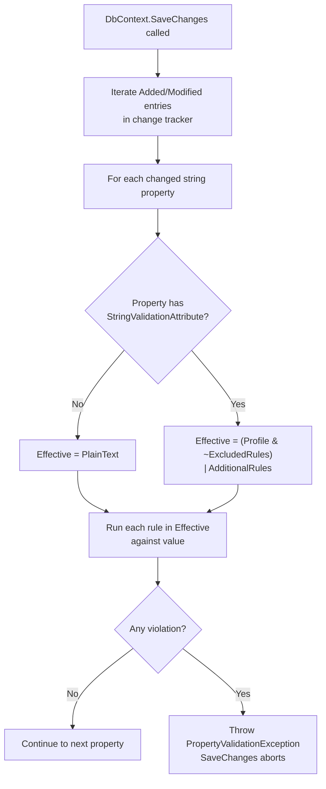

# Server-Side Field Validation

## Summary

This spec proposes an **additional server-side validation layer** that complements Rock's existing protections (output encoding, parameterized queries, framework-level escaping, and current client- and server-side checks). The new layer runs at the data-ingestion boundary and provides a single, consistent place to enforce content policy on inbound values. Validation is driven by named **validation profiles** declared with a `[StringValidation]` attribute on each property. Undecorated properties fall back to the most restrictive reasonable profile (`PlainText`), giving us a secure-by-default posture for new code.

This layer is **purely additive**. It does not replace or weaken any existing defense; it adds another reviewable, consistent gate.

## Motivation

Rock has multiple layers of protection in place today (output encoding, parameterized queries, framework-level escaping, and content checks on both the client and server). Each property in the data model nonetheless has a *purpose*: a `FirstName` is meant to hold a human name, a `Description` is meant to hold authored content, a `BodyHtml` is meant to hold rendered markup. Today that intent is implicit, scattered across blocks, services, and ad-hoc checks. There is no single place a reviewer can look to see what kind of content a property is supposed to accept.

The goal of this spec is to make that intent **explicit and uniform**:

- Every property declares what kind of content it represents (a name, plain text, simple HTML, simple HTML with Lava merge fields, or admin-controlled markup).
- The declaration is a single attribute on the property, readable in five seconds during code review.
- The set of rules behind each profile lives in one place, so improving a profile improves every property that uses it, with no per-property code churn.
- Undecorated properties default to the strictest profile, so the safe path is also the path of least effort.

In short: this is a **defense-in-depth and consistency** initiative. It makes the existing content policy machine-readable, code-reviewable, and extensible. Output encoding remains the primary XSS defense; this layer adds a second checkpoint at the other end of the request and a single attribute surface for reviewers to evaluate.

## Requirements

- The validation layer MUST run inside `DbContext.SaveChanges()` so it catches every persistence path regardless of source (UI, REST API, CSV import, bulk loaders, jobs, plugins, etc.). Rock does not currently expose `SaveChangesAsync()`; if it ever does, the same rules must run inline on that path as well.
- The system MUST support a fixed, named set of **validation profiles** that map to a bitmask of individual rules.
- Properties MUST be decorated with a `[StringValidation]` attribute to opt into a non-default profile.
- A property with no `[StringValidation]` attribute MUST default to the `PlainText` profile.
- Individual properties MUST be able to **exclude** specific rules from their assigned profile (`ExcludedRules`), and **add** rules on top of their assigned profile (`AdditionalRules`).
- The set of available rules MUST include at minimum: Lava output delimiters (`{{`), Lava command delimiters (`{%` and `{[`), `<script` tags, `javascript:` protocol, event-handler attributes, any HTML tags, control characters (which subsume the null byte), and bidi-override characters.
- The validation layer MUST NOT replace output encoding. Encoding obligations remain unchanged.
- The initial scope of decoration MUST be limited to entity properties in `Rock.Model`. ViewModel bags, REST DTOs, and similar transport types are explicitly out of scope for v1.
- The initial scope of **enforcement** MUST correspondingly be limited to entities whose declaring type lives in `Rock.Model`. Plugin entities flowing through the same `RockContext` are skipped in v1; see [Future Steps](#future-steps) for the assembly-level opt-in mechanism that will enable enforcement on plugin assemblies later.
- The `StringValidationProfile` enum and the `StringValidationRule` flags enum MUST live in `Rock.Enums/Security/` (namespace `Rock.Enums.Security`).
- The `StringValidationAttribute` MUST live in `Rock.Common/Security/` (namespace `Rock.Security`, following the `Rock.Common` convention of dropping the `Common` segment).
- Both placements ensure the types are reusable by `Rock.ViewModels` (which already references both `Rock.Enums` and `Rock.Common`) if the decoration scope is widened in a future version.
- `StringValueValidator` (the runtime logic class) lives with the existing data/service layer rather than in `Rock.Common`, since it depends on `RockContext` and the EF change tracker. Final placement is an implementation choice; the spec leaves it to the implementer.

## Proposed Approach

### Integration point: `DbContext.SaveChanges()`

The validation layer is wired into Rock's `DbContext.SaveChanges()` override. Every code path that persists data eventually flows through `SaveChanges()`, regardless of where the data originated:

- Obsidian and WebForms blocks (UI)
- REST API controllers
- CSV imports and bulk-loader utilities
- Background jobs and workflow actions
- Plugins and third-party integrations

Hooking at this single chokepoint means the rule set is enforced uniformly without each entry point needing to opt in, and there is no caller-bypassable layer between the validator and the database.

Mechanics:

1. On `SaveChanges()`, iterate the change tracker's `Added` and `Modified` entries.
2. For each modified string property **on an entity whose declaring type lives in `Rock.Model`** (plugin entities are skipped in v1 — see [Future Steps](#future-steps)), resolve the effective rule bitmask via `StringValueValidator.GetEffectiveRules(property)` (cached per-property via reflection).
3. Call `StringValueValidator.Validate(value, rules, entityType, propertyName)` — see the [StringValueValidator](#stringvaluevalidator) section for the implementation contract.

The reflection cost is paid once per property per process and stored in a static dictionary; per-`SaveChanges` overhead is a dictionary lookup plus the rule-evaluation loop inside `Validate`.

### Profiles, not per-property rule lists

Each property is decorated with a **named validation profile** rather than an explicit list of rules. The profile defines the default set of rules. When a new rule is added to a profile, every property using that profile picks it up automatically, no code churn required.

Profiles are **named contexts**, not ordered tiers. `Name` and `BasicHtml` are siblings; neither is "stricter" than the other. Picking a profile is a statement about what the field represents, not about how locked-down it is.

### Five initial profiles

| Profile | Intent | Notes |
|---|---|---|
| `Unrestricted` | Admin-only, intentionally open. Reserved for fields where you could defend "are you crazy, why would you think that was safe to let the user edit?" (e.g. a transaction identifier returned by a payment gateway). | No rules. Empty rule set; nothing is checked. |
| `BasicHtml` | Simple inline HTML formatting only; no templating | Block `<script`, `javascript:`, event handlers, Lava |
| `LavaAndBasicHtml` | Simple inline HTML formatting plus Lava merge fields and commands. Suitable for content that may be authored by an admin but surfaced to users for edit (e.g. communication templates, workflow form text, group descriptions in user-facing flows). | Same as `BasicHtml` minus the Lava blocks: block `<script`, `javascript:`, event handlers. Lava (both formatting and commands) is allowed. |
| `PlainText` | No markup at all | Block any `<`, Lava, control characters |
| `Name` | Short human-readable labels: person names, group names, schedule names, campus names, business names, etc. | PlainText + bidi overrides. Permissive enough for international names and common business-name punctuation (`ABC Company, Ltd.`, `Smith and Sons' Painting`, `Smith & Wesson Guns`). |

Two additional profiles, `Html` (rich admin-authored content) and `Url` (URL-typed fields), are reserved but **not shipped in v1**. See [Future Steps](#future-steps) for the reasoning and the conditions under which they would be added.

### StringValidationRule flags enum

The atomic units of validation are `[Flags]` enum members; each one is a single "rule" that fires when a particular pattern is detected. Profiles compose them.

```csharp
[Flags]
public enum StringValidationRule
{
    None                    = 0,
    LavaFormatting          = 1 << 0,   // {{ ... }} (output expressions / merge fields)
    LavaCommands            = 1 << 1,   //  (tags) and {[ ... ]} (shortcodes)
    ScriptTags              = 1 << 2,   // <script
    JavascriptProtocol      = 1 << 3,   // javascript:
    EventHandlerAttributes  = 1 << 4,   // onload=, onerror=, etc.
    AnyHtmlTags             = 1 << 5,   // any <tag sequence
    ControlCharacters       = 1 << 6,   // ASCII 0-31 (incl. \0) and DEL; tab/LF/CR allowed
    BidiOverrides           = 1 << 7,   // U+202E etc.
}
```

The Lava flags are split into `LavaFormatting` (output expressions, generally lower-risk because they only render values) and `LavaCommands` (tags and shortcodes, which can invoke entity commands, web requests, file operations, and other side effects). **Every v1 profile that guards on Lava guards on both flags**, so observable profile behavior is identical to what a single combined Lava flag would produce. The split exists primarily so individual properties can use `ExcludedRules` or `AdditionalRules` to relax or tighten one form independently of the other (e.g. a single field that legitimately holds `{{ Person.FirstName }}` can `ExcludedRules = StringValidationRule.LavaFormatting` while `LavaCommands` stays blocked).

Every rule is a blocklist: it fires when its pattern is detected in the value. There are no allowlist rules in v1. Shape-of-data validation (e.g. "this must be a URL-safe slug") is intentionally out of scope for this layer — that's a UI / business-logic concern, not a security concern.

### Rule definitions

Each rule is either a substring search or a compiled regular expression evaluated against the property value. Common conventions for all rules:

- Rules operate on the value **as deserialized** by the framework, with no additional decoding. HTML entities, URL-encoding, and Unicode normalization are explicitly out of scope here. This is consistent with the layer's role as defense-in-depth, not the primary defense; output encoding handles entity-decoded payloads on the way out.
- All regex patterns are compiled once at process start and reused. They do not anchor to start/end of string.
- A `null` or empty value passes every rule. Required/nullability is a separate concern handled by Entity Framework / validation attributes upstream.

| Rule | Implementation | Example values that fail | Notes |
|---|---|---|---|
| `LavaFormatting` | Substring search (case-sensitive): `{{` | `Hello {{ Name }}`, `{{ Person.FirstName }}` | Lava output expressions. Lower-risk than commands because they only render a value, but still considered injection if the property is not meant to be Lava-evaluated. |
| `LavaCommands` | Substring search (case-sensitive): `{%`, `{[` | `...`, `{[ shortcode ]}` | Lava tags and shortcodes. Capable of invoking entity commands, web requests, file operations, and other side effects. |
| `ScriptTags` | Regex (case-insensitive): `<script\b` | `<script>`, `<SCRIPT src="...">`, `<Script type="...">` | Requires no whitespace between `<` and `script`. Per the HTML5 spec, `< script>` (with whitespace) is not parsed as a tag start — the parser emits the `<` as a literal text character and bails. Matching the spec's parse behavior eliminates false positives without losing real coverage. |
| `JavascriptProtocol` | Regex (case-insensitive): `[="'(]\s*javascript\s*:` | `<a href="javascript:alert(1)">`, `href=javascript:foo`, `href = "javascript:foo"`, `url(javascript:...)` | Requires the literal sequence to be preceded (with optional whitespace) by `=`, `"`, `'`, or `(`. This catches the real HTML attribute-injection patterns (quoted, single-quoted, unquoted, whitespace-padded, and the historical CSS `url(...)` form) while letting prose like "We tested javascript: it worked fine" through. Entity-encoded forms (`&#106;avascript:`, `&quot;javascript:`) are intentionally **not** flagged here. A *bare* value that is exactly `javascript:alert(1)` with no surrounding markup is also not flagged; URL-typed fields should use a separate scheme-allowlist validation rather than depending on this rule. |
| `EventHandlerAttributes` | Regex (case-insensitive) built from the HTML spec's enumerated event-handler attribute names, with the common `on` prefix factored out: `\bon(?:abort\|auxclick\|blur\|change\|click\|error\|focus\|input\|load\|mousedown\|mouseover\|submit\|...)\s*=` | `<a onclick="alert(1)">`, ``, ` onmouseover =` | Enumeration is preferred over a generic `on[a-z]+` pattern to avoid false positives on prose ("online =", "onset = ..."). Factoring `on` out of the alternation lets the regex engine use a literal-prefix scan, verifies the `\b` boundary once instead of per branch, and produces a smaller compiled state machine. The exact list lives in one place and is kept in sync with the HTML spec. If profiling shows this rule is still hot, a Trie-style factoring (group by every shared prefix, not just `on`) is the next optimization. |
| `AnyHtmlTags` | Regex: `<[a-zA-Z!/]` | `<a>`, `<br/>`, `<!doctype>`, `<!-- comment`, `</p>` | Anything HTML5 would tokenize as a tag fails. The first character after `<` must be an ASCII letter, `!`, or `/` for a browser to start parsing a tag, so the regex matches exactly that. Allows the math/inequality use case: `2 < 3`, `Class A < B Levels`, `Service Hours < Available` all pass because the `<` is followed by whitespace or a digit, which a browser also does not treat as a tag start. `A<B` (no whitespace, alpha immediately after `<`) is still flagged; use `ExcludedRules` per-property if that case is legitimate. |
| `ControlCharacters` | Regex: `[\x00-\x08\x0B\x0C\x0E-\x1F\x7F]` | Strings containing NUL (`\0`), BEL, ESC, DEL, etc. | Tab (`\x09`), LF (`\x0A`), and CR (`\x0D`) are explicitly allowed so multi-line text fields still work. The null byte (`\x00`) is included in this range; there is no separate `NullBytes` rule. |
| `BidiOverrides` | Regex: `[\u202A-\u202E\u2066-\u2069]` | Strings containing U+202E (Right-to-Left Override), U+2066 (Left-to-Right Isolate), etc. | Covers the legacy LRE/RLE/PDF/LRO/RLO range plus the isolate set added in Unicode 6.3. |

#### Known limitations

These rules are deliberately simple and do not attempt to defeat motivated obfuscation. The following are known gaps that this layer will **not** catch:

- **HTML entity-encoded payloads.** `&lt;script&gt;`, `&#60;script&#62;`, and `&#x3C;script&#x3E;` are not flagged by `ScriptTags` or `AnyHtmlTags` because the `<` character isn't present in the raw string. Output encoding on the rendering side is the defense for this class of attack.
- **URL-encoded payloads.** `%3Cscript%3E` is not flagged. The request pipeline decodes URL-encoded values long before `SaveChanges` runs, so anything that reaches the validator is already decoded; a value that arrives still URL-encoded was intended to be the literal text `%3Cscript%3E`.
- **Unicode normalization.** Fullwidth `＜` (U+FF1C) is a distinct code point from `<` (U+003C) and will not match `AnyHtmlTags`. If a downstream rendering layer performs NFKC normalization that could collapse the two, that gap belongs to the renderer, not here.
- **Whitespace obfuscation in `javascript:` and event handlers.** `\s*` tolerates whitespace at the documented break points (`javascript :`, `onclick =`) but not arbitrary insertion (`j a v a s c r i p t :`). Browsers do not parse the latter as a URL scheme, so this is intentional, not an oversight. `< script>` and `< img>` style attempts are also not flagged, because HTML5 browsers do not parse `<` + whitespace as a tag start — the regexes for `ScriptTags` and `AnyHtmlTags` match the spec's actual parse behavior.
- **Bare `javascript:` values.** `JavascriptProtocol` requires the protocol to be preceded by `=`, `"`, `'`, or `(`, so a value that is literally `javascript:alert(1)` with no surrounding markup is not flagged. This is a deliberate trade-off to keep prose like "We tested javascript: it worked fine" from failing. For URL-typed fields where the value itself is interpreted as a URL, use a scheme-allowlist validation (require `http(s):` / `mailto:` / etc.) rather than depending on this generic check.

If any of these gaps affect a property that needs to be safe at ingestion, the right answer is to layer in an explicit additional rule on that property, not to expand the generic rule definitions.

### StringValidationProfile enum (plugin-stable identity)

Profiles are exposed as an **enum**, not as `public const` bitmask values. This is a deliberate plugin-compatibility decision: a `public const` is inlined into the consuming assembly's IL at compile time, so a plugin compiled against Rock v17's `StringValidationProfile.BasicHtml` bitmask would keep using that exact bitmask until recompiled, even if Rock's `BasicHtml` profile gained or dropped a rule in v18. Naming the profile (rather than its bitmask) at the call site means the plugin's `[StringValidation( StringValidationProfile.BasicHtml )]` will always be resolved against Rock's current definition of `BasicHtml` at runtime.

```csharp
public enum StringValidationProfile
{
    Unrestricted     = 0,
    BasicHtml        = 1,
    PlainText        = 2,
    Name             = 3,
    LavaAndBasicHtml = 4,
}
```

Stability rule: **never renumber or remove enum members once shipped.** Add new profiles at the end with new ordinals. The same rule applies to `StringValidationRule` flag values themselves, since enum members are also compile-time constants and would otherwise suffer the same versioning problem.

### StringValidationAttribute

The attribute is intentionally slim: it carries the profile choice and any per-property overrides, nothing else. All resolution logic and the profile -> rule-set map live on `StringValueValidator` (next section).

```csharp
[AttributeUsage( AttributeTargets.Property )]
public class StringValidationAttribute : Attribute
{
    public StringValidationProfile Profile { get; }

    public StringValidationRule ExcludedRules { get; set; } = StringValidationRule.None;

    public StringValidationRule AdditionalRules { get; set; } = StringValidationRule.None;

    public StringValidationAttribute( StringValidationProfile profile )
    {
        Profile = profile;
    }
}
```

### StringValueValidator

`StringValueValidator` is the prototype for the static class that will house most of the runtime logic: the profile -> rule-set map, the resolution routines that turn a property (or attribute) into an effective rule bitmask, and the actual rule-evaluation entry points called from the `DbContext.SaveChanges()` hook.

The map and resolver are `internal` so the class can be refactored later without breaking plugins — plugins only ever see the public `StringValidationProfile` enum, the public `StringValidationRule` flags, and the public attribute surface.

```csharp
internal static class StringValueValidator
{
    /*
        Profile -> rule-set map. Resolved at runtime (static readonly,
        not const), so a change to the rule set for an existing
        profile is automatically picked up by every property decorated
        with that profile, including properties in plugins compiled
        against older Rock versions.

        Reason: Plugin-compatible profile contract; const-inlining
        would freeze older plugins to stale bitmasks.
    */
    internal static readonly IReadOnlyDictionary<StringValidationProfile, StringValidationRule> ProfileRules =
        new Dictionary<StringValidationProfile, StringValidationRule>
        {
            [StringValidationProfile.Unrestricted] = StringValidationRule.None,

            [StringValidationProfile.BasicHtml] =
                StringValidationRule.LavaFormatting |
                StringValidationRule.LavaCommands |
                StringValidationRule.ScriptTags |
                StringValidationRule.JavascriptProtocol |
                StringValidationRule.EventHandlerAttributes,

            [StringValidationProfile.LavaAndBasicHtml] =
                StringValidationRule.ScriptTags |
                StringValidationRule.JavascriptProtocol |
                StringValidationRule.EventHandlerAttributes,

            [StringValidationProfile.PlainText] =
                StringValidationRule.LavaFormatting |
                StringValidationRule.LavaCommands |
                StringValidationRule.AnyHtmlTags |
                StringValidationRule.ControlCharacters,

            [StringValidationProfile.Name] =
                StringValidationRule.LavaFormatting |
                StringValidationRule.LavaCommands |
                StringValidationRule.AnyHtmlTags |
                StringValidationRule.ControlCharacters |
                StringValidationRule.BidiOverrides,
        };

    /// <summary>
    /// Resolves a property to the effective rule bitmask that should be
    /// enforced when its value is saved. Honors the property's
    /// <see cref="StringValidationAttribute"/> if present, otherwise
    /// falls back to <see cref="StringValidationProfile.PlainText"/>.
    /// </summary>
    public static StringValidationRule GetEffectiveRules( PropertyInfo property )
    {
        var attr = property.GetCustomAttribute<StringValidationAttribute>();

        return attr == null
            ? ProfileRules[StringValidationProfile.PlainText]
            : GetEffectiveRules( attr );
    }

    /// <summary>
    /// Resolves an attribute's declared profile and per-property overrides
    /// to its effective rule bitmask.
    /// </summary>
    public static StringValidationRule GetEffectiveRules( StringValidationAttribute attribute )
    {
        var profileRules = ProfileRules[attribute.Profile];
        return ( profileRules & ~attribute.ExcludedRules ) | attribute.AdditionalRules;
    }

    /// <summary>
    /// Validates a single string value against the supplied rule bitmask.
    /// Throws <see cref="PropertyValidationException"/> on the first rule
    /// that fails; honors the emergency enforcement switch by recording
    /// the exception via <c>ExceptionLogService.LogException()</c>
    /// instead of throwing when enforcement is off.
    /// </summary>
    /// <param name="value">The string value being saved.</param>
    /// <param name="rules">The effective rule bitmask for the property.</param>
    /// <param name="entityType">The CLR type of the entity (used for log/exception context).</param>
    /// <param name="propertyName">The property name (used for log/exception context).</param>
    public static void Validate(
        string value,
        StringValidationRule rules,
        Type entityType,
        string propertyName )
    {
        /*
            Placeholder. Final implementation will:

              1. Short-circuit on null/empty value or rules == None.

              2. For each enabled rule in `rules`, evaluate the
                 substring/regex implementation defined in the
                 "Rule definitions" table.

              3. On the first failing rule:
                   - Build a PropertyValidationException carrying the
                     entity Type, the property name, and a human-readable
                     message identifying which rule fired (e.g.
                     "may not contain Lava formatting"). The exception
                     is intentionally general-purpose: it is the
                     standard Rock property-level validation exception
                     and is not specific to this content-policy layer.
                     The failing rule is conveyed via the message rather
                     than a structured field; the value itself is NOT
                     included, since it may contain sensitive content.
                   - If the emergency enforcement switch is ON
                     (the default), throw the exception. SaveChanges
                     aborts.
                   - If the switch is OFF, pass the exception to
                     ExceptionLogService.LogException() so it lands in
                     the admin Exception List, then return without
                     throwing. The save proceeds.
                   - Only the first failing rule is reported per save;
                     see "Considered but Rejected" for the multi-failure
                     trade-off.

              4. Compiled Regex instances are static readonly fields
                 on this class, JIT-warmed at process start.

            See "Rule definitions" for each rule's pattern; see
            "Emergency enforcement switch" for the toggle behavior.
        */
        throw new NotImplementedException();
    }
}
```

The `DbContext.SaveChanges()` hook iterates the change-tracker entries and calls `StringValueValidator.Validate(...)` once per changed string property, using `StringValueValidator.GetEffectiveRules(property)` to resolve the rule bitmask. Reflection results are cached per property; the per-`SaveChanges` overhead is a dictionary lookup plus the rule-evaluation loop in `Validate`.

### Usage examples

```csharp
// No attribute — defaults to PlainText.
public string FirstName { get; set; }

// Explicit profile.
[StringValidation( StringValidationProfile.Name )]
public string FirstName { get; set; }

// Admin field — allow everything except Lava.
[StringValidation( StringValidationProfile.Unrestricted, AdditionalRules = StringValidationRule.LavaFormatting | StringValidationRule.LavaCommands )]
public string HeaderContent { get; set; }

// Simple inline formatting allowed (e.g. a label or short rich-text field).
[StringValidation( StringValidationProfile.BasicHtml )]
public string Description { get; set; }

// Name profile but suppress the bidi rule for a specific field.
[StringValidation( StringValidationProfile.Name, ExcludedRules = StringValidationRule.BidiOverrides )]
public string PreferredName { get; set; }
```

### Resolution flow



### Emergency enforcement switch

A single on/off setting, exposed in the **Security Settings** admin block, controls whether the validator throws or logs.

- **On (default):** A violation throws a validation exception and `SaveChanges()` aborts. This is the normal operating mode.
- **Off:** Validation still runs, but instead of throwing, each violation is recorded via `ExceptionLogService.LogException()` so it appears in the **Exception List** the admin is already monitoring; the save then proceeds. This is deliberate. `RockLogger` warnings get filtered out, ignored, or never seen; the Exception List is in-your-face by design and matches the "this should not be a comfortable place to live" intent of the switch. Outside of this switch, suppressed/passed rules emit nothing.

Design constraints:

- **Single global toggle.** No per-profile, per-property, or per-flag granularity. Operators flipping this off are turning off enforcement everywhere.
- **Persistent.** The setting is a normal Rock System Setting. There is no time-bounded auto-clear, no version-bound auto-clear, and no "remind me later." If an operator turns enforcement off, it stays off until an operator turns it on again. This is a deliberate trade-off: the auto-clear mechanisms originally considered (see git history of this spec) added implementation surface for a switch that is itself intended to be temporary. A simple persistent toggle ships faster and operates predictably; the safeguard against "set and forget" is that the switch is removed entirely in a future release (see [Future Steps](#future-steps)).
- **Loud while active.** Every violation recorded in the "off" state carries enough context to be triaged after the fact: the entity type, the property name, and a human-readable message identifying which rule fired. The value itself is **not** included in the logged exception, since it may contain sensitive content. Recording the toggle event itself (who flipped it, when) is also expected; details belong to the Security Settings block, not this spec.

The switch is the operator's safety valve for the high-risk window immediately after the v1 release. It is **not** a permanent operational lever; the entire switch (and the log-without-throw path it controls) is scheduled for removal once profile assignments stabilize.

### Rollout strategy

There is no audit/log mode, no feature flag, and no incremental rollout. Because the `PlainText` default would immediately reject legitimate content on any property that today holds HTML, an email body, a Lava template, a description with special characters, etc., enforcement cannot ship until those properties have been reviewed and decorated with the correct profile. The release is "whole hog": enforcement is on from the moment the build lands.

For the initial release, undecorated properties simply resolve to `PlainText`. There is no audit tooling in v1 — the safety net is that decorating every property requiring a non-default profile is part of the release work itself.

Recommended sequence for the initial release:

1. Ship the attribute, the enum, the profile map, and the `SaveChanges()` hook — with the hook commented out or returning early. Nothing is enforced yet; this exists so the next step can land in incremental PRs without breaking the build.
2. Decorate every property in `Rock.Model` that needs a **non-default** profile (`BasicHtml`, `LavaAndBasicHtml`, `Name`, `Unrestricted`). Anything that should be `PlainText` is left undecorated; the default carries it.
3. Where a property *should* be `PlainText` but historically allows characters the rule would reject (e.g. a description field that contains a stray `<`), make a per-case call: tighten the data, switch the profile to `BasicHtml` or `Unrestricted`, or decorate it explicitly with an `ExcludedRules` override and a comment explaining why.
4. Exercise the major persistence paths (block save, REST API, CSV import, jobs) against representative data to surface anything the decoration pass missed.
5. Enable the `SaveChanges()` hook. Ship.

The risk is well-understood: a property that should be non-default but was missed in Step 2 will start rejecting saves the moment the release is installed. The [emergency enforcement switch](#emergency-enforcement-switch) is the operator's safety valve for that case. Steps 2 and 4 are where this risk is bought down.

## Future Steps

Items deliberately scoped out of v1 but planned (or likely) for follow-up releases. These are *commitments and probable directions*, not alternatives that were considered and rejected (those live in [Considered but Rejected](#considered-but-rejected)).

### Roslyn analyzer + automated sweep (planned)

One to two versions after the initial rollout, a Roslyn analyzer will be added that flags any string property in `Rock.Model` without an explicit `[StringValidation(...)]`. The analyzer can run at build time and (optionally) as a CI gate. Once the analyzer ships, an automated sweep will land decorating every previously-undecorated property explicitly as `PlainText`, eliminating the implicit "no attribute means `PlainText`" contract and giving reviewers a single, consistent surface to evaluate.

The analyzer MUST mirror the runtime scope of `StringValueValidator`:

- **Only analyze classes that directly or indirectly inherit `IEntity`.** Non-`IEntity` classes (POCOs, Options classes, result types, etc.) flow through code paths that the `SaveChanges()` hook never evaluates, so an undecorated string property on a non-`IEntity` class is not a missing decoration — it's correctly out of scope. Warning on those would generate noise the developer cannot meaningfully resolve.
- **Warn when `[StringValidation]` is applied to a property on a non-`IEntity` class.** The attribute has no runtime effect outside the `SaveChanges()` enforcement path, so applying it to a transport DTO or helper POCO is almost certainly a misunderstanding of where the validation runs. A diagnostic here catches that mistake at compile time.

After the sweep, the runtime default for undecorated properties stays in place as a safety net for new code paths and plugins, but every property in core is explicit. The analyzer becomes the long-term mechanism for keeping it that way.

### Plugin opt-in for `SaveChanges()` validation (planned)

The v1 `SaveChanges()` hook only enforces validation against entities in `Rock.Model`. Plugin entities that flow through the same `RockContext` are intentionally skipped, because their string properties have not yet been decorated — silently applying the `PlainText` default to plugin assemblies would break legitimate saves the moment v1 ships.

A follow-up release will introduce an **assembly-level C# attribute** (name TBD) that a plugin author applies to their assembly once they have audited every entity string property in it and decorated each with the correct `[StringValidation(...)]`. Applying the attribute is the plugin author's declaration that the assembly is ready for enforcement; the `SaveChanges()` hook then begins running validation against entities declared in that assembly. Until the attribute is present, the assembly's entities remain skipped, preserving backward compatibility for plugins that predate this system. The Roslyn analyzer above can grow a parallel rule that warns plugin authors about undecorated properties in assemblies that have applied the attribute, giving them the same audit affordance core gets.

### `Html` profile (conditional)

An `Html` profile is reserved for a future version but **not shipped in v1**. The intended definition is "rich content with HTML allowed; block Lava, `javascript:`, and event handlers" — the same rule set originally drafted.

The reason it is held back: in practice, most (possibly all) fields in Rock that hold admin-authored rich content are *meant* to contain Lava and often event handlers because the admin is intentionally writing custom functionality (workflow forms, communication templates, page content, etc.). If no real property in `Rock.Model` actually wants the strict `Html` check set, the profile becomes a footgun — pick `Html` thinking "yes, HTML is allowed" and the admin's first Lava merge field gets rejected. Until a concrete consumer surfaces that actually wants strict HTML without Lava/event handlers, `Unrestricted` is the right answer for admin-authored content fields.

The enum ordinal is intentionally not locked down in advance; `Html` will take the next available ordinal when it ships.

### `Url` profile (conditional)

A `Url` profile is reserved for properties that primarily hold a URL value. The intended definition is a scheme allowlist (e.g. `http`, `https`, `mailto`) plus blocking of dangerous URL schemes (`javascript:`, `vbscript:`, `data:`) and the usual control / bidi-override checks.

The reason it is held back: no current `Rock.Model` property is purely a URL field. URLs appear inside `PlainText`-style content (notes, descriptions, etc.) where they're incidental, and the existing `PlainText` and `Name` profiles already accept the characters that make up a URL (`:`, `/`, `?`, `&`, `=`, etc.) without false positives. A dedicated `Url` profile becomes worthwhile only when a property emerges whose stored value will be used *as* a URL at render time (e.g. a "redirect URL" field, a "link" column) — at which point unsafe scheme detection is the right tool, and that detection belongs on this profile rather than being grafted onto the generic blocklists.

The enum ordinal is intentionally not locked down in advance; `Url` will take the next available ordinal when it ships.

### Retiring the emergency enforcement switch (planned)

The [emergency enforcement switch](#emergency-enforcement-switch) shipped in v1 is explicitly intended to be a temporary affordance during the high-risk window immediately after release. Once one or two versions of production data confirm that profile assignments are stable and the analyzer-driven sweep is in place, the switch (including the Security Settings UI control, the underlying setting, and the log-without-throw path inside the validator) is removed entirely. The spec is explicit that this is not a permanent operational lever.

## Considered but Rejected

### Per-property explicit rule lists
Rejected. Decorating each property with `[Block(LavaFormatting | LavaCommands | ScriptTags | ...)]` would make every property's contract self-documenting, but it pushes the burden onto every author and makes adding a new rule a global change. Profiles let us add a rule to one constant and have every property using that profile pick it up.

### Allowlist-based validation
Rejected. Rock is internationally used, and an allowlist that covers every legitimate script (Latin, Cyrillic, CJK, Arabic, etc.) is either too narrow (blocks real users) or so permissive that it stops being a meaningful check. Blocklists are a better fit for free-text fields. A narrow allowlist (e.g. URL-safe slug characters) was considered for a dedicated identifier-style profile, but rejected: this layer is a *security* validator, and shape-of-data validation (a slug must contain only `[A-Za-z0-9_-]`) is a different concern that belongs in the UI / business-logic layer where the user can be told what shape to type. Routing shape failures through `SaveChanges()` produces poor operator-time errors with no actionable surface, and the security argument for slug-shape enforcement at the persistence layer is weak — none of the dangerous characters that the rest of this system blocks are URL-safe to begin with.

### Relying on output encoding alone
Rejected as the sole defense. Output encoding is the right primary defense and is a separate, longer-term effort. But it does not protect against template-injection (Lava executes server-side, before encoding ever applies), data-integrity issues (null bytes, control characters), or fields that are read by non-HTML consumers (CSV exports, JSON APIs, mobile clients). Ingestion-time validation catches classes of issues encoding never can.

### Ordered tiers (Strict < Moderate < Loose)
Rejected. An ordered hierarchy implies that a field needing both `Name` and `BasicHtml` rule sets should pick "the stricter one", which collapses meaningful distinctions. `Name` and `BasicHtml` answer different questions ("is this a short human-readable label?" vs "is this user-authored markup?") and should not be ranked against each other. Named contexts make the choice clearer at the call site.

### Auto-clearing enforcement switch
Rejected. Earlier drafts considered mechanisms that would automatically re-enable enforcement after a Rock version change, a time-bounded expiration (24 hours, etc.), or both, so that operators could not flip the switch off and forget. Rejected in favor of a simple persistent on/off toggle for two reasons. (1) The auto-clear logic adds implementation surface for a switch that is itself scheduled to be removed in a future version, which is poor return on investment. (2) Predictable behavior is more valuable than "automatic safety" for an operator-facing escape hatch — an admin who flipped the switch in an emergency at 11pm should not have to discover hours later that enforcement silently came back on. The "don't leave it off forever" safeguard is the planned removal of the switch entirely, not a runtime mechanism.

### Reusing `System.ComponentModel.DataAnnotations.ValidationException`
Rejected. The .NET-native `ValidationException` would integrate "for free" with existing model-state machinery and `catch (ValidationException)` blocks. Rejected in favor of a new `PropertyValidationException` because (1) any pre-existing `catch (ValidationException)` block in the codebase or in plugins could silently swallow these failures, which defeats the point of running them at the persistence boundary; and (2) a Rock-owned exception type gives REST/block error handlers and the Exception List a clean, Rock-specific type to target without colliding with the broader .NET `ValidationException` surface.

### A content-policy-specific exception type with structured `FailedRule` and `ValueLength` fields
Rejected for v1. An earlier draft of this spec called for `PropertyValidationException` to carry structured `FailedRule` (the `StringValidationRule` flag) and `ValueLength` (the length of the offending string) properties, so log/UI consumers could filter and group violations programmatically. Rejected in favor of keeping `PropertyValidationException` a general-purpose property-validation exception that carries only the entity `Type`, the property name, and a human-readable message. Reasons: (1) `PropertyValidationException` is intended to be reused by future property-level validation work beyond this content-policy layer, and overloading it with content-policy-specific fields would couple it to a single use case; (2) the failing-rule identity is already conveyed through the message (e.g. "may not contain Lava formatting"), which is what an admin reading the Exception List actually needs; (3) `ValueLength` can be derived at the call site if a future consumer wants it. Revisitable if a real consumer surfaces that needs structured filtering.

### Reporting all failing rules per save
Rejected for v1. When a single value would fail multiple rules (e.g. a `PlainText` field that contains both a Lava template and an HTML tag), the validator could collect every failing rule into one exception and surface all violations at once. Rejected in favor of "throw on the first failing rule" for three reasons. (1) Simpler implementation: the first-match short-circuit is the natural shape of a flag-based check loop. (2) Operator experience is acceptable — typical violations are single-cause, and the next save reveals the next failure if there is one. (3) The "collect all" path would need to thread through the kill-switch's log-without-throw path too, where each violation already lands as a separate entry in the Exception List — making the per-call aggregation redundant. Revisitable if real-world data after v1 shows multi-violation cases are common enough to be worth the cost.

## Related

- Existing inline checks in the Rock codebase that this layer complements (the substring matches for `<script`, `{{`, `{%`, `{[`); those checks are not removed by this work.
- OWASP XSS Filter Evasion Cheat Sheet — informs the initial rule set for `ScriptTags`, `JavascriptProtocol`, `EventHandlerAttributes`, `AnyHtmlTags`.
- Future workstream: output encoding standardization across Rock blocks, Lava output, and REST responses (separate spec, not yet drafted).
