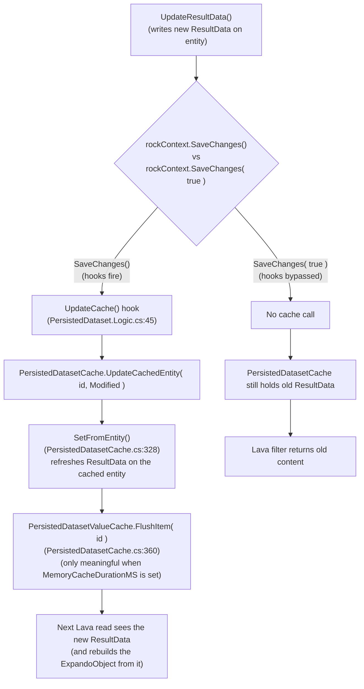

# Persisted Dataset Cache Stale After Workflow / Job Refresh

## Summary

After commit [52f89ac3b6](https://github.com/SparkDevNetwork/Rock/commit/52f89ac3b64d5c8e73880167fb64aa839470d80f), four PersistedDataset refresh code paths call `rockContext.SaveChanges( true )` (which intentionally disables pre/post processing hooks) without then explicitly calling `PersistedDatasetCache.UpdateCachedEntity(...)`. The skipped hook is what normally invalidates the in-memory `PersistedDatasetCache`. As a result, the database `ResultData` is updated correctly, but the cached entity still carries the previous `ResultData` string. Any Lava that reads the dataset (e.g. ``) keeps returning stale content until the entity is touched another way, the app pool recycles, or (when `MemoryCacheDurationMS` is set) the value-cache layer happens to expire.

## Problem Statement

GitHub issue [#6831](https://github.com/SparkDevNetwork/Rock/issues/6831) (reporter: mikedotmundy). Running the "Persisted Dataset Update" workflow action successfully updates the dataset's `LastRefreshDateTime` and `ResultData` in the database. The Preview button on the Persisted Dataset List block shows the new content. However, an HTML block that consumes the dataset via the `| PersistedDataset` Lava filter continues to render the previous content. A manual refresh from the Persisted Dataset List block fixes the symptom because that code path explicitly invalidates the cache.

## Reproduction

Reproduction is documented in detail in the GitHub issue. Condensed:

1. Create a Persisted Dataset (access key `groups`) whose build script enumerates Groups and emits JSON including each group's `Description`.
2. Run the dataset, confirm the Preview shows the current data.
3. Add an HTML block to a page that reads:
   ```liquid
   
   {{ group.Description }}
   ```
4. Confirm the HTML block renders the current description.
5. Edit the underlying Group's description and save.
6. Run a workflow whose only action is "Persisted Dataset Update" with access key `groups`.
7. **Expected:** the HTML block renders the new description.
8. **Actual:** the HTML block renders the old description. The dataset's `LastRefreshDateTime` is updated and Preview shows the new content, so the row itself is correct.
9. Manually refresh the dataset from the Persisted Dataset List block. The HTML block now renders the new description.

Affected versions: v19.0.11, v20.0.2.

## Root Cause

Commit [52f89ac3b6](https://github.com/SparkDevNetwork/Rock/commit/52f89ac3b64d5c8e73880167fb64aa839470d80f) (nairdo, 2026-02-10) switched every PersistedDataset refresh site from `rockContext.SaveChanges()` to `rockContext.SaveChanges( true )`. The `true` overload disables pre/post processing hooks, which was the intended fix to stop `ModifiedDateTime` and `ModifiedByPersonAliasId` from being clobbered during a routine refresh (Asana task "Persisted Datasets Don't Have CreatedBy/ModifiedBy Values"). That intent is correct and should be preserved.

The side effect is that disabling the hooks also skips the entity's `UpdateCache()` method, which is what normally invalidates `PersistedDatasetCache`:



The `| PersistedDataset` Lava filter resolves through `PersistedDatasetCache.GetObjectFromAccessKey(...)` -> `ResultDataObject`. The behavior of `ResultDataObject` ([PersistedDatasetCache.cs:134](Rock/Web/Cache/Entities/PersistedDatasetCache.cs:134)) depends on `MemoryCacheDurationMS`:

- **When `MemoryCacheDurationMS` is null (blank)** — the typical configuration, and the reporter's case — the value-cache branch is skipped (line 169). Every read calls `itemFactory()` and rebuilds the ExpandoObject from `this.ResultData`. `this` is the `PersistedDatasetCache` instance, and its `ResultData` field was populated by `SetFromEntity` when the entity was first cached. Without `UpdateCachedEntity` being called, `SetFromEntity` never runs again, so `ResultData` keeps the old JSON forever (until the app pool recycles or some other code path triggers the cache to repopulate).
- **When `MemoryCacheDurationMS` is set** — there's an additional `PersistedDatasetValueCache` layer (line 163) that caches the deserialized ExpandoObject for the configured duration. Even after `PersistedDatasetCache.ResultData` is refreshed, the ExpandoObject in the value cache must also be flushed for the Lava filter to see new content. `SetFromEntity` calls `PersistedDatasetValueCache.FlushItem( this.Id )` at line 360 to handle this.

In both configurations the root cause is the same: `PersistedDatasetCache.UpdateCachedEntity(...)` is never invoked. The fix re-populates the entity cache (which is sufficient for the blank-MemoryCacheDurationMS case) and also flushes the value cache (which is needed for the configured-MemoryCacheDurationMS case).

Two of the six callers touched by the commit did the right thing and explicitly re-invoked `UpdateCachedEntity` after `SaveChanges( true )`. The other four did not.

## Affected Code Paths

Sites that call `dataset.UpdateResultData()` + `rockContext.SaveChanges( true )` and **are missing** the follow-up `PersistedDatasetCache.UpdateCachedEntity(...)` call:

- [Rock/Workflow/Action/Utility/UpdatePersistedDataset.cs:108](Rock/Workflow/Action/Utility/UpdatePersistedDataset.cs:108) - synchronous "Delay Processing Until Complete" branch of the workflow action.
- [Rock/Tasks/UpdatePersistedDataset.cs:57](Rock/Tasks/UpdatePersistedDataset.cs:57) - async branch (bus message) of the same workflow action, used when "Delay Processing Until Complete" is unchecked.
- [Rock/Jobs/UpdatePersistedDatasets.cs:153](Rock/Jobs/UpdatePersistedDatasets.cs:153) - scheduled job that refreshes all datasets whose `PersistedScheduleIntervalMinutes` has elapsed.
- [Rock/Lava/Filters/LavaFilters.cs:~2465](Rock/Lava/Filters/LavaFilters.cs:2465) - on-demand refresh path inside the `PersistedDataset` Lava filter itself, hit when the dataset has expired and a consumer requests it.

Sites that are already correct (no change needed, included here for reviewer reference):

- [Rock.Blocks/Cms/PersistedDatasetList.cs:234](Rock.Blocks/Cms/PersistedDatasetList.cs:234) - manual "Refresh" action on the list block.
- [Rock.Blocks/Finance/VolunteerGenerosityAnalysis.cs](Rock.Blocks/Finance/VolunteerGenerosityAnalysis.cs) - had the call before the commit and retained it.

Reference (do not change):

- [Rock/Model/CMS/PersistedDataset/PersistedDataset.Logic.cs:45](Rock/Model/CMS/PersistedDataset/PersistedDataset.Logic.cs:45) - the `UpdateCache` hook that is bypassed by `SaveChanges( true )`.
- [Rock/Web/Cache/Entities/PersistedDatasetCache.cs:328](Rock/Web/Cache/Entities/PersistedDatasetCache.cs:328) - `SetFromEntity`, which flushes the value cache at line 360.

## Workarounds

User-side mitigations available without a code change:

- After the workflow runs, manually click the refresh icon on the Persisted Dataset List block. This invokes the list block's already-correct refresh path and invalidates the cache.
- Recycle the application pool. (Not realistic for production but useful for verification.)

Setting `MemoryCacheDurationMS` to a short value does **not** work around the bug. With `MemoryCacheDurationMS` blank (the typical setup, and the reporter's setup), the value-cache layer is already bypassed entirely; the stale data lives in `PersistedDatasetCache.ResultData`, which has no time-based expiration. Setting `MemoryCacheDurationMS` would only add a second cache layer on top; the entity cache underneath would still be stale.

Neither workaround is acceptable long-term; the workflow action is documented to update the dataset, and consumers reasonably expect their next read to reflect the change.

## Proposed Fix

In each of the four affected files, add a single line after `rockContext.SaveChanges( true );`:

```csharp
PersistedDatasetCache.UpdateCachedEntity( dataset.Id, EntityState.Modified );
```

This mirrors the pattern already in place at [Rock.Blocks/Cms/PersistedDatasetList.cs:234](Rock.Blocks/Cms/PersistedDatasetList.cs:234). The required using for `System.Data.Entity.EntityState` is already present in two of the four files; add it where missing.

Sketch of the workflow action change ([Rock/Workflow/Action/Utility/UpdatePersistedDataset.cs:96-109](Rock/Workflow/Action/Utility/UpdatePersistedDataset.cs:96)):

```csharp
dataset.UpdateResultData();

/*
    2/10/2026 - NA
    We are calling the SaveChanges( true ) overload that disables pre/post processing hooks
    because we only want to change the properties changed in UpdateResultData(). If we don't disable
    these hooks, the [ModifiedDateTime] value will also be updated every time a DataView is
    run, which is not what we want here.

    Reason: See Asana task "Persisted Datasets Don't Have CreatedBy/ModifiedBy Values"
    https://app.asana.com/1/20866866924293/task/1213202694111290
*/
rockContext.SaveChanges( true );

// SaveChanges( true ) skipped the UpdateCache hook, so the in-memory caches
// (PersistedDatasetCache and the downstream PersistedDatasetValueCache the Lava
// filter reads from) still hold the previous ResultData. Invalidate them now.
PersistedDatasetCache.UpdateCachedEntity( dataset.Id, EntityState.Modified );

action.AddLogEntry( $"Updated {dataset.Name}" );
```

Apply the same two added lines (the comment plus the call) in the three other files. The bus task ([Rock/Tasks/UpdatePersistedDataset.cs](Rock/Tasks/UpdatePersistedDataset.cs)) uses `persistedDataset.Id`; the job loops over `persistedDatasetToUpdate`; the Lava filter uses `dataset.Id`.

## Fix Risks

- **Cache contention.** `UpdateCachedEntity` reads the entity back from the database to repopulate the cache. The four affected paths run during refresh, which already holds the same row in memory, so this is a single extra `SELECT` per refresh. Negligible.
- **Hook re-entry.** `UpdateCachedEntity` does not re-invoke EF save hooks; it operates on the cache layer directly. There is no risk of re-triggering the `ModifiedDateTime` clobber that the original commit was protecting against.
- **Order of operations.** The call must run *after* `SaveChanges( true )` so the database row is current when the cache reads it back. The proposed placement is correct.
- **Plugins / overrides.** None of the four affected sites are part of the public API surface, so no plugin compatibility risk.
- **Backport.** Reporter is on v19.0.11 / v20.0.2. The bug was introduced in the same commit on both lines, so the fix applies cleanly to both branches.

## Verification Steps

1. Reproduce the bug per the steps above on `develop` *before* the fix. Confirm the HTML block shows stale content after the workflow runs.
2. Apply the fix.
3. Re-run the reproduction. Confirm the HTML block shows the updated content immediately after the workflow completes (both the synchronous "Delay Processing Until Complete" path and the async default path).
4. Repeat with the scheduled job: edit a group's description, wait for (or manually trigger) the `UpdatePersistedDatasets` job, confirm the HTML block updates without a manual refresh.
5. Repeat with the on-demand Lava filter refresh: set a short `PersistedScheduleIntervalMinutes`, let the filter trigger its own refresh, confirm subsequent reads return the new content.
6. Confirm that `ModifiedDateTime` and `ModifiedByPersonAliasId` are *not* clobbered by any of the refresh paths after the fix (this is what the original commit was protecting; we must not regress it).
7. Confirm the manual refresh from `PersistedDatasetList` and the `VolunteerGenerosityAnalysis` block continue to work (they were already correct).
8. Run `Rock.Tests` to confirm no regressions in PersistedDataset-related tests.

## Out of Scope

- Refactoring the `UpdateCache` invalidation pattern so callers don't have to remember it. A more durable design would have `PersistedDataset.UpdateResultData()` (or a dedicated `RefreshAndPersist` helper) do both the save and the cache invalidation in one place. That belongs in a separate spec; this fix is scoped to the regression.
- Re-evaluating whether `SaveChanges( true )` is the right way to preserve audit columns. The targeted fix accepts the existing design.
- Other callers of `SaveChanges( true )` elsewhere in the codebase. This spec covers PersistedDataset only.

## Considered but Rejected

### Revert commit 52f89ac3b6
Rejected. The original commit fixes a real bug ([ModifiedDateTime] / [ModifiedByPersonAliasId] being cleared on every refresh, leaving datasets with no audit trail). Reverting would re-introduce that regression. The two issues are independent and both fixes are needed.

### Re-enable hooks only on the refresh path
Rejected. EF6 does not offer per-call hook selectivity; `SaveChanges( true )` is all-or-nothing. Custom save logic that fires *only* the cache hook would require touching the framework layer for a single feature area, with broad blast radius.

### Move the cache invalidation into `PersistedDataset.UpdateResultData()` itself
Rejected for this fix (kept in Out of Scope). Doing it inside `UpdateResultData()` would couple the model method to the cache layer and is a larger design change. The minimal fix that matches the pattern already used by `PersistedDatasetList` is to call `UpdateCachedEntity` at the same level as `SaveChanges`. A future refactor can centralize the call.

### Flush only `PersistedDatasetValueCache`, leave `PersistedDatasetCache` alone
Rejected. The reporter's setup has `MemoryCacheDurationMS` blank, which bypasses the value-cache layer entirely. In that configuration the stale data lives in `PersistedDatasetCache.ResultData` itself, so flushing the value cache would do nothing. `UpdateCachedEntity` repopulates the entity cache (fixing the blank-MemoryCacheDurationMS case) AND flushes the value cache via `SetFromEntity` (fixing the configured case). One call covers both.

## Related

- GitHub issue: [SparkDevNetwork/Rock#6831](https://github.com/SparkDevNetwork/Rock/issues/6831)
- Root-cause commit: [52f89ac3b6](https://github.com/SparkDevNetwork/Rock/commit/52f89ac3b64d5c8e73880167fb64aa839470d80f) - "(Reporting) Fixed an issue where Modified By and Modified DateTime values were cleared when PersistedDataset records were saved during a dataset refresh"
- Asana task referenced by the commit: "Persisted Datasets Don't Have CreatedBy/ModifiedBy Values" (https://app.asana.com/1/20866866924293/task/1213202694111290)
- Reference implementation of the correct pattern: [Rock.Blocks/Cms/PersistedDatasetList.cs:234](Rock.Blocks/Cms/PersistedDatasetList.cs:234)
