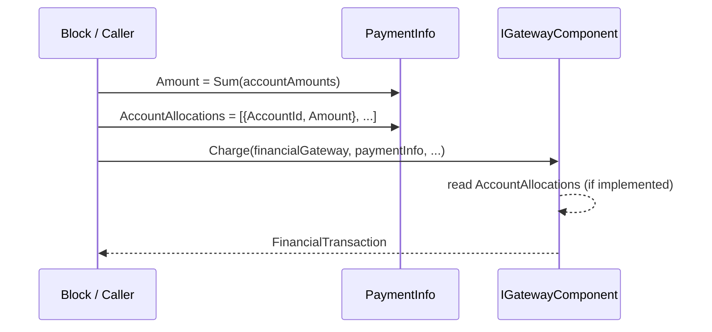

# PaymentInfo Carries Per-Account Detail to Gateways

## Summary

`PaymentInfo` (and its `ReferencePaymentInfo` subclass) currently exposes only a total `Amount` to gateway components. Gateways that need to associate the transaction with specific funds in their own systems have no way to see which Rock `FinancialAccount`(s) the user (or the automated processor) selected. This spec adds an optional `AccountAllocations` list to `PaymentInfo`, populated at every existing site that sets `PaymentInfo.Amount` and has the account information on hand. No gateway interface signatures change.

## Motivation

The work is driven by a gateway-routing requirement raised against `IGatewayComponent.Charge` and `IAutomatedGatewayComponent.AutomatedCharge`: external gateway providers want to record per-fund detail on their side at the time the charge is created, not after the fact. Today the AccountId + Amount split exists inside `AutomatedPaymentArgs.AutomatedPaymentDetails` and in the various block-level structures (`SelectedAccounts`, `caapPromptForAccountAmounts.AccountAmounts`, `commonTransactionAccountDetails`, etc.), but that data is discarded before the gateway is called. The fix is to plumb the existing data through.

This spec is the design followup to the proposal recorded in the conversation that opened this work, which identified roughly 18 call sites across 9 classes plus 5 blocks. The verification pass below confirms 16 call sites that need to populate the new property and 5 sites that are intentionally excluded.

## Requirements

The change MUST:

- Add a new `AccountAllocations` collection to `Rock.Financial.PaymentInfo` that gateways can read inside `Charge`, `AutomatedCharge`, `Authorize`, `AddScheduledPayment`, and `UpdateScheduledPayment`.
- Default `AccountAllocations` to `null`, preserving today's behavior for every existing gateway that does not read the property.
- Leave every gateway interface signature (`IGatewayComponent`, `IAutomatedGatewayComponent`, `IObsidianHostedGatewayComponent`, `IRedirectionGatewayComponent`) unchanged.
- Populate `AccountAllocations` at every call site that already sets `PaymentInfo.Amount` and has the account breakdown available (see Population Sites).
- Document that gateway implementations MUST tolerate a `null` or empty `AccountAllocations` and fall back to today's `Amount`-only behavior in that case.

The change SHOULD:

- Maintain the invariant `Sum(AccountAllocations.Amount) == PaymentInfo.Amount` whenever `AccountAllocations` is populated. Existing block code already maintains this naturally because both fields are derived from the same source.

The change MUST NOT:

- Modify, hoist, deprecate, or otherwise touch `AutomatedPaymentArgs` or its nested `AutomatedPaymentDetailArgs`. Third-party gateway plugins reference these types today and changes here cause real disruption to churches when plugin authors are slow to recompile.
- Apply `[Obsolete]` or `[RockObsolete]` to any existing financial type as part of this work.

The change MAY:

- Add a debug-only assertion that the invariant above holds, in a follow-up. Out of scope for v1.

## Design

### New nested type and property on `PaymentInfo`

Add a new property to [Rock/Financial/PaymentInfo.cs](Rock/Financial/PaymentInfo.cs) typed against the existing `Rock.Model.FinancialTransactionService.AccountAllocation` DTO. No other file or type is modified by this part of the design.

```csharp
namespace Rock.Financial
{
    public class PaymentInfo
    {
        // ... existing members unchanged ...

        /*
            06/03/2026 - NA

            Today every population site derives Amount and AccountAllocations from the
            same per-account source list (SelectedAccounts, AutomatedPaymentDetails,
            commonTransactionAccountDetails, etc.), so the two values cannot drift.
            We intentionally do NOT add a runtime check that
            Sum( AccountAllocations.Amount ) == Amount; the cost on a hot path is not
            justified and a future contributor restructuring a population site is
            the only realistic way to break the invariant. If that ever happens,
            consider a debug-only guard using IHostingSettings.IsDevelopmentEnvironment.

            Reason: Document the Sum(AccountAllocations) == Amount invariant; no runtime check in v1.
        */

        /// <summary>
        /// Per-account breakdown of <see cref="Amount"/>. When populated,
        /// Sum( AccountAllocations.Amount ) equals <see cref="Amount"/>. Gateways MUST
        /// tolerate this being null or empty and fall back to <see cref="Amount"/>
        /// in that case. The contents are an in-flight mirror of the same data that
        /// will be persisted as <see cref="Rock.Model.FinancialTransactionDetail"/>
        /// rows after the gateway returns. Reuses
        /// <see cref="FinancialTransactionService.AccountAllocation"/>, the DTO Rock
        /// already uses to build per-account transaction detail.
        /// </summary>
        public List<FinancialTransactionService.AccountAllocation> AccountAllocations { get; set; }
    }
}
```

Callers reference the element type as `FinancialTransactionService.AccountAllocation` (a `public sealed class` already present in `Rock.Model`, with a `(int accountId, decimal amount)` constructor and immutable `AccountId` / `Amount` get-only properties). Because the property lives on the base `PaymentInfo`, `ReferencePaymentInfo` (used by the Obsidian / hosted / automated paths) inherits it automatically.

The list-of-POCOs shape (rather than a `Dictionary<int, decimal>`) preserves Rock's existing data model: the admin Transaction Detail block ([Rock.Blocks/Finance/TransactionDetail.cs:1205](Rock.Blocks/Finance/TransactionDetail.cs:1205)) produces two `FinancialTransactionDetail` rows for the same `AccountId` when an admin enters two rows for the same fund. A dictionary would silently collapse those duplicates.

### `AutomatedPaymentArgs` is not touched

`AutomatedPaymentArgs` and its nested `AutomatedPaymentDetailArgs` are intentionally left exactly as they are today. `AutomatedPaymentDetailArgs` has the same shape (`AccountId` + `Amount`) as `FinancialTransactionService.AccountAllocation` but is deliberately kept distinct so that no existing financial gateway plugin sees a type change. At the population site in `AutomatedPaymentProcessor.cs` the mapping is a one-line projection:

```csharp
_referencePaymentInfo.AccountAllocations = _automatedPaymentArgs.AutomatedPaymentDetails
    .Select( d => new FinancialTransactionService.AccountAllocation( d.AccountId, d.Amount ) )
    .ToList();
```

The duplication is the cost of the no-disruption commitment, and is small enough to be acceptable.

### Why not change interface signatures

Gateway components are extended by plugin assemblies that may not be recompiled against every Rock minor release. Per `CLAUDE.md`, adding optional parameters to a public method signature is not allowed; a new overload would be required. Carrying the new data on the existing `PaymentInfo` parameter avoids touching any signatures and is therefore additive at the binary level for every gateway plugin in the wild.

### How gateways consume it

A gateway implementation that wants to use the new data adds null-tolerant lookups inside whichever method it cares about:

```csharp
public override FinancialTransaction Charge( FinancialGateway gateway, PaymentInfo paymentInfo, out string errorMessage )
{
    var perAccount = paymentInfo.AccountAllocations ?? new List<FinancialTransactionService.AccountAllocation>();
    // ... use perAccount to construct gateway-specific fund routing
}
```

Gateways that do not opt in see no behavior change.

### Sequence



## Population Sites

Every site below currently sets `paymentInfo.Amount` and has the per-account data in hand. Each site must also set `paymentInfo.AccountAllocations` from the indicated source. Line numbers reflect `develop` at the time of writing and may drift.

### Multi-account capable (List with N entries)

| Site | Source of accounts |
|------|--------------------|
| [Rock/Blocks/Types/Mobile/Finance/Giving.cs:857](Rock/Blocks/Types/Mobile/Finance/Giving.cs:857) | `commonTransactionAccountDetails` (List of `FinancialTransactionDetail`) |
| [Rock/Blocks/Types/Mobile/Finance/Giving.cs:1589](Rock/Blocks/Types/Mobile/Finance/Giving.cs:1589) | `options.AmountSelections` (List of `AccountAmountSelectionBag`). `UpdateScheduledPayment` path. |
| [Rock/Financial/AutomatedPaymentProcessor.cs:600](Rock/Financial/AutomatedPaymentProcessor.cs:600) | `_automatedPaymentArgs.AutomatedPaymentDetails` |
| [RockWeb/Blocks/Finance/UtilityPaymentEntry.ascx.cs:3354](RockWeb/Blocks/Finance/UtilityPaymentEntry.ascx.cs:3354) | `caapPromptForAccountAmounts.AccountAmounts` |
| [RockWeb/Blocks/Finance/TransactionEntryV2.ascx.cs:3096](RockWeb/Blocks/Finance/TransactionEntryV2.ascx.cs:3096) | `commentTransactionAccountDetails` |
| [RockWeb/Blocks/Finance/TransactionEntryLegacy.ascx.cs:2908](RockWeb/Blocks/Finance/TransactionEntryLegacy.ascx.cs:2908) | `SelectedAccounts` |
| [RockWeb/Blocks/Finance/ScheduledTransactionEditV2.ascx.cs:1130](RockWeb/Blocks/Finance/ScheduledTransactionEditV2.ascx.cs:1130) | `selectedAccountAmounts` |
| [RockWeb/Blocks/Finance/ScheduledTransactionEdit.ascx.cs:1420](RockWeb/Blocks/Finance/ScheduledTransactionEdit.ascx.cs:1420) | `SelectedAccounts` |

### Single-account (List with one entry)

| Site | Source of account |
|------|-------------------|
| [Rock.Blocks/Event/RegistrationEntry.cs:4974](Rock.Blocks/Event/RegistrationEntry.cs:4974) | `financialAccount` + `args.AmountToPayNow` |
| [Rock.Blocks/Event/RegistrationEntry.cs:5037](Rock.Blocks/Event/RegistrationEntry.cs:5037) | `financialAccount` + `args.PaymentPlan.AmountPerPayment` |
| [Rock.Blocks/Event/RegistrationEntry.cs:5086](Rock.Blocks/Event/RegistrationEntry.cs:5086) | `financialAccount` + `transaction.TotalAmount` (download path) |
| [Rock.Blocks/Event/RegistrationEntry.cs:5108](Rock.Blocks/Event/RegistrationEntry.cs:5108) | `financialAccount` + `transaction.TotalAmount` (Obsidian hosted download path) |
| [Rock/Workflow/Action/WorkflowControl/PaymentEntry.cs:700](Rock/Workflow/Action/WorkflowControl/PaymentEntry.cs:700) | `paymentData.Account.Id` + `paymentData.Amount` |
| [Rock/Workflow/Action/WorkflowControl/PaymentEntry.cs:738](Rock/Workflow/Action/WorkflowControl/PaymentEntry.cs:738) | `paymentData.Account.Id` + `transaction.TotalAmount` (download path) |
| [RockWeb/Blocks/Event/RegistrationDetail.ascx.cs:2032](RockWeb/Blocks/Event/RegistrationDetail.ascx.cs:2032) | `registration.RegistrationInstance.AccountId` + `amount`. Back-office "additional payment for a registration" path; not in the original proposal. |

## Excluded Sites

The following sites also reference `paymentInfo.Amount` but are intentionally NOT modified.

| Site | Reason |
|------|--------|
| [Rock/Financial/TestGateway.cs:240](Rock/Financial/TestGateway.cs:240) | This is a READ of `paymentInfo.Amount` (`Payment.Amount = paymentInfo.Amount`). The gateway can opt in to read `AccountAllocations` here, but no caller-side change is needed. |
| [Rock.NMI/Gateway.cs:1749](Rock.NMI/Gateway.cs:1749) | Inside a gateway implementation, not a caller. The gateway already has the total in `transaction.TotalAmount`. Consuming `AccountAllocations` here is a separate, opt-in gateway-side enhancement. |
| [Rock/Model/Finance/FinancialPersonSavedAccount/FinancialPersonSavedAccountService.cs:294, :391](Rock/Model/Finance/FinancialPersonSavedAccount/FinancialPersonSavedAccountService.cs:294) | Object initializers with `Amount = 0.0M` used to spin up saved-account records. No transactional intent, no charge happens. |
| [Rock/Model/Finance/FinancialScheduledTransaction/PaymentPlanConfiguration.cs:99](Rock/Model/Finance/FinancialScheduledTransaction/PaymentPlanConfiguration.cs:99) | `PaymentPlanConfiguration` deliberately carries no `AccountId`. Callers using this helper must populate `AccountAllocations` upstream before handing `PaymentInfo` to the gateway. |
| [Rock/Workflow/Action/WorkflowControl/PaymentEntry.cs:806](Rock/Workflow/Action/WorkflowControl/PaymentEntry.cs:806) | This is `transactionDetail.Amount = paymentInfo.Amount`, a downstream read. The upstream write at `:700` is the one that populates `AccountAllocations`. |

## Backward Compatibility

- Gateway interfaces unchanged. Existing third-party gateway plugins (Rock.NMI, Rock.PayFlowPro, private plugins) continue to compile and run with no change.
- `PaymentInfo.AccountAllocations` defaults to `null`. Gateways that do not read it see today's behavior unchanged.
- `AutomatedPaymentArgs` and its nested `AutomatedPaymentDetailArgs` are NOT modified, hoisted, deprecated, or otherwise touched. Plugins that reference either type continue to compile and run with byte-for-byte identical behavior.
- No database schema change. `FinancialTransaction.TransactionDetails` is still the persisted record. `PaymentInfo.AccountAllocations` is the in-flight mirror sent to the gateway.

The work is strictly additive: one new property and one new nested class on `PaymentInfo`. Everything else is callers populating the new property from data they already had on hand.

## Test Plan

- **Unit:** For each populated site listed above, assert that `AccountAllocations.Sum(d => d.Amount) == PaymentInfo.Amount` immediately before the `Charge` / `AutomatedCharge` / `AddScheduledPayment` / `UpdateScheduledPayment` call.
- **Manual, TestGateway:** Run a multi-account `TransactionEntryV2` transaction. Add a temporary log line inside `TestGateway.Charge` to dump `paymentInfo.AccountAllocations`. Confirm N entries arrive, one per selected account, with amounts matching the user's input.
- **Manual, AutomatedPaymentProcessor:** Trigger the automated path with multi-account `AutomatedPaymentArgs`. Confirm `AccountAllocations` arrives at `AutomatedCharge` and the mapped values exactly mirror `_automatedPaymentArgs.AutomatedPaymentDetails`.
- **Manual, RegistrationEntry:** Submit a registration payment. Confirm a single-entry `AccountAllocations` arrives at the gateway with the registration instance's `AccountId`.
- **Plugin compat:** Build and run Rock.NMI and Rock.PayFlowPro against the change. Both should continue to process transactions identically (they ignore the new property in v1).
- **Existing-type stability:** Diff `Rock/Financial/AutomatedPaymentArgs.cs` against `develop` and confirm there are no changes whatsoever. Compile an external snippet that uses `new AutomatedPaymentArgs.AutomatedPaymentDetailArgs { AccountId = 1, Amount = 10M }` and assert it still builds and is assignable into `AutomatedPaymentDetails`.

## Considered but Rejected

### `Dictionary<int, decimal>` keyed by AccountId

Rejected. The acceptance criteria did describe the new property as "a dictionary mapping account IDs to their corresponding amounts," and this rejection was reconsidered carefully. However, the admin-facing Transaction Detail block actually produces two `FinancialTransactionDetail` rows for the same `AccountId` when an admin adds the same account twice with different Amounts / Summary notes ([Rock.Blocks/Finance/TransactionDetail.cs:1205](Rock.Blocks/Finance/TransactionDetail.cs:1205) iterates `detailsBag.Rows` keyed by `row.Guid`, not by AccountId, so duplicates persist as separate rows). A `Dictionary<int, decimal>` would silently collapse those into a single key and lose information. A `List<AccountAllocation>` preserves the same shape that `FinancialTransaction.TransactionDetails` already uses on persistence. It also matches the existing `AutomatedPaymentArgs.AutomatedPaymentDetails`, which is a `List<AutomatedPaymentDetailArgs>` for the same reason. Treat the AC's wording as descriptive of the intent (per-account amounts), not a strict typing requirement.

### Runtime enforcement of `Sum(AccountAllocations.Amount) == Amount`

Rejected for v1. Every population site derives both `Amount` and `AccountAllocations` from the same per-account source list, so they cannot drift today. A runtime check (`Debug.Assert`, a dev-environment-only `InvalidOperationException` guarded by `Rock.Configuration.IHostingSettings.IsDevelopmentEnvironment`, or similar) would add a hot-path cost without addressing a real defect. The invariant is captured in an engineering note above the `AccountAllocations` property so a future contributor changing a population site will see it. If drift is ever observed in the wild, a dev-environment-only guard is the natural follow-up.

### Hoisting `AutomatedPaymentDetailArgs` to a shared top-level type

Rejected. An earlier draft of this spec hoisted the existing nested `AutomatedPaymentArgs.AutomatedPaymentDetailArgs` out to a top-level `Rock.Financial` type and left a thin `[Obsolete]` subclass in its place for backward compatibility. Even with the shim, this would surface compiler warnings (and potentially break reflection-based or strict-build plugin code) in third-party financial gateway plugins. Rock's community gateway plugins are not always recompiled promptly, and churches feel the resulting disruption. The cost of two near-identical POCOs (`FinancialTransactionService.AccountAllocation` and `AutomatedPaymentArgs.AutomatedPaymentDetailArgs`) is small and acceptable; the cost of disturbing live gateway plugins is not.

### A top-level `Rock.Financial.AccountAllocation`

Rejected. Two top-level types with identical shape in `Rock.Financial` invite divergence over time. Rock already has a canonical DTO for this exact concept: `Rock.Model.FinancialTransactionService.AccountAllocation` (`public sealed`, immutable, with a constructor and a docstring that says "Simple allocation DTO for building transaction Account-Amount details independent of UI controls"). We reuse it instead of defining a parallel type.

### Defining our own `PaymentInfo.AccountAllocation` nested class

Rejected. An earlier draft of this spec nested an `AccountAllocation` POCO inside `PaymentInfo`. We rejected it in favor of reusing `FinancialTransactionService.AccountAllocation` because: (1) Rock already has that class with the same shape and an explicit docstring describing this exact use case; (2) two of the population sites (Mobile Giving.cs:1260, TransactionEntryV2.ascx.cs:3303) already construct `FinancialTransactionService.AccountAllocation` for `FinancialTransactionService.PopulateTransactionDetails`; (3) immutability (get-only properties + constructor) is a small correctness win over a mutable POCO. The cross-namespace dependency (`Rock.Financial.PaymentInfo` referencing a `Rock.Model` type) is acceptable because `PaymentInfo` already depends on other Rock.Model types (e.g. `Rock.Model.Location`).

### Adding an overload to `Charge` / `AutomatedCharge` that takes the per-account list as a parameter

Rejected. Per `CLAUDE.md`, signature changes on widely-extended public interfaces are avoided; even an overload would force gateway authors to think about which method to implement. Carrying the data on the existing `PaymentInfo` parameter keeps the interface footprint identical and lets every existing gateway plugin opt in without recompiling.

## Out of Scope

- **Rock.NMI and Rock.PayFlowPro gateway implementations.** These are considered legacy and are NOT modified as part of this work. `Rock.NMI/Gateway.cs` and `Rock.PayFlowPro/Gateway.cs` keep their current behavior; they ignore the new `AccountAllocations` property. Any future opt-in to consume `AccountAllocations` in those gateways would be a separate effort owned outside this spec.
- Granting `RegistrationEntry` multi-account support. The block remains single-account; this spec only makes the existing single account visible to the gateway.
- Changing the persisted shape (`FinancialTransactionDetail`). Unchanged.
- Refund / Credit paths. They do not pass `PaymentInfo` and therefore have no surface area for this change.

## Risks and Callouts

- **Invariant drift.** Future contributors could set `Amount` and `AccountAllocations` from different sources and silently violate the invariant. Mitigation: an engineering note above the `AccountAllocations` property documents the rule and explains why no runtime check is in place. If drift is observed in the wild, a dev-environment-only guard (gated by `IHostingSettings.IsDevelopmentEnvironment`, mirroring the existing pattern at [Rock/Jobs/GivingAutomation.cs:2041](Rock/Jobs/GivingAutomation.cs:2041)) is the natural follow-up.
- **Two near-identical POCOs.** `FinancialTransactionService.AccountAllocation` (now reused by `PaymentInfo.AccountAllocations`) and `AutomatedPaymentArgs.AutomatedPaymentDetailArgs` will continue to exist side-by-side with the same shape (`AccountId` + `Amount`). Future maintainers may be tempted to consolidate them. The Considered but Rejected section documents why we accept the duplication; if a future Rock major version is willing to take a plugin-disturbance hit, consolidation can be revisited then.
- **Memory.** `AccountAllocations` is small (N ints + N decimals, typically N <= 10). No measurable footprint impact.

## Completion Criteria

- [ ] `PaymentInfo.AccountAllocations` is added (typed `List<FinancialTransactionService.AccountAllocation>`) and defaults to `null`. No new types are introduced; the property reuses the existing `Rock.Model.FinancialTransactionService.AccountAllocation`.
- [ ] `Rock/Financial/AutomatedPaymentArgs.cs` is byte-for-byte identical to `develop` (no edits to that file land in this PR).
- [ ] `Rock/Model/Finance/FinancialTransaction/FinancialTransactionService.cs` is byte-for-byte identical to `develop` for the `AccountAllocation` class (no edits to that class land in this PR).
- [ ] Every site in the Population Sites tables sets `AccountAllocations` using the existing `FinancialTransactionService.AccountAllocation` constructor.
- [ ] Test plan executed and recorded in the implementing PR description.
- [ ] Release-note commit message drafted:
      `+ (Finance) Added per-account allocations (AccountAllocations) to PaymentInfo so gateway implementations can route transactions to the correct funds.`

## Related

- Original proposal recorded in the conversation that opened this work (no external link; conversation lives in this repo's session transcripts).
- [Rock/Financial/PaymentInfo.cs](Rock/Financial/PaymentInfo.cs)
- [Rock/Financial/IGatewayComponent.cs](Rock/Financial/IGatewayComponent.cs)
- [Rock/Financial/IAutomatedGatewayComponent.cs](Rock/Financial/IAutomatedGatewayComponent.cs)
- [Rock/Financial/AutomatedPaymentArgs.cs](Rock/Financial/AutomatedPaymentArgs.cs)
- [Rock/Financial/AutomatedPaymentProcessor.cs](Rock/Financial/AutomatedPaymentProcessor.cs)
