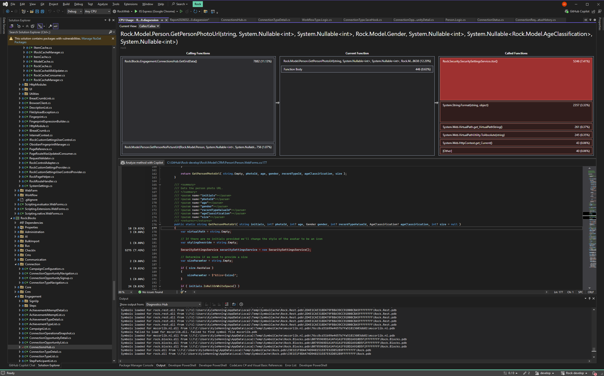

# GetPersonPhotoUrl SecuritySettings Bottleneck

## Summary

`Person.GetPersonPhotoUrl( ... )` builds a `new SecuritySettingsService()` on every invocation solely to read the single boolean `SecuritySettings.DisablePredictableIds`. That constructor does meaningful work each time: it fetches the security-settings JSON, computes an `XxHash` over the full JSON string to derive a cache key, performs cache lookups, and re-resolves role caches. Calling `GetPersonPhotoUrl` in a tight loop (the reported case ran it about 60,000 times) turns this per-call overhead into a measurable bottleneck. The fix is to stop doing per-call JSON hashing and per-call construction work, so that reading `DisablePredictableIds` is effectively free on a warm cache.

## Problem Statement

`GetPersonPhotoUrl` is a hot utility: it is called once per person when rendering avatars, and several list/grid/search code paths call it for every row. Profiling a loop that invoked it roughly 60,000 times showed the dominant cost was not the URL formatting but the `new SecuritySettingsService()` call on `Person.WebForms.cs:144`. The only value consumed from the service is `SecuritySettings.DisablePredictableIds` (a `bool`) at `Person.WebForms.cs:159`.

## Reproduction

Call `GetPersonPhotoUrl` in a loop and profile it:

```csharp
for ( var i = 0; i < 60000; i++ )
{
    Person.GetPersonPhotoUrl( "TD", photoId, 30, Gender.Male, recordTypeValueId, AgeClassification.Adult );
}
```

The profiler attributes the bulk of the time to the `SecuritySettingsService` constructor and its callees (JSON fetch, `XxHash`, cache get, JSON deserialize, role-cache refresh) rather than to the avatar URL assembly itself.



## Root Cause

`GetPersonPhotoUrl` constructs the service unconditionally:

- `Rock/Model/CRM/Person/Person.WebForms.cs:144` — `SecuritySettingsService securitySettingsService = new SecuritySettingsService();`
- `Rock/Model/CRM/Person/Person.WebForms.cs:159` — `var disablePredictableIds = securitySettingsService.SecuritySettings.DisablePredictableIds;`

The constructor at `Rock/Security/SecuritySettingsService.cs:58` runs the following on every instantiation, even on a fully warm cache:

1. `SystemSettings.GetValue( ROCK_SECURITY_SETTINGS )` (`SecuritySettingsService.cs:62`) returns the entire security-settings JSON string. `SystemSettings.GetValue` hits `RockCache` on each call (`Rock/Web/SystemSettings.cs:169`, via `Get()` at `:93`).
2. `securitySettingsJson.XxHash()` (`SecuritySettingsService.cs:63`) hashes the full JSON string to build the cache key. `XxHash` allocates a UTF-8 byte array for the whole string and hashes it on every call (`Rock/Utility/ExtensionMethods/StringRockExtensions.cs:36`).
3. A cache key is interpolated and `RockCache.Get( cacheKey )` is performed (`SecuritySettingsService.cs:66`).
4. On a cache hit, `RefreshSecurityGroups( securitySettings )` (`SecuritySettingsService.cs:101`) iterates `AccountProtectionProfileSecurityGroup` and calls `RoleCache.Get(...)` for each entry, mutating the shared cached object (`SecuritySettingsService.cs:175`).
5. On a cache miss, it additionally deserializes the JSON (`FromJsonOrNull<SecuritySettings>`) and re-adds it to the cache.

The core inefficiency is using `XxHash` of the entire JSON as the cache key. This was presumably chosen so that any edit to the settings produces a new key and auto-invalidates, but it forces a full-string hash and allocation on every single read. Combined with the per-call `RefreshSecurityGroups` work, the constructor is far heavier than the one boolean the caller needs. (Note: `RockCache.Get` returns the live in-memory object reference, so there is no per-call serialization cost; the dominant costs are the JSON fetch, the `XxHash`, and `RefreshSecurityGroups`.)

## Affected Code Paths

Primary (where a fix lands):

- `Rock/Security/SecuritySettingsService.cs:58` — the constructor that runs per-call work; also `Save()` for cache invalidation.
- `Rock/Model/Core/Attribute/Attribute.Logic.cs` — cache hook that removes the security-settings cache key when the underlying attribute is written by any path.
- `Rock/Model/CRM/Person/Person.WebForms.cs:137` — `GetPersonPhotoUrl`, the reported hot caller.

Secondary (other per-row callers that benefit from a cheaper constructor; representative, not exhaustive):

- `Rock.Rest/Controllers/PeopleController.Partial.cs` (`GetPersonSearchDetails` calls `GetPersonPhotoUrl` twice per result).
- `Rock/Utility/FileUrlHelper.cs` — `GetFileIdentifierParameter` also constructs `SecuritySettingsService` for the same `DisablePredictableIds` check, so photo file URLs pay the tax a second time per person. Profiling confirmed it as the #2 caller of the constructor.
- `RockWeb/Blocks/Crm/PersonDirectory.ascx.cs`, `PersonSearch.ascx.cs`, `PersonDetail/GroupMembers.ascx.cs`, `BioSummary.ascx.cs`
- `RockWeb/Blocks/CheckIn/RapidAttendanceEntry.ascx.cs`, `MultiPersonSelect.ascx.cs`
- `Rock.Blocks/Group/GroupPlacement.cs`, `Rock.Blocks/Engagement/StepParticipantList.cs`, and other list blocks

All ~50 sites that call `new SecuritySettingsService()` also benefit, since the constructor is the thing being optimized.

## Workarounds

User-side: none. This is internal rendering behavior with no configuration toggle.

Caller-side (not recommended as the fix, but possible today): a loop that needs many photo URLs could read `DisablePredictableIds` once and pass it down, avoiding repeated construction. This only helps the specific loop that is refactored and does not address the shared root cause, which is why the constructor itself should be optimized.

## Proposed Fix

Optimize `SecuritySettingsService` so that the common "read a setting" path does no per-call hashing and no per-call rebuild.

Recommended approach: cache the fully-built `SecuritySettings` under a **stable** cache key and only do the expensive build (deserialize plus `RefreshSecurityGroups`) on a cache miss. This mirrors the established `SystemSettings` pattern, which caches a single settings instance via `RockCache.GetOrAddExisting( CacheKey, () => Load() )` with a constant key (`Rock/Web/SystemSettings.cs:89,93`).

Specifically:

- Replace the per-call `XxHash`-of-JSON cache key with a constant key (for example `"Rock.Core.SecuritySettings"`).
- Gate only the expensive work behind the cache miss: the JSON fetch, the `XxHash`, and the `FromJsonOrNull` deserialize. Build and cache the parsed `SecuritySettings` once.
- Still call `RefreshSecurityGroups` on every construction, including warm-cache hits. The security-group `RoleCache` references must reflect current membership: a group membership change does not rewrite the settings JSON, so neither the cache key nor `Save()` invalidation picks it up. `RoleCache.Get` is a cheap cache lookup (two entries by default), so refreshing per call is acceptable. Skipping it would serve stale role membership to authorization checks for up to the cache lifetime (see Fix Risks).
- Invalidate that cache entry whenever the settings change, from a single place: the Attribute cache hook. In `Rock/Model/Core/Attribute/Attribute.Logic.cs`, the SystemSetting-qualifier branch calls `RockCache.Remove(SecuritySettingsService.SecuritySettingsCacheKey)` when the written key is `ROCK_SECURITY_SETTINGS`, mirroring the existing `COUNTRIES_RESTRICTED_FROM_ACCESSING` special case. This fires for every write to the setting, including `SecuritySettingsService.Save()` (which writes through the same EF attribute save) and any path that bypasses `Save()` such as the generic Attribute REST API. `Save()` itself does no cache removal; the hook is the single source of truth. Because `RockCache.Remove` publishes a `CacheWasUpdatedMessage`, invalidation propagates farm-wide.

A lighter-touch variant that avoids designing an explicit invalidation path: keep the cache-on-read shape but derive the key from a cheap change token instead of hashing the whole JSON. `SystemSettings.LastUpdated` (`Rock/Web/SystemSettings.cs:156`) already changes whenever any system setting is written, so keying on it auto-invalidates without an `XxHash` per call. This is slightly over-eager (any system-setting change invalidates the entry) but removes the full-string hash, which is the main per-call cost.

Either way, the goal for `GetPersonPhotoUrl` is that reading `DisablePredictableIds` on a warm cache costs a dictionary lookup, not a JSON fetch plus hash plus role-cache refresh.

## Fix Risks

- **Stale settings if invalidation is missed (resolved).** The original content-hash key auto-invalidated on any write to the settings JSON; the stable key only invalidates when something removes it. A security review found that writing the setting through the generic Attribute REST API (or any path that bypasses `Save()`) would otherwise leave the built `SecuritySettings` stale for up to the cache lifetime, which the original avoided. This is closed by the Attribute cache hook described under Proposed Fix: any write to the `ROCK_SECURITY_SETTINGS` attribute now removes the cache key farm-wide, restoring the original "any writer invalidates" contract. The absolute 300-second expiry remains as a backstop.
- **Stale role membership for authorization (resolved).** This is the one integrity-sensitive difference and the reason `RefreshSecurityGroups` is kept on the warm path. `AccountProtectionProfileSecurityGroup` holds `RoleCache` references, and `RoleCache.IsPersonInRole` reads a frozen `People` snapshot (`RoleCache.cs:83,90`). `PersonMerge.ascx.cs:1457-1486` uses it (`requiredSecurityRole.IsPersonInRole(CurrentPerson.Guid)`) to gate `IsAllowedToMerge` for protected people. The original refreshed these references on every construction; if the cache served them without refreshing, a group membership change (which never rewrites the settings JSON, so neither the cache key nor `Save()` invalidation fires) would not take effect for up to the cache lifetime (300s) on that authorization check. The fix keeps the per-call `RefreshSecurityGroups`, so role freshness is identical to the original. Only the JSON fetch/hash/deserialize are gated behind the cache miss.
- **Behavioral parity.** `DisablePredictableIds` and the role caches must return identical values before and after. The change is internal; the public method signatures of `GetPersonPhotoUrl` and `SecuritySettingsService` stay intact (no backward-compatibility break).

## Verification Steps

1. Re-run the 60,000-iteration loop from Reproduction under the profiler and confirm `SecuritySettingsService` construction is no longer a dominant cost (the `XxHash` and per-call JSON fetch should disappear from the hot path).
2. Confirm `GetPersonPhotoUrl` returns byte-identical URLs for both `DisablePredictableIds = true` and `= false` before and after the change (hashed `fileIdKey` form vs. plain `PhotoId` form, `Person.WebForms.cs:161-168`).
3. Edit security settings in the `RockSecuritySettings` admin block, save, and confirm the next `GetPersonPhotoUrl` / `SecuritySettingsService` read reflects the new value (invalidation works).
4. Confirm role-cache resolution in `RefreshSecurityGroups` still produces correct `RoleCache` entries after the build-once change.
5. Smoke-test a person list/grid and check-in person-select screen to confirm avatars still render.

## Verification Results

The shipped fix uses a stable cache key (`"Rock.Core.SecuritySettings"`), gates the JSON fetch, `XxHash`, and deserialize behind a cache miss, keeps `RefreshSecurityGroups` on every read for authorization freshness, and invalidates via `RockCache.Remove` in `Save()`.

Reproduced and measured against a live instance over HTTP rather than the in-process loop. The `/api/People/Search?name=s&includeDetails=true` endpoint calls `GetPersonPhotoUrl` for every result, so an identical burst (250 requests at concurrency 16, roughly 6,000 constructor invocations) was profiled, sampling `iisexpress.exe` with the VS CPU Usage tool after fully warming the app. Numbers are CPU samples for `SecuritySettingsService..ctor()` from the Caller/Callee view.

| Constructor cost | Before (measured) | After, roles refreshed (measured) |
|---|---|---|
| `SecuritySettingsService..ctor()` total | 177 (0.35%) | 98 (0.23%) |
| `XxHash` (line 63) | 51 | eliminated |
| `SystemSettings.GetValue` (line 62) | 44 | eliminated |
| JSON deserialize | (cache-miss only) | eliminated on warm path |
| `RefreshSecurityGroups` | 56 | retained (authorization freshness) |
| `RockCache.Get` | 11 | retained |

The shipped fix measured at **98 samples (0.23%)**, a **~45% reduction** from 177, with `XxHash`, `SystemSettings.GetValue`, and the deserialize eliminated from the warm path and `RefreshSecurityGroups` + `RockCache.Get` deliberately retained. An interim variant that also skipped `RefreshSecurityGroups` measured at **42 (0.08%)** (~76%) but was rejected: it would have served up to 300s-stale security-group membership to the `PersonMerge` authorization check (see Fix Risks). The shipped fix keeps role freshness identical to the original while removing the two big-ticket operations plus the cache-miss deserialize.

Note on interpretation: the absolute percentages are small because over HTTP each request also does database, serialization, and networking work, so the constructor is a thin slice of the whole request. The original report's profile showed it dominating because that was a tight server-side loop with nothing else competing. The relative shape matches, which confirms it is the same bottleneck.

## Out of Scope

- Broader avatar-rendering refactors (changing `GetAvatar.ashx`, caching the assembled URL itself, or batching avatar requests).
- Reworking `RockCache` or `SystemSettings` internals.
- Removing the `#if WEBFORMS` / `VirtualPathUtility.ToAbsolute` behavior in `GetPersonPhotoUrl` (`Person.WebForms.cs:171-178`).
- Any change to the `SecuritySettings` schema or the `DisablePredictableIds` feature itself.

## Considered but Rejected

### Read DisablePredictableIds only inside GetPersonPhotoUrl via a private cached accessor
Rejected as the primary fix. It would speed up the one reported caller but leave the heavy constructor in place for the ~50 other call sites. The bottleneck is the constructor, so fixing it there benefits every caller. The caller-local optimization is noted under Workarounds for completeness.

### Store the parsed SecuritySettings in a static field (process-wide singleton)
Rejected. A mutable static field is not safe in Rock's clustered / web-farm model and has no invalidation story when settings change on another node. Rock convention (and the project guidelines) discourage class-level state on singletons. The `RockCache` path already gives a process-local fast read with a managed lifetime.

### Keep the XxHash key but compute it less often
Rejected. Any scheme that still hashes the full JSON on the read path keeps the dominant per-call cost. Moving to a stable key (with explicit invalidation) or a cheap change token (`LastUpdated`) removes the hash entirely.

## Related

- Asana: [GetPersonPhotoUrl Performance Bottleneck (DEV-11820)](https://app.asana.com/1/20866866924293/project/1208321217019996/task/1213834128004334) — requests staying under the 4-hour mark and taking the low-hanging fruit first; further optimizations may remain.
- `Rock/Model/CRM/Person/Person.WebForms.cs:137` — `GetPersonPhotoUrl`.
- `Rock/Security/SecuritySettingsService.cs:58` — constructor under analysis.
- `Rock/Web/SystemSettings.cs:89` — the stable-key cache pattern to mirror.
