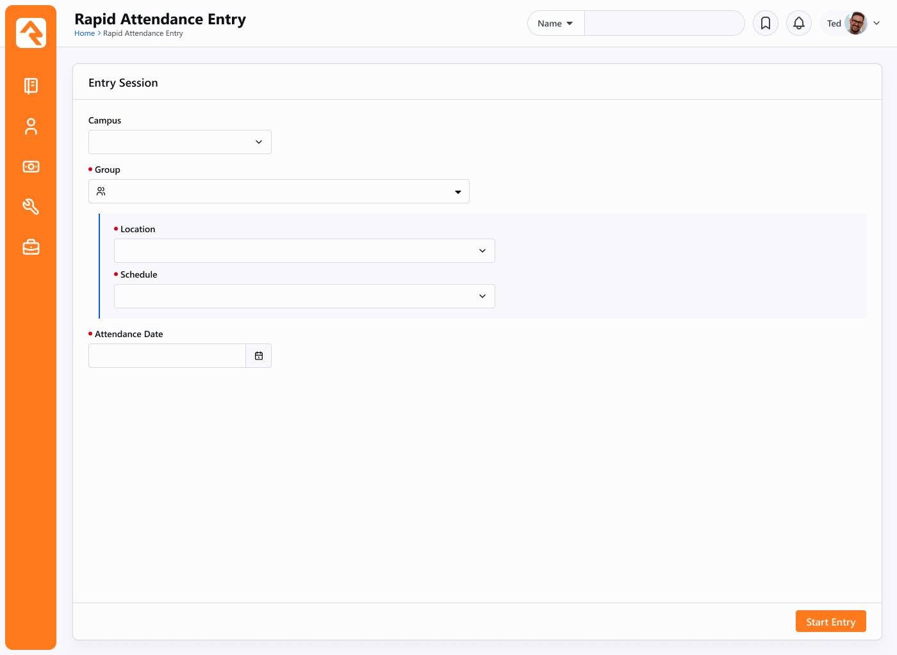
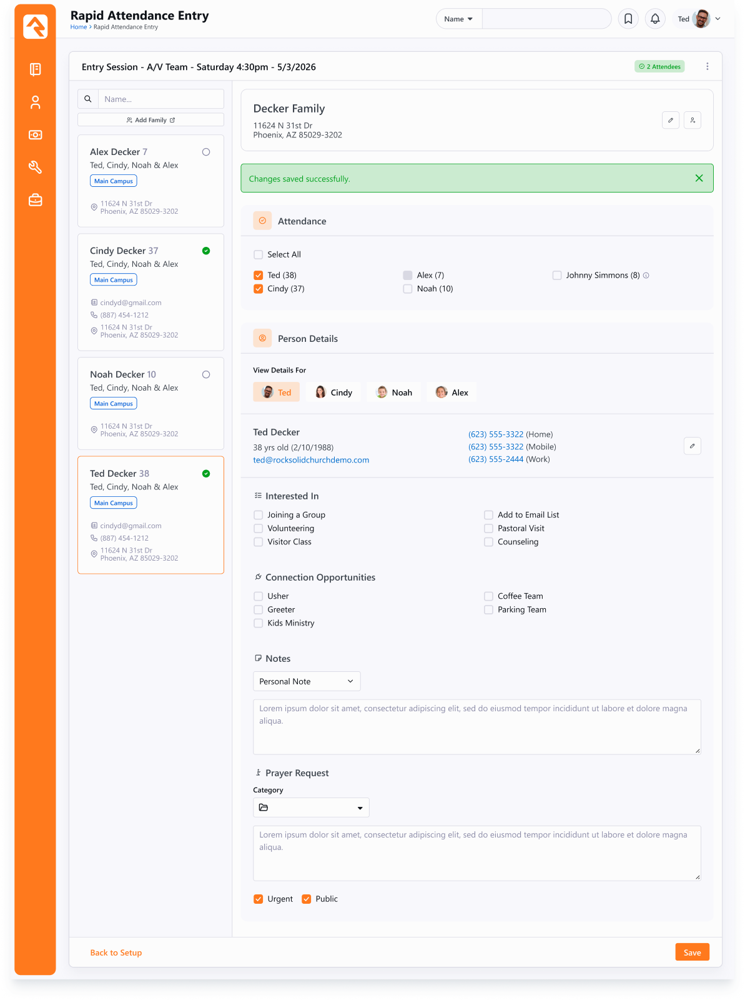
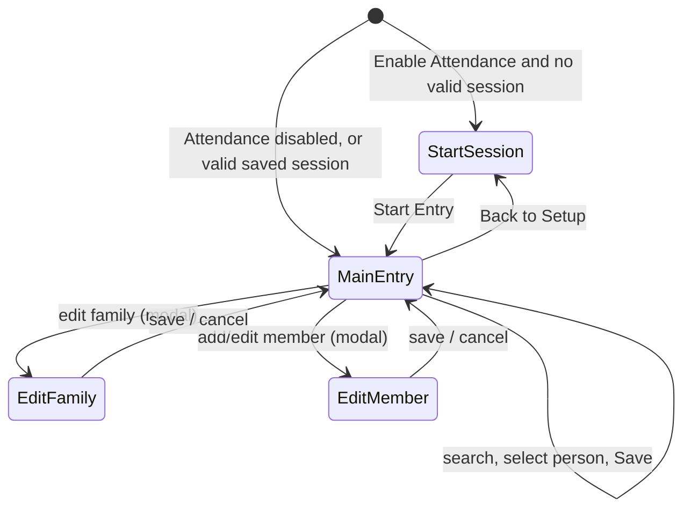

# Rapid Attendance Entry Block Obsidian Conversion

## Summary

Convert the WebForms `RapidAttendanceEntry` block (Check-in domain, ~2,800 lines) to the Obsidian framework (Vue 3 + `RockBlockType`). The conversion keeps every existing behavior and block setting intact, applies the UX updates documented in the approved Figma file (debounced live search, a Select All attendance control, modal-based editing, labeled person pills), and adds one approved net-new capability: a **Connection Opportunities** section that lets the operator start connection requests for the selected individual on save. The block is being chopped, so existing block instances and their configured attribute values must carry forward unchanged.

## Motivation

This block is part of the ongoing Obsidian conversion effort. Two constraints shape the scope:

- **Keep it simple.** Jon's direction on the Asana task was explicit: "we don't want to go too far with changes to this block. Let's keep it pretty simple." The Figma is a refresh of the existing experience, not a rebuild. Joel iterated the design with the team and it is approved.
- **One approved new feature.** During design review the team agreed to add a Connection Opportunities section so staff taking rapid attendance can also kick off connection requests for an individual without leaving the block. This is the only behavior that did not exist in the WebForms block. It is in scope for this conversion (MVP); the only piece deliberately deferred past MVP is live/real-time updating (see Real-time readiness).

Everything else in this spec is parity work plus the documented visual refresh.

The current Start Session and Entry screens from the approved design:

## Status (2026-06-19)

The conversion is feature-complete for MVP: the core block, all three edit modals, the Connection Opportunities feature, session persistence, the unsaved-changes guard, and per-person workflow launching are built and verified. No MVP feature work remains; the chop is the only remaining step (see Backward compatibility and migration).

**Built and working:**

- The C# block, bags, Vue SFC, and partials: Start Session, the search sidebar, and the main entry (attendance with Select All, plus per-person workflows / connections / notes / prayer), with server-rendered Lava headers.
- Session persistence via per-control Person Preferences and the "date is today" bypass.
- The Connection Opportunities feature (checkbox section plus save-time connection requests).
- The Edit Family modal: home address with a "Moved" action that preserves the prior address as a server-formatted Previous Address, mailing/physical flags, and the configured family attributes. It is a narrow modal that reloads the family header on save and disables its fields while saving.
- The Add Person / Edit Person modal: one modal for both add and edit, with the adult/child role driving a conditional well (Marital Status for adults, Grade for children), name / suffix / gender (vertical radio) / birthdate, Race and Ethnicity per their settings, a Contact Information section (email + "Email Is Active", per-type phone rows with single-SMS enforcement, adult communication preference), and the role-appropriate person attributes. Picker-backed fields are `ListItemBag`s so loaded values display; on save it reloads the family roster and refreshes the search-result card. The Add variant shows the family banner.
- The unsaved-changes guard: a navigation guard warns before discarding unsaved per-person input or unsaved attendance toggles on a family switch, Back to Setup, search clear, or page unload. Mirrors Check-in Areas and Groups' `provideNavigationGuard`, and matches the WebForms `hfPersonDirty` / `hfAttendanceDirty` pair.
- Person navigation uses `TabbedBar` (pills with avatars), not the originally-planned `PillList` (see Person navigation pills).
- Search result cards: per-field truncation, a multi-line home address (`FormattedHtmlAddress`), the selected card stays white, and a top-right attended indicator that reflects the session's **saved** attendance and refreshes after Save (deliberately not live with the attendance checkboxes).
- Clearing the search resets the entry panel; "Back to Setup" clears the current selection.
- Mobile (stacked) layout: the search header sticks to the top while the results scroll beneath it, and selecting a person scrolls the entry panel into view.
- Block markup avoids partner/theme utility classes (`d-flex`, spacing helpers, and the like); layout lives in scoped block SCSS (the edit modals use the Bootstrap row/col grid).
- The per-person header is held until the replacement resolves while switching people, so the earlier switch flicker is gone.
- Dead-artifact sweep done: the breakpoint observer partial and its `Breakpoint` / `BreakpointHelper` types were removed as redundant now that layout is CSS-driven.
- Per-person workflows launch on Save with the session's group / schedule / location / date (verified to match the WebForms block); a workflow that does not fully process is logged via the block `Logger` so failures are no longer silent.

**Outstanding:**

- No MVP feature work remains. The chop (retire the WebForms block via the entity-based path, plus the data migration moving the block page to the Full Worksurface layout) is the remaining step, intentionally deferred until sign-off; see Backward compatibility and migration.
- The **Open Questions** are all resolved (recorded in that section): connection request defaults, connection opportunity filtering (security + campus), and the ellipsis-menu contents. Real-time updates are deferred by design (see Considered but Rejected).

## Requirements

### Parity: behavior that MUST be preserved

The block MUST continue to support its full existing workflow:

- **Session setup (start screen).** Operator selects Campus (optional), Group, Location, Schedule, and Attendance Date, then starts a session. Location and Schedule cascade from the selected Group. A schedule list of exactly one is auto-selected and its picker hidden; a location is auto-selected and hidden only when the group has exactly one location overall, since a list narrowed to one by the campus filter still offers a choice. Re-entering the block resumes the operator's last selections without re-running setup when they still validate; the persistence model is updated for Obsidian (see Session persistence).
- **Attendance setting validation.** A resumed session MUST be re-validated (location/schedule still exist and active; group still matches the configured Attendance Group or Parent Group constraint). Invalid sessions fall back to the start screen.
- **Group constraint modes.** `Attendance Group` locks the block to one group (only Schedule/Date are configurable). `Parent Group` constrains the group picker to active children of that group. With neither set, a full group picker is shown.
- **Person search.** Server-side name search via `PersonService.GetByFullNameOrdered`, returning family-grouped results. Each result card shows name, age, family member names, campus label (only when more than one campus exists), email, formatted home address, and mobile number. Inactive people are visually de-emphasized.
- **Attendance entry.** For the selected family, list family members plus "can check-in" relationship guests (gated by `Show Can Check-In Relationships`). Members below `Attendance Age Limit` cannot be marked attended. Saving adds or removes `Attendance` records for the session's group/location/schedule/date and flushes `KioskLocationAttendance` for the location. The header shows a live count, linked to the Attendance List page when configured.
- **Per-person inputs.** For each selected person the operator can enter a prayer request, a note (typed by configurable note types), and check workflows to launch. Inputs are retained per person while navigating between family members before a single Save.
- **Save side effects.** On Save: create the prayer request (category/urgent/public/expiration/comments per settings), create the note, and launch each checked workflow (passing group/schedule/location/date when attendance is enabled).
- **Edit family.** Edit the family home address (with a "Moved" action that preserves the prior address as a Previous Address), mailing/physical flags, and configured family attributes.
- **Add / edit member.** Role (adult/child), first/last name, suffix, birth date (future dates roll back by centuries), gender, race, ethnicity, grade (child only), marital status (adult only), phone numbers (only one number may be SMS-enabled), email and "email active", communication preference (adult only; SMS preference requires an SMS-enabled number), and configured adult/child person attributes. New adults are added to the family's giving group and inherit the head-of-household record status.
- **Lava headers.** Family header and individual summary render from their configurable Lava templates.
- **Page parameter.** `PersonId` continues to pre-select an individual on load. Unlike the WebForms block (which accepted only an integer Id), it now accepts an Id, IdKey, or Guid, resolved with `personService.Get(key, !PageCache.Layout.Site.DisablePredictableIds)`.

### UX refresh (from the approved Figma)

- **Start screen** is a single-column panel. Location and Schedule live in a conditional well that appears once a Group is chosen. Primary action label is "Start Entry".
- **Live search** replaces the "Go" button: query as the operator types, using a **400ms debounce**, server-side filtering, the existing full-name search method (Last Name; Full Name with optional nickname; comma syntax), bounded to the **first 25 matches**. Result cards use refreshed styling.
- **Setup access** moves to a footer "Back to Setup" action. The previous header gear button and attendance-list link are replaced by an **ellipsis menu** in the panel header.
- **Attendance section** gains a **Select All** control that selects every eligible family member and can-check-in guest, skipping anyone below the minimum age. Can-check-in guests render with their full name and a tooltip; under-age members render with a tooltip explaining why they are disabled.
- **Person navigation** is a pill list with a "View Details For" label that wraps to multiple rows with a vertical row gap. Build it from the framework pill controls (Josh Henninger's `PillList` / `Pill`) rather than a bespoke nav; see Person navigation pills under Proposed Approach.
- **Edit Family, Add Person to Family, and Edit Person** now open as **modals** rather than inline panels.
- **Individual Lava** header updates to show the person's full name.

### New: Connection Opportunities

- A **Connection Opportunities** section appears in the main entry area showing the active opportunities of the configured connection type as a checkbox list.
- The section is **hidden** when no connection type is configured (or it has no opportunities).
- On **Save**, a new `ConnectionRequest` is created for each checked opportunity with the selected individual as the **Requestor**.

### Block settings (before / after)

The "New category" column uses the Figma headers. Existing settings keep their current attribute keys so a chop preserves configured values; the two Connections settings are additive. Nothing is removed.

Reading the "Change" column: *New* did not exist in WebForms; *Reworded* is the same setting with a refreshed description; *Relabeled* means the display label changed to the Figma name (the attribute key is unchanged, so it stays chop-safe); *Moved* means the category changed. Two settings (Campus Types, Campus Statuses) were uncategorized in WebForms and move under Attendance. Thirteen settings adopt the Figma display label (the old label is shown in parentheses).

| New category (Figma) | Setting | Old category | Old description | New description | Change |
|---|---|---|---|---|---|
| General | Add Family Page | General | Page used for adding new families. | The page used to add new families. | Reworded |
| General | Attendance List Page | General | Page used to show the attendance list. | The page where attendance records are displayed. | Reworded |
| Attendance | Enable Attendance | Attendance | If enabled, allows the individual to select a group, schedule, and attendance date at the start of the session and take attendance for family members. | Enables the attendance setup screen at the start of each session. Attendance can then be taken for family members. | Reworded |
| Attendance | Parent Group | Attendance | If set, constrains the group picker to only list groups that are under this group. | Limits the group picker to children of this group. | Reworded |
| Attendance | Attendance Group | Attendance | If selected will lock the block to the selected group. The individual would then only be able to select Schedule and Date when configuring. | Locks the block to a specific group. Only schedule and date are configurable at session start. | Reworded |
| Attendance | Show Can Check-In Relationships | Attendance | If enabled, people who have a "Can check-in" relationship will be shown. | Includes people linked via a "Can check-in" known relationship in the attendance list. | Reworded |
| Attendance | Minimum Attendance Age | Attendance | Individuals under this age will not be allowed to be marked as attended. | Family members below this age cannot be marked as attended. | Reworded, relabeled (was Attendance Age Limit) |
| Attendance | Show Campus Filter | Attendance | Determines whether the campus picker should be shown. This allows the group locations to be filtered for a specific campus. | When visible, the campus picker filters available group locations by campus. | Reworded, relabeled (was Show Campus) |
| Attendance | Campus Types | General (uncategorized) | This setting filters the list of campuses by type that are displayed in the campus drop-down. | Limits the campus picker to campuses of the selected type(s). | Moved + reworded |
| Attendance | Campus Statuses | General (uncategorized) | This setting filters the list of campuses by statuses that are displayed in the campus drop-down. | Limits the campus picker to campuses with the selected status(es). | Moved + reworded |
| Family | Family Attributes | Family | The family attributes to display when editing a family. | Attributes shown on the Edit Family panel. | Reworded |
| Family | Family Header Template | Family | Lava for the family header at the top of the page. | Lava template rendered as the family header above the contact entry area. | Reworded, relabeled (was Header Lava Template) |
| Individual | Individual Header Template | Individual | Lava template for the contents of the personal detail when viewing. | Lava template for the personal summary displayed when viewing an individual. | Reworded, relabeled (was Header Lava Template) |
| Individual | Adult Phone Types | Individual | The types of phone numbers to display / edit. | Phone number types shown and editable when editing an adult. | Reworded |
| Individual | Adult Person Attributes | Individual | The attributes to display when editing a person that is an adult. | Person attributes shown on the edit panel for adults. | Reworded |
| Individual | Adult Communication Preference | Individual | Shows the communication preference and allow it to be edited. | Shows the communication preference field (Email or SMS) when editing an adult. | Reworded, relabeled (was Show Communication Preference (Adults)) |
| Individual | Child Phone Types | Individual | The types of phone numbers to display / edit. | Phone number types shown and editable when editing a child. | Reworded |
| Individual | Child Person Attributes | Individual | The attributes to display when editing a person that is a child. | Person attributes shown on the edit panel for children. | Reworded |
| Individual | Allow Child Email Edit | Individual | If enabled, a child's email address will be visible/editable. | Makes the email field visible and editable when editing a child. | Reworded, relabeled (was Child Allow Email Edit) |
| Individual | Race | Individual | Allow race to be optionally selected. | Controls whether the race field appears on the edit panel and whether a value is required. | Reworded |
| Individual | Ethnicity | Individual | Allow Ethnicity to be optionally selected. | Controls whether the ethnicity field appears on the edit panel and whether a value is required. | Reworded |
| Workflow | Workflow List Title | Workflow | The text to show above the workflow list. (For example: I'm Interested in.) | The label displayed above the workflow checkbox list. | Reworded |
| Workflow | Workflow Types | Workflow | A list of workflows to display as a checkbox that can be selected and fired on behalf of the selected person on save. | Workflows shown as checkboxes. Selected workflows are launched for the person when the form is saved. | Reworded |
| **Connections** | **Connection Opportunities List Title** | n/a (new) | n/a | The label displayed above the Connection Opportunities checkbox list. Default: "Connection Opportunities". | New |
| **Connections** | **Connection Type** | n/a (new) | n/a | Connection opportunities from the configured type are shown as checkboxes. If no type is configured, the section is hidden. | New (single-select `ConnectionTypeField`) |
| Notes | Note Types | Notes | The type of notes available to select on the form. | Note types available in the Note section. When only one type is configured, the type dropdown is hidden. | Reworded |
| Prayer | Enable Prayer Requests | Prayer | If enabled, will show a section for entering a prayer request for the person. | Shows the prayer request section on each person's entry panel. | Reworded, relabeled (was Enable Prayer Request Entry) |
| Prayer | Urgent Flag | Prayer | If enabled, the request can be flagged as urgent by checking a checkbox. | Shows the Urgent checkbox on the prayer request form, allowing a request to be flagged as urgent. | Reworded, relabeled (was Enabled Urgent Flag) |
| Prayer | Public Flag | Prayer | If enabled, a checkbox will be shown displayed on the public website. | Shows the Public checkbox, allowing a request to be flagged for display on the public website. | Reworded, relabeled (was Show Public Flag) |
| Prayer | Expiration (Days) | Prayer | Number of days until the request will expire. | The number of days before a prayer request expires. | Reworded, relabeled (was Expires After (days)) |
| Prayer | Default Category | Prayer | The default category to use for all the new prayer requests. | The category applied to new prayer requests. | Reworded |
| Prayer | Default to Public | Prayer | If enabled, all prayers will be set to public by default. | Sets new prayer requests as public by default. | Reworded, relabeled (was Display To Public) |
| Prayer | Allow Comments by Default | Prayer | Controls whether or not prayer requests are flagged to allow comments during prayer session. | Whether new prayer requests allow comments during a prayer session. | Reworded, relabeled (was Default Allow Comments) |
| Prayer | Enable Category Selection | Prayer | If enabled, it will allow the individual to choose/change the selected category for the prayer request. If not enabled, the category selection will not be shown and the default category will be used instead. | Shows the category picker on the prayer request form. When hidden, the default category is applied automatically. | Reworded |

Keys are preserved verbatim on the chop; `Enable Category Selection` keeps its existing key `CategorySelection`. Existing field types are unchanged; the new **Connection Type** uses the single-select `ConnectionTypeField` and **Connection Opportunities List Title** is a text field. Thirteen settings adopt the Figma display label; keys are unchanged.

## Proposed Approach

### Classification

This is a **custom, stateful, multi-panel block**, not a standard Detail or List block. The Vue component owns session and per-person input state on the client and calls block actions for data and persistence; there is no ViewState equivalent.

### File layout

| File | Path |
|---|---|
| C# block | `Rock.Blocks/CheckIn/RapidAttendanceEntry.cs` |
| Bags | `Rock.ViewModels/Blocks/CheckIn/RapidAttendanceEntry/*.cs` |
| Vue SFC | `Rock.JavaScript.Obsidian.Blocks/src/CheckIn/rapidAttendanceEntry.obs` |
| Partials | `Rock.JavaScript.Obsidian.Blocks/src/CheckIn/RapidAttendanceEntry/*.partial.obs` |

Suggested partials: `startSession`, `searchSidebar`, `mainEntry`, `editFamilyModal`, `editPersonModal`. The attendance, person-detail, workflow, connections, notes, and prayer areas can be sub-partials of `mainEntry` if it grows large.

### Block class structure

Organize the C# block the way recent conversions do (for example [ExceptionList.cs](Rock.Blocks/Core/ExceptionList.cs) and [ContentChannelItemList.cs](Rock.Blocks/Cms/ContentChannelItemList.cs)), which also matches [.claude/rules/block-architecture.md](.claude/rules/block-architecture.md):

- Wrap all `[…Field]` declarations in a top-level `#region Block Attributes`, with a nested `#region` per category (General, Attendance, Family, Individual, Workflow, Connections, Notes, Prayer) in settings-screen order.
- Add a nested `private static class AttributeKey` listing every key as a string constant, grouped with comments matching the categories. Reuse the WebForms keys verbatim (including `CategorySelection`); add `ConnectionType` and `ConnectionOpportunitiesListTitle`.
- Add a nested `private static class AttributeCategory` holding the category display names as constants (`Attendance = "Attendance"`, `Connections = "Connections"`, and so on; the General group is `""`). Every attribute sets `Category = AttributeCategory.Xxx`.
- This is where the two campus settings get `Category = AttributeCategory.Attendance`, moving them out of the uncategorized General group (see the before/after settings table).
- Define `PageParameterKey` (with `PersonId`) and `PersonPreferenceKey` classes in the same style.

### Screen flow

### Layout architecture

The Entry screen reuses the full-height, dual-scroll, split-screen pattern proven in the Check-in Areas and Groups block ([checkInAreasAndGroups.obs](Rock.JavaScript.Obsidian.Blocks/src/CheckIn/Configuration/checkInAreasAndGroups.obs); styles in [_blocks-checkin.scss](Rock.Frontend.Styles/src/styles/styles-v2/blocks/_blocks-checkin.scss)). Apply the same approach across the search sidebar (left) and the main entry (right):

- **Fill the viewport via the Full Worksurface layout.** Check-in Areas and Groups sizes its container from JS (mount + resize + `ResizeObserver`) because a context slicer sits above its panel; this block has nothing above the panel, so it leans on the Full Worksurface page layout instead, which bounds `.panel.panel-block` to the viewport in pure CSS. No JS height management or observers, and no min-height fallback: on any other layout the panel takes its natural height and the page scrolls (the existing block page is moved to the Full Worksurface layout by a data migration at chop time; see Backward compatibility and migration). The `Panel` control's `worksurfaceMode` provides the inner plumbing: the body becomes a flex column where `panel-scrollable-content` scrolls while the header and `footerActions` stay static.
- **Two independent scroll regions.** A flex row (`flex: 1; min-height: 0`) holds two flex-column panes, each `min-width: 0; min-height: 0` with its own `overflow-y: auto` body, so the family-result list and the main entry scroll separately.
- **Affixed footer buttons.** Each pane is header (`flex: none`) / body (`flex: 1; overflow-y: auto`) / footer (`flex: none`), so "Back to Setup" and "Save" stay pinned to the bottom of the viewport while the body scrolls.
- **Width split is not 50/50.** Check-in Areas used `flex: 1` on both panes for an even split. Here the search sidebar is the narrower pane (roughly the WebForms `col-md-3` / `col-md-9` proportion): give the sidebar an explicit basis (for example `flex: 0 0 22rem` or a fixed percentage) and let the main pane take the rest, keeping `min-width: 0` on both.
- **Small screens.** The panel stays viewport-bound at every width, matching the Communication Entry Wizard's worksurface behavior; the entry panes stack to one column via a CSS media query inside the bounded panel body. No breakpoint-driven height release and no JS.

This applies to the Entry screen only. The Start Session screen is a single full-width panel, and the three edit flows are Rock modals.

### Person navigation pills

For the "View Details For" person selector, the block uses the framework [`TabbedBar`](Rock.JavaScript.Obsidian/Framework/Controls/tabbedBar.obs) in `type="pills"` mode, not `PillList`/`Pill`, because the Figma puts an avatar beside each name and wraps the pills inline. Two backward-compatible enhancements were made to `TabbedBar` for this: an optional `#tab` scoped slot so a consumer can render custom tab content (here an avatar plus the nick name), and an `allowPillWrapping` prop that wraps pill tabs onto multiple lines instead of collapsing the overflow into a "More" dropdown. Both are exercised in the control gallery. (This supersedes the earlier `PillList`/`Pill` plan.)

### Block actions (server)

Replace each WebForms postback with a `BlockActionResult` action. At minimum:

- `SearchPeople(term)` returns up to 25 family search results (the work in `GetSearchResults`).
- `StartSession(bag)` validates group/location/schedule/date and persists the session.
- `GetLocations(groupKey, campusId)` and `GetSchedules(groupKey, locationId)` for the cascading start-screen pickers.
- `GetFamily(personKey)` / `GetPerson(personKey)` to load detail, attendance roster, and prayer/note/workflow/connection options.
- `Save(bag)` applies attendance, prayer, note, workflows, and connection requests in one call.
- `SaveFamily(bag)` and `SaveMember(bag)` for the two edit modals, including the address "Moved" and SMS-preference validation rules.

### Caching and data access

The WebForms block resolves most lookups with `*Service.Get(...)` or `.Queryable()` on a fresh `RockContext`. Lean on the cache wherever a cached type exists, for the preference resolution above and throughout:

- **Caches to use:** `CampusCache`, `GroupCache`, `NamedLocationCache`, `NamedScheduleCache`, `ConnectionTypeCache`, plus the ones the block already uses (`DefinedValueCache`, `DefinedTypeCache`, `GroupTypeCache`, `WorkflowTypeCache`, `NoteTypeCache`, `CategoryCache`, `AttributeCache`).
- **Adult vs child role:** replace the `GroupTypeRoleService.Queryable()` lookups with `GroupTypeCache.Get(<family group type>).Roles` (the WebForms block already reads `familyGroupType.Roles` in `OnInit`).
- **Resolve Guid to cache, compare by Id:** when a Guid feeds a query, resolve it through the cache and use the `Id` in `.Where()` (avoid `Guid` in LINQ where an `Id` is available, per the data-model rule).
- **Query, do not cache, where no cache fits:** the family being edited (you are about to mutate it, so load it on a `RockContext`), person search results, attendance occurrences, and Connection Opportunities (there is no opportunity cache; query active opportunities for the configured connection type, cached via `ConnectionTypeCache`, by `ConnectionTypeId`).

### Session persistence

The WebForms block stores the session in a single block-scoped `HttpCookie` named `rock_rapidattendanceentry-{BlockId}`, expiring 480 minutes after each Start ([RapidAttendanceEntry.ascx.cs:1583](RockWeb/Blocks/CheckIn/RapidAttendanceEntry.ascx.cs:1583)). `HttpCookie` is `System.Web`, so it cannot carry over to an Obsidian block.

Replace it with **one block-scoped Person Preference per control**, storing **Guids, never integer Ids**: Campus and Group as their picker's `ListItemBag` JSON (the entity Guid is the bag's value; keeping the JSON lets the pickers rehydrate with display text), Location and Schedule as entity Guids, and Attendance Date as an ISO date string. Resolve each through the cache: `CampusCache`, `GroupCache`, `NamedLocationCache`, and `NamedScheduleCache` (all `ModelCache<>`, so `.Get(guid)` works). The location is a named location resolved by Guid via `NamedLocationCache`; derive its `GroupLocation` (needed for the schedule list and group-membership validation) from the selected group's `GroupLocations`. Follow the established preference pattern: keys in a `PersonPreferenceKey` class, read independently on the server, not shipped on the initialization box.

On load, when Enable Attendance is on:

1. Prefill the setup screen from the saved preferences, including the remembered date. A remembered campus the picker would no longer offer (deleted, inactive, or excluded by the campus type/status filters) is cleared on the server during initialization instead of restored, since the campus picker keeps the current selection in its list even when it fails the filters.
2. **Auto-bypass setup straight into the entry panel only when** Group, Location, and Schedule still validate (the existing `IsAttendanceSettingValid` checks, now Guid-based: the location and schedule still exist, the schedule is active, the location belongs to the group, and the group still satisfies the Attendance Group / Parent Group constraint) **and the remembered Attendance Date is today**.
3. Otherwise show the setup screen with the saved values prefilled, so the operator consciously confirms or changes the date before entering.

Two intentional behavior changes from the cookie:

- **Per-person, not per-browser.** Preferences are scoped to the current person; the cookie was keyed by BlockId alone, so any user on that browser resumed the last session.
- **No fixed expiry.** Selections persist until changed. The old 8-hour expiry existed only to keep a stale date from being reused silently; the "date is today" bypass gate handles that directly, so a past remembered date now forces a visible trip through setup instead of silently recording attendance against the wrong day.

### Connection Opportunities implementation

- Initialization/`GetPerson` returns the active opportunities for the configured connection type as a checkbox list, plus the configured list title. Resolve the type via `ConnectionTypeCache.Get(guid)`; opportunities are not cached, so query active opportunities by `ConnectionTypeId`. If no type is configured (or it has no opportunities), the section is omitted.
- On `Save`, for each checked opportunity create a `ConnectionRequest` with `PersonAlias` = the selected person's primary alias. Connection status, connector assignment, campus, and any comment are not specified by the design and are called out in Open Questions.

### Real-time readiness (provisioned, not MVP)

Live updates (another user marks someone attended while this block is open) are not an MVP requirement, but the architecture should make grafting them in trivial later. Rock already provides the seam, and the Group Attendance block is the working precedent: it uses the existing [`EntityUpdatedTopic`](Rock/RealTime/Topics/EntityUpdatedTopic.cs) / `IEntityUpdated` topic, and `AttendanceService` already broadcasts `AttendanceUpdated` messages on a per-group channel (`Attendance:Group:{guid}`) after save via `SendAttendanceRealTimeNotificationsTransaction`. The client side ([groupAttendanceDetail.obs](Rock.JavaScript.Obsidian.Blocks/src/Group/groupAttendanceDetail.obs)) calls `getTopic(...)` and registers `.on("attendanceUpdated", ...)`; the server side ([GroupAttendanceDetail.cs](Rock.Blocks/Group/GroupAttendanceDetail.cs)) exposes a `SubscribeToRealTime` block action that joins `EntityUpdatedTopic.GetAttendanceChannelForGroup`.

To keep wiring it in a small change rather than a refactor, make these decisions up front:

- **Save attendance through `AttendanceService`** add/update/delete (as the WebForms block already does), so the existing post-save broadcast fires with no new server code.
- **Single-sourced apply path on the client.** Route both user toggles and any future real-time message through one `applyAttendanceChange(personGuid, didAttend)` function that mutates the reactive roster; never re-save in response to a real-time message.
- **Key the roster by person (alias) Guid** so an incoming `AttendanceUpdated` message can locate the right row.
- **Reserve a `SubscribeToRealTime(connectionId)` block action** (or keep the action surface ready for it) that joins the group's attendance channel via `RealTimeHelper.GetTopicContext<IEntityUpdated>()`.

With those in place, turning on live updates is just adding the subscribe call on load and registering an `attendanceUpdated` handler that calls `applyAttendanceChange`.

### Backward compatibility and migration

- **Keep the WebForms block alive during development.** The legacy block (`RapidAttendanceEntry.ascx`, BlockTypeGuid `6C2ED1FA-218B-4ACC-B661-A2618F310CD4`) stays registered so the two can run side by side for comparison. Do not chop yet.
- **Give the Obsidian block a temporary new `BlockTypeGuid`** so both coexist. Follow the comment convention from recent conversions (for example [CheckInAreasAndGroups.cs:58](Rock.Blocks/CheckIn/Configuration/CheckInAreasAndGroups.cs)): the active `[Rock.SystemGuid.BlockTypeGuid("…")]` sits below a commented `// was [Rock.SystemGuid.BlockTypeGuid("…")]` line that records the swap. The temporary GUID is the one that gets commented out when the chop lands.
- **Chop later, not now.** When the conversion is finished, use the entity-based chop path (`AddOrUpdateEntityBlockType` plus the chop mapping); never path-based `UpdateBlockTypeByGuid` against entity block types (see [.claude/rules/data-model.md](.claude/rules/data-model.md)).
- **The final commit message is pre-written.** Commits on this branch already carry the final message ("Added the Obsidian RapidAttendanceEntry block and chopped Web Forms."). It intentionally describes the finished state, including the chop, so a mismatch between the message and the code is expected and is not a concern. The message is not an indicator that the block is complete.
- **Preserve every existing attribute key** verbatim so configured values survive the chop. The two Connections settings are additive.
- **Move the block page to the Full Worksurface layout.** The full-height experience comes from the layout, not the block, so the chop includes a small data migration that switches the existing Rapid Attendance Entry page to the Full Worksurface layout. On any other layout the block degrades to a natural-height panel with page scroll.

### Additional implementation notes

A few more decisions to lock in before coding:

- **Client-facing identifiers are Guids, not Ids.** Bag fields that reference entities are typed `Guid` / `Guid?` (not `string` or `int`), and any URLs the block builds prefer IdKey or Guid over raw integer Ids. (The `PersonId` page parameter is the exception that accepts all three forms; see Requirements.)
- **Authorization in block actions.** The WebForms block relied on page and block security. Every editing action (save member, save family, save attendance, create connection requests) must verify the operator is authorized rather than trusting the client.
- **Unsaved-changes guard.** Per-person input (prayer, note, workflows, connections) is held client-side until Save and survives switching people within the loaded family, but it is dropped when a different family loads, on Back to Setup, when the search is cleared, and when navigating away from the block. Track a dirty state and warn the operator before that input is lost; the WebForms block warned before discarding unsaved person input, and the Check-in Areas and Groups block's `provideNavigationGuard` is the in-framework pattern to mirror.
- **Use `RockDateTime`.** The "date is today" bypass comparison and all date handling use `RockDateTime` (for example `RockDateTime.Today`), never `DateTime`.
- **Render Lava server-side.** The family and individual header templates resolve on the server; return rendered HTML in the bag rather than shipping templates and merge fields to the client.

## Open Questions

- **Connection request defaults.** Resolved (net-new; the WebForms block had no connection feature, so there is no legacy precedent). New requests use: the connection type's initial status (the first active status when the type enforces sequential status via `IsSequentialStatusEnforced`, otherwise its default status), `ConnectionState.Active`, campus from the session group/location falling back to the person's, the opportunity's default connector for that campus, and no comment. Duplicates are not de-duplicated (a second Save creates another request); accepted as reasonable for now.
- **Connection opportunity filtering.** Resolved: the opportunity list is built per family in `GetFamily` and filtered to active opportunities of the configured type that the operator may view or edit (checked on both the type and each opportunity, mirroring Connection Opportunity Navigation), and to those available for the session's campus (falling back to the family's) where an opportunity with no campus restriction always qualifies. The section hides when the operator cannot view the type.
- **Ellipsis menu contents.** Resolved: the panel-header ellipsis menu holds only the attendance-list link (shown when an Attendance List Page is configured); the footer "Back to Setup" stays separate.

## Final Audit To-Dos

All final-audit items are complete:

- **Workflows launching on Save.** Verified: the firing path matches the WebForms block (`Workflow.Activate`, the same four attendance attributes, `DateSelected` / `Group` / `Schedule` / `Location`, set with identical values when attendance is enabled, then `Process` against the person). The previously-discarded `Process` errors are now logged via the block `Logger`: a warning naming the workflow, person, and errors when a workflow does not fully process, and an error with the exception when `Process` throws. A workflow that fails its requirements is therefore no longer silent; the silent failures seen earlier are inherent to those workflows' requirements (the same in WebForms), not a conversion regression.
- **Breakpoint observer / dead-artifact sweep.** The breakpoint observer partial and its `Breakpoint` / `BreakpointHelper` types were removed as redundant (layout is fully CSS-driven). The navigation-guard helpers in `utils.partial.ts` were kept; they back the unsaved-changes guard. The block settings whose only consumer is the Add/Edit Person flow are now live via that modal.
- **Family-member switch flicker.** Resolved: `loadPersonHeader` holds the prior header until the replacement resolves, so the header no longer blanks and re-lays-out on every switch.

## Considered but Rejected

### Keep the HTTP cookie for session persistence
Rejected. The cookie relies on `System.Web`, which Obsidian blocks must not reference. It was also keyed by BlockId alone (per browser, not per person) and bounded date staleness only through an 8-hour expiry. Per-control person preferences replace it with per-person persistence and an explicit "date is today" bypass gate, which is cleaner and safer (see Session persistence).

### Keep inline edit panels instead of modals
Rejected. The approved design moves Edit Family, Add Person, and Edit Person into modals; inline panels would diverge from the agreed UX.

### Treat "Connection Opportunities" as mock data / a relabeled workflow list
Rejected. The team confirmed it is a real, separate feature with its own block settings (Connection Type, list title) and its own save behavior (creating connection requests), distinct from the existing workflow list.

### Wire up live/real-time attendance updates for MVP
Rejected for MVP (deferred), but the block was deliberately crafted to support it later, so turning it on is a small change rather than a refactor: attendance saves through `AttendanceService` (which already broadcasts on save), the roster is keyed by person (alias) guid, user toggles and any future real-time message route through a single `applyAttendanceChange` apply path, and the unsaved-attendance baseline is derived from saved state so a real-time handler can advance it and stay clean. Enabling it is adding the subscribe call on load and an `attendanceUpdated` handler. See Real-time readiness for the full seam.

## Related

- Asana: [CheckIn: RapidAttendanceEntry.ascx](https://app.asana.com/1/20866866924293/project/1208321217019996/task/1208355554688583) (DEV-13063). Source of the "keep it simple" constraint and the Connections decision.
- Figma: [Obsidian Block Refreshes, node 3875-1906](https://www.figma.com/design/N60VRdhtRtjO9EA9nba9fB/Obsidian-Block-Refreshes---Fall-2025---Spring-2026?node-id=3875-1906). Treated as canonical for layout and UX. Last reviewed 2026-06-09. The in-file annotations are the designer's working notes (Joel noted they can be ignored); behavior and block-setting parity in this spec are taken from the WebForms source as ground truth, reconciled against the design's documentation panel.
- Design snapshots captured 2026-06-09: [start-session.png](artifacts/260609-rapid-attendance-entry-obsidian-conversion/start-session.png), [entry.png](artifacts/260609-rapid-attendance-entry-obsidian-conversion/entry.png), [design-notes.png](artifacts/260609-rapid-attendance-entry-obsidian-conversion/design-notes.png), [board-overview.png](artifacts/260609-rapid-attendance-entry-obsidian-conversion/board-overview.png).
- WebForms source: [RapidAttendanceEntry.ascx](RockWeb/Blocks/CheckIn/RapidAttendanceEntry.ascx), [RapidAttendanceEntry.ascx.cs](RockWeb/Blocks/CheckIn/RapidAttendanceEntry.ascx.cs).
