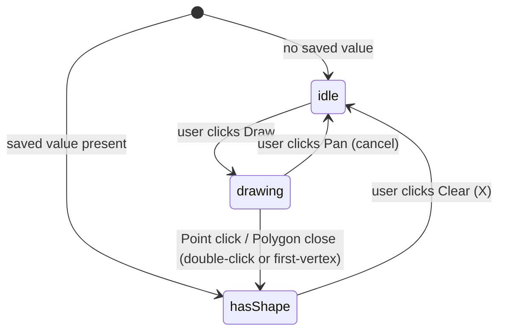
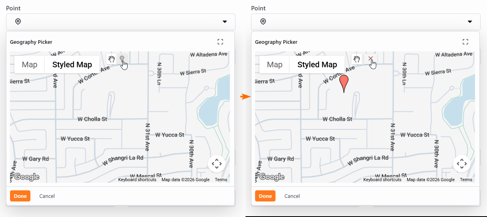
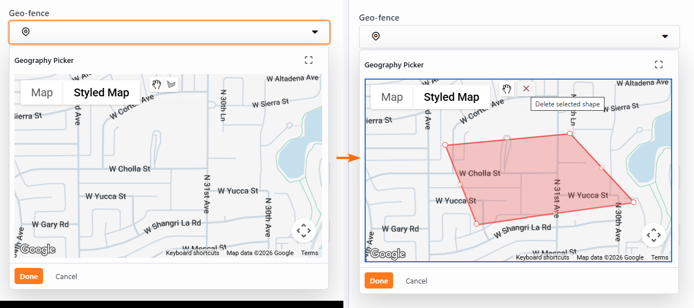

# GeoPicker Drawing Library Replacement

## Summary

Google removed the Drawing Library from the Maps JavaScript API at version 3.65 (May 2026), which broke every Rock GeoPicker that relies on `google.maps.drawing.DrawingManager`. A hotfix pinned the loader URL to `v=3.64` in two places, but that pin is temporary: Google retires old versions on a rolling schedule. This spec proposes replacing the dependency with a small in-house drawing controller built on the still-supported overlay types (`google.maps.Polygon`, `google.maps.marker.AdvancedMarkerElement`), implemented once in the Obsidian map host and once in the WebForms script. While we are in the file, we also rebuild the on-map toolbar so the three controls (pan, draw, clear) sit at fixed positions and use Rock chrome rather than the mismatched Google + custom mix that exists today.

## Motivation

Two things are pushing this work:

1. **The pin will rot.** Google's versioning docs indicate that `v=3.64` is the last release that still ships the Drawing Library. Google typically maintains around four quarterly versions before retiring older ones. Once 3.64 ages out, every GeoPicker in Rock starts throwing `Uncaught Error: The DrawingManager functionality in the Maps JavaScript API is no longer available...` again, exactly as it did before [hotfix 0b7eaa11](https://github.com/SparkDevNetwork/Rock/commit/0b7eaa11e82dc1fa07e0d60abb779834e419c3d8). We need a durable replacement before that happens.
2. **The current on-map UI is visually inconsistent.** Today's toolbar is a mix of Google's DrawingManager bar (polygon or marker icon, plus a hand icon) and Rock's custom red "X" delete button. The icons are sized inconsistently with each other and with Google's own "Map / Styled Map" map-type toggles. The current state is illustrated in the artifacts referenced under [Related](#related).

A secondary motivation: clicking "Done" while a polygon is partially drawn currently throws a server-side validation exception. The new controller will discard incomplete in-progress paths instead.

## Problem Statement

`google.maps.drawing.DrawingManager` and `google.maps.drawing.OverlayType` were removed from the Maps JavaScript API at v3.65. The Rock GeoPicker (WebForms and Obsidian variants) calls both. Without the pinned `v=3.64` workaround the picker fails to initialize and the user sees no map, just a console error.

## Reproduction

1. Remove the `v=3.64` parameter from the Maps loader (revert hotfix 0b7eaa11) or wait for Google to retire 3.64.
2. Open a person's profile, click the gear icon on a family address, then click the Point or Geo-fence picker inside the location editor.
3. Observe the console: `Uncaught Error: The DrawingManager functionality in the Maps JavaScript API is no longer available in the Maps JavaScript API as of version 3.65.`
4. The map fails to initialize and the picker is unusable.

## Root Cause

Two call sites instantiate `new google.maps.drawing.DrawingManager(...)`:

- [Rock.JavaScript.Obsidian/Framework/Controls/geoPickerMap.obs:204](Rock.JavaScript.Obsidian/Framework/Controls/geoPickerMap.obs:204)
- [RockWeb/Scripts/Rock/Controls/geoPicker.js:691](RockWeb/Scripts/Rock/Controls/geoPicker.js:691)

Both files also reference `google.maps.drawing.OverlayType.POLYGON` and `google.maps.drawing.OverlayType.MARKER` to configure the drawing tools and to identify the drawn shape after `overlaycomplete` fires.

The Maps loader URL is constructed in:

- [Rock.JavaScript.Obsidian/Framework/Utility/geo.ts:155](Rock.JavaScript.Obsidian/Framework/Utility/geo.ts:155)
- [Rock/Web/UI/RockPage.cs:2217](Rock/Web/UI/RockPage.cs:2217)

Both URLs currently include `v=3.64&libraries=drawing,visualization,geometry,marker`. Once the picker no longer depends on the Drawing Library, both the version pin and the `drawing` entry can be removed.

## Affected Code Paths

Primary (drawing controller rewrite):

- [Rock.JavaScript.Obsidian/Framework/Controls/geoPickerMap.obs](Rock.JavaScript.Obsidian/Framework/Controls/geoPickerMap.obs) (Obsidian map host).
- [RockWeb/Scripts/Rock/Controls/geoPicker.js](RockWeb/Scripts/Rock/Controls/geoPicker.js) (WebForms picker).

Secondary (loader URL cleanup):

- [Rock.JavaScript.Obsidian/Framework/Utility/geo.ts](Rock.JavaScript.Obsidian/Framework/Utility/geo.ts).
- [Rock/Web/UI/RockPage.cs](Rock/Web/UI/RockPage.cs) (`LoadGoogleMapsApi`).

The C# [GeoPicker.cs](Rock/Web/UI/Controls/Pickers/GeoPicker.cs) server control needs no functional changes. It only renders the hidden field, the picker chrome, and the server-side WKT validators (`IsGeoFenceValid`, `ConvertPolyToWellKnownText`, `ConvertPointToWellKnownText`), none of which touch the Drawing Library.

## Workarounds

The shipped workaround is the version pin from [hotfix 0b7eaa11](https://github.com/SparkDevNetwork/Rock/commit/0b7eaa11e82dc1fa07e0d60abb779834e419c3d8): append `v=3.64&` to the loader URL in both `geo.ts` and `RockPage.cs`. This is the state of the code on `hotfix-19.2` today and the state of `develop`. It works until Google retires 3.64. There is no user-side workaround.

## Requirements

The replacement controller MUST:

- Remove every reference to `google.maps.drawing.*` (DrawingManager, OverlayType) from both `geoPickerMap.obs` and `geoPicker.js`.
- Support both `DrawingMode.Point` and `DrawingMode.Polygon` with feature parity to today: draw, edit polygon vertices (drag, insert, right-click to delete), clear, and round-trip the saved value as Well Known Text in the same format the server already parses.
- Continue to use `google.maps.marker.AdvancedMarkerElement` when the active Map Style has a `core_GoogleMapId` configured, and fall back to `google.maps.Marker` when it does not. Both branches exist today and must remain.
- Discard incomplete in-progress polygon paths if the user clicks Done before a valid shape is finished, treating it as "no shape drawn". No server-side exception.

The loader URLs MUST:

- Drop the `v=3.64&` pin so the Maps API loader uses Google's default (currently the `weekly` channel).
- Drop `drawing` from the `libraries` parameter. Keep `visualization`, `geometry`, and `marker`.

The on-map toolbar MUST:

- Render exactly three icon-only buttons (pan, draw, clear) at fixed positions inside `map.controls[google.maps.ControlPosition.TOP_LEFT]`. The three buttons are always visible, so toolbar geometry never shifts. Active and inactive state is signaled by icon color (active uses the normal icon color, inactive uses a muted gray, roughly `#aaa`) and the `disabled` attribute.
- Sit visually alongside Google's "Map / Styled Map" map-type toggles without sizing or alignment mismatches.

The on-map toolbar SHOULD:

- Use Rock's `btn btn-default btn-xs` chrome with `ti` icons so the new controls match the rest of the picker. Acceptable icon choices: `ti ti-hand-stop` (pan), `ti ti-map-pin` or `ti ti-polygon` (draw, mode-dependent), `ti ti-x` (clear).

## Proposed Approach

Replace the single `new google.maps.drawing.DrawingManager(...)` call (and every reference to `google.maps.drawing.*`) with an in-house drawing controller. The controller is implemented twice, once in `geoPickerMap.obs` and once in `geoPicker.js`. The two files already deliberately duplicate logic for the same state machine and the same wire format. The CLAUDE.md prime directive (follow established patterns) argues against introducing a shared cross-build module for this change.

### State machine

### Toolbar

Three icon-only buttons live inside `map.controls[google.maps.ControlPosition.TOP_LEFT]`. Their state mapping:

| Button | idle | drawing | hasShape | Action when active |
|---|---|---|---|---|
| Pan (`ti ti-hand-stop`) | inactive | active | inactive | Cancels in-progress vertices, returns to idle |
| Draw (`ti ti-map-pin` or `ti ti-polygon`) | active | inactive | inactive | Enters drawing mode |
| Clear (`ti ti-x`) | inactive | inactive | active | Removes the shape, returns to idle |

Buttons share a CSS class that matches Google's map-type toggle chrome (white background, `box-shadow: 0 1px 4px -1px rgba(0,0,0,.3)`, roughly 28 to 30 pixels tall). Inactive buttons mute the icon color to roughly `#aaa` and carry the `disabled` attribute so they are not clickable.

### Drawing behavior

**Point mode.** From `idle`, clicking Draw sets `draggableCursor: 'crosshair'` and binds a one-shot `map.click` listener. The first click creates an `AdvancedMarkerElement` (with `mapId` configured) or `Marker` (fallback) at the click location, transitions to `hasShape`, and restores the cursor.

**Polygon mode.** From `idle`, clicking Draw sets the crosshair cursor and binds a repeating `map.click` listener that appends each `LatLng` to a working `google.maps.Polyline`. The first vertex is also rendered as a small marker so the user can click it to snap-close the polygon. The polygon completes when either:

- The user double-clicks the map, OR
- The user clicks the first-vertex marker.

Completion requires at least three vertices, otherwise the double-click and the first-vertex click are ignored. On completion the controller constructs an editable `google.maps.Polygon` from the collected vertices, removes the working polyline and first-vertex marker, and transitions to `hasShape`.

Once in `hasShape`, the existing listeners attach to the shape (`set_at`, `insert_at`, `rightclick` to remove a vertex, `click` to reselect). These listeners do not depend on `DrawingManager`.

### Done while mid-draw

If the user clicks the picker's Done button while a polyline-in-progress exists (fewer than three vertices, or never closed), the controller silently discards the in-progress vertices and treats the picker as if no shape was drawn. No exception, no partial WKT sent to the server. Point mode auto-completes on first click, so this only affects Polygon mode. The current crash happens because the partial path is serialized to invalid WKT, so short-circuiting the serialization on incomplete draws is sufficient.

### Pre-loaded value

When a saved value is present on initial load (most common case in production), the controller starts directly in `hasShape`. The Polygon or Marker is rendered from the WKT, the Pan and Draw buttons are inactive, the Clear button is active. Clicking Clear returns the controller to `idle`.

### Loader URL changes

In [geo.ts:155](Rock.JavaScript.Obsidian/Framework/Utility/geo.ts:155) and [RockPage.cs:2217](Rock/Web/UI/RockPage.cs:2217):

- Remove `v=3.64&`. The loader falls back to Google's default channel.
- Remove `drawing` from the `libraries` list so only `visualization,geometry,marker` remain.

Keep `marker` (required for `AdvancedMarkerElement`). Keep `geometry` (referenced by other Rock map blocks).

### Reused utilities

The WKT conversion and clockwise-orientation helpers already exist and remain unchanged:

- [Rock.JavaScript.Obsidian/Framework/Utility/geo.ts](Rock.JavaScript.Obsidian/Framework/Utility/geo.ts): `wellKnownToCoordinates`, `coordinatesToWellKnown`, `isClockwisePolygon`, `toCoordinate`, `createLatLng`.
- [Rock/Web/UI/Controls/Pickers/GeoPicker.cs](Rock/Web/UI/Controls/Pickers/GeoPicker.cs): `ConvertPolyToWellKnownText`, `ConvertPointToWellKnownText`, `IsClockwisePolygon`.

The wire format between the WebForms JS and the C# server control stays `lat,long|lat,long|...`. The Obsidian wire format stays WKT.

### Target branches

The fix lands on `develop` (v20) first. It also needs to be backported to `hotfix-19.2`, because the `v=3.64` pin that hotfix 0b7eaa11 introduced lives on both branches and will rot on both at the same time. The v19.2 file layout matches v20 (same paths, same line ranges within a few lines), so the change should cherry-pick cleanly. Confirm parity at backport time by re-running the verification matrix on the v19.2 checkout.

## Fix Risks

- **Visual regression.** Replacing Google's drawing toolbar changes pixel-level layout in admin screens that include the GeoPicker. The fixed-geometry three-button toolbar should be an improvement, but anyone with screenshots in customer-facing docs may notice. Mitigate by including before/after screenshots in the PR description.
- **Marker deprecation tail.** `google.maps.Marker` itself was deprecated in February 2024. The fallback branch in both pickers continues to depend on it until an admin sets a `mapId` on the active Map Style. Google has not announced a removal date yet, but the same retirement pattern will apply. This spec does not address it. Treating that as a separate follow-up keeps scope manageable.
- **Snap-close hit target.** Clicking the first-vertex marker to close a polygon depends on the marker being large enough to hit reliably. If users complain that the first vertex is hard to click, the size and z-index of that marker may need tuning post-merge.
- **Loader cache.** Dropping `v=3.64` means the Maps loader URL changes for every page that includes a map. Browsers will refetch once. No correctness risk; brief network blip on first load after deploy.
- **Plugins.** Any third-party plugin that reaches into the GeoPicker DOM (for example, hunting for the legacy `.gmnoprint-delete-button_*` ID, or hooking the DrawingManager directly) will break. This is acceptable: those plugins are already broken by Google's removal of the Drawing Library. The new on-map markup should use stable Rock class names.

## Verification Steps

1. **WebForms smoke test.** Open `~/admin/general/control-gallery`, exercise the `GeoPicker` in both Point and Polygon mode. Confirm draw, edit polygon vertex, right-click to delete vertex, snap-close on first vertex, double-click to finish, clear, save, reload (round-trip the value).
2. **Obsidian smoke test.** Open the LocationDetail block and the Obsidian Control Gallery's GeoPicker entry. Run the same matrix.
3. **Done mid-draw safety.** In Polygon mode place zero to two vertices, then click Done. Confirm no exception, the picker closes with the previous value (or empty), the in-progress polyline is discarded. In Point mode confirm clicking Done with no point drawn closes the picker with no value and no exception.
4. **Pre-loaded value behavior.** Open a record that already has a saved point or polygon. Confirm the map starts in `hasShape` (Pan and Draw inactive, Clear active). Click Clear, confirm the shape is removed and Draw becomes active.
5. **Toolbar stability.** Confirm the three buttons (Pan, Draw, Clear) stay in the same positions across all state transitions. Only their active or inactive styling changes.
6. **Cancel mid-draw via Pan.** In Polygon mode, click Draw, place one to two vertices, then click the active Pan button. Confirm the in-progress polyline and first-vertex marker are removed and the map returns to `idle` (Draw active, Pan and Clear inactive).
7. **Original Asana repro.** Person profile, gear on a family address, click the Point picker. Confirm no console error and the value saves.
8. **Loader sanity check.** In devtools Network tab, confirm the `maps/api/js` request no longer contains `v=3.64` and `drawing` is not in `libraries`. Confirm no `DrawingManager` console errors anywhere on the page.
9. **`mapId` vs no `mapId`.** With a Map Style that has `core_GoogleMapId` configured (uses `AdvancedMarkerElement`) and one that does not (uses the `Marker` fallback), confirm Point mode draws and persists in both.
10. **Geo-fence validation.** Draw a self-intersecting polygon. Confirm `IsGeoFenceValid` still rejects it. The server WKT parser is unchanged, so this is just a regression check.
11. **Visual polish.** Confirm the Pan, Draw, and Clear buttons line up with the "Map / Styled Map" toggles (same height, same shadow, no size mismatch).

## Considered but Rejected

### Stay on `v=3.64` indefinitely

Rejected. Google retires old releases on a rolling schedule. The pin is exactly the kind of timebomb the team is trying to defuse. Postponing the rewrite only buys time until 3.64 ages out, at which point the picker breaks again with no immediate workaround.

### Ship a shared "drawing-controller" module that both `geoPickerMap.obs` and `geoPicker.js` consume

Rejected for this change. The Obsidian build pipeline and the WebForms script bundle are independent, and CLAUDE.md's prime directive is to follow existing patterns. The two files already duplicate logic deliberately. Introducing a shared module across both build systems is a larger refactor than this fix warrants and would still leave the same surface area to test.

### Disable the picker's Done button until a valid shape exists

Rejected. The Obsidian `ContentDropDownPicker` does not currently expose a `primaryButtonDisabled` prop, and adding one to gate Done is a cross-cutting change to a shared control used by many pickers. Silently discarding an incomplete in-progress polygon on Done is simpler, fully prevents the crash, and does not require touching shared infrastructure.

### Drop `google.maps.Marker` entirely now (require every Map Style to have a `mapId`)

Rejected. `Marker` is deprecated but not yet removed, and many Rock installations have Map Styles without a `mapId` configured. Forcing a `mapId` requirement is a separate migration. Keeping the fallback now is the conservative choice.

### Drop the on-map Pan ("hand") button

Rejected. The Pan button is functionally useful: in Polygon mode it cancels in-progress vertices and returns to idle. The cleanest UI ("no Pan button at all, default cursor handles panning") sacrifices the only quick-exit affordance the user has while mid-draw. Three fixed-position buttons are also visually cleaner than two-buttons-that-shift.

## Out of Scope

- Replacing every `google.maps.Marker` reference in the broader codebase. Removal date for `Marker` is not yet published.
- Touching Rock's static-map shortcode, [GoogleMapShortcodeTests](Rock.Tests.Integration/Core/Lava/Shortcodes/GoogleMapShortcodeTests.cs), or theme Lava map templates. None of those use `DrawingManager`.
- Consolidating the WebForms and Obsidian drawing logic into a shared module.
- Adding a `primaryButtonDisabled` prop to `ContentDropDownPicker`. The Done-mid-draw fix is handled inside the GeoPicker instead.

## Related

- Asana ticket: [v17-v20 Google Maps API Issue (DEV-13281)](https://app.asana.com/1/20866866924293/project/1202219145039915/task/1215455128166367). Captures the original report, the workaround that shipped, and Google's deprecation citation. Referenced for context; the requirements canonical location is this spec.
- Hotfix commit: [SparkDevNetwork/Rock@0b7eaa11](https://github.com/SparkDevNetwork/Rock/commit/0b7eaa11e82dc1fa07e0d60abb779834e419c3d8). The version pin on `develop` and `hotfix-19.2`.
- Google deprecation policy: <https://developers.google.com/maps/deprecations>.
- Current UI reference, Point mode:

  

- Current UI reference, Geo-fence mode:

  
