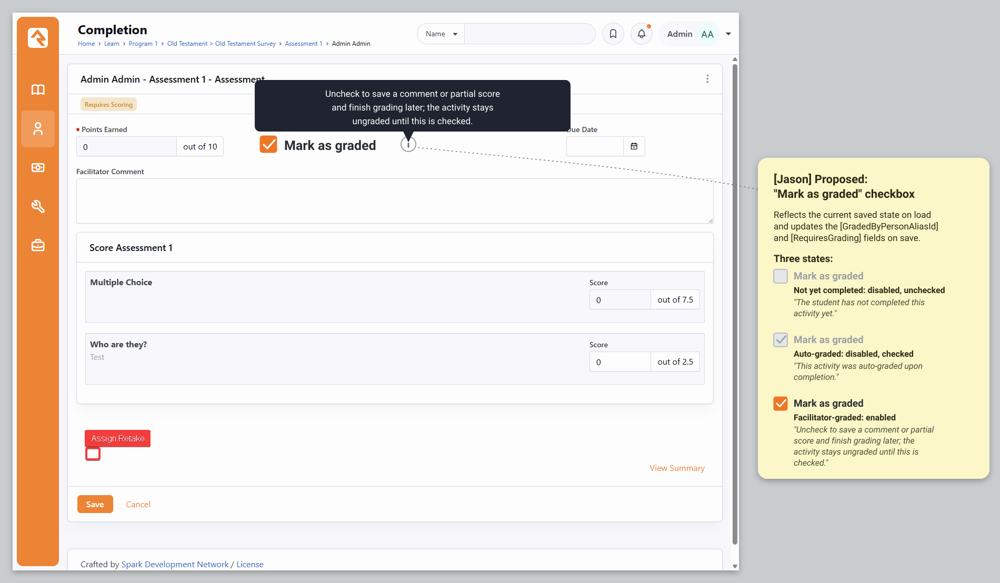
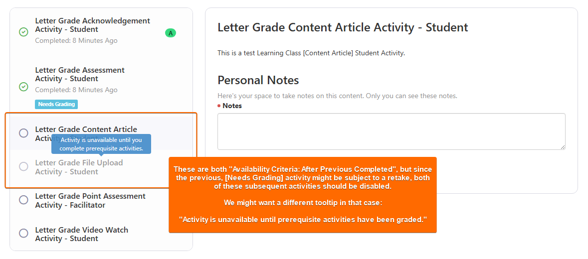
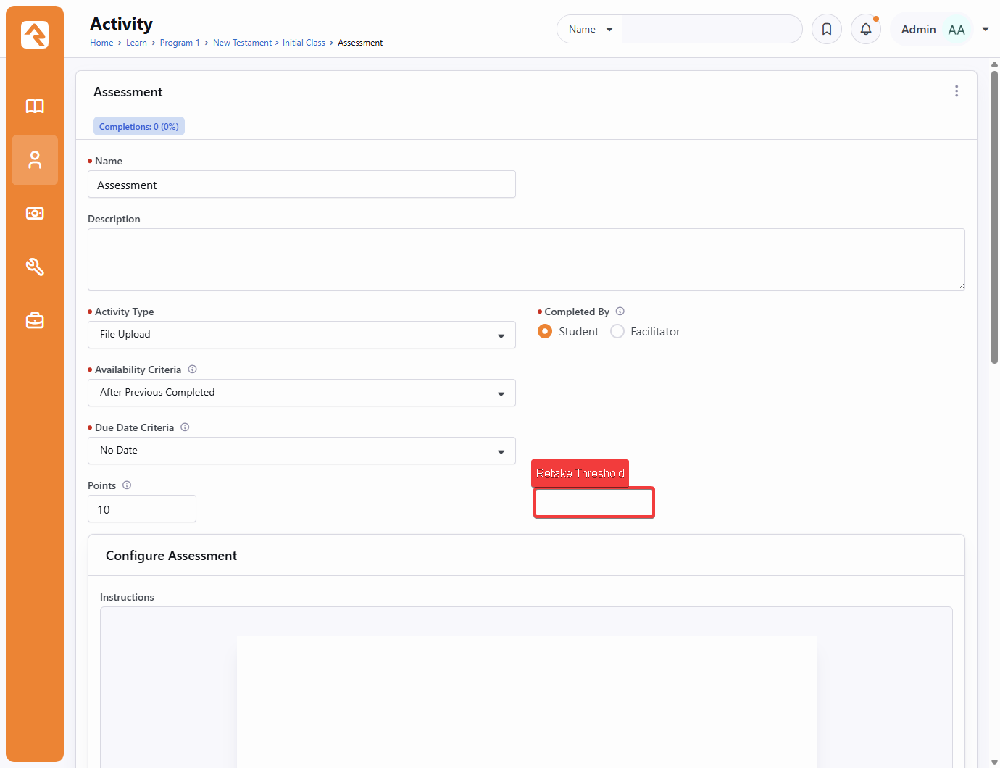
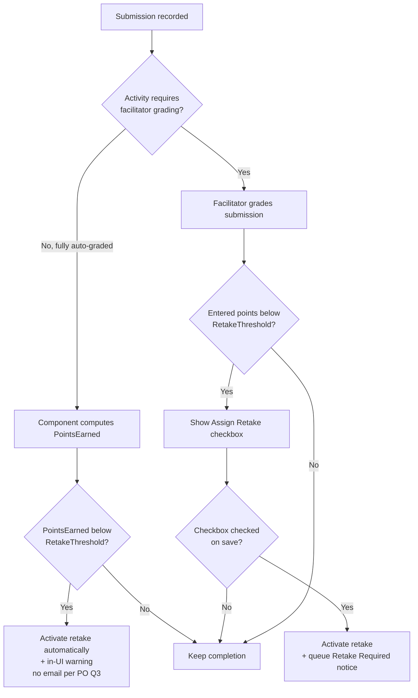
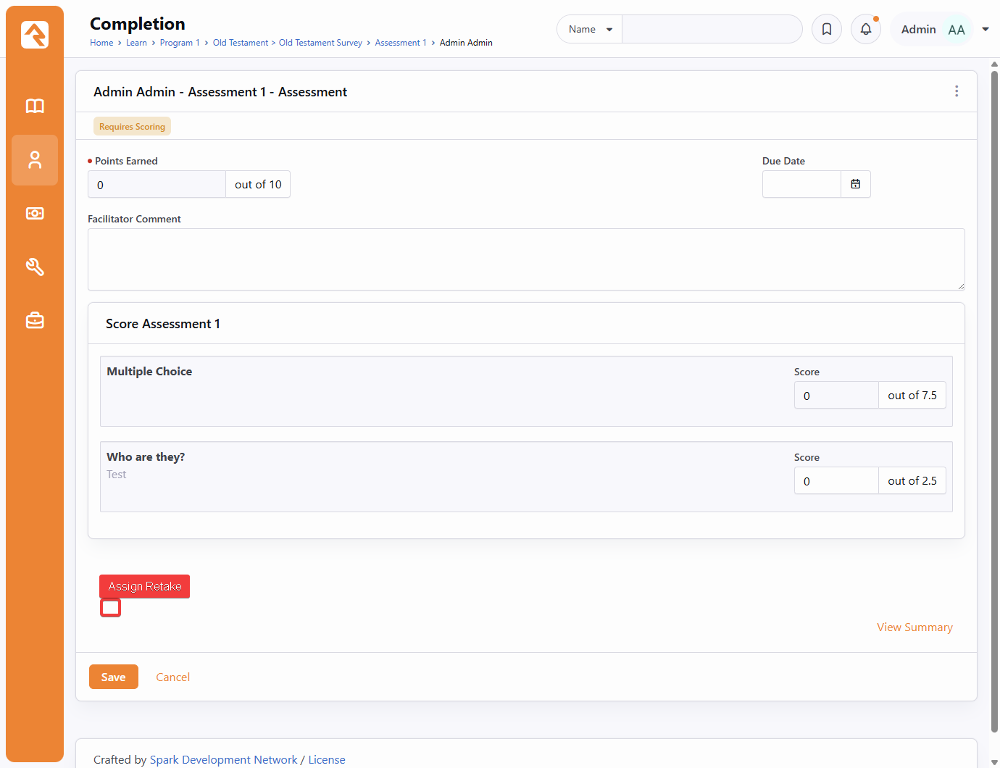

# LMS Assessment Retakes

## Summary

Rock's LMS has no native way to retake a scored Learning Activity. Once a submission is recorded the score is final, and there is no mechanism to gate progression on a passing result. This spec adds a configurable **Retake Threshold** to scored activity types. When a submission scores below the threshold, the activity becomes eligible for a retake: auto-graded activities assign the retake automatically, and manually graded activities present the facilitator an "Assign Retake" choice while grading. Assigning a retake deletes the prior completion so the activity returns to a not-yet-completed state. On the facilitator-graded path this queues a "Retake Required" notification to the student; on the auto-graded path the student instead gets an immediate in-UI warning (no email).

## Motivation

Christ Fellowship uses Rock's LMS for volunteer onboarding, leadership college, and staff training. Many of these programs use Pass/Fail or Letter Grade systems where passing is a prerequisite for moving forward.

Students who fail need a path to retake the assessment. The only workaround today is a completion workflow that deletes failed attempts. That approach is fragile and depends on workflow-queue timing: when the cleanup lags, the failing score stays on the record and the student keeps progressing through material they have not mastered. A first-class retake mechanism removes the queue-timing dependency and makes the gate deterministic.

## Scope

Retakes are supported on the three Learning Activity component types that produce a variable earned score:

- Assessment (`Rock/Lms/AssessmentComponent.cs`)
- File Upload (`Rock/Lms/FileUploadComponent.cs`)
- Point Assessment (`Rock/Lms/PointAssessmentComponent.cs`)

Every component type can earn points, but "auto-scored" components are not in scope for retakes; only those components whose earned score is *variable* are in scope.
1. [In Scope] The three component types above each override the `CalculatePointsEarned` and `RequiresGrading` methods (`Rock/Lms/LearningActivityComponent.cs`) to produce a partial or facilitator-assigned score, which is what a Retake Threshold gates on. Those three are therefore the only types in scope.
2. [Not In Scope] Acknowledgment, Content Article, and Video Watch do not override `CalculatePointsEarned` or `RequiresGrading`, so they award the full `Points` value on completion and are all-or-nothing: there is no partial score for a threshold to compare against, and "below threshold" collapses to "not completed," which the workspace already handles.

## Questions for the Product Owner

These gated the implementation path and were taken to the Product Owner (Kyle Henning) before build. Each question's outcome is recorded as a **Decision** below; the original analysis is kept for the record. In short: Q1 rejected (the pre-existing grading bug is not fixed in this feature), Q2 rejected except the general class-completion gating from Asana requirement #6, and Q3 resolved (no email on the auto path).

**1. Fix a pre-existing grading bug first? (blocking)**
- Right now, when a facilitator makes any changes to a student's `[LearningClassActivityCompletion]` record (e.g., to simply add a comment), Rock marks it as "graded" even if they did not actually grade it. Note that these records can be auto-created by the system (e.g., by the `SendLearningNotifications` Job) before the student actually submits anything, so a facilitator can be marking a record as "graded" that was never graded at all. This is a pre-existing bug, but it is particularly dangerous in the context of retakes.
- The score field starts at 0, so that save can record a 0 the facilitator never intended.
- Worse, once a record is wrongly marked graded before the student submits, the workspace treats it as already graded and silently discards the student's eventual submission (the `if ( !completion.GradedByPersonAliasId.HasValue )` guard in `CompleteActivity`), leaving a phantom grade on work that never got scored.
- This new "Assessment Retakes" feature leans hard on knowing whether something was truly graded: that one fact decides whether a retake is assigned, whether the next activity unlocks, and whether the student sees a "you're finished" screen.
- If "graded" cannot be trusted, the system could assign a retake based on a 0 nobody entered.

**Recommendation:** Add a "Mark as graded" checkbox to the facilitator grading form, enforced on the server (the checkbox is the hint; the save logic is the integrity boundary). The grade-state flip happens only when the box is checked, never on a bare comment save. It stores no new column; it drives the existing `GradedByPersonAliasId` / `RequiresGrading` fields, and as a bonus lets a facilitator save a partial score or comment and finish grading later.

The checkbox reflects the record's persisted state on load rather than defaulting checked. This is the key safety property: an ungraded record loads unchecked, so grading is an affirmative act and a comment-only save leaves it ungraded.

Behavior by state:

- Student has not completed the activity (`IsStudentCompleted != true`, including job pre-created rows): disabled and unchecked. Tooltip: "The student has not completed this activity yet." There is nothing submitted to grade.
- Student has completed, activity is auto-graded (`RequiresGrading == false` and `GradedByPersonAliasId == null`): disabled and checked. Tooltip: "This activity was auto-graded upon completion."
- Student has completed, activity is facilitator-graded: enabled, checked or unchecked to match what is stored. Tooltip: "Uncheck to save a comment or partial score and finish grading later; the activity stays ungraded until this is checked."

Determining "auto-graded" needs both flags, not `RequiresGrading` alone: once a facilitator grades, every component reports `RequiresGrading == false`, so `GradedByPersonAliasId == null` is what separates genuinely auto-graded from already-graded. This is only reliable once the premature flip is fixed, so the checkbox and the server-side flip fix are one change, not two. (Minor known edge: a facilitator who overrides the score on an auto-graded activity sets `GradedByPersonAliasId`, after which it presents as facilitator-graded rather than auto-graded.)

Un-grading: the enabled checkbox lets a facilitator uncheck a previously graded activity to resume grading. This is non-destructive (it does not delete the student's submission, unlike a retake) and is recoverable by re-checking; the partial score is retained on uncheck. Known ripple: un-grading reverts class completion to Incomplete, which can re-fire a course-completion workflow on the eventual re-grade.

**Decision (Kyle): Rejected.** The "Mark as graded" checkbox and the underlying "graded on any save" fix are out of scope for this feature; the behavior above remains a pre-existing bug to be tracked separately. Consequence for retakes: the class-completion gating (Requirement 10) and the auto-retake guard read `GradedByPersonAliasId` / `RequiresGrading`, which this bug can set early. The auto-retake guard errs safe (a stray "graded" stamp routes to the manual path rather than auto-deleting work), so retakes do not make the pre-existing bug worse, but the gating is only as trustworthy as that flag.



*Mockup of the rejected "Mark as graded" proposal. Kept for historical context; not built.*

**2. What does the student see while pending retakes are awaiting grading?**
- Right now the platform treats a submitted-but-ungraded activity as finished in two ways that a later retake would contradict.
    - First, for an activity set to open after the previous one is finished, it lets the student move straight on to the next activity before the facilitator has graded and the retake decision is made.
    - Second, it can show "You've successfully completed {course}" the moment the last activity is submitted, before grading.

**Recommendation**: We will hold both back until grading is done, showing a "Needs Grading" state in the meantime: no success screen, and no unlocking the next activity, until the result is final. 

**Decision (Kyle): Rejected, except class-completion gating.** The retake-specific holds are dropped: the next activity keeps unlocking on submission as it does today, and there is no "Needs Grading" retake wording or locked-activity tooltip. However, Asana task requirement #6 (Class Completion Gating) is in scope and is implemented generally, for any activity awaiting grading rather than only potential retakes: while any activity in the class is ungraded, the class MUST NOT be recorded complete (status, date, and completion record/workflow) and the student success screen MUST NOT be shown. See Requirement 10.



*Mockup of the rejected progression hold. Only the class-completion and success-screen gating from Asana #6 survived; the next-activity hold shown here was not built. Kept for historical context.*

**3. On the auto-graded path, also send the email?**
- The "Retake Required" email was going to be sent on both paths.
- On the auto-graded path the student is live in the workspace and now gets an immediate in-UI warning (Requirement 6) explaining the retake.
- On the manual path the student is not present when the facilitator grades, so the email is their only notice.

**Recommendation:** Always send it on the facilitator path. On the auto path, sending it too is optional: the in-UI warning already gives immediate awareness, but the email leaves a durable, linkable record the student can return to. Lean toward sending on both for that record, unless a duplicate "you did not pass" message feels heavy-handed.

**Decision (Kyle): Do not send the email on the auto path.** The in-UI warning (Requirement 6) is sufficient there. The "Retake Required" email is sent only on the facilitator-assigned path (Requirement 7).

## Requirements

Each requirement maps to one of the Asana task's six Functional Requirements, noted as (Asana #N): #1 Retake Threshold Configuration, #2 Retake Triggering, #3 Retake Activation, #4 Retake Required System Communication, #5 Due Dates, #6 Class Completion Gating.

1. **Retake threshold configuration (Asana #1):** A point threshold MUST be configurable per scored activity. Field label: **Retake Threshold**. Help text: "The minimum score a student must earn to avoid being assigned a retake for this activity." When the threshold is left empty, retakes are disabled for that activity.
2. **Retake eligibility (Asana #1):** A submission whose earned score is *below* the configured threshold MUST be eligible for a retake. A submission at or above the threshold MUST NOT be.
3. **Auto-graded triggering (Asana #2):** For activities that score automatically (Assessment with no facilitator-graded items), when the student's submitted score is below the threshold a retake MUST be assigned automatically.
4. **Manually graded triggering (Asana #2):** For activities that require facilitator grading (File Upload, Point Assessment, and Assessment containing short-answer items), an **Assign Retake** checkbox MUST be displayed while grading, *only* when the entered Points Earned is below the activity's Retake Threshold. When the facilitator saves with the checkbox checked, the retake is activated.
5. **Retake activation (Asana #3):** When a retake is assigned (automatic or manual), the prior `LearningClassActivityCompletion` record MUST be deleted and the activity MUST return to a not-yet-completed state for the student. Previous attempts are not retained, no audit record is kept, and there is no limit on the number of retakes.
6. **Auto-assigned retake feedback (Asana #2):** When a retake is assigned automatically (the auto-graded path, while the student is live in the workspace), the workspace MUST return the student to a fresh attempt of the same activity and show an in-UI warning notification mirroring the "Retake Required" message, so the reset is explained rather than happening silently.
7. **Retake Required notification (Asana #4):** A "Retake Required" system communication MUST be queued and sent on the facilitator-assigned path, where the student is not present to see the result. It MUST NOT be sent on the auto-graded path, where the student already gets the in-UI warning from Requirement 6 (PO decision, question 3). (See body copy under Design.)
8. **Due dates (Asana #5):** Retakes have no special due-date handling. The retake's submission date is the activity's submission date; no new due date is computed.
9. **Next-activity progression (unchanged by this feature) (Asana #6):** Per the PO decision on question 2, there is no retake-specific progression hold. An `AfterPreviousCompleted` activity continues to unlock when the student submits the previous one, exactly as it does today, even while that submission awaits grading. The class-completion and success-screen gating is covered by Requirement 10.
10. **Class completion gating (Asana #6):** A class MUST NOT be recorded complete while any activity in it is awaiting grading. This applies generally, to any ungraded activity, not only potential retakes. Concretely, while any activity is ungraded: the backend completion status (`LearningCompletionStatus`) MUST NOT leave `Incomplete`, no class/program completion record or completion workflow MUST fire, and the student-facing success screen MUST NOT be shown. Separately, the completion date (`LearningCompletionDateTime`) tracks when the student actually finishes the work (a student action, not gated on grading) and MUST be cleared when a retake is activated, so it re-stamps at the genuine post-retake completion rather than a pre-retake timestamp.

## Implementation Status

| # | Requirement | Implemented | Tested |
|---|---|:---:|:---:|
| 1 | Retake threshold configuration | ✅ | ✅ |
| 2 | Retake eligibility | ✅ | ✅ |
| 3 | Auto-graded triggering | ✅ | ✅ |
| 4 | Manually graded triggering | ✅ | ✅ |
| 5 | Retake activation | ✅ | ✅ |
| 6 | Auto-assigned retake feedback | ✅ | ✅ |
| 7 | Retake Required notification | ✅ | ✅ |
| 8 | Due dates (no code) | ✅ | ✅ |
| 9 | Next-activity progression (no code) | ✅ | ✅ |
| 10 | Class completion gating | ✅ | ✅ |

- [x] **1. Retake threshold configuration** — `RetakeThreshold` on `LearningClassActivity` + bag; editor field gated on `supportsRetake`, mapped in `LearningClassActivityDetail`.
- [x] **2. Retake eligibility** — `LearningClassActivityCompletion.IsScoreBelowRetakeThreshold`.
- [x] **3. Auto-graded triggering** — `PublicLearningClassWorkspace.CompleteActivity` (guarded by `!RequiresGrading && !GradedByPersonAliasId`).
- [x] **4. Manually graded triggering** — Assign Retake checkbox in `editPanel.partial.obs`; `Save` honors `IsRetakeAssigned`.
- [x] **5. Retake activation** — `LearningClassActivityCompletionService.AssignRetake` (deletes completion + file, clears date, resets status, drives recompute).
- [x] **6. Auto-assigned retake feedback** — warning `NotificationBox` + stay-on-activity in `publicLearningClassWorkspace.obs`.
- [x] **7. Retake Required notification** — `PrepareRetakeRequiredNotification`, facilitator path only, preference-aware (email/SMS), sent after the save commits.
- [x] **8. Due dates** — no special handling required; nothing to implement.
- [x] **9. Next-activity progression** — unchanged per PO decision; no code.
- [x] **10. Class completion gating (Asana #6)** — backend already gated at the single status writer (`UpdateClassGrades` sets `Incomplete` while `hasUngradedAssignments`; the program-completion job and course-completion workflow key off `Pass`, so neither fires while ungraded), so no backend change was needed; client success screen now gated on completed-and-graded in `publicLearningClassWorkspace.obs`. Completion-date clearing and status reset on retake come from Requirement 5.

Cross-cutting (handled outside this code change):

- [x] EF migration: `RetakeThreshold` column on `[LearningClassActivity]`.
- [x] Migration: seeds the "Retake Required" system communication (email body) in `202606251440354_AddLearningClassActivityRetakeThreshold`. SMS is not seeded, so delivery falls back to email until an admin adds an SMS message + From number to the communication.
- [x] Regenerate Obsidian ViewModels and rebuild the Blocks JS so `RetakeThreshold` / `IsRetakeAssigned` / `RetakeMessage` exist on the generated bags.

## Design

### Data model

Add a nullable point-threshold column to the class-level activity instance, alongside the existing `Points` column:

| Property | Type | Entity | Notes |
|---|---|---|---|
| `RetakeThreshold` | `int?` | `LearningClassActivity` | Null disables retakes for the activity. |

`Points` lives on `LearningClassActivity` (`Rock/Model/LMS/LearningClassActivity/LearningClassActivity.cs`), and the mockup places Retake Threshold next to Points in the class activity editor, so the threshold belongs on the same entity. The shared `LearningActivity` template (`Rock/Model/LMS/LearningActivity/LearningActivity.cs`) is not involved, mirroring how `Points` is stored only on the class activity.

Changes that follow from the new column:

- EF migration adding `RetakeThreshold` to `[LearningClassActivity]` (nullable `int`, no cascade implications).
- `LearningClassActivityBag` / detail bags under `Rock.ViewModels/Blocks/Lms/...` gain `RetakeThreshold` (typed `int?`).
- The activity editor block surfaces the field (see image 1 below).



### Deciding when a retake is required

The eligibility test is a single, component-independent comparison of the completion's earned score against the activity's `RetakeThreshold`, so it lives as a computed property on the completion entity (`LearningClassActivityCompletion.Logic.cs`) rather than as per-component logic:

```csharp
public bool IsScoreBelowRetakeThreshold =>
    LearningClassActivity?.RetakeThreshold != null
    && PointsEarned.HasValue
    && PointsEarned.Value < LearningClassActivity.RetakeThreshold.Value;
```

The threshold is point-based to match the grading UI, which expresses scores as "out of N" points rather than percentages. A null threshold (retakes disabled) or an as-yet-unscored completion returns `false`, so a retake is never warranted until there is a final score to compare. This also defers the Assessment short-answer case for free: while short-answer items await grading, `CalculatePointsEarned` returns null, so `PointsEarned` is null and the comparison is `false`.

The property answers only "is this submission's score below threshold"; it does not act, and it is not the whole eligibility decision. The auto path additionally gates on the generic `RequiresGrading == false` (fully auto-graded) and `GradedByPersonAliasId == null` (no facilitator has touched it) before acting; a `RequiresGrading == true` activity defers to the facilitator (manual path). The Triggering section below shows both flows.

This was originally drafted as a per-component virtual `DetermineRetakeRequired` on `LearningActivityComponent` (alongside `CalculatePointsEarned` and `RequiresGrading`). It was collapsed because every component's override was identical: the comparison has no per-component nuance, and the Assessment deferral is handled by the generic guards above rather than by component-specific code. If a future scored component ever needs non-threshold retake logic, the per-component seam can be reintroduced (the base is `[RockInternal]`, so adding it back is non-breaking).

### Showing the Retake Threshold field

The activity editor renders the **Retake Threshold** field next to Points (image 1). The eligibility comparison (`IsScoreBelowRetakeThreshold`) is per-completion and cannot answer the config-time question "could this component ever support a retake," so that capability is advertised separately: components return a `supportsRetake` entry in the configuration dictionary they already provide from `GetActivityConfiguration` under `PresentedFor.Configuration`, and the editor shows the field only when the selected component advertises support. This keeps the capability gate on the component itself rather than a hard-coded list of the three component-type GUIDs.

### Triggering



- **Auto path.** Fully auto-graded Assessments compute `PointsEarned` via `AssessmentComponent.CalculatePointsEarned()`. When the submission is fully auto-graded (`RequiresGrading == false`), untouched by a facilitator (`GradedByPersonAliasId == null`), and `IsScoreBelowRetakeThreshold` is true, the retake is activated immediately and the student gets the in-UI warning (Requirement 6). No email is sent on this path (PO decision, question 3).
- **Manual path.** The facilitator grading block (`Rock.Blocks/Lms/LearningClassActivityCompletionDetail.cs`, `Rock.JavaScript.Obsidian.Blocks/src/Lms/learningClassActivityCompletionDetail.obs`) shows the **Assign Retake** checkbox only when the entered Points Earned is below the activity's `RetakeThreshold`. Saving with it checked activates the retake and queues the notification.



### Retake activation

Activation deletes the existing `LearningClassActivityCompletion` for that student and activity (`Rock/Model/LMS/LearningClassActivityCompletion/LearningClassActivityCompletion.cs`). The activity then reads as not-yet-completed in the student workspace (`Rock.Blocks/Lms/Public/PublicLearningClassWorkspace.cs`) and the next attempt creates a fresh completion record.

The completion save-hook recomputes class grades (`LearningClassActivityCompletion.SaveHook.cs` `UpdateClassGrades()`). The delete path MUST drive the same recomputation so the participant's grade and `LearningCompletionStatus` reflect the removed attempt. It MUST also clear the participant's `LearningCompletionDateTime`; today that date is set once when every activity is first submitted (the `!participant.LearningCompletionDateTime.HasValue` guard) and never updated, so without clearing it on retake it would stay stuck at the pre-retake timestamp instead of re-stamping when the student genuinely finishes. Any `BinaryFile` the student uploaded is deleted immediately with the completion, rather than left for the binary-file cleanup job.

### Retake Required system communication

Add a new system communication plus a `SystemGuid` constant, seeded by a migration.

- **Subject:** `Assessment Graded: Retake Required`
- **Body:**

The body is wrapped in the global `EmailHeader`/`EmailFooter` and uses `<p>` paragraphs with `<strong>`/`<br />` (matching the LMS digest template) so it renders with proper spacing and line breaks rather than as a run-on:

```liquid
{{ 'Global' | Attribute:'EmailHeader' }}
<p>
    You did not receive a passing grade on {{ Activity.ActivityName }}. A retake has been assigned. Please complete the activity below to receive credit.
</p>
<p>
    <strong>Activity:</strong>
    <a href="{{ 'Global' | Attribute:'PublicApplicationRoot' }}learn/{{ Program.ProgramIdKey }}/courses/{{ Course.CourseIdKey }}/{{ Class.ClassIdKey }}?activity={{ Activity.LearningClassActivityIdKey }}">{{ Activity.ActivityName }}</a>
    
    <br />
    <strong>Due:</strong>
    {{ Activity.DueDate | HumanizeDateTime }}
    
</p>
{{ 'Global' | Attribute:'EmailFooter' }}
```

Merge fields are PascalCase object keys (`Activity`, `Class`, `Course`, `Program`, plus the common `Person`), supplied by `LearningClassActivityCompletionService.PrepareRetakeRequiredNotification` as small `LavaDataObject` Info objects, matching the dotted-path style of the existing LMS templates.

The activity link uses the same bare `?activity={IdKey}` form as the existing LMS notification emails (no `tab` query param). For the link to land on the activity in academic-calendar-mode classes, the workspace was updated to default to the Activities tab whenever an `activity` query param is present, rather than the Class Overview tab. This is a shared fix: it also makes the existing digest/announcement notification links land correctly, and avoids hard-coding the tab name into any email template.

The notification is sent on the facilitator-assigned path only; the auto path uses the in-UI warning instead (PO decision, question 3; Requirement 7). Email vs SMS is resolved with `Communication.DetermineMediumEntityTypeId` (the system-communication-aware overload), which honors the recipient's preference but only selects SMS when the communication defines an SMS message and From number and the recipient has an SMS number, otherwise email; seed the SMS message and From number in the migration if SMS delivery is wanted. The message is built before the completion is deleted and sent only after the retake commits, so a failed save never produces a "retake assigned" message.

### Class completion gating (Asana #6)

This is the one piece of PO question 2 that survived, implemented generally for any ungraded activity, not only potential retakes. `UpdateClassGrades()` already sets `LearningCompletionStatus = Incomplete` when any assignment is ungraded (`hasUngradedAssignments`), which is the backbone.

- **Backend status / record / workflow.** An audit confirmed `UpdateClassGrades()` is the only writer of `LearningCompletionStatus`, and that the program-completion job and the course-completion workflow both key off `Pass`. Because an ungraded class is forced to `Incomplete`, neither a class/program completion record nor a completion workflow can fire while grading is pending, so no backend change was needed.
- **Success screen and completion banner.** Both student-facing "you're finished" signals (the "You've successfully completed {course}" success screen and the "You completed this class on {date}" banner) were gated so neither shows while any activity is ungraded (see the workspace section below).

The completion date is handled separately: it tracks the student finishing the work and is cleared on retake activation (Requirement 10, and the activation logic above).

### Gating the next activity on the retake decision (dropped)

Per the PO decision on question 2, this hold is **out of scope**. An `AfterPreviousCompleted` activity keeps unlocking when the student submits the previous one, exactly as it does today, even while that submission awaits grading. No change is made to the unlock condition at `PublicLearningClassWorkspace.cs:298`, and there is no grading-aware locked-activity tooltip. The class-completion and success-screen gating that survived from question 2 lives in the section above.

### Student workspace status and the completion screen

The public workspace (`Rock.JavaScript.Obsidian.Blocks/src/Lms/publicLearningClassWorkspace.obs`) already marks a completed-but-ungraded activity in the activity rail: a green check and "Completed: ..." once `completedDate` is set, with the grade badge hidden while `requiresScoring`. The behavior that must change is the two "you're finished" signals (Asana #6):

**Course-completion screen and completion banner.** Two signals announce completion: the "Congratulations ... You've successfully completed {course}" success screen, and a "You completed this class on {date}" banner above the activity content. Both previously appeared as soon as the student had submitted everything, before grading; both are now withheld until every activity is completed and graded.

The gate is a single function, `areAllActivitiesCompleteAndGraded()` (`activities.every(a => isCompleted(a) && !a.requiresScoring)`), shared by all consumers so the rule cannot drift between them: the two success-screen sites (`getInitialActivitySelection` during setup, and the post-submit handler) call it directly, and the `isClassCompletedAndGraded` computed wraps it. The banner and the "Final Grade" / "Current Grade" label read that computed; the banner additionally needs `classCompletionDate` (the `LearningCompletionDateTime` roll-up) for the displayed date, but its show/hide gate is the shared function. A function rather than only the computed is used because `getInitialActivitySelection` runs during setup before the computed is initialized.

The gate keys off the server's `isCompleted` flag rather than the presence of `completedDate`, so a facilitator-assigned activity is judged complete by the same rule the rest of the workspace uses. This is the general Asana #6 behavior, not retake-specific.

The retake-specific student-facing changes from the original question 2 are dropped (PO decision): there is no client-side optimistic-unlock guard, no "Needs Grading" retake wording, and no "Submitted, awaiting grading" main-content state. The auto-path reset has its own warning (next section).

### Auto-assigned retake in the workspace

The auto-graded path is synchronous and happens while the student is live in the workspace: they submit, the score is computed, `IsScoreBelowRetakeThreshold` is true, and the prior completion is deleted on the spot. Without explicit feedback the activity would just blank itself back to a fresh attempt and leave the student wondering what happened.

So `CompleteActivity` MUST signal an auto-assigned retake back to the client (a flag plus a message on the response, alongside the reset completion bag). On seeing it, the workspace keeps the student on the same activity, now a fresh attempt, instead of advancing or showing success, and renders a warning `NotificationBox` (the control is already used in this block, for example the facilitator-comment box) with copy mirroring the "Retake Required" system communication, for example: "You did not pass {activity}. A retake has been assigned, please complete the activity again to receive credit."

This applies to the auto path only. On the manual path the student is not present when the facilitator grades, so the system communication (email) is their notice and they find the activity reopened on their next visit.

## Considered but Rejected

### Keep prior attempts as versioned completions
Rejected. Requirement 5 explicitly states previous attempts are not retained, and the current model assumes a single completion per student per activity. Versioning would ripple through grade calculation, the workspace, and reporting for no in-scope benefit.

### Continue using completion workflows that delete failed attempts
Rejected. This is the existing workaround and the reason for the feature: it depends on workflow-queue timing, and lagging cleanup lets failing scores persist while the student advances.

### Hard-code the three scoring component types
Rejected. Gating the Retake Threshold field on a fixed list of the three component-type GUIDs works today but bakes the scope into the block. Letting each component advertise support in its `GetActivityConfiguration` payload (the `supportsRetake` entry) lets future scored components join without touching the editor.

### A per-component `DetermineRetakeRequired` virtual
Rejected after first being built. The idea was to own the decision on each component, alongside `CalculatePointsEarned` and `RequiresGrading`, on the theory that components needed per-component nuance (for example an Assessment deferring while short-answer items remain ungraded). In practice every component's override was the identical threshold comparison: the nuance is handled generically (the auto path's `RequiresGrading == false` guard, and a null `PointsEarned` for ungraded work), not by component-specific code. The decision is a single component-independent comparison, so it lives as `LearningClassActivityCompletion.IsScoreBelowRetakeThreshold` instead. The per-component seam can be reintroduced without a breaking change (the base is `[RockInternal]`) if a future scored component ever needs non-threshold logic.

### Store the threshold as a percentage
Rejected. The grading UI and `Points` are point-based ("out of 10"). A point threshold keeps the facilitator's mental model consistent and avoids rounding ambiguity between percent and points.

## Related

- Asana task: [Christ Fellowship LMS Enhancement: Assessment Retakes](https://app.asana.com/1/20866866924293/project/1208321217019996/task/1214820046148843) (DEV-12921, v20)
- Mockups (annotated, treated as canonical): [Retake Threshold field](artifacts/260623-lms-assessment-retakes/retake-threshold-config.png), [Assign Retake checkbox](artifacts/260623-lms-assessment-retakes/assign-retake-checkbox.png)
- Branch: `feature-jph-develop-v20-lms-assessment-retakes`
