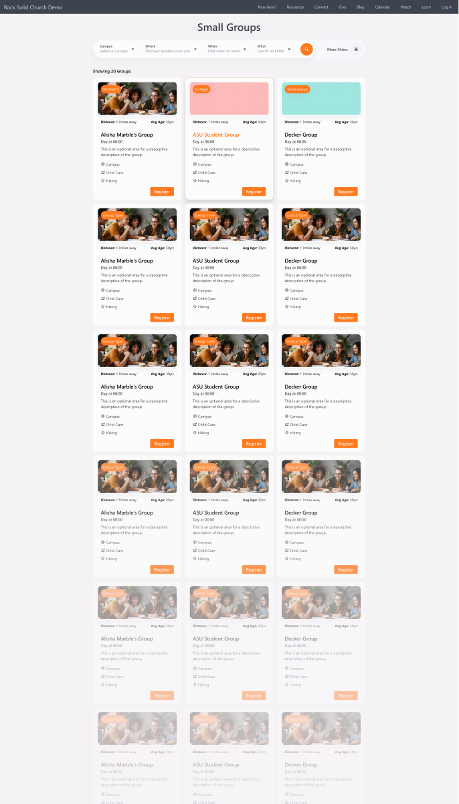
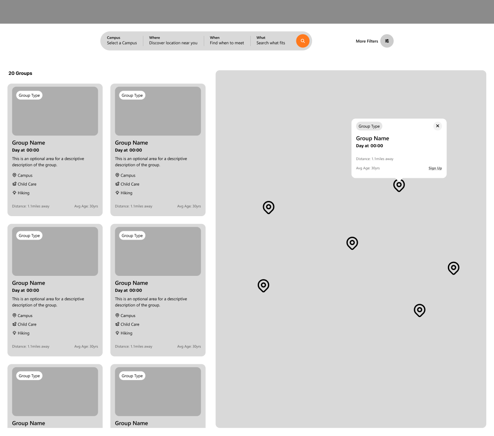
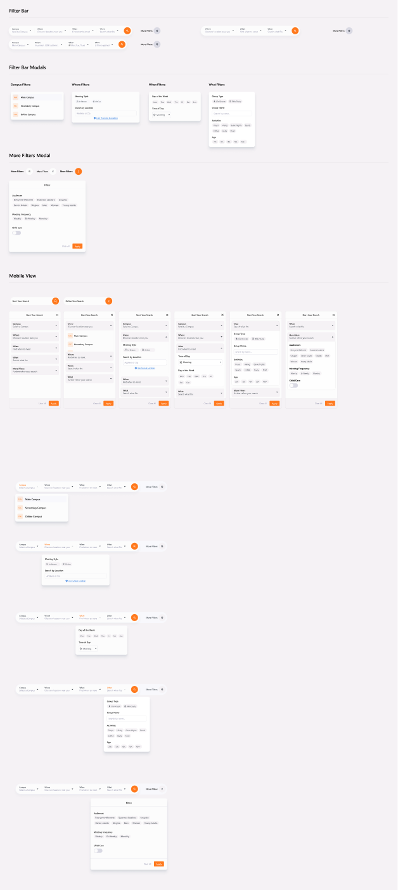
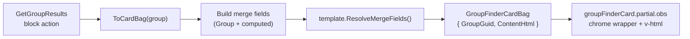
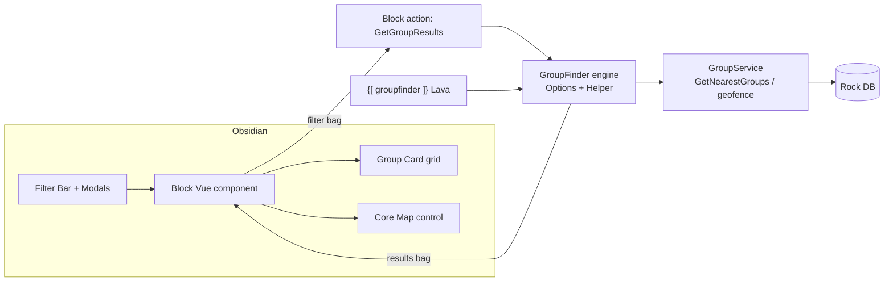

# Group Finder Obsidian Block

## Summary

Build a new Obsidian (Vue 3 + C#) Group Finder block that lets a public visitor discover groups through a modern, opinionated filter experience: a horizontal pill filter bar (Campus / Where / When / What) with a "More Filters" modal, a responsive grid of group cards, and an optional side by side interactive map. The UI is modeled on Airbnb's search pattern and is intentionally opinionated: a curated card + map layout with no data grid. The legacy free-form grid/Lava page output is not carried forward, but the card's *content* is rendered from an admin-configurable per-card Lava template (the block keeps ownership of the interactive card chrome).

The block reuses Rock's existing group filtering engine (`Rock.Utility.GroupFinder`) rather than reinventing query logic, adds a first-class nullable **Meeting Style** property to groups (In-Person / Online / Hybrid), and introduces a reusable Core Obsidian map control. It ships as a **new** block; the existing WebForms `GroupFinder` is kept and renamed to "Group Finder (Legacy)".

> **This is a net-new block, not a WebForms-to-Obsidian conversion.** Do not use the `/convert-block` workflow. The legacy `.ascx` is kept, not retired, and the new block is a ground-up redesign with its own schema and UI, not a feature-for-feature port. The legacy block is mined for proven logic (location precision, register-page navigation, geofence handling, the filter-vs-display attribute split) but its layout and settings are not carried over.

## Motivation

The current Group Finder is a WebForms block that is highly configurable but dated: it leans on a data grid, a large Lava template surface, and dozens of block settings. It predates Obsidian and cannot be embedded in modern Obsidian sites without the WebForms shell.

The product goal is a discovery experience that feels like a consumer product (Airbnb), where filtering is fast, visual, and progressive. This is a high impact, public-facing block, so the design is deliberately opinionated: fewer knobs, better defaults, and a curated card + map layout instead of a raw grid.

Two constraints from the product owner shape the approach:

1. **Be the integrator, not the inventor.** Prefer existing Rock Core Obsidian controls and match their look and behavior. Avoid creating many bespoke UI primitives.
2. **Prefer first-class data over attributes.** Meeting Style (in-person / online / hybrid) becomes a real group property rather than a configured attribute, so it can be filtered and displayed consistently across Rock.

## Design Inputs and Cross-check

The Figma file was authored by the design team and includes three "Architect Notes" annotation frames that read as a written requirements doc. Those notes are treated as the primary source for behavior; this spec reconciles them with Rock conventions where they diverge.

Reference mockups (captured 2026-07-08, see `Related`):

**Desktop card layout and filter bar**



**Desktop map-enabled (side by side)**



**Filter bar, per-filter modals, and More Filters modal**



Architect Notes (verbatim source for the requirements below): [Filter Bar](artifacts/260708-group-finder-obsidian-block/architect-notes-filter-bar.png), [Layout Format](artifacts/260708-group-finder-obsidian-block/architect-notes-layout-format.png), [Map Enabled](artifacts/260708-group-finder-obsidian-block/architect-notes-map-enabled.png). Mobile: [cards](artifacts/260708-group-finder-obsidian-block/mobile-card-layout.png), [map](artifacts/260708-group-finder-obsidian-block/mobile-map-enabled.png).

### Design-idiom translations (Figma to Rock)

The design team is not familiar with Rock Core controls, so several mockup elements map onto existing Rock primitives rather than new components:

| Figma element | Rock translation |
|---|---|
| Pill "checkbox filters" | Rock pill/toggle-button styling on Core checkbox groups. No new control. |
| Filter dropdowns in the bar | Each opens a popover/modal using the Core `Modal` (or a lightweight popover) with Core inputs inside. |
| "More Filters" modal | Core `Modal` containing dynamically rendered filter fields. |
| Day-of-week Mon-Sun pills | Core multi-select rendered in pill style. |
| Time-of-day Morning/Afternoon/Evening with icons | Core single-select segmented control with icons. |
| Address / "Use Current Location" | Core address input plus the browser geolocation API, gated on proximity being enabled. |
| Interactive map + markers + info window | New reusable Core Obsidian map control (see Design). |
| Group card | Bespoke card component local to the block, built from Core layout utilities. |

## Requirements

Requirements use MUST / SHOULD / MAY. They are grouped by capability.

### Delivery and compatibility

- The block MUST be a new Obsidian block; it MUST NOT modify the behavior of the existing WebForms `GroupFinder`.
- The existing WebForms block's display name MUST be updated to "Group Finder (Legacy)" so administrators can tell the two apart. No functional change to the legacy block.
- The new block SHOULD be marked as a Preview block per Rock's preview convention until the API and UX are confirmed.
- Backend filtering MUST reuse the existing `Rock.Utility.GroupFinder` engine (see Design), not a parallel implementation.

### Filter bar (Campus / Where / When / What)

- The block MUST render a horizontal filter bar with up to four filter groups plus a "More Filters" action, matching the mockup.
- Each filter section MUST be independently hideable via block settings: Hide Campus Filters, Hide Where Filters, Hide When Filters, Hide What Filters.
- Active filters SHOULD override the section label with a summarized value (character-limited), e.g. the label shows selected values when filters are applied.
- **Campus filters:** MUST list campuses powered by configurable Campus Types and Campus Statuses. The campus code SHOULD be displayed next to the campus name (e.g. "Online (ONL)").
- **Where filters:**
  - MUST support a Meeting Style filter (In-Person / Online / Hybrid) sourced from the new group property. If no meeting styles are enabled/present, this filter MUST be hidden. Filtering is set membership over the single-value enum: selecting one or more styles matches groups whose Meeting Style is among the selected values. Hybrid is a distinct value, not treated as In-Person plus Online (so selecting "Online" does not return Hybrid groups). A `[Flags]` model was considered and rejected; see Considered but Rejected.
  - MUST support proximity search when "Enable Proximity Features" is on: an address input plus a "Use Current Location" action. This capability requires Google APIs to be configured; the setting MUST carry a tooltip stating that dependency.
  - When the search location is a specific address or "Use Current Location", that location MUST also be the distance/proximity origin, so distances (including driving distance) are measured from where the visitor searched, not from their device or the server's guess. This covers the common case of searching for groups near a home address while physically elsewhere: entering the home address measures distance from home. An area ("Search this area") search and an unfiltered browse are unaffected; those still measure from the device coordinates or the server's guess.
  - On load, the block MUST open as an all-groups browse (the search location filter is NOT defaulted to a location). When geolocation permission is already granted, the current location MUST be resolved silently (no prompt) and used as the distance/proximity origin, so distances rank from the visitor's location while all groups are still shown; otherwise the server's guess drives distance. Current location as a search location stays opt-in via the "Use Current Location" action.
- **When filters:**
  - MUST support a Day of Week filter (multi-select) rendered as Mon-Sun pills.
  - MUST support a Time of Day filter (single-select) with values Morning / Afternoon / Evening, each with an icon. It MUST reuse the existing `Rock.Utility.TimePeriodOfDay` enum and the `IQueryable.WhereTimePeriodIsOneOf(...)` extension (`Rock/Utility/ExtensionMethods/LinqExtensions.cs`) for both the filter values and the server-side filtering (against the group's schedule time-of-day, e.g. `g => g.Schedule.WeeklyTimeOfDay.Value`); do not define a new time-of-day enum. The reused buckets are lower-inclusive and match our design: Morning `[12:00 AM, 12:00 PM)`, Afternoon `[12:00 PM, 5:00 PM)`, Evening `[5:00 PM, 12:00 AM)` (noon falls in Afternoon, 5:00 PM falls in Evening). The mobile Group Finder (`Rock/Blocks/Types/Mobile/Groups/GroupFinder.cs`) is precedent for this reuse.
- **What filters:**
  - MUST support Live Text Search (block setting toggle): a text field that filters by group name.
  - MUST support Group Type filtering. If only one group type is in scope, the Group Type filter MUST NOT render.
  - MUST support "Featured Attributes": filter attributes promoted into the What section and rendered as pills. A featured attribute MUST NOT also appear in the More Filters modal. Only Single-select, Multi-select, and Boolean field types are eligible to be featured.
- **More Filters modal:**
  - MUST render only when at least one configured, non-featured filter attribute is available.
  - MUST render each non-featured filter attribute via the stock `rockAttributeFilter.obs` field-type filter control (see Design, "Filter rendering and configuration").
  - SHOULD indicate the count of applied filters per section/value.
- **Configurable filter attributes:**
  - The attributes an admin may choose from MUST be scoped to the block's configured Group Types and limited to attributes whose field type reports it is filterable (`IFieldType.HasFilterControl()`), matching the legacy block (`GroupFinder.ascx.cs:850`). This is the definition of "valid searchable fields": a field type that supplies its own filter. Field types with no filter control (e.g. Decimal, Integer, and Date ranges) are therefore excluded automatically, not by a hand-maintained allowlist.
  - Filtering MUST be configured through two custom, Group-Type-scoped settings: **Featured Attributes** (the "What" pills) and **Display Attribute Filters** (the "More Filters" modal). The custom control MUST enforce that the two are mutually exclusive (an attribute cannot be in both) and that Featured is further limited to Single-select, Multi-select, and Boolean field types. (Reverses the earlier stock-picker decision; see Considered but Rejected.)
  - **Show Attribute on Card** MUST be a third Group-Type-scoped setting selecting the attributes displayed on each card (icon + value). Card display MUST use the attribute's public/formatted value, never the raw stored value (e.g. a Defined Value's name, not its Guid).
  - Server-side filtering MUST delegate to each attribute's own field type (`IFieldType.AttributeFilterExpression`) rather than a fixed set of string operators, so every filterable field type is honored to the full extent Rock supports it.

### Filter behavior and styling

- Each filter modal MUST carry a stable global CSS class plus a content-specific class (e.g. a shared filters class and a `filters-campus` variant), and each filter-bar segment MUST likewise carry a per-type class (e.g. `filter-segment-campus`), so themes can target both the trigger and its modal by type.
- The filter-bar segment value MUST truncate with a CSS ellipsis at the segment's fixed width (no JavaScript character cap).
- On mobile, all filters MUST collapse into a single drawer/modal presented as collapsible accordions rather than the horizontal bar.

### Results: group cards

- Results MUST render as a responsive grid of group cards.
- The legacy grid/table option MUST NOT be carried forward (it is explicitly removed).
- Each card MUST display:
  - The Group Type (as a badge/label).
  - A group image when "Show Image" is enabled. If the group has no image, a fallback MUST be rendered using the Group Type color (Primary color, or a defined default when empty) as a generated gradient background, and the group type label MUST be positioned above the group name.
  - The meeting Day and Time as friendly text, unless the group's schedule type differs, in which case a schedule-appropriate friendly string is shown.
  - The group Description when provided.
  - The Campus as a marker/bullet item, EXCEPT when campus has been filtered to a single value (a filtered campus MUST NOT be repeated on every card).
  - Any attributes configured under "Show Attribute on Card", each with its associated icon.
  - The Distance to the group when "Enable Proximity Features" is configured and an origin is known.
  - The Average Age when "Show Average Age" is enabled.
- A results count MUST be shown (e.g. "20 Groups" / "[Count] Groups Found").
- Each card SHOULD provide a single primary action, labeled "Sign Up" (or "Register") per the design, linking to a configured Register Page. A separate group-detail page is not included in v1 (the design shows one card action); it may be added later pending PO input.
- Results MUST use a single, opinionated ordering with no user-facing sort control (Airbnb model): distance ascending when an origin is known, falling back to group name when proximity features are off or no origin is available. A relevance / best-match ranking is a possible later enhancement, not v1.
- Results MUST use traditional numbered pagination (page number controls at the bottom of the results), matching the Airbnb model. Infinite scroll and "Load more" are explicitly not used. Page size is a fixed, opinionated value (hard-coded), not a block setting. When the map is shown, changing pages updates both the card list and the map markers to the current page.

#### Configurable card content (Lava template)

The fixed card layout above is the shipped default, not the ceiling. Card presentation is the most site-specific part of a finder, and the legacy block exposed a Lava template for its results, so admins expect the lever. The card's *content* is admin-configurable through a Lava template block setting, while the block keeps ownership of the interactive chrome that syncs the card with the map. This is a scoped per-card content template, not a return of the legacy free-form page Lava output or the grid (see the reconciled entries under Considered but Rejected and Dropped settings).

- The block MUST expose a "Group Card Template" Lava template block setting that renders the visible content of each result card.
- The default template value MUST reproduce the card described above exactly (same markup, classes, and fields) so existing and upgrading installs see no visual change.
- The setting MUST NOT be required: clearing it falls back to the default template, so blanking the field is how an admin resets the card to the built-in layout.
- The default template MUST open with a `` block enumerating every available merge field, and MUST use the whitespace-trimming tag form (`` / `{{- -}}`) so the rendered HTML stays clean.
- The block MUST keep ownership of the card container/wrapper only: the card border, corner radius, hover/selected highlighting, and whole-card clickability (click-to-select and hover-sync with the map, keyed by `GroupGuid`). Everything within the border, including the card's internal padding and the register CTA, is template content (see "Group card content template" under Design).
- The entire card is the click target for select/map-sync, EXCEPT that a click landing on an interactive element within the content (`a[href]`, `button`, `input`, `select`, `textarea`, `label`, `[role="button"]`) MUST NOT select the card. This lets in-content controls (the register anchor, carousel arrows, toggles) act without the side effect of selecting the card and recentering the map.
- A template MAY opt an interactive element back into selection by marking it, or any ancestor of it, with `data-groupfinder-select`; a click on such an element routes to the card's select handler despite the guard above. This supports patterns like a no-op "Select" button that deliberately selects the group, and wrapping a clickable region in `<div data-groupfinder-select>`.
- The block MUST feed the template a curated set of merge fields, including the full `Group` entity plus the block's computed fields (group type name/color, image URL, schedule text, campus name, average age, curated card attributes, register URL).
- Distance and drive-time merge fields MUST be populated only when the origin is **explicit**: a resolved current-location grant or a typed address/postal code. On a guessed origin (a server-side best guess with no shared location) or when no origin is available, all distance/time merge fields MUST be null so the card shows no "how far away" numbers, even though the guess is still used to find and sort nearby groups. This keeps a visitor who never shared a location from being shown distances that would feel like tracking.
- With an explicit origin, the template MUST have access to `StraightLineDistance`, `DrivingDistance`, and `DrivingMinutes`. `StraightLineDistance` is populated for every group (cheap to compute); `DrivingDistance` / `DrivingMinutes` are populated for the routed page (computed on the first explicit search and reused per session) and null for a group the provider cannot route. The default template shows the driving metric when present and otherwise falls back to the straight-line value.
- The default distance line MUST read `Drive Distance: {n} mile(s)` when a driving distance is present, otherwise `Distance: ~{n} mile(s)` for the approximate straight-line value. The unit MUST be singular (`mile`) only when the value is exactly 1, plural otherwise.

### Map (optional)

- When "Show Map" is enabled, the layout MUST switch to a side by side arrangement (cards + map).
- The map MUST shrink responsively until a media-query breakpoint collapses the cards to a single column.
- Hovering or clicking a card MUST highlight the corresponding map marker and open its info window, and vice versa.
- **Mobile map behavior:**
  - The map MUST be fully visible by default, with results in a drawer collapsed at the bottom of the page.
  - Selecting a marker MUST show that group's info window at the bottom of the map.
  - When an address/proximity value is set, the closest group MUST be auto-selected; otherwise the first of the filtered results is selected.
  - When filters change, the drawer header MUST update to "[Count] Groups Found".
- **Location privacy (fuzzing):** the map control MUST be able to obscure exact group locations to protect privacy. For each fuzzed group location:
  - Generate an offset vector (distance `X` up to a fixed maximum, hard-coded at roughly 200 meters, plus a direction) and shift the location's latitude and longitude by that vector. The offset MUST be generated server-side. The maximum is an opinionated hard-coded constant in v1, not an admin block setting (see Design).
  - The offset vector MUST be **pseudo-random but deterministic per group**: seeded from a stable group identifier (e.g. the group `Guid`) so the same group always produces the same offset across requests, sessions, and page loads. It MUST NOT be re-randomized per request. (Rationale: a per-request random offset could be averaged over many requests to triangulate the true location; a stable per-group vector prevents this.)
  - Send only the shifted coordinates to the browser. The true coordinates MUST NOT be transmitted to the client.
  - Render a circle overlay centered on the shifted coordinates. The radius MUST be slightly larger than the maximum offset (e.g. offset up to 200 m, radius 250 m) so the true location falls somewhere **within** the circle rather than on its edge. This communicates an approximate area rather than a precise point.
  - Because the vector is seeded per group, different groups fuzz by different amounts and directions, and each group's fuzzed position and circle are stable over time.

### Meeting Style group property (schema)

- A new nullable **Meeting Style** value MUST be available on groups, modeled as an enum with values In-Person, Online, and Hybrid.
- The property MUST be nullable so existing groups are unaffected and the filter/display can be hidden when unset.
- The property MUST be filterable by the Where filter and available for display where relevant.
- A `GroupType.IsMeetingStyleEnabled` boolean (default `false`) MUST gate the property: the Meeting Style field appears on the Group Detail edit panel only for group types where the flag is enabled.

### Block settings

- Block settings MUST be reorganized with clear ordering and help text (the legacy block's settings are not carried over wholesale).
- Settings MUST include, at minimum: the four "Hide ... Filters" toggles; Campus Types and Campus Statuses; Enable Proximity Features; supported Meeting Styles; Display Day of Week Filter; Time of Day; Live Text Search; Featured Attributes and Display Attribute Filters (custom, Group-Type-scoped, mutually exclusive); Show Image; Show Average Age; Show Attribute on Card; Show Map; Group Card Template; and the Register Page linked-page setting. (The map location-fuzzing offset is a hard-coded opinionated constant, not a block setting.)
- The block MUST reload when its configuration changes (`onConfigurationValuesChanged(useReloadBlock())`).
- Settings MUST NOT include a grid/table display option.
- Settings the new block shares with the legacy block MUST reuse the legacy attribute `Key` strings (not just the display names), so that a future replacement of legacy Group Finder instances can inherit their configured values without hand re-entry. See the "Settings parity with the legacy block" section under Design for the carried / renamed / dropped map.

## Design / Proposed Approach

### Reuse the existing filtering engine

Rock already has a filtering engine at `Rock/Utility/GroupFinder/`:

- `Rock/Utility/GroupFinder/GroupFinderHelper.cs` (currently `internal`): builds an `IQueryable<GroupLocation>` from an origin point and applies campus, day-of-week, time-of-day, attribute, and overcapacity filters, plus proximity/travel-mode enrichment. It powers the `{[ groupfinder ]}` Lava shortcode (`Rock/Lava/Shortcodes/GroupFinderShortcode.cs`) and AI tooling.
- `Rock/Utility/GroupFinder/GroupFinderOptions.cs` (`internal`): the options POCO (group type ids, origin, max results, max distance, travel mode, campus strictness, public filter, etc.).
- `Rock/Utility/GroupFinder/GroupFinderFilter.cs`: a single filter element (type, key, operator, content).
- `Rock/Lava/Filters/Internal/GroupProximityResult.cs`: the per-group result type (group, location, distances, travel details) the engine returns from the proximity/travel-mode path. Its namespace (`Rock.Lava.Filters.Internal`) is a wart, like the helper's, and is part of the eventual relocation cleanup.

`GroupService` also exposes the geospatial primitives the helper builds on: `GetNearestGroups(...)` and `GetGeofencingGroups(...)` in `Rock/Model/Group/Group/GroupService.cs`.

This directly satisfies the PO's note that a "fancy Group Finder" shortcode should share the same backend service methods. The Obsidian block and the existing shortcode will call the same engine.

**Visibility decision (resolved).** There is no formal "group finder service" today; the shortcode instantiates `GroupFinderHelper` directly and calls `GetGroupLocationQueryable(options)` + `ApplyFilters(...)`. That helper (plus `GroupFinderOptions` and `GroupFinderFilter`) IS the shared engine. The decision is to formalize the engine where it already lives and have both the shortcode and the new block consume one public surface, rather than build a parallel service:

- Graduate the existing `Rock.Utility.GroupFinder` engine to the shared public surface: `GroupFinderHelper`, `GroupFinderOptions`, `GroupFinderFilter`, and `GroupProximityResult`. `GroupFinderOptions` becomes a public options POCO; the query + filter methods become the callable API.
- Mark the surface `[RockInternal( "20.0" )]` initially (API not yet confirmed for a preview block), then graduate to public once stable.
- The existing shortcode keeps working, now calling the same formalized surface instead of an `internal` helper.
- `GroupFinderHelper.cs:42` carries an author note: "This really shouldn't be in this namespace. Do not make it public without [thought]." That concern is captured as a non-blocking cleanup: the engine MAY be relocated to a `GroupFinderService` in the Group model namespace as part of formalizing it. Relocation is a refactor of the single engine, NOT a second parallel implementation. Do not blindly flip the current `internal` helper to `public` in place without at least this formalization pass.

The block's C# `GetGroupResults` action assembles a `GroupFinderOptions` from the posted filter bag, calls the engine, and projects results into a results bag (cards + map markers). Attribute filter definitions and the dynamic More Filters field set are computed server-side from the configured filter attributes (scoped to the block's Group Types) and returned in the block's configuration/box.

### Meeting Style property

Add a `MeetingStyle` nullable enum property to the group data model, gated by a group-type-level enable flag:

- Enum `MeetingStyle { InPerson, Online, Hybrid }` in `Rock.Enums/Group/MeetingStyle.cs` (namespace `Rock.Model`, `[Enums.EnumDomain( "Group" )]`).
- A nullable `MeetingStyle?` column on `Group`, added via an EF migration (nullable, no default, no backfill).
- A boolean `IsMeetingStyleEnabled` column on `GroupType` (default `false`), following the existing GroupType gate idiom (`TakesAttendance`, `GroupsRequireCampus`, etc.).
- The `MeetingStyle` field on the Group Detail edit panel renders only when the group's `GroupType.IsMeetingStyleEnabled` is true. This keeps the field off group types where it is irrelevant (serving teams, etc.).
- Filter support wired into the engine's Where filtering.

This is a core schema change (two additions) and MUST follow the entity-model and migration conventions (see `/entity-model` and `/migration`).

The `GroupType.IsMeetingStyleEnabled` gate goes beyond the design team's Architect Notes (which call only for a nullable Meeting Style group property); it is added to keep the group edit UI clean on group types where meeting style is irrelevant (serving teams, etc.). No existing GroupType setting expresses this cleanly, so a dedicated flag is used rather than overloading an adjacent one: `AllowedScheduleTypes` describes schedule kinds (and an online-only type may have no schedule yet still need a meeting style), and `TakesAttendance` / `IsSchedulingEnabled` are attendance and volunteer-scheduling concerns. A dedicated flag keeps meeting-style visibility decoupled from those.

### Group image (no new schema)

The card image reuses the group's existing first-class photo; no schema change is needed. `Group.PhotoId` / `Group.Photo` / the computed `Group.PhotoUrl` already exist (`Rock/Model/Group/Group/Group.cs:190`, `Group.Logic.cs:67`). The fallback gradient uses `GroupType.GroupTypeColor` (`Rock/Model/Group/GroupType/GroupType.cs:640`), Primary or a default when empty, exactly as the design team's note describes. The legacy WebForms block does not render a per-group image at all, so there is nothing to port; the existing model property is simply surfaced on the card.

### Group card content template

Lava renders on the server, the established Rock pattern. For each group in a result page the block merges the group and its computed fields through the configured "Group Card Template" and returns the rendered HTML on the card payload; the Vue card component injects it into the content region of the wrapper it already owns.



**Bag change.** `GroupFinderCardBag` collapses to the two fields the chrome needs; the fields that previously drove the layout become inputs to the server-side render only, not client payload. (The map runs with `infoWindowPosition="none"`, so there is no on-map info window consuming card fields.) The block is new and unreleased, so this restructuring carries no backward-compatibility cost.

```csharp
public class GroupFinderCardBag
{
    /// <summary>Gets or sets the group's unique identifier, used by the chrome for selection.</summary>
    public string GroupGuid { get; set; }

    /// <summary>Gets or sets the rendered card content HTML produced from the configured Lava template.</summary>
    public string ContentHtml { get; set; }
}
```

`GroupFinderCardAttributeBag` stays (it feeds the `Attributes` merge field) but is no longer serialized to the client.

**Wrapper vs. content boundary.** The line is the card border: the block owns the bordered box and its interaction, the template owns everything within the border (padding included).

| Concern | Owner | Notes |
|---|---|---|
| Card border and corner radius | Block (Vue) wrapper | The bordered, rounded box. |
| Hover / selected highlighting (`is-hovered` / `is-selected`) | Block (Vue) wrapper | Applied to the wrapper regardless of template; synced to the map by `GroupGuid`. |
| Whole-card clickability (select + map sync) | Block (Vue) wrapper | The entire card is the click target. |
| Everything inside the border: internal padding, image, badge, distance, title, schedule, description, campus, attributes, and the register CTA | Template (Lava) | The register CTA renders from the `RegisterUrl` merge field. |

`groupFinderCard.partial.obs` becomes a thin wrapper: it renders the bordered, rounded, selectable/hoverable container plus the whole-card click handler, and injects the template output via `v-html="card.contentHtml"` as its only child (the template supplies its own padding and CTA, so the wrapper adds none). The wrapper's click handler selects the card unless the click landed on an interactive element (`event.target.closest("a[href], button, input, select, textarea, label, [role='button']")`), so in-content controls (register anchor, carousel arrows, toggles) act without also selecting the card and recentering the map. An element carrying, or nested under, the documented `data-groupfinder-select` marker overrides that skip and routes its click to selection, the opt-in for template content (such as a no-op "Select" button) that should deliberately select the group. Because the admin authors the template, injecting its rendered output follows the same trust model as every other Lava-rendered block region in Rock.

**Block setting.** A `CodeEditorField` in Lava mode holds the template; the large default lives in a `private const string` inside an `AttributeDefault` region, per the code-conventions rule for large setting strings. It is not required (`IsRequired = false`): when the stored value is blank the block renders the default template, so clearing the field resets the card to the built-in layout.

**Merge fields.** `Group` is the full entity for advanced templates; the computed fields save admins from re-deriving what the block already knows.

| Merge field | Type | Notes |
|---|---|---|
| `Group` | `Rock.Model.Group` | Full entity: `Name`, `Description`, `Schedule`, `GroupType`, `Members`, `Attributes`, etc. |
| `GroupTypeName` | string | Badge text. |
| `GroupTypeColor` | string | The group type color. The default template sets it as a CSS custom property on the fallback element; the tinted grid/hatch background is built in CSS via `color-mix()` (no server-side color math). |
| `ImageUrl` | string | Null when the group has no photo (template renders the fallback). |
| `ScheduleText` | string | `Schedule.FriendlyScheduleText`. |
| `CampusName` | string | Null when the visitor filtered to a single campus. |
| `AverageAge` | int? | Null when not shown. |
| `StraightLineDistance` | double? | Straight-line miles to the fuzzed marker. Populated for every group only when the origin is explicit (a shared current location or a typed address), even alongside `DrivingDistance`. Null for a guessed origin or when proximity is not in use. |
| `DrivingDistance` | double? | Calculated driving miles to the fuzzed marker (computed for an explicit origin's displayed page, reused per session). Null for a guessed origin, no origin, or a pair that could not be routed. |
| `Attributes` | list | Curated card attributes (`Label`, `Value`, `IconCssClass`) from `GetCardAttributes`. |
| `RegisterUrl` | string | Register page URL resolved per group (Register Page + this group's `GroupGuid`). The default template renders the register CTA from it. |

**Performance.** The template renders once per group, up to the fixed page size per search, matching the legacy block's per-result Lava rendering and well within budget. If profiling later shows a hotspot, the parsed template can be cached per block instance for the request.

**Open question.** Whether the card template should be allowed Lava commands (`entity`, `execute`, etc.). A curated card template rarely needs them and enabling them widens the trust surface; leaning toward shipping with no enabled commands and adding an "Enabled Lava Commands" setting only if a real need appears.

### Attribute filter configuration

The block exposes three attribute settings that serve two different jobs: **filtering** (attributes the visitor uses to narrow results) and **display** (attributes shown as information on each result card). The two filtering settings are mutually exclusive.

| Setting | Job | Where the attribute appears | Eligible field types |
|---|---|---|---|
| **Featured Attributes** | Filtering (input) | The "What" bar, as pills | Filterable, and Single-select / Multi-select / Boolean only |
| **Display Attribute Filters** | Filtering (input) | The "More Filters" modal | Any filterable field type |
| **Show Attribute on Card** | Display (output) | An icon + value row on each result card | Any attribute of the selected group types |

Key points:

- **Featured Attributes and Display Attribute Filters are mutually exclusive.** The custom control disables an attribute in one list once it is chosen in the other, so nothing renders in both the bar and the modal.
- **All three settings are scoped to the selected Group Types**, and the two filter settings are additionally limited to filterable field types (`HasFilterControl()`).
- **Show Attribute on Card is a separate axis.** It controls what is printed on the card, not what the visitor can filter by, and it renders each attribute's public/formatted value rather than the raw stored value. An attribute can be a filter, a card field, both, or neither.

#### Filter rendering and configuration (resolved technical direction)

**Configuration is three custom, Group-Type-scoped settings.** Featured Attributes, Display Attribute Filters, and Show Attribute on Card are each chosen through a **custom block-settings component** (built on `GetCustomSettingsBox`, the pattern used by the analog `Rock.Blocks/Engagement/SignUp/SignUpFinder.cs`), not the stock `[AttributeField]` picker. The custom control:

- Scopes the selectable attributes to the block's configured **Group Types**, computed exactly as the legacy block's `SetGroupTypeOptions` (`GroupFinder.ascx.cs:824`): load each selected group type's attributes and, for the two filter settings, keep those whose field type reports `HasFilterControl()` (`GroupFinder.ascx.cs:850`). That call is the canonical Rock definition of "filterable" and is what the design team's "valid searchable fields" note refers to. Range field types (Decimal, Integer, Date) return `false` and are excluded automatically.
- Enforces the rules stock pickers could not: Featured Attributes and Display Attribute Filters are **mutually exclusive** (choosing an attribute in one disables it in the other), and Featured is further limited to Single-select / Multi-select / Boolean. Because the control validates these rules, the settings persist as plain flat attribute-guid lists (reusing the legacy `AttributeFilters` and net-new `FeaturedAttributes` keys) rather than one list carrying per-item metadata, so no value migration is required.

**Two render paths for the chosen filters:**

1. **Pill rendering** for featured Single-select / Multi-select / Boolean attributes. The block harvests each attribute's options server-side from the field type's public configuration (`SelectSingleFieldType` exposes them under the `"values"` config key via `IFieldType.GetPublicConfigurationValues(...)`; Boolean is a fixed Yes/No pair), ships them in the block box, and renders selectable pills built on `Rock.JavaScript.Obsidian/Framework/Controls/pill.obs` (and `pillList.obs` for active-filter chips).
2. **Standard field-type control** for every non-featured filter, via the stock `Rock.JavaScript.Obsidian/Framework/Controls/rockAttributeFilter.obs` (fed a `PublicAttributeBag` from `PublicAttributeHelper.GetPublicAttributeForEdit(attribute)`), which resolves the field type, renders its own filter component, and emits a `ComparisonValue`.

**Server-side filtering delegates to the field type.** Rather than a fixed string-operator set, the block builds each attribute's predicate from its own field type: convert the posted selection (a pill's value list, or a modal `ComparisonValue`) into the field type's `filterValues` shape (`[comparisonType, value]`), then call `IFieldType.AttributeFilterExpression(configurationValues, filterValues, parameterExpression)` via `Rock.Utility.ExpressionHelper.BuildExpressionFromFieldType` (`ExpressionHelper.cs:550`, the value-list overload that needs no WebForms control). This mirrors the legacy block (`GroupFinder.ascx.cs:1351`) and honors whatever comparisons each field type supports (contains, starts-with, is-blank, defined-value membership, and so on). Predicates from the same group type are AND'd and different group types OR'd (`GroupFinder.ascx.cs:1335`), so a filter that exists on only one group type does not exclude groups of other types.

**Engine integration.** These predicates are built over the `Group` entity, while the finder's engine query runs over `GroupLocation`. The block applies them by pre-filtering the group set upstream and feeding the surviving groups into the proximity/location query, keeping the shared `GroupFinderHelper` (also used by the legacy and mobile finders) untouched. The block's own attribute-filter path therefore supersedes the helper's narrow `con` / `sw` / `ew` / `in` / `eq` / `ne` operators for this block.

### Reusable Core Obsidian map control

No Core Obsidian map control exists today; the WebForms block embeds Google Maps directly in page JavaScript, and the Mobile block renders results via Lava without a map. Per "prefer Core controls," build a reusable map component in the Obsidian Framework (Controls) that wraps Google Maps and exposes:

- Markers (position, id, selected state), an info window slot, marker/selection events.
- Bounds fitting, marker clustering, and hover/select sync with an external list.
- A per-marker circle overlay (radius in meters), used by the location-fuzzing privacy feature to draw the approximate-area circle around a shifted coordinate.
- Group Finder consumes it; other blocks (e.g. a future map-enabled directory) can reuse it.

Google Maps configuration and keys reuse Rock's existing map settings (the same DefinedValues the WebForms block reads for map style/id). The control MUST degrade gracefully when maps are not configured (block simply does not offer the map).

**Provider decision (resolved).** The control targets Google Maps only for v1 (matches the legacy block and reuses already-configured keys), but MUST keep a thin internal seam (a small provider-facing interface behind the public control API) so a provider abstraction can be added later without a public-API rewrite. A full provider-agnostic abstraction is explicitly out of scope for v1.

**Marker privacy (resolved).** The control obscures exact group locations with server-side coordinate fuzzing, and the true coordinates are never sent to the browser (see the "Location privacy (fuzzing)" requirement under Map). For each fuzzed location the server derives a **pseudo-random but deterministic** offset vector seeded from the group `Guid` (distance up to a configurable max, e.g. 200 m, in a random direction), shifts the lat/long by it, sends only the shifted point, and the control draws a circle overlay (radius slightly larger than the max offset) centered on the shifted point so the true location sits somewhere within the circle. The per-group seed keeps each group's fuzzed position stable across requests, which is a security property, not just cosmetics: a per-request random offset could be averaged over many samples to recover the true point. The maximum offset is an opinionated hard-coded constant in v1 (roughly 200 m), not an admin setting, since a church is unlikely to tune it; worth surfacing to the PO later in case they want it configurable. This supersedes the legacy `Location Precision Level` decimal-truncation approach (`GroupFinder.ascx.cs:1589`); the offset-plus-circle method both hides the exact point and visually signals the imprecision, which plain truncation does not.

### Settings parity with the legacy block

The new block is intentionally leaner, but it shares a core of settings with the legacy WebForms `GroupFinder` (`RockWeb/Blocks/Groups/GroupFinder.ascx.cs`). For every setting carried over, the new block reuses the legacy attribute `Key` string. This is deliberate: after a few versions the team may chop the legacy block and replace its instances with this one, and reusing keys lets a replacement inherit the old instances' configured values instead of forcing every site to reconfigure by hand.

**Carried (reuse the legacy Key so values inherit):**

| Legacy Key | New block use |
|---|---|
| `GroupType` | Group types the finder offers |
| `CampusTypes`, `CampusStatuses` | Campus filter sourcing |
| `AttributeFilters` | Display Attribute Filters ("More Filters"), now populated through the custom Group-Type-scoped control; value stays a flat attribute-guid list, so no migration |
| `AttributeColumns` | Show Attribute on Card (displayed attributes) |
| `GroupTypeLocations` | Group-type-to-location-type map for distance |
| `RegisterPage` | Card action linked page (Sign Up) |

**Renamed or replaced (new mechanism; a future migration maps the value):**

| Legacy Key | New treatment |
|---|---|
| `DisplayCampusFilter` | Inverted into `Hide Campus Filters` (and the other per-section hide toggles) |
| `ShowProximity` | Broadened to `Enable Proximity Features` (address input, current-location, distance) |
| `ShowAge` | `Show Average Age` |
| `LocationPrecisionLevel` | Replaced by the location-fuzzing max offset (narrow/close/wide map to small/medium/large offsets) |
| `ScheduleFilters` | Split into explicit `Display Day of Week Filter` and `Display Time of Day Filter` |

**Optional (pending PO confirmation):** these were in the legacy block and are NOT required by the new design. Include per the PO's answer (see the settings-direction question raised 2026-07-09). If included and the future chop/swap path is confirmed, they reuse the legacy Key so values inherit.

- Custom filter labels: `CampusLabel`, `TimeOfDayLabel`, `DayOfWeekLabel` (override the built-in filter wording).
- `EnableCampusContext` (auto-filter results to the page's campus).
- `LoadInitialResults` (show results on load vs. only after the first search).
- Geofence area matching: `GeofencedGroupType`, `ShowFence`, `PolygonColors` (match groups whose drawn boundary contains the visitor's location, plus drawing that boundary on the map).
- Map tweaks: `MapHeight`, `MarkerColor`.
- `GroupDetailPage` (a separate group-detail destination; the design shows only a single Sign Up action, so this is deferred pending PO input, like Airbnb's single listing page).

**Dropped (no benefit in the opinionated card/map block):**

- Grid and its columns: `ShowGrid`, `ShowSchedule`, `ShowCampus`, `ShowCount`, `ShowDescription` (the card renders these by design, not by toggle).
- Lava output: `ShowLavaOutput`, `LavaOutput`. The legacy block's free-form, page-level Lava output (and its always-on/toggle pairing with the grid) is not carried over. A scoped, always-on per-card content template replaces it at a much smaller surface (one card template, block-owned chrome); see "Group card content template" under Design.
- Legacy map styling/zoom/marker knobs: `MapStyle`, `MapInfo`, `InitialZoomLevel`, `MinimumZoomLevel`, `MaximumZoomLevel`, `MarkerZoomLevel`, `MarkerZoomAmount`, `MapMarker` (the reusable map control owns its config with sensible defaults; system-level Google map style/id settings are still read).
- `SortByDistance` (distance is the default single ordering; there is no user sort control).
- `PageSizes` (page size is a fixed, hard-coded opinionated value, not a setting).
- `HideOvercapacityGroups` (not in the design; v1 shows all groups including full ones).
- `IncludePending` (revisit if average-age/member counts need it).

New settings with no legacy equivalent (Meeting Styles, Featured Attributes, Show Image, and the per-section hide toggles) get new keys. (The location-fuzzing offset is hard-coded, not a setting.)

### Component / data flow



### Project placement

| Artifact | Location |
|---|---|
| C# block | `Rock.Blocks/Group/GroupFinder.cs` |
| ViewModels / bags | `Rock.ViewModels/Blocks/Group/GroupFinder/` |
| Obsidian component | `Rock.JavaScript.Obsidian.Blocks/src/Group/groupFinder.obs` |
| Obsidian partials (cards, filter modals) | `Rock.JavaScript.Obsidian.Blocks/src/Group/groupFinder/` |
| Reusable map control | `Rock.JavaScript.Obsidian/Framework/Controls/` |
| Meeting Style enum | `Rock.Enums/Group/MeetingStyle.cs` |
| Group property + config | `Rock/Model/Group/Group/` |
| Migration | `Rock.Migrations/Migrations/` |
| Engine public surface | Formalized in place from `Rock/Utility/GroupFinder/` (optional later relocation to a `GroupFinderService` in the Group model namespace) |

### Proximity distance cost and abuse mitigation

Distance uses two metrics, supplied to the card template only for an **explicit** origin (a shared current location or a typed address); a guessed origin drives sorting but surfaces no metrics. A **straight-line** estimate (Haversine, computed server-side, cheap) is available for every group. A **driving** distance and time come from a single Google Routes Compute Route Matrix call (Essentials tier via the `RouteMatrixDetail.DistanceAndDuration` field mask, which returns both `distanceMeters` and the static, traffic-unaware `duration` at no extra tier cost, billed per element, one element per group), measured to the group's **fuzzed** marker; a group it cannot route simply has no driving metric, and the template falls back to the straight-line value.

**Driving distance and time are computed only for an explicit origin** (a resolved current-location grant or a typed address/postal code), and only for the displayed page. When the origin is a typed search location or shared current-location coordinates, each result page looks up driving metrics for the groups it shows against that origin, so distances measure from where the visitor searched (see the Where filters requirement). When the origin is only a server-side guess (an unfiltered browse, or an area search with no shared location), the block still sorts by the guessed proximity but makes **no** routing call and surfaces no metrics, so a guessed origin never incurs Routes cost and a visitor who never shared a location is never shown distances.

The routing call stays bounded to one page. The candidate set is ordered by the straight-line distance (computed in the database) and paged first, so the Routes Matrix is called only for the displayed page's groups (at most the page size) and then refines that page's ordering by driving distance. Distance sort never requires looking up the whole candidate set.

**Per-session distance reuse (client-side cache).** To avoid looking up the same origin/group pair again as the visitor pages, filters, or re-searches, the block keeps a per-session, in-memory cache of the driving distances it has already obtained for the current origin:

- The cache is a client-side map keyed by `originKey` (the resolved origin rounded to ~4 decimals) to a `groupGuid -> miles` map. It lives in the block component's memory only: not persisted to storage, and cleared on reload.
- Each results request carries the distances the client already holds for the current origin (`knownDistances: { groupGuid: miles }`). The server resolves the result page, then builds one distance map for it from **both** sources: each group's distance is taken from `knownDistances` when present, and the Routes Matrix is called only for the groups still missing. It resolves each card's Lava **once** from that merged map, so a card whose distance came from the client renders in the same single pass as a freshly looked-up one, and returns only the newly looked-up pairs (`newDistances`) for the client to merge into its cache.
- Changing the origin (a new address) produces a new `originKey`, so the next search looks up distances against the new origin and the prior origin's entries simply go unused.
- `knownDistances` is a plain `groupGuid -> miles` object, which is small in practice: entries accumulate only for groups the visitor has actually displayed (one page at a time), and each serializes to roughly 50 bytes, so a heavily paged session of ~100 pairs is only ~5 KB on the request. To bound the payload under pathological paging, the client cache is capped (oldest entries evicted for the current origin) so it never grows without limit.

This reuses a value already retrieved for **that visitor's own session** rather than re-querying it, which is the conservative, ToS-compliant optimization: the block does not share route results across visitors, does not persist them, and does not issue a query only to discard its result. A cross-user server-side cache was considered and rejected (see Considered but Rejected) for both the Google Routes ToS posture and because per-person session reuse is the behavior actually wanted.

**Cost and abuse.** Because routing runs only for an explicit origin (a shared location or a typed address), an ordinary unfiltered browse costs nothing; the first explicit search triggers one routing batch for the visible page before that session's cache warms. The two safeguards below are still **recommended for any site that places this block**; the block seeds no page, so an admin configures them after placing it:

- **Google Cloud daily quota cap and budget alerts** on the Compute Route Matrix SKU: the hard ceiling on spend. When the cap is hit the routing call fails and the block degrades to the straight-line estimate, so the finder keeps working.
- **Page-level rate limiting** on the hosting page. Rock's block-action dispatcher enforces a per-IP limit when rate limiting is enabled (Page > Advanced Settings > Rate Limit Period and Rate Limit Request Per Period), returning HTTP 429 past the limit. (Ref: `Rock.Rest/v2/BlockActionsController.cs`, `Rock/Web/Cache/NonEntities/RateLimiterCache.cs`.)

## Resolved Decisions

These were open during drafting and have been resolved (by codebase research or product/tech-lead input). They are recorded here so reviewers see the reasoning, not just the outcome.

1. **Preview / unreleased gating.** There is no dedicated "Preview" attribute for a net-new Obsidian block. The block ships without the `[SupportedSiteTypes( Model.SiteType.Web )]` attribute, which leaves `SiteTypeFlags = None`. Such blocks are hidden from the production Web block picker and appear only in dev (the "show all websites blocks" path in `BlockTypeService.BlockTypesToDisplay`). When the block is confirmed ready, add `[SupportedSiteTypes( Model.SiteType.Web )]` to release it. (Ref: `Rock/Blocks/SupportedSiteTypesAttribute.cs`, `Rock/Model/CMS/BlockType/BlockTypeService.cs`.)
2. **Engine home.** Reuse the existing shared engine that the shortcode already uses (`GroupFinderHelper` / `GroupFinderOptions` / `GroupFinderFilter`); formalize it into one public surface rather than building a parallel service. See the Visibility decision under Design. Optional non-blocking cleanup: relocate to a `GroupFinderService` in the Group model namespace.
3. **Map provider.** Google Maps only for v1, with a thin internal provider seam so an abstraction can be added later. See the Provider decision under Design.
4. **Marker privacy.** Server-side, deterministic per-group location fuzzing (seeded offset vector from the group `Guid`) plus a circle overlay whose radius exceeds the max offset; true coordinates never sent to the client. Supersedes the legacy `Location Precision Level` truncation. See the Marker privacy decision under Design and the Location privacy requirement under Map.
5. **Meeting Style semantics.** Single value per group (`MeetingStyle?` enum). No existing Group/GroupType concept collides with it (`GroupTypePurposeValue` is purpose, not meeting format). Hybrid is its own explicit value, so single-select is intentional.
6. **Card primary action.** A single primary action per card, labeled "Sign Up" (or "Register") per the design, navigating to a configurable Register Page with the `GroupGuid` route parameter. The design shows only one card action, so a separate Group Detail Page is deferred for v1 (pending PO input, tracked in the Settings parity "Optional" list). The button is not capacity-gated, and v1 shows all groups including full ones (the legacy Hide Overcapacity Groups setting is not carried; see Settings parity). (Ref: `GroupFinder.ascx.cs:57`, `:668`.)
7. **Attribute icons.** Use the existing `Attribute.IconCssClass` (and `AttributeColor`) on the Attribute model. No new per-attribute icon setting is added to the block. (Ref: `Rock/Model/Core/Attribute/Attribute.cs:241`.)
8. **Group image source.** No new schema. Reuse the existing `Group.PhotoUrl`, with a `GroupType.GroupTypeColor` fallback gradient. See the Group image section under Design.
9. **Meeting Style entry point.** Set on the Group Detail edit panel, gated by the new `GroupType.IsMeetingStyleEnabled` flag. See the Meeting Style section under Design.
10. **Attribute configuration model (direction change).** Three custom, Group-Type-scoped settings replace the stock `[AttributeField]` pickers: Featured Attributes ("What"), Display Attribute Filters ("More Filters"), and Show Attribute on Card. The two filter settings are gated by `IFieldType.HasFilterControl()` and are mutually exclusive (Featured additionally limited to Single/Multi/Boolean); the custom control enforces both rules, so the settings persist as plain flat attribute-guid lists (legacy keys reused, no migration). Server-side filtering delegates to each field type's own `AttributeFilterExpression`, matching the legacy block. See the Attribute filter configuration section under Design.
11. **Card content is Lava-templated (direction change).** The block first shipped an opinionated, non-configurable card. PO feedback (#2) reversed the "no Lava output" stance for the card specifically: the card *content* is now rendered from an admin-configurable per-card Lava template, while the block keeps the interactive chrome (selection, hover-sync, register). The grid stays removed. See "Configurable card content (Lava template)" under Requirements and "Group card content template" under Design.
12. **Distance model (#4 / #9 / #13).** Distance and drive-time metrics are surfaced as merge fields (#4) only when the visitor has supplied an **explicit origin**: a resolved current-location grant or a typed address/postal code. On the initial load or any request where the origin is only a server-side guess, the block still uses that guess to find and sort nearby groups but returns **no** distance or drive-time stats, so a visitor who never shared a location is never shown "how far away" numbers (a privacy/tracking-comfort choice). The entered address is the distance origin (#9). Driving distance and time come from one Google Routes call and are reused per session through a client-side, in-memory cache of origin/group pairs (#13); a cross-user server cache was rejected on Google Routes ToS grounds. See "Proximity distance cost and abuse mitigation" under Design.

## Considered but Rejected

### Convert / replace the WebForms Group Finder in place
Rejected for v1. This is a high impact, public-facing block and the new UX is intentionally more opinionated (no grid, no free-form Lava output), so a like-for-like conversion would either drop features sites depend on or bloat the new block. Shipping a new block and renaming the old one to "Group Finder (Legacy)" lets sites migrate deliberately.

### Stock `[AttributeField]` pickers for filter configuration — reconsidered and replaced with custom controls
Originally the plan was stock `[AttributeField]` pickers with the subset and mutual-exclusion rules reconciled in block code, to minimize non-Core additions. Reversed after the stock pickers proved unable to communicate which attributes are actually filterable or to scope selection to the configured Group Types, so an admin could pick attributes that silently do nothing (a wrong-group-type or non-filterable field type just gets ignored). The block now uses custom, Group-Type-scoped controls gated by `IFieldType.HasFilterControl()` (see Attribute filter configuration under Design), trading the "prefer Core, do not invent controls" guidance for a settings experience that only offers attributes that will work.

A single attribute list carrying a per-item "featured" flag was also considered as the storage model but rejected: because the custom control already validates mutual exclusion and field-type eligibility, the two filter settings can stay plain flat attribute-guid lists, which is simpler to store and reason about and keeps the legacy `AttributeFilters` key reusable without a value migration.

### Model Meeting Style as a group attribute or DefinedValue
Rejected. The PO explicitly wants to avoid attributes for core filters, and a first-class nullable property gives consistent filtering/display and a clean enum contract. Attributes remain the mechanism for the flexible/extended filters (the custom Filter Attributes setting, Show Attribute on Card), which is appropriate for site-specific data.

### Build the map inside the block only
Rejected. A block-local Google Maps integration would repeat the WebForms mistake of trapping reusable map logic in one block. A Core Obsidian map control aligns with "be the integrator, prefer Core controls" and pays off for future map-enabled blocks. (If scope pressure appears, the fallback is block-local first, extract later, noted here so the trade-off is explicit.)

### Flip `GroupFinderHelper` to public as-is
Rejected. The class carries an explicit author warning against it (`GroupFinderHelper.cs:42`) and sits in a `Utility` namespace it should not permanently live in. Promoting a clean, options-based public surface (RockInternal until confirmed) is the safer path and keeps the shortcode and block on one engine.

### Keep the configurable grid/Lava-output display
Rejected for the *grid*, partially revisited for *card Lava*. The design intentionally removes the data grid to deliver an opinionated card + map experience; sites needing a raw grid can continue using the legacy block or the `{[ groupfinder ]}` shortcode. The blanket "no Lava output" stance was narrowed after PO feedback (#2): the grid stays gone, but the card *content* is now rendered from a scoped, block-owned per-card Lava template. That is a much smaller surface than the legacy free-form page output (no grid coupling, chrome owned by the block) and is the most site-specific part of a finder, so exposing it is worth the one template setting. See "Configurable card content (Lava template)" under Requirements and "Group card content template" under Design.

### Model Meeting Style as a `[Flags]` enum
Rejected. `[Flags]` (with `Hybrid = InPerson | Online`) is conceptually tidy and would make a capability-style filter clean (selecting "Online" bitwise-matches Online and Hybrid). But the design presents three distinct, independently-checkable values, which maps to set-membership over a single-value enum; under flags a standalone "Hybrid" pill becomes semantically awkward (any-bit matching would match everything). Flags would only win if the filter were reframed as two capability facets ("meets in person?" / "meets online?"), which diverges from the design. If the PO later decides selecting "Online" should also surface Hybrid groups, revisit this as a facet model.

### Client-side filtering (pull all groups, filter in the browser)
Rejected. Pulling the eligible groups to the client and filtering there would give a snappy, round-trip-free experience, and it is compatible with the location fuzzing (only fuzzed coordinates are ever sent, and fuzzed-coordinate distance is approximate by design anyway). It was rejected mainly to preserve a single shared filtering path: the block and the `{[ groupfinder ]}` shortcode both run through the server-side engine, so moving per-facet filtering (campus, day, time, attributes) to the client would fork that logic. Large-site payload size (shipping every eligible group up front) is a secondary reason. Server-side filtering via the shared engine stands. Revisit as a hybrid (server eligibility + fuzzing + cap, client-side facet filtering) if interactivity becomes a priority and the engine-fork cost is acceptable.

### Server-side (cross-user) driving-distance cache
Rejected. A shared server cache keyed by a rounded origin bucket plus group guid would look up a popular origin/group pair once and reuse it for every visitor, the widest possible reuse. It was rejected for two reasons. First, the Google Routes ToS posture: reusing a distance already retrieved for the *same* visitor's session (not re-querying, not shared, not persisted) is a conservative, defensible optimization, whereas caching route results across users and persisting them server-side is the riskier interpretation we chose not to take. Second, it is not the behavior wanted here, the goal is to reuse what we already computed for a person, not to build a shared distance store. The per-session client cache delivers the intended reuse without either concern. Revisit only with explicit confirmation that the ToS permits the cross-user pattern.

## Related

- Figma: [Spark Essentials, Group Finder](https://www.figma.com/design/JJiznbtHqJc1yj96Z5Kfuh/Spark-Essentials?node-id=3-20&p=f&m=dev) (canonical for behavior; Architect Notes frames captured as artifacts on 2026-07-08).
- Existing WebForms block: `RockWeb/Blocks/Groups/GroupFinder.ascx.cs`.
- Mobile block: `Rock/Blocks/Types/Mobile/Groups/GroupFinder.cs`.
- Filtering engine: `Rock/Utility/GroupFinder/GroupFinderHelper.cs`, `Rock/Utility/GroupFinder/GroupFinderOptions.cs`, `Rock/Utility/GroupFinder/GroupFinderFilter.cs`.
- Lava shortcode (shares the engine): `Rock/Lava/Shortcodes/GroupFinderShortcode.cs`.
- Geospatial primitives: `Rock/Model/Group/Group/GroupService.cs` (`GetNearestGroups`, `GetGeofencingGroups`).
- Closest existing Obsidian analog (a "finder" block with attribute filters and campus/proximity options): `Rock.Blocks/Engagement/SignUp/SignUpFinder.cs`. Useful reference for block structure, `[AttributeField]` usage, and filter-bag shape.
