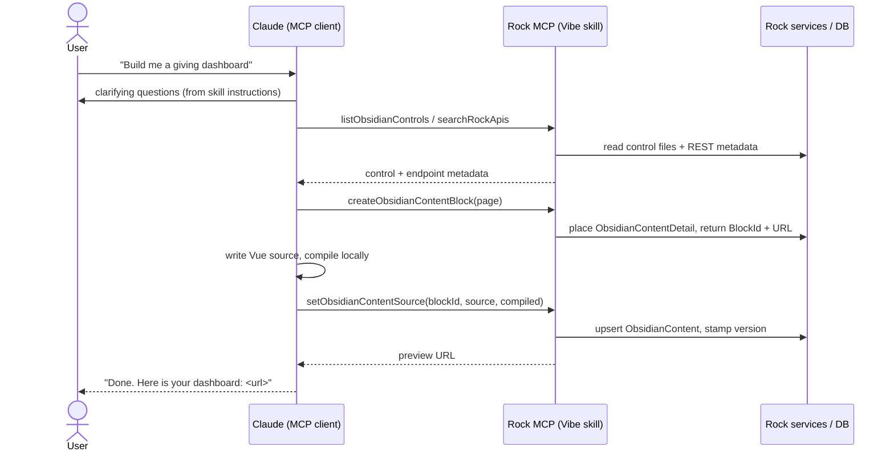

# MCP-driven Obsidian Content Vibe Coding

## Summary

The companion spec (`specs/260721-obsidian-content-block-and-component-model.md`) delivered a block that lets a trusted admin author Vue in place on a page, compiled in the admin's own browser and rendered to visitors as precompiled JavaScript. This spec proposes lifting that authoring loop out of the browser UI and exposing it through MCP, so an external AI client can perform the whole flow on the user's behalf.

The target experience: a user tells Claude "build me a giving dashboard," Claude asks a couple of clarifying questions, inspects Rock to learn which Obsidian controls and REST endpoints match the intent, creates an `ObsidianContentDetail` block on a page, writes the Vue source, compiles it, and saves it. The result renders on the page with no repository file and no full Rock build.

This is additive. It reuses the `ObsidianContent` model, the `ObsidianContentDetail` block, and the browser compile pipeline that already exist. What is new is a set of MCP tools (packaged as a Rock agent skill), a control/API discovery surface for the client to reason over, and a compile contract the client can reproduce.

## Motivation

Two things are true today. First, Rock already acts as an MCP server: agents expose skills as tools at `/api/v2/mcp/{slug}`, and the ChatAgent/skill runtime is the transport-agnostic execution layer (see `docs/ai/mcp-integration.md`). Second, the Obsidian Content block already turns author-written Vue into a live, framework-native component without a build.

Those two capabilities have not been connected. The Content block still requires a human to open the editor, know which controls exist, know which API to call, and hand-write the code. That is exactly the work an AI client is good at, and exactly the work MCP was added to enable. Connecting them turns "an admin who can code Vue" into "any admin who can describe what they want."

The payoff is disproportionate to the new surface: the model, block, and compiler are done. This spec is mostly about discovery (teaching the client what Rock offers) and orchestration (letting the client create and fill a block), not about new rendering technology.

## Requirements

Grouped by capability. MUST / SHOULD / MAY used where precision helps.

### Conversation and orchestration

- The client MUST be able to run the full loop from a single user intent: clarify, discover, create, write, compile, save.
- The clarifying-question behavior (asking what the user wants visually, what data, what layout) MUST live in the agent's skill instructions, not as a tool. The `instructions` field returned on MCP `initialize` is the right home (the Vibe Agent already returns instructions there).
- The client SHOULD be able to iterate: read the current source of a block it created and replace it.

### Discovery

- The client MUST be able to enumerate the Obsidian controls available for authoring by reading the control source files directly off the instance's file system, with enough of each file (name, import path, props, slots) to compose them correctly.
- The client MUST be able to find the Rock REST endpoints relevant to a data need (search by keyword or entity), returning route, verb, parameters, and response shape.
- Discovery results MUST reflect the running instance's version so the client does not compose against controls or endpoints that are not present.

### Authoring

- The client MUST be able to create an `ObsidianContentDetail` block placement and receive back its `BlockId` and a preview URL.
- The client MUST be able to set the source for a block it owns, optionally supplying precompiled output (see Compile model).
- The tool that sets source MUST validate any supplied compiled output without executing it: the `CompiledVueVersion` MUST match the running instance, and the payload MUST pass a structural shape check (parses as a `System.register` module). The server MUST NOT attempt to compile or run the module (no server-side JS engine). Compile-success is the client's responsibility; a module that slips through and fails to load is recovered by the compile-on-view fallback.

### Security

- Every authoring tool (create block, set source) MUST be gated behind the same authorization as the in-browser edit path: administrator only. Authored code runs in visitors' browsers as the visitor.
- The MCP request context MUST carry the acting person; authorization checks MUST use that person, not a service account.
- Discovery tools MAY be available to a broader authenticated audience, since they only read metadata.

## Proposed Approach

### The shape

A new agent skill, "Obsidian Vibe Coding," is attached to an MCP agent (the existing `vibe-agent` slug or a dedicated one). Its skill functions become MCP tools. Nothing about the transport changes; this rides the same `/api/v2/mcp/{slug}` endpoint and the same skill-to-tool mapping the Vibe Agent already uses.



### Tool surface

| Tool | Purpose | Auth |
|---|---|---|
| `listObsidianControls` | Read the control source files directly off the instance's file system and return what is found (name, `@Obsidian/...` path, and enough of the file to compose against). Supports an optional filter. | Authenticated |
| `getObsidianControl` | Return the relevant control source file(s) for one control so the client can read its props, slots, and usage directly. | Authenticated |
| `searchRockApis` | Find REST endpoints by keyword or entity; return verb, route, params, response shape. | Authenticated |
| `getObsidianCompiler` | Return the running instance's own compile pipeline (the Rock assembler logic from `obsidianContentCompiler.partial.ts` as runnable JavaScript, plus the pinned `@vue/compiler-sfc` version, or its bundle) and a short "how to run it" note, so the client produces byte-compatible, version-matched output. | Authenticated |
| `createObsidianContentBlock` | Place an `ObsidianContentDetail` block on a caller-supplied target page and zone. Return `BlockId` and preview URL. Does not create pages (see Open Questions). | Administrator |
| `getObsidianContentSource` | Read the current `Source` for a block, for iteration. | Administrator |
| `setObsidianContentSource` | Upsert `Source` and, optionally, `CompiledContent` + `CompiledVueVersion` for a block. Non-executing validation only (version match + structural shape). | Administrator |

### Compile model

The block renders precompiled SystemJS to visitors and confines the compiler (which needs eval) to the admin edit path. MCP has no browser, so the compiled output has to come from somewhere. This spec adopts a primary path and a fallback, and `setObsidianContentSource` supports both through one optional `compiled` argument.

**Primary: the client compiles with the server's own pipeline (Option 2).**
The MCP client produces `CompiledContent` itself and sends it alongside the source. The key move is that it does not source a compiler independently: the server hands the client its own pipeline through the `getObsidianCompiler` tool. That tool returns the Rock assembler logic (the `compileSource` code path from `obsidianContentDetail/obsidianContentCompiler.partial.ts`) as runnable JavaScript, plus the pinned `@vue/compiler-sfc` version the instance ships. The client runs the assembler over the source, produces the `System.register` module, and returns it. When `compiled` is present, the server applies its non-executing validation and stores it, and the content renders immediately for every visitor with no admin page-view and no server-side eval.

A feasibility review of the existing edit-path pipeline (see the resolution of open question #1) confirms this runs under a plain Node runtime with no browser shim: `@vue/compiler-sfc` is Node-native, and the assembler is pure string manipulation whose only `document` reference lives inside the generated output string (which runs later in the visitor's browser, not at compile time). Because the assembler and version pin both come from the running instance, output is byte-compatible and version-matched by construction; there is no separate package to publish and no way for the client to drift out of lockstep. `setObsidianContentSource` still rejects a `compiled` payload whose `CompiledVueVersion` does not match, as defense against a client that compiled against a cached or stale pipeline.

**Fallback: compile on next admin view (Option 1).**
When the client cannot compile (Claude Desktop, a phone, any client without a Node toolchain), it calls `setObsidianContentSource` with source only. The block gains one new behavior: in view mode, for an administrator, if `Source` is present but `CompiledContent` is missing or was compiled against a different Vue version, the block compiles in that admin's browser (the machinery is already there for edit mode) and caches the result back through the existing `SaveContent` action. From then on visitors get the cached output.

The net contract:

```
setObsidianContentSource(blockId, source, compiled?)
  compiled present  -> validate + store, live immediately            (Option 2)
  compiled absent   -> store source only; block self-activates on
                       the next administrator view                    (Option 1)
```

This keeps the server-side JS engine out of the design (the companion spec rejected it for good reasons), renders instantly whenever the client is capable, and still degrades to a working, if slightly delayed, result on any client.

### Discovery sources

Discovery is the largest new content problem; the rendering path is already solved.

- **Controls: read the file system directly.** For this prototype the control tools read the Obsidian control source files straight off the instance's file system (the framework `Controls/` directory) and return what they find. No build-time manifest, no curation step, no separate data to keep in sync; the source files are the source of truth. The client reads a control's `defineProps`, slots, and template to learn how to compose it. Caveat to resolve during implementation: this assumes the control source is present on disk, which holds in a development checkout; a deployed instance that ships only compiled output would need the manifest approach below, which is why it is kept as a future thought.
- **API catalog.** Rock already carries REST metadata (route attributes, `[ProducesResponse]`, controller GUIDs). `searchRockApis` reads that metadata and returns endpoint signatures. The same API-key or OAuth identity the MCP request carries governs what the authored component can actually call at runtime, so discovery and execution stay consistent.

**Future thought (control manifest).** A generated JSON manifest of controls (name and `@Obsidian/...` path, props from `defineProps`, slots, a one-line summary), produced at Obsidian build time, would let discovery work on instances that ship only compiled output and would give the client cleaner, smaller metadata than raw source files. Deferred: the direct file-system read is enough for the prototype, and a manifest is a build-pipeline addition better decided once the read-from-source approach has been exercised.

### Reused, unchanged

- `ObsidianContent` entity and service.
- `ObsidianContentDetail` block rendering (direct SystemJS module instantiation).
- The `@vue/compiler-sfc` pipeline and assembler (delivered to the client, same logic).

### How tools are implemented

Skills are code-based: a skill is an internal `AgentSkillComponent` subclass, and each tool is a C# method on it decorated with `SystemGuid.AgentToolGuidAttribute`. Every tool method receives an `AgentRequestContext` carrying `CurrentPerson`, a `RockContext`, and the `AudienceType`. Authorization for the admin-gated tools uses that `CurrentPerson`, exactly as the in-browser edit path gates on the current user. This is the extension point the new tools plug into; no new transport or controller work is required.

## Build Phases

This work sits on top of the companion spec's `ObsidianContent` model and `ObsidianContentDetail` block (assumed merged). Each phase is independently demonstrable.

### Phase 0 — Confirm the client compile (de-risking) — DONE (2026-07-22)

Verified. The `compileSource` assembler (ported verbatim from `obsidianContentCompiler.partial.ts`, logic unchanged) was run under Node v20 with `@vue/compiler-sfc@3.3.10` against a representative single-file component (template, `<script setup>`, `vue` and `@Obsidian/...` imports, and a `<style scoped>`). Results:

- **Compile ran with no DOM and produced a valid `System.register` module.** This is the only step the MCP client performs, and it passed cleanly. Output is deterministic and the compiler version matches Rock's bundle, so it equals the browser edit-path output for the same source.
- **Instantiating and rendering the module** (the block's view path, normally the browser) also succeeded headlessly: driving the setters with the real Vue runtime plus stub controls and calling Vue's SSR `renderToString` produced correct HTML with the scoped-style attribute applied.
- **The one DOM dependency appeared exactly where predicted:** the `document` call in the generated style-injection string, which executes in the visitor's browser during the view path, never during the client's compile. A trivial `document` stub satisfied the headless render.

The spike script (`scratchpad/phase0/run.cjs`) is the seed for the Phase 1 `getObsidianCompiler` deliverable: the assembler-as-runnable-JavaScript it contains is essentially what that tool must ship to the client.

### Phase 1 — Skill plus core authoring tools (end-to-end MVP)

- New `AgentSkillComponent` subclass (for example `ObsidianVibeCodingSkill`) with tool methods, each carrying an `[AgentToolGuid]`.
- `getObsidianCompiler`: returns the assembler JavaScript plus the pinned `@vue/compiler-sfc` version.
- `createObsidianContentBlock`: places an `ObsidianContentDetail` block on a caller-supplied page and zone via the block services; returns `BlockId` and preview URL. Gated to administrators via `AgentRequestContext.CurrentPerson`.
- `getObsidianContentSource` / `setObsidianContentSource`: read and upsert the `ObsidianContent` row by `BlockId` (reuse the service's get-or-create-by-block helper). `setObsidianContentSource` applies non-executing validation (version match plus structural shape) and overwrites `Source`.
- Author the skill instructions (the clarifying-question behavior), returned on MCP `initialize`.
- Proof: from an MCP client, create a block on an existing page, write source, compile client-side, save, and see it render for a visitor.

### Phase 2 — Discovery

- `listObsidianControls` / `getObsidianControl`: read the control source files directly off the framework `Controls/` directory.
- `searchRockApis`: query Rock's existing REST metadata and return endpoint signatures.
- Proof: the client composes a working dashboard from controls and endpoints it discovered, without the user naming them.

### Phase 3 — Fallback and iteration robustness

- Compile-on-next-admin-view: add the one new block behavior, in view mode for an administrator, compile and cache when `Source` is present but `CompiledContent` is missing or version-stale. This makes clients that cannot compile (Claude Desktop, mobile) still produce working content.
- Iteration ergonomics: round-trip edits via `getObsidianContentSource`, and surface compile or save errors back through the tool results.

### Future (not phased here)

Generated control manifest (for deploy-time discovery on instances shipping only compiled output), a separate page-creation skill, the MCP resource form of the compiler, a dedicated authoring agent, and source version history. Each is captured in Open Questions or the discovery-sources future thought.

## Open Questions

1. **Compiler delivery and client execution.** Resolved. The server delivers its own compile pipeline to the client via the `getObsidianCompiler` **tool**, so version-lock is free (no published package, no repo clone). The feasibility spike is closed: the edit-path pipeline (`obsidianContentDetail/obsidianContentCompiler.partial.ts` plus `@vue/compiler-sfc`) runs under a plain Node runtime with no browser shim, because the compiler is Node-native and the assembler is DOM-free at compile time (its only `document` use is emitted into the output string, executed later in the browser). Remaining follow-ups are minor implementation choices, not blockers: whether the tool ships the pinned `@vue/compiler-sfc` bundle or just its version identifier for the client to install, and (future thought) exposing the pipeline as an MCP **resource** (`rock://obsidian/compiler`) once Rock's MCP server advertises a `resources` capability (the current `initialize` handshake advertises only `tools`).
2. **Control discovery.** Resolved for the prototype: the tools read control source files directly off the file system (see Discovery sources). The generated control manifest is a future thought, needed mainly for deployed instances that ship only compiled output.
3. **Page placement.** Resolved: `createObsidianContentBlock` places the block on a caller-supplied page and zone; the user tells the client which page to use. It does not create pages. Future thought: if a user asks for a new page to be created, that belongs to a separate page-creation skill, not this authoring flow.
4. **Iteration and history.** Resolved: repeated `setObsidianContentSource` calls overwrite `Source`, matching the block's current behavior. Version history for rollback is deferred (Phase 4-shaped).
5. **Dedicated agent vs. reuse.** Deferred. Whether the Vibe Coding skill rides the existing `vibe-agent` or a dedicated authoring agent (isolating the admin-gated write tools) is a future decision, not needed to prove the flow.

## Considered but Rejected

### Headless server-side compile (Option 3)
Rejected for now. Having Rock compile the source on save (via a WASM compiler build or a Node sidecar) would be truly hands-off and would render instantly for any client, capable or not. But it reintroduces the in-process JavaScript engine Rock deliberately removed (ReactJS.NET via JavaScriptEngineSwitcher), which the companion spec already rejected, and it is the heaviest new infrastructure of the three. The client-compiles primary path plus the compile-on-view fallback covers the same ground without a server engine. Kept documented as the escape hatch if a genuinely zero-touch, any-client experience becomes a hard requirement.

### A brand-new MCP transport or endpoint for authoring
Rejected. The existing skill-to-tool mapping and `/api/v2/mcp/{slug}` endpoint already carry authenticated, per-person requests and expose skills as tools. Authoring is just more tools on that surface. A separate transport would duplicate auth, logging, and context handling for no benefit.

### Letting the client write compiled output with no validation at all
Rejected. Accepting a client-supplied `CompiledContent` with zero checks would let a version-mismatched or structurally broken module reach the store and fail to load for every visitor, with no clear error. The server cannot compile to verify (no JS engine, by design), so it applies the checks it can without executing: `CompiledVueVersion` must match the instance, and the payload must parse as a `System.register` module. That plus the compile-on-view fallback is the safety net; full compile-success remains the client's responsibility.

### Exposing authoring tools to any authenticated user
Rejected. Authored code runs in visitors' browsers with the visitor's own permissions and can call any API the visitor can. Creating blocks and writing that code must stay administrator-gated, matching the in-browser edit path. Only the read-only discovery tools may be offered more broadly.

## Related

- Companion spec: `specs/260721-obsidian-content-block-and-component-model.md` (the block, model, and browser compile pipeline this builds on).
- [docs/ai/mcp-integration.md](../docs/ai/mcp-integration.md) (how Rock exposes skills as MCP tools; the transport this rides).
- MCP endpoint: `Rock.Rest/v2/McpController.cs`. Server contract: `Rock/AI/Agent/Mcp/IMcpServer.cs`.
