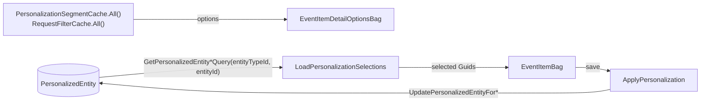
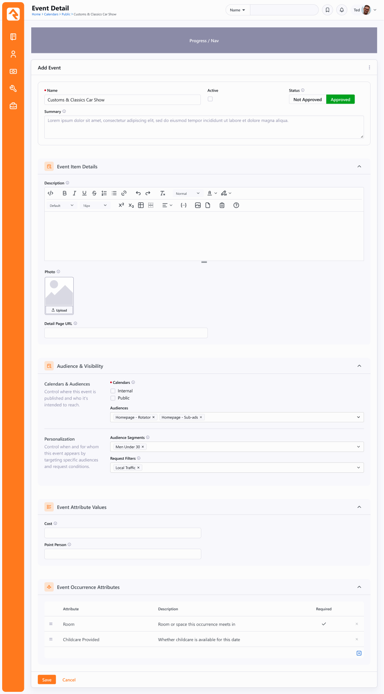
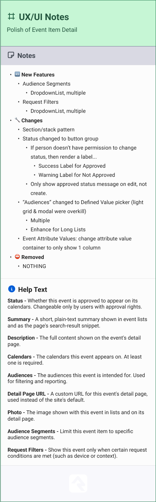

# Event Item Detail Polish + Personalization

## Summary

The `EventItemDetail` block ("Calendar Event Item Detail") has already been converted to Obsidian. This spec covers two pieces of work against that block: a visual and structural polish to match the new section/stack design, and a new capability to assign personalization Audience Segments and Request Filters to an event item. The personalization assignment reuses Rock's existing generic `PersonalizedEntity` link table and the `PersonalizationSegmentService` / `RequestFilterService` helpers, so it is a block and UI change with no schema migration. It follows the same pattern already implemented in `ContentChannelItemDetail`.

## Motivation

`EventItemDetail` was converted mechanically and never received a design pass, so it still uses the flat WebForms-era layout (a single `<fieldset>`, a light grid plus modal for audiences, a raw approval checkbox). The refreshed design brings it in line with the current Obsidian detail-block conventions.

Separately, the product team wants event items to participate in personalization the same way content channel items do, so that a future visitor-facing event block can surface events targeted to a person's segments or the current request context. This task adds the editing side of that: letting an administrator tag an event item with segments and request filters. The consuming/filtering side is intentionally deferred (see Out of Scope).

## Requirements

### Polish

- The edit form MUST adopt the section/stack layout from the design instead of the current single `<fieldset>`. Sections, in order:
  1. Top section (no header): Name, Active, Approval status, Summary.
  2. **Event Item Details**: Description (HTML editor), Photo (image uploader), Detail Page URL.
  3. **Audience & Visibility**: Calendars, Audiences, and a Personalization sub-stack (Audience Segments, Request Filters).
  4. **Event Attribute Values**.
  5. **Event Occurrence Attributes**.
- The **Approved** control MUST become a button group (Approved / Not Approved) rather than a checkbox.
- When the current person does not have permission to change approval, the control MUST render as a read-only label instead of the button group: a success-styled label for Approved and a warning-styled label for Not Approved.
- The approval status message ("Approved at {time} on {date} by {name}.") MUST show only when editing an existing event item, never when creating a new one.
- **Audiences** MUST become a multi-select Defined Value picker with enhance-for-long-lists enabled, replacing the current light grid plus "Select Audience" modal.
- The **Event Attribute Values** container MUST render in a single column (currently two).
- No existing fields or capabilities are removed.
- Every field MUST carry the help text specified in the design handoff notes (see Related).

### Personalization

- The **Audience & Visibility** section MUST include a Personalization sub-section with two controls: **Audience Segments** and **Request Filters**, each a multi-select dropdown.
- Audience Segments options MUST come from `PersonalizationSegmentCache.All()`; Request Filters options from `RequestFilterCache.All()`.
- Selecting segments/filters and saving MUST persist the associations to the `PersonalizedEntity` table keyed to the EventItem's EntityType and Id.
- Editing an existing event item MUST load and display its currently assigned segments and filters.
- The Personalization sub-section is always shown (no gating flag). See Considered but Rejected.

## Design

### Reference implementation

`Rock.Blocks/Cms/ContentChannelItemDetail.cs` already implements this exact assignment pattern. The three methods to mirror:

- `BuildPersonalizationOptions` — fills the options bag from `PersonalizationSegmentCache.All()` and `RequestFilterCache.All()`, ordered by name, via `.ToListItemBagList()`.
- `LoadPersonalizationSelections` — reads current selections with `PersonalizationSegmentService.GetPersonalizedEntitySegmentQuery(entityTypeId, entityId)` and `RequestFilterService.GetPersonalizedEntityRequestFilterQuery(entityTypeId, entityId)`, mapping the resulting `PersonalizationEntityId`s to Guids via the caches.
- `ApplyPersonalization` — maps selected Guids back to Ids (`PersonalizationSegmentCache.Get(guid)?.Id`, `RequestFilterCache.Get(guid)?.Id`) and calls `PersonalizationSegmentService.UpdatePersonalizedEntityForSegments(entityTypeId, entityId, segmentIds)` and `RequestFilterService.UpdatePersonalizedEntityForRequestFilters(entityTypeId, entityId, requestFilterIds)`, both of which do a diff-based delete/insert.

For `EventItemDetail`, `entityTypeId` is `EntityTypeCache.Get<EventItem>().Id` and `entityId` is `entity.Id`.

### Data flow

`PersonalizedEntity` (`Rock/Model/CRM/PersonalizedEntity/PersonalizedEntity.cs`) has a composite key of `EntityTypeId + EntityId + PersonalizationType + PersonalizationEntityId`. `EntityId` is the EventItem Id (not a hard FK), and `PersonalizationEntityId` is a loose FK to either `PersonalizationSegment.Id` or `RequestFilter.Id`, disambiguated by `PersonalizationType` (`Segment` / `RequestFilter`, from `Rock.Enums/Crm/PersonalizationType.cs`). Nothing about the table is content-channel-specific, so EventItem reuses it as-is.

### Bag and block changes

`Rock.ViewModels/Blocks/Event/EventItemDetail/EventItemBag.cs`:
- Add `List<Guid> SelectedSegmentGuids` (selected segments).
- Add `List<Guid> SelectedRequestFilterGuids` (selected request filters).
- Add `bool IsApprovalConfigurable` so the client knows whether to render the approval button group or the read-only label. Set from `IsAuthorizedToApprove(rockContext)`.
- Selections are stored as Guid lists (not `ListItemBag`): the names come from the option lists, and the Guid lists bind directly to the multi-select controls. The `ContentChannelItemDetail` reference types these as `string`, but Rock's convention is to type Guid fields as `Guid` (Obsidian's `Guid` is a `string` alias, so the control binding is unaffected). The View Panel does not display personalization, so no names are needed on the selection fields.

`Rock.ViewModels/Blocks/Event/EventItemDetail/EventItemDetailOptionsBag.cs`:
- Add `List<ListItemBag> SegmentOptions`.
- Add `List<ListItemBag> RequestFilterOptions`.

`Rock.Blocks/Event/EventItemDetail.cs`:
- Populate the two new option lists in the options-bag builder.
- Set `IsApprovalConfigurable = IsAuthorizedToApprove(rockContext)` in `GetCommonEntityBag` (a cheap auth check needed wherever approval is shown).
- Load current segment/filter selections in `GetEntityBagForEdit` only, via a `LoadPersonalizationSelections` helper that mirrors the reference block (ids from the DB, Guids from cache). The View Panel does not display personalization, so there is no reason to run those queries for view mode.
- In `Save`, call an `ApplyPersonalization` helper after the `WrapTransaction` block, once the entity has a valid Id. It maps the selected Guids to ids via the caches and calls `UpdatePersonalizedEntityForSegments` / `UpdatePersonalizedEntityForRequestFilters` (each guarded by `box.IfValidProperty`). These run outside the transaction because they manage their own `SaveChanges`/`BulkDelete`.
- The existing approval message logic in `GetEntityBagForEdit` (lines 378-387) already sets `ApprovalText` only for existing, approved items; keep that gate and surface the approval permission via the new bag flag.

`Rock.JavaScript.Obsidian.Blocks/src/Event/EventItemDetail/editPanel.partial.obs`:
- Restructure the template into `Section` / section-stack components per the design.
- Replace the audiences `Grid` + `Modal` with a single multi-select Defined Value picker bound to `availableAudiences`.
- Replace the approval `CheckBox` with a button group when `isApprovalConfigurable`, otherwise a status label.
- Add the two personalization multi-select dropdowns bound to the new option lists.
- Change `AttributeValuesContainer` `:numberOfColumns` from `2` to `1`.
- Follow the Obsidian region ordering and prop conventions in `.claude/rules/obsidian-conventions.md`.

The read-only view panel (`viewPanel.partial.obs`) receives light polish to match the "View Panel - NEW" design frame; personalization is an edit-only concern and does not need to appear in the view panel unless the design calls for it.

### Design reference

The edit-form target layout:

The UX/UI handoff notes and per-field help text:

## Open Questions

- Should the read-only **View Panel** display the assigned segments/filters, or is personalization purely an edit-mode concern? The design's View Panel frame does not show them, so the current plan omits them from view mode. Confirm with PO.

## Considered but Rejected

### Gate the Personalization section behind an EnablePersonalization flag
Rejected for this task. `ContentChannel` gates personalization behind `ContentChannel.EnablePersonalization`, but `EventCalendar` / `EventItem` has no equivalent flag, and the design shows the Personalization controls always visible. Adding a calendar-level flag would be a schema change and a larger scope than the polish warrants. The section is always shown.

### Add a block setting to show/hide Personalization
Rejected. Same reasoning: the design shows it always visible, and an admin-only edit form has little need to hide the controls. Revisit only if a partner asks to suppress them.

### New EventItem-specific personalization tables
Rejected. `PersonalizedEntity` is already generic (`EntityTypeId + EntityId`), so EventItem attaches to it with zero schema changes. New tables would duplicate an existing, working mechanism.

## Out of Scope

- **Consuming the tags.** No existing event block reads `PersonalizedEntity` rows to filter what a visitor sees (the way `ContentChannelView` does for content). This spec only stores the assignments; a visitor-facing event block that prioritizes or filters events by the current person's segments and request filters is separate, future work.
- **Adding `EnablePersonalization` to `EventCalendar`.**
- **Populating segment membership.** Which people belong to which segment is computed offline by the `UpdatePersonalizationData` job and is unaffected by this change.
- **Converting or building any public-facing event occurrence block** (e.g. `EventItemOccurrenceLava`), which remains WebForms.

## Related

- Asana task: [Event Item Detail Block Polish + Personalization](https://app.asana.com/1/20866866924293/project/1208321217019996/task/1216532109135318) (DEV-14333, v20, goal 12h / approved 16h).
- Figma design: [Block Refreshes 2026, Event Item Detail](https://www.figma.com/design/NaWChI9eBIODhRxVW7pudi/Block-Refreshes--2026-?node-id=491-8630) (handoff completed 2026-07-15 by Joel Nevius, treated as canonical).
- Design and handoff notes captured locally (embedded below).
- Target block: `Rock.Blocks/Event/EventItemDetail.cs`, `Rock.JavaScript.Obsidian.Blocks/src/Event/EventItemDetail/editPanel.partial.obs`, `Rock.JavaScript.Obsidian.Blocks/src/Event/EventItemDetail/viewPanel.partial.obs`.
- Reference implementation: `Rock.Blocks/Cms/ContentChannelItemDetail.cs` (`BuildPersonalizationOptions`, `LoadPersonalizationSelections`, `ApplyPersonalization`).
- Personalization services: `Rock/Model/CMS/PersonalizationSegment/PersonalizationSegmentService.cs`, `Rock/Model/CMS/RequestFilter/RequestFilterService.cs`; link table `Rock/Model/CRM/PersonalizedEntity/PersonalizedEntity.cs`.
- Note on the task text: the description mentions "a public-facing event detail page" and "the Content Channel Item block," but the Figma and target block are the admin `EventItemDetail` editor, and the reusable assignment pattern lives in `ContentChannelItemDetail`. The Figma is authoritative for the target.
