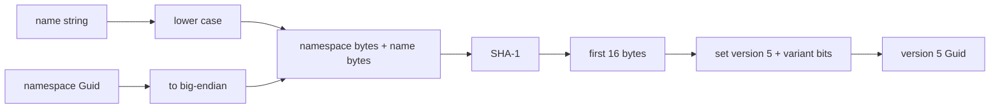

# Lava ToGuidV5 Filter

## Summary

Rock needs a way to publish a stable, non-reversible stand-in for a well-known Guid. This spec covers a new `ToGuidV5` Lava filter plus the `ToGuidV5` string extension method behind it, both of which produce an RFC 4122 version 5 (name-based, SHA-1) Guid from a name and a namespace Guid.

The output is deterministic: the same name and namespace always yield the same Guid. That is the point, since the hashed value has to be a usable identifier across requests and systems, not a random value.

The filter is intentionally left out of the community Lava documentation. That is a documentation decision only: the filter is registered globally like every other Lava filter and carries no technical restriction on who may call it.

## Motivation

The Rock Community Knowledge Base needs to identify a submitting organization without exposing that organization's actual Guid. The organization Guid is a well-known internal value; publishing it in a URL, a form payload, or a rendered page would leak it to anyone who looks.

Hashing it solves this. The Knowledge Base receives a value that is stable per organization (so submissions can be grouped, counted, and correlated over time) while the original Guid stays internal.

A version 5 Guid is the right shape for this because it is deterministic, it is already a Guid so it fits everywhere a Guid fits, and the namespace parameter lets the same source value produce different outputs in different contexts.

## Requirements

- The filter MUST accept a name string and a namespace Guid, and MUST return a version 5 Guid derived from both.
- The result MUST be deterministic. The same name and namespace MUST always produce the same Guid.
- The result MUST carry version 5 in the `time_hi_and_version` field and the RFC 4122 variant bits in `clock_seq_hi_and_reserved`.
- Casing MUST NOT affect the result. A Guid string supplied in upper, lower, or mixed case MUST produce the same output.
- The same name and namespace MUST produce the same Guid whether invoked from Lava or from C#.
- A null or whitespace input SHOULD return null, so a template renders nothing rather than a misleading value.
- A missing or malformed namespace MUST raise an error rather than returning a Guid.
- The filter MUST NOT be added to the community Lava documentation.

## Design

Two pieces, split so the hashing primitive is reusable outside Lava.

**Extension method**, `Rock.Common/ExtensionMethods/StringExtensions.cs:1311`:

```csharp
public static Guid ToGuidV5( this string str, Guid namespaceGuid )
```

Placed next to `AsGuid` and `AsGuidOrNull`, where the other Guid string helpers already live. It handles the byte-order mismatch that makes this algorithm easy to get wrong: RFC 4122 hashes the namespace in big-endian order, but .NET's `Guid.ToByteArray()` returns the first three fields little-endian. The implementation converts on the way in and back on the way out using `IPAddress.HostToNetworkOrder` and `IPAddress.NetworkToHostOrder`. SHA-1 is created through the file's existing `#if NET9_0_OR_GREATER` pattern inside a `using` block, matching `Sha1Hash` and `Sha256Hash`.

**Lava filter**, `Rock/Lava/Filters/LavaFilters.Identifiers.cs:61`:

```csharp
public static object ToGuidV5( object input, string namespaceGuid )
```

Placed alongside `GuidToId` since both deal in identifier translation. Usage:

```liquid

```

The namespace is supplied by the Lava author as the filter argument. It is deliberately a parameter rather than a system setting or a constant baked into the filter, so the same source value can be scoped differently per use: the Knowledge Base can use one namespace while some future consumer uses another, and neither can derive the other's hashes. The trade-off is that the namespace lives in template source; see Security Considerations.



### Casing is normalized in the primitive, not the filter

The name is lower-cased with `ToLowerInvariant` before hashing (`Rock.Common/ExtensionMethods/StringExtensions.cs:1327`). This matters because the intended input is a Guid string, and Guid strings arrive in inconsistent casing depending on where they came from: `Guid.ToString()` yields lower case, while SQL Server and several admin screens yield upper case. Without normalization the same organization would hash to two different values depending on which path produced the string.

Normalization lives in the extension method rather than only in the filter because the organization Guid may be hashed from either Lava or C#. Putting it in the filter alone would let the two paths disagree, which would be a difficult bug to notice: both values look like valid Guids.

This is a deliberate deviation from canonical RFC 4122, which hashes the name bytes exactly as supplied. The practical consequence is that results match other version 5 implementations (Python's `uuid5`, for example) only when the name is already lower case. A test pins the deviation explicitly so it is discovered by reading the tests rather than during an interop attempt.

Only casing is normalized. A value wrapped in braces, or one with its hyphens stripped, is still a different name and produces a different Guid. Callers are responsible for supplying a consistently formatted value.

### Error behavior

Null or whitespace input returns null, which renders as an empty string. This matches `AsGuid`, which returns nothing for input it cannot use.

A missing or malformed namespace throws `LavaElementRenderException` with "Invalid Namespace Guid Value", matching the `GuidToId` precedent in the same file. Failing loudly is the right call here: an empty or garbage namespace would still hash to a structurally valid Guid, so a silent fallback would emit a plausible-looking but meaningless identifier that could be stored and depended on before anyone noticed.

### Documentation status, and what it does not mean

The filter is undocumented by intent, and its XML remarks say so. The precedent is `AddToMergeFields`, described as "an undocumented internal filter" at `Rock/Lava/Filters/LavaFilters.cs:2547`. Leaving it unpublished while the behavior settles avoids committing to a public API we may want to change.

Being undocumented is the only constraint. There is no technical limitation on how or where the filter may be used:

- Rock has no per-filter security, enablement, or allowlist mechanism. `EnabledLavaCommands` gates commands and shortcodes, not filters.
- Filters are registered wholesale from the `LavaFilters` type, so `ToGuidV5` is available in every Lava context alongside every other filter, with no opt-in.
- Any template author who knows the name can call it, and it will work.

The practical implication is that "undocumented" should not be mistaken for "protected". It reduces discoverability, nothing more. In particular, it provides no additional protection for the hashed value; see Security Considerations.

## Security Considerations

This is a hash, not encryption, and the spec should be explicit about what that does and does not buy.

It prevents casual disclosure. A reader of a Knowledge Base page or URL cannot read the organization Guid out of the hashed value, and there is no key to recover it with.

It does not make the original value secret. Anyone who knows the namespace and holds a candidate Guid can hash that candidate and compare, confirming or ruling out a match. Because the population of organization Guids is finite and partially discoverable, an attacker with a list of candidate Guids and the namespace could map hashes back to organizations.

The namespace is what gates that attack, and by design it is supplied by the Lava author as the filter argument, which means it lives in template source. This sets the actual boundary:

- **Protected:** anyone who only sees rendered output. They get a Guid with no way to reverse it and no namespace to test candidates against.
- **Not protected:** anyone who can read the template. They obtain the namespace, and with a list of candidate organization Guids they can hash each one and match. Template read access is therefore equivalent to being able to unmask any hash produced by that template.

This is an acceptable trade for the Knowledge Base use case, where the value is being shielded from external readers rather than from Rock administrators. It is worth stating plainly so nobody extends the filter to a scenario where the template audience and the audience being shielded overlap.

The practical guidance: treat the output as obfuscation, not as a security boundary, and do not rely on it to protect anything that would actually be damaging to disclose.

## Verification

Correctness was confirmed against published RFC 4122 version 5 test vectors rather than against the implementation's own output, since a self-consistent test would pass even with the byte order reversed. Using the standard DNS namespace `6ba7b810-9dad-11d1-80b4-00c04fd430c8`:

| Name | Expected version 5 Guid |
|------|-------------------------|
| `python.org` | `886313e1-3b8a-5372-9b90-0c9aee199e5d` |
| `www.example.com` | `2ed6657d-e927-568b-95e1-2665a8aea6a2` |

Both names are already lower case, so the casing normalization does not affect them and the vectors remain valid tests of the hashing and byte-order logic.

The deviation from canonical RFC 4122 is pinned separately: the mixed-case name `Python.org` canonically hashes to `cb620f2d-413b-52b6-a026-e87bac9b6f47`, and the test asserts that our result differs from that and instead equals the result for `python.org`.

Coverage is 21 tests total:

- 13 in `Rock.Tests/Utility/ExtensionMethods/StringExtensionsTests.cs` (a new `ToGuidV5` region) covering the known vectors, determinism, version and variant bits, namespace and name isolation, case insensitivity, the canonical deviation, formatting sensitivity, and empty input.
- 8 in `Rock.Tests/Lava/Filters/IdentifierFilterTests.cs` covering the same behavior through the Lava engine, including mixed-case input, mixed-case namespace, empty input, and the invalid-namespace error.

These run as plain unit tests rather than integration tests because the filter touches no database. `Rock.Tests/Lava/LavaTestHelper.cs:314` already registers `Rock.Lava.LavaFilters`, so the filter is exercised through a real engine without a Rock instance.

## Considered but Rejected

### Normalize casing only in the Lava filter
Rejected. It would keep `ToGuidV5` a faithful RFC 4122 implementation, which is appealing for a general-purpose primitive. But the organization Guid may be hashed from C# as well as from Lava, and the two paths would then disagree for any mixed-case input. Two valid-looking Guids that should match but do not is a worse outcome than deviating from the RFC, so normalization went into the shared primitive.

### Keep the implementation canonically case-sensitive
Rejected. It is the standards-correct behavior, but it makes the primary use case fragile: whether an organization hashes correctly would depend on whether its Guid happened to pass through `ToString()` or through SQL. The deviation is documented in the method remarks and pinned by a test, which is a better trade than a correctness footgun.

### Encrypt the Guid instead of hashing it
Rejected. Encryption is reversible, which is not wanted here, and it would require key management and produce a value that is not a Guid. The requirement is a stable opaque identifier, not a recoverable one.

### Normalize formatting as well as casing
Rejected for now. Parsing the input as a Guid and re-formatting it would make braces and missing hyphens equivalent too. It would also change the method from "hash any name" to "hash a Guid", narrowing it, and would raise the question of what to do with input that is not a Guid at all. Callers supplying a consistent format is a reasonable expectation; this can be revisited if it proves to be a real source of mistakes.

### Document the private-filter convention in docs/lava/writing-filters.md
Rejected for this change. That guide lists `Rock/Lava/Filters/LavaFilters.Identifiers.cs` in its `related_files` and has no convention recorded for marking a filter private or undocumented, so it is the natural home for one. Decided against adding it now to keep this change focused; the convention currently has to be inferred from the `AddToMergeFields` precedent. Worth revisiting if a third private filter appears.

## Related

- [RFC 4122 Section 4.1.3](https://datatracker.ietf.org/doc/html/rfc4122#section-4.1.3), the version field definition this implementation stamps. Referenced as a standards document, not a project requirements source.
- `Rock/Lava/Filters/LavaFilters.cs:2547`, the `AddToMergeFields` precedent for an intentionally undocumented filter.
- `Rock.Lava.Fluid/FluidEngine.cs:474`, where a filter's Lava name is derived from its method name.
- [docs/lava/writing-filters.md](../docs/lava/writing-filters.md), the internal guide for authoring filters. Not updated by this change; see Considered but Rejected.
