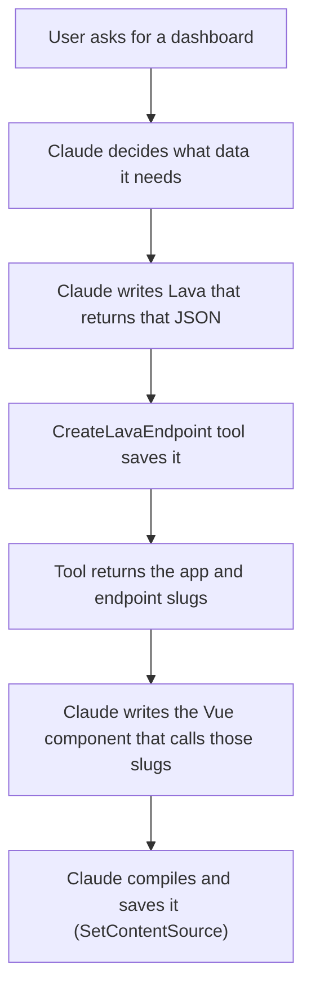
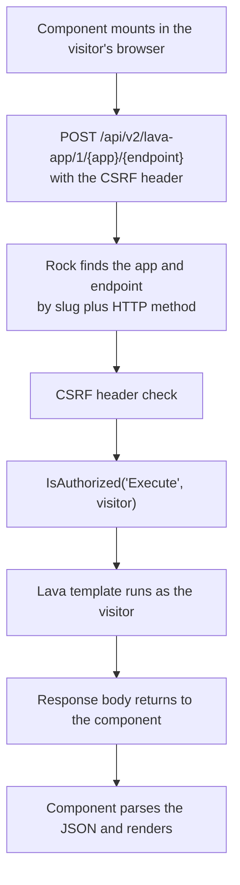

# Lava Endpoint Data for Obsidian Content

## Summary

Today an Obsidian Content block that needs data has to call an existing Rock REST endpoint, which means Claude must first find the right one. That is [step 3 of the MCP flow](../docs/cms/obsidian-content.md), and it is unbuilt: Claude only manages it by reading the Rock repo off disk.

This proposes skipping the search. A new MCP tool creates a **Lava endpoint** that returns exactly the JSON the component needs. The component then calls that one endpoint, in a shape that feels like calling a block action.

Claude writes the data query instead of finding it. Rock already has the endpoint infrastructure, so this is mostly wiring.

## Why

API discovery is the worst-shaped problem in the current flow:

- Rock has hundreds of endpoints across three generations (`v2/Controls`, `v2/Models`, v1).
- Almost none of them return the shape a specific dashboard wants, so the component has to fetch and reshape client-side.
- Endpoint permissions are separate from page permissions, so an endpoint that works for the admin who authored the dashboard can return 401 for a normal member. That failure appears in nobody's testing.

Writing Lava avoids all three. One endpoint, one purpose, shape controlled by the author, permissions set at creation time.

## The Flow

### Authoring



### Runtime, every page view



---

### Step 1: Claude decides the data shape

The component drives this, not the database. If the dashboard shows a giving total, three recent gifts, and a campus name, that is the shape. Claude writes the JSON contract first, then writes Lava to produce it.

This is the real gain over REST discovery. There is no negotiation between "what the component wants" and "what some existing endpoint happens to return."

### Step 2: Claude writes the Lava

Ordinary Lava with an entity command or ``, producing JSON. Nothing new here, and Claude is good at it.

The important constraint is that **the endpoint runs as whoever views the page**, so the Lava must be written for the least-privileged viewer. Entity commands respect that person's permissions. This is the same rule as the current REST path, just easier to reason about because there is one endpoint to think about.

### Step 3: `CreateLavaEndpoint` saves it

New MCP tool. A `LavaEndpoint` row needs:

| Field | What Claude sets |
|---|---|
| `LavaApplicationId` | The block's own application (see [One Application per Block](#one-application-per-block)) |
| `Slug` | The endpoint name in the URL |
| `HttpMethod` | `Get` or `Post` |
| `CodeTemplate` | The Lava |
| `SecurityMode` | `EndpointExecute`, or one of the three application-level modes |
| `EnabledLavaCommands` | Whatever the template needs |
| `CacheControlHeaderSettings` | Optional caching |
| `RateLimit*` | Optional throttling |
| `AdditionalSettingsJson` | Holds the CSRF flag, which defaults to on |

The tool returns the application slug and endpoint slug. Those two strings are the whole contract the component needs.

Administrator-gated, matching the existing authoring tools. That grants nothing beyond what the Lava Endpoint Detail block already gives an admin, including `` in `EnabledLavaCommands`.

**Endpoints are keyed by slug plus method.** A `GET` and a `POST` at the same slug are two different rows. Worth knowing before Claude writes two tools' worth of confusion.

### Step 4: Claude writes the component

The component calls its endpoints. The PO's framing was "like invoking a block action," and that is the right target, but it needs a small helper to actually feel that way. Raw, one call is:

```js
const response = await doApiCall("POST", "/api/v2/lava-app/1/giving-dashboard/summary",
    undefined, { campusId: 3 },
    { headers: { "X-Helix-CSRF-Protection": "true" } });
```

Three things there are easy to get wrong: the `1/` version segment, the CSRF header, and the response type. Repeat them across four endpoints and the odds of getting all four right drop fast.

The `useLavaApp` helper (see [The Helper](#the-helper)) binds the application once and takes endpoint names after that:

```js
import { useLavaApp } from "@Obsidian/Utility/lavaApp";

const lavaApp = useLavaApp("giving-dashboard");

const summary = await lavaApp.invoke("summary");
const gifts = await lavaApp.invoke("recent-gifts", { count: 5 });
```

`invoke` returns the same `isSuccess` / `data` / `errorMessage` shape as `invokeBlockAction`, so the block-action framing is literal rather than an analogy.

### Step 5: Rock runs it

Read from [LavaAppController.cs](../Rock.Rest/v2/LavaAppController.cs), in order:

1. **Find the app** by slug. Must exist and be active, else 404.
2. **Find the endpoint** by slug and HTTP method. Must exist and be active, else 404.
3. **CSRF check.** If the endpoint has protection on (the default), the request must carry `X-Helix-CSRF-Protection` set to a truthy value, else 401.
4. **Authorization.** `LavaEndpoint.IsAuthorized("Execute", currentPerson)`. `SecurityMode` decides whether that means the endpoint's own Execute right or the application's View, Edit, or Administrate right.
5. **Run the Lava**, with the request, query string, body, and current person available as merge fields.
6. **Return the body**, plus a `Cache-Control` header if the endpoint configures one.

## One Application per Block

A dashboard almost never needs one endpoint. A giving dashboard plausibly wants summary totals, a recent-gifts list, a campus breakdown, and a POST to re-filter. That is four.

[Lava Applications](https://community.rockrms.com/developer/helix/lava-applications) are the container built for exactly this. An application groups related endpoints, and the route is the application slug plus the endpoint slug. So a block's endpoints sit together:

```
/api/v2/lava-app/1/giving-dashboard/summary
/api/v2/lava-app/1/giving-dashboard/recent-gifts
/api/v2/lava-app/1/giving-dashboard/campus-breakdown
```

**One application per Obsidian Content block** is the right unit. Four reasons, all mechanical rather than stylistic:

1. **Security is set once.** `LavaEndpointSecurityMode` includes `ApplicationView`, `ApplicationEdit`, and `ApplicationAdministrate`, so an endpoint can defer authorization to its application. Decide who may see the dashboard's data one time, on the app, rather than repeating it on every endpoint and getting one of them wrong.

2. **Shared configuration comes free.** The controller injects the application's `ConfigurationRigging` as a merge field into every endpoint it runs. Account ids, a date window, a campus filter: they live once at the application level instead of being copy-pasted into four templates that then drift apart.

3. **Cleanup is automatic.** `LavaEndpoint`'s foreign key to `LavaApplication` is `WillCascadeOnDelete( true )`. Delete the application and its endpoints go with it. That shrinks the sprawl problem below from "track N orphaned endpoints" to "delete one application."

4. **The client helper binds once.** This is what actually delivers the block-action feel:

```js
const lavaApp = useLavaApp("giving-dashboard");

const summary = await lavaApp.invoke("summary");
const gifts = await lavaApp.invoke("recent-gifts", { count: 5 });
```

One slug configured at the top, then endpoint names at each call site. Compare that to repeating the full route, the version segment, and the CSRF header four times.

### What this changes

Step 3 of the flow becomes two tools instead of one: create the application once, then create each endpoint under it. Either a separate `CreateLavaApplication`, or `CreateLavaEndpoint` creates-or-reuses an application by slug. The second is fewer round trips and fewer ways for Claude to half-finish the job.

One caveat: an application is a real CMS object that appears in the admin Lava Applications list, so the list grows by one per dashboard. That is acceptable, arguably good since it makes authored content discoverable, but it means the tool must name applications after the dashboard rather than generating something opaque.

**Endpoints are keyed by slug plus HTTP method,** so `GET summary` and `POST summary` are two different endpoints under the same route. Useful deliberately, confusing accidentally.

## The Helper

Calling an endpoint raw means getting the `1/` route segment, the CSRF header, and the response parsing right, every time, for every endpoint. `useLavaApp` does it once.

**Decided: it ships as a framework file** at `Rock.JavaScript.Obsidian/Framework/Utility/lavaApp.ts`, which the Obsidian build bundles into `/Obsidian/Utility.js` and the alias map exposes as `@Obsidian/Utility/lavaApp`.

The rejected alternative was to skip the framework entirely and have the skill instructions teach Claude to write a local copy in every component. That works today with no framework change, since `@Obsidian/Utility/http` is already importable, and it adds nothing to maintain.

It loses on one asymmetry: **compiled modules are frozen in the database.** An imported helper resolves against whatever the framework ships at render time, so correcting the route or the header name fixes every existing dashboard with no recompile. Inlined boilerplate bakes the mistake into every stored module, and each dashboard has to be re-authored by hand.

The cost accepted: permanent public framework surface, added for a feature that has not merged, landing in the Utility bundle every Obsidian page downloads. Acceptable because the helper is small and because any repo block might want to call a Lava endpoint too, so it is not single-purpose.

```ts
/** A bound Lava application that can invoke its endpoints by name. */
export type LavaApp = {
    invoke: <T>( endpointSlug: string, data?: Record<string, unknown>, options?: LavaAppInvokeOptions ) => Promise<HttpResult<T>>;
};

export function useLavaApp( applicationSlug: string ): LavaApp;
```

Three notes on the implementation:

- **Returns `HttpResult<T>`**, the same shape `invokeBlockAction` returns, so authored code checks `isSuccess` and reads `data` exactly as a block does.
- **Method is per call**, defaulting to `POST`. Endpoints are keyed by slug *and* method, so the option selects which endpoint is being addressed, not just how.
- **Coerces a string body to JSON.** Needed only until the content-type change below lands, then harmless for older endpoints that still return `text/html`.

## JSON Output (server change, in scope)

Lava endpoints cannot currently return JSON properly. [LavaAppController.ProcessEndpoint](../Rock.Rest/v2/LavaAppController.cs) hardcodes the content type:

```csharp
responseMessage.Content = new StringContent( context.EndpointResponse.Content, Encoding.UTF8, "text/html" );
```

There is no content-type field on `LavaEndpoint` at all, so a template that emits JSON returns it labeled as HTML. For an endpoint whose entire job is feeding data to a component, that is backwards. This proposal includes fixing it.

### The change

`LavaEndpoint` already has an `AdditionalSettingsJson` column, and [LavaEndpointAdditionalSettings](../Rock/Cms/LavaEndpointAdditionalSettings.cs) currently holds one property. Adding the content type there needs **no migration**, and it matches Rock's rule to persist configuration as JSON rather than adding columns for it.

| File | Change |
|---|---|
| `Rock/Cms/LavaEndpointAdditionalSettings.cs` | Add `ContentType`, defaulting to `text/html`. |
| `Rock/Web/Cache/Entities/LavaEndpointCache.cs` | Surface it, alongside `EnableCrossSiteForgeryProtection`. |
| `Rock.Rest/v2/LavaAppController.cs` | Use it when building the `StringContent` instead of the hardcoded literal. |
| `Rock.ViewModels/Blocks/Cms/LavaEndpointDetail/LavaEndpointBag.cs` | Add the field. |
| `Rock.Blocks/Cms/LavaEndpointDetail.cs` and its edit panel | Let a human set it. |

Defaulting to `text/html` means every existing endpoint behaves exactly as it does today. `CreateLavaEndpoint` sets `application/json` for the endpoints it creates, since that is their whole purpose.

A real column was considered and rejected: it needs a migration, and the settings blob exists for precisely this kind of configuration. Revisit only if the content type ever needs to be queryable.

### The second half: non-200 responses discard the body

Right after running the Lava, the controller does this:

```csharp
if ( HttpContext.Current?.Response.StatusCode != 200 )
{
    content = $"Endpoint returned status of {HttpContext.Current?.Response.StatusCode}.";
    context.EndpointResponse.ResponseStatus = ( HttpStatusCode ) HttpContext.Current?.Response.StatusCode;
}
```

Any non-200 status **throws the body away** and replaces it with that sentence. So an endpoint cannot return a JSON error: `` with a JSON body gives the caller plain prose instead.

A data API needs to return structured errors, so this has to change with the content-type work. The status code should still be honored; the body the template produced should survive it.

Without this half, the component can only distinguish success from failure by status code, and gets no error detail to show the user. That pushes authored components toward reporting every failure as a generic "could not load data."

## What Rock Already Gives Us

Most of the hard parts exist:

- **Per-endpoint security** through standard `ISecured`, with four modes.
- **Rate limiting**, per endpoint, requests per period.
- **Cache-Control headers**, per endpoint.
- **CSRF protection**, on by default.
- **Observability**, with the endpoint and application named on the trace.
- **An admin UI**, so a human can inspect or fix anything Claude created.

That last one matters more than it looks. An MCP-created endpoint is not a black box. It shows up in the Lava Endpoint list like any other.

## Inherited, Not In Scope

Two characteristics come along with Lava Applications and are not made worse here. A human consuming an endpoint from an HTML Content block has both today:

- **Orphaned applications.** Nothing links an application to whatever consumes it, so deleting the consumer leaves the application behind.
- **Contract drift.** The producer and consumer are separate records that do not know about each other, so changing the endpoint's output shape breaks the caller silently.

Worth fixing in Lava Applications generally, if anyone cares to. Not this spec's job.

## What It Entails

| Piece | Size |
|---|---|
| Configurable content type, so endpoints can return JSON | Small. Settings-blob property plus five touch points, no migration. |
| Keep the body on non-200 responses | Small, but it is what makes structured errors possible. |
| `CreateLavaEndpoint` MCP tool, creating or reusing the block's application by slug | Small. Standard entity create through `LavaApplicationService` and `LavaEndpointService`. |
| Test-execute on create, so Claude sees the result before saving | Small. Keeps Claude in the loop instead of shipping blind. |
| `useLavaApp` framework utility (`Framework/Utility/lavaApp.ts`) | Small, but it is the thing that makes the flow feel like a block action. |
| `GetLavaEndpoint` / `UpdateLavaEndpoint` for iteration | Small. Needed as soon as anyone edits a dashboard twice. |
| Skill instructions teaching Claude the pattern | Small. Where the "write Lava, do not hunt for REST" habit lives. |

## Open Questions

None blocking.

Deferred to its own spec: whether Lava endpoints replace `SearchRockApis` or sit beside it. Some data is better served by an existing REST endpoint, especially the ones Obsidian controls already call for themselves. That is a decision about the discovery tools, not about this flow.

## Considered but Rejected

**Teaching Claude the full REST catalog.** That is `SearchRockApis`, and it is still worth building for cases where an existing endpoint fits. But it does not solve shaping: the component still has to reshape whatever it gets. Lava endpoints solve discovery and shaping together.

**Letting the block itself run Lava.** A block action on `ObsidianContentDetail` that executes an author-supplied Lava template would avoid the second entity entirely. Rejected because it puts server-side Lava execution behind a block action with no per-endpoint security, no rate limiting, and no admin visibility. Lava endpoints already have all three.

## Related

- [docs/cms/obsidian-content.md](../docs/cms/obsidian-content.md), the overview this drills into (step 3).
- [Lava Applications on the community site](https://community.rockrms.com/developer/helix/lava-applications), the concept this leans on.
- [docs/cms/lava-applications.md](../docs/cms/lava-applications.md). Its Technical Reference has two errors: it names the endpoint fields `RoutePattern`, `LavaTemplate`, and `ContentType` (the real ones are `Slug` and `CodeTemplate`, and no content type exists yet), and it lists `EnabledLavaCommands` on the application (it exists only on the endpoint). That doc needs a correction now, and an update once the content-type setting lands.
- [Rock.Rest/v2/LavaAppController.cs](../Rock.Rest/v2/LavaAppController.cs), the execution path.
- [Rock/Model/CMS/LavaEndpoint/LavaEndpoint.cs](../Rock/Model/CMS/LavaEndpoint/LavaEndpoint.cs), the entity.
