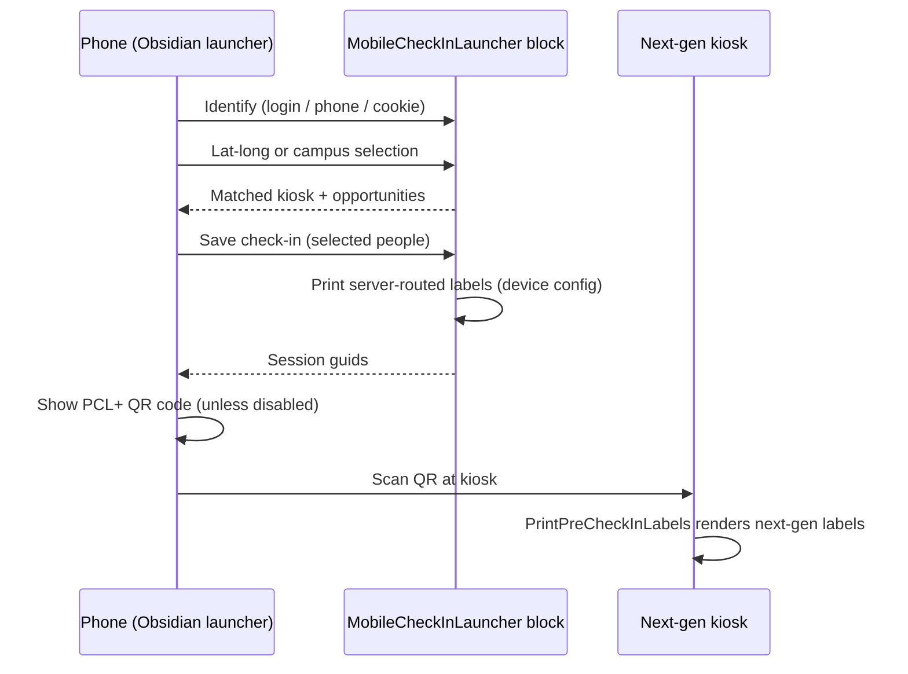

# Mobile Check-in Launcher Obsidian Conversion

## Summary

Rebuild the WebForms Mobile Check-in Launcher block (RockWeb/Blocks/CheckIn/MobileLauncher.ascx) as an Obsidian block. The launcher lets an individual check in from their own phone: it identifies them, resolves a kiosk device by geo-fence or campus selection, records attendance, and displays a QR code that a physical kiosk scans to print labels; a device configured to print from the server also prints them the moment check-in completes. The conversion must record attendance through the next-gen check-in engine so the QR code works at next-gen kiosks without the legacy label fallback, must print server-routed labels at completion the same way, and must add an option to skip the QR code entirely for events that do not need labels.

## Motivation

The launcher is one of the remaining WebForms check-in blocks. Two forces make the conversion more than a straight port:

1. When a QR code from the legacy launcher is scanned at a next-gen kiosk, the kiosk detects legacy label data on the attendance records and falls back to the legacy Zebra print pipeline ([CheckInKiosk.cs:737](Rock.Blocks/CheckIn/CheckInKiosk.cs:737)). That pipeline is compiled only for NET472 and is removed in v21, so the new launcher must produce attendance the next-gen label renderer can serve.
2. Some events do not use labels at all, but the current block always ends with a "Scan Code For Labels" QR code. Check-in needs to be able to complete entirely on the phone when labels are not needed.

The legacy block also depends on the site theme system (it swaps the page into a configured check-in theme and hands off to the legacy check-in theme pages), which the Obsidian version must not do.

## Requirements

### Part 1: Block conversion (feature parity where parity still makes sense)

- MUST provide an Obsidian block replacing the legacy launcher's behavior:
  - **Identification.** Use the current person when logged in; otherwise fall back to the unsecured person identifier cookie (`COOKIE_UNSECURED_PERSON_IDENTIFIER`); otherwise present Log In and/or Phone Identification buttons driven by the two linked-page settings. Hide either button when its page setting is blank; show a configuration warning when both are blank.
  - **Kiosk resolution.** When location services are enabled, prompt for browser geo-location permission (remembering approval via cookie) and match the individual's lat/long against the geo-fences of the allowed kiosk devices. When disabled, show a campus picker built from the allowed devices' campus locations, with the individual's primary campus listed first.
  - **Check-in.** Let the individual select family members (their family is pre-selected) and complete check-in at the resolved kiosk, presenting the same template-driven selection steps the next-gen kiosk presents (auto-select vs manual selection, ability levels, schedules, etc. per the configured template and areas). Checkout is not offered (parity with `AllowCheckout = false`).
  - **Status handling.** When the resolved kiosk is inactive, temporarily closed, or closed, show the configured "no services" message with a try-again action instead of the check-in button.
  - **Success.** After check-in, show the welcome-back state with the label QR code (see Part 2.1) and a "Check-in Additional Individuals" action.
  - **Immediate printing.** Labels a `PrintFrom = Server` device routes to the server MUST print the moment check-in completes, before any QR code is scanned, with the printer chosen by the device's `PrintTo` override falling back to the area's `AttendancePrintTo`. Client-routed labels are discarded, which is also parity: the legacy block emitted them into a Zebra print plugin that exists only in the kiosk shells, so a phone browser never printed them. A server-routed configuration therefore prints at completion and again when its code is scanned, exactly as legacy did; pairing it with the QR opt-out is the configuration that prints exactly once with nothing to scan. Added 2026-08-27: the conversion originally dropped this on the belief that the QR code was the only label path, and label testing surfaced the legacy behavior.
- MUST carry over the block settings: Devices, Check-in Configuration (template), Check-in Areas, Disable Location Services, Check-in Theme, Log In Page, Phone Identification Page, and the Lava text templates (header, identify-you prompt, allow-location prompt, location progress, welcome back, no services, can't determine location, no devices found, no people, no campuses found).
- MUST render well on a phone with self-contained styling, rather than being written against one theme's markup. The Check-in Theme setting carries over, restricted to themes whose purpose is check-in; what is dropped is the legacy handoff it existed to serve, since the check-in screens are now inside this block rather than on theme pages downstream of it. See [Theme selection](#theme-selection).
- SHOULD keep the Lava templates' merge fields working (`CurrentPerson`, `Kiosk`, `NextActiveTime`).

### Part 2: New functionality

1. **Next-gen kiosk label printing.** Attendance MUST be recorded through the next-gen check-in engine (`CheckInDirector` / check-in sessions) so the records carry an `AttendanceCheckInSession` and no legacy `AttendanceData` label rows. The success QR code MUST encode the session guids in the `PCL+` short-guid format that [CheckInKiosk.PrintPreCheckInLabels](Rock.Blocks/CheckIn/CheckInKiosk.cs:1027) already parses, so scanning at a next-gen kiosk renders labels through `LabelProvider` with no legacy fallback.
2. **QR code opt-out.** Provide a block setting that completes check-in on the phone with no QR code displayed, for configurations that do not print labels. When enabled, the success state confirms the check-in without the QR code. The imported success screen already does that, announcing "Check-in Complete" over a card per individual, so the confirmation is what remains when the code is withheld rather than a message added in its place. No separate template or setting is introduced for it: one would repeat what is already on screen, and nothing asked for wording of its own.

## Proposed Approach

- **C# block:** `Rock.Blocks/CheckIn/MobileCheckInLauncher.cs` (`RockBlockType`), with bags in `Rock.ViewModels/Blocks/CheckIn/MobileCheckInLauncher/`. Every server call is a block action: resolve kiosk by lat/long, list campuses/devices, validate configuration, evaluate kiosk status, load family members and opportunities, save attendance, and return success data (QR payload or confirmation). The `/api/v2/checkin/*` REST API is not used. Its controller denies `ExecuteRead` and `ExecuteWrite` to All Users and allows only RSR Staff, Staff-Like, and Administrators ([202501152023534_AddNewRestV2CrudControllers.cs:254](<Rock.Migrations/Migrations/Version 17.0/Version 17.0/202501152023534_AddNewRestV2CrudControllers.cs>:254)), so an individual checking in from their own phone is unauthorized on every call. The next-gen kiosk clears that bar only because a staff member signs the kiosk in. Block actions instead authorize on page VIEW plus block VIEW ([BlockActionsController.cs:221](Rock.Rest/v2/BlockActionsController.cs:221)), which is the right gate for a deliberately public page, and they expose no surface beyond this block.
- **Obsidian component:** `Rock.JavaScript.Obsidian.Blocks/src/CheckIn/mobileCheckInLauncher.obs`, a single mobile-first screen that walks identify → locate → select people → confirm → success, with partials under `src/CheckIn/MobileCheckInLauncher/` as needed.
- **Markup and styling:** the launcher's own states use block-namespaced classes; the check-in flow uses the next-gen kiosk's classes and the kiosk block's stylesheet, per [Reusing the kiosk's check-in screens](#reusing-the-kiosks-check-in-screens). Neither uses the legacy check-in theme classes (`checkin-header`, `checkin-body`, `checkin-scroll-panel`, `checkin-summary`). Those are defined by the legacy check-in themes, which this block no longer loads, so reusing them preserves no existing customization. `_checkin-mobile.scss` (imported by styles-v2 `core.scss`) does style several of them as a patch for legacy themes under `@media (max-width: $screen-xsmall)`, this block's target viewport, so reusing the names would inherit stray margins and `width: 100% !important`. This governs markup from the first state built, not just the styling slice; custom styles follow the Obsidian block CSS conventions.
- **Server-side reuse:** the native mobile app check-in block ([CheckIn.cs](Rock.Blocks/Mobile/CheckIn/CheckIn.cs)) wraps the engine (`CheckInDirector`, `session.SaveAttendance`) in block actions and is the pattern for the launcher's entire flow, not only its launcher-specific pieces. The legacy `CheckInState` / workflow pipeline is not used anywhere. This is what makes requirement 2.1 fall out naturally.
- **Check-in state machine:** the launcher imports the Obsidian kiosk's `CheckInSession` ([checkInSession.partial.ts](Rock.JavaScript.Obsidian.Blocks/src/CheckIn/CheckInKiosk/checkInSession.partial.ts)) unchanged and drives it with an adapter that maps its `/api/v2/checkin/*` calls onto `invokeBlockAction`. The class takes its `HttpFunctions` by constructor, so no kiosk file is edited, moved, or wrapped. That file holds the flow rules (which screen comes next, when auto-select fires, how ability levels cascade, how selections are stashed per attendee), which exist today only as parallel hand-ports in the kiosk and the native mobile app and are the single worst thing to copy a third time.
- **The check-in portion should feel like the kiosk.** The intent is that an individual moving between a kiosk and their own device meets the same experience, near enough to be indistinguishable. That makes reusing the kiosk's screens the target rather than a fallback. See [Reusing the kiosk's check-in screens](#reusing-the-kiosks-check-in-screens).

  Two things that appeared to rule this out do not. The kiosk screens carry no styles of their own and rely entirely on `RockWeb/Styles/Blocks/Checkin/CheckInKiosk.css`, but that stylesheet is mobile-first, breaking upward at 576px and 768px rather than being sized for a kiosk display. And loading it does not conflict with the theme independence required above: it is a block stylesheet the kiosk block loads for itself, not a site theme. The requirement rules out the legacy theme swap and the legacy check-in theme classes, not the next-gen kiosk's own styles. Nothing is promoted to `Framework/Controls/Internal/`, and nothing needs to be: the screens and the partials beneath them (`mainPanel`, `attendeeBanner`, `attendanceCard`, `achievementCard`) are imported where they sit, which is the only reuse path the do-not-change constraint leaves.
- **The flow is entered at family select, with the family staged.** A new session starts on the kiosk's welcome screen, whose first branch sends anything without a populated `families` collection to the search screen. The launcher never searches, so it constructs the session at `Screen.FamilySelect`, which is the state meaning the family is already known. That alone is not enough: `withNextScreenFromFamilySelect` then guards on `getCurrentFamily()`, which resolves `currentFamilyId` against the same `families` collection, and bounces back to the welcome screen when it comes up empty. So the session is staged with the identified individual's family, standing in for what a search would have left behind, which is why the initialization box carries the family's name as well as its identifier. The imported person-select screen titles itself with that name, so the box would need it either way. The family is not the only thing a search leaves behind: `searchType` is set nowhere but `withFamilySearch`, and `withSaveAttendance` refuses to run without it, so the staged session also carries `FamilySearchMode.FamilyId` and the family's IdKey as the term. That mode is documented as taking the encrypted IdKey, and it is what the server forces on the request anyway.
- **Person select is the kiosk's, including what it discloses.** The screen opens with whoever the engine marked `IsPreSelected` already ticked, which is how the kiosk seeds it. That flag comes from the template's `AutoSelectDaysBack` and recent attendance ([CheckInSession.cs:399](Rock/CheckIn/v2/CheckInSession.cs:399)), not from family membership, so it is a narrower thing than the legacy block's pre-selection of the whole family and it ticks nobody at all when that setting is zero. It also shows each attendee's already-chosen group, location, and schedule beneath their name, taken from `session.getAttendeeSelections`. That second part matters most under an auto-select configuration, where it is the only place anyone sees which room a child is going into before confirming. The success screen aggregates by person for the same reason the kiosk does: someone checked into two schedules is one individual with two lines, not two blocks with their achievements printed twice.
- **The kiosk's escape hatches are carried over.** Three of them, all reached by auditing the kiosk screens rather than by hitting them: an attendee with no available areas gets the kiosk's own message, and a Skip action through `withNextScreenBySkippingAttendee` where the kiosk offers one, rather than an empty list with no way forward; a Back action unwinds a stack of prior sessions the way the kiosk's `previousScreens` does, with the stack emptied whenever the flow moves to another attendee after any attendance has been saved, since a saved attendee's steps are final; and the success screen reports just-completed and in-progress achievements, which `RecordedAttendanceBag` carries and the kiosk shows. The `Select All Schedules Automatically` setting is carried across as well, since it is what makes the engine skip an attendee with nothing to check into instead of stranding them.
- **The kiosk's conventions and its class names both come across.** The screens are the kiosk's own, so the `isProcessing` guard that blocks a second tap mid-transition, failures raised through `alert` so the individual stays on the step rather than losing the flow, the `CancellationTokenSource` cancelled on unmount, the `ti-checkbox` and `ti-square` selection indicators, and the subtitle wording all arrive with them rather than being reproduced. The earlier worry about inheriting the class names turned out to be smaller than it looked: `_checkin-core.scss` is still commented out of styles-v2 [core.scss:178](Rock.Frontend.Styles/src/styles/styles-v2/core.scss:178), it defines no `button-list` at all, and its one overlapping rule, `btn-dimmed`, sets the same opacity value that `CheckInKiosk.css` sets at higher specificity. Restoring that import would leak only properties the kiosk sheet does not already set.
- **Checkout is never offered.** The legacy block did not expose checkout from the phone and this conversion keeps that. The guard sits at the data source rather than in the screen routing. Action select has a single entry point, and reaching it requires both `IsCheckoutAtKioskAllowed` on the template and a non-empty currently-checked-in list; the launcher's `FamilyMembers` action never populates `CurrentlyCheckedInAttendances`, so the second condition can never hold and checkout is unreachable regardless of how the template is configured. Every consumer of that list in the imported flow is checkout-related, so withholding it costs the check-in path nothing. This is deliberately not a screen interception: one omission at the source cannot be defeated by a route nobody predicted, whereas intercepting action select only works for as long as it stays the only way in. The adapter leaving `Checkout` unmapped remains as a backstop.
- **Unhandled screens fail quietly for the individual and visibly for us.** The screen mapping has an explicit branch for any state the launcher does not implement, showing a calm message with a way to start over rather than rendering blank. The specific screen or endpoint goes to the browser console only. Nothing is written to the Exception Log, because the highest-volume causes are configuration-driven and would produce one row per individual per attempt; where server visibility is later wanted, it belongs in `RockLogger` at warning level under `RockLogDomains.CheckIn`, once per page load. Configuration the launcher genuinely cannot present is surfaced to the administrator as a block configuration warning at initialization instead, so it appears once rather than per check-in.
- **Trust boundary:** the check-in actions accept the REST option bags verbatim so the reused state machine can post them unchanged, but nothing identifying in those bags is trusted. The configuration template, areas, family, and person identifiers the client sends are discarded and replaced server-side: the individual comes from `GetIdentifiedIndividual()`, their family from that individual, and the template and areas from block settings. Any person named in a request is checked against `CheckInSession.GetGroupMembersQueryForFamily`, which is the engine's own definition of who is checkable and therefore covers the immediate family plus anyone tied to it by a "can check in" known relationship. A plain family-membership test would be wrong here: it would lock out the grandparent-checks-in-grandchild case the engine supports. The check is not optional either, because `GetPersonForFamilyQuery` uses the family only to sort its results, not to scope them, so the engine will happily load a person from outside the family if asked. A kiosk IdKey is re-validated against the Devices setting exactly as [GetKioskByDevice](Rock.Blocks/CheckIn/MobileCheckInLauncher.cs:450) already does. This is stricter than the native mobile block, which uses the `TemplateId`, `KioskId`, and `PersonId` values it is sent ([CheckIn.cs:441](Rock.Blocks/Mobile/CheckIn/CheckIn.cs:441)). The reason is not that one page is public and the other is not, since both require an identified individual before any check-in action runs. It is that the launcher's identity may come from `COOKIE_UNSECURED_PERSON_IDENTIFIER`, which the client asserts and no authentication backs, and that an identified individual of either kind could otherwise name someone outside their own set. That second exposure appears to exist in the mobile block as well and has simply not been exercised there.
- **The attendance session request is rebuilt, not passed through.** `AttendanceSessionRequestBag` reaches both the engine's enforcement and the attendance record itself, so the launcher replaces every field on it that the client could turn to its advantage. `IsCapacityThresholdEnforced` is forced true, because [DefaultSaveProvider.cs:147](Rock/CheckIn/v2/DefaultSaveProvider.cs:147) only checks capacity when the request asks it to, and room ratios are not the individual's to waive. `IsPending` is left to the flow, which stages each attendee of a family check-in as pending and confirms them together once the last one is done. `SearchMode` becomes `FamilyId` and `SearchTerm` is cleared, matching the legacy block's family lookup and keeping arbitrary client text out of `Attendance.SearchValue`. `FamilyId` and `PerformedByPersonId` come from the identified individual. `SourceValueId` needs no handling because `GetSourceValueId` prefers the session's own source, which the block always sets to Mobile. The session `Guid` is checked for ownership rather than for existence. [GetOrAddSession](Rock/CheckIn/v2/DefaultSaveProvider.cs:576) returns an existing record rather than failing, so somebody else's guid would attach this check-in to their labels and leave their device and IP on the audit trail. A guid recurring is not itself the problem, because a family check-in saves once per attendee under a single guid; the block instead rejects any guid already carrying attendance that this individual did not check in, reading `CheckedInByPersonAliasId` and treating an empty one as somebody else's. The same test gates confirming and discarding a session.
- **Kiosk status:** next-gen has no four-state status enum. `CheckInDirector.GetKioskStatus` returns `IsCheckInActive`, `HasOpenLocations`, `NextStartDateTime`, and `NextStopDateTime` ([CheckInDirector.cs:226](Rock/CheckIn/v2/CheckInDirector.cs:226)) and requires the configured areas as input. The launcher treats `IsCheckInActive` as the only gate: true offers the check-in action, false shows the no-services message with Try Again. That matches the legacy block, whose Inactive, TemporarilyClosed, and Closed branches all render the same `NoScheduledDevicesAvailableTemplate` ([MobileLauncher.ascx.cs:767](RockWeb/Blocks/CheckIn/MobileLauncher.ascx.cs:767)), leaving `NextActiveTime` as the only observable difference between them. The legacy `NextActiveTime` merge field maps to `NextStartDateTime`.
- **Kiosk resolution:** the geo-fence match runs `DeviceService.GetDevicesByGeocode`, then filters to active kiosks and the Devices setting before taking the lowest id, so a restricted device list cannot be shadowed by a nearer kiosk outside it. An invalid geo-fence on any one kiosk fails the whole spatial comparison, so that exception is logged and treated as out of range. The campus list resolves each kiosk's campus through `DeviceCache.GetCampusId()`, which reads the location's own `CampusId` and then walks ancestor locations. The legacy block read only the location's own `CampusId`, which a standard Rock location tree leaves empty, so kiosks whose campus comes from a parent location fell through to "No Campuses Found". Location approval is remembered in the same `Checkin.RockHasLocationApproval` cookie the legacy block used, written from the resolution block action. A no-match geo-fence result offers a Try Again action that re-runs the match, which the legacy block hid on that screen, leaving a page reload as the only way forward. A denied permission shows the message without Try Again, because browsers will not prompt again for a permission the individual has blocked, so retrying could only fail the same way. One deliberate departure from legacy rather than a fix of it:
  - **Geolocation timeout.** The position request carries a 30 second timeout. `getCurrentPosition` defaults to no timeout at all, so a device that never gets a fix fires neither callback and leaves the individual on "Determining location..." indefinitely. The tradeoff is that a fix which would have landed later now surfaces "Can't Determine Location" instead, mitigated by Try Again starting a fresh attempt against a warmed-up GPS. The next-gen kiosk block sets no timeout; a kiosk is a fixed device staff configure once, unlike a phone in a parking lot.
- **Custom settings modal:** the devices multi-select, configuration template, and cascading areas pickers stay in a custom settings modal (cross-field cascading is not possible in the standard settings panel), cloned from the native mobile block's [mobileCheckInCustomSettings.obs](Rock.JavaScript.Obsidian.Blocks/src/CheckIn/mobileCheckInCustomSettings.obs) pattern. It also carries the Check-in Theme picker, which needs a server-supplied list and so cannot be a standard attribute: Rock has no theme field type. All other settings (linked pages, Lava templates, QR opt-out) are standard block attributes.

### Theme selection

The Check-in Theme setting carries over, for a narrower reason than the legacy block had. Its legacy description was "the check-in theme to pass to the check-in pages": it swapped the site's theme so the legacy check-in theme pages the launcher handed off to would render correctly. Those pages are gone. What remains is the case of more than one next-gen check-in theme installed, which `NextGenCheckin` is alone in satisfying today. The setting is carried for that eventuality rather than for a need already on the ground, which is the weakest of the reasons offered here and the one to revisit if it stays unused.

The mechanism is core Rock, not a legacy artifact. [SiteCache.Theme](Rock/Web/Cache/Entities/SiteCache.cs:117) resolves a `theme` query string parameter, validates that the folder exists, stores it in a `Site:{Id}:theme` cookie, and falls back to the site's configured theme. The legacy block's `LocalDeviceConfiguration.CurrentTheme` was only its own record of what it had asked for; the switching was always core.

Three consequences shape the implementation:

- **The theme is resolved before any block runs.** [RockRouteHandler](Rock/Web/RockRouteHandler.cs:357) builds the layout path from `page.Layout.Site.Theme` and constructs the page from it, so a block cannot restyle in place. It can only hand the client a url and have the page loaded again, which is what the initialization box's `ThemeRedirectUrl` is. The rest of the box is left unresolved on that pass, since the page is about to be replaced.
- **A loop guard is mandatory, not defensive.** `SiteCache` silently ignores a theme whose folder is missing, so redirecting whenever the configured theme differs from the site's would repeat forever. A request is never given the parameter again when it already carries that same value. Both halves of that are load-bearing: the value has to be compared, so a theme named by hand in the url is replaced by the configured one rather than being left to stand, and the parameter's presence has to be tested separately, because `PageParameter` returns an empty string for a parameter that is missing as well as one that is blank, and blank is the value that clears the cookie. The guard is not the only thing covering a theme that has been deleted from disk: the same getter clears a cookie naming a folder that no longer exists ([SiteCache.cs:157](Rock/Web/Cache/Entities/SiteCache.cs:157)), so such a device recovers on its own. Note that reading `Theme` writes and clears cookies rather than merely reporting, which is worth knowing before anyone reads it more than once.
- **A blank setting has to clear the cookie, not just stand aside.** The cookie outlives the setting: configure a theme, let devices pick it up, then clear the setting, and those devices keep the old theme forever while new ones follow the site. So the target is the site's `ConfiguredTheme` when the setting is blank, compared against the resolved `Theme`, and the reload carries an empty parameter, which is what [SiteCache](Rock/Web/Cache/Entities/SiteCache.cs:129) treats as "forget this cookie". Comparing against the resolved theme alone would have missed it, since a cookie makes the two agree. One consequence, accepted: legacy returned early on a blank setting, so a `theme` named by hand in the url survived there, and here it is cleared along with everything else. Nothing is lost by it, because previewing a theme is a matter of changing the setting.
- **Two blocks enforcing a theme on one site will fight, and this one enforces further than the legacy launcher did.** The cookie is `Site:{Id}:theme`, so the contest is only possible between blocks on the same site; each would redirect once per navigation, flipping the value. Legacy had the same exposure and answered it with shared state rather than isolation: its launcher and the legacy kiosk setup block ([Admin.ascx.cs:616](RockWeb/Blocks/CheckIn/Admin.ascx.cs:616)) both read and write `LocalDeviceConfiguration.CurrentTheme` and defer to that one value, which is why the theme lived there at all. This block does not participate in `LocalDeviceConfig`, so sharing a site with that block would produce exactly the fight legacy avoided. For a non-blank setting the exposure matches legacy's; for a blank one it does not, since legacy stood aside and this clears. That is accepted rather than overlooked: the page is hosted on a check-in site of its own, no other writer is on it, and an administrator clearing the setting and finding that devices keep the old theme is the likelier support call. The alternative, blank standing aside, would still let an administrator reset devices by naming the site's own theme explicitly rather than clearing the setting.
- **Only check-in themes are offered.** The `Theme` entity carries a purpose, so the list is filtered to the check-in defined value rather than scanning folders the way legacy's `BindThemes` did, which offered every theme including ones with no `Checkin` layout. Selecting one of those would leave the page resolving against a layout file that does not exist, and there is no `Rock` theme in this repo for [RockRouteHandler](Rock/Web/RockRouteHandler.cs:369) to fall back to.

Two things were weighed against carrying it and lost. The setting is block-scoped while the cookie is site-scoped, so two launcher pages on one site with different themes would contend over one value; and the kiosk has no such setting, so this is a deliberate divergence. Both are acceptable here: the site hosts only check-in pages, the cookie lives on the individual's own phone, and the legacy block carried the same exposure on a site far likelier to hold other pages. The cost when the setting is used is one extra page load per device, and none when it is blank.
- **Immediate printing:** the completion actions print through the same pipeline the native mobile block uses. `ConfirmAttendance` always, and `SaveAttendance` when the request is not pending, call [RenderAndPrintCheckInLabelsAsync](Rock/CheckIn/v2/DefaultLabelProvider.cs:81) with the resolved kiosk and a five second timeout, so a dead printer delays completion rather than blocking it. The engine stamps `PrintFrom` from the device and resolves the printer through the same `PrintTo` cascade legacy used ([DefaultLabelProvider.cs:684](Rock/CheckIn/v2/DefaultLabelProvider.cs:684)), so a partner's existing device configuration produces the same routing with no new block setting. The family flow prints at confirm, which hands the engine the whole session in one pass, so family and person labels come out once each. Client-routed labels, which the method returns for a kiosk to print, are discarded, and print failures land on the result's messages, which the response bags already carry to the imported screens.
- **QR code:** generated from the saved session guids as `PCL+{shortGuid,shortGuid}` (same encoding as [CheckInBlock.cs:929](Rock/CheckIn/CheckInBlock.cs:929)), rendered via `GetQRCode.ashx`. Session guids persist in a cookie (parity with `CheckInCookieKey.AttendanceSessionGuids`) so the QR survives a page refresh while sessions remain recent. The code renders beneath the imported success screen and again on the welcome back state whenever the cookie still holds a printable session, which is both where a refresh lands and where the legacy block showed it; the check-in action reads "Check In Additional Individuals" once a check-in has been completed, which is legacy parity and holds in both variants, since it describes what the individual has already done rather than whether a code is showing. Sessions are recorded whether or not codes are shown, and the QR opt-out is honored in the one place the code is built, so turning codes on partway through an event prints for everyone who checked in before the change rather than only for those who arrive after it. That also keeps the two variants identical everywhere except the code itself, including across a refresh. The cookie is client-asserted, so a session is encoded only when its attendance still exists and every record in it was checked in by this individual: a guid somebody else's check-in owns produces no code rather than that family's labels. A session whose attendance is gone drops out for the same reason the legacy block filtered them, since only an individual's latest attendance carries a session and a dead guid would make the code denser for nothing.

### Settled decisions

Each of these replaced the more obvious choice. Recorded with the reason that choice fails, so they are not re-litigated.

1. **Block actions, not the REST API.** The plan assumed `/api/v2/checkin/*` was reachable. It denies `ExecuteRead` and `ExecuteWrite` to All Users, so a phone gets 401 on every call. The next-gen kiosk only clears that bar because staff sign it in. Everything moved to block actions.
2. **Imported flow logic, not launcher-local.** Owning the flow logic meant writing it a third time. The kiosk and the native mobile app already hold parallel hand-ports of it, 2,041 lines of TypeScript against 1,885 of C#, none of it on the server and none of it documented or tested. That is the worst code in the system to copy again.
3. **Imported in place, not promoted.** Promoting the shared pieces is the better structure, but next-gen check-in files are off limits and moving one counts as changing it. A read-only cross-block import is the only reuse path that survives that constraint.
4. **The kiosk's screens, not ours.** They look like they rule themselves out, carrying no styles and depending entirely on `CheckInKiosk.css` at what reads as display scale. That stylesheet is mobile-first, and it is a block stylesheet the kiosk loads for itself rather than a site theme, so this block loads it the same way. See [How this approach was reached](#how-this-approach-was-reached).

Accepted costs: the launcher depends on seven kiosk screens, the partials beneath them, `checkInSession.partial`, and `CheckInKiosk.css`, none of which it may change and no test guards; and `utils.partial` pulls `html5-qrcode` and `marked` in as external fetches the launcher never uses.

## Implementation Plan

Each row is a discrete implementation slice. **Implemented** means the code is written and in the working tree. **Tested** means every checkbox in every linked test section passes. Mark ✅ when done, 🔄️ when started but incomplete, and leave blank when not begun.

| # | Slice | Verified by | Implemented | Tested |
|---|---|---|---|---|
| 1 | Block scaffold: `MobileCheckInLauncher.cs`, bags, block type guid | [T1](#t1-settings-verification) | ✅ | ✅ |
| 2 | Custom settings modal (devices multi-select, configuration template, cascading areas, check-in theme) | [T1](#t1-settings-verification) | ✅ | ✅ |
| 3 | Standard settings (linked pages, Lava templates, QR opt-out) | [T1](#t1-settings-verification), [T8](#t8-lava-templates) | ✅ | ✅ |
| 4 | Identification (current person, unsecured cookie, Log In / Phone Lookup handoffs) | [T2](#t2-identification-paths) | ✅ | ✅ |
| 5 | Kiosk resolution: geolocation-based | [T3](#t3-kiosk-resolution) | ✅ | ✅ |
| 6 | Kiosk resolution: campus picker | [T3](#t3-kiosk-resolution) | ✅ | ✅ |
| 7 | Kiosk status block action with "no services" messaging; establishes the shared template/areas resolution slice 8 builds on | [T4](#t4-kiosk-status-states) | ✅ | ✅ |
| 8a | Family load: block actions speaking the REST contract, the adapter, and a session constructed from the block's `KioskConfigurationBag` that lists the family | [T5a](#t5a-family-load) | ✅ | ✅ |
| 8b | Selection screens (person, ability level, area, group, location, schedule), imported from the kiosk | [T5b](#t5b-selection-steps) | ✅ | ✅ |
| 8c | Saving attendance, the success confirmation, and the unhandled-screen fallback | [T5c](#t5c-saving-attendance) | ✅ | ✅ |
| 9 | Success: QR variant | [T6](#t6-qr-at-kiosk-end-to-end) | ✅ | ✅ |
| 10 | Success: non-QR variant | [T7](#t7-non-qr-variant) | ✅ | ✅ |
| 11 | Mobile-first styling across all states, using block-namespaced classes rather than legacy check-in theme classes | [T9](#t9-mobile-devicebrowser-pass) | ✅ | ✅ |
| 12 | Sneak the block into Rock v20 | [T10](#t10-legacy-regression) | ✅ | ✅ |
| 13 | Immediate printing of server-routed labels at check-in completion | [T12](#t12-immediate-printing) | ✅ | ✅ |

[T11](#t11-final-behavior-and-data-validation) is deliberately not linked from any slice. It is a cross-cutting pass over behavior and recorded data, run after slice 12 against a fully configured environment, so no slice waits on it.

## Test Plan

**Environment prerequisites:** a physical next-gen kiosk (iPad app or Windows client) with a camera/scanner, a Zebra label printer, kiosk device records with geo-fences configured, an iOS phone and an Android phone, and a test family with check-in-eligible children.

### T1. Settings verification

- [x] Custom settings modal: device list populates, areas cascade when the device selection changes, values persist and re-render.
- [x] Standard settings persist and take effect without a custom modal round trip.
- [x] Config warnings: missing template/areas; both identification pages blank.
- [x] The Check-in Theme picker lists only themes whose purpose is check-in, so no website theme appears. Testing the switch between two themes needs a second check-in theme, which stock Rock does not ship; a copy of `NextGenCheckin` with one token changed is enough.
- [x] Blank means follow the site: with no theme cookie present the page renders in the site's theme with no reload and no `theme` parameter.
- [x] A blank setting with a stale cookie produces exactly one reload, not none and not a loop. Worth watching the network log rather than the screen: `PageParameter` returns an empty string for a parameter that is missing as well as one that is blank, so the guard against reloading twice has to test the parameter's presence separately or a blank setting matches on the first request and clears nothing.
- [x] Clearing the setting after devices have picked up a theme returns them to the site's theme rather than leaving them on the old one: the next load reloads once with an empty `theme` parameter, the cookie is gone afterward, and no further reloads occur.
- [x] Changing the site's theme while the setting is blank is followed by devices that had previously been given a theme, which is the same cookie-clearing path.
- [x] Setting it to the theme the site already uses causes no reload on a device with no cookie, and exactly one on a device whose cookie names something else. That second case is how an administrator resets devices without clearing the setting.
- [x] A `theme` parameter typed by hand is replaced rather than obeyed, on the next load: with the setting blank the page returns to the site's theme, and with a theme configured it returns to that one. One reload either way.
- [x] A cookie naming a theme whose folder has been deleted recovers with no reload from this block at all, because the same getter clears it. Distinct from the row below, where it is the setting that names the missing theme.
- [x] No scenario ever produces more than one reload. This is the invariant the two guards exist to hold, and the network log is where it is visible; a second reload for the same theme means one of them has stopped working.
- [x] Setting it to a check-in theme other than the site's reloads once, renders in that theme, and does not reload again on subsequent visits, since the site theme cookie now carries it.
- [x] Clearing the cookie and returning reloads once more, then settles.
- [x] Returning from the Log In or Phone Identification page keeps its own parameters through the theme reload, so `returnUrl` still round-trips.

### T2. Identification paths

- [x] Logged-in person recognized immediately.
- [x] Unsecured person identifier cookie resolves the person when logged out.
- [x] Log In and Phone Lookup handoffs round-trip back via `returnUrl`.
- [x] Buttons hide individually when their page setting is blank.

### T3. Kiosk resolution

**Geolocation** (slice 5). Chrome DevTools' Sensors panel sets coordinates without leaving your desk. Clear the `Checkin.RockHasLocationApproval` cookie between runs, or every run after the first takes the remembered-approval path.

- [x] First visit shows the Allow Location Prompt template and a Next button.
- [x] Next triggers the browser permission prompt.
- [x] After approval, a reload skips the prompt screen and goes straight to Location Progress.
- [x] Coordinates inside a kiosk's geo-fence resolve to that kiosk.
- [x] Coordinates outside every geo-fence show "No Devices Found".
- [x] Try Again after a no-match re-runs the match and can succeed once the coordinates move inside a fence.
- [x] Denied permission shows "Can't Determine Location" with no Try Again button.
- [x] A kiosk whose fence contains the coordinates but which is not selected in Devices does not match.
- [x] A blank Devices setting considers all active kiosks.
- [x] An inactive kiosk does not match even when its fence contains the coordinates.

**Campus picker** (slice 6). Requires Disable Location Services checked.

- [x] The campus prompt and one button per campus appear.
- [x] Only the devices selected in Devices contribute campuses.
- [x] The individual's primary campus is listed first and styled as the primary button.
- [x] A kiosk whose campus comes from a parent location appears, rather than falling through to "No Campuses Found".
- [x] Two kiosks serving the same campus produce one button.
- [x] A blank Devices setting shows "No Devices Found".
- [x] Allowed devices with no campus at all show "No Campuses Found".
- [x] Picking a campus resolves the kiosk serving it.
- [x] A device deactivated after the page loads shows "No Devices Found" with Try Again on pick.

### T4. Kiosk status states

- [x] Check-in open shows the Welcome Back template; inactive, temporarily closed, and closed each show the No Services message. The check-in action itself arrives with slice 8.
- [x] Try Again on No Services re-checks the same kiosk without re-prompting for location, and reaches Welcome Back once check-in opens.
- [x] `Kiosk` and `NextActiveTime` merge fields resolve, with `NextActiveTime` populated from `NextStartDateTime` when check-in opens later the same day.
- [x] Status is evaluated against the block's configured areas, so an area excluded in settings does not hold the kiosk open.
- [x] A kiosk deactivated after it was resolved falls back to the retryable failure message on Try Again.

### T5a. Family load

- [x] Family members listed with correct eligibility filtering.
- [x] "No people" message when nobody is eligible.
- [x] That message leaves the welcome back state up rather than replacing it: the welcome back text stays, the check-in action stays in the footer reading what it read before, and taking it again re-runs the family load. Recover end to end without reloading, by making somebody eligible (open a schedule, or add an eligible child) and taking the action again, which must reach person select with the message gone. Reaching a screen with no footer action at all is the failure this row exists to catch.
- [x] A person tied to the family by a "can check in" known relationship, such as a grandchild, is listed.
- [x] A request naming a different configuration template or different areas is ignored, and the list still reflects the block's configured template and areas.
- [x] A request naming a kiosk outside the Devices setting is rejected.

### T5b. Selection steps

- [x] An auto-select template completes with no manual selection steps; a manual template presents area, group, location, and schedule as the configuration calls for.
- [x] The ability level screen is presented and usable. It is skipped unless the template's ability level determination is willing to ask and at least one group in the area carries the `AbilityLevel` attribute ([DefaultOpportunityFilterProvider.cs:186](Rock/CheckIn/v2/DefaultOpportunityFilterProvider.cs:186)); the levels themselves come from the Person Ability Level defined type rather than from the groups ([OpportunityCollection.cs:180](Rock/CheckIn/v2/OpportunityCollection.cs:180)), so one group with the attribute is enough. A configuration without it never reaches this screen, which is how the row above came to be passed without it.
- [x] An ability level whose name is long enough to wrap grows its button rather than spilling out of it. `.ability-level-button` is a fixed 82px in `CheckInKiosk.css` ([:265](RockWeb/Styles/Blocks/Checkin/CheckInKiosk.css:265)) where the illustrated button beside it uses the same value as a minimum; the block relaxes it to a minimum below 768px.
- [x] A wrapped label stays left aligned, matching the short labels above it. `.button-list .btn` is a flex row packed from the start while `.btn` centers its text, so a short label shrinks to its content and reads left while a wrapped one fills the row and reads centered. Only wrapping makes the difference visible, so the alignment is pinned in the same rule.
- [x] A request naming a person outside both the family and its "can check in" relationships is rejected.
- [x] Under an auto-select template, an attendee with more than one valid combination shows Change on person select, and taking it reaches the opportunity screen and returns to person select with the new choice shown beneath their name.
- [x] A single available attendee under an individual-mode template lands past person select rather than on it, which is what suppressing the kiosk's registration flags causes.

**Reuse seam.** The flow logic is imported from the kiosk block, which can route to screens this block does not implement.

- [x] A template with `IsCheckoutAtKioskAllowed` still never offers checkout from the phone for a family that already has someone checked in, and check-in proceeds straight through with no extra step.
- [x] A family member who is already checked in is still listed and selectable, and arrives pre-ticked exactly as the kiosk presents them.
- [x] Once any attendee has been saved, Back disappears when the flow moves to the next attendee, so no individual can end up with pending records in two locations for one schedule. Within a single attendee's screens Back still works, which is only observable when an attendee presents more than one screen; a template with Use Same Options and auto-resolving areas gives each attendee a single location screen, leaving nothing within-attendee to return to.
- [x] With two schedules selected and the template's Use Same Options enabled, the first schedule's selection is applied to the second without asking again; with it disabled, each schedule asks in turn with the schedule name in the screen titles.
- [x] The flow never lands on any other kiosk-only screen (welcome, search, family select, checkout select, checkout success). If it does, the individual sees the calm fallback message and the screen name appears in the browser console.
- [x] Nothing on the adapter's unsupported list is reached during a normal family check-in. That list is down to `Checkout` and `SearchForFamilies`, since confirming and discarding attendance turned out to sit on the main family path.
- [x] Person select offers no Add Individual, Edit Family, or Remove, on a kiosk device configured to allow all three.
- [x] No Exception Log rows are produced by any of the above.

### T5c. Saving attendance

- [x] Attendance saves with an `AttendanceCheckInSession` and no `AttendanceData` rows; records verified in Check-in Manager.
- [x] A "can check in" relationship, such as a grandchild, can be checked in and not only listed.
- [x] No labels print at the phone when the resolved device prints from the client, and neither saving nor confirming stalls waiting on a printer. Server-routed devices print at completion by design; that variant is [T12](#t12-immediate-printing).
- [x] A family check-in of two or more writes each attendee as `Pending` as they finish, and once the last one is done no record is left `Pending`: they read `NotPresent` where the template enables presence and `Present` where it does not.
- [x] The success screen aggregates by person, so someone checked into two schedules is one card with two lines.
- [x] A family check-in of two or more attendees saves them all under one session guid, with no later attendee rejected.
- [x] Cancel appears on every selection screen and returns to the welcome back state, matching what the legacy block offered.
- [x] Cancelling partway through a family check-in, after at least one attendee has been saved, deletes that session's pending `Attendance` rows. The `AttendanceCheckInSession` row remains: nothing in Rock deletes those, the kiosk's cancel leaves the same orphan, and an attendance-less session guid is inert everywhere it could matter.
- [x] The same holds after taking Back within the saved attendee's screens first, which restores a session clone from before the save.
- [x] Running the whole cancelled sequence a second time for the same individual, room and schedule sends the delete with the right session guid and the server accepts it. The first pass's row is still left behind, promoted to `Not Present` before the delete can match it, which is the core save-hook defect under Out of Scope rather than anything the launcher does wrong.

### T6. QR-at-kiosk end-to-end

- [x] QR renders after check-in and survives page refresh (cookie).
- [x] QR scans reliably from the phone screen at a kiosk, on both iOS and Android, at typical screen brightness.
- [x] Kiosk scan prints labels via `LabelProvider` (no legacy fallback).
- [x] Multi-session QR (repeat check-in) prints all sessions' labels.
- [x] The welcome back state shows the code after a completed check-in, with its action reading "Check-in Additional Individuals", and taking that action starts another check-in with the code still shown.
- [x] A cookie edited to carry a session guid another individual checked in shows no code at all, rather than a code that would print their labels.

**Classic labels.** [PrintLabelsForAttendanceIds](Rock.Blocks/CheckIn/CheckInKiosk.cs:739) chooses between the two label pipelines by asking whether any `AttendanceData` row exists for the scanned attendance. Requirement 2.1 means this block never writes one, so the launcher's QR always takes the next-gen path. That is the point of the requirement rather than a side effect, but it needs testing, because a configuration carrying only classic labels has nothing for the next-gen renderer to serve.

- [x] With classic labels configured on the areas and no next-gen label records, scanning the launcher's QR at a next-gen kiosk prints nothing, and the kiosk reports that rather than appearing to succeed.
- [x] The same configuration checked in at the next-gen kiosk directly also prints nothing. This is what establishes that the launcher is not the cause: a kiosk check-in writes no `AttendanceData` either, so the loss is against the legacy launcher rather than against the kiosk.
- [x] With both classic and next-gen labels configured on the same areas, the next-gen labels print and the classic ones are ignored.

### T7. Non-QR variant

- [x] Opt-out setting hides the QR, leaving the success screen's own "Check-in Complete" and its attendance details as the confirmation.
- [x] "Check In Additional Individuals" repeat flow works in both variants.
- [x] Turning the opt-out off partway through an event shows a code covering the check-ins completed while it was on, on the next page load.

### T8. Lava templates

- [x] Each configured template renders (spot-check all ten at least once, with merge fields where applicable).
- [x] A template carried over from the legacy block still resolves `{{ Kiosk.Device.Name }}`, and `{{ Kiosk.Name }}` and `{{ Kiosk.CampusId }}` resolve alongside it.

### T9. Mobile device/browser pass

- [x] iOS Safari and Android Chrome: layout, geolocation prompts, and cookie persistence.
- [x] The header pins with the heading on the left and Back on the right, Back is absent on the first screen and on success, and the footer shows the action for whichever state is up.
- [x] Neither Back nor any footer action, Cancel included, can be tapped while a check-in request is outstanding, whether that request came from a footer action or from tapping an option on an imported screen. Test the second case by picking a location on a throttled connection and tapping each of them before the screen advances.
- [x] The chrome comes back to life once the request finishes, in both the success and failure cases, so a failed call does not strand the individual with dead buttons.
- [x] The success attendance card fills the panel width rather than a third of it, and a long action label wraps instead of running off the edge.
- [x] A person select list too long for the screen scrolls inside the body while the header and the action footer stay pinned, on Android Chrome at 375px and on iOS Safari.
- [x] The action footer is reachable without scrolling in every state, including on a short viewport with the browser's own chrome showing.

### T10. Legacy regression

The first row is runnable now, while the WebForms block is still in place, and is worth running before slice 12 removes the means to.

- [x] Existing legacy launcher QR still prints at a next-gen kiosk (pre-v21 fallback intact). This is also the control for the classic label rows in [T6](#t6-qr-at-kiosk-end-to-end): the legacy pipeline writes `AttendanceData`, which is the only thing [CheckInKiosk.cs:739](Rock.Blocks/CheckIn/CheckInKiosk.cs:739) branches on, so the same configuration that prints from the legacy launcher prints nothing from this one.
- [x] Sneak block into Rock v20.

### T11. Final behavior and data validation

Run once every slice has landed, not per slice. These check that the launcher behaves and records the way it should against a fully configured environment, rather than that a given feature works at all. Several of them compare the launcher to a kiosk, which is only meaningful when both run the same template, areas, and device; a mismatch there produces a difference that is configuration rather than a defect. The trust boundary block below is what gates shipping, so this section is a release gate rather than a nice-to-have.

- [x] Pre-ticking follows the template's `AutoSelectDaysBack` and recent attendance rather than family membership: with that setting at zero nobody arrives pre-ticked, including the individual checking in. The rule and its rendering are shared code the launcher cannot affect, but the inputs are ours, since [IsAnyOpportunityInRecentAttendance](Rock/CheckIn/v2/CheckInSession.cs:634) intersects recent attendance with the areas the block settings and the resolved kiosk allow. Order matters on a re-run: build the attendance history first and test the zero case last, because on a clean database nobody is pre-ticked whatever the setting says, so running it first passes for the wrong reason.

**Trust boundary.** The block accepts the REST option bags verbatim so the imported flow can post them unchanged, then discards and replaces anything identifying. None of these may change the outcome.

To tamper with a request: reach the screen before the one under test, then in the Network tab right-click the block action, Copy as fetch, paste it into the Console, edit the body, and run it. The block action name is the last path segment of `/api/v2/BlockActions/{page}/{block}/{action}`, so the call under test is easy to pick out. A same-origin fetch carries the cookies, so the identified individual is whoever the page already resolved and only the tampered field differs. Read the status and body of the response rather than the screen, since the flow is not driving these calls.

- [x] Abandoning a family check-in partway, by closing the tab rather than restarting, leaves its pending rows in place, and those rows count against the room's capacity for the rest of the day. This confirms a known limitation rather than a fix; see the pending-cleanup item under If There's Time.
- [x] Check-in closing partway through a family check-in behaves the way it does at a kiosk: the attendees already staged are confirmed and covered by the QR code, and the ones not yet reached are offered nothing to select, reaching the unavailable message with Skip rather than a refused save. Note that `IsCheckInActive` is kiosk-wide ([CheckInDirector.cs:325](Rock/CheckIn/v2/CheckInDirector.cs:325)), so closing one schedule is not enough when another on the same locations still has an open window. Per-attendee filtering is what closes the door, re-evaluated per request at [OpportunityCollection.cs:156](Rock/CheckIn/v2/OpportunityCollection.cs:156).
- [x] Skipping every remaining attendee after a close reaches the success screen reporting only what was actually saved, and a close before anyone completes reaches it with nothing checked in rather than erroring.
- [x] A save with `IsCapacityThresholdEnforced` set false still refuses to exceed a room's capacity. Fill a room to its `SoftRoomThreshold`, then send a save for one more with the flag flipped to false; it is forced back to true ([MobileCheckInLauncher.cs:1322](Rock.Blocks/CheckIn/MobileCheckInLauncher.cs:1322)). The save answers 200 rather than failing: [DefaultSaveProvider.cs:149](Rock/CheckIn/v2/DefaultSaveProvider.cs:149) skips the person with a message, so the pass condition is a capacity message, an empty `attendances`, and no new row. Pending rows count toward the threshold, and the schedule must be in its window for them to, so this cannot be run with check-in closed.
- [x] A save carrying an `AttendanceCheckInSession` guid whose attendance was checked in by somebody else is rejected, as is confirming or discarding one. Take a guid from an `Attendance` row another individual checked in and send it as `session.guid`; all three actions answer 400 "Check-in session was not valid." ([:662](Rock.Blocks/CheckIn/MobileCheckInLauncher.cs:662), [:743](Rock.Blocks/CheckIn/MobileCheckInLauncher.cs:743), [:787](Rock.Blocks/CheckIn/MobileCheckInLauncher.cs:787)).
- [x] Saved attendance records show a Family Id search type and an empty search value regardless of what was sent. Send a save with `session.searchMode` and `session.searchTerm` set to anything; the row's `SearchTypeValueId` reads Family Id and `SearchValue` is empty ([MobileCheckInLauncher.cs:1316](Rock.Blocks/CheckIn/MobileCheckInLauncher.cs:1316)).
- [x] A request naming a different configuration template or different areas is ignored in favor of block settings, on every action that takes them. The template and areas are never read off the bag; they come from `GetConfiguredCheckInConfiguration()`.
- [x] A request naming a kiosk outside the Devices setting is refused with 400 "Kiosk was not found." rather than ignored, on family load, opportunities, save, and confirm alike ([:654](Rock.Blocks/CheckIn/MobileCheckInLauncher.cs:654), [:738](Rock.Blocks/CheckIn/MobileCheckInLauncher.cs:738)). This differs from the template and areas deliberately: a kiosk the individual is not entitled to is an attempt rather than noise.

### T12. Immediate printing

Requires a kiosk device whose Print From is Server and a reachable Zebra printer; the device's Print To override selects the printer per row below.

- [x] A family check-in of two or more prints at the moment the last attendee confirms, before any QR code is scanned, with family and person labels printed once each rather than once per attendee or schedule.
- [x] An individual-mode template prints when its save completes, since no confirm step follows.
- [x] Print To routing holds: Kiosk prints at the device's printer, Location at the room's printer, and Default follows the area's `AttendancePrintTo`.
- [x] A device whose Print From is Client prints nothing at the phone, leaving the QR scan as the only print path.
- [x] Scanning the QR after an immediate print prints the labels again. This is the legacy pairing; the QR opt-out is the configuration that prints exactly once.
- [x] With the QR opt-out on and a server-routed device, check-in completes with no code shown and the labels already printed, which is the full no-touch flow.
- [x] An unreachable printer delays completion by at most the five second timeout, check-in still succeeds, and the failure appears as a message on the success screen rather than blocking it.
- [x] Cancelling a family check-in partway prints nothing, since pending saves do not print and the confirm never runs.

## Reusing the kiosk's check-in screens

The check-in portion of the launcher runs on the kiosk's own screens rather than on screens of its own. An individual moving between a kiosk and their phone should meet the same experience, near enough to be indistinguishable, and sharing the screens is the only way to keep it that way as the kiosk changes. It also keeps a third parallel check-in UI out of long-term maintenance.

### How this approach was reached

The launcher started with its own selection screens, a `checkInOptionList` partial that every step rendered through. That was written on the belief that the kiosk's screens were sized for a display and depended on a check-in theme this block deliberately would not load. Both halves turned out to be wrong: `CheckInKiosk.css` is mobile-first, breaking upward at 576px and 768px, and it is a block stylesheet the kiosk block loads for itself rather than a site theme, so this block can load it the same way.

Reusing next-gen check-in files from outside next-gen check-in was not a call this conversion could make on its own. Those files are off limits to change, and importing them across blocks makes them a dependency their owners did not ask for. Daniel approved reusing as much of the kiosk as the constraint allows, import-only, which is what lets the screens, the flow logic, and the stylesheet be shared instead of hand-ported a third time. The launcher's own screens came out once the kiosk's were in.

### Do not change

- **Any file under `Rock.JavaScript.Obsidian.Blocks/src/CheckIn/CheckInKiosk/`, or anything else in next-gen check-in.** This constraint is absolute and is the reason the whole approach is import-only.
- The block's actions and every guard in them: identifier substitution, `IsCheckInAllowed`, `GetAttendanceSessionRequest`, and the session-guid ownership check. Two of these were revised by the audit below rather than by the swap, and the revised versions are what is protected. An availability re-check before saving was on this list and has since been removed; see defect 8.
- [checkInHttpAdapter.partial.ts](Rock.JavaScript.Obsidian.Blocks/src/CheckIn/MobileCheckInLauncher/checkInHttpAdapter.partial.ts) and its short endpoint map. `Checkout` and `SearchForFamilies` stay unmapped so they fail by name. The map and the unsupported list are what is protected here; the adapter also reports staged attendance back to the block, per defect 6. `ConfirmAttendance` and pending-attendance deletion were on that list too, until the audit found both on the main family check-in path.
- Entry into the flow at `Screen.FamilySelect` with the family staged, in `onCheckInClick`.
- Withholding `CurrentlyCheckedInAttendances` from `GetFamilyMembers`, which is what makes checkout unreachable.
- `LauncherState` and everything it drives: identification, geolocation, campus picker, kiosk availability. Only the check-in flow portion is in scope.

### What was replaced

- `checkInOptionList.partial.obs` is deleted.
- `checkInFlow.partial.obs` stays as the router with the kiosk screens in place of its markup. Its session handling, unhandled-screen fallback, and restart emit survive; its `advance` wrapper, `isProcessing` guard, and cancellation token did not need to, because each imported screen owns all three. It renders no buttons of its own, handing them to the page chrome instead.

### Screens to import

From `../CheckInKiosk/`: `personSelectScreen`, `autoModeOpportunitySelectScreen`, `abilityLevelSelectScreen`, `areaSelectScreen`, `groupSelectScreen`, `locationSelectScreen`, `scheduleSelectScreen`, `successScreen`. Each takes `configuration: KioskConfigurationBag` and `session: CheckInSession`, and emits `next` with the new session plus `updateActions` with a `KioskButton[]`. Verify the emit list per screen rather than assuming; `personSelectScreen` is the largest and most likely to differ.

`autoModeOpportunitySelectScreen` was scoped out on the grounds that it is reachable only through person select's Change button, which requires `currentAttendeeId` that the launcher never sets. Importing person select wholesale adopted that button, so the screen is imported too. See the audit below.

### Deep audit, before first test

Three defects, found by tracing the imported flow rather than by running it. Only the second was caused by the swap; the other two were latent in slice 8c and would have read as the swap breaking routing.

1. **Family mode never reached Success.** [withNextScreenFromLocationSelect](Rock.JavaScript.Obsidian.Blocks/src/CheckIn/CheckInKiosk/checkInSession.partial.ts:1612) sends family mode to `withNextFamilyAttendee`, which saves each attendee as pending and then calls `withConfirmAttendance()` after the last one. `ConfirmAttendance` was unmapped, so it threw in the adapter before reaching the server, after attendance had already been written. `withNextScreenBySkippingAttendee` ends in the same call. Fixed by adding a `ConfirmAttendance` block action modelled on [CheckIn.cs:539](Rock.Blocks/Mobile/CheckIn/CheckIn.cs:539) minus its label rendering, since labels print at the kiosk from the QR code. That premise was half right, and the rendering has since been restored for server-routed labels; see the Immediate printing requirement under Part 1.
2. **Person select's Change button had nowhere to go.** It is gated on `isAutoSelect` and `isMultipleSelectionsAvailable`, both of which `GetFamilyMembers` populates because it returns the engine's attendee bags verbatim. Tapping it set `currentAttendeeId` and routed to `AutoModeOpportunitySelect`, which the launcher did not present, so the individual got the start-over fallback. Fixed by importing the screen; `withNextScreenFromAutoModeOpportunitySelect` returns to person select, closing the loop.
3. **A family of two or more was rejected at the second attendee.** `sessionGuid` is generated once and carried through every derived session, so each attendee's save reuses it. The old guard rejected any guid already present in `AttendanceCheckInSession`, which is exactly what the second save presents. Fixed by the ownership test described above.

Honoring `IsPending` pulls in the cleanup the kiosk does at [checkInKiosk.obs:360](Rock.JavaScript.Obsidian.Blocks/src/CheckIn/checkInKiosk.obs:360): a `DeletePendingAttendance` block action, the `DELETE` branch in the adapter, and `session.cancelSession()` on restart. Abandoning by closing the browser still leaves pending rows for whatever Rock already does about those, which is unchanged from the kiosk.

One thing deliberately left alone: the imported screens show family member photos unless `template.isPhotoHidden`, where the legacy launcher showed none. The template flag is shared with the kiosk and stays respected, so the launcher shows photos wherever the kiosk would.

A second pass over legacy parity found one more, unrelated to the screens:

4. **The `Kiosk` merge field changed shape.** The legacy block passed a `KioskDevice`, whose `ILavaDataDictionary` exposes `Device`, `CampusId`, and `KioskGroupTypes` and no `Name` of its own, so a customized Welcome Back or No Services template reads the kiosk name as `{{ Kiosk.Device.Name }}`. This block passed a `DeviceCache`, on which that path resolves to nothing and Lava renders it as empty. Fixed by passing a `LavaDataObject` carrying `Device`, `Name`, and `CampusId`, so both the legacy path and the more natural `{{ Kiosk.Name }}` work. `KioskGroupTypes` belongs to the legacy pipeline and has no next-gen equivalent, so it is not offered; a template using it renders empty either way.

Testing found three the audit missed:

5. **Back could cross into a saved attendee's steps.** The kiosk empties its back stack whenever the flow moves to another attendee while any attendance exists ([checkInKiosk.obs:513](Rock.JavaScript.Obsidian.Blocks/src/CheckIn/checkInKiosk.obs:513)). The audit judged that guard unnecessary here because attendance was only saved at the end, where Back is already hidden; the two-phase confirm changed that premise, each attendee now saves as pending mid-flow, and the conclusion was never revisited. Unwinding into a saved attendee and picking a different location then added a second pending record beside the first, because the engine reuses records per person and occurrence and a different location is a different occurrence. The legacy launcher allowed the same revisit but its workflow pipeline replaced the earlier selection; the next-gen engine appends, which is why the kiosk forbids the crossing instead, and the launcher now carries the same guard. Back still works within the current attendee's own screens.

6. **Cancel after Back discarded nothing.** `cancelSession` reads `attendances` off the session it is called on ([checkInSession.partial.ts:1505](Rock.JavaScript.Obsidian.Blocks/src/CheckIn/CheckInKiosk/checkInSession.partial.ts:1505)), and sessions are immutable clones. The pending save happens during the transition out of location select, so the clone Back restores predates it and carries no records; the length check failed and no request went out. Its `catch {}` made that indistinguishable from a delete that ran. The abandoned rows then outlived the flow: `AddOrUpdateAttendance` matches an existing record on date, location, schedule, group and person with no filter on status ([DefaultSaveProvider.cs:487](Rock/CheckIn/v2/DefaultSaveProvider.cs:487)), and re-points it at the current session, so a later check-in to the same room and schedule adopted the orphan into its own session, confirmed it, and would have printed it on that session's labels. Fixed by tracking the staged state on the launcher instead of asking the session, and `onRestartClick` calls the `DeletePendingAttendance` block action itself rather than going through `cancelSession`. The session is still asked for its guid, which every clone shares, and a failed delete now reaches the console rather than passing silently. The first attempt set that flag by watching each session for records, which was the same mistake one level up: a session is only evidence of a save if it happens to be the clone the save produced. It is now reported by the HTTP adapter, which sees the `SaveAttendance` and `ConfirmAttendance` calls themselves and so cannot miss one or see it late. The back-stack guard in defect 5 reads the same flag for the same reason; it was written against `session.attendances` and had the same blind spot, which is why Back stayed available after a save.

7. **The page chrome stayed live while a screen's own request was outstanding.** Back was disabled on `isActionProcessing` and each footer button on its own `autoDisable`, both of which only know about the page footer's actions. The imported screens call the server themselves when an option is tapped, so picking a location left Back and Cancel alike tappable for the length of the save. Taking Back unwound the stack mid-save, which is what let defect 6's scenario be reached at all: without it, the defect-5 guard would have emptied the stack first. Taking Cancel was worse, because the flag that decides whether to discard is only set when the save returns, so Cancel arrived too early to see anything staged and left the row behind even though the discard path was working. Each imported screen has an `isProcessing` guard, but it is internal and covers only that screen's own buttons. Fixed by having the adapter report in-flight calls through `onBusyChanged`, counted so overlapping calls do not clear it early, and disabling the whole page chrome through `isPageChromeDisabled` while it holds. The adapter is the only place a screen's own calls can be observed from outside the screen. A per-button guard would have to be remembered for every button added to the header or footer; one gate on the chrome covers them by construction.

8. **The availability re-check before saving created a dead end nothing else has.** The block re-read `IsCheckInActive` before every save and refused with the no-services message when check-in had closed. That stranded the individual on a selection screen with no path forward, since every room they tapped produced the same message, and it left the attendees already staged as pending rows that only Cancel would clear. Neither the next-gen kiosk nor the native mobile app does this: the REST controller checks the configuration and the kiosk and nothing else ([CheckInController.cs](Rock.Rest/v2/CheckInController.cs), where `GetKioskStatus` appears only in the status endpoint), and [CheckIn.cs:465](Rock.Blocks/Mobile/CheckIn/CheckIn.cs:465) has no such guard either. So this block was the only one of the three that manufactured the failure, and the only one that then had to decide what to do with a half-finished family. The guard was also leaky: `ConfirmAttendance` is ungated in all three, so a staged batch could be completed after close regardless, meaning the guard prevented adding attendees rather than preventing post-close attendance. Removed, which deletes the scenario rather than handling it. Closing mid-flow now empties the next attendee's opportunities, since [OpportunityCollection.cs:156](Rock/CheckIn/v2/OpportunityCollection.cs:156) filters on `WasCheckInActive` per request, so they reach the unavailable message with Skip and the flow completes with whatever was legitimately staged. That is the kiosk's behavior, which is what this block is meant to feel like. The legacy block offered nothing to model: it re-checked status at the moment of the tap ([MobileLauncher.ascx.cs:1060](RockWeb/Blocks/CheckIn/MobileLauncher.ascx.cs:1060)) and then redirected into the legacy theme pages, and legacy check-in wrote a family's attendance in one shot with no staged state, so a half-finished family could not exist there.

A pre-sneak audit found one more:

9. **The no-people message was a dead end.** Nobody in the family being eligible replaced the screen with the launcher's message state and withheld retry, which renders no footer actions at all, so reloading the page was the only way forward. Retry was withheld for a reason: the message state's Try Again restarts the kiosk match, and the kiosk is right and check-in is open, so it would recover nothing. Legacy raised the same text as a dismissable modal over the welcome back screen ([MobileLauncher.ascx.cs:1149](RockWeb/Blocks/CheckIn/MobileLauncher.ascx.cs:1149)), with the check-in button still behind it. The message now renders beneath the welcome back text rather than in place of it, so the action stays available and can be taken again once someone becomes eligible. It is cleared whenever availability is re-evaluated, so it cannot outlive the check that produced it.

Everything else checked out against the legacy block: the identification order, the return URL dropping `rckipid`, the campus list ordered by name with the individual's own primary campus lifted to the front, the location-approval cookie written on a granted permission rather than on a successful match, the lowest-id geo-fence winner, the blank Devices setting meaning all kiosks for geo-fencing but no campuses for the picker, a deactivated device falling to No Devices Found on pick, `NextActiveTime` standing at `DateTime.MaxValue` when check-in does not open again, and checkout never being offered.

### Known obstacles and how each was handled

1. **The stylesheet must be loaded.** Done, one line at the top of `GetObsidianBlockInitialization`, copied from [CheckInKiosk.cs:131](Rock.Blocks/CheckIn/CheckInKiosk.cs:131). It loads unconditionally, because the wrapper is on the block root in every state including the configuration-error one.
2. **Everything is scoped under `.check-in-page`.** The wrapper covers the whole block, so identification, geolocation, the campus picker, and the check-in flow are one visual system rather than two. The block also adopts the kiosk's layout strategy rather than fighting it: a flex column whose middle scrolls between a pinned header and a pinned footer. That makes `CheckInKiosk.css:5`'s unscoped `html body { overflow: hidden }` correct rather than hostile, so it is left alone and the block no longer overrides it. Two rules remain in the block's own non-scoped `<style>`:
   - `.mobile-check-in-launcher.check-in-page { width: auto; height: 100dvh }`. The kiosk sizes to the window because it owns it; nested in a page zone, the block still needs a resolved height for the column to work against, and `dvh` keeps mobile browser chrome from cutting the footer off. This assumes the block is close to the top of a minimal layout, which the Next-gen Check-in site is; a site with its own header and nav above the block would push the footer below the fold.
   - `.body-content:has(.mobile-check-in-launcher) { height: auto }` under 480px, which stands the zone height in obstacle 3 down so the block's own column governs.
3. **A global legacy stylesheet interferes below 480px, on some sites.** `_checkin-mobile.scss` is imported unconditionally by styles-v2 `core.scss` even though its own header says it is not needed in new themes, and all of it applies under 480px, so every phone is in range. Its namespaced rules miss us, because the block uses none of those class names. `.container { padding: 0 }` applies everywhere and is harmless, since `.check-in-page` brings its own horizontal padding. `.body-content` is the one that depends on where the block is hosted: only a layout that emits that class is affected, which rules out ordinary site layouts but includes [NextGenCheckin/Layouts/Checkin.aspx:4](RockWeb/Themes/NextGenCheckin/Layouts/Checkin.aspx:4), where it lands on the Main zone. That theme is a single `@import` of styles-v2 core, so it gets the rule too, and the zone holding the block is pinned to `calc(100vh - 200px)`. The iOS branch relaxes that to a `min-height`, so this is an Android-shaped risk, and it interacts with the body overflow override in obstacle 2. Verify by scrolling a long list at 375px rather than by reading.
4. **`updateActions` needs a host.** The block root hosts it, the way `checkInKiosk.obs` does. The flow hands its `KioskButton[]` up through `updateActions`, and every launcher state builds its own list the same way, so one `page-footer` carries the action in every state and it stays in the same place as the individual moves through check-in. Back moves to the `page-header` for the same reason, driven by an `updateBack` emit, since only the flow knows which screens can be returned from. `pageFooter` and `pageHeader` are not imported: the footer's configure gear and kiosk status title and the header's logo have no meaning here, so the block reuses their class names and layout rather than their contents. The header's Home button does have an equivalent, which was missed at first. It is the kiosk's way out of a flow, and the legacy block gave every selection screen a Cancel that did the same thing, so the header carries a Cancel that abandons the check-in and returns to the welcome back state. That is also the only path that clears pending attendance, since restart is otherwise reachable only from success, where nothing is left pending.
5. **Screens surface staff-only actions.** Suppressed in `GetKioskConfigurationBag` by forcing `AllowAddingIndividualsToExistingFamilies` to `None`, `IsEditingFamiliesEnabled` to false, and `IsRemoveFromFamilyAtKioskAllowed` to false. One omission at the source covers every screen that could present them, the same reasoning as withholding `CurrentlyCheckedInAttendances`. Person select's `replaceSession`, `editFamily`, and `addIndividual` emits are therefore unreachable and are left unbound, so any future path to them fails visibly rather than posting to block actions that do not exist. Forcing `IsEditingFamiliesEnabled` false also reaches [checkInSession.partial.ts:1696](Rock.JavaScript.Obsidian.Blocks/src/CheckIn/CheckInKiosk/checkInSession.partial.ts:1696), where under an individual-mode template it auto-advances a lone available attendee past person select. That is the better behavior here, not a side effect to undo.
6. **Some kiosk rules are sized for a display, not a phone.** `CheckInKiosk.css` is mobile-first in its type scale but not in its layout. Three places have needed overriding so far, all of them reproducing in the kiosk block itself at the same width, so none is something this block introduced:
   - `.attendance-card` is a hardcoded `33.33%` for three across, leaving the success card about a third of the screen wide with its text wrapping a word at a time. Given full width below 768px.
   - `.page-footer .actions` is a right-aligned row, so a long action label overruns the edge. Stacked and allowed to wrap.
   - Every screen renders a `messages` block whether or not it has messages, and `CheckInKiosk.css` drops the padding of an empty one but not its `--spacing-huge` top margin, so 80px of dead space sits under the last card on success. The margin is zeroed when the block is empty, and again when the cards above it are, since it exists to separate the two and a success screen carrying a message but no attendance shows the whole 80px as a band above the message. Unlike the rest of this list it is not width-related; the kiosk shows it at every size.
   - The type scale steps up at 576px and again at 768px and never down, so a phone gets the largest sizes the sheet defines: a footer primary action at 28px, which wraps a label like "Check-in Additional Individuals" onto two lines, and every option and attendee title at 22px. Both stepped down below 768px to what the kiosk gives its own Next button at that width, which is the one button it did size for a phone. This is the one override that changes how the imported screens read rather than fixing a layout break, so it is the first to revisit if the kiosk and the phone should match more closely than they now do.
   - An attendee row on person select is a flex row whose `.title` inherits `white-space: nowrap; overflow: hidden` from `.check-in-page .btn .title`, so the name is clipped rather than wrapped; whose `.avatar` is a fixed 48px with no `flex-shrink: 0`, so it is squeezed out of round; whose Change button keeps kiosk padding, so it claims about a third of the row; and whose unavailable message can overfill the row, splitting the shortfall with the name until both clip below readability. All four relaxed below 768px. The message fix took two attempts: letting the row wrap naturally made the break depend on the name's length and dropped wrapped items flush left, since the kiosk's child margins assume one line. The row now wraps deterministically instead, with a zero flex basis holding the title on the first line regardless of name length and a full basis sending the message to its own indented line on every row.

   - `.check-in-page .btn .title` and `.btn .subtitle` are `nowrap` with an ellipsis, which a display absorbs and a phone does not: an area or group named in full runs out of room before it runs out of meaning. Both wrap below 768px. The attendee row above was the same rule found one screen at a time; this is it fixed at the source for every option button. It pulls in `.ability-level-button`, whose `height` is fixed at 82px rather than a minimum and whose vertical padding is zero, both of which only work while a single centered line sits inside a locked height; a wrapped label spills out of the first and runs to the edges of the second. Given a minimum height and the same vertical padding every other button in the list already uses. The kiosk sets that through six classes, so the override matches its selector rather than the button alone. It also pulls in alignment: a button is a flex row packed from the start while `.btn` centers its text, so a short label shrinks to its content and reads left while a wrapped one fills the row and reads centered. That inconsistency exists only once labels wrap, so the alignment is pinned in the same rule. This entry is the one place a reasoned override turned out to need something the reasoning had missed, which is the argument for rendering each of these rather than deriving them.

   A read of the whole sheet found nothing else. Every remaining fixed-width rule (`.number-pad` at 450px, `.welcome-screen`'s `2fr 1fr`, `.search-button`'s `min-width: 400px`, and the three supervisor screens) belongs to a screen this block does not present. Two are worth a look but not a pre-emptive override: `.schedule-select-screen .button-list` becomes a centered wrapping row, which may stagger oddly with two or three services at 375px, and `.attendance-card .header .title` stays at `--font-size-h3` where the option titles were stepped down.

   These are overridden here rather than upstream, since kiosk files are off limits. Each should come back out if the kiosk addresses it, and the list is worth watching: every screen shown at phone width so far has needed at least one, so assume the remaining ones will too.
7. **Transitive imports grow.** Confirmed clear. None of `MainPanel`, `AttendeeBanner`, `AttendanceCard`, or `AchievementCard` reaches for kiosk page chrome, and no imported screen calls `useKioskState` (which injects a default anyway). `successScreen`'s `useBlockBrowserBus` resolves from this block's own type and instance guids and publishes to a bus nothing here listens on.

### Departures from the plan

- **`locationSelectScreen` takes `KioskConfiguration`, not `KioskConfigurationBag`,** and reads `configuration.locationCountAdjustments` without a guard. The router passes a shim built from `session.configuration` with empty id maps and no count adjustments, which is the accurate value: nothing here subscribes to the real-time location counts those fields serve.
- **`advance`, the router's `isProcessing`, and its `CancellationTokenSource` are gone,** rather than surviving as the plan expected. Each imported screen already owns all three. What survives is the session handling, the unhandled-screen fallback, and the restart emit; Back became an `updateBack` emit once the button moved into the page header.
- **The success screen supplies its own action.** The imported screen emits Done and, in individual mode, Check In Another, both of which mean "return to the kiosk welcome screen". The router ignores them and renders Check-in Additional Individuals, which is the requirement. The QR code for slices 9 and 10 renders beneath the imported screen, in the router.
- **`contentTransition` is imported, after first being hand-rolled.** Its non-native branch is the same `mode="out-in"` opacity fade the router had written for itself, so owning a copy bought nothing. Where `document.startViewTransition` exists it takes the native path, which snapshots the whole document rather than the block; the regions outside the block are identical across both snapshots, so only the flow visibly animates, at the cost of the page being briefly non-interactive during the transition.
- **Skip is narrower than the launcher's was.** `areaSelectScreen` offers Skip only in family mode with more than one selected attendee, so a lone attendee with no available areas now sees the message with Back as the only way forward rather than a Skip button. This is faithful to the kiosk and there is nothing to skip to, but confirm it reads as intended in [T5b](#t5b-selection-steps).
- **Theme independence is narrower than the requirement implies.** `CheckInKiosk.css` is written entirely against styles-v2 custom properties, so the check-in portion now depends on a styles-v2 theme rather than on no theme at all. Worth confirming against the second check in [T9](#t9-mobile-devicebrowser-pass).

### Verifying

[T5b](#t5b-selection-steps) and [T5c](#t5c-saving-attendance) must still pass unchanged; the server contract has not moved, so a failure there means the swap broke routing rather than presentation. Then re-run the two styling checks in [T9](#t9-mobile-devicebrowser-pass), which are the ones this approach actually puts at risk.

## If There's Time

Optional improvements identified during the conversion but not committed to. Revisit after slice 12 and the standard test path, and drop anything that has not earned its place by then.

- **Clean up pending attendance the individual walks away from.** A family check-in stages each attendee as pending and confirms them at the end, so an abandoned flow leaves pending rows behind. Cancel clears them deliberately, but closing the tab, locking the phone, or losing signal runs nothing, and Rock has no job that reaps stale pending attendance. While they linger they count against room capacity, because the capacity query in [DefaultSaveProvider.cs:129](Rock/CheckIn/v2/DefaultSaveProvider.cs:129) filters on occurrence, location and person but not on status. They stop mattering when the occurrence date rolls over. The kiosk has the same design but is covered by its idle timeout, which returns to the welcome screen and cancels the session; the launcher has no equivalent, and a phone is far likelier to be abandoned mid-flow than a kiosk is. Proposed fix: cancel on `visibilitychange` or `pagehide` as a best-effort client-side sweep, which costs little and catches the common case. A server-side reaper would be more reliable but belongs in next-gen check-in rather than in this block.

- **Offer an available kiosk, not just the first one.** Both resolution paths pick one kiosk and stop: the geo-fence match takes the lowest id among the fences containing the individual, and the campus picker takes the first kiosk serving the chosen campus. If that kiosk reports no services the individual is told check-in is closed, even when another kiosk they equally qualify for is open, and Try Again deterministically re-picks the same one. Availability really does differ between kiosks at one campus, because `GetKioskStatus` scopes to `kiosk.GetAllLocations()`, so a kiosk serving only the youth building reads closed while one serving the auditorium reads open. This is legacy parity ([MobileLauncher.ascx.cs:878](RockWeb/Blocks/CheckIn/MobileLauncher.ascx.cs:878)), and the Devices setting's own description asks for one kiosk per campus, which sidesteps it; a blank Devices setting considers every active kiosk and does not. Proposed fix: have both paths collect their candidates instead of taking the first, return the first whose availability is active, and fall back to the first candidate for the no-services message. `GetKioskAvailabilityBag` is already a per-kiosk function, so this touches two methods rather than being a redesign.
- **Isolate a malformed kiosk geo-fence.** [GetKioskByGeoFencing](Rock.Blocks/CheckIn/MobileCheckInLauncher.cs:638) composes the spatial predicate, `IsActive`, and the Devices filter into one statement. SQL Server does not skip a row whose `GeoFence` is invalid geometry (self-intersecting ring, bad orientation, larger than a hemisphere); it raises error 24144 and aborts the statement, so no kiosk matches even for an individual standing inside a valid different kiosk's fence. Whether a corrupt fence on a kiosk outside the Devices list also breaks it depends on the query plan. The block logs the exception and treats the individual as out of range, which is legacy parity. Proposed fix: keep the single query as the fast path and, on error, fall back to testing each configured kiosk one at a time, skipping the ones that throw and logging the specific offending kiosk by name. No cost in the normal case, turns a campus-wide outage into a partial one, and names the bad record instead of "likely due to an invalid geo-fence on a kiosk". Rejecting malformed fences in the Device detail block is the more correct fix but does not help existing corrupt data.

## Out of Scope

- **The save hook promoting an abandoned pending record out of `Pending`.** Re-saving an existing `Pending` attendance as pending sets the same status again, so [Attendance.SaveHook.cs:101](Rock/Model/Event/Attendance/Attendance.SaveHook.cs:101) reads the status as unmodified and infers it from the dates instead. `StartDateTime` was reassigned to `now`, so the dates are modified, and [UpdateCheckInStatusFromCheckInDates](Rock/Model/Event/Attendance/Attendance.SaveHook.cs:342) has no `Pending` branch: with both `PresentDateTime` and `EndDateTime` null it lands on `NotPresent`. The record is then invisible to `DeletePendingAttendance`, which filters on `Pending`, so cancelling leaves it and a later check-in reads that individual as already checked in. The save provider's response bag reports `Pending` regardless, because [Status](Rock/CheckIn/v2/DefaultSaveProvider.cs:182) is captured before `SaveChanges` runs the hook, which is why this stayed invisible from the client. Confirmed against the row: created under the abandoned pass, modified by the next one, `StartDateTime` moved, status 2, both date columns null. The fix is an early return when the status is already `Pending`, since the dates cannot express it and the explicit status should win. Left alone deliberately: it is core, pre-existing, hits the kiosk identically, and has a blast radius across every `Attendance` save in Rock, so it wants its own review rather than riding along in a block conversion. The launcher does not introduce it, though it does widen the window into it, since the precondition is an abandoned pending record and a phone is abandoned mid-flow more readily than a kiosk. That exposure is the pending-cleanup item under If There's Time.
- **A stale session writing attendance after its check-in window closed.** Opportunities are filtered on `WasCheckInActive` when they are loaded ([OpportunityCollection.cs:156](Rock/CheckIn/v2/OpportunityCollection.cs:156)), but nothing re-checks the schedule at save time, so a session that loaded while check-in was open can save hours after it closed. Identical at the next-gen kiosk and in the native mobile app, neither of which guards it. The launcher briefly did, through the availability re-check removed in defect 8, but that only half-closed it, since confirming is ungated everywhere. Worth closing in `DefaultSaveProvider`, where all three consumers benefit and the check can compare the request's own start time against the occurrence, rather than in one block.
- **Rejecting stale QR codes at scan time** (confirming the referenced session's check-in window is still open before printing, so screenshots of old QR codes stop working). This kiosk-side change is tracked separately and is independent of this conversion.
- Checkout support from the phone.
- Changes to the legacy WebForms launcher beyond eventual chopping per the standard conversion process.

## Related

- [Asana: Mobile Check-In Launcher Obsidian Conversion (DEV-14297)](https://app.asana.com/1/20866866924293/project/1208321217019996/task/1216672521561543): requirements source, treated as canonical.
- [Asana: stale QR validation task (Daniel)](https://app.asana.com/1/20866866924293/project/1208321217019996/task/1216919480720558): out-of-scope item 3.
- [Legacy manual: Mobile Check-in section](https://community.rockrms.com/documentation/bookcontent/10): documents the legacy block's behavior; the current check-in documentation book does not cover this block.
- [RockU: Mobile Check-in Overview](https://community.rockrms.com/rocku/check-in/mobile-check-in-overview): video training on the legacy flow (content not text-verifiable).
- Legacy source: [MobileLauncher.ascx.cs](RockWeb/Blocks/CheckIn/MobileLauncher.ascx.cs); next-gen kiosk QR handling: [CheckInKiosk.cs:1027](Rock.Blocks/CheckIn/CheckInKiosk.cs:1027).
- Native mobile app client (separate repo, `Triumph-Rock.Mobile`): `Rock.Mobile/UI/Views/CheckIn/CheckInSession.cs` and `Rock.Mobile/Blocks/CheckIn/CheckIn.cs` show the delegate-injected state machine this block mirrors.
