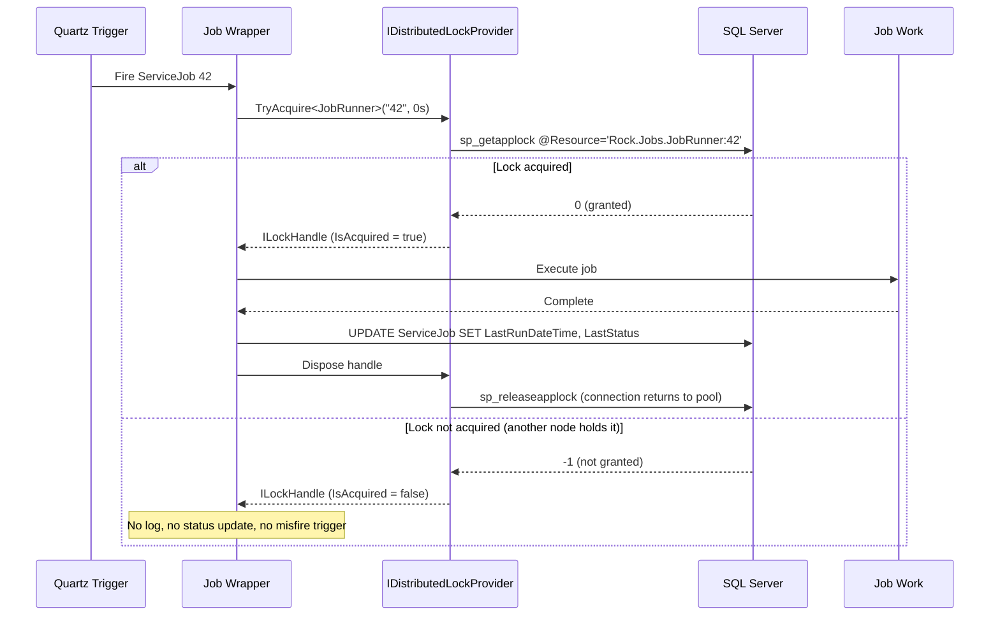

# Distributed Locking

## Summary

Rock currently has no cross-node coordination primitive. This forces two operational constraints: only one Rock instance in a farm may be configured as the Job Server, and even that single scheduler is subject to duplicate job execution during IIS app pool overlapped recycles. This spec proposes introducing a general-purpose distributed lock layer backed by SQL Server application locks (`sp_getapplock` via the `DistributedLock.SqlServer` package), used first for per-job locking in the scheduler and available for future subsystems that need cross-node coordination.

## Motivation

Two concrete problems drive this work.

**Duplicate job execution during app pool recycles.** IIS periodically recycles the Rock app pool (typically every 24 hours). During an overlapped recycle, the outgoing app pool continues running while the incoming one starts. If a Quartz job fires during this overlap, both instances can pick it up and run it simultaneously. This has caused real production incidents where jobs that mutate state (send communications, post transactions, run integrations) executed twice.

**Single-point-of-failure job server.** Rock's current mitigation for cross-node coordination is a configuration rule: "only one Rock instance may be marked as the Job Server." This works but has costs. If the job server node dies, all scheduled work stops until an operator promotes another node. There is no automatic failover, and no ability to spread scheduled work across the farm even when the work would benefit from it.

A distributed lock primitive solves both. Per-job locking eliminates the shutdown-overlap window because both the outgoing and incoming schedulers race for the same lock and only one wins. It also removes the "one job server" rule, allowing every node in the farm to run the scheduler with automatic failover and load spreading.

Beyond the scheduler, other Rock subsystems need similar coordination. The most immediate example is communication sending, where a communication row must be processed by exactly one node at a time. Building a general primitive now avoids reinventing this per subsystem later.

## Requirements

- Rock MUST provide a reusable distributed lock API that can be acquired and released from any Rock instance and coordinates across all instances in a farm.
- The lock API MUST be exposed as a DI-registered interface (singleton lifetime) so that consuming code can obtain it via constructor injection or `RockApp.Current.GetRequiredService<...>()`, and so that test doubles can be substituted in unit tests.
- The lock MUST be automatically released if the holding process crashes or its connection is severed (no manual cleanup, no stale locks after failure).
- The lock API MUST support a caller-supplied acquisition timeout, including `TimeSpan.Zero` for "try acquire, skip if unavailable."
- The lock API MUST namespace every lock key so that unrelated subsystems cannot collide. Namespacing MUST be owned by the provider, not by callers: the caller supplies a marker type and a resource identifier, and the provider derives the full lock key from both. Callers MUST NOT be able to opt out of the namespacing scheme.
- The Quartz job pipeline MUST wrap each job execution in a per-job lock keyed by `ServiceJob` identity. Losing the race MUST result in a silent skip (not a failure) and MUST NOT update `LastRunDateTime` / `LastStatus` or trigger Quartz misfire handling.
- Only the lock winner MAY update the winning job's `ServiceJob` run history columns.
- The "only one job server" configuration rule SHOULD become optional. Farms that opt into multi-node scheduling MUST work correctly without manual coordination.
- Long-held lock connections MUST survive Azure SQL's 30-minute idle TCP timeout via TCP keepalive or periodic connection pings.
- The lock layer MUST use a single dedicated `SqlConnection` pool for lock-holding connections, identified by a distinct `Application Name`, so that lock-holding connections cannot starve Rock's default EF connection pool. Per-subsystem pool isolation is out of scope for this spec.
- Callers MUST be able to identify lock activity from SQL Server's session-management views (`sys.dm_exec_sessions`) via `program_name`.

## Design

### Package and abstraction

Rock will take a dependency on `DistributedLock.SqlServer`. The package wraps SQL Server's `sp_getapplock` / `sp_releaseapplock` and returns a disposable handle whose lifetime represents lock ownership. When the underlying `SqlConnection` closes (crash, network drop, pool disposal), SQL Server releases the applock automatically. This is the property that eliminates the need for stale-lock cleanup.

All published versions of the package depend on `Microsoft.Data.SqlClient`, while Rock on .NET Framework 4.7.2 uses `System.Data.SqlClient` for EF6. The two drivers coexist in the process without functional issue: their `SqlConnection` types are not interop-compatible, but no Rock code path passes a lock connection to EF6 or vice versa. Connection pools are already separate because they are keyed by driver, so the `Application Name` recommendation below still holds. On the observability side, both drivers publish to the same `.NET Data Provider for SqlServer` PerformanceCounter category with matching counter names, so Rock's existing `rock.database.connections.pooled` gauge automatically aggregates both drivers — no observability code change is needed.

Rock will not expose `DistributedLock.SqlServer` types directly. Instead, an internal service (working name: `IDistributedLockProvider`) wraps the library so that:

1. Callers do not have to manage `SqlConnection` lifetimes or know about `Application Name` conventions.
2. Rock can swap the underlying implementation in the future (e.g. to `Microsoft.Data.SqlClient`, `DistributedLock.Redis`, or another provider) without a public API change.
3. Lock keys are namespaced consistently and cannot collide across subsystems, without callers having to remember naming conventions.
4. The service can be substituted with a test double, making distributed-lock-using code straightforward to unit test.

The service is registered in Rock's DI container as a singleton. Callers obtain it via constructor injection where supported, or via `RockApp.Current.GetRequiredService<IDistributedLockProvider>()` for code paths that cannot yet participate in constructor injection (WebForms code-behinds, legacy statics, etc.).

The types live under the **`Rock.Bus.Locking`** namespace (source at `Rock/Bus/Locking/`), colocated with the message bus rather than in a new top-level namespace. Rock.Bus is Rock's existing home for cross-node coordination infrastructure; distributed locks are a peer coordination primitive to the message bus (mutual exclusion alongside asynchronous messaging), so they fit as a sibling to `Rock.Bus.RockMessageBus` rather than as a separate top-level namespace.

Sketch of the interface (illustrative, not final):

```csharp
public interface IDistributedLockProvider
{
    ILockHandle TryAcquire(
        Type markerType,
        string resourceId,
        TimeSpan timeout );

    Task<ILockHandle> TryAcquireAsync(
        Type markerType,
        string resourceId,
        TimeSpan timeout,
        CancellationToken cancellationToken = default );
}

// Intentionally general-purpose: any lock mechanism Rock might expose in the
// future (in-process, database-row, distributed) can share this handle shape.
public interface ILockHandle : IDisposable
{
    bool IsAcquired { get; }
    CancellationToken LostToken { get; }
}

public static class DistributedLockProviderExtensions
{
    public static ILockHandle TryAcquire<T>(
        this IDistributedLockProvider provider,
        string resourceId,
        TimeSpan timeout )
        where T : class
        => provider.TryAcquire( typeof( T ), resourceId, timeout );

    public static Task<ILockHandle> TryAcquireAsync<T>(
        this IDistributedLockProvider provider,
        string resourceId,
        TimeSpan timeout,
        CancellationToken cancellationToken = default )
        where T : class
        => provider.TryAcquireAsync( typeof( T ), resourceId, timeout, cancellationToken );
}
```

The **`Type` overload is the primitive**; the generic overload is a thin extension-method wrapper that resolves `typeof( T )` and delegates. Both surfaces enforce the same runtime rejection of generic types (see next subsection). Two call-site shapes are supported:

**Compile-time marker (typical case):**

The `Rock.Jobs.JobRunner` type shown here (and in the sequence diagram below) is illustrative only — no such type is introduced by this spec. Per the Selection guidance below, the actual marker is whichever class in the scheduler pipeline acquires the lock. The scheduler implementation spec picks it.

```csharp
using ( var handle = _lockProvider.TryAcquire<Rock.Jobs.JobRunner>(
    job.Id.ToString(),
    TimeSpan.Zero ) )
{
    if ( !handle.IsAcquired )
    {
        // Another node holds the lock. Skip silently.
        return;
    }

    // Do the work.
}
```

**Runtime marker via `this.GetType()` (base classes):**

```csharp
public abstract class CommunicationSender<TProvider>
{
    private readonly IDistributedLockProvider _lockProvider;

    protected CommunicationSender( IDistributedLockProvider lockProvider )
    {
        _lockProvider = lockProvider;
    }

    public void Send( int communicationId )
    {
        // this.GetType() returns the concrete derived type
        // (SmsCommunicationSender, EmailCommunicationSender, etc.),
        // giving a per-derived-class lock namespace without
        // duplicating the lock wrapper in each subclass.
        using ( var handle = _lockProvider.TryAcquire(
            this.GetType(),
            communicationId.ToString(),
            TimeSpan.Zero ) )
        {
            if ( !handle.IsAcquired ) return;
            // Send.
        }
    }
}
```

`TryAcquire` returns a handle whose `IsAcquired` is `false` when the lock could not be obtained within the timeout. Callers check `IsAcquired` and skip cleanly rather than throwing. `LostToken` fires if the underlying connection dies while the lock is held, so long-running work can observe that its lock has been lost.

### Lock key namespace

The provider builds the full `sp_getapplock` resource name from the marker type and the caller's `resourceId`:

```
{typeof( T ).FullName}:{resourceId}
```

Rules the provider enforces at the API boundary:

- **Marker type must be non-generic.** `typeof( T ).IsGenericType == true` throws `ArgumentException`. Rationale: `typeof( Foo<Bar> ).FullName` embeds the type argument's assembly-qualified name including `Version=` and `PublicKeyToken=`, which changes across Rock versions and can push past the 255-character SQL Server limit. During a rolling upgrade, two nodes on adjacent Rock builds would generate different keys and fail to coordinate.
- **Marker type name uses `FullName`.** For a non-generic type this yields `Namespace.Name` (e.g. `Rock.Jobs.JobRunner`) and for a nested non-generic type it yields `Namespace.Outer+Inner` — both stable, unambiguous, and free of assembly-qualified metadata. `AssemblyQualifiedName` is deliberately NOT used because it includes `Version=` and `PublicKeyToken=` which change across Rock builds.
- **`resourceId` is caller-supplied but validated.** It MUST be printable ASCII (letters, digits, hyphen, underscore, period, colon; no whitespace) and MUST NOT push the full lock key past 255 characters. Non-ASCII or oversized inputs throw at the API boundary rather than silently triggering the library's SHA512 fallback (which would destroy the readability of `sys.dm_tran_locks.resource_description`).
- **Total key length is capped at 255 characters.** This matches SQL Server's `sp_getapplock @Resource nvarchar(255)` limit and is comfortably above realistic use (`Rock.Model.Communication:{guid-36}` is 60 chars).

The marker type name is a **wire format**. Renaming or moving a marker type is a breaking change: during a rolling upgrade window, nodes on the old and new builds will produce different lock keys and fail to coordinate. For most subsystems (jobs that re-fire on schedule, work items that get retried) this manifests as a single duplicate execution during the upgrade window and never again, which is acceptable but should be documented alongside each marker type.

**Selection guidance.** The canonical pattern is: **the class that acquires the lock uses itself as the marker.** In practice:

- Instance method takes a lock → use `this.GetType()`. In a base class this gives the concrete derived type, which is usually the semantically correct scope.
- Static method takes a lock → use `typeof( ContainingClass )`.
- Compile-time-known marker (e.g. from an unrelated caller wrapping another subsystem's work) → use the generic `TryAcquire<T>` form with the class doing the acquiring as `T`.

This convention keeps the marker colocated with the code that owns the coordination decision, so anyone renaming that class sees the marker at the same time and can weigh the rolling-upgrade cost.

### Connection pool

All lock-holding connections use a single dedicated `SqlConnection` pool, built from Rock's primary connection string with an overridden `Application Name`:

```
Server=...;Database=Rock;Application Name=RockDistributedLock;Max Pool Size=50;...
```

Because `SqlConnection` pools are keyed by the full connection string, changing `Application Name` yields a separate pool from Rock's default EF pool. Held lock connections cannot starve web request or EF workloads, and lock sessions are trivially identifiable in `sys.dm_exec_sessions` by filtering `program_name = 'RockDistributedLock'`.

**Default pool size: 50 per Rock instance.** This is enough for realistic near-term concurrent lock counts (Quartz jobs typically 10-25 concurrent, plus communication sending) with modest growth headroom, while keeping the farm's total lock-session footprint conservative against smaller Azure SQL tiers. Pool size is configurable via a `web.config` app setting (working name: `RockDistributedLockMaxPoolSize`); operators expecting heavier lock use (large-scale communication batching, many bespoke locked subsystems) can raise it, and operators on tight Azure SQL tiers can lower it.

### Sequence for a locked Quartz job



### Failure modes and how they are handled

| Failure | Behavior |
|---|---|
| Holding node crashes mid-job | Connection closes, applock releases automatically. Next scheduled fire on any node acquires the lock and runs. |
| Azure SQL failover mid-job | Same as crash: connection dies, lock releases. `LostToken` fires on the losing side so long-running work can abort. Next fire picks up. |
| Client-side pool exhaustion (`Max Pool Size` reached) | `SqlConnection.Open` waits up to `Connection Timeout`, then throws. Provider returns `IsAcquired = false` **and logs an Error** so this does not silently manifest as job skips. Operator alerting on session-count metrics catches it earlier. |
| Azure SQL tier connection limit reached | `SqlException` with error 10928 on `Open`. Provider returns `IsAcquired = false` **and logs an Error**. Operator alerting catches it earlier. |
| TCP idle timeout on Azure | Mitigated by TCP keepalive; `DistributedLock.SqlServer` also performs periodic connection pings for session-scoped locks. |
| Two nodes race for the same key | `sp_getapplock` serializes them at the SQL Server side. Winner returns 0 (granted), loser returns -1 (timeout / not granted at zero wait). No double execution. Loser gets `IsAcquired = false` silently (no log). |
| `sp_getapplock` returns -3 (deadlock victim) | Rare because applocks do not participate in normal lock waits, but possible when combined with schema locks during migrations. Provider returns `IsAcquired = false` **and logs an Error**. |
| `sp_getapplock` returns -999 (parameter or other error) | Indicates a programmer error in the provider (bad `@LockMode`, `@LockOwner`, malformed resource string). Provider throws — this should never surface in production and MUST fail loudly. |

### Runtime behavior

**Logging levels.** The provider emits one log entry (or none) per acquisition outcome. Levels are chosen so that normal multi-node contention is silent and only true problems reach operators:

| Outcome | Log |
|---|---|
| Successful acquisition | None |
| Contention loss (`TryAcquire` returned `IsAcquired = false` after a clean SQL round-trip) | None |
| Infrastructure failure (pool exhausted, tier limit hit, unexpected `SqlException` on `Open`, `sp_getapplock` returned -3) | Error |
| Lock lost mid-hold (`LostToken` fires because the connection died while the lock was held) | Warning |
| Programmer error (`sp_getapplock` returned -999 or an argument-validation failure at the API boundary) | Error, plus throw |

Contention loss is deliberately silent because it happens on every scheduled fire in a multi-node farm. Infrastructure failure and programmer errors are Errors so operators see them prominently; lock-lost is a Warning because it can happen legitimately during Azure SQL failovers and doesn't necessarily indicate an operator-actionable fault. Logging domain: `RockLogDomains.Core` unless a case arises during implementation for a dedicated domain.

**Reentrancy.** If a caller attempts to acquire a lock that is already held by the same session, the provider throws `InvalidOperationException` (or a dedicated `RockDistributedLockReentrancyException`, TBD during implementation). None of the near-term use cases need reentrancy, and silently succeeding on a re-acquire could mask coordination bugs where a caller acquires the same lock twice under the mistaken belief that the second acquisition was a fresh guarantee. `sp_getapplock` returns 1 for "already held," so the provider detects the case cleanly and can convert it to the exception without additional bookkeeping.

### Quartz job integration

The scheduler consumes the primitive via `ITriggerListener.VetoJobExecution`, not inside `IJob.Execute`. If acquisition fails, the listener vetoes the fire. In Quartz 2.x, a vetoed execution does not consult the misfire instruction, does not fire `TriggerMisfired`, and does not throw; Quartz calls `IJobListener.JobExecutionVetoed`, computes the trigger's next fire time as if the fire had completed normally, and moves on. This sidesteps Quartz's misfire policy entirely.

Per-job locking is **implemented as part of this spec** — it is the primary consumer that validates the primitive and delivers the shutdown-overlap and farm-dedup benefits that motivated the work. Communications and other future subsystems adopt the lock in their own specs, but the scheduler wiring lands here.

The design:

- **Marker type.** The scheduler pipeline uses whichever class in the pipeline owns the lock acquisition as its marker (per the Selection guidance under Lock key namespace). In practice this is the class that hosts the `ITriggerListener` implementation.
- **Resource id.** The `ServiceJob.Id` value (as its string form) is the resource id. This gives one lock namespace per configured job.
- **Handle lifetime across the veto → execute boundary.** The `ILockHandle` is stored on `JobExecutionContext` via `Put(key, handle)` in the veto handler when acquisition succeeds, then retrieved and disposed in a `finally` at the end of the job's execution wrapper. Rock uses RAMJobStore, so the context is in-process and non-serialized; passing an `IDisposable` on it is safe. The alternative (a sidecar `ConcurrentDictionary<FireInstanceId, ILockHandle>`) was considered and rejected as adding state to manage without a corresponding benefit. Acquire-twice (veto acquires and disposes, execute re-acquires) is rejected because the release-and-reacquire window creates a race in which another node could win between the two calls.
- **Loser visibility.** The vetoed path MUST NOT surface as an error or a "skipped" status in Rock's Job Detail / `ServiceJob` run history. Only the winner updates `LastRunDateTime` and `LastStatus`. The loser's outcome is identical to a job that simply was not scheduled on this node — no history row, no log line, no metric increment.
- **Mid-execution lock loss.** If `LostToken` fires while `Execute` is running, the provider logs at Warning per the Runtime behavior table. The job is not aborted; it runs to completion and may duplicate work another node has since started. When Rock moves to async jobs, `LostToken` will wire into the job's `CancellationToken` so it can unwind cooperatively at its next safe stopping point.
- **Quartz 2.0.0 sanity check.** The `VetoJobExecution` API is stable across Quartz 2.x, but the implementation verifies the exact behavior against Rock's pinned Quartz 2.0.0 in the Verification Steps below before shipping.

### Guidance on when to use a lock vs. a claim

Distributed locks are the right tool for coordinating access to a shared resource during an operation. They are not the right tool for durable "has this been done" state. For subsystems that process many items (communications, workflow triggers, indexing), the pattern is:

1. The item's row carries state columns (`SendStartedDateTime`, `SendCompletedDateTime`, etc.) that record whether the work has happened.
2. The item is claimed and processed under a per-item distributed lock so that only one node touches it at a time.
3. The state columns are updated only from inside the lock, so the "processed exactly once (barring mid-work crashes)" property falls out of "processed by one node at a time" plus "state is written from inside the lock."

This composition is what the communication use case wants: the lock enforces single-node processing, and the state column enforces durability. The spec calls this out so the same pattern is reused in every subsystem instead of being reinvented.

### Rollout

- Land the `IDistributedLockProvider` service, its default SQL Server-backed implementation, and its DI registration in a single change so that per-job locking is active from the first deploy. No opt-in flag; the default behavior of a Rock upgrade is that per-job locking is on.
- Provide a `web.config` app-setting kill switch (working name: `DisableDistributedLocking`) that, when set to `true`, registers a no-op `IDistributedLockProvider` in place of the SQL Server implementation. This is a break-glass mechanism for the case where distributed locking causes an unexpected production regression; it is not intended for normal operation, and installations SHOULD NOT set it as part of routine configuration.
- The no-op provider MUST behave as if every acquisition succeeded: `TryAcquire` returns an `ILockHandle` with `IsAcquired = true`, `LostToken = CancellationToken.None`, and a `Dispose` that does nothing. This restores Rock's pre-spec behavior (no cross-node coordination) so operators can disable locking without also disabling the code paths that depend on the lock.
- The "one job server only" configuration rule remains supported (opt-out of multi-node scheduling) but is no longer required for correctness once distributed locking is active.
- The Quartz job wiring (per the Quartz job integration subsection above) lands in the same change as the primitive itself. This is what validates the primitive end-to-end and delivers the motivating benefits.
- Communications and other subsystems adopt the lock in subsequent specs.

## Out of Scope

- Per-subsystem connection pool isolation. All lock-holding connections share a single dedicated pool identified by `Application Name=RockDistributedLock`. Splitting the pool by subsystem is deferred until concrete pressure justifies it.
- Adoption of the primitive by subsystems other than the Quartz scheduler. Communications, workflow triggers, indexing, and other candidate consumers each get their own spec that references this one for the primitive.
- Migration to a non-SQL-Server lock backend (Redis, Postgres, ZooKeeper). The `IDistributedLockProvider` interface is designed to allow such a swap in the future, but this spec ships only the SQL Server implementation.
- New observability metrics or dashboards. Rock's existing `rock.database.connections.pooled` gauge captures the primary health signal for the lock connection pool; no new metric is introduced here.
- Migration of Rock from `System.Data.SqlClient` (EF6) to `Microsoft.Data.SqlClient`. The two drivers coexist in the same process; broader driver migration is a separate topic.
- Migration of Quartz jobs to an async execution model. This spec assumes sync `IJob.Execute` throughout; the async future is noted where relevant but not designed here.

## Verification Steps

1. **Two-node contention.** Deploy the provider to two Rock instances against a shared database. Have each simultaneously call `TryAcquire<SomeMarker>("42", TimeSpan.Zero)`. Confirm exactly one node's handle returns `IsAcquired = true` and the other returns `IsAcquired = false` with no logs, no throws, no updates to persistent state.
2. **Automatic release on crash.** Acquire a lock from a Rock instance, then hard-kill the process. Immediately attempt acquisition from another Rock instance and confirm the lock is available. Verify `sys.dm_tran_locks` shows no orphaned entry after the kill.
3. **Reentrancy rejection.** From a single Rock instance, acquire a lock and then attempt to acquire the same lock (same marker + resource id) from the same code path. Confirm the second acquisition throws.
4. **Resource ID validation.** Call `TryAcquire` with a resource id containing non-ASCII characters or a value that pushes the total key past 255 characters. Confirm the provider throws at the API boundary without hitting SQL Server.
5. **Generic marker rejection.** Call `TryAcquire<Dictionary<string, int>>(...)`. Confirm the provider throws `ArgumentException`.
6. **No-op provider fallback.** Set `DisableDistributedLocking=true` in `web.config`. Confirm the no-op provider is registered, every `TryAcquire` returns `IsAcquired = true`, and `Dispose` is a no-op. Confirm Rock's pre-spec behavior is restored (Quartz jobs run without cross-node coordination).
7. **Observability aggregation.** With locks held on the `RockDistributedLock` pool and active EF6 workload on the default pool, confirm `rock.database.connections.pooled` reports the aggregate of both pools (not just one).
8. **Session identifiability.** Query `sys.dm_exec_sessions` and confirm lock-holding sessions are visible via `program_name = 'RockDistributedLock'`, distinct from EF6 sessions.
9. **Azure SQL idle timeout survival.** Hold a lock for more than 30 minutes on an Azure SQL instance. Confirm the connection remains alive (via `DistributedLock.SqlServer`'s keepalive) and the lock is not silently released.
10. **Two SqlClient drivers coexist.** Confirm no runtime errors when EF6 (`System.Data.SqlClient`) and lock-holding connections (`Microsoft.Data.SqlClient`) both execute against the same database concurrently. Confirm `SqlConnection` instances from the two libraries are never passed across their API boundary.
11. **End-to-end Quartz shutdown-overlap.** With two Rock instances configured to fire the same Quartz job at the same time (mimicking the IIS overlapped-recycle window), confirm exactly one instance executes the job. The loser's Quartz calls `JobExecutionVetoed`; no `ServiceJob` history row is written for the vetoed fire, and no error surfaces in the Job Detail UI. The winner's `LastRunDateTime` and `LastStatus` update normally.
12. **End-to-end Quartz misfire non-triggering.** With a Quartz trigger configured with a misfire instruction (e.g. `MISFIRE_INSTRUCTION_FIRE_ONCE_NOW`), veto the fire via lock contention and confirm the misfire instruction is NOT consulted, `TriggerMisfired` is NOT fired, and the next-fire calculation proceeds as if the fire had completed normally.
13. **Handle lifetime through veto → execute.** Instrument a job to log its start and end. Confirm the lock is acquired in the veto handler, the `JobExecutionContext.Put/Get` round-trip returns the same handle instance to `Execute`, and the handle is disposed in the wrapper's `finally` (before Quartz records the job's completion).

## Considered but Rejected

### Lock around the entire Job Service (service-wide leader lock)

Hold one long-lived lock for the entire lifetime of the Job Service on each Rock instance. Only the winner runs the scheduler; the others block indefinitely until the winner's connection closes.

Rejected. It solves the shutdown-overlap and farm-dedup problems but keeps Rock's current single-scheduler model with all its downsides: no automatic failover parallelism, and a complex lock-loss recovery path (what does the scheduler do if it discovers mid-run that its lock was released by a network blip?). It also requires a distinct startup state machine to handle "lock not available yet, retry until it frees" during app pool overlap. Per-job locking has none of these complications and gives multi-node scheduling for free.

### Quartz.NET clustered mode (AdoJobStore)

Quartz 2.x supports clustering via `AdoJobStore` with row-level coordination on its own `QRTZ_*` tables.

Rejected. Rock does not use `AdoJobStore`. Scheduling authority lives in Rock's own `ServiceJob` table, and Quartz is effectively just the trigger engine. Retrofitting Rock onto AdoJobStore would be a substantial refactor that changes how jobs are defined, stored, and administered. Per-job distributed locking on top of the existing `ServiceJob` model achieves the same operational outcome with a fraction of the change.

### Homegrown lock table (row in a `Locks` table with a lease timestamp)

Model a lock as a row in a Rock-owned table with a lease expiration timestamp; renew the lease periodically; other nodes recognize the lock as free if the lease has expired.

Rejected. Reinvents what `sp_getapplock` gives us natively. Requires background lease renewal (which competes for the same connection resources anyway), stale-lock cleanup logic, and careful handling of clock skew across farm nodes. SQL Server applocks release automatically on connection close with no cleanup required, no clock dependency, and no lease renewal thread. There is no reason to build the harder version.

### Advisory guidance without a real primitive (documentation only)

Document the shutdown-overlap risk and tell operators to configure IIS to disable overlapped recycles, without any code-level lock.

Rejected. Puts the burden on every Rock operator to configure IIS correctly and does nothing about the farm-dedup or single-scheduler-failure problems. Does not compose across the other subsystems (communications) that need the same primitive.

## Related

- [`DistributedLock.SqlServer` documentation](https://github.com/madelson/DistributedLock/blob/master/docs/DistributedLock.SqlServer.md) — the underlying package.
- [`DistributedLock` repository](https://github.com/madelson/DistributedLock) — top-level project, including Redis and Postgres backends referenced as future portability options.
- [Rock/Bus/Locking/](Rock/Bus/Locking/) — the primitive's source location. Colocated with `Rock/Bus/RockMessageBus.cs` because both are cross-node coordination infrastructure.
- [Rock/Observability/RockMetricSource.cs](Rock/Observability/RockMetricSource.cs) — the existing observability code that already aggregates the lock connection pool's activity into `rock.database.connections.pooled` via `CreateSqlPoolConnectionsCounter`. No changes needed here.
- [Microsoft Learn — `sp_getapplock` reference](https://learn.microsoft.com/en-us/sql/relational-databases/system-stored-procedures/sp-getapplock-transact-sql?view=sql-server-ver17) — return codes, lock modes, lock owners.
- [Microsoft Learn — Performance counters in SqlClient](https://learn.microsoft.com/en-us/sql/connect/ado-net/performance-counters?view=sql-server-ver17) — confirms the shared PerformanceCounter category name used by both SqlClient drivers.
- Quartz.NET 2.x documentation on `AdoJobStore` clustering (referenced for the "considered but rejected" comparison, not adopted).
- `.claude/rules/data-model.md` — the general convention that connection lifetimes must not outlive their intended scope; this spec is the exception, and the provider encapsulates it.
