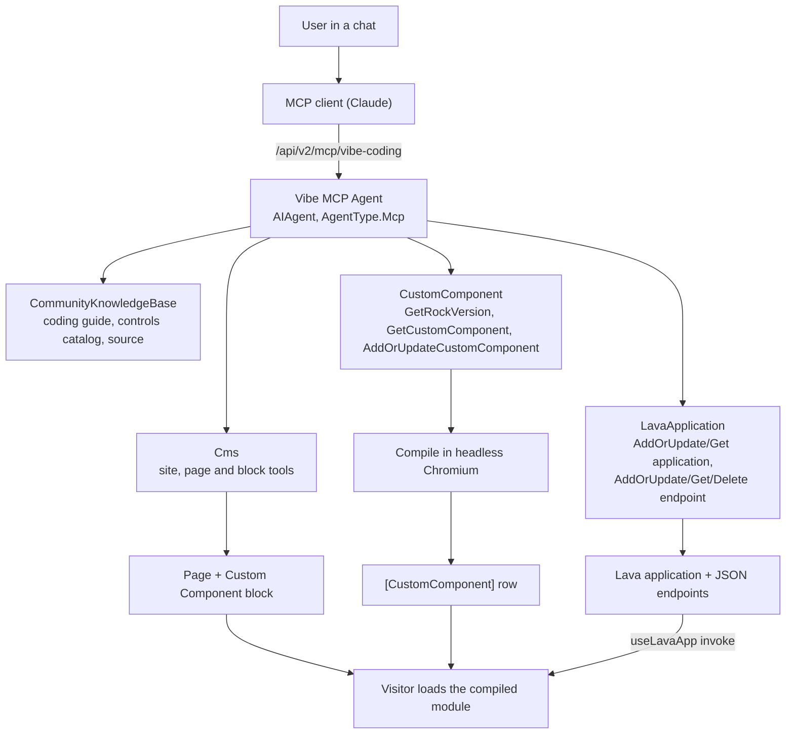

# Vibe Coding: AI-Authored Custom Components

## Summary

An administrator says "build me a serving dashboard" in a chat. An external MCP client (Claude) creates a page, drops one block on it, writes Lava endpoints for the data, writes a Vue single-file component, and saves it. Rock compiles the component server side and stores it. Every visitor to that page then loads a precompiled, framework-native Obsidian component.

No repository file. No Rock build. No deployment.

This spec is written to be implemented from scratch on a branch off `develop`. It consolidates and supersedes the six exploratory specs listed under [Related](#related), and folds in the measurement work that reversed two of their decisions.

This revision also locks in three rebuild decisions from the branch retrospective: the agent skills move to the established `Rock.AI.Agent/Skills/` conventions (the exploration built them loose in the `Rock` project), all schema and seeding ship in one EF migration (the exploration used an EF migration plus a plugin hotfix), and the block editor drops its live preview so the server compile is the only compile path.

## Motivation

Two capabilities already exist in Rock and have never been connected.

Rock is already an MCP server: agents expose skills as tools at `/api/v2/mcp/{slug}`, and the ChatAgent and skill runtime is a transport-agnostic execution layer. Separately, Obsidian can already load a compiled Vue component at runtime through its SystemJS loader.

The gap is who can use the second one. Building custom UI in Rock today requires a developer: a repository checkout, knowledge of which of Rock's 247 Obsidian controls exist, knowledge of which API returns the data, and the ability to hand-write correct Vue. That is precisely the work an AI client is good at, and precisely what MCP was added to enable.

The payoff is disproportionate to the new surface because the hard rendering problem is already solved. Most of this work is orchestration and a safe compile, not new rendering technology.

## Requirements

### Authoring loop

- The client MUST be able to run the whole loop from one user intent: clarify, place, write data, write component, compile, save.
- The client MUST be able to re-read what it stored and replace it, so it can iterate.
- Every write MUST return either success or an error the agent can act on. Silent partial success is the failure mode this feature exists to eliminate.
- Clarifying-question behavior MUST live in the agent's `Instructions`, not in a tool.
- An administrator MUST still be able to view and edit source in the block itself, with a code editor only. The editor and the agent MUST share one save-and-compile path.

### Compilation

- Rock MUST compile authored source itself. A client with no repository and no JavaScript runtime MUST get a real compile result.
- The server compile MUST be the only compile path. No compiler ships to the browser; the editor sends source and displays the server's result.
- Callers MUST NOT be able to supply compiled output. `CompiledContent` is written only by the server compile, so the stored source is always what executes.
- Compilation MUST NOT be able to take down the Rock worker process.
- A failed compile MUST store nothing and MUST return the compiler's own error text.

### Data

- An authored component MUST be able to fetch data shaped for exactly what it renders.
- The client MUST NOT have to discover existing REST endpoints.
- Every endpoint write MUST test-execute the template and return the result, EXCEPT where the template can write (see [Traps](#traps)).

### Security

- Every authoring tool MUST be gated on the same authorization as the in-browser edit path: administrator only.
- Authorization MUST use the acting person from `AgentRequestContext`, never a service account.
- Visitors MUST receive only compiled output. Authored source MUST require EDIT.

### Deployment and conventions

- The feature MUST add no new runtime dependency that is not already shipped.
- All schema and seeding MUST ship in a single EF migration. No plugin hotfix, no second migration.
- Seeding MUST be idempotent, MUST NOT overwrite administrator customization, and MUST survive startup re-registration unchanged (see layer 7).
- The agent skills MUST follow the established `Rock.AI.Agent/Skills/` conventions in full (see layer 6).

## Design

### The shape



**Rock is the MCP server, not the AI.** No model runs inside Rock. Rock's contribution is tools with honest descriptions, real authorization, and feedback loops that fail loudly.

### Build order

Each layer is independently testable and depends only on those above it.

| # | Layer | Proves |
|---|---|---|
| 1 | Data model and migration | A row can hang off a block placement |
| 2 | Shared compiler bundle | Source becomes a loadable module |
| 3 | Block, editor and render path | A human can author in place |
| 4 | Server-side compile | A repo-less client can compile |
| 5 | Lava endpoint data | A component can fetch what it renders |
| 6 | Agent skills | An AI client can drive the whole loop |
| 7 | Agent seeding | It ships preconfigured |
| 8 | External render endpoint | It works on instances with no local browser |
| 9 | Internal chat agent | An administrator can vibe-code from Rock's own chat, no external client |

Layers 1 and 7 ship in the same EF migration. Scaffold the migration once, late, after the skills exist, so the table creation and the seeding land as one file with one timestamp that sorts after every existing migration.

**All nine layers are built.** The core `CommunityKnowledgeBaseSkill` closed the chat agent's control-discovery gap: the migration seeds it (core only startup-registers it, which runs after migrations) and attaches it to **both** agents, so neither transport needs a second MCP server for control discovery anymore.

### Layer 1: Data model

One table, one row per block placement, following the `HtmlContent` pattern.

`Rock/Model/CMS/CustomComponent/CustomComponent.cs`, EntityType `38F182A7-9FE4-4D7B-B483-59F615BDE41C`.

| Column | Type | Notes |
|---|---|---|
| `BlockId` | `int` null | Owning placement. **Cascade delete**, a deliberate exception to Rock's default: a per-instance row has no meaning without its block. Null reserves a future shared library. |
| `Source` | `nvarchar(max)` | The authored Vue. Source of truth for editing and recompiling. |
| `CompiledContent` | `nvarchar(max)` | The SystemJS module browsers load. |
| `CompiledVueVersion` | `nvarchar(50)` | For deciding a post-upgrade recompile. |
| `CompiledDateTime` | `datetime` null | Stamped on save. |
| `Name`, `IsActive` | | Unused. For the future library. |

Service exposes exactly two methods, `GetByBlockId` and `GetOrCreateByBlockId`. **Both write paths go through the second**, so there is one upsert.

The EF migration must register the block's EntityType explicitly before calling `AddOrUpdateEntityBlockType`, because startup EntityType registration runs *after* migrations. Use the entity-based helper. Do not use `UpdateBlockTypeByGuid`, which deletes by path and can wipe every entity-based block type.

The migration also registers the `Rock.Model.CustomComponent` EntityType itself (`SystemGuid.EntityType.CUSTOM_COMPONENT`, `38F182A7-9FE4-4D7B-B483-59F615BDE41C`), matching the code-generated service class, and carries the layer 7 seeding. The exploration branch's migration carried a stale timestamp that sorted before seven later migrations, which breaks the model-compatibility snapshot; scaffolding fresh at the end of the build avoids that class of problem.

### Layer 2: Shared compiler bundle

`Rock.JavaScript.Obsidian/Framework/Libs/customComponentCompiler.ts`, built to `~/Obsidian/Libs/customComponentCompiler.js`.

**One implementation, one host.** Only the server runs the bundle. The browser never loads a compiler; the editor sends source to the block's save action and displays the server's result. (An earlier iteration also loaded this bundle in the browser for a live preview; see [Considered but Rejected](#considered-but-rejected).)

What it does, in order:

1. `parse()` the SFC into a descriptor. Parse errors stop here.
2. Hash the source into a scope id, for scoped styles and style-tag deduplication.
3. `compileScript(descriptor, { id, inlineTemplate: true })`. `inlineTemplate` compiles the template into the setup function's returned render function, producing clean strict-mode output rather than a `with (_ctx)` block.
4. `rewriteDefault()` turns `export default` into a local variable.
5. `compileStyle()` per style block, applying the scope id to scoped ones.
6. Extract the imports, then rebuild as a `System.register` module: dependency list, one setter per dependency, body, scope id, guarded style injection, `_export("default", ...)`.
7. `new Function("System", output)` to **parse** without running, so syntax errors surface now.

Output must be SystemJS, not ESM, because Rock resolves `@Obsidian/...` through a SystemJS alias map rather than a browser import map.

Two constraints in the bundle:

- **Source map generation disabled.** Introduced for Jint; harmless now, and maps were always discarded.
- **Vue version read from `@vue/compiler-sfc`'s own `version` export**, not an `import` from `vue`. Keeps the bundle self-contained with an empty `System.register` dependency array.

### Layer 3: Block, editor and render

`Rock.Blocks/Cms/CustomComponentDetail.cs`. EntityType `8C7E29E5-E2C5-4331-B7F7-06EF894E7316`, BlockType `D4A5F720-493C-4DE8-B4B6-D6667D7ED2A2`. Web sites only.

The security posture is one method: `CompiledContent` goes to every viewer; `Source` only when the person has EDIT.

Vue side, `Rock.JavaScript.Obsidian.Blocks/src/Cms/customComponentDetail.obs` plus partials for the edit panel and the view panel. The edit experience is deliberately small: a code editor, save and cancel, and a notification box for compile errors. There is no live preview, no in-browser compiler, no sandboxed iframe, and no debounced compile loop. The exploration built all of those (roughly 360 lines plus an `allow-same-origin` sandbox caveat) and this rebuild drops them.

Save sends `Source` only. The block action compiles through the layer 4 service, stores source and compiled output together on success, and on failure stores nothing and returns the compiler's error text for the notification box. This is the same code path `AddOrUpdateCustomComponent` uses, so the human editor and the agent exercise one compile-and-store implementation. If the compile browser is still provisioning, save reports a retryable condition, exactly as the skill does.

**Rendering runs the stored module by hand**: supply a fake `System` object to capture the registration, resolve each dependency through Rock's real loader, execute, mount. It cannot simply load a URL, because Rock's loader appends `.js` and `?fingerprint` to any path, which a `blob:` URL cannot carry.

No compiler ever loads in the browser.

### Layer 4: Server-side compile

`Rock/Cms/CustomComponentCompiler.cs`. Runs the bundle in a page of the headless Chromium Rock already manages for PDF generation, via PuppeteerSharp. It serves both writers: the block's save action (layer 3) and the agent's `AddOrUpdateCustomComponent` (layer 6).

**Nothing new is added to run it.** PuppeteerSharp and a pinned Chromium build already ship for `Rock/Pdf/PdfGenerator.cs`. Reuse the install path (`~/App_Data/ChromeEngine`) and call `PdfGenerator.BrowserVersion` so the pin lives in one place.

| Choice | Value | Why |
|---|---|---|
| Browser | Separate process from `PdfGenerator`'s | Shared install, but a wedged compile must not disturb statement generation |
| Browser lifetime | Long lived, relaunched when disconnected | Launching costs far more than opening a page |
| Page lifetime | Fresh page per compile, closed after | No state carries between compiles |
| Navigation | None, a blank page | No document needed, no network reachable |
| Timeout | 30 s | A pathological source cannot pin a page |
| Install | **Never downloaded from this path** | See below |

The page gets the same `System.register` shim the Jint host used, for the same reason: the bundle is SystemJS and a blank page has no loader. Then `EvaluateFunctionAsync<CompileOutput>("(src) => window.__exports.compileSource(src)", source)`, which serializes in and deserializes out as JSON.

**Why out of process is load bearing.** In-process, deeply nested source exhausted the stack, and a `StackOverflowException` cannot be caught in .NET: it terminated the worker and every request on the site. The stack that can be exhausted now belongs to a child process, so the same input closes a page and raises a catchable `TargetClosedException`. **Do not move compilation back in process.**

**Chromium is never installed from this path.** `PdfGenerator` downloads on demand, which is right for a background job. Here an agent is waiting on a tool call and the download is ~100 MB. A missing browser returns a distinct `IsBrowserMissing` result, and the skill tells the caller to retry once provisioning completes.

Provisioning normally needs no help: `Global.asax.cs` calls `PdfGenerator.EnsureChromeEngineInstalled()` on a background thread during `Application_Start`, so a fresh instance downloads Chromium on its own. `IsBrowserMissing` is therefore a transient race, hit only by compiling within a minute or two of a cold start. On an instance with an external render endpoint no local browser exists at all; [Layer 8](#layer-8-external-render-endpoint) honors that configuration by connecting to the remote browser instead.

`CompileSource` is synchronous and called from a synchronous tool; bridge with `AsyncHelper.RunSync`, as `PdfGenerator` does.

### Layer 5: Lava endpoint data

The component fetches through Lava endpoints the agent writes, not through discovered REST endpoints.

Three small changes to existing Lava application infrastructure:

- **`ContentType` on the endpoint** (`Rock/Cms/LavaEndpointAdditionalSettings.cs`, surfaced through `LavaEndpointCache` and the `LavaEndpointDetail` block). `LavaAppController` honors it, defaulting to `text/html` to preserve current behavior.
- **A non-200 status no longer discards the rendered body.** An endpoint returning JSON must be able to pair a 422 with a body the caller can read. The generic message is used only when the template emitted nothing.
- **`Rock.JavaScript.Obsidian/Framework/Utility/lavaApp.ts`**: `useLavaApp(slug)` and `invoke(endpointSlug, data, options)`. Returns the same shape as `invokeBlockAction`, sets the CSRF header, parses JSON when the endpoint still reports `text/html`.

`lavaApp.ts` ships as framework code deliberately, so a fix reaches components already compiled and stored in the database.

#### Observability for Lava endpoint calls (2026-08-24 meeting)

Rock already has an established two-sided pattern for tracing browser-initiated calls, and the Lava endpoint path has half of it.

**Server side, built.** `LavaAppController.SetupObservability` ([LavaAppController.cs:355](Rock.Rest/v2/LavaAppController.cs:355)) renames the request's root activity to `LavaEndpoint: {endpoint} | {application}` and tags it with `rock.lava_endpoint` and `rock.lava_application`, so endpoint traffic is identifiable in the trace viewer. It carries a private copy of `GetRootActivity` with an engineering note calling it temporary until `ObservabilityHelper.GetRootActivity` ([ObservabilityHelper.cs:390](Rock/Observability/ObservabilityHelper.cs:390), currently `internal`) can be made public. Decided 2026-08-24: the copy stays; it is five lines and promoting the helper to public is a bigger API commitment than the duplication warrants.

**Client side, the gap.** The established pattern is the W3C `traceparent` header. During page render, `RockBlockType` stamps a traceparent string into each block's config bag ([RockBlockType.cs:555](Rock/Blocks/RockBlockType.cs:555)); `rockBlock.partial.ts` sends it as the `traceparent` header on every block action call ([rockBlock.partial.ts:236](Rock.JavaScript.Obsidian/Framework/Templates/rockBlock.partial.ts:236)); and the `RockGateway` HttpModule parses the incoming header into an `ActivityLink` ([RockGateway.cs:471](Rock/Web/HttpModules/RockGateway.cs:471)), linking the browser request back to the page-render trace. `RockGateway` sees every request, including `/api/v2/lava-app/...`, so the server needs nothing new. But `useLavaApp` sends no `traceparent`, so a vibe component's data calls appear as unlinked root traces instead of joining the page view that triggered them.

**Requirement.** `useLavaApp` invocations MUST send the `traceparent` header the same way block actions do, so a component's endpoint calls link to the page trace.

**How the utility obtains the trace (decided 2026-08-24).** `parentTrace` lives on `ObsidianBlockConfigBag`, which `rockBlock.partial.ts` holds as a prop and does not expose: it provides only `configurationValues`, `blockActionUrl`, and the invoke functions to descendants. `rockBlock.partial.ts` additionally provides the traceparent string (for example `provide("blockParentTrace", ...)`), and `useLavaApp` injects it when called during component setup. Custom components mount inside the host block's tree, so injection reaches them, and every other framework utility gains access for free. Cost: `useLavaApp` becomes setup-only, which it effectively already is by convention. The alternative, taking the traceparent as an explicit option threaded by the caller, was rejected: authored components have no path to the value either, so it only relocates the problem.

### Layer 6: Agent skills

Three `AgentSkillComponent` subclasses. They compose by handing off identifiers: Cms returns a block `IdKey`, CustomComponent writes against it, LavaApplication feeds it.

Two revisions since this layer first shipped:

- **The Page skill was folded into the Cms skill and expanded to ten tools** (`AddPage` became `AddOrUpdatePage`, `AddBlock` became `AddOrUpdateBlock`, both keeping their tool GUIDs). That work is specified in [specs/260818-cms-agent-tool-suite.md](260818-cms-agent-tool-suite.md) and is built; this spec keeps only the summary rows below.
- **The Lava application becomes a first-class entity** with its own upsert and read tools, and the endpoint tool stops creating applications implicitly. Designed below; built.

**They are built to the established skill shape, not the exploration's.** The exploration placed them loose in the `Rock` project as monolithic files (`LavaApplicationSkill.cs` reached 1,243 lines) and diverged from the 21 shipped skills on nearly every convention. The rebuild follows the shipped pattern exactly:

- **Location**: `Rock.AI.Agent/Skills/`, namespace `Rock.AI.Agent.Skills` (file scoped), beside the existing 21. Typed result classes go in `Rock.AI.Agent/Classes/Skills/{SkillName}/`.
- **Shape**: `internal sealed partial class`. The skill file is a shell (fields, constructor, regions); each tool lives in its own partial file named `{Skill}.{ToolName}.cs`.
- **Constructor**: takes `ILogger<TSkill>`, null-guarded into `_logger`, handed to `AgentToolHelper`.
- **Class attributes**, in the established order: `[Description]`, `[AgentPurpose]`, `[AgentUsage]`, `[AgentSkillGuid]`, `[EntityTypeGuid]`. No `[AgentSkillName]`; nothing consumes it.
- **Tool attributes**: `[Description]` first on every tool method. This is load bearing: startup re-registration overwrites the stored tool description from that attribute, so a tool without one has its seeded description nulled on the next application start. Drop `[AgentToolName]` restating the method name; add `[AgentToolReturnDescription]` where the return shape is not obvious.
- **Parameters**: inline `[Description]` on parameters; XML doc comments are not compiled into the assembly and never reach the model. Update tools use `SetOrClear<T>` so "not supplied" and "clear it" are distinguishable. Tools with long behavior-parameter lists (the exploration's create-endpoint tool took 10 positional primitives) take a typed request object instead.
- **Verb vocabulary**: tool names use only the established verbs. Reads are `Lookup`, `List`, `Get`, or `Search`; writes are `AddOrUpdate`, `Update`, or `Delete`. No `Create`, `Find`, or `Set`, and write pairs follow the `AddOrUpdateX` plus `DeleteX` shape the shipped skills use.
- **Plumbing**: entity resolution, security checks, and error accumulation go through `AgentToolHelper` (`GetRequiredEntity<T>` with `checkSecurity: true`, `AddError`, `HasErrors`, `ErrorResult`, `SaveChangesIfNoErrors`). Errors accumulate rather than returning on the first, so the agent fixes a bad call in one round trip. `RockContext` comes from `AgentRequestContext.RockContext`, never `new RockContext()`. Integer-identifier acceptance follows the site's `DisablePredictableIds` setting consistently across all three skills.
- **Results**: typed classes deriving `EntityResultBase`, never anonymous types. Large payloads are trimmed into history with `.WithHistoryContent(...)`.
- **Naming**: startup registration derives each `AISkill.Name` from the class name split-cased and rewrites it on every start. Seeded names and descriptions (layer 7) must therefore match the class name and the class `[Description]` exactly, or the seeded values last only until the first restart.

| Skill | Skill GUID / EntityType GUID | Tools | Gate |
|---|---|---|---|
| Cms | `613D7110-6453-4BAB-892B-064222F8397C` / `7A63570D-6FC3-4573-BDF2-89CFF605D5AB` | Thirteen site, layout, page, and block tools, including `DeletePage` and `DeleteBlock`; see [specs/260818-cms-agent-tool-suite.md](260818-cms-agent-tool-suite.md) | ADMINISTRATE of the target (mutating tools also administrator-only at the tool level) |
| LavaApplication | `8660E7C0-1101-4058-BAF5-20B860600027` / `CABB72CF-DD09-48CD-9BB9-4819488BC7CA` | `AddOrUpdateLavaApplication`, `GetLavaApplication`, `AddOrUpdateLavaEndpoint`, `GetLavaEndpoint`, `DeleteLavaEndpoint`, `DeleteLavaApplication` | ADMINISTRATE of the application |
| CustomComponent | `647770A9-F3D7-4924-B046-5C9C43959ECB` / `4C833FA4-A7EF-4D49-9549-B24CBB629A73` | `GetRockVersion`, `GetCustomComponent`, `AddOrUpdateCustomComponent` | EDIT of the block (`GetRockVersion` ungated) |

Tool GUIDs (the Cms skill's ten are listed in its own spec; the three inherited from the original Page skill are repeated here because they predate the split):

```
SearchPages                 C668CAE0-CFA7-4AFF-87FF-5025860170BA
AddOrUpdatePage             4A64B0B9-0DF9-42CF-BF5C-8FE24EFA4633   (was AddPage)
AddOrUpdateBlock            05C9C108-4516-46B7-85FB-5C8FE6212CCF   (was AddBlock)
AddOrUpdateLavaApplication  A82B55AE-16A6-4321-95E1-59762C7CED14
GetLavaApplication          9A078C57-946C-4D5F-8EBE-5009E6390EF2
AddOrUpdateLavaEndpoint     9066DD4A-2158-4B1C-87E3-4058CBEE1E5C
GetLavaEndpoint             11AE1557-1EF3-4E03-9E8E-FCF99F72FCD9
DeleteLavaEndpoint          B3E1A5C7-6F24-4D1B-9C88-05D7F42A61E9
DeleteLavaApplication       9A47C2D1-83B5-4E60-A7F3-1B58C90D24E6
GetRockVersion              3E7A1C42-8B95-4D06-A1F3-2C64D9B7E508
GetCustomComponent          7D3A8200-3A90-44CC-9E30-B600383E835F
AddOrUpdateCustomComponent  26FFEE94-4868-4DEC-BE40-68FBE30DAEB8
```

The exploration also had an `UpdateLavaEndpoint` tool (`2F92D13B-A2A2-455C-8324-57A181D505C2`). It was merged into `AddOrUpdateLavaEndpoint` to match the established `AddOrUpdateX` plus `DeleteX` write shape, and its GUID is retired: it must not be reused.

#### Revision: the Lava application becomes first-class

As first shipped, `AddOrUpdateLavaEndpoint` created the containing application implicitly when the slug did not exist, taking an `applicationName` that was "only used when the application has to be created." That was the outlier in the codebase: the established parent-child shape (`AddOrUpdateContentChannelItem`) requires the parent to exist and errors otherwise. The implicit create produced three concrete defects: a state-dependent parameter the model cannot reason about, a misspelled `applicationSlug` silently creating a phantom application instead of erroring, and application-creation logic (provenance stamping, the `"{}"` configuration rigging seed) buried where nobody would look for it.

The revision makes the application a first-class entity with a single create path:

- **`AddOrUpdateLavaApplication`** is the only way the skill creates an application. Standard upsert shape: optional `lavaApplicationIdKey` (present means update, absent means add), plus `slug`, `name`, `description`, and `isActive`. Creation stamps the provenance `ForeignKey` and seeds the configuration rigging with `"{}"`; both move here from the endpoint tool. Updates only accept applications this skill created, keyed by `IdKey` so a slug typo cannot silently create a second application.
- **`GetLavaApplication`** takes the application slug and returns the application's name, slug, active state, and a summarized list of its endpoints (slug, method, name, security mode, URL). This closes the discoverability gap: before it, an agent resuming work on a dashboard had no way to learn which endpoints existed without already knowing each slug and method.
- **`AddOrUpdateLavaEndpoint` drops `applicationName` and requires the application to exist**, erroring with a recovery hint to call `AddOrUpdateLavaApplication` first. Endpoints keep identifying their application by slug: it is the application's natural key and the component's `useLavaApp` call uses it too.

The cost is one extra tool call when starting a new dashboard. The seeding (layer 7) gains two tool rows and two entries in the agent's `EnabledTools` list, and the Vibe MCP Agent's Build Order instruction text changes to `AddOrUpdateLavaApplication` then `AddOrUpdateLavaEndpoint`. Because the seeding migration is still unreleased, it is edited in place, matching how the Cms skill consolidation was handled.

Behavior worth specifying:

- **`AddOrUpdatePage` takes a kebab-case route** and publishes `PageRouteWasUpdatedMessage`, or the friendly URL 404s until restart.
- **One application per block**, named after the dashboard, so security is rigged once. Endpoints group under it by `applicationSlug`.
- **Update and delete only accept records this skill created**, identified by `ForeignKey = "AI-Agent:LavaDataSkill"` (an opaque provenance token that predates the skill's rename and must never change). The provenance stamp is the entire safety model: the skill can modify and unwind its own work and nothing else, so an upsert can never overwrite a hand-authored endpoint that happens to share a slug.
- **`Sql` is refused** without a `sqlJustification` argument, because raw SQL bypasses Rock's per-row entity security while the entity commands respect it.
- **`AddOrUpdateCustomComponent` stores nothing on compile failure** and returns the compiler's error text.

### Layer 7: Agent seeding

Seeding lives in the **same EF migration as layer 1**, after the table and block type. The content is modeled on `Rock/Plugin/HotFixes/309_EnableRockIntelligence.cs`, which established the seeding sequence, but it does not ship as a plugin hotfix. The exploration used hotfix `999_AddVibeCodingAgent` with a placeholder number; folding it into the one migration removes the numbering problem and the two-artifact deploy.

1. Register each skill's EntityType (`RockMigrationHelper.AddOrUpdateEntityType`, names under `Rock.AI.Agent.Skills.*`) **before** the `AISkill` row references it. Startup registration runs after migrations, so a missing EntityType yields a null `CodeEntityTypeId` and a skill that exposes nothing.
2. Upsert `AISkill` and `AISkillTool` rows. Seeded names and descriptions MUST match what startup re-registration derives (the class name split-cased, the class and method `[Description]` values), or startup silently rewrites them; see layer 6.
3. Insert the `AIAgent` rows **only when absent**: "Vibe MCP Agent" (`AgentType.Mcp`, `AudienceType.Internal`, `AdditionalSettingsJson` of `{ "McpAgentSettings": { "Slug": "vibe-coding", "IsExcludingSystemSkills": false } }`, GUID `DC44435A-8900-4AB4-9EB3-1756FCC1B355`) and "Vibe Chat Agent" (see layer 9). One narrow exception to create-only: an existing row still named "Vibe Agent", the pre-release default, is renamed to "Vibe MCP Agent", since an untuned name is safe to bring in line.
4. Insert `AIAgentSkill` link rows, each carrying an **explicit `EnabledTools` allowlist** in `{ "AgentSkillSettings": { "EnabledTools": [...] } }`.
5. Grant VIEW to Rock Administrators, deny to all users. For the LavaApplication and CustomComponent skills this lands at the skill level; for the Cms skill it lands on its two mutating tools only, because its read tools serve any audience.

**Attaching a skill does not enable its tools.** Step 4 is the one most likely to be missed, and the symptom is an agent that connects and sees nothing.

The agent row is create-only while skills and tools upsert, deliberately. There is no `IsSystem` flag on `AIAgent`, so an administrator may retune the instructions or the enabled tools, and re-running must not discard that.

The `AddOrUpdateCodeAISkill` and `AddOrUpdateCodeAISkillTool` helpers are private copies from 309, per that migration's own precedent. This is now the third copy; promoting them to `RockMigrationHelper` is worth doing but is not required by this spec.

`Down()` drops the table, the block type, and the seeded skill and tool rows, but leaves the agent row alone for the same reason re-running `Up()` does: it may carry administrator tuning.

### Layer 8: External render endpoint

**The problem it fixed.** An instance can set the `core_PDFExternalRenderEndpoint` system setting to offload browser work to a remote Chrome. When it is set, `PdfGenerator.EnsureChromeEngineInstalled` returns immediately without downloading, by design: no local Chromium is wanted. `CustomComponentCompiler` did not know about that setting, so `IsBrowserInstalled()` was false forever, every compile returned `IsBrowserMissing`, and both writers told the user to retry in a few minutes for a condition that would never change. The feature was silently unusable on those instances, and the error message was misleading rather than merely unhelpful.

**The fix, as built.** The setting holds a Chrome DevTools WebSocket URL, and `PdfGenerator.InitializeChromeEngine` already branches on it (`Rock/Pdf/PdfGenerator.cs:270`); `CustomComponentCompiler` now mirrors that handling:

| Method | Change |
|---|---|
| `LaunchBrowserAsync` | When the setting is populated, `Puppeteer.ConnectAsync` with `BrowserWSEndpoint` instead of `Puppeteer.LaunchAsync` with `ExecutablePath` |
| `IsBrowserInstalled` | Skips the local `File.Exists` gate entirely when the setting is populated. That gate is what produced the false `IsBrowserMissing` |
| `GetBrowserAsync` | Tracks which endpoint configuration the long-lived browser was created for and swaps it when the setting changes, disconnecting a remote browser (shared infrastructure Rock does not own) but closing a local one (so its process exits) |

A failed connect returns its own result, `IsRenderEndpointUnreachable`, distinct from `IsBrowserMissing`: it names the endpoint and the system setting, and both writers pass that through instead of the provisioning message, because the whole defect being fixed was a permanent condition wearing a transient message. The test seam grew a `browserWSEndpoint` parameter (which, like an explicit browser path, suppresses the system setting so tests never touch the database), and `CompileSource_WithUnreachableRenderEndpoint_ReportsEndpointUnreachable` locks the distinction in.

**Three design consequences worth deciding deliberately, not by default.**

- **Process isolation stops being Rock's to guarantee.** Layer 4 chose a separate browser process from `PdfGenerator`'s so a wedged compile could not disturb statement generation. Against a remote endpoint both features connect to the same remote browser, and Rock controls neither. The fresh-page-per-compile discipline becomes the only isolation left.
- **The containment story now crosses a network boundary.** A stack-exhausting compile still cannot take down Rock, which is the property that matters. But the page it kills lives in a browser that may be shared with other tenants. Confirm `TargetClosedException` still surfaces the same way over a websocket, because that is the entire safety argument of layer 4.
- **The compile runs authored source through Vue's compiler inside someone else's browser.** It compiles, never executes the output, so this is not the same exposure as running the component. Still, an administrator pointing Rock at a shared render service should be told this surface uses it too.

**Reuse `PdfGenerator`'s reader, do not re-read the setting ad hoc.** Both places should resolve the endpoint the same way `PdfGenerator` does, so a future change to how it is stored does not leave this compiler behind.

#### Verification steps for layer 8

The condition is invisible without a remote browser to point at, so provision one first. Either works:

```bash
docker run -d -p 3000:3000 ghcr.io/browserless/chromium
```

or a local headless Chrome with remote debugging enabled, then read `webSocketDebuggerUrl` from `http://localhost:9222/json/version`:

```bash
chrome --headless --remote-debugging-port=9222
```

Set the endpoint in Admin Tools > General Settings > System Settings, key `core_PDFExternalRenderEndpoint`, to the `ws://` URL. Then:

1. **Baseline, no regression.** With the setting empty and local Chromium installed, save a component from the block editor. It compiles and renders. This must keep working; layer 8 adds a branch, it does not replace the local path.
2. **Remote compile, block editor.** Set the endpoint. Rename `~/App_Data/ChromeEngine` so no local browser can possibly be used. Save a component. It compiles and renders, proving the compile actually went over the websocket rather than silently falling back.
3. **Remote compile, agent path.** With the same configuration, call `AddOrUpdateCustomComponent` through an MCP client. It compiles and stores. Both writers share one compile path, so a fix that only reaches one of them means the branch landed in the wrong place.
4. **The regression that layer 8 must not break.** Still on the remote endpoint, submit the pathologically deep source from the layer 4 tests (several hundred nesting levels). It must return an error and **the site must keep serving**. This is the layer 4 containment guarantee re-proven across a network boundary, and it is the single most important test here.
5. **Unreachable endpoint.** Point the setting at a dead port (`ws://localhost:1/`). A save must report that the configured render endpoint is unreachable, name it, and **must not** say the browser is being provisioned or advise retrying in a few minutes.
6. **Reverting.** Clear the setting and restore `~/App_Data/ChromeEngine`. Compiles return to the local browser with no restart required beyond whatever the setting's cache demands.
7. **The original defect, as a regression test.** Set the endpoint on an instance with no local Chromium at all and confirm the pre-layer-8 symptom is gone: no permanent "still being provisioned, try again in a few minutes".

Steps 2 and 5 are the pair that prove the defect fixed. Step 4 is the one that must not be skipped for being tedious.

### Layer 9: Internal chat agent

**What it is.** A second `AIAgent` row with `AgentType.Chat`, attached to the same four skills (the three vibe skills plus the core `CommunityKnowledgeBaseSkill`), so an administrator runs the whole authoring loop from Rock's own chat UI with no external MCP client at all. The MCP agent stays; this is a sibling on a different transport, not a replacement. As built, the two agents are named **Vibe MCP Agent** (renamed from the pre-release "Vibe Agent"; the migration renames an existing row only while it still carries that untuned default name) and **Vibe Chat Agent**.

**What carries over free.** Everything below the agent row. The skills are transport-agnostic `AgentSkillComponent`s: `AgentRequestContext.CurrentPerson` is the signed-in person in chat exactly as it is the authenticated person over MCP, so every EDIT and ADMINISTRATE gate, the provenance stamp model, and the server compile path work unchanged. Attachment mechanics are identical too, including the `EnabledTools` allowlist (and its trap: attaching without populating it yields an agent that sees nothing).

**Two premises change, and both belong in this layer's review.**

1. **A model now runs on the instance's own AI provider.** The MCP design's "Rock is the MCP server, not the AI" holds only for the MCP agent. The chat agent executes through Rock Intelligence, so it needs an AI provider configured, its token costs land on the church's account, and authoring Vue competently needs a frontier-class model. Follow the Staff Agent precedent from `309_EnableRockIntelligence.cs:227`: seed create-only, and let the instructions say plainly that the agent is not usable until the instance's AI provider is configured, rather than failing mysteriously.
2. **The knowledge base trick is unavailable.** The MCP flow gets control discovery because the *client* connects knowledge.rockrms.com as a second MCP server. A chat agent has no client-side composition and Rock has no outbound MCP client, so as seeded it cannot look up any control API.

**The control-discovery decision is the heart of this layer.**

- **MUST: honest degradation. Shipped.** The chat agent's instructions carry a Control Discovery section stating that it cannot verify control APIs on this transport, must never guess a control's props, must restrict itself to controls visible in the block's existing source plus plain HTML with Rock utility classes, and must tell the user what it is not able to do.
- **SHIPPED: the Rock-side knowledge base skill.** Core's `CommunityKnowledgeBaseSkill` (built on the connected-services plumbing, 8 read-only tools: overview, knowledge search, semantic and exact code search, file and line reads, topics and articles) is seeded by this migration and attached to **both** agents with an explicit `EnabledTools` list. Core only startup-registers the skill and never seeds it, and startup runs after migrations, so the migration seeds it idempotently with class-matching names before attaching; the engineering note on the seeding method records that reasoning. The chat instructions' Control Discovery section now walks the real tools (`GetKnowledgeBaseOverview`, `SearchKnowledge`, `SearchCode` with `sourceType 'obs'`, `GetCodeFile`), keeping the honest-degradation rule for when the tools themselves fail. The earlier `.d.ts`-scraping idea is dead.
- **Resolved with it: the second-MCP-server dependency.** Because skills are transport-agnostic, the MCP agent carries the same knowledge base tools, so external clients no longer need to connect knowledge.rockrms.com separately; `CustomComponentSkill`'s usage guidance now names the in-Rock tools (`SearchCode`/`GetCodeFile`) instead of the external server's (`search_code`/`file_url`).

**Seeding.** Same single migration, honoring the one-migration requirement. The branch is unmerged, so amending `202608172102127_AddCustomComponent` is legitimate; any dev database that already applied it must re-run the new seeding method by hand or roll the migration back and forward. Pinned values:

| Item | Value |
|---|---|
| Agent name | Vibe Chat Agent (working name; rides the eventual "vibe" rename) |
| Agent Guid | `5A2BC280-C12E-4C13-AA1F-D169DB27D3FE` |
| AgentType / AudienceType | `Chat` / `Internal` |
| Allow-VIEW auth (Rock Administrators) | `555E5B64-1F3F-4117-B108-20ADB95F8A04` |
| Deny-VIEW auth (all users) | `0CCA182B-7827-4FE7-BA69-B63C79BDE4D3` |
| Skills and EnabledTools | Identical lists to the MCP agent |

The instructions are NOT a copy of the MCP agent's. Same persona, guardrails, build order, and authoring contract, but reworked for chat: the Staff Agent's markdown-presentation guidance applies, references to connecting a knowledge base are removed, the honest-degradation rule above is added, and the not-yet-configured wording covers the missing-provider state. Like the MCP agent, the row is create-only so administrator retuning survives re-runs, and `Down()` leaves it alone for the same reason.

#### Verification steps for layer 9

1. Apply the amended migration on a clean database. Both agents exist; the chat agent's skills, tools, and security match the MCP agent's row for row.
2. With no AI provider configured, open the chat agent as an administrator. It responds with its not-configured message rather than erroring.
3. Configure an AI provider. As an administrator, ask it to build a small dashboard. It walks the build order (`SearchPages`, `AddOrUpdatePage`, `AddOrUpdateBlock`, `AddOrUpdateLavaApplication`, `AddOrUpdateLavaEndpoint`, `AddOrUpdateCustomComponent`), and the resulting page renders for a normal member.
4. Ask it to use a Rock control it has not seen. It resolves the control with `SearchCode`, reads the real props with `GetCodeFile`, and uses them. With the knowledge base tools failing (for example, no Connected Services key), it declines to guess props, says why, and builds with plain HTML instead.
5. As a person who is not a Rock administrator, confirm the agent is not visible in chat at all (the deny auth), and separately, as a person who can see the agent but lacks EDIT on a target block, confirm `AddOrUpdateCustomComponent` refuses with the authorization message. The transport changed; the gates must not have.
6. Restart the application. Skill and tool names and descriptions are unchanged (the startup re-registration parity check, re-proven with two agents attached).
7. Re-run the migration's seeding on an instance where an administrator has retuned the chat agent's instructions. The tuning survives.

Step 5 is the one that matters most: it proves authorization is enforced per acting person, not per transport.

### Knowledge base dependency

Control APIs and build patterns come from the Spark-curated Rock knowledge base: component anatomy, a catalog of all 247 controls with verified props and gotchas, endpoint patterns, hard rules, and worked recipes.

**Both agents now reach it through core's `CommunityKnowledgeBaseSkill`**, attached by the seeding migration, so control discovery is a first-party tool call on either transport and no client has to connect a second MCP server. The original design's two-server composition (the client connecting knowledge.rockrms.com alongside Rock) still works but is no longer required, and the skills' usage guidance names the in-Rock tools.

**The Coding Guide topic comes first (2026-08-24 meeting).** Both agents' instructions MUST direct the model to consult the Coding Guide topic in the Rock Community Knowledgebase for coding conventions and component patterns before reasoning from its own knowledge or searching anywhere else. The reference MUST be deliberately vague: name the topic ("the Coding Guide topic in the community knowledge base") and tell the model to find it through the knowledge base tools it already has (`GetKnowledgeBaseOverview` lists the curated topics, then the topic and article tools read into it). The instructions MUST NOT pin an exact path, URL, or article id, so a future restructure of the knowledge base does not silently break the seeded instruction text. This lands as instruction-text edits to both seeded `AIAgent` rows in the migration; because agent rows are create-only, instances that already seeded the agents pick it up only by re-running the seeding or editing the agent by hand.

### Design lock-in

Testing with vague, admin-realistic prompts ("build me something nice for our serving teams") showed the agent struggling to pick the right UI patterns and knowledge base lookups: with no concrete design intent, control research is a guess. The fix locks the design in before building.

An MCP tool cannot present suggestions to a user; tools return data to the model and the model decides what to present. So the behavior lives in instructions and the suggestion content lives in the knowledge base, with a static fallback:

- **Behavior (instructions, both agents).** A new Design Lock-In section: when the user has not described the appearance concretely, present a short menu of named design archetypes with a one-line plain-English description each, ask them to pick one or describe their own, and do not build until one is locked in. The picked archetype then drives the control lookups (it names the composing controls to research). This composes with, not replaces, the existing "pick defaults, state them, and produce a first version they can react to" behavior: archetype first, fast first version second, because an administrator reacts better to something rendered than to a description.
- **Content (community knowledge base).** A Spark-curated Design Patterns topic: one entry per archetype naming it, describing when to use it, and listing the controls that compose it. The instructions direct the agent to read that topic through the tools it already has and present its options, under the same deliberately-vague reference rule as the Coding Guide (topic by name, never a pinned path).
- **Fallback.** The instructions carry a thin inline menu (roughly five archetypes: stat-card dashboard with a chart, filterable table, card grid, list-detail, multi-step form) used when the Design Patterns topic does not exist or the knowledge base tools fail, mirroring the honest-degradation rule from layer 9.

The knowledge base topic is outside this repository; see Open Questions.

## Security Model

**The trust boundary is authoring, not execution.** Authored code runs in the visitor's browser as the visitor, with their cookie and their permissions. Nothing sandboxes it. It can call anything that person could call from their browser console, and nothing more.

That is why every write tool is administrator-gated: you control who writes the code, because the code inherits whoever views it.

Known consequences to design around:

- A newly created Lava application **has no security rules**. `LavaApplication` deliberately breaks security inheritance, so an agent-created endpoint is governed by nothing until an administrator adds rules. The tools do not currently set them; see [Open Questions](#open-questions).
- Authored code shares a DOM with every other block on its page and can read form values there. **Block placement is a security decision.**
- The component mounts inside the host block's tree, so `useInvokeBlockAction()` resolves to the host block's `SaveContent`. That action re-checks permissions, so it is not an escalation, but it is not an intended surface.
- Anything built this way needs one pass **viewed as a non-administrator** before it is trusted.

## Traps

Things that fail silently, in rough order of how much time they cost.

| Trap | Consequence |
|---|---|
| Endpoint parameters arrive under `Body` (POST) or `QueryString` (GET), never as bare merge fields | `{{ teamId }}` renders empty with no error and the query returns wrong data |
| Attaching a skill without populating `EnabledTools` | Agent connects, sees no tools |
| Skipping explicit EntityType registration in the migration | Skill exists with no tools |
| Tool method without `[Description]` | Startup re-registration nulls the seeded tool description |
| Seeded skill name differing from the class name split-cased | Startup rewrites it on every application start |
| Documenting tool parameters only in XML doc comments | The model never sees them; only `[Description]` attributes are compiled in |
| `lang="ts"` in authored source | Not supported; no type stripping exists |
| Importing `@Obsidian/ViewModels/*` | Not in the alias map; repo blocks import those as types only, so nothing requests them at runtime |
| Non-plain import statements | The compiler extracts imports by regex; side-effect and dynamic imports do not resolve |
| Test-executing a write-capable template | Performs real, unattributed writes. Endpoints enabling `RockEntityModify` or `RockEntityDelete` are **not** test-executed for this reason |
| Creating a page without a route | Reachable only at `/page/id` |
| An instance with `core_PDFExternalRenderEndpoint` set | No local Chromium is ever installed; before [layer 8](#layer-8-external-render-endpoint) every compile reported "still being provisioned" forever. The compiler now connects to the configured endpoint instead |

## Verification Steps

1. The single migration applies; `[CustomComponent]` exists with the cascade FK; the block type, skills, tools, and agent are all registered. No other migration or hotfix is involved.
2. Place the block on a page as an administrator. Author a component in the editor. Save compiles on the server, stores, and renders. A syntax error stores nothing and surfaces the compiler's message in the editor.
3. View the same page as a non-administrator. The component renders and `Source` is not present in the payload.
4. Restart the application. Skill and tool names and descriptions are unchanged, proving the seeded values match what startup re-registration derives.
5. Through an MCP client connected to `/api/v2/mcp/vibe-coding`: `GetRockVersion` returns this instance's version.
6. `AddOrUpdatePage` with a route, then `AddOrUpdateBlock` with the Custom Component block type resolved through `ListBlockTypes`. The friendly URL resolves.
7. `AddOrUpdateCustomComponent` with a valid component. It compiles server side and stores. The page renders it.
8. `AddOrUpdateCustomComponent` with a syntax error. Nothing is stored, and the compiler's error text comes back.
9. `AddOrUpdateCustomComponent` with pathologically deep nesting (several hundred levels). It returns an error and **the site keeps serving**. This is the regression test for the whole compile design.
10. `AddOrUpdateLavaEndpoint` returns a test execution result. Point a component at it with `useLavaApp` and confirm the data renders.
11. Rename the Chromium install directory and call `AddOrUpdateCustomComponent`, then save from the block editor. Both report a retryable condition rather than hanging or reporting a source error.

## Open Questions

1. **Lava application security.** The tools create applications with no rules and do not set any. Likely fix: take the intended audience as a parameter and write the matching `EXECUTE_VIEW` `Auth` rows at creation. `AddOrUpdateLavaApplication` (the layer 6 revision) is the natural home for that parameter once it exists. Until then the tools must not claim security is handled.
2. **No compile circuit breaker.** If a compile ever does kill something, nothing records it, so a retrying client repeats it.
3. **No version history.** Repeated saves overwrite `Source`; audit columns record who, never what.
4. **Who adds the Design Patterns topic to the community knowledge base.** The design lock-in section depends on a Spark-curated topic that this repository cannot ship. Until it exists, the instructions' inline fallback menu is the whole experience. Needs an owner on the Spark side.

## Considered but Rejected

### Storing content in block attributes instead of the entity

Real precedent exists (the Mobile Content block stores its whole XAML body in a `CodeEditorField` attribute, and `AttributeValue` is `nvarchar(max)`), and it would delete the entire data layer: entity, service, codegen, table, and most of the migration. Rejected for four reasons. Block Settings has no compile-on-save hook, so source saved there goes stale unless compilation moves to view time, which this spec already rejects. `CompiledContent` as an attribute becomes a hand-editable box whose contents execute in every visitor's browser, and hiding it fights the free-UI gain that motivated the move. Compiled output can run to hundreds of KB and attribute values sit in memory cache for the life of the block, where today they are a targeted per-request query. And `CompiledVueVersion` recompile sweeps plus the size diagnostics need real columns, not `AttributeValue` pivots. The entity also keeps the shared-library future open.

### A live in-browser preview with a client-side compiler

Built during exploration, then dropped. It required shipping the compiler bundle to the browser, a sandboxed iframe carrying an `allow-same-origin` caveat, a postMessage handshake with a pending-source queue, and a second compile path that had to match the server byte for byte. Once the server compile existed, roughly 360 lines of preview machinery bought only keystroke-latency feedback. Save-time compile errors from the one real path are enough.

### Skills in the Rock project

The exploration placed the three skills loose in `Rock/AI/Agent/`, making them the only `AgentSkillComponent` implementations outside `Rock.AI.Agent`. Discovery worked, because reflection scans all loaded assemblies, but it was a convention break with no dependency forcing it. The 21 shipped skills define the pattern in `Rock.AI.Agent/Skills/` and the rebuild follows it.

### An in-process JavaScript engine (Jint)

Built first, and it worked. Rejected because its failure mode could not be fixed from inside the process: deeply nested source exhausted the stack, and a `StackOverflowException` cannot be caught in .NET, so it killed the worker and every request on the site. A 16 MB dedicated thread and a pre-flight complexity guard bounded the trigger without changing the outcome.

Measured, for the record: template nesting compiled to 1023 and died at 1024, script bracket nesting to 511 and 512, both bounded by the configured recursion limit rather than the stack. Raising that limit moved the boundary to 2843, implying roughly 5.9 KB of .NET stack per JavaScript call frame under a tree-walking interpreter.

### ClearScript with V8, in process

V8 raises a catchable error on deep recursion, so it would have fixed the crash. Rejected for deployment: native binaries per architecture, a Visual C++ redistributable, and known ASP.NET **website-project** problems, which is exactly what RockWeb is.

### A dedicated child process hosting Jint

Would contain the crash. Rejected in favor of reusing Chromium, which achieves the same containment with no new artifact to ship, version-match and deploy, and with the compile then running in the same V8 engine that will execute the output in visitors' browsers.

### A pre-flight complexity guard

Built, then deleted. It measured structural nesting and refused source above an estimated 400 call frames, and under Jint it was the only thing capable of turning the crash into an ordinary error. Once the compile moved out of process its error modes became one-sided: under-counting was harmless, over-counting still refused legitimate work, and its threshold described an engine no longer in use. A second safety mechanism guarding nothing is a maintenance liability.

For calibration, if this is ever revisited: the worst of the 2,098 `.obs` files in the repository measures 37 estimated frames, and a purpose-built deliberately complex dashboard measures 25. Real components grow wide, not deep.

### Client-side compile with a compile-on-view fallback

The original design. The client-compiles path only works for a client with a repository and a Node toolchain, and the compile-on-view fallback was never built, so every other client saved source that silently never rendered.

### Reading control APIs from files on the instance

Two local sources work: the build emits `.d.ts` files with every prop and slot, and every shipped `*.obs.js.map` embeds the original source in `sourcesContent`. Attractive because it removes the external dependency and is inherently version-correct.

Rejected because local extraction yields **source**, while the curated catalog yields **curation**: the gotcha, the real v-model type, which prop actually matters. None of that is derivable from a type signature.

### Discovering existing REST endpoints for data

Rejected. Rock has hundreds of endpoints, almost none return the shape a specific dashboard wants, and their permissions are separate from the page's. Writing Lava avoids all three.

### A new MCP transport or controller for authoring

Rejected. The existing endpoint already carries authenticated per-person requests and maps skills to tools. Authoring is just more tools on that surface.

## Out of Scope

- **Proxying the knowledge base through Rock.** Decided, not built. Needs an outbound MCP client, which Rock does not have (`Rock/AI/Agent/Mcp/` is server side only), and `GetDymanicTools()` widened beyond `ToolType.AIPrompt` so remote tools can be advertised without a Rock release per tool.
- **A reusable component library.** The nullable `BlockId` and the unused `Name` and `IsActive` columns reserve room for it.
- **Source version history and rollback.**
- **Promoting the `AddOrUpdateCodeAISkill` seeding helpers to `RockMigrationHelper`.** Worth doing once a third migration needs them; this spec only notes the duplication.

## Related

Superseded by this spec, preserved in `specs/` on the exploration branch `feature-kh-obsidian-content` (they are not carried to the rebuild branch). They predate the rename, so they use the feature's working name, Obsidian Content:

- `specs/260721-obsidian-content-block-and-component-model.md` (the block, model and browser compile)
- `specs/260722-mcp-driven-obsidian-content-vibe-coding.md` (lifting authoring into MCP)
- `specs/260803-lava-endpoint-data-for-obsidian-content.md` (the Lava endpoint data approach)
- `specs/260803-lava-endpoint-implementation-plan.md`
- `specs/260803-mcp-vibe-coding-skill-candidates.md`
- `specs/260804-vibe-coding-findings.md`
- `specs/260806-jint-in-process-obsidian-compile-plan.md` (carries a superseded banner; its Phase 0 spike and bundle constraints still hold)

Current as-built documentation:

- [docs/ai/vibe-coding-architecture.md](../docs/ai/vibe-coding-architecture.md)
- [docs/cms/custom-component.md](../docs/cms/custom-component.md)

Patterns to copy:

- `Rock/Plugin/HotFixes/309_EnableRockIntelligence.cs` (agent, skill and tool seeding)
- `Rock/Pdf/PdfGenerator.cs` (Chromium install, pinned version, launch and cleanup)
