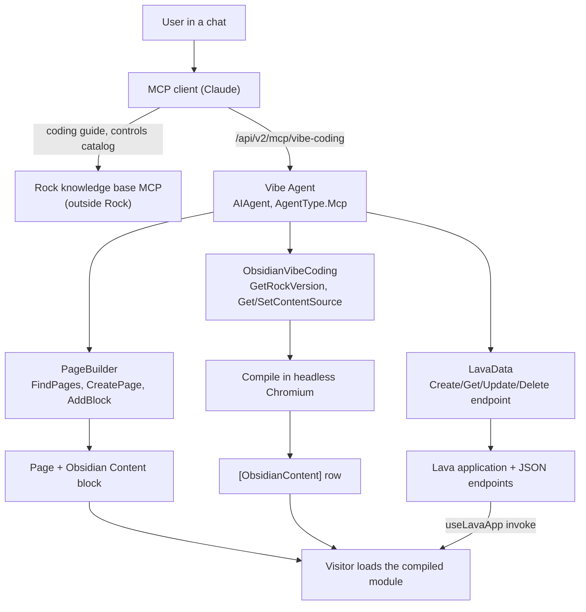

# Vibe Coding: AI-Authored Obsidian Content

## Summary

An administrator says "build me a serving dashboard" in a chat. An external MCP client (Claude) creates a page, drops one block on it, writes Lava endpoints for the data, writes a Vue single-file component, and saves it. Rock compiles the component server side and stores it. Every visitor to that page then loads a precompiled, framework-native Obsidian component.

No repository file. No Rock build. No deployment.

This spec is written to be implemented from scratch on a branch off `develop`. It consolidates and supersedes the six exploratory specs listed under [Related](#related), and folds in the measurement work that reversed two of their decisions.

## Motivation

Two capabilities already exist in Rock and have never been connected.

Rock is already an MCP server: agents expose skills as tools at `/api/v2/mcp/{slug}`, and the ChatAgent and skill runtime is a transport-agnostic execution layer. Separately, Obsidian can already load a compiled Vue component at runtime through its SystemJS loader.

The gap is who can use the second one. Building custom UI in Rock today requires a developer: a repository checkout, knowledge of which of Rock's 247 Obsidian controls exist, knowledge of which API returns the data, and the ability to hand-write correct Vue. That is precisely the work an AI client is good at, and precisely what MCP was added to enable.

The payoff is disproportionate to the new surface because the hard rendering problem is already solved. Most of this work is orchestration and a safe compile, not new rendering technology.

## Requirements

### Authoring loop

- The client MUST be able to run the whole loop from one user intent: clarify, place, write data, write component, compile, save.
- The client MUST be able to re-read what it stored and replace it, so it can iterate.
- Every write MUST return either success or an error the agent can act on. Silent partial success is the failure mode this feature exists to eliminate.
- Clarifying-question behavior MUST live in the agent's `Instructions`, not in a tool.

### Compilation

- Rock MUST compile authored source itself. A client with no repository and no JavaScript runtime MUST get a real compile result.
- Compilation MUST NOT be able to take down the Rock worker process.
- The server and the browser editor MUST produce identical output for identical source.
- A failed compile MUST store nothing and MUST return the compiler's own error text.

### Data

- An authored component MUST be able to fetch data shaped for exactly what it renders.
- The client MUST NOT have to discover existing REST endpoints.
- Every endpoint write MUST test-execute the template and return the result, EXCEPT where the template can write (see [Traps](#traps)).

### Security

- Every authoring tool MUST be gated on the same authorization as the in-browser edit path: administrator only.
- Authorization MUST use the acting person from `AgentRequestContext`, never a service account.
- Visitors MUST receive only compiled output. Authored source MUST require EDIT.

### Deployment

- The feature MUST add no new runtime dependency that is not already shipped.
- Seeding MUST be idempotent and MUST NOT overwrite administrator customization.

## Design

### The shape



**Rock is the MCP server, not the AI.** No model runs inside Rock. Rock's contribution is tools with honest descriptions, real authorization, and feedback loops that fail loudly.

### Build order

Each layer is independently testable and depends only on those above it.

| # | Layer | Proves |
|---|---|---|
| 1 | Data model and migration | A row can hang off a block placement |
| 2 | Shared compiler bundle | Source becomes a loadable module |
| 3 | Block, editor and render path | A human can author in place |
| 4 | Server-side compile | A repo-less client can compile |
| 5 | Lava endpoint data | A component can fetch what it renders |
| 6 | Agent skills | An AI client can drive the whole loop |
| 7 | Agent seeding | It ships preconfigured |

### Layer 1: Data model

One table, one row per block placement, following the `HtmlContent` pattern.

`Rock/Model/CMS/ObsidianContent/ObsidianContent.cs`, EntityType `38F182A7-9FE4-4D7B-B483-59F615BDE41C`.

| Column | Type | Notes |
|---|---|---|
| `BlockId` | `int` null | Owning placement. **Cascade delete**, a deliberate exception to Rock's default: a per-instance row has no meaning without its block. Null reserves a future shared library. |
| `Source` | `nvarchar(max)` | The authored Vue. Source of truth for editing and recompiling. |
| `CompiledContent` | `nvarchar(max)` | The SystemJS module browsers load. |
| `CompiledVueVersion` | `nvarchar(50)` | For deciding a post-upgrade recompile. |
| `CompiledDateTime` | `datetime` null | Stamped on save. |
| `Name`, `IsActive` | | Unused. For the future library. |

Service exposes exactly two methods, `GetByBlockId` and `GetOrCreateByBlockId`. **Both write paths go through the second**, so there is one upsert.

The EF migration must register the block's EntityType explicitly before calling `AddOrUpdateEntityBlockType`, because startup EntityType registration runs *after* migrations. Use the entity-based helper. Do not use `UpdateBlockTypeByGuid`, which deletes by path and can wipe every entity-based block type.

### Layer 2: Shared compiler bundle

`Rock.JavaScript.Obsidian/Framework/Libs/obsidianContentCompiler.ts`, built to `~/Obsidian/Libs/obsidianContentCompiler.js`.

**One implementation, two hosts.** The browser editor loads it through the import map (edit mode only). The server runs the same built artifact. Do not fork this logic per host.

What it does, in order:

1. `parse()` the SFC into a descriptor. Parse errors stop here.
2. Hash the source into a scope id, for scoped styles and style-tag deduplication.
3. `compileScript(descriptor, { id, inlineTemplate: true })`. `inlineTemplate` compiles the template into the setup function's returned render function, producing clean strict-mode output rather than a `with (_ctx)` block.
4. `rewriteDefault()` turns `export default` into a local variable.
5. `compileStyle()` per style block, applying the scope id to scoped ones.
6. Extract the imports, then rebuild as a `System.register` module: dependency list, one setter per dependency, body, scope id, guarded style injection, `_export("default", ...)`.
7. `new Function("System", output)` to **parse** without running, so syntax errors surface now.

Output must be SystemJS, not ESM, because Rock resolves `@Obsidian/...` through a SystemJS alias map rather than a browser import map.

Two constraints in the bundle:

- **Source map generation disabled.** Introduced for Jint; harmless now, and maps were always discarded.
- **Vue version read from `@vue/compiler-sfc`'s own `version` export**, not an `import` from `vue`. Keeps the bundle self-contained with an empty `System.register` dependency array.

### Layer 3: Block, editor and render

`Rock.Blocks/Cms/ObsidianContentDetail.cs`. EntityType `8C7E29E5-E2C5-4331-B7F7-06EF894E7316`, BlockType `D4A5F720-493C-4DE8-B4B6-D6667D7ED2A2`. Web sites only.

The security posture is one method: `CompiledContent` goes to every viewer; `Source` only when the person has EDIT.

Vue side, `Rock.JavaScript.Obsidian.Blocks/src/Cms/obsidianContentDetail.obs` plus partials for the edit panel, preview panel, view panel, and the compiler loader.

**Rendering runs the stored module by hand**: supply a fake `System` object to capture the registration, resolve each dependency through Rock's real loader, execute, mount. It cannot simply load a URL, because Rock's loader appends `.js` and `?fingerprint` to any path, which a `blob:` URL cannot carry.

No compiler is involved in rendering. The compiler and its `eval` load only in the admin edit path.

### Layer 4: Server-side compile

`Rock/Cms/ObsidianContentCompiler.cs`. Runs the bundle in a page of the headless Chromium Rock already manages for PDF generation, via PuppeteerSharp.

**Nothing new is added to run it.** PuppeteerSharp and a pinned Chromium build already ship for `Rock/Pdf/PdfGenerator.cs`. Reuse the install path (`~/App_Data/ChromeEngine`) and call `PdfGenerator.BrowserVersion` so the pin lives in one place.

| Choice | Value | Why |
|---|---|---|
| Browser | Separate process from `PdfGenerator`'s | Shared install, but a wedged compile must not disturb statement generation |
| Browser lifetime | Long lived, relaunched when disconnected | Launching costs far more than opening a page |
| Page lifetime | Fresh page per compile, closed after | No state carries between compiles |
| Navigation | None, a blank page | No document needed, no network reachable |
| Timeout | 30 s | A pathological source cannot pin a page |
| Install | **Never downloaded from this path** | See below |

The page gets the same `System.register` shim the Jint host used, for the same reason: the bundle is SystemJS and a blank page has no loader. Then `EvaluateFunctionAsync<CompileOutput>("(src) => window.__exports.compileSource(src)", source)`, which serializes in and deserializes out as JSON.

**Why out of process is load bearing.** In-process, deeply nested source exhausted the stack, and a `StackOverflowException` cannot be caught in .NET: it terminated the worker and every request on the site. The stack that can be exhausted now belongs to a child process, so the same input closes a page and raises a catchable `TargetClosedException`. **Do not move compilation back in process.**

**Chromium is never installed from this path.** `PdfGenerator` downloads on demand, which is right for a background job. Here an agent is waiting on a tool call and the download is ~100 MB. A missing browser returns a distinct `IsBrowserMissing` result, and the skill tells the caller to retry once provisioning completes.

`CompileSource` is synchronous and called from a synchronous tool; bridge with `AsyncHelper.RunSync`, as `PdfGenerator` does.

### Layer 5: Lava endpoint data

The component fetches through Lava endpoints the agent writes, not through discovered REST endpoints.

Three small changes to existing Lava application infrastructure:

- **`ContentType` on the endpoint** (`Rock/Cms/LavaEndpointAdditionalSettings.cs`, surfaced through `LavaEndpointCache` and the `LavaEndpointDetail` block). `LavaAppController` honors it, defaulting to `text/html` to preserve current behavior.
- **A non-200 status no longer discards the rendered body.** An endpoint returning JSON must be able to pair a 422 with a body the caller can read. The generic message is used only when the template emitted nothing.
- **`Rock.JavaScript.Obsidian/Framework/Utility/lavaApp.ts`**: `useLavaApp(slug)` and `invoke(endpointSlug, data, options)`. Returns the same shape as `invokeBlockAction`, sets the CSRF header, parses JSON when the endpoint still reports `text/html`.

`lavaApp.ts` ships as framework code deliberately, so a fix reaches components already compiled and stored in the database.

### Layer 6: Agent skills

Three `AgentSkillComponent` subclasses, each `internal`, each with an `[AgentSkillGuid]`, each tool method with an `[AgentToolGuid]`. They compose by handing off identifiers: PageBuilder returns a block `IdKey`, ObsidianVibeCoding writes against it, LavaData feeds it.

| Skill | Skill GUID / EntityType GUID | Tools | Gate |
|---|---|---|---|
| PageBuilder | `EE27BE5A-1276-433F-A636-1BEF3550EC1E` / `1D5FD674-F94D-4166-BC10-F2EA86412C4B` | `FindPages`, `CreatePage`, `AddBlock` | ADMINISTRATE of the page |
| LavaData | `8660E7C0-1101-4058-BAF5-20B860600027` / `CABB72CF-DD09-48CD-9BB9-4819488BC7CA` | `CreateLavaEndpoint`, `GetLavaEndpoint`, `UpdateLavaEndpoint`, `DeleteLavaEndpoint`, `DeleteLavaApplication` | ADMINISTRATE of the application |
| ObsidianVibeCoding | `647770A9-F3D7-4924-B046-5C9C43959ECB` / `4C833FA4-A7EF-4D49-9549-B24CBB629A73` | `GetRockVersion`, `GetContentSource`, `SetContentSource` | EDIT of the block (`GetRockVersion` ungated) |

Tool GUIDs:

```
FindPages              C668CAE0-CFA7-4AFF-87FF-5025860170BA
CreatePage             4A64B0B9-0DF9-42CF-BF5C-8FE24EFA4633
AddBlock               05C9C108-4516-46B7-85FB-5C8FE6212CCF
CreateLavaEndpoint     9066DD4A-2158-4B1C-87E3-4058CBEE1E5C
GetLavaEndpoint        11AE1557-1EF3-4E03-9E8E-FCF99F72FCD9
UpdateLavaEndpoint     2F92D13B-A2A2-455C-8324-57A181D505C2
DeleteLavaEndpoint     B3E1A5C7-6F24-4D1B-9C88-05D7F42A61E9
DeleteLavaApplication  9A47C2D1-83B5-4E60-A7F3-1B58C90D24E6
GetRockVersion         3E7A1C42-8B95-4D06-A1F3-2C64D9B7E508
GetContentSource       7D3A8200-3A90-44CC-9E30-B600383E835F
SetContentSource       26FFEE94-4868-4DEC-BE40-68FBE30DAEB8
```

Behavior worth specifying:

- **`CreatePage` takes a kebab-case route** and publishes `PageRouteWasUpdatedMessage`, or the friendly URL 404s until restart.
- **`CreateLavaEndpoint` groups by application.** One application per block, named after the dashboard, so security is rigged once.
- **Delete tools only accept records this skill created**, identified by `ForeignKey = "AI-Agent:LavaDataSkill"`. The provenance stamp is the entire safety model: the skill can unwind its own work and nothing else.
- **`Sql` is refused** without a `sqlJustification` argument, because raw SQL bypasses Rock's per-row entity security while the entity commands respect it.
- **`SetContentSource` stores nothing on compile failure** and returns the compiler's error text.

### Layer 7: Agent seeding

A plugin migration (`Rock/Plugin/HotFixes/`) modeled on `309_EnableRockIntelligence.cs`, which is the established pattern.

1. Register each skill's EntityType (`RockMigrationHelper.AddOrUpdateEntityType`) **before** the `AISkill` row references it. Startup registration runs after migrations, so a missing EntityType yields a null `CodeEntityTypeId` and a skill that exposes nothing.
2. Upsert `AISkill` and `AISkillTool` rows.
3. Insert the `AIAgent` row **only when absent**: name "Vibe Agent", `AgentType.Mcp`, `AudienceType.Internal`, `AdditionalSettingsJson` of `{ "McpAgentSettings": { "Slug": "vibe-coding", "IsExcludingSystemSkills": false } }`, GUID `DC44435A-8900-4AB4-9EB3-1756FCC1B355`.
4. Insert `AIAgentSkill` link rows, each carrying an **explicit `EnabledTools` allowlist** in `{ "AgentSkillSettings": { "EnabledTools": [...] } }`.
5. Grant VIEW to Rock Administrators, deny to all users.

**Attaching a skill does not enable its tools.** Step 4 is the one most likely to be missed, and the symptom is an agent that connects and sees nothing.

The agent row is create-only while skills and tools upsert, deliberately. There is no `IsSystem` flag on `AIAgent`, so an administrator may retune the instructions or the enabled tools, and re-running must not discard that.

### Knowledge base dependency

Control APIs and build patterns come from a Spark-curated coding guide on the Rock knowledge base, reached through its `coding_guide` topic: component anatomy, a catalog of all 247 controls with verified props and gotchas, endpoint patterns, hard rules, and worked recipes.

**Today the client must connect the knowledge base as a second MCP server.** Rock cannot see, verify or version-check it, and a client that connects only Rock gets no guidance at all, silently.

The decided direction is for Rock to proxy it so the client configures one server, but it is **out of scope here** (see [Out of Scope](#out-of-scope)).

## Security Model

**The trust boundary is authoring, not execution.** Authored code runs in the visitor's browser as the visitor, with their cookie and their permissions. Nothing sandboxes it. It can call anything that person could call from their browser console, and nothing more.

That is why every write tool is administrator-gated: you control who writes the code, because the code inherits whoever views it.

Known consequences to design around:

- A newly created Lava application **has no security rules**. `LavaApplication` deliberately breaks security inheritance, so an agent-created endpoint is governed by nothing until an administrator adds rules. The tools do not currently set them; see [Open Questions](#open-questions).
- Authored code shares a DOM with every other block on its page and can read form values there. **Block placement is a security decision.**
- The component mounts inside the host block's tree, so `useInvokeBlockAction()` resolves to the host block's `SaveContent`. That action re-checks permissions, so it is not an escalation, but it is not an intended surface.
- Anything built this way needs one pass **viewed as a non-administrator** before it is trusted.

## Traps

Things that fail silently, in rough order of how much time they cost.

| Trap | Consequence |
|---|---|
| Endpoint parameters arrive under `Body` (POST) or `QueryString` (GET), never as bare merge fields | `{{ teamId }}` renders empty with no error and the query returns wrong data |
| Attaching a skill without populating `EnabledTools` | Agent connects, sees no tools |
| Skipping explicit EntityType registration in the migration | Skill exists with no tools |
| `lang="ts"` in authored source | Not supported; no type stripping exists |
| Importing `@Obsidian/ViewModels/*` | Not in the alias map; repo blocks import those as types only, so nothing requests them at runtime |
| Non-plain import statements | The compiler extracts imports by regex; side-effect and dynamic imports do not resolve |
| Test-executing a write-capable template | Performs real, unattributed writes. Endpoints enabling `RockEntityModify` or `RockEntityDelete` are **not** test-executed for this reason |
| Creating a page without a route | Reachable only at `/page/id` |

## Verification Steps

1. Migration applies; `[ObsidianContent]` exists with the cascade FK; the block type is registered.
2. Place the block on a page as an administrator. Author a component in the editor. It compiles in the browser, saves, and renders.
3. View the same page as a non-administrator. The component renders and `Source` is not present in the payload.
4. Through an MCP client connected to `/api/v2/mcp/vibe-coding`: `GetRockVersion` returns this instance's version.
5. `CreatePage` with a route, then `AddBlock` with the Obsidian Content Detail block type. The friendly URL resolves.
6. `SetContentSource` with a valid component. It compiles server side and stores. The page renders it.
7. `SetContentSource` with a syntax error. Nothing is stored, and the compiler's error text comes back.
8. `SetContentSource` with pathologically deep nesting (several hundred levels). It returns an error and **the site keeps serving**. This is the regression test for the whole compile design.
9. `CreateLavaEndpoint` returns a test execution result. Point a component at it with `useLavaApp` and confirm the data renders.
10. Rename the Chromium install directory and call `SetContentSource`. The result advises retrying rather than hanging or reporting a source error.

## Open Questions

1. **Lava application security.** The tools create applications with no rules and do not set any. Likely fix: take the intended audience as a parameter and write the matching `EXECUTE_VIEW` `Auth` rows at creation. Until then the tools must not claim security is handled.
2. **Caller-supplied `CompiledContent` is not verified against `Source`.** Both write paths accept it with only a structural check, so the stored source need not be what executes, which defeats source as a review artifact. Now that the server can always compile, the fix is to ignore supplied output and compile `Source` itself.
3. **No compile circuit breaker.** If a compile ever does kill something, nothing records it, so a retrying client repeats it.
4. **No version history.** Repeated saves overwrite `Source`; audit columns record who, never what.

## Considered but Rejected

### An in-process JavaScript engine (Jint)

Built first, and it worked. Rejected because its failure mode could not be fixed from inside the process: deeply nested source exhausted the stack, and a `StackOverflowException` cannot be caught in .NET, so it killed the worker and every request on the site. A 16 MB dedicated thread and a pre-flight complexity guard bounded the trigger without changing the outcome.

Measured, for the record: template nesting compiled to 1023 and died at 1024, script bracket nesting to 511 and 512, both bounded by the configured recursion limit rather than the stack. Raising that limit moved the boundary to 2843, implying roughly 5.9 KB of .NET stack per JavaScript call frame under a tree-walking interpreter.

### ClearScript with V8, in process

V8 raises a catchable error on deep recursion, so it would have fixed the crash. Rejected for deployment: native binaries per architecture, a Visual C++ redistributable, and known ASP.NET **website-project** problems, which is exactly what RockWeb is.

### A dedicated child process hosting Jint

Would contain the crash. Rejected in favor of reusing Chromium, which achieves the same containment with no new artifact to ship, version-match and deploy, and with the compile then running in the same engine as the browser editor.

### A pre-flight complexity guard

Built, then deleted. It measured structural nesting and refused source above an estimated 400 call frames, and under Jint it was the only thing capable of turning the crash into an ordinary error. Once the compile moved out of process its error modes became one-sided: under-counting was harmless, over-counting still refused legitimate work, and its threshold described an engine no longer in use. A second safety mechanism guarding nothing is a maintenance liability.

For calibration, if this is ever revisited: the worst of the 2,098 `.obs` files in the repository measures 37 estimated frames, and a purpose-built deliberately complex dashboard measures 25. Real components grow wide, not deep.

### Client-side compile with a compile-on-view fallback

The original design. The client-compiles path only works for a client with a repository and a Node toolchain, and the compile-on-view fallback was never built, so every other client saved source that silently never rendered.

### Reading control APIs from files on the instance

Two local sources work: the build emits `.d.ts` files with every prop and slot, and every shipped `*.obs.js.map` embeds the original source in `sourcesContent`. Attractive because it removes the external dependency and is inherently version-correct.

Rejected because local extraction yields **source**, while the curated catalog yields **curation**: the gotcha, the real v-model type, which prop actually matters. None of that is derivable from a type signature.

### Discovering existing REST endpoints for data

Rejected. Rock has hundreds of endpoints, almost none return the shape a specific dashboard wants, and their permissions are separate from the page's. Writing Lava avoids all three.

### A new MCP transport or controller for authoring

Rejected. The existing endpoint already carries authenticated per-person requests and maps skills to tools. Authoring is just more tools on that surface.

## Out of Scope

- **Proxying the knowledge base through Rock.** Decided, not built. Needs an outbound MCP client, which Rock does not have (`Rock/AI/Agent/Mcp/` is server side only), and `GetDymanicTools()` widened beyond `ToolType.AIPrompt` so remote tools can be advertised without a Rock release per tool.
- **A reusable component library.** The nullable `BlockId` and the unused `Name` and `IsActive` columns reserve room for it.
- **Source version history and rollback.**
- **Consolidating the block editor's save path onto the server compiler.** Both now use the same bundle and the same engine, so this is cleanup rather than correctness.

## Related

Superseded by this spec, all still in `specs/`:

- `specs/260721-obsidian-content-block-and-component-model.md` (the block, model and browser compile)
- `specs/260722-mcp-driven-obsidian-content-vibe-coding.md` (lifting authoring into MCP)
- `specs/260803-lava-endpoint-data-for-obsidian-content.md` (the Lava endpoint data approach)
- `specs/260803-lava-endpoint-implementation-plan.md`
- `specs/260803-mcp-vibe-coding-skill-candidates.md`
- `specs/260804-vibe-coding-findings.md`
- `specs/260806-jint-in-process-obsidian-compile-plan.md` (carries a superseded banner; its Phase 0 spike and bundle constraints still hold)

Current as-built documentation:

- [docs/ai/vibe-coding-architecture.md](../docs/ai/vibe-coding-architecture.md)
- [docs/cms/obsidian-content.md](../docs/cms/obsidian-content.md)

Patterns to copy:

- `Rock/Plugin/HotFixes/309_EnableRockIntelligence.cs` (agent, skill and tool seeding)
- `Rock/Pdf/PdfGenerator.cs` (Chromium install, pinned version, launch and cleanup)
