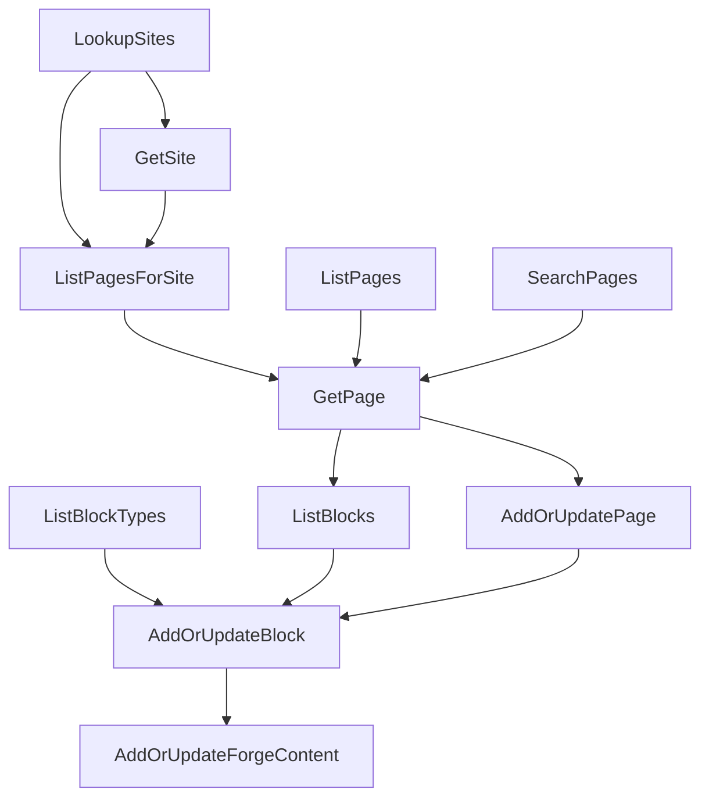

# CMS Agent Tool Suite

## Summary

The "AI Next Steps" planning task assigns ten CMS agent tools to Kyle: `LookupSites`, `GetSite`, `ListPages`, `ListPagesForSite`, `SearchPages`, `GetPage`, `AddOrUpdatePage`, `ListBlockTypes`, `ListBlocks`, and `AddOrUpdateBlock`. One of the ten is finished, three exist in a narrower form built for the Forge Content flow, and six do not exist at all. This spec defines the finished shape of all ten, consolidates them onto a single `CmsSkill`, and lays out the implementation order. It also adds `DeletePage` and `DeleteBlock`, honoring the parent task's "add delete for items with add/update" note and closing the Forge Content flow's cleanup gap, following the authorization-only delete shape the shipped skills use.

## Motivation

The three tools that exist (`SearchPages`, `AddPage`, `AddBlock`) were written for one job: give the Forge Content authoring flow somewhere to put a block. They were never meant to be a general CMS surface, and it shows. `AddPage` cannot update, `AddBlock` cannot set block settings or place a block on a layout or site, and neither can be reached from a site or a page tree because no read tool walks that structure. An agent asked "what pages are on the main site" today has no tool that answers.

The gap also blocks the Forge Content flow itself. Once a page has more than a couple of blocks, the agent cannot see what is already on the page before adding another, so it duplicates blocks rather than updating the one it created last turn.

## Current State

| Tool | Status | Location |
|---|---|---|
| `LookupSites` | Complete | `Rock.AI.Agent/Skills/CmsSkill.LookupSites.cs` |
| `GetSite` | Missing | |
| `ListPages` | Missing | |
| `ListPagesForSite` | Missing | |
| `SearchPages` | Exists, no site filter | `Rock.AI.Agent/Skills/PageSkill.SearchPages.cs` |
| `GetPage` | Missing | |
| `AddOrUpdatePage` | Exists as add-only `AddPage` | `Rock.AI.Agent/Skills/PageSkill.AddPage.cs` |
| `ListBlockTypes` | Missing | |
| `ListBlocks` | Missing | |
| `AddOrUpdateBlock` | Exists as add-only `AddBlock` | `Rock.AI.Agent/Skills/PageSkill.AddBlock.cs` |

## Requirements

### Organization

- All thirteen tools (the ten assigned, the two deletes, and `ListLayouts`) MUST live on `CmsSkill` (`Rock.AI.Agent/Skills/CmsSkill.cs`, skill guid `613D7110-6453-4BAB-892B-064222F8397C`).
- `PageSkill` MUST be retired. Its three tools move to `CmsSkill` and keep their existing `[AgentToolGuid]` values so the `AISkillTool` rows and any agent `EnabledTools` lists survive the move.
- Each tool MUST be its own partial-class file named `CmsSkill.{ToolName}.cs`, matching the convention already used across `Rock.AI.Agent/Skills/`.
- Result models MUST live under `Rock.AI.Agent/Classes/Skills/CmsSkill/`.

### Conventions

Every tool MUST follow the native-tool guidance published at [Writing Custom Tools](https://community.rockrms.com/developer/ai-agents/writing-custom-tools):

- No raw integer `Id` values in any returned payload. Result models derive from `EntityResultBase`, which marks `Id` as `[JsonIgnore]` and surfaces `IdKey`.
- Parameters are flattened onto the method signature (no options POCO) and named for what they identify: `pageIdKey`, not `idKey`.
- `List` tools take filters and use `CursorPaginator` through `AgentToolHelper.GetCursorPaginatedItems()`. `Lookup` tools return everything with no filters.
- `List` tools contribute no chat history. `Lookup` and `Get` tools contribute a trimmed history payload (`KeyNameResult` or equivalent).
- `AddOrUpdate` tools take an optional entity `IdKey` as the first parameter. Absent means add, present means update. Nullable string properties use `SetOrClear<string>` so the model can distinguish "not specified" from "clear this".
- Validation errors accumulate through `AgentToolHelper.AddError()` and return once via `helper.ErrorResult`, so the model can correct everything in a single retry.

### Per-tool behavior

**`LookupSites()`** (no change). Returns every site the audience is allowed to see, with `IdKey`, `Name`, `Description`, `SiteType`, and `ExternalUrl`.

**`GetSite( string siteIdKey )`** (new). Full detail for one site: theme, default page, login page, configured page routes, and `AttributeValues`. History content is a trimmed `KeyNameResult`.

**`ListPages( string parentPageIdKey = null, string cursor = null )`** (new). With no `parentPageIdKey`, returns the root-level pages of every site. With one, returns that page's immediate children. The agent walks the tree by calling repeatedly. Recursion is deliberately the caller's job rather than a depth parameter, because a full-depth call on a large install would not fit the context window.

**`ListPagesForSite( string siteIdKey, string cursor = null )`** (new). Every page belonging to a site, flat, resolved through `Layout.SiteId`. This is the "give me everything at once" counterpart to walking `ListPages`.

**`SearchPages( string query, string siteIdKey = null, string cursor = null )`** (edit). Adds the `siteIdKey` filter the planning task calls for, and adds cursor pagination in place of the current hard `Take( 25 )`.

**`GetPage( string pageIdKey )`** (new). Full detail for one page: internal name, page title, browser title, description, parent page, layout, site, routes, display and menu settings, and `AttributeValues`. MUST include the page's blocks in summarized form (`IdKey`, `Name`, `Zone`, block type name) so the agent can see what is already on a page without a second call.

**`AddOrUpdatePage( ... )`** (rename and extend `AddPage`). Signature:

```csharp
public AgentToolResult AddOrUpdatePage(
    string pageIdKey = null,
    string parentPageIdKey = null,
    string layoutIdKey = null,
    SetOrClear<string> internalName = null,
    SetOrClear<string> pageTitle = null,
    SetOrClear<string> browserTitle = null,
    SetOrClear<string> description = null,
    SetOrClear<string> route = null,
    DisplayInNavWhen? displayInNavWhen = null,
    List<AttributeValueResult> attributeValues = null )
```

- Add requires `parentPageIdKey` and `internalName`. Update requires `pageIdKey` and rejects `parentPageIdKey` (moving a page in the tree is out of scope).
- `layoutIdKey` is optional on add and defaults to the parent's layout, preserving today's behavior.
- When `layoutIdKey` is provided, the layout MUST belong to the same site as the parent page (on add) or the page's current layout (on update). A page's site is derived through its layout, so an unvalidated cross-site layout silently moves the page to another site; Rock's admin UI scopes its layout picker to the page's site for the same reason.
- Route validation, `PageRouteWasUpdatedMessage.Publish()`, sibling ordering, `Authorization.CopyAuthorization`, and the parent `PageCache.Remove` all carry over from `AddPage` unchanged.
- On update, changing the route MUST replace the existing route rather than adding a second one.

**`ListLayouts( string siteIdKey = null, string cursor = null )`** (new). Lists the layouts pages can render with, optionally filtered to one site. This is the tool that feeds `layoutIdKey` into `AddOrUpdatePage`; without it the model could only copy a layout `IdKey` from a page that already uses it, and could not resolve "use the Full Width layout" by name.

**`ListBlockTypes( string name = null, string category = null, string cursor = null )`** (new). Partial-name and category filters over `BlockTypeCache`. Returns `IdKey`, `Name`, `Category`, `Description`, and whether the block type is Obsidian or WebForms, so the model can prefer Obsidian blocks. This is the tool that feeds `blockTypeIdKey` into `AddOrUpdateBlock`.

**`ListBlocks( string pageIdKey = null, string layoutIdKey = null, string siteIdKey = null, string cursor = null )`** (new). At least one of the three MUST be supplied. Returns `IdKey`, `Name`, `Zone`, `Order`, and the block type as a nested summary.

**`AddOrUpdateBlock( ... )`** (rename and extend `AddBlock`). Signature:

```csharp
public AgentToolResult AddOrUpdateBlock(
    string blockIdKey = null,
    BlockLocation? blockLocation = null,
    string pageIdKey = null,
    string layoutIdKey = null,
    string siteIdKey = null,
    string blockTypeIdKey = null,
    SetOrClear<string> name = null,
    SetOrClear<string> zone = null,
    List<AttributeValueResult> attributeValues = null )
```

- `BlockLocation` (`Rock.Enums/Cms/BlockLocation.cs`) already models Page, Layout, and Site. No new enum is needed.
- Add requires `blockTypeIdKey` plus exactly one of `pageIdKey`, `layoutIdKey`, or `siteIdKey`. Update requires `blockIdKey` and rejects all three placement keys.
- `attributeValues` writes the block's settings. `Block` inherits `IHasAttributes` from `Model<T>`, and block attributes are qualified by `BlockTypeId`, so `helper.SetAttributeValues()` works once the block type is set.
- `zone` defaults to `Main` on add, matching today's behavior.
- The return payload keeps `IdKey` as the value the Forge Content skill's `AddOrUpdateForgeContent` consumes.

**`DeletePage( string pageIdKey, bool deleteInteractions = true )`** (new, revised per the 2026-08-24 meeting). Deletes a page along with its blocks and routes, following the authorization-only delete shape the shipped skills use (`DeleteNote`, `DeleteStep`, `DeletePrayerRequest`): per-entity security decides what is deletable, not who created the record.

- Requires `Authorization.ADMINISTRATE` on the page through `PageCache`, and carries administrator-only tool security like the other mutating tools.
- The page MUST have no child pages. Children cascade with the parent in the database, so without this guard one tool call could silently delete an entire subtree; refusing forces deliberate bottom-up deletion where each page is named one call at a time.
- Blocks and routes cascade with the page, matching the admin Pages block.
- Flushes the parent page's cache so navigation updates, and publishes `PageRouteWasUpdatedMessage` when the page had routes.
- **Interactions.** Page-view interactions do not cascade: the page's `InteractionComponent` rows and their interactions reference the page by loose `EntityId`, so a bare delete orphans them and no cleanup job reclaims them. The admin Pages block already solves this: its delete action ([Pages.cs:346](Rock.Blocks/Administration/Pages.cs:346)) takes a `deleteInteractions` flag and, when set, sends `DeleteInteractions.Message` ([DeleteInteractions.cs](Rock/Tasks/DeleteInteractions.cs)), a background bus task that bulk-deletes the page's interactions in chunks and then removes its components. `DeletePage` MUST take the same optional `deleteInteractions` parameter and send the same message after a successful save, keyed by the captured `PageId` and `SiteId` (the task deliberately takes raw ids because the page is gone by the time it runs). The parameter defaults to `true`, matching the admin Pages block, whose confirmation modal pre-checks "Delete any interactions for this page". The usage annotations (below) still require the agent to ask the user, so the default only decides what happens if the model omits the parameter, and omitting it then matches what an administrator gets by accepting the modal as-is.
- **Confirmation.** The tool's usage annotations MUST require the agent to, before calling: (1) present a warning that spells out the destructive, permanent nature of the delete and exactly what goes with it (the page, its blocks, its routes, and its interaction history when `deleteInteractions` is set), (2) name the exact page being deleted, and (3) obtain the user's explicit confirmation. The annotations MUST also forbid deleting a page the user did not name explicitly, and MUST tell the agent to ask the user whether interaction history should be deleted too rather than choosing silently. With no provenance gate, instruction-level caution and the ADMINISTRATE check are the whole safety story.
- **Site references (gap found while reviewing the built tool).** The admin block nulls a site's `DefaultPageId`, `LoginPageId`, and `RegistrationPageId` (and their route ids) before deleting a page the site points at; the built tool does not, so deleting such a page fails on the FK. The tool MUST refuse instead of silently clearing: a site losing its default or login page is a bigger decision than the agent should make as a side effect. Refuse with an error naming the site and the role the page plays. (Decided 2026-08-24.)

**`DeleteBlock( string blockIdKey )`** (new). Deletes a block from its page, layout, or site.

- Requires `Authorization.ADMINISTRATE` on the block through `BlockCache`, and carries administrator-only tool security.
- A block with a `ForgeContent` row hanging off it is still deletable: the FK from `ForgeContent` to `Block` cascades, which is the intended unwind for a scratch component.
- Flushes the page, layout, or site pages the block rendered on, matching `AddOrUpdateBlock`.
- Same usage-annotation requirements as `DeletePage`: permanent, confirm first, only what the user named.

### Security

- `CmsSkill` MUST NOT be locked to administrators wholesale. `LookupSites` is written to serve external audiences (it filters on `AudienceType.Internal`), and a skill-level deny would take that away.
- Instead, `AddOrUpdatePage`, `AddOrUpdateBlock`, `DeletePage`, and `DeleteBlock` MUST carry administrator-only VIEW auth at the tool level via `RockMigrationHelper.AddSecurityAuthForAISkillTool()`. Per-tool authorization is enforced when the agent's tool list is built (`Rock/Web/Cache/Entities/AIAgentCache.cs:129`), so a non-administrator never sees them.
- All four mutating tools MUST additionally check `Authorization.ADMINISTRATE` on the target through the cache (`PageCache` / `BlockCache` / `SiteCache`) so inherited page and site security participates. This is what `AddPage` and `AddBlock` do today and it stays.
- Read tools MUST filter on `Authorization.VIEW` for the current person.

### Registration

- Tool rows self-register at startup from the `[AgentToolGuid]` and `[Description]` attributes (`Rock/Model/AI/AISkillTool/AISkillToolService.cs:45`), including re-parenting a tool whose `AISkillId` changed. The `PageSkill` to `CmsSkill` move therefore needs no data migration for the tool rows themselves.
- Seeding MUST be done by editing the existing `Rock.Migrations/Migrations/202608172102127_AddForgeContent.cs` in place. No new EF migration is created. That migration exists only on `feature-kh-vibe-coding` (commit `5707f55bbe`) and has never shipped, so it is still the right place for the Forge Content seed data. Adding a second migration to correct an unreleased one leaves both in the permanent history for no benefit.
- The edits to that migration are:
  - Replace the `PageSkillGuid` and `PageSkillEntityTypeGuid` constants with `CmsSkillGuid` (`613D7110-6453-4BAB-892B-064222F8397C`) and `CmsSkillEntityTypeGuid` (`7A63570D-6FC3-4573-BDF2-89CFF605D5AB`).
  - Rename `AddPageSkill_Up()` to `AddCmsSkill_Up()` and seed all thirteen tools instead of three.
  - Point `RegisterForgeContentEntityTypes_Up()` at `Rock.AI.Agent.Skills.CmsSkill` in place of `Rock.AI.Agent.Skills.PageSkill`.
  - Replace the skill-level `AddAdministratorOnlySecurityForAISkill()` call with `AddSecurityAuthForAISkillTool()` allow/deny pairs, one per mutating tool (`AddOrUpdatePage`, `AddOrUpdateBlock`, `DeletePage`, `DeleteBlock`). The two existing auth guids can be reused for the first pair; the other pairs need new guids added to `RemoveSkillsAndTools_Down()`.
  - Update the tool guid list in `AttachSkillsToAgent_Up()` from three entries to thirteen.
  - Update the `skillGuids` list in `RemoveSkillsAndTools_Down()` so `Down()` removes the CMS skill rather than the page skill.
- Seeded names and descriptions MUST match the strings the attributes derive, per the engineering note in `Rock.Migrations/Migrations/202608172102127_AddForgeContent.cs:280`. Startup re-registration overwrites drift, so mismatched seed text silently disappears on first restart and is worse than useless.
- Because the migration has already run on any dev instance that pulled the branch, editing it in place does nothing on those instances. Developers MUST roll the migration back (or restore a pre-migration database) and re-run it to pick up the new seed data.

## Design

### Tool composition

The tools are meant to chain. A model that knows nothing about the install can get from "a site exists" to "a component is rendering on a page" without ever seeing an integer id, and the delete pair unwinds what the upserts scaffolded when a build is abandoned.



`AddOrUpdateForgeContent` lives on `ForgeContentBuilderSkill` and is unchanged by this spec. It is shown because it is the reason the block tools exist.

### File layout

```
Rock.AI.Agent/
  Skills/
    CmsSkill.cs                      (edited: purpose, usage, guardrail annotations)
    CmsSkill.LookupSites.cs          (unchanged)
    CmsSkill.GetSite.cs              (new)
    CmsSkill.ListPages.cs            (new)
    CmsSkill.ListPagesForSite.cs     (new)
    CmsSkill.SearchPages.cs          (moved from PageSkill, edited)
    CmsSkill.GetPage.cs              (new)
    CmsSkill.ListLayouts.cs          (new)
    CmsSkill.AddOrUpdatePage.cs      (moved from PageSkill.AddPage.cs, edited)
    CmsSkill.ListBlockTypes.cs       (new)
    CmsSkill.ListBlocks.cs           (new)
    CmsSkill.AddOrUpdateBlock.cs     (moved from PageSkill.AddBlock.cs, edited)
    CmsSkill.DeletePage.cs           (new)
    CmsSkill.DeleteBlock.cs          (new)
    PageSkill*.cs                    (deleted)
  Classes/Skills/CmsSkill/
    SiteResult.cs                    (extended for GetSite)
    PageResult.cs                    (moved from PageSkill, extended)
    BlockResult.cs                   (new)
    BlockTypeResult.cs               (new)
    LayoutResult.cs                  (new, nested inside PageResult and BlockResult)
```

`AddPageResult` and `AddBlockResult` are dropped. An `AddOrUpdate` tool returns the same result model its `Get` counterpart returns, which is the pattern `AddOrUpdateContentChannelItem` follows. The friendly-URL string that `AddPageResult.Url` carried moves onto `PageResult` so `GetPage` reports it too.

### Cache versus database

Read tools should source from `PageCache`, `SiteCache`, `BlockCache`, and `BlockTypeCache` rather than querying `RockContext`. The full page tree is already in memory, `PageCache.GetPages()` and `PageCache.ParentPageId` give the hierarchy directly, and cached reads sidestep the "structurally incompatible initializations" LINQ-to-Entities trap described in the [Gotchas](https://community.rockrms.com/developer/ai-agents/writing-custom-tools/native-tools/gotchas) doc. Mutating tools continue to use a `RockContext` created through `RockApp.Current.CreateRockContext()`.

### Raw ids in URLs

`AddPage` returns `Url = "/page/{id}"` when a page has no route. That string contains a raw integer id, which the docs otherwise forbid. It stays: it is a real, working Rock URL that the user needs, and the fallback only appears when no friendly route exists. The `IdKey` remains the only identifier the model is given to pass back into other tools.

## Implementation Plan

Phased so each phase compiles and can be tested against a running instance before the next begins.

### Phase 1: consolidate onto CmsSkill

1. Move `PageSkill.SearchPages.cs`, `PageSkill.AddPage.cs`, and `PageSkill.AddBlock.cs` to `CmsSkill.*` files, changing only the class name in the partial declaration.
2. Move `PageResult.cs`, `AddPageResult.cs`, and `AddBlockResult.cs` to `Classes/Skills/CmsSkill/`.
3. Move `PageSkill`'s `[AgentPurpose]`, `[AgentUsage]`, and scaffolding engineering note onto `CmsSkill.cs`, merging with the existing description.
4. Delete `PageSkill.cs` and the now-empty `Classes/Skills/PageSkill/` folder.
5. Verify on a running instance that the three tools re-parent to the CMS skill on startup and still execute.

No behavior changes in this phase. It is deliberately separable so a regression here is unambiguous.

### Phase 2: read tools

6. `CmsSkill.GetSite.cs` plus the `SiteResult` extension.
7. `CmsSkill.ListPages.cs` and `CmsSkill.ListPagesForSite.cs` plus the `PageResult` extension.
8. `CmsSkill.GetPage.cs`, including the summarized block list.
9. `CmsSkill.ListBlockTypes.cs` and `CmsSkill.ListBlocks.cs` plus `BlockResult` and `BlockTypeResult`.
10. Edit `CmsSkill.SearchPages.cs` for the `siteIdKey` filter and cursor pagination.

### Phase 3: mutating tools

11. Rename `AddPage` to `AddOrUpdatePage`, keeping guid `4A64B0B9-0DF9-42CF-BF5C-8FE24EFA4633`. Add the update branch, `layoutIdKey`, the extra `SetOrClear` properties, and `attributeValues`.
12. Rename `AddBlock` to `AddOrUpdateBlock`, keeping guid `05C9C108-4516-46B7-85FB-5C8FE6212CCF`. Add the update branch, `BlockLocation` placement, `blockTypeIdKey` in place of the block type name string, and `attributeValues`.
13. Update `ForgeContentBuilderSkill`'s usage annotations so the flow reads `ListBlockTypes`, then `AddOrUpdateBlock`, then `AddOrUpdateForgeContent`.

### Phase 4: registration and security

14. Edit `Rock.Migrations/Migrations/202608172102127_AddForgeContent.cs` in place, applying the six changes listed under Registration above. Do not add a new migration.
15. Roll the migration back on the dev instance and re-run it, then confirm the agent exposes all ten tools to an administrator and only the eight read tools to a non-administrator.

### Phase 5: verification

16. Ask the agent, as an administrator, to walk from `LookupSites` to a rendered Forge Content on a new page without being given any ids.
17. Repeat as a non-administrator and confirm the mutating tools are absent from the tool list rather than failing at execution.
18. Confirm `AddOrUpdatePage` called twice with the same `pageIdKey` updates rather than duplicating, and the same for `AddOrUpdateBlock`.

### Phase 6: delete tools

Added after phases 1 through 5 shipped, so it is written as its own phase.

19. `CmsSkill.DeletePage.cs` and `CmsSkill.DeleteBlock.cs` per the behavior above, following the authorization-only shape of `DeleteNote` and `DeleteStep`.
20. Migration: two more seeded tool rows, two more `EnabledTools` entries (twelve total), and two more admin-only tool auth pairs with their `Down()` cleanup.
21. Tool guids, reserved here: `DeletePage` `BB6C42F3-C448-49D5-BB85-4072960178FC`, `DeleteBlock` `B30F66EA-0D9E-4854-BB82-A96BE7719D00`. Auth guids: DeletePage allow/deny `7483110B-1155-45FC-A7F7-B77959DB3982` / `A4118437-30B1-48C7-88D9-89E34E0C4B46`, DeleteBlock allow/deny `AFBD660A-35C7-48BB-8A82-15099CF595AE` / `557884F7-F369-4FE5-9F18-6C41FBE13900`.
22. Verify: create a page and block through the tools, delete the block, then the page; both succeed and the page tree is clean. Then confirm `DeletePage` refuses a page with child pages, and that both tools refuse targets the acting person cannot ADMINISTRATE.

### Phase 7: layouts

23. `CmsSkill.ListLayouts.cs` per the behavior above. Read tool, no extra security. Tool guid, reserved here: `82C06D71-800E-4064-B72D-98F1B2A684D7`.
24. Add the same-site layout validation to `AddOrUpdatePage`, erroring with a pointer at `ListLayouts` filtered by the page's site.
25. Migration: one more seeded tool row and `EnabledTools` entry (thirteen total).
26. Verify: `ListLayouts` with a `siteIdKey` returns only that site's layouts; `AddOrUpdatePage` with a layout from another site errors rather than moving the page.

### Phase 8: DeletePage revisions from the 2026-08-24 meeting

Phase 6 shipped `DeletePage` without interaction handling and with a one-line confirm instruction. This phase brings it up to the revised behavior above.

27. Add the `deleteInteractions` parameter (default `true`, matching the admin UI's pre-checked checkbox) and send `DeleteInteractions.Message` with the captured `PageId` and `SiteId` after `SaveChangesIfNoErrors` succeeds, mirroring [Pages.cs:398](Rock.Blocks/Administration/Pages.cs:398).
28. Extend the return payload (`PageDeleteResult`) with whether an interaction delete was queued, so the agent can tell the user the history cleanup runs in the background.
29. Rewrite the `[AgentUsage]` annotation per the Confirmation requirement: explicit destructive-nature warning, exact page named, explicit user confirmation, and an explicit ask about interaction history.
30. Add the site-reference refusal: if any site's default, login, or registration page is the target, error with the site name and the role instead of deleting.
31. Verify: delete a page with interactions and `deleteInteractions: true`, confirm the `InteractionComponent` rows and interactions are gone after the bus task runs; repeat with `false` and confirm they remain; attempt to delete a site's login page and confirm the refusal.

## Open Questions

- `SearchPages` does not fit the documented verb taxonomy (`Lookup`, `List`, `Get`, `AddOrUpdate`). The planning task itself flags it with "???". With `ListPages`, `ListPagesForSite`, and a name filter available, `SearchPages` may be redundant. `PersonSkill` does ship `SearchPerson` and `SearchPersonPartial`, so the verb has precedent. Retaining it is the assumption here; dropping it in favor of a name filter on `ListPagesForSite` is the alternative.
- Should `AddOrUpdatePage` support moving a page to a different parent? Excluded here because a move invalidates cached routes and menu structure across two subtrees, and no requirement asks for it.
- `GetSiteAvailableAttributes`, `GetPageAvailableAttributes`, and `GetBlockAvailableAttributes` appear on the parent planning task but are not tagged to Kyle. Without them the model has to guess attribute keys when passing `attributeValues`. They may need to be pulled into this work rather than tracked separately.

## Considered but Rejected

### Keep the tools split across CmsSkill and PageSkill
Rejected. Two skills for one domain forces the agent operator to enable both, and the split line (site reads on one, page writes on the other) is not something a model can reason about. Consolidation costs one migration.

### Add AddOrUpdatePage alongside the existing AddPage
Rejected. Two tools that both create a page give the model an ambiguous choice, which the `AddOrUpdate` guidance explicitly warns against. Renaming in place keeps the tool guid, so the `AISkillTool` row and the agent's `EnabledTools` entry both survive.

### Keep accepting a block type name in AddOrUpdateBlock
Rejected. The current implementation does an exact name match with a fuzzy-suggestion fallback on failure, which exists only because no `ListBlockTypes` tool was available. Once the Lookup-style tool exists, `blockTypeIdKey` is the documented input and the suggestion fallback becomes dead code.

### Give ListPages a depth or recursive parameter
Rejected. A recursive call on a large install returns thousands of pages and blows the context window. Repeated shallow calls let the model stop as soon as it finds what it needs.

### Write a new EF migration for the CmsSkill seeding
Rejected. `202608172102127_AddForgeContent` has not shipped and lives only on the feature branch, so it can still be corrected at the source. A follow-up migration would leave the branch permanently carrying a seed of `PageSkill` followed by a seed that undoes it, and would make `Down()` harder to reason about across two files. The cost is that developers on the branch have to roll back and re-run.

### Provenance-gated deletes
Rejected after being briefly implemented. The first cut stamped `ForeignKey = "AI-Agent:CmsSkill"` on records the upserts created and had the delete tools refuse anything without the stamp, mirroring the Builder skills. It was replaced with the authorization-only shape because that is the established pattern across the shipped delete tools (`DeleteNote`, `DeleteStep`, `DeletePrayerRequest`, `DeleteGroupMember`), because agent-parity with the admin UI is the intent of the tool suite, and because the provenance gate made the tools useless against anything created before the stamp landed or through the admin pages. The blast-radius concerns it addressed are covered instead by the admin-only tool security, the per-entity ADMINISTRATE check, the child-pages refusal on `DeletePage`, and confirm-first usage annotations on both tools.

### Lock CmsSkill to administrators
Rejected. `LookupSites` already distinguishes internal from external audiences and is usable by public agents. A skill-level deny would remove that capability to protect two tools that can be protected individually.

## Out of Scope

- `GetSiteAvailableAttributes`, `GetPageAvailableAttributes`, `GetBlockAvailableAttributes` (see Open Questions).
- `AddOrUpdateSite`, `ListShortcodes`, personalization segment and request filter tools. These are on the parent planning task but are not assigned to Kyle. (`ListLayouts` was originally in this list; it was pulled in because `AddOrUpdatePage` takes a `layoutIdKey` the model otherwise had no way to discover.)
- Moving a page to a new parent.
- Any change to `ForgeContentBuilderSkill` or `LavaApplicationBuilderSkill` beyond the usage annotation update in step 13.

## Related

- [AI Next Steps, Kyle's Items](https://app.asana.com/1/20866866924293/task/1217506997745080) (the assignment, referenced for scope; requirements live in this spec)
- [AI Next Steps](https://app.asana.com/1/20866866924293/project/1161428632613857/task/1217172640419730) (parent planning task, last modified 2026-08-17, source of the tool list and the `siteIdKey` / `parentPageIdKey` parameter notes)
- [Writing Custom Tools](https://community.rockrms.com/developer/ai-agents/writing-custom-tools) (canonical convention reference; note that it names the helper types `RockToolHelper` and `RockToolResult` while the code ships `AgentToolHelper` and `AgentToolResult`)
- [Types of Tools](https://community.rockrms.com/developer/ai-agents/writing-custom-tools/types-of-tools) (the Lookup, List, Get, AddOrUpdate taxonomy this spec applies)
- [Native Tools](https://community.rockrms.com/developer/ai-agents/writing-custom-tools/native-tools)
- [Tool Parameters](https://community.rockrms.com/developer/ai-agents/writing-custom-tools/native-tools/tool-parameters)
- [Rock Tool Helper](https://community.rockrms.com/developer/ai-agents/writing-custom-tools/native-tools/rock-tool-helper)
- [Gotchas](https://community.rockrms.com/developer/ai-agents/writing-custom-tools/native-tools/gotchas)
- `specs/260814-forge-content-components.md` (the flow these tools feed)
- Commit `62ad577b9c` gave the Forge Content skills their current names (`PageSkill`, `SearchPages`, `AddPage`, `AddBlock`); the `AddForgeContent` migration registered them.
