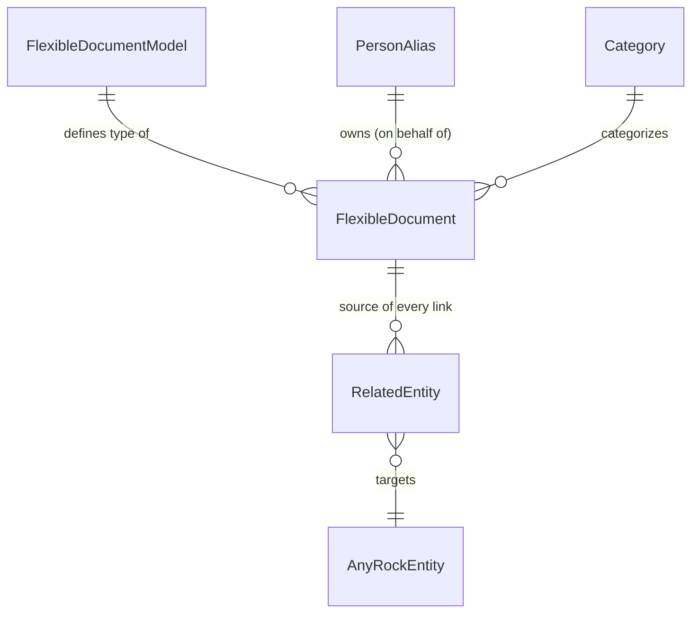

# FlexibleDocument: An Extensible JSON Document Store

## Summary

Vibe-coded tools and AI agents produce real, evolving data, and today every new shape of that data means a new table, a migration, and a fixed schema. FlexibleDocument gives that data one home: a `FlexibleDocumentModel` registry describing each document type (with long-form `Documentation` readable by humans and agents), and a `FlexibleDocument` table holding the JSON payload plus five generic typed columns for fast filtering. Every link to another Rock entity, including the primary one, goes through the existing `RelatedEntity` table, so the document carries no link columns of its own.

This spec covers **the plumbing only**: entities, entity configurations, services with query helpers, SystemGuids, and one EF migration. Admin UI, the expiry cleanup job, seeded models, and the vibe coding integration are all explicitly out of scope and come later.

## Motivation

The vibe coding rebuild ([specs/260814-vibe-coding-custom-components.md](260814-vibe-coding-custom-components.md)) lets an AI agent author UI and data endpoints, but the data those tools produce has nowhere durable to live. An agent that builds a follow-up tracker or captures per-person notes either abuses an existing entity, invents attribute-value contortions, or needs a schema migration nobody is going to write for a one-off dashboard. A schema-less-but-queryable store closes that gap, and the same store is useful to human developers prototyping before committing to a real table.

The full design rationale, entity diagrams, and column-by-column definitions live in the attached design doc; this spec pins the decisions needed to build the data layer against Rock conventions.

## Requirements

### Entities

- Two entities MUST be added, both inheriting `Model<T>`, both in the Core domain:

| Item | Value |
|---|---|
| `Rock.Model.FlexibleDocumentModel` | `Rock/Model/Core/FlexibleDocumentModel/`, EntityType `28A1D38E-333C-46C5-A896-7500DFFEAB74` |
| `Rock.Model.FlexibleDocument` | `Rock/Model/Core/FlexibleDocument/`, EntityType `962D0C52-FA32-4863-977F-D6A4B2DF0C09` |

- `FlexibleDocumentModel` MUST carry: `Key` (unique, indexed), `Name`, `Description`, `Documentation` (`nvarchar(max)`, long-form guidance telling humans and agents what the model is for and what the JSON should contain), `IsSystem`, `IsActive`.
- `FlexibleDocument` MUST carry: `Name`, `FlexibleDocumentModelId` (required FK), `CategoryId` (nullable FK, `ICategorized`), `ContentJson` (`nvarchar(max)`), `IndexedText1` and `IndexedText2` (`nvarchar(100)`), `IndexedInteger1` (`int`), `IndexedDecimal1` (`decimal(18,4)`), `IndexedDate1` (`datetime`), `OwnerPersonAliasId` (nullable FK to PersonAlias), `Order` (nullable `int`), `ExpireDateTime` (nullable), `IsActive`.
- There are **five** indexed filter columns. (The source doc's rationale table says "four" in one place; five is correct and matches its own indexing strategy and column list.)
- `FlexibleDocument` MUST NOT carry any link columns to other entities. All links, including the primary "this document belongs to entity X" relationship, go through `RelatedEntity` (`Rock/Model/Core/RelatedEntity/RelatedEntity.cs`), which already carries `PurposeKey`, `QualifierValue`, `Quantity`, `Note`, and `AdditionalSettingsJson`. A purpose key constant for the primary link MUST be added beside Rock's existing `RelatedEntityPurposeKey` constants.
- `OwnerPersonAliasId` records who the document is on behalf of; `CreatedByPersonAliasId` (from `Model<T>`) records the actor, often an agent, that wrote the row. They are distinct on purpose and the XML docs MUST say so.

### Data integrity

- `ContentJson` MUST be protected by an `ISJSON` check constraint, added with `Sql()` in the migration (EF6 has no fluent API for check constraints).
- Indexes MUST cover: all five `Indexed*` columns, `FlexibleDocumentModelId`, `CategoryId`, `OwnerPersonAliasId`, and `FlexibleDocumentModel.Key` (unique). Entity-to-entity lookups are served by `RelatedEntity`'s existing indexes.
- FK cascade rules follow Rock convention: PersonAlias FKs never cascade; `FlexibleDocumentModelId` does not cascade (a model with documents cannot be deleted out from under them); `CategoryId` does not cascade.

### Security

- Security lives on the **type**, not the row. `FlexibleDocument.ParentAuthority` MUST return the document's `FlexibleDocumentModel`, so grants and denies made on a model flow to every document of that model and no one manages per-row ACEs. This is the Rock-native expression of the design's "type-level only" rule.
- Neither entity gets `[CodeGenerateRest]` in this spec. The store's callers today are server-side; the REST surface decision belongs to the integration layer (see Considered but Rejected).
- Documents hold untrusted, vibe-coded payloads. The entity XML docs MUST state that `ContentJson` and the indexed columns are not for PII, financial data, or credentials, and that readers must validate and encode payloads before use.

### Services

- `FlexibleDocumentService` and `FlexibleDocumentModelService` partial classes with the query helpers the design calls for: at minimum, get documents by model key (joining through the model's unique `Key`), and get a model by `Key`. Reusable `.Where()` logic belongs in the service layer, not in future blocks.

### Migration

- One EF migration, scaffolded via `Add-Migration` after the entities exist, carrying: both tables, both entity type registrations (explicit, because startup registration runs after migrations), the `ISJSON` constraint, and the indexes. No seeding; the store ships empty.

### Out of scope, deliberately

- Admin UI blocks for managing models.
- The `ExpireDateTime` cleanup job, a potential future feature (the column ships; nothing purges until someone depends on expiry).
- Seeded starter models such as `AgentMemory`.
- Agent skill tools and any vibe coding flow integration.
- History/versioning of `ContentJson`. Deferred deliberately: repeated saves overwrite, audit columns record who but never what, and that is accepted for now. May be revisited.
- Search over `ContentJson` (see Considered but Rejected for why SQL full-text is ruled out permanently, not just deferred).

## Design

### The shape

The column-by-column definitions, ERD detail, and the indexing strategy are in the attached design doc ([flexible-document-data-model.md](artifacts/260818-flexible-document-store/flexible-document-data-model.md)) and are treated as normative except where this spec overrides them (five indexed columns; no table prefix; the implementation decisions below).

### Implementation decisions this spec adds to the design

- **`ParentAuthority` delegation** is how "type-level security" becomes real. The design doc says model rows are secured and document rows are not; in Rock terms both inherit `ISecured` from `Model<T>`, so the document overrides `ParentAuthority` to its model and the model is where rules are authored.
- **No `IOrdered`.** The design's `Order` is nullable (unordered documents are the norm), and `IOrdered` requires a non-nullable `Order`. The column keeps the name and stays a plain nullable int.
- **No table prefix.** The design doc's `_com_yourorg_` naming row is a leftover from a plugin-targeted draft; this ships in core as `FlexibleDocumentModel` and `FlexibleDocument`.
- **`IndexedInteger1` exists despite `IndexedDecimal1`** because an int is narrower and cheaper to compare; integer dimensions (counts, years, enum values) should not burn the decimal slot. Numbered names leave room to add more by migration when a model proves the need.
- **`Documentation` on the model is the agent contract.** When the vibe flow integrates later, that column is what an agent reads to know how to produce and consume a model's JSON. The plumbing just stores it.

### Consumption sketch (not built here)

A later layer of the vibe coding spec gives agents tools over this store (create a model, upsert documents, query by model key and indexed columns). Nothing in this spec depends on that, but column and service naming were chosen with tool parameters in mind: `Key`, not `Slug`, matches the design doc and reads naturally as a tool argument.

## Verification Steps

1. The migration applies on a clean database; both tables exist with the indexes and the unique index on `FlexibleDocumentModel.Key`; both entity types are registered.
2. Inserting a `FlexibleDocument` with invalid JSON in `ContentJson` fails on the `ISJSON` constraint; valid JSON saves.
3. Grant an explicit deny on one `FlexibleDocumentModel` to a test person; that person is refused VIEW on a document of that model through entity security, proving `ParentAuthority` delegation.
4. Create a `RelatedEntity` row linking a document to a Person with the new purpose key; querying documents for that person through the service helper returns it.
5. Rock starts with no errors and the v2 REST API exposes no FlexibleDocument endpoints (confirming `[CodeGenerateRest]` was not added).
6. `Down()` removes both tables and the constraint cleanly.

## Considered but Rejected

### REST endpoints, for now
Decided during review: no `[CodeGenerateRest]` in the plumbing. Adding it costs one attribute and a CodeGeneration run, and the generated controller enforces entity security, which the `ParentAuthority` delegation makes model-governed, so this is not rejected on effort. It is rejected on surface: public API commitment once shipped, direct `ContentJson` writes that bypass any future integration-layer validation, and Rock's permissive default entity security applying the moment endpoints exist. When the integration layer lands, `CodeGenerateRestEndpoint.ReadOnly` is the natural first step if the endpoints are wanted at all. Verification step 5 exists to prove the omission held.

### A DefinedType instead of the FlexibleDocumentModel table
Rejected in the design review. A first-class table carries rich metadata (`Documentation` in particular) and supports type-level security, which DefinedValues cannot express.

### Persisted computed columns over JSON_VALUE instead of generic indexed columns
Rejected. A computed column's JSON path is fixed per table and cannot vary per model, and the paths worth indexing differ per model. The shared set of generic typed columns is a deliberate EAV-lite tradeoff, not a SQL Server limitation.

### Link FK columns on FlexibleDocument
Rejected. `RelatedEntity` already provides integer-keyed polymorphic links, many links per document, and `PurposeKey` to mark the primary; link columns would duplicate that and force migrations as link needs grow.

### Per-row security
Rejected by design. If two rows of one model need different access, that data belongs in different models or in a purpose-built secured entity. The spec encodes this as `ParentAuthority` delegation rather than row ACEs.

### SQL full-text search over ContentJson
Rejected permanently, not deferred. SQL Server can full-text index `nvarchar(max)` and would tokenize the JSON as plain text, so it is technically possible, but the Full-Text feature is optional on the customer's SQL Server and Rock core has zero FTS usage today, so a hard dependency cannot ship. If search demand ever materializes, the Rock-native path is `IRockIndexable` and Universal Search, the same way `ContentChannelItemIndex` works; `LIKE` queries suffice for small admin lookups; semantic/vector search would be a different store entirely.

## Related

- [flexible-document-data-model.md](artifacts/260818-flexible-document-store/flexible-document-data-model.md) (design doc, 2026-08-10, treated as normative for column definitions; this spec corrects its four-vs-five indexed column inconsistency and drops its stale plugin table prefix)
- [specs/260814-vibe-coding-custom-components.md](260814-vibe-coding-custom-components.md) (the eventual consumer; its layer 9 agent is a natural writer of these documents)
- `Rock/Model/Core/RelatedEntity/RelatedEntity.cs` (the existing linking table; columns verified against the design's claims)
