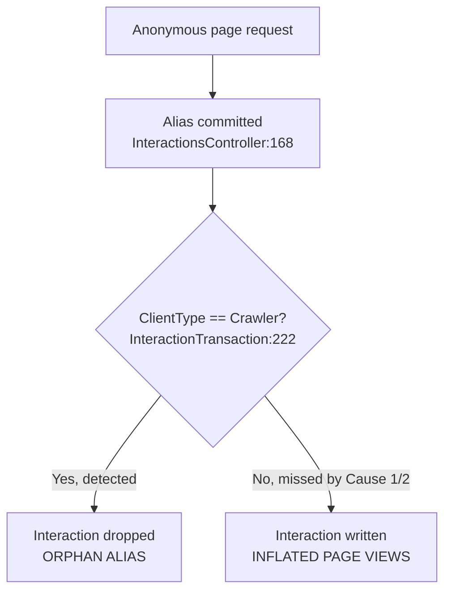

# Page View Interaction Bot Filtering

## Summary

Rock writes page view interactions for anonymous traffic through a JavaScript
callback. That callback already filters bots that cannot run JavaScript, but it
does nothing about bots that can. Two separate defects compound the problem: the
crawler classifier never sees the largest crawler on the internet because a
mobile pattern matches first, and the Anonymous Visitor `PersonAlias` is committed
to the database before the crawler check ever runs.

This spec covers five changes. Three tighten detection, one moves the check to the
right place in the pipeline, and one clears the orphan backlog the defect already
created. Together they reduce both inflated page view counts and orphaned
`PersonAlias` rows.

## Motivation

Two measurements from the Spark site's production database motivate this work.

1. **Orphaned aliases.** 179,613 of 784,383 Anonymous Visitor `PersonAlias` rows
   on the Spark site (about 23%) have no `Interaction` pointing at them. These are
   aliases that were created and committed, after which the interaction was
   discarded as a crawler. They persist for 365 days before `RockCleanup` removes
   them.

2. **Inflated page views.** Bot user agents that get misclassified as `Mobile` or
   `Tablet` are never filtered at all, so their page views land in reporting and
   skew every engagement metric built on top of `Interaction`.

The two symptoms are disjoint and have different causes, which matters for how the
fix is sequenced. See Root Cause below.

## Problem Statement

Bot traffic is being recorded as legitimate page view interactions, and bot traffic
that *is* correctly identified still leaves behind a permanent-for-a-year
`PersonAlias` row. The only bot defense in the entire anonymous page view path is a
single user agent test that runs at the very end of the pipeline, after the
irreversible database write has already happened.

## Root Cause

### Cause 1: crawler classification runs after mobile and tablet

`Rock/Net/UserAgentInfo.cs:242` tests patterns in this order: mobile, tablet,
crawler, Outlook, desktop. Googlebot Smartphone's user agent contains both
`Android` and `Mobile Safari`, so `_regexMobile1` at `Rock/Net/UserAgentInfo.cs:41`
matches and the method returns `"Mobile"` at `Rock/Net/UserAgentInfo.cs:252`. The
crawler test at `Rock/Net/UserAgentInfo.cs:262` is never reached.

`_regexTablet` at `Rock/Net/UserAgentInfo.cs:43` is just `android|ipad|playbook|silk`,
so any remaining bot user agent containing `android` returns `"Tablet"` for the same
reason. Only Googlebot Desktop, which has no mobile token, classifies correctly.

### Cause 2: the pattern list is too small

`_regexCrawler` at `Rock/Net/UserAgentInfo.cs:44` is eleven keywords. It misses
`HeadlessChrome`, `Chrome-Lighthouse`, `Claude-Web`, `anthropic-ai`,
`python-requests`, `Go-http-client`, `axios`, `node-fetch`, and `Scrapy`, among
others.

### Cause 3: the Anonymous Visitor alias is committed before the bot check

`Rock.Rest/Controllers/InteractionsController.Partial.cs:168` calls
`CreateAnonymousVisitorAlias()` and `SaveChanges()` immediately. The crawler filter
does not run until the transaction queue flushes at
`Rock/Transactions/InteractionTransaction.cs:222`. So the sequence is: commit the
alias, then decide the interaction was a bot and discard it. The alias survives with
nothing pointing at it.

This is made worse by cookie behavior. The alias is only created for a first-time
visitor, meaning no `ROCK_VISITOR_KEY` cookie. A real browser receives that cookie
in the API response and reuses the same alias on every later page. A crawler that
does not persist cookies across page loads looks brand new on every request, yet
still returns the `ROCK_FIRSTTIME_VISITOR` cookie on the same-origin POST because it
was set in the response it just received. The result is **one orphaned alias per bot
page view**, not one per bot.

### Cause 4: no prefetch or prerender handling

Nothing in the request path inspects `Sec-Purpose`, `Purpose`, `X-Moz`, or
`X-Purpose`, and the client script at `Rock/Web/UI/RockPage.cs:2474` does not check
`document.prerendering`. Chrome Speculation Rules and link prefetchers therefore
generate page views for pages a human never saw.

### Why the two symptoms are disjoint



Orphans come from bots the filter **caught**. Inflated page views come from bots the
filter **missed**. Fixing detection without also fixing the ordering will increase
the orphan count, because more bots will be correctly detected and dropped after
their alias was already committed. Cause 3 must be fixed in the same change as
Cause 1 and Cause 2.

## Affected Code Paths

**Primary (fix lands here):**

- `Rock/Net/UserAgentInfo.cs:242` — `DetermineClientType` ordering and pattern source.
- `Rock.Rest/Controllers/InteractionsController.Partial.cs:134` — `RegisterPageInteraction`, add early bot rejection ahead of alias creation.
- `Rock/Web/UI/RockPage.cs:2355` — `ProcessPageInteraction`, skip script emission for known bots and add the prerender guard to the emitted script.

**New files (4e):**

- `Rock/Jobs/PostUpdateJobs/PostV20RemoveOrphanedAnonymousVisitorAliases.cs`
- `Rock/Plugin/HotFixes/316_AddPostV20JobToRemoveOrphanedAnonymousVisitorAliases.cs`
- `Rock/SystemGuid/ServiceJob.cs` — new GUID constant.
- `Rock/Model/CRM/PersonAlias/PersonAliasService.cs` — extract the shared batch-delete routine.

**Secondary (downstream consumers of `ClientType`):**

- `Rock/Transactions/InteractionTransaction.cs:222` — existing crawler filter, becomes a second line of defense rather than the only one.
- `Rock/Model/Core/InteractionDeviceType/InteractionDeviceType.Logic.cs` — the obsolete `GetClientType` shim.
- `Rock/Personalization/PersonalizationRequestFilters/DeviceTypeRequestFilter.cs` — segments keyed on `ClientType`.
- `Rock/Personalization/PersonalizationRequestFilters/BrowserRequestFilter.cs`.

## Requirements

- The crawler test MUST run before the mobile and tablet tests in `DetermineClientType`.
- The crawler pattern list MUST come from a maintained external dataset rather than a hand-edited regex literal.
- The dataset MUST ship in the repository as a build artifact, not be downloaded at runtime. Rock installations cannot be assumed to have outbound internet access.
- The release packaging instructions MUST gain an explicit step to refresh the dataset file. Without this the list goes stale silently and the fix degrades with every release. See Open Questions.
- A request identified as a bot MUST NOT create an Anonymous Visitor `PersonAlias`.
- A request identified as a bot MUST NOT receive the interaction-registration script in the page response.
- The bot-rejection response MUST look identical to a success response to the caller. Do not signal to a scraper that it was detected.
- Requests carrying prefetch or prerender intent headers MUST NOT produce a page view interaction.
- The client script MUST defer its callback until prerender activation when `document.prerendering` is true.
- The existing `LogCrawlers` escape hatch MUST continue to work for callers that deliberately want crawler interactions.
- Reclassification MUST NOT alter any existing `InteractionDeviceType` rows. Historical data stays as-is.
- Existing orphaned Anonymous Visitor aliases MUST be removed rather than left to age out over 365 days.
- That cleanup MUST NOT extend the restart after an install. It runs as a post-update job, not inline in a migration.
- The cleanup MUST NOT delete an alias whose interaction may still be in the transaction queue.
- The cleanup MUST NOT delete an alias that is referenced by any other table. A foreign key violation on one row must not abort the batch.

## Proposed Fix

### 4a. Reorder the classification tests

In `DetermineClientType`, move the `_regexCrawler` test above the mobile and tablet
tests. The resulting order is: none, crawler, mobile, tablet, Outlook, desktop.

**This change cannot ship alone.** `_regexCrawler` contains the unanchored token
`bot`, which matches the CUBOT line of Android phones. Today mobile matches first so
those users classify as `Mobile`. Reordering without tightening the pattern would
classify real CUBOT users as `Crawler` and silently drop their page views. Either
ship 4a together with 4c, or tighten `bot` to require a delimiter
(`bot[/ ;)]|bot$`) as an interim measure.

### 4b. Move the bot check ahead of alias creation

Add a rejection guard at the top of `RegisterPageInteraction`, before the
`UserIdKey` block at `Rock.Rest/Controllers/InteractionsController.Partial.cs:158`:

```csharp
// Reject known bots before creating an Anonymous Visitor alias. The crawler
// filter in InteractionTransaction runs at queue-flush time, which is far too
// late to prevent the PersonAlias row from being committed.
var userAgentParser = RockApp.Current.GetRequiredService<IUserAgentParser>();
if ( interactionInfo.UserAgent.IsNotNullOrWhiteSpace()
     && userAgentParser.Parse( interactionInfo.UserAgent ).ClientType == "Crawler" )
{
    // Return a normal success response so the caller learns nothing.
    return Ok();
}
```

Add the equivalent check in `ProcessPageInteraction` at
`Rock/Web/UI/RockPage.cs:2355`, before the script is registered at
`Rock/Web/UI/RockPage.cs:2506`. That avoids the round trip entirely for the common
case where the crawler is identifiable from the initial page request.

The filter at `Rock/Transactions/InteractionTransaction.cs:222` stays in place. It
still covers the server-side logged-in path and every non-page-view interaction
channel.

### 4c. Replace the regex with a maintained pattern list

Replace the `_regexCrawler` literal with patterns loaded from
[crawler-user-agents](https://github.com/monperrus/crawler-user-agents), the same
MIT-licensed dataset behind the `isbot` library that Umami uses. Matomo takes the
equivalent approach through DeviceDetector.

Implementation notes:

- Ship the JSON at `Rock/Net/crawler-user-agents.json` as an embedded resource,
  registered in `Rock/Rock.csproj`.
- Strip the upstream `instances` arrays and keep only `pattern` and `url`. The
  upstream file is 543 KB, almost all of it sample user agents Rock never reads;
  stripped it is 127 KB for the same 1,500 patterns.
- Build the combined expression once in a static constructor. Deliberately **not**
  `RegexOptions.Compiled`: compiling an alternation of this size costs real startup
  time and memory, and buys nothing because `UserAgentParser` already caches results
  per user-agent string.
- Validate each upstream pattern individually and skip any that .NET cannot parse.
  The patterns are authored for several regex flavors, and combining first would
  discard the whole list over one bad entry.
- Keep the legacy keyword expression as a fallback when the resource cannot be read,
  so a packaging mistake degrades to today's behavior rather than disabling crawler
  detection. Tighten its bare `bot` token to `bot[\/ ;)]|bot$` there so the fallback
  does not reintroduce the CUBOT false positive.
- Record the snapshot date in a comment so staleness is visible in a diff.

**Packaging step.** This dataset is only useful if it is refreshed. The release
packaging instructions need a new step, run during release preparation:

```bash
curl -s https://raw.githubusercontent.com/monperrus/crawler-user-agents/master/crawler-user-agents.json \
  | node -e "let s='';process.stdin.on('data',d=>s+=d).on('end',()=>{const a=JSON.parse(s).map(e=>{const o={pattern:e.pattern};if(e.url)o.url=e.url;return o;});process.stdout.write(JSON.stringify(a,null,2)+'\n')})" \
  > Rock/Net/crawler-user-agents.json
```

Then run `Rock.Tests` and commit. This is a process change, not a code change, and it
is a hard requirement rather than a nice-to-have. A stale list is the single most
likely way this fix silently stops working.

`CrawlerUserAgentsTests.EmbeddedDataset_IsLoaded` fails if the resource goes missing
or stops parsing, so a packaging mistake breaks the build rather than silently
degrading crawler detection in production. That test is the enforcement mechanism for
the step above.

### 4d. Prefetch and prerender guards

**Server side.** Reject the interaction when the request carries prefetch intent.
Check, case-insensitively, for `Sec-Purpose` containing `prefetch` or `prerender`,
`Purpose` equal to `prefetch`, `X-Moz` equal to `prefetch`, and `X-Purpose` equal to
`preview`. Apply this in both `ProcessPageInteraction` and `RegisterPageInteraction`.
Matomo does the same in `VisitExcluded.php`.

**Client side.** Wrap the existing callback body at `Rock/Web/UI/RockPage.cs:2474`
so it waits for activation:

```javascript
Sys.Application.add_load(function () {
    var sendInteraction = function () {
        // ...existing dedupe and $.ajax body, unchanged...
    };

    if (document.prerendering) {
        document.addEventListener('prerenderingchange', sendInteraction, { once: true });
    }
    else {
        sendInteraction();
    }
});
```

This mirrors what `gtag.js` does by default. Both halves are needed: the header check
catches prefetch, the client guard catches prerender activation.

### 4e. Clear the existing orphan backlog

Fixes 4a through 4d stop the inflow. They do nothing about the aliases already in the
table, which today age out only after the 365-day `RockCleanup` retention period.

**Shape: a plugin job.** A plugin migration registers a run-once post-update job; the
job does the deleting. The migration itself only inserts a `ServiceJob` row, so it
adds no measurable time to the upgrade. `Rock.Migrations.RockStartup.DataMigrationsStartup`
kicks the job off inside a `Task.Run` at `Rock.Migrations/RockStartup/DataMigrationsStartup.cs:178`,
so the work happens in the background and never blocks the restart. The job deletes
itself when it finishes, matching every other post-update job.

Doing the delete inline in the migration would be the wrong call. On the Spark site
that is 179,613 rows, each potentially needing an individual retry on a foreign key
violation, all of it inside the startup path.

**Files:**

- `Rock/Jobs/PostUpdateJobs/PostV20RemoveOrphanedAnonymousVisitorAliases.cs` — the job.
- `Rock/Plugin/HotFixes/316_AddPostV20JobToRemoveOrphanedAnonymousVisitorAliases.cs` — registration, next available migration number.
- `Rock/SystemGuid/ServiceJob.cs` — a new constant for the job GUID.

Registration follows `Rock/Plugin/HotFixes/278_AddPostV183UpdateJobForBrokenAchievementTypes.cs`:

```csharp
RockMigrationHelper.AddPostUpdateServiceJob(
    name: "Rock Update Helper v20.0 - Remove Orphaned Anonymous Visitor Aliases",
    description: "Removes Anonymous Visitor PersonAlias records that were created for bot traffic whose interaction was subsequently discarded as a crawler. This job will delete itself when complete.",
    jobType: typeof( Rock.Jobs.PostV20RemoveOrphanedAnonymousVisitorAliases ).FullName,
    cronExpression: "0 0 20 1/1 * ? *",
    guid: Rock.SystemGuid.ServiceJob.DATA_MIGRATIONS_200_REMOVE_ORPHANED_ANONYMOUS_VISITOR_ALIASES );
```

The job class lives in the `PostUpdateJobs` folder but uses the `Rock.Jobs`
namespace, matching `PostV20AddExceptionListIndex` and the other recent jobs. Older
jobs in that folder use `Rock.Jobs.PostUpdateJobs`; the folder is mixed.

**Selection criteria.** Delete a `PersonAlias` only when all four hold:

1. `PersonId` is the Anonymous Visitor person (`7EBC167B-512D-4683-9D80-98B6BB02E1B9`).
2. No `Interaction` row references it.
3. `InternalMessage` is null. This is the same guard `RockCleanup` uses at
   `Rock/Jobs/RockCleanup.cs:3068`; a non-null value means a previous delete attempt
   already failed on this row and stamped the reason.
4. `LastVisitDateTime` is older than 24 hours.

Criterion 4 is the one that is easy to miss. `RegisterPageInteraction` commits the
alias and then calls `Enqueue()`, so there is a window where a perfectly legitimate
alias has no interaction yet because the transaction queue has not flushed. Without a
recency buffer the job would race that window and delete live visitors' aliases.

**Reuse the existing delete routine.** `RockCleanup.RemoveStaleAnonymousVisitorRecord`
at `Rock/Jobs/RockCleanup.cs:3053` already implements exactly the deletion mechanics
needed: batches of 500, `BulkDelete`, and on failure a per-row retry that logs the
inner exception and stamps `InternalMessage` so the row is skipped next time. Extract
that loop into `PersonAliasService.DeletePersonAliasesInBatches` and call it from both
places rather than copying it.

The two callers differ in one more way than the selection query. `RockCleanup` must
null out `Interaction.PersonAliasId` before attempting each batch, because the aliases
it removes generally do have interactions. The new job does not, because its aliases
have none by definition. That step is therefore passed in as an optional
`beforeBatchDelete` delegate rather than baked into the shared method, which keeps
`RockCleanup`'s behavior byte-for-byte identical to what it was.

**Do not change `RockCleanup`'s existing behavior.** The 365-day retention sweep stays
as-is. This job is a one-time backlog clear, not a replacement.

## Fix Risks

1. **Reclassification changes personalization behavior.** A user agent that was
   `Mobile` yesterday may be `Crawler` today. `DeviceTypeRequestFilter` segments will
   shift. Existing `InteractionDeviceType` rows keep their old `ClientType`, so
   reports will mix old and new classifications across the cutover date.

2. **False positives are now silent and irreversible.** Once 4b lands, a
   misclassified real visitor gets no alias and no interaction, and there is no
   record that anything was dropped. This is the main argument for pairing 4a with
   4c rather than shipping the reorder alone.

3. **Orphans will not go to zero.** Interactions lost to an app pool recycle between
   the `SaveChanges()` and the queue flush produce identical-looking orphan rows.
   Expect a residual.

4. **Third-party list obligations.** crawler-user-agents is MIT licensed and requires
   attribution. Confirm it is acceptable to vendor into the Rock distribution.

5. **Over-filtering on prefetch.** If a browser sends a prefetch header on what turns
   out to be a real navigation, that page view is lost. The risk is low because the
   client-side prerender guard fires on activation and covers the common case.

6. **The cleanup job deletes real visitors if the recency buffer is wrong.** Any alias
   whose interaction is still queued looks identical to an orphan. The 24-hour buffer
   in 4e is the only thing preventing that, and the deletion is not recoverable. This
   is the highest-consequence part of the change and deserves the most scrutiny in
   review.

7. **Cleanup runtime on large databases.** The Spark site has 179,613 rows to remove.
   Any row that fails the bulk delete falls back to an individual delete with its own
   context. A site with many foreign key violations could take a long time. This is
   background work so it does not block anything, but the job should honor a
   `CommandTimeout` attribute the way other post-update jobs do.

## Verification Steps

1. Unit-test `DetermineClientType` against the Googlebot Smartphone user agent and
   confirm it returns `"Crawler"`, not `"Mobile"`.
2. Unit-test the same method against a CUBOT Android user agent and confirm it
   returns `"Mobile"`, not `"Crawler"`. This is the regression 4a introduces if 4c is
   not paired with it.
3. Unit-test against `HeadlessChrome`, `python-requests`, and `Chrome-Lighthouse` and
   confirm all three return `"Crawler"`.
4. POST to `/api/Interactions/RegisterPageInteraction` with a crawler user agent and a
   `ROCK_FIRSTTIME_VISITOR` cookie. Confirm the response is 200, no `PersonAlias` row
   is created, and no `Interaction` row is created.
5. Repeat step 4 with a normal browser user agent. Confirm exactly one `PersonAlias`
   and one `Interaction` are created.
6. Request a page with `Sec-Purpose: prefetch` and confirm no interaction is written.
7. Load a page under Chrome Speculation Rules prerender, confirm no interaction fires
   before activation, then activate and confirm exactly one fires.
8. Re-run the orphan-count query against a database with the fix deployed and confirm
   the daily orphan creation rate drops.
9. Confirm a caller that sets `LogCrawlers = true` still records crawler interactions.
10. On a restored copy of a large database, record the orphan count, run the 4e job,
    and confirm the count drops to near zero and that no alias with an `Interaction`
    was removed.
11. Create an Anonymous Visitor alias, leave its interaction unflushed in the queue,
    and run the 4e job. Confirm the alias survives because of the 24-hour recency
    buffer.
12. Seed an Anonymous Visitor alias referenced by another table so its delete fails.
    Confirm the batch completes, the failure is logged, and `InternalMessage` is
    stamped on that row.
13. Time an upgrade with the 4e plugin migration included and confirm startup time is
    unchanged, with the deletion work occurring afterward in the background.
14. Confirm the job removes itself from `ServiceJob` after a successful run.

## Open Questions

1. **Where do the release packaging instructions live?** A search of the repository
   turned up no release or packaging checklist document. `Dev Tools/Packaging`
   contains only an icon and a license file. The 4c refresh step needs to be added
   somewhere durable; someone needs to point at the right home for it.

2. **Should dropped bot traffic be observable?** Matomo's Bot Tracker plugin logs
   bots to a separate table rather than discarding them, so administrators can see
   what was excluded and audit false positives. Rock currently drops silently. Worth
   deciding whether a counter or a debug-level log entry is warranted.

## Out of Scope

- **IP-range and reverse-DNS verification** of Googlebot and Bingbot. This is the only
  technique that catches a bot lying about its user agent, and Matomo does it, but it
  is a larger change with its own data-maintenance burden. Worth a follow-up spec.
- **Deferring Anonymous Visitor alias creation** until the second page view or first
  engagement signal. Structurally the biggest win available, but it changes
  personalization and segment behavior and needs its own discussion.
- **Rate limiting or authenticating** `/api/Interactions/RegisterPageInteraction`. The
  endpoint currently accepts a client-supplied `PageId` from any caller with no
  throttling. Real, but a separate concern from bot filtering.
- **Changing `RockCleanup`'s 365-day retention sweep.** The existing behavior stays.
  4e is a one-time backlog clear that runs alongside it, not a replacement for it.

## Considered but Rejected

### Download the crawler list at runtime
Rejected. Rock installations cannot be assumed to have outbound internet access, and a
startup network dependency is a new failure mode for a feature that must degrade
gracefully. Vendoring the file and refreshing it at packaging time gives the same
freshness with none of the runtime risk.

### Block on `navigator.webdriver`
Rejected as a hard block. Accessibility tooling and legitimate automated testing set
it. Worth collecting as a signal the server can weigh alongside others, but not on its
own.

### Drop the JavaScript callback in favor of server-side-only recording
Rejected. The callback is currently Rock's most effective bot filter, because it
excludes everything that cannot execute JavaScript. Removing it would make the problem
substantially worse.

### Delete the alias after the crawler check fails
Rejected. The alias is already committed and the visitor key cookie has already been
returned to the client by that point. Deleting it afterward is racy and leaves the
client holding a key to a row that no longer exists. Preventing the write is correct;
undoing it is not.

### Delete the orphan backlog inline in the plugin migration
Rejected. Plugin migrations run during the startup migration phase, so 179,613 deletes
with per-row foreign key retries would directly extend the restart after an install.
Registering a post-update job costs one `ServiceJob` insert at migration time and moves
the actual work to a background `Task.Run`.

### Let `RockCleanup` age the orphans out on its own
Rejected. It works, but it takes 365 days by default, and the backlog is large enough
today that waiting a year is not a reasonable answer. The one-time job clears it now;
`RockCleanup` continues to handle the steady state.

### Load the crawler list from a Defined Type so administrators can edit it
Rejected. Turns a maintained upstream dataset into per-installation configuration
drift, and puts a cache lookup in the hot path of every anonymous page request.

## Related

- [crawler-user-agents](https://github.com/monperrus/crawler-user-agents) — proposed pattern source, MIT licensed.
- [isbot](https://github.com/omrilotan/isbot) — reference implementation of the same dataset, used by Umami.
- [Umami send route](https://github.com/umami-software/umami/blob/master/src/app/api/send/route.ts) — single-line bot rejection at the top of the handler.
- [Matomo VisitExcluded.php](https://github.com/matomo-org/matomo/blob/5.x-dev/core/Tracker/VisitExcluded.php) — ordered exclusion chain including prefetch header detection.
- [Known bot-traffic exclusion, Google Analytics Help](https://support.google.com/analytics/answer/9888366?hl=en) — the IAB/ABC list approach.
- [Prerender pages in Chrome](https://developer.chrome.com/docs/web-platform/prerender-pages) — `document.prerendering` and the `prerenderingchange` event.
