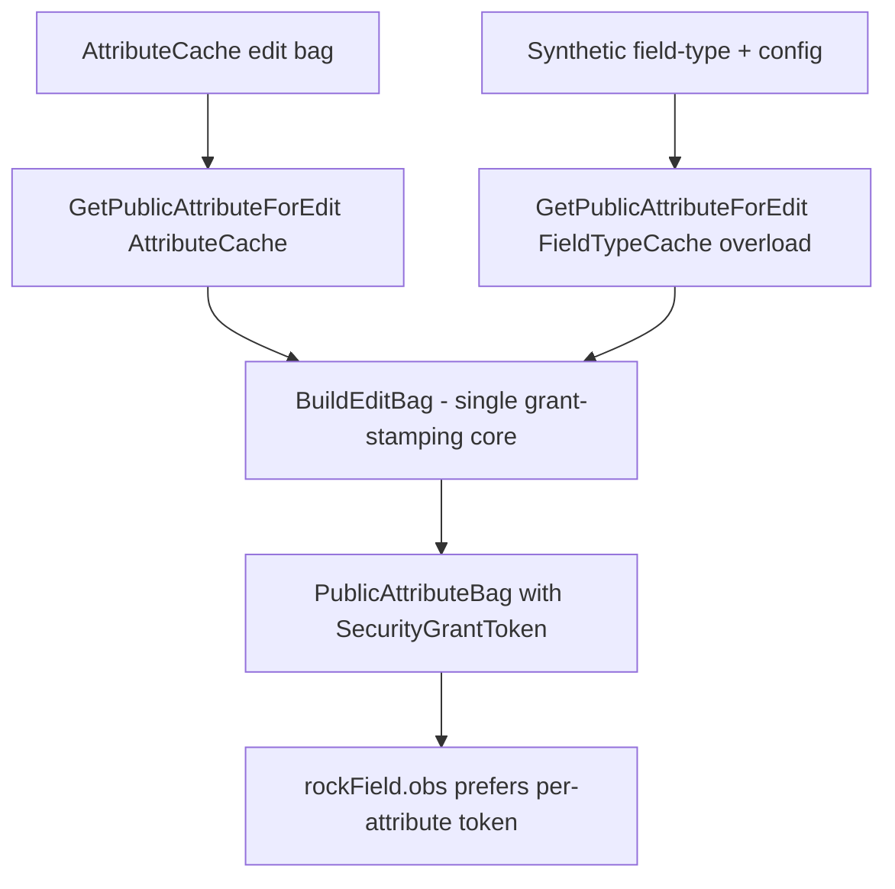

# Attribute Field Security Grant Consolidation

## Summary

Field types that need extra permissions to function (Defined Value with Add, Asset, Binary File, Workflow, Connection Request) contribute rules to a `SecurityGrant`. Historically these rules were folded into a single **block-level** grant via `SecurityGrant.AddRulesForAttributes(...)`. As of `ccc305cea3` (2026-04-23, Fixes #6794), `PublicAttributeHelper.GetPublicAttributeForEdit` also builds a **per-attribute** grant and stamps its token onto the `PublicAttributeBag`. On the Obsidian side, `rockField.obs` prefers the per-attribute token and only falls back to the block grant.

This spec establishes that, for attribute rendering/editing, the block-level `AddRulesForAttributes` call is now redundant, and proposes: (1) removing that call from the 41 entity-detail grant builders (keeping the block grant object itself for non-attribute controls), and (2) routing the 13 hand-built edit `PublicAttributeBag` sites through the standard helper so no code path can produce an edit bag without the grant token.

## Motivation

Two mechanisms now cover the same job (adding field-type rules for an entity's attributes), and they cover it in two different files. That is exactly the kind of duplication where someone fixes a field-type grant behavior in one path and not the other. The #6794 fix already demonstrated the failure mode: attribute editors were not getting the grant rules they needed. Consolidating onto a single per-attribute mechanism, with the token-stamping logic extracted into one method, removes the redundancy and the drift risk in one pass.

This is scoped to **attribute** rendering/editing only. Blocks will still need to construct security grants manually for UI controls they use directly or indirectly outside of attributes (standalone pickers, asset/file managers, etc.). That mechanism is intentionally left in place.

## Background: how the two mechanisms work

Both pathways ultimately call the same field-type hook `ISecurityGrantFieldType.AddRulesToSecurityGrant(grant, configValues)` (`Rock/Field/ISecurityGrantFieldType.cs:36`).

**Block-level (older):** `SecurityGrant.AddRulesForAttributes(...)` (`Rock/Utility/ExtensionMethods/SecurityGrantExtensions.cs:61`) walks an entity's EDIT-authorized attributes and folds every field type's rules into one block-wide grant. Emitted as `box.SecurityGrantToken`.

**Per-attribute (recent):** `GetPublicAttributeForEdit` (`Rock/Attribute/PublicAttributeHelper.cs:162`) builds a fresh grant per attribute, pins it to a 1-day lifetime, and stamps `bag.SecurityGrantToken`. Note it is wired only into the *edit* helper; `GetPublicAttributeForView` (`Rock/Attribute/PublicAttributeHelper.cs:107`) sets no token.

**Client reconciliation:** `rockField.obs:97` resolves the token as `props.attribute.securityGrantToken ?? parentSecurityGrantToken.value` — the per-attribute token wins, the block grant is the fallback.

### Why the block-level attribute rules are redundant

- **Client-side, the security grant is edit-time only.** It is consumed exclusively by edit controls that make authenticated REST calls (uploaders, pickers, tree-item providers). A FieldTypes-wide search finds exactly one component referencing the grant (`universalItemTreePickerFieldComponents.ts`), and it is edit-only. No formatted/view component reads it.
- **Edit mode:** the per-attribute token takes precedence in `rockField`, so the block-level attribute rules are already overridden.
- **View mode:** `GetPublicAttributeForView` emits no token, but nothing needs one. Read-only attribute display is server-rendered HTML backed by `.ashx` handlers (e.g. `GetImage.ashx`) that carry their own authorization. Confirmed by `imageFieldComponents.ts`, which exports no formatted component at all.

Additionally, the per-attribute mechanism is strictly **more correct**: `AddRulesForAttributes` only walks an entity's direct attributes and never sees field types nested inside composite fields, whereas `MatrixFieldType` (`Rock/Field/Types/MatrixFieldType.cs:173`) already builds correct per-attribute grants for its child attributes via `GetPublicAttributeForEdit`.

## Requirements

- The system MUST continue to provide working field-type security grants for every attribute editor rendered through `rockField`, in both entity-detail and non-entity-detail contexts.
- The token-stamping logic (build grant, run `AddRulesToSecurityGrant`, apply the 1-day lifetime, set `bag.SecurityGrantToken`) MUST exist in exactly one place so it cannot drift.
- Every server code path that produces an **edit-mode** `PublicAttributeBag` for a grant-requiring field type MUST stamp the per-attribute token, OR be explicitly documented as relying on a host-provided grant.
- Removing the block-level attribute rule injection MUST NOT change behavior for non-attribute controls (standalone pickers, asset/file managers) that legitimately depend on the block grant.
- The change MUST NOT break backward compatibility for plugins. `AddRulesForAttributes` is `public`; if it is retained, its signature stays intact; if it is deprecated, it follows the `[RockObsolete]` process with tech-lead approval.

## Proposed Approach

### Part 1 — Remove the redundant block-level attribute rules

`AddRulesForAttributes` is called from 41 entity-detail grant builders. All of them populate their editable attributes via `LoadAttributesAndValuesForPublicEdit` / `GetPublicAttributesForEdit` (`Rock/Utility/ExtensionMethods/AttributesExtensions.cs:280`, `:353`), so each already stamps per-attribute tokens **and** redundantly folds the same rules into the block grant.

Remove the `AddRulesForAttributes(...)` call from each. Keep the surrounding `SecurityGrant` construction intact — blocks with standalone controls still need it (e.g. `RegistrationInstanceDetail` adds asset/file rules, `CheckInContextSetter` adds a location-picker rule; those are unrelated to attributes and are out of scope).

Call sites (41):

- Base: `Rock.Blocks/RockEntityDetailBlockType.cs:69`
- `entity, person` overload (38): BlockTypeDetail, ContentCollectionDetail, LavaApplicationDetail, LavaEndpointDetail, LavaShortcodeDetail, LayoutDetail, MediaAccountDetail, MediaFolderDetail, PageRouteDetail, PersistedDatasetDetail, PersonalLinkSectionDetail, CommunicationFlowDetail, SystemPhoneNumberDetail, AssetStorageProviderDetail, DeviceDetail, DocumentTypeDetail, FollowingEventTypeDetail, ScheduleDetail, ServiceJobDetail, SuggestionDetail, AssessmentTypeDetail, PersonDetail/AttributeValues, PersonDetail/KeyAttributes, AchievementAttemptDetail, StreakDetail, StreakTypeDetail, EventItemDetail (x2), InteractiveExperienceDetail, FinancialBatchDetail, FinancialPledgeDetail, FinancialPledgeEntry, MobileApplicationDetail, MobileDeepLinkDetail, PrayerRequestDetail, MergeTemplateDetail, AppleTvAppDetail
- `IEnumerable<AttributeCache>` overload (3): `Core/CategoryList.cs:198`, `Core/DefinedTypeDetail.cs:123`, `Core/DefinedValueList.cs:128`

The 3 `IEnumerable<AttributeCache>` callers pass a *related* entity's attributes (e.g. the defined values under a defined type). Those attribute editors also flow through `GetPublicAttributeForEdit`, so they are safe, but they warrant an explicit re-confirm during implementation since the grant's entity differs from the bag's entity.

Once all callers are removed, decide whether to keep `SecurityGrantExtensions.AddRulesForAttributes` for external/plugin use (leave as-is) or deprecate it (`[RockObsolete]`, tech-lead approval).

### Part 2 — Consolidate hand-built edit bags onto the helper

13 sites build an edit-mode `PublicAttributeBag` by hand and set no token. Extract the token-stamping into a single core builder, then route everything through it:

```csharp
// Core — the ONLY place the grant token is built.
private static PublicAttributeBag BuildEditBag(
    FieldTypeCache fieldType, Dictionary<string,string> privateConfigValues,
    string name, string key, string description, bool isRequired, int order,
    Guid attributeGuid, List<PublicAttributeCategoryBag> categories );

// Existing overload becomes a thin adapter over the core.
public static PublicAttributeBag GetPublicAttributeForEdit( AttributeCache attribute );

// New overload for synthetic (no-AttributeCache) callers.
public static PublicAttributeBag GetPublicAttributeForEdit(
    FieldTypeCache fieldType, Dictionary<string,string> privateConfigValues,
    string name, string key = null, string description = null,
    bool isRequired = false, int order = 0, Guid? attributeGuid = null );
```

The 13 sites split into two buckets by one question: is there a real `AttributeCache` in hand?

**Bucket (a) — real `AttributeCache` available (8 sites) → call the existing `GetPublicAttributeForEdit(attribute)`.**

| Site | Migration delta |
|---|---|
| `Rock/Reporting/DataFilter/PropertyFilter.cs:152` | Override `.Name` with `entityField.Title` after the call |
| `Rock/Reporting/DataFilter/ContentChannelItem/ContentChannelItemAttributesFilter.cs:136` | Override `.Name` |
| `Rock/Reporting/DataFilter/Group/GroupAttributesFilter.cs:128` | Override `.Name` |
| `Rock/Reporting/DataFilter/GroupMembers/GroupMemberAttributesFilter.cs:208` | Override `.Name` |
| `Rock/Reporting/DataFilter/Person/StepParticipantsByAttributeValueFilter.cs:134` | Override `.Name` |
| `Rock/Reporting/DataFilter/Step/StepsAttributeValuesFilter.cs:134` | Override `.Name` |
| `Rock/Reporting/DataFilter/Workflow/WorkflowAttributesFilter.cs:182` | Override `.Name` |
| `Rock.Rest/v2/ControlsController.cs:11999` (`GetAttributes(IHasInheritedAttributes)`) | Near drop-in; already sets Name/Key/Description/IsRequired/Order/Config |

All 7 DataFilter `attribute` variables are confirmed `AttributeCache` (from `entity.Attributes.Select(a => a.Value)` or `AttributeCache.Get(...)`).

**Bucket (b) — synthetic bag, no `AttributeCache` (5 sites) → call the new overload.**

| Site | Inputs | Notes |
|---|---|---|
| `Rock/AI/Agent/AgentSkillComponent.cs:202` | `FieldTypeCache` + `FieldAttribute` (from `GetConfigurationAttributes()`) | Byte-identical loop to the UniversalItemFieldType site |
| `Rock/Field/Types/UniversalItemFieldType.cs:537` | `FieldTypeCache` + `FieldAttribute` | Direct analog of `MatrixFieldType`, which already uses the helper |
| `Rock.Blocks/Reporting/MetricValueDetail.cs:190` | `FieldTypeCache` + private config + `metricPartition.Label`/`IsRequired` | Value computed separately; unaffected |
| `Rock.Blocks/Reporting/MetricValueList.cs:302` | `FieldTypeCache` + private config + label | |
| `Rock.Blocks/WorkFlow/FormBuilder/FormBuilderDetail.cs:927` | workflow form field + pre-resolved universal guid + pre-computed public config | The one that needs care — see Fix Risks |

### Data flow after consolidation



## Affected Code Paths

Primary (where changes land):
- `Rock/Attribute/PublicAttributeHelper.cs` — extract `BuildEditBag`; add the `FieldTypeCache` overload.
- The 41 `AddRulesForAttributes` call sites listed in Part 1.
- The 13 hand-built bag sites listed in Part 2.
- `Rock/Utility/ExtensionMethods/SecurityGrantExtensions.cs` — retain or deprecate `AddRulesForAttributes`.

Secondary (consumers to verify, no change expected):
- `Rock.JavaScript.Obsidian/Framework/Controls/rockField.obs` — token precedence unchanged.
- `Rock.JavaScript.Obsidian/Framework/Utility/block.ts` — block grant + `RenewSecurityGrantToken` path unchanged.

## Fix Risks

- **FieldTypeGuid semantics (bucket a and the Metric sites).** These sites currently emit `FieldTypeGuid = fieldType.Guid` (the real guid). The helper emits `ControlFieldTypeGuid`. For classic field types the two are equal, so it is a no-op, and every always-grant field type (DefinedValue-with-Add, Asset, BinaryFile, Workflow, ConnectionRequest) is classic. They differ only for *universal* field types (e.g. the universal tree-item picker, itself a grant type), where `ControlFieldTypeGuid` is the value the client needs to select the edit component. The switch is therefore very likely a latent fix rather than a regression, but universal field types used as filter/metric sources are the case to test deliberately. The two dynamic-component sites already use `ControlFieldTypeGuid`, so they carry no guid delta.
- **FormBuilderDetail.** It feeds pre-computed *public* config values and resolves `universalFieldTypeGuidAttribute?.Guid ?? field.FieldTypeGuid` by hand. To use the new overload it must instead supply *private* config values plus a `FieldTypeCache`. If that plumbing proves awkward, an acceptable fallback is to leave the bag construction in place and only add the `ISecurityGrantFieldType` grant block inline.
- **Non-attribute grant regressions.** Removing `AddRulesForAttributes` must not touch the standalone-control grants. Blocks that add both attribute rules and manual control rules (verify each) must retain the manual rules.
- **Token lifetime.** Per-attribute tokens are non-renewable and expire after 1 day by design (a decision already made: requiring a page reload after 24 hours of sitting on an edit page is acceptable). Consolidating does not change this; it should be restated so reviewers do not treat it as a gap.

## Verification Steps

1. Build `Rock.sln`; run existing attribute/field-type tests.
2. On a representative entity-detail block (e.g. a Group with an Asset or Defined-Value-with-Add attribute), confirm the attribute editor still loads and saves the protected value with `AddRulesForAttributes` removed.
3. On a block with a standalone grant-requiring control (e.g. `RegistrationInstanceDetail`, `CheckInContextSetter`), confirm the control still functions (manual grant retained).
4. In a Data View / Report filter using a grant-requiring attribute as a filter source, confirm the filter value editor renders and functions with the token now present.
5. In the AI Agent skill configuration and a Universal Item field type configuration, confirm the dynamic sub-attribute editors render.
6. In Metric Value detail/list with an entity-partition field type, confirm the partition value editor renders.
7. In the Form Builder conditional-field filter UI, confirm filter sources render (special attention to universal field types).
8. Confirm read-only attribute display (image/file/binary) still renders in view mode.

## Out of Scope

- Manual block-level grants for non-attribute controls (standalone pickers, asset/file managers). These stay.
- Per-attribute token **renewal**. Deliberately not pursued; the 1-day non-renewable lifetime is accepted.
- Adding a grant token to `GetPublicAttributeForView`. View rendering needs no client-side grant.
- Any change to the `SecurityGrant` / `SecurityGrantRule` / `ISecurityGrantFieldType` core protocol.

## Considered but Rejected

### Keep AddRulesForAttributes as a belt-and-suspenders fallback for edit
Rejected as the default. Leaving a redundant-but-live grant path is precisely what invites drift (a fix applied to one path and not the other, as #6794 showed). If the audit surfaces an edit path that genuinely bypasses `GetPublicAttributeForEdit`, the correct response is to route it through the helper (Part 2), not to keep the block-level sweep alive.

### Migrate all 13 sites with ad-hoc inline edits
Rejected. Thirteen independent copies of the grant-stamping logic is the same duplication problem at a smaller scale. Extracting one `BuildEditBag` core and routing both overloads through it means the token logic can never silently diverge again.

### Extend the per-attribute pattern to GetPublicAttributeForView
Rejected. No formatted/view field component consumes a security grant; read-only rendering is server-produced HTML using `.ashx` handlers with their own authorization. Adding a token there would be dead weight.

## Related

- Commit `ccc305cea3` — "(Engagement) Fixed an issue with how attribute field security grants are handled" (Fixes #6794); introduced the per-attribute grant in `GetPublicAttributeForEdit`.
- `Rock/Attribute/PublicAttributeHelper.cs:137` — `GetPublicAttributeForEdit`.
- `Rock/Utility/ExtensionMethods/SecurityGrantExtensions.cs:61` — `AddRulesForAttributes`.
- `Rock/Field/ISecurityGrantFieldType.cs:36` — the field-type grant hook.
- `Rock.JavaScript.Obsidian/Framework/Controls/rockField.obs:97` — client token precedence.
