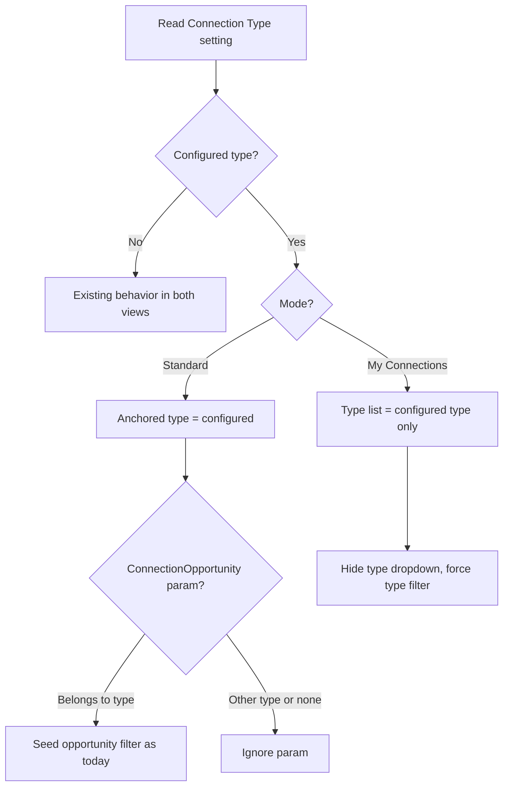

# Connections Hub: Connection Type and Limit to Assigned Connections Settings

## Summary

The legacy WebForms Connection Request Board exposed two block settings that the Obsidian Connections Hub never picked up: a list of Connection Types to display, and a boolean that limits the board to requests assigned to the current person. This spec adds both to `Rock.Blocks/Engagement/ConnectionsHub.cs`. The type setting is deliberately narrowed from the legacy multi-select to a single `ConnectionTypeField`. When set, the Hub is pinned to that type: Standard view ignores the `ConnectionType` page parameter and My Connections view hides its Connection Type dropdown. When Limit to Assigned Connections is enabled, the slicer's connector dropdown stays visible but is disabled and reads "My Requests", and the server filters every request to the current person.

## Motivation

Hotfix 286 deleted the legacy board block and block type (`Rock/Plugin/HotFixes/286_ConnectionsBoardAndGridUpdates.cs:137`), so sites that relied on these settings lost them with no Hub equivalent. Two use cases are blocked today:

- A Hub page dedicated to one Connection Type (a "Serving" hub, a "Baptism" hub) that works without a `ConnectionType` on every inbound link and cannot be steered to another type by editing the URL.
- A connector-facing page that never lets the viewer switch to another person's requests.

The Hub already resolves a single type in Standard view and already filters by connector through the slicer. The settings replace the URL-driven and preference-driven sources of those two values with block configuration.

## Current State

The Hub runs in one of two modes, chosen in `GetOptions()` at `Rock.Blocks/Engagement/ConnectionsHub.cs:282`:

| Mode | Trigger | Type scope | Slicer contents |
|---|---|---|---|
| Standard | `ConnectionType` or `ConnectionOpportunity` page parameter | Exactly one type, from the parameter (`:454`) | Connector dropdown (blank = "All Requests"), Opportunity dropdown |
| My Connections | `IsMyConnectionsView=true` plus `Connector` page parameter | Every active type (`:687`) | Connection Type dropdown (blank = "All Types"), Opportunity dropdown |

Standard view with no page parameter errors with "Connection Type not found." (`:458`). The connector and type dropdowns are mutually exclusive in the template (`Rock.JavaScript.Obsidian.Blocks/src/Engagement/connectionsHub.obs:15-23`), both gated on `isMyConnectionsView`.

Filtering happens server-side in `GetGridData()` (`:4154`). Standard view re-resolves the type from the page parameters (`:4168`); My Connections view reads the `FilterConnectionType` person preference (`:4163`) and applies no type clause when it is blank. The connector filter (`:4381`) reads the `SelectedConnector` preference, treats the literal `"All Requests"` as "no filter", and falls back to the current person only in Standard view when the preference is empty. `GetCompletionMetrics()` (`:1446`) applies the same two preferences to the snapshot.

The client mirrors both filters for in-memory refiltering at `connectionsHub.obs:2065` and persists them through watchers at `:4577` and `:4596`.

The legacy board applied its settings as follows (from `git show 3f99e195ac^:RockWeb/Blocks/Connection/ConnectionRequestBoard.ascx.cs`):

- Connection Types: `GetConnectionTypeViewModels()` filtered the opportunity query to the configured type GUIDs when any were set (`:5634`).
- Limit to Assigned: `ConnectorPersonAliasId` returned the current person's alias regardless of the picker (`:647`), and the connector picker was rendered disabled rather than hidden (`:4384`).

## Requirements

### Block settings

- The block MUST declare a `ConnectionTypeField` named "Connection Type", key `ConnectionType`, not required, Order 8, description "Optional connection type to limit the block to. When set, the block always displays this type and ignores the ConnectionType page parameter."
- The block MUST declare a `BooleanField` named "Limit to Assigned Connections", key `OnlyShowAssigned`, default `false`, required, Order 9, description "When enabled, only requests assigned to the current person will be shown."
- Both attributes MUST use the non-obsolete name-only constructors with named properties, matching the block's existing attributes.
- Order values MUST continue the block's existing sequence (next free slots are 8 and 9), not the legacy 13 and 14.
- With both settings at their defaults the Hub MUST behave exactly as it does today in every mode.

### Connection Type

Define the "configured type" as the active Connection Type whose GUID is stored in the setting. An empty setting, or a GUID that no longer resolves to an active type, means no configured type and current behavior applies.

Standard view:

- When a configured type exists, the Hub MUST use it as the anchored type. The `ConnectionType` page parameter MUST be ignored. No page parameter is required.
- A `ConnectionOpportunity` page parameter MUST be honored only when the opportunity belongs to the configured type. Otherwise it MUST be ignored: no opportunity filter preference is seeded and `ConnectionOpportunityGuidFromPageParameter` stays null.
- The configured type MUST also drive `GetGridData()` and every block action that today resolves the type from page parameters, so a crafted request cannot target another type.
- The `Request` page parameter (open a request, or `0` for add mode) MUST keep working, since it no longer needs a `ConnectionType` alongside it when the block is pinned.

My Connections view:

- When a configured type exists, the type list built at `:687` MUST contain only that type. Everything derived from the list (type dropdown items, per-type options, status and type groupings, snapshot metrics, edit permission checks) inherits the restriction.
- The Connection Type dropdown MUST be hidden.
- `GetGridData()` and `GetCompletionMetrics()` MUST filter to the configured type regardless of the stored `FilterConnectionType` preference or the `ConnectionType` page parameter.
- When no configured type exists, My Connections view MUST be unchanged.

### Limit to Assigned Connections

- When enabled, `GetGridData()` and `GetCompletionMetrics()` MUST filter to requests whose connector is the current person, regardless of the `SelectedConnector` preference or the `Connector` page parameter. Filtering stays by PersonId (`cp.[Id]`), consistent with the engineering note at `:521`.
- The `Connector` page parameter MUST be ignored for filtering in both views. In My Connections view the connector person MUST resolve to the current person and the title MUST read "My Requests". The parameter MUST NOT be written to the `SelectedConnector` preference, and the connector-grouping default it normally seeds (`:358`) MUST NOT be applied.
- In Standard view the connector dropdown MUST remain visible in the slicer, MUST be disabled, and MUST display "My Requests". Its items MAY be reduced to that single entry.
- In My Connections view the connector dropdown stays hidden as it is today.
- The client-side connector refilter at `connectionsHub.obs:2065` MUST use the current person when the setting is enabled so grid rows and board cards never show another connector's requests between server refreshes.
- Bulk and per-request actions (reassign, transfer, add request) are display-independent and MUST NOT be affected by this setting.

## Design

### Server: type resolution

Add a private helper that resolves the configured type once per request:

```csharp
/// <summary>
/// Gets the active Connection Type pinned by the Connection Type block setting, or null
/// when the setting is empty or points at an inactive or deleted type.
/// </summary>
private ConnectionType GetConfiguredConnectionType( Func<IQueryable<ConnectionType>, IQueryable<ConnectionType>> include = null )
```

The `include` parameter lets `GetOptions()` request the same eager loads the page-parameter path uses today (`ConnectionStatuses` at `:293`; opportunities, sources, activity types, and workflows at `:687`).



Call sites:

- `GetOptions()` `:286-296`: resolve the opportunity from the page parameter as today, then, if a configured type exists, replace `connectionType` with it and null out `connectionOpportunity` when its `ConnectionTypeId` differs. The rest of the method is unchanged.
- `SetMyConnectionsModeOptions()` `:687`: add `.Where( ct => configuredTypeId == null || ct.Id == configuredTypeId )` to the type query. Set the new `IsConnectionTypeFilterHidden` option when a configured type exists. Seed `FilterConnectionType` to the configured type's GUID so the client's `selectedType` (`:1128`) reads the pinned value from preferences with no client-side special casing.
- `GetGridData()` `:4160-4184`: when a configured type exists, use it in both branches instead of the preference or the page parameters. The single `@ConnectionTypeId` clause already handles one type.
- `GetCompletionMetrics()` `:1453`: filter `connectionTypeQry` to the configured type when it exists, ahead of the `FilterConnectionType` check.
- Any block action that resolves a type from `PageParameterKey.ConnectionType` or `PageParameterKey.ConnectionOpportunity` (audit with a search for those two keys) MUST route through the same helper so the pinned type wins everywhere.

### Server: Limit to Assigned Connections

Add a private `IsLimitedToAssignedConnections` property reading the `OnlyShowAssigned` attribute. Apply it in:

- `GetOptions()` `:352-370`: skip the `Connector` parameter handling and force `SelectedConnector` to the current person's IdKey.
- `SetMyConnectionsModeOptions()` `:660`: resolve `connectorPerson` to the current person.
- `GetGridData()` `:4381`: append `cp.[Id] = @CurrentPersonId` unconditionally and skip the preference read.
- `GetCompletionMetrics()` `:1455`: use the current person's primary alias GUID.

### Server: options bag additions

Add to `Rock.ViewModels/Blocks/Engagement/ConnectionsHub/ConnectionsHubOptionsBag.cs`, both defaulting to `false`:

- `bool IsConnectionTypeFilterHidden`. True in My Connections view when a configured type exists.
- `bool IsLimitedToAssignedConnections`.

Regenerate the matching `.d.ts` under `Rock.JavaScript.Obsidian/Framework/ViewModels/Blocks/Engagement/ConnectionsHub/`.

### Client

Template changes in `connectionsHub.obs:15-23`:

```html
<DropDownList v-if="!isMyConnectionsView"
              v-model="selectedConnector"
              :items="staticConnectionTypeOptions?.connectorKeyItems ?? []"
              :disabled="isLimitedToAssignedConnections"
              blankValue="All Requests"
              enhanceForLongLists />
<DropDownList v-else-if="!isConnectionTypeFilterHidden && !selectedOpportunity"
              v-model="selectedType"
              :items="box.options?.connectionTypeItems ?? []"
              blankValue="All Types" />
```

When `isLimitedToAssignedConnections` is true, `selectedConnector` (`:1127`) is initialized to the current person's IdKey so the disabled dropdown shows the existing "My Requests" item. The watcher at `:4577` still persists it, which is harmless because the server ignores the preference in this mode. The refilter at `:2065` compares against the current person's IdKey in this mode.

When the type filter is hidden, `selectedType` already holds the configured type's GUID because the server seeded the preference, so `connectionOpportunities` (`:1368`), `activeConnectionTypeIdKey` (`:1862`), and the grouping exclusions (`:1406`) behave as if the individual had picked it. The `selectedType` watcher (`:4596`) never fires because the dropdown is not rendered.

### Migration

None. Block attributes on entity-based block types are registered at startup from the C# attributes. Hotfix 286 already removed the legacy block instance and its attribute values, so there is nothing to carry forward. Default values reproduce current behavior.

## Considered but Rejected

### Keep the legacy multi-select `ConnectionTypesField`
Rejected by the requester. Standard view is always anchored to one type, so a list only had meaning in My Connections view, and supporting "several but not all" there added a multi-type filter path for little benefit. A single type is the case sites actually configure.

### Treat the setting as a fallback that page parameters override
Rejected. A pinned page should not be steerable to another type by editing the URL. Ignoring the `ConnectionType` parameter is what makes the setting a guarantee rather than a default.

### Error when a `ConnectionOpportunity` parameter belongs to another type
Rejected. The opportunity parameter is a filter seed, not a mode selector. Silently ignoring a mismatched one keeps stale links working against the pinned type instead of breaking the page.

### Hide the connector dropdown when Limit to Assigned Connections is enabled
Rejected. The legacy board rendered it disabled, and a visible "My Requests" tells the connector why they cannot see other people's requests. Hiding it looks like a broken slicer.

### Rename the attribute key to `IsLimitedToAssignedConnections`
Rejected for now. The legacy key `OnlyShowAssigned` is what community documentation and existing site scripts reference. The C# property that reads it follows the `Is` naming convention; only the string key keeps the legacy name.

### Filter assigned requests by `ConnectorPersonAliasId` for legacy parity
Rejected. The Hub deliberately filters connectors by PersonId (`ConnectionsHub.cs:521`) so merged aliases stay grouped. The assigned filter follows the same rule.

## Verification Steps

1. Both settings blank: every existing Hub URL (single type, single opportunity, My Connections) renders and filters as before. Snapshot metrics unchanged.
2. Connection Type set, Standard view, no page parameters: Hub renders that type with its title, icon, views, and statuses. No "not found" error.
3. Connection Type set, Standard view, `ConnectionType` parameter for another type: Hub still renders the configured type. `GetGridData` returns only the configured type's requests.
4. Connection Type set, Standard view, `ConnectionOpportunity` parameter for an opportunity of the configured type: opportunity filter is seeded as today. For an opportunity of another type: no opportunity filter, grid shows the whole configured type.
5. Connection Type set, Standard view, `Request=0`: add modal opens preselected to the configured type. `Request={IdKey}` for a request of that type opens its docked panel.
6. Connection Type set, My Connections view: Connection Type dropdown hidden. Grid, snapshot, and opportunity dropdown limited to the configured type. Type grouping is not offered.
7. Connection Type set to a type that is then made inactive: Hub falls back to current behavior in both views.
8. Limit to Assigned = true, Standard view: connector dropdown visible, disabled, reads "My Requests". Grid, board, and snapshot show only the current person's requests. Editing the `SelectedConnector` preference by hand has no effect after reload.
9. Limit to Assigned = true, My Connections view with `Connector=` another person's IdKey: title reads "My Requests", grid shows only the current person's requests.
10. Limit to Assigned = true: reassigning a request to another connector still succeeds, and the request disappears from the grid on refresh.
11. `npm run lint` and `npm run build` pass for `Rock.JavaScript.Obsidian.Blocks`; Rock.sln builds.

## Out of Scope

- The orphaned client preference key `FilterIsAssignedToMeConnectionTypeIdKey` in `Rock.JavaScript.Obsidian.Blocks/src/Engagement/ConnectionsHub/types.partial.ts:27`, which has no reader or writer. Separate cleanup.
- Porting any other legacy board settings that hotfix 286 dropped.
- Changes to the Connection Type Navigation or Connection Opportunity Navigation blocks that link into the Hub.

## Related

- Legacy source: `git show 3f99e195ac^:RockWeb/Blocks/Connection/ConnectionRequestBoard.ascx.cs` (attributes at lines 120-133, `OnlyShowAssigned()` at 6124, type filter at 5634).
- Hotfix that removed the legacy block: `Rock/Plugin/HotFixes/286_ConnectionsBoardAndGridUpdates.cs`.
- Prior Hub specs: `specs/completed/connection/260825-connections-hub-add-entry-point.md`, `specs/completed/connection/260827-connection-request-link-redirection.md`.
- Doc to update on completion: `docs/connection/request-board.md`.
