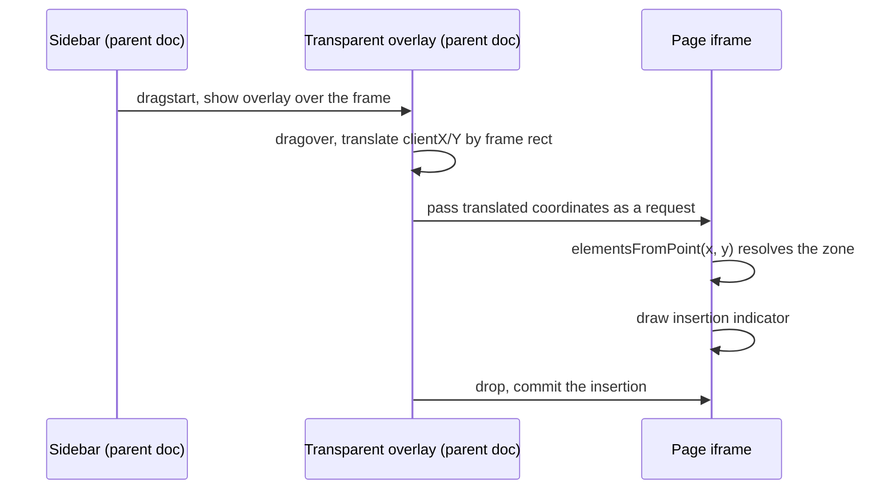
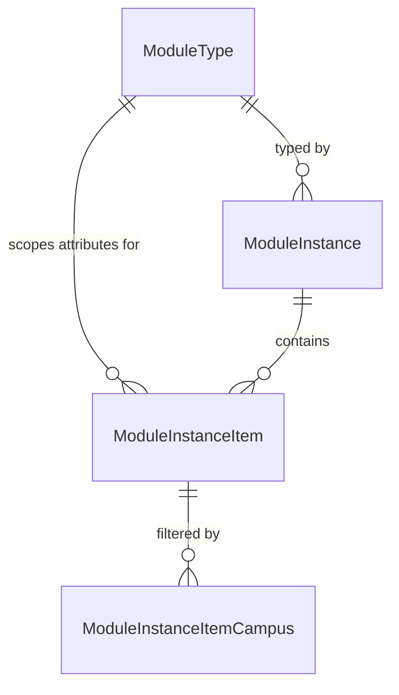

# Page Builder POC

## Summary

The Page Builder lets an administrator compose a page visually: a sidebar of module
types on the left, the live page rendered in an iframe on the right, and drag and drop
between them. This spec covers a proof of concept only. It targets modules (not blocks
or freeform elements), runs against an internal Page Builder page, and exists to prove
two things are buildable inside Rock before the full feature is scoped: drag and drop
across an iframe boundary, and a general purpose Sheet control.

**The POC persists nothing.** Dropping a module injects the markup a Canvas block would
render, client side, into the framed page. Module types are hard coded fixtures. No
entities, no migrations, and no `Block` records are created. Everything under
`MVP Design` below is recorded for the follow-on work and is explicitly not built here.

## Motivation

Two pieces of this feature carry most of its technical risk, and both are cheaper to
answer now than after the data model is locked in.

The first is the iframe. The page being composed has to render as the real page, with
the site's own CSS, block markup, and scripts, which means it lives in an iframe. Native
HTML5 drag events do not cross into a nested browsing context, so the sidebar cannot
simply drop onto a target inside the frame.

The second is the Sheet. Stakeholders asked for it to be built as a reusable Obsidian
control rather than throwaway POC code, because the same pattern (a resizable,
repositionable panel that floats over content, like a toolbar window in a classic
Windows application) is wanted elsewhere. That makes its API surface a long lived
decision rather than a POC detail.

The budget is 40 goal hours, 50 approved.

## Requirements

### Builder shell

- The builder MUST render the target page inside an iframe and present a sidebar listing
  available module types.
- Zones configured for the page builder MUST be visually identified with an outline and
  a labeled chip. An empty enabled zone MUST show its empty state prompting a drag.
- Zones that are not configured for the page builder MUST render as ordinary page content
  with no builder decoration.
- A builder-enabled zone MUST identify itself in the rendered DOM so the parent frame can
  resolve drop targets without asking the server.

### Drag and drop

- Dragging a module type tile MUST show a drag mirror carrying that type's icon and name.
- Dropping onto an enabled zone MUST, in one gesture: inject the Canvas markup into that
  zone at the drop position, render the dropped module's fixture markup inside it, select
  it, and open the Sheet.
- Each drop MUST produce its own Canvas. The POC does not put two modules in one Canvas.
- The result MUST NOT be persisted. A page refresh discards everything placed.
- Drag and drop is the only specified way to place a module. No click to add affordance
  exists in the design.

### Selection

- A selected module MUST show an outline, a name chip, and three controls on its right
  edge: a drag handle, edit, and delete.
- Selection chrome MUST be visually distinct from zone chrome so a user can tell a
  droppable area from a selected object.

### Sheet control

- The Sheet MUST be resizable and repositionable by the user.
- The Sheet MUST remember its last position and size in memory for the session only. A
  page refresh MUST return it to its default position.
- The Sheet MUST be written as a general purpose Obsidian control with no Page Builder
  specific logic, so other blocks can adopt it.
- Within the builder, the Sheet MUST present three sections (Module Settings, Module
  Items, Display Settings) and a footer with Save and Save and Close.
- Module Settings MUST render the fields declared by the dropped fixture. Save applies
  them to the injected markup in the frame and nothing else; there is nowhere to save to.

### Block behavior

- The Page Builder block MUST call `onConfigurationValuesChanged(useReloadBlock())` so it
  reloads when its settings change.

## Design

### Module fixtures

Module types are hard coded in the builder for the POC. Each fixture supplies what the
interaction needs and nothing more: a key, a display name, an icon, the markup to inject
on drop, and the fields the Sheet renders under Module Settings. No `ModuleType` rows, no
Lava, no registry.

### Canvas markup

Dropping a module injects the markup a Canvas block would eventually render, directly into
the framed page's DOM. Each drop produces its own Canvas wrapping one module.

Nothing is persisted, so there is no `Block` record, no `Order`, and no call to
`AddOrUpdateEntityBlockType()`. The Canvas is a markup shape in the POC, not a block type.
Refreshing the page discards everything placed.

The one thing worth getting right is the wrapper's shape and its data attributes, because
the selection chrome, the hit testing, and eventually the server side renderer all key off
it. Settling that now is most of what the POC buys us on the Canvas side.

### Drag and drop across the iframe

The Obsidian Email Builder already solves this and the POC should follow it rather than
invent a second approach.



The parent never tries to deliver a drag event into the frame. On `dragstart` it shows a
transparent overlay covering the frame, so every `dragover`, `drop`, and `dragleave`
lands in the parent document. Pointer coordinates are converted to frame relative by
subtracting the frame's bounding rect, then handed to the frame, which resolves the target
with `contentDocument.elementsFromPoint`. See
`Rock.JavaScript.Obsidian/Framework/Controls/Internal/EmailEditor/emailDesigner.partial.obs:156`
and `emailIFrame.partial.obs:1800`.

Both event families are wired in the Email Builder (`dragover` alongside `mousemove`,
`drop` alongside `mouseup`), and the POC should keep that shape.

The difference for the Page Builder is target resolution, not drag mechanics. The Email
Builder owns its iframe document through `srcdoc` and knows every element in it. The Page
Builder points the frame at a real Rock page, so enabled zones have to be discoverable
from the DOM. That is what the next section covers.

### Zone exposure

Rock already wraps every zone at render time in
`RockPage.AddZoneElements()` (`Rock/Web/UI/RockPage.cs:3638`):

```html
<div id="zone-main" class="zone-instance can-configure {CssClass}">
  <div class="zone-configuration config-bar">...</div>
  <div class="zone-content">...blocks...</div>
</div>
```

The id is `zone-` plus the lowercased zone key under `ClientIDMode.Static`, and
`.zone-content` is the element that actually holds blocks, which makes it the drop
container rather than the wrapper itself.

Builder-enabled zones mark themselves with a data attribute. `Rock.Web.UI.Controls.Zone`
gains an `EnablePageBuilder` property (default `false`), and `AddZoneElements` emits
`data-pagebuilder="true"` on the wrapper when it is set. A theme opts a zone in with the
syntax the design already specifies:

```xml
<Rock:Zone ID="Main" runat="server" EnablePageBuilder="true" />
```

The parent frame then resolves drop targets with
`contentDocument.querySelectorAll('[data-pagebuilder="true"] > .zone-content')`, with no
server round trip in the drag path and the DOM as the single source of truth. The change is
additive and defaults to off, so no existing theme changes behavior.

`pagebuilderaccepts` is not implemented here, but it extends the same way through a second
attribute when blocks mode arrives.

### Suppressing stock zone chrome

The Page Builder only runs for administrators, so `canConfigPage` is true inside the iframe
and Rock's own zone configuration bars render there. Those collide with the builder's zone
outline and Builder chip visually, and their click targets compete with drop targets. The
POC has to either suppress the stock zone chrome while in builder mode or render the frame
with `canConfigPage` false while keeping builder decoration on. See the open question below.

### Sheet control placement

New control, proposed at `Rock.JavaScript.Obsidian/Framework/Controls/Internal/sheet.obs`.
Internal initially because the API surface is unproven, on the same reasoning as
`[RockInternal]` on the C# side. It graduates out of `Internal/` once a second consumer
confirms the shape.

### Overlay extraction

`Controls/Internal/EmailEditor/overlay.obs` is already free of email specific logic and has
exactly one importer. Promote it to `Controls/Internal/overlay.obs` and update that import,
so the Page Builder is not a second copy. This is the only extraction worth taking from the
Email Builder; the coordinate translation is ten lines and belongs to each consumer.

## MVP Design

None of this is built in the POC. It is recorded because the POC deliberately skips
persistence, and the follow-on work needs these decisions made rather than rediscovered.

### Entities

Four new entities, plus the existing `PersonalizedEntity`.



| Entity | Notable columns |
|---|---|
| `ModuleType` | `Name`, `AreItemsSupported`, `ItemTerm`, `IconCssClass`, `CategoryId`, `IsPersonalizationEnabled`, `WebLavaTemplate`, `MobileLavaTemplate`, `AdditionalSettingsJson` |
| `ModuleInstance` | `Name`, `ModuleTypeId`, `IsShareable` |
| `ModuleInstanceItem` | `Name`, `ModuleTypeId`, `IsShareable` |
| `ModuleInstanceItemCampus` | `ModuleItemId`, `CampusId` |

`ModuleInstanceItem.ModuleTypeId` is denormalized deliberately. It exists so attribute
qualifiers can scope item attributes by module type without walking up to the parent
instance.

`AreItemsSupported` and `ItemTerm` together drive the Module Items section: the section
appears only for types that support items, and `ItemTerm` supplies its user facing label
(Slides, Links, Cards, and so on).

### Canvas block as a real block type

When persistence arrives, a Canvas becomes a real block type registered through
`AddOrUpdateEntityBlockType()`, never `UpdateBlockTypeByGuid()`. The latter issues a
`DELETE FROM [BlockType] WHERE [Path] = ...` and entity based block types have an empty
path, so the wrong helper can wipe every entity based block type in the database.

How a Canvas references its module instances is unresolved. A placement join entity
(`BlockId`, `ModuleInstanceId`, `Order`) models `IsShareable` correctly and puts order on
the placement where it belongs. A nullable `BlockId` and `Order` directly on
`ModuleInstance` mirrors `ForgeContent` one for one but means an instance can only live in
one Canvas, which makes `IsShareable` meaningless for placement. Storing an ordered JSON
array in a block attribute value was rejected: attribute values are for configuration, and
Rock's two precedents for block owned content (`HtmlContent`, `ForgeContent`) both chose a
table.

### Modules and elements

Modules and elements differ in who authors the type. A module type is data: an admin writes
Lava, it is a row, and the set grows at runtime. An element type is code: Rock ships Title,
Paragraph, Image, Button, Video and Divider, and the set changes with a release. That is
why elements should not be modelled as `ModuleType` rows, which would put a closed set of
code primitives into an open data registry where someone can edit or delete the Divider.

Modules and elements do not intermix within a single Canvas. Whether a Canvas hosts
elements at all, or elements get their own block type, is open.

## Open Questions

1. **Does the Canvas host elements as well as modules, or do elements get their own block
   type?** Open with the technical lead. Modules and elements do not intermix within one
   Canvas either way, so this is about whether one block type serves both in separate
   instances or two block types exist. It does not affect the POC.
2. **How does a Canvas reference its module instances once persistence arrives?** Options
   and reasoning are under `MVP Design` above. It does not affect the POC, which persists
   nothing, but it should be settled before the MVP schema is written.
3. **Is the stock zone configuration chrome acceptable in builder mode?** Rock's own zone
   bars render inside the frame whenever the viewer can administrate the page, so they sit
   alongside the builder's zone outline and Builder chip. During a drag the parent overlay
   covers the frame, so this is cosmetic collision plus live click targets when idle, not a
   mechanical problem. The POC accepts it. If it is worth removing later, calling
   `AddZoneElements` with `canConfigPage` false already emits the wrapper and `.zone-content`
   without the bars.

## Considered but Rejected

### Reuse the Email Builder control directly
Rejected. `emailIFrame.partial.obs` and `utils.partial.ts` are roughly 440 KB of email
domain logic (sections, columns, inlined styles, email client quirks). The drag pattern is
worth copying; the control is not.

### Use Rock's existing drag and drop directive
Rejected. `Rock.JavaScript.Obsidian/Framework/Directives/dragDrop.ts` wraps dragula and is
the house pattern everywhere else (Grid, sortableTree, GroupedPanel, listItems). Dragula is
pointer based and scoped to containers within a single document, so it cannot reach into an
iframe. This is why the Email Builder hand rolled its own, and the same reasoning applies
here.

### Add a click to add affordance as an early milestone
Rejected. The empty zone's plus glyph is empty state decoration, not a button, and the
accompanying copy instructs the user to drag. Adding a click path would be a change to the
interaction model, not a shortcut through it.

### Resolve enabled zones from a server-supplied list instead of the DOM
Rejected. The block could return the builder-enabled zone keys and the parent could match
`#zone-{key}` with no change to `RockPage` or `Zone` at all. It is the lowest risk option,
but it puts enabled-ness in the parent's memory rather than the rendered page, so the list
and the DOM can disagree when a layout renders zones conditionally, and it adds a server
round trip ahead of hit testing.

### Carry the flag in the zone's CssClass
Rejected. `Zone` already has a `CssClass` property that lands on the wrapper, so a theme
could write `CssClass="pagebuilder-enabled"` and the parent could query
`.zone-instance.pagebuilder-enabled` with no C# change whatsoever. That makes behavior
configuration masquerade as styling, and it is a convention rather than a real attribute,
so it would have to be replaced before the feature ships.

### Emit the accepts value instead of a boolean
Rejected for the POC. `data-pagebuilder-accepts="modules"`, with absence meaning disabled,
would fold `pagebuilderaccepts` in now rather than later. It requires settling the
semantics of blocks and both modes before there is anything to exercise them, and the
boolean extends to it cleanly when that time comes.

## Out of Scope

- **Persistence of any kind.** No entities, no migrations, no `Block` records, no saved
  state. Everything placed is discarded on refresh.
- **The Canvas as a real block type.** The POC produces its markup shape only.
- Standard / Block mode and Elements mode.
- The admin footer toolbar replacement and the drawer that replaces it on every page.
- Module Presets. Pulled in only if the budget allows once the two named deliverables land.
- Content Channel as an item source for Module Items.
- Creating or editing Module Types. Module types are hard coded fixtures in the POC.
- Enforcing `pagebuilderaccepts="(modules|blocks|both)"`. `EnablePageBuilder` is
  implemented because hit testing depends on it; the accepts value is not.
- The caching and personalization strategy flagged in the design notes.

## Related

- [Asana: Page Builder POC (DEV-15820)](https://app.asana.com/1/20866866924293/project/1208321217019996/task/1218707041477970) (40 goal hours, 50 approved, targeted at v21)
- [Figma: Spark Essentials, Page Builder canvas](https://www.figma.com/design/JJiznbtHqJc1yj96Z5Kfuh/Spark-Essentials?node-id=168-5667) (reviewed 2026-09-21, treated as canonical)
- [Figma: data model](https://www.figma.com/design/JJiznbtHqJc1yj96Z5Kfuh/Spark-Essentials?node-id=610-12122), [UX/UI notes](https://www.figma.com/design/JJiznbtHqJc1yj96Z5Kfuh/Spark-Essentials?node-id=750-27577)
- Email Builder prior art: `Rock.JavaScript.Obsidian/Framework/Controls/Internal/EmailEditor/emailDesigner.partial.obs`, `emailIFrame.partial.obs`

### Design cross-check

Three conflicts were found between the Figma Notes panel and the mockups. The mockups are
canonical in each case.

| Notes panel says | Mockups show | Resolution |
|---|---|---|
| A selected module has four controls (Drag Icon, Settings, Configurations, Delete) | Three controls: drag handle, edit, delete | Three. The Notes list was never drawn. |
| "Customize Module: Click and open a modal" | A floating panel, and item 4 of the same notes calls it a right pane | Sheet, per stakeholder direction |
| "Page Builder block will be created upon first drag/drop" | n/a | Canvas block, per Kyle Henning |


