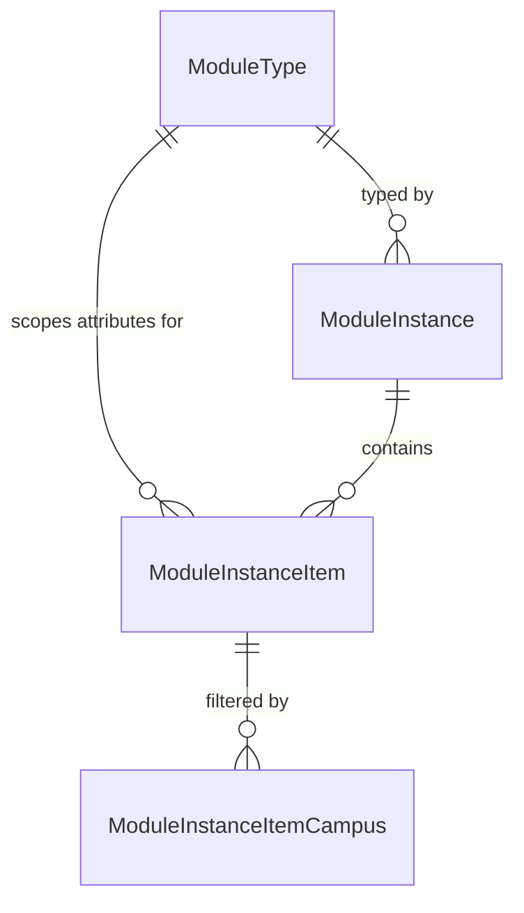
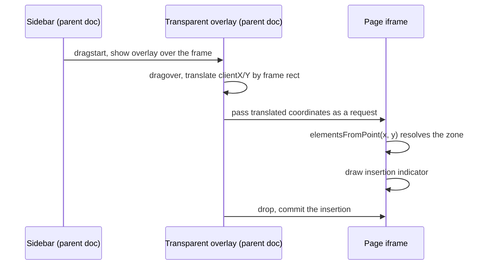

# Page Builder POC

## Summary

The Page Builder lets an administrator compose a page visually: a sidebar of module
types on the left, the live page rendered in an iframe on the right, and drag and drop
between them. This spec covers a proof of concept only. It targets modules (not blocks
or freeform elements), runs against an internal Page Builder page, and exists to prove
two things are buildable inside Rock before the full feature is scoped: drag and drop
across an iframe boundary, and a general purpose Sheet control.

## Motivation

Two pieces of this feature carry most of its technical risk, and both are cheaper to
answer now than after the data model is locked in.

The first is the iframe. The page being composed has to render as the real page, with
the site's own CSS, block markup, and scripts, which means it lives in an iframe. Native
HTML5 drag events do not cross into a nested browsing context, so the sidebar cannot
simply drop onto a target inside the frame.

The second is the Sheet. Stakeholders asked for it to be built as a reusable Obsidian
control rather than throwaway POC code, because the same pattern (a resizable,
repositionable panel that floats over content, like a toolbar window in a classic
Windows application) is wanted elsewhere. That makes its API surface a long lived
decision rather than a POC detail.

The budget is 40 goal hours, 50 approved.

## Requirements

### Builder shell

- The builder MUST render the target page inside an iframe and present a sidebar listing
  available module types.
- Zones configured for the page builder MUST be visually identified with an outline and
  a labeled chip. An empty enabled zone MUST show its empty state prompting a drag.
- Zones that are not configured for the page builder MUST render as ordinary page content
  with no builder decoration.

### Drag and drop

- Dragging a module type tile MUST show a drag mirror carrying that type's icon and name.
- Dropping onto an enabled zone MUST, in one gesture: create a Canvas block in that zone
  with an `Order` that places it correctly if one does not already exist, create a
  `ModuleInstance` of the dropped type, render it, select it, and open the Sheet.
- Drag and drop is the only specified way to place a module. No click to add affordance
  exists in the design.

### Selection

- A selected module MUST show an outline, a name chip, and three controls on its right
  edge: a drag handle, edit, and delete.
- Selection chrome MUST be visually distinct from zone chrome so a user can tell a
  droppable area from a selected object.

### Sheet control

- The Sheet MUST be resizable and repositionable by the user.
- The Sheet MUST remember its last position and size in memory for the session only. A
  page refresh MUST return it to its default position.
- The Sheet MUST be written as a general purpose Obsidian control with no Page Builder
  specific logic, so other blocks can adopt it.
- Within the builder, the Sheet MUST present three sections (Module Settings, Module
  Items, Display Settings) and a footer with Save and Save and Close.
- Module Settings MUST render the attribute values defined on the module's `ModuleType`.

### Block behavior

- The Page Builder block MUST call `onConfigurationValuesChanged(useReloadBlock())` so it
  reloads when its settings change.

## Design

### Entities

Four new entities, plus the existing `PersonalizedEntity`.

| Entity | Notable columns |
|---|---|
| `ModuleType` | `Name`, `AreItemsSupported`, `ItemTerm`, `IconCssClass`, `CategoryId`, `IsPersonalizationEnabled`, `WebLavaTemplate`, `MobileLavaTemplate`, `AdditionalSettingsJson` |
| `ModuleInstance` | `Name`, `ModuleTypeId`, `IsShareable` |
| `ModuleInstanceItem` | `Name`, `ModuleTypeId`, `IsShareable` |
| `ModuleInstanceItemCampus` | `ModuleItemId`, `CampusId` |

`ModuleInstanceItem.ModuleTypeId` is denormalized deliberately. It exists so attribute
qualifiers can scope item attributes by module type without walking up to the parent
instance.

`AreItemsSupported` and `ItemTerm` together drive the Module Items section: the section
appears only for types that support items, and `ItemTerm` supplies its user facing label
(Slides, Links, Cards, and so on).

### Canvas block

A Canvas block is a new block type that acts as a container for module instances inside a
zone. The first drop into a given zone creates one; subsequent drops into the same zone
reuse it. The block owns the ordering of the instances it contains.

Canvas blocks are created through `AddOrUpdateEntityBlockType()`, never
`UpdateBlockTypeByGuid()`. The latter issues a `DELETE FROM [BlockType] WHERE [Path] = ...`
and entity based block types have an empty path.

### Drag and drop across the iframe

The Obsidian Email Builder already solves this and the POC should follow it rather than
invent a second approach.

The parent never tries to deliver a drag event into the frame. On `dragstart` it shows a
transparent overlay covering the frame, so every `dragover`, `drop`, and `dragleave`
lands in the parent document. Pointer coordinates are converted to frame relative by
subtracting the frame's bounding rect, then handed to the frame, which resolves the target
with `contentDocument.elementsFromPoint`. See
`Rock.JavaScript.Obsidian/Framework/Controls/Internal/EmailEditor/emailDesigner.partial.obs:156`
and `emailIFrame.partial.obs:1800`.

Both event families are wired in the Email Builder (`dragover` alongside `mousemove`,
`drop` alongside `mouseup`), and the POC should keep that shape.

The difference for the Page Builder is target resolution, not drag mechanics. The Email
Builder owns its iframe document through `srcdoc` and knows every element in it. The Page
Builder points the frame at a real Rock page, so enabled zones have to be discoverable
from the DOM. That is the open question below.

### Sheet control placement

New control, proposed at `Rock.JavaScript.Obsidian/Framework/Controls/Internal/sheet.obs`.
Internal initially because the API surface is unproven, on the same reasoning as
`[RockInternal]` on the C# side. It graduates out of `Internal/` once a second consumer
confirms the shape.

### Overlay extraction

`Controls/Internal/EmailEditor/overlay.obs` is already free of email specific logic and has
exactly one importer. Promote it to `Controls/Internal/overlay.obs` and update that import,
so the Page Builder is not a second copy. This is the only extraction worth taking from the
Email Builder; the coordinate translation is ten lines and belongs to each consumer.

## Open Questions

1. **How do enabled zones expose themselves to the parent frame?** Hit testing needs a
   stable selector inside the rendered page. The assumption is that
   `enablepagebuilder="true"` on the zone in `Site.Master` causes the zone wrapper to emit
   a data attribute, but the render path that would do this has not been identified yet.
   This gates the drop half of the feature.
2. **Are Presets in or out for the POC?** The design gives them a sidebar section with its
   own search and type filter, and a Save as Preset action in the Sheet, but no entity in
   the data model. Assumed out for now.
3. **Where does the Sheet control live?** `Controls/Internal/` is proposed above, but if
   another team already has a consumer lined up, `Controls/` may be right immediately.
4. **How does a Canvas block reference its module instances?** Either a persisted JSON
   setting on the block or a join table. JSON matches Rock's rule against delimited
   configuration and is cheaper for the POC; a join table is easier to query later.

## Considered but Rejected

### Reuse the Email Builder control directly
Rejected. `emailIFrame.partial.obs` and `utils.partial.ts` are roughly 440 KB of email
domain logic (sections, columns, inlined styles, email client quirks). The drag pattern is
worth copying; the control is not.

### Use Rock's existing drag and drop directive
Rejected. `Rock.JavaScript.Obsidian/Framework/Directives/dragDrop.ts` wraps dragula and is
the house pattern everywhere else (Grid, sortableTree, GroupedPanel, listItems). Dragula is
pointer based and scoped to containers within a single document, so it cannot reach into an
iframe. This is why the Email Builder hand rolled its own, and the same reasoning applies
here.

### Add a click to add affordance as an early milestone
Rejected. The empty zone's plus glyph is empty state decoration, not a button, and the
accompanying copy instructs the user to drag. Adding a click path would be a change to the
interaction model, not a shortcut through it.

## Out of Scope

- Standard / Block mode and Elements mode.
- The admin footer toolbar replacement and the drawer that replaces it on every page.
- Module Presets.
- Content Channel as an item source for Module Items.
- Creating or editing Module Types. The Page Builder consumes them only.
- Enforcing `enablepagebuilder` and `pagebuilderaccepts="(modules|blocks|both)"`. The POC
  should establish where that behavior will be controlled without implementing it.
- The caching and personalization strategy flagged in the design notes.

## Related

- [Asana: Page Builder POC (DEV-15820)](https://app.asana.com/1/20866866924293/project/1208321217019996/task/1218707041477970) (40 goal hours, 50 approved, targeted at v21)
- [Figma: Spark Essentials, Page Builder canvas](https://www.figma.com/design/JJiznbtHqJc1yj96Z5Kfuh/Spark-Essentials?node-id=168-5667) (reviewed 2026-09-21, treated as canonical)
- [Figma: data model](https://www.figma.com/design/JJiznbtHqJc1yj96Z5Kfuh/Spark-Essentials?node-id=610-12122), [UX/UI notes](https://www.figma.com/design/JJiznbtHqJc1yj96Z5Kfuh/Spark-Essentials?node-id=750-27577)
- Email Builder prior art: `Rock.JavaScript.Obsidian/Framework/Controls/Internal/EmailEditor/emailDesigner.partial.obs`, `emailIFrame.partial.obs`

### Design cross-check

Three conflicts were found between the Figma Notes panel and the mockups. The mockups are
canonical in each case.

| Notes panel says | Mockups show | Resolution |
|---|---|---|
| A selected module has four controls (Drag Icon, Settings, Configurations, Delete) | Three controls: drag handle, edit, delete | Three. The Notes list was never drawn. |
| "Customize Module: Click and open a modal" | A floating panel, and item 4 of the same notes calls it a right pane | Sheet, per stakeholder direction |
| "Page Builder block will be created upon first drag/drop" | n/a | Canvas block, per Kyle Henning |

