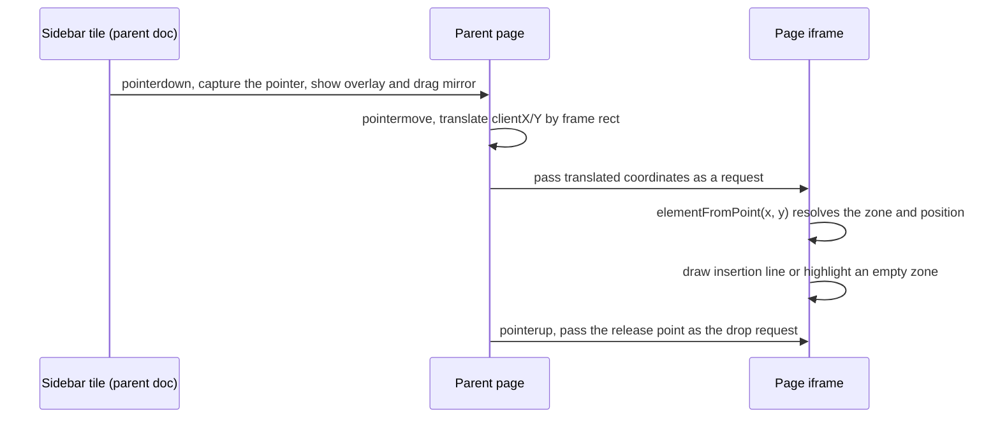
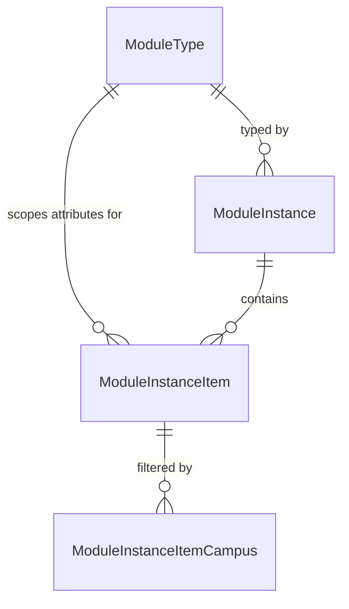
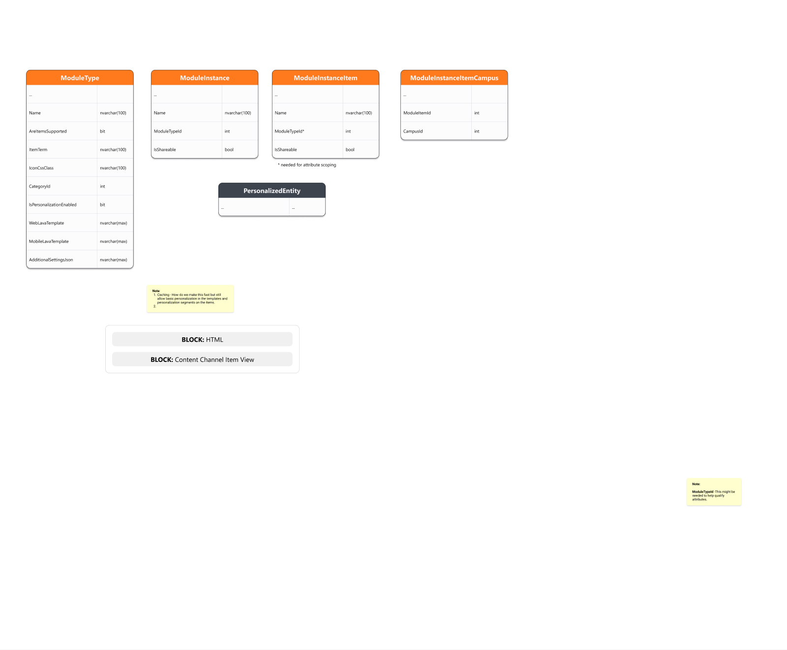
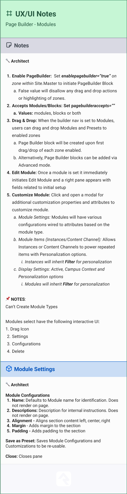

# Page Builder POC

## Summary

The Page Builder lets an administrator compose a page visually: a sidebar of module
types on the left, the live page rendered in an iframe on the right, and drag and drop
between them. This spec covers a proof of concept only. It targets modules (not blocks
or freeform elements), runs against an internal Page Builder page, and exists to prove
two things are buildable inside Rock before the full feature is scoped: drag and drop
across an iframe boundary, and a general purpose Sheet control.

**The POC saves what it places.** Dropping a module calls a block action that creates a
module instance and a real Canvas block at the drop position, and the builder updates just that
spot in the frame, so the result behaves like any other block on the page and survives a refresh. The POC builds the
`ModuleType` and `ModuleInstance` entities with their full columns. A module type's settings
are `ModuleInstance` attributes, so each instance's settings are its attribute values, and the
Canvas references its instance from a block attribute value. The migration seeds five sample
module types along with the builder's layouts, pages, and block. Module instance items and
personalization under `MVP Design` below are recorded for the follow-on work and are not
built here.

## Motivation

Two pieces of this feature carry most of its technical risk, and both are cheaper to
answer now than after the data model is locked in.

The first is the iframe. The page being composed has to render as the real page, with
the site's own CSS, block markup, and scripts, which means it lives in an iframe. Native
HTML5 drag events do not cross into a nested browsing context, so the sidebar cannot
simply drop onto a target inside the frame.

The second is the Sheet. Stakeholders asked for it to be built as a reusable Obsidian
control rather than throwaway POC code, because the same pattern (a resizable,
repositionable panel that floats over content, like a toolbar window in a classic
Windows application) is wanted elsewhere. That makes its API surface a long lived
decision rather than a POC detail.

The budget is 40 goal hours, 50 approved.

## Requirements

### Builder shell

- The builder MUST render the target page inside an iframe and present a sidebar listing
  available module types.
- Zones configured for the page builder MUST be visually identified with an outline and
  a labeled chip. An empty enabled zone MUST show them along with its empty state prompting
  a drag, and every enabled zone MUST show them while a drag is in progress. An enabled zone
  with content shows no builder chrome at rest.
- Zones that are not configured for the page builder MUST render as ordinary page content
  with no builder decoration.
- A builder-enabled zone MUST identify itself in the rendered DOM so the parent frame can
  resolve drop targets without asking the server.
- The builder MUST show a top bar above the sidebar and the frame with:
  - the page being built, which opens a page tree for switching to another page;
  - the page's interaction intents, which open a picker that saves them;
  - desktop, tablet, and phone preview widths for the frame;
  - Properties, which opens Rock's Page Properties dialog for the page;
  - View Page, which leaves the builder for the page.
- Switching pages, leaving, or opening Page Properties while a module has unsaved settings MUST
  ask first.

### Drag and drop

- Dragging a module type tile MUST show a drag mirror carrying that type's icon and name.
- Drag and drop MUST work with a mouse, touch, or pen, on desktop and phone layouts.
- Dropping onto an enabled zone MUST, in one gesture: create a Canvas block in that zone at
  the drop position, render the module type's Lava in it, select it, and open the Sheet.
- Each drop MUST produce its own Canvas block. The POC does not put two modules in one
  Canvas.
- The Canvas block MUST be saved, so it survives a refresh and behaves like any other block
  on the page, including Rock's block configuration bar.
- A drop MUST NOT be placed above a site or layout block in the same zone, because Rock
  always renders those ahead of page blocks.
- Drag and drop is the only specified way to place a module. No click to add affordance
  exists in the design.

### Selection

- A selected module MUST show an outline, a name chip, and three controls on its right
  edge: a drag handle, edit, and delete.
- Selection chrome MUST be visually distinct from zone chrome so a user can tell a
  droppable area from a selected object.
- Dragging a selected module's handle MUST move it, within its zone or into another
  builder-enabled zone, using the same drop positions as placing a new module. Dropping it
  where it already is MUST change nothing.

### Sheet control

- The Sheet MUST be resizable and repositionable by the user.
- The Sheet MUST remember its last position and size in memory for the session only. A
  page refresh MUST return it to its default position.
- The Sheet MUST be written as a general purpose Obsidian control with no Page Builder
  specific logic, so other blocks can adopt it.
- Within the builder, the Sheet MUST present three sections (Module Settings, Module
  Items, Display Settings) and a footer with Save and Save and Close.
- Module Settings MUST render the module instance's attributes with their field types'
  editors. Save writes the instance's attribute values and re-renders the block in the frame.

### Block behavior

- The Page Builder block MUST call `onConfigurationValuesChanged(useReloadBlock())` so it
  reloads when its settings change.
- Adding, moving, or deleting a module MUST require Administrate permission on the target
  page, the same permission Rock requires to configure a page's blocks.
- Deleting a module from the builder MUST delete its module instance too, unless the instance
  is shareable or another Canvas block references it.
- Adding, saving, moving, and deleting a module MUST update the framed page in place rather
  than reloading it, and the builder MUST lock further changes until the server confirms each
  one.
- The Canvas block MUST render its module's Lava on the server, so the output is in the page
  HTML rather than built in the browser.

## Design

### Pages and layouts

The migration seeds two internal pages. The Page Builder page sits under CMS Configuration
at `admin/cms/page-builder` and hosts the Page Builder block on a new **Full Screen** layout.
Full Screen is the Blank layout without its container padding, with every wrapper down to the
Obsidian mount stretched to the window and a viewport meta tag for phones, so whatever block
it hosts fills the browser. Blank itself is unchanged because other pages rely on it.

The Page Builder Sample page sits under the Page Builder page, hidden from navigation, on a
new **Page Builder** layout with one builder-enabled zone (Builder) and one ordinary zone
(Aside). The internal site runs the RockNextGen theme, so both layouts are authored in
`Rock.Frontend.Styles/src/themes/RockNextGen/Layouts/` and copied into `RockWeb/Themes` by
the build. The Page Builder block's Target Page setting defaults to the sample page.

### Top bar

The top bar runs across the builder above the sidebar and the frame, in a `topBar` partial.
It follows the mockup's top bar except where noted below.

**Page.** The Page button shows the target page's internal name and opens a page tree, a
`TreeList` with the `PageTreeItemProvider` limited to web sites, with the current page
selected. Choosing another page reloads the builder with a `Page` page parameter, which takes
precedence over the Target Page setting, so the setting is now the page the builder opens to.
Obsidian sends the page's parameters with every block action, so the actions compose the page
the builder shows without being told. The builder refuses to build its own page, and shows an
error in place of the sidebar and frame when the person cannot administrate the chosen page.
The top bar stays in both cases, so another page can be chosen.

**Intents.** The Intents chip lists the page's interaction intents, or None, and opens the
same Interaction Intent picker Page Properties uses. Saving calls `SavePageIntents`, which
requires Edit on the page as Page Properties does, writes the intents with
`EntityIntentService.SetIntents<Page>`, and removes the page from the cache. A cached page reads
its intents only once, and writes them to the interactions of its visits.

**Device preview.** The device buttons narrow the frame to 991 pixels for a tablet and 767
pixels for a phone, the widest widths at which the theme's tablet and phone layouts apply.
Hit testing measures the pointer against the frame's own position, so drag and drop works at
any width. On phones, the top bar scrolls sideways and hides the device buttons.

**Properties.** Properties opens Rock's own Page Properties dialog through
`Rock.controls.modal.show`, as the admin toolbar and the Layout Block List do. Saving in the
dialog reloads the builder, which picks up any change to the page. The Sheet closes first,
because the dialog would open beneath the Sheet's layer.

**View Page.** Neither the requirements nor the mockup had a way out of the builder, so View
Page goes to the target page.

Switching pages, leaving, and opening Page Properties go through the same unsaved changes
prompt as the Sheet: "Are you sure you want to switch pages without saving?", "...leave
without saving?", and "...edit the page properties without saving?". The Sheet takes an
`initialTopInset`, so it first opens below the top bar rather than over its buttons.

### Module types and instances

`ModuleType` and `ModuleInstance` are built with the full columns listed under
`MVP Design`. The migration seeds five sample module types (Accordion, Billboard, Card,
Content, Video), each with a web Lava template, and the sidebar lists the `ModuleType` rows.
There is no way to create or edit a type in the POC.

A module type's settings are attributes of `ModuleInstance` qualified by `ModuleTypeId`, the
same pattern Rock uses for group member attributes by group type. `LoadAttributes()` resolves
the qualifier from the instance's own `ModuleTypeId`, so every instance of a type has that
type's settings with no extra code, and an instance's settings are its attribute values. The
seeded types use Text attributes for titles and button text and HTML attributes for body text,
so the Sheet can render each with its field type's editor through `AttributeValuesContainer`.
The templates wrap body text in a `<div>` rather than a `<p>`, because the HTML editor adds its
own paragraphs.

### Canvas block

The Canvas is a real Obsidian block type (`Rock.Blocks.Cms.Canvas`) registered with
`AddOrUpdateEntityBlockType()`. Like the Redirect block it has no Vue component: it returns
its output from `GetInitialHtmlContent()`, so the module renders on the server and appears in
the page HTML.

A Canvas references the module instance it displays from its Module Instance block attribute,
which holds the instance's Guid. Pointing from the block to the instance lets the same
shareable instance be displayed by more than one Canvas. Custom block settings will later keep
the reference from being edited by hand.

The Canvas renders its instance's module type Lava with the common merge fields plus the
instance as `ModuleInstance`, and templates read settings with
`{{ ModuleInstance | Attribute:'Title' }}`. A setting that has not been saved falls back to
its attribute's default value. The template stays with the type, so changing a type's template
changes every module of that type.

A setting can hold Lava of its own, such as a title that greets the current person. Each
setting that contains Lava is resolved with the common merge fields before the template renders,
so the template reads finished text. Content Channel Item View does the same for an item's
content and attribute values when its Merge Content setting is on. The resolved values exist
only for that render and are never saved. In the POC every module resolves its settings this
way, with the same Default Enabled Lava Commands the template uses.

Both the settings and the template resolve inside a `PersonTokenScope` restricted to the current
person, so a module's Lava can create a person token only for the person viewing the page.
An anonymous visitor gets none.

### Adding a module

The Page Builder block gains an `AddModule` block action taking the zone name, the module type
key, and the id of the block the new one goes in front of (or none for the end of the zone).
It:

1. Checks that the current person has Administrate permission on the target page.
2. Creates a `ModuleInstance` of the dropped type, which starts with the type's defaults.
3. Creates a Canvas `Block` on the target page in that zone, inheriting the page's security.
4. Renumbers `Order` across the zone's page blocks with the new block in position.
5. Sets the Canvas block's Module Instance attribute to the new instance.
6. Returns the new block's id and Guid.

Steps 2 through 5 run in one transaction.

Block order is `Block.Order`, scoped to a zone. Rock renders a zone's site blocks first, then
its layout blocks, then its page blocks, each sorted by `Order`, so a page block can only be
positioned among other page blocks. The frame reads each block wrapper's
`data-zone-location` and keeps the drop line below any site or layout blocks in the zone,
which keeps every drop position one the server can honor.

The frame shows a placeholder at the drop position as soon as the module is dropped. Once
`AddModule` succeeds, the target page renders the new module (see Updating the page in place),
the frame replaces the placeholder with the block, and the block is selected. If the add fails,
the placeholder goes away.

`AddModule` first makes sure the Canvas block type's attributes are registered. Rock otherwise
creates them the first time a page renders a block of that type, and until then the new block
has no Module Instance attribute to hold its reference.

### Deleting a module

The delete control on a selected module confirms, then calls a `DeleteModule` block action
with the Canvas block's id. It checks Administrate permission on the target page and deletes
the Canvas block. It also deletes the module instance, unless the instance is shareable or
another Canvas block still references it. Both deletes run in one transaction. The module
shows as pending while the server deletes it, then comes off the page.

Deleting a block leaves its attribute values in the database until the Rock Cleanup job
removes them, so only values of blocks that still exist count as references.

### Moving a module

The drag handle on a selected module moves it. The handle is inside the frame, so unlike a
drag from the sidebar, its pointer events arrive in the frame's own document and need no
translating. The move reuses the drop targeting, insertion line, and edge scrolling that
placing a module uses, with the module being moved left out of the positions it can land in,
and a copy of its chip follows the pointer. Dropping it where it already is does nothing.

On a drop the frame moves the block element right away and reports the zone and the block it
now sits in front of. A `MoveModule` block action checks Administrate permission on the target
page, saves the block's new zone when it changed zones, then renumbers `Order` across that
zone's page blocks with `ReorderEntity`. The module shows as pending until the move is saved,
and stays selected. If saving fails, the frame puts it back where it was.

### Editing a module

The edit control on a selected module, and every successful drop, opens the Sheet on that
module. A `GetModuleSettings` block action checks Administrate permission on the target page
and returns the module instance's attributes and values for editing. The Module Settings
section renders them with `AttributeValuesContainer` inside a `RockForm`, so required settings
validate before saving. Save calls `SaveModuleSettings`, which writes the instance's attribute
values, then the module is re-rendered in place. Save and Close does the same and closes the
Sheet. The Sheet's fields are disabled while a save is in progress.

While the Sheet is open it follows the selection: selecting another module, or dropping a new
one, moves the Sheet to that module. When the module in the Sheet has unsaved changes, the
builder asks first, and it asks the same way before the close button closes the Sheet. The
prompt takes the most common shape of a Rock confirmation, a single "Are you sure you want
to...?" question with Rock's standard OK and Cancel buttons: "Are you sure you want to switch
modules without saving?" or "Are you sure you want to close without saving?" Keeping the
changes selects the edited module again,
so the selection and the Sheet never disagree. The Sheet also stays on a module while its save
is in progress. Blocking selection would make the Sheet behave like a modal, and closing it on
every selection change would cost an extra click per module and waste its remembered position.

Deleting the module the Sheet is editing closes the Sheet.

### Updating the page in place

No change reloads the frame. Each one shows in the page as soon as it is made: a placeholder
where a module was dropped, the module in its new spot after a move, and a dimmed module while
it is saved or deleted. The builder locks until the server confirms, ignoring drops, selection,
and clicks in the frame, so two changes never race. Then the frame settles on the result: the
placeholder becomes the new block, a saved module shows its new content, and a deleted module
comes off the page. A change the server rejects is undone.

The module HTML comes from the Canvas block's own `RefreshObsidianBlockInitialization` action,
the one Rock's block reload calls. It renders just that module, with its Lava in the target
page's context. Rock only reloads a block itself from the Block Properties dialog, through a
WebForms trigger that also posts back the whole page, so the builder calls the action directly
and places the HTML itself.

A new block gets the parts of Rock's block markup the builder relies on: its `bid_` id, its
zone location, and its `obsidian-` root. Rock's configuration bar and the block's Obsidian app
are rendered with the page, so they arrive with the next full page load. If a module cannot be
rendered this way, the frame falls back to a reload, which keeps the selected module selected.

Module Items and Display Settings show an empty state, since their contents are out of scope.

### Drag and drop across the iframe

The Obsidian Email Builder already solves this and the POC should follow it rather than
invent a second approach.



The parent never tries to deliver a pointer event into the frame. The drag uses Pointer
Events rather than native HTML5 drag and drop, for two reasons. The browser's native drag
image cannot be styled, so it cannot show the tilted copy of the tile the Email Builder
shows. And a touch drag keeps sending its events to the element where it started, so hit
testing has to run from the captured pointer rather than from events on an overlay.

On `pointerdown` the tile captures the pointer and a styled copy of it follows the cursor,
matching the Email Builder's drag mirror (`sidePanel.partial.obs:835`). Each move is
converted to frame relative coordinates by subtracting the frame's bounding rect and handed
to the frame, which resolves the target from its own DOM. A transparent overlay still covers
the frame for the duration so the framed page cannot react to the pointer. The drop carries
the release point and the frame resolves the target again from it, because a fast drag can
release somewhere the last move never reported. A cancelled pointer, such as a touch the
browser turns into a scroll, never drops.

On small screens the sidebar becomes a horizontal strip of tiles above the frame. Tiles use
`touch-action: pan-x` there and `pan-y` in the vertical sidebar, so a swipe along the list
scrolls it and a pull toward the page starts a drag.

The difference for the Page Builder is target resolution, not drag mechanics. The Email
Builder owns its iframe document through `srcdoc` and knows every element in it. The Page
Builder points the frame at a real Rock page, so enabled zones have to be discoverable
from the DOM. That is what the next section covers.

### Zone exposure

Rock already wraps every zone at render time in
`RockPage.AddZoneElements()` (`Rock/Web/UI/RockPage.cs:3638`):

```html
<div id="zone-main" class="zone-instance can-configure {CssClass}">
  <div class="zone-configuration config-bar">...</div>
  <div class="zone-content">...blocks...</div>
</div>
```

The id is `zone-` plus the lowercased zone key under `ClientIDMode.Static`, and
`.zone-content` is the element that actually holds blocks, which makes it the drop
container rather than the wrapper itself.

Builder-enabled zones mark themselves with a data attribute. `Rock.Web.UI.Controls.Zone`
gains an `EnablePageBuilder` property (default `false`), and `AddZoneElements` emits
`data-pagebuilder="true"` on the wrapper when it is set. A theme opts a zone in with the
syntax the design already specifies:

```xml
<Rock:Zone ID="Main" runat="server" EnablePageBuilder="true" />
```

The frame then resolves a drop target by taking the element under the pointer, finding its
closest `[data-pagebuilder="true"]` ancestor, and using that zone's `.zone-content`, with no
server round trip in the drag path and the DOM as the single source of truth. The drop
position is the first content block whose vertical midpoint is below the pointer. The change
is additive and defaults to off, so no existing theme changes behavior.

`pagebuilderaccepts` is not implemented here, but it extends the same way through a second
attribute when blocks mode arrives.

### Zone chrome

The zone outline, the chip, the empty state, and the insertion line follow the Figma
dropzone mockup (node `695:40288`) and are styled with Rock's CSS variables
(`--color-primary`, `--color-primary-soft`, the `--color-interface-*` scale,
`--font-size-*`, `--spacing-*`, `--rounded-*`). The builder adds them to the framed page's
DOM when it loads, along with a stylesheet. The framed page can belong to any site and theme,
so any of those variables it does not define are copied from the builder's own document.
Variables the page already defines are left alone, so the builder never restyles the site's
own content.

### Suppressing stock zone chrome

The Page Builder only runs for administrators, so `canConfigPage` is true inside the iframe
and Rock's own zone configuration bars render there. Those collide with the builder's zone
outline and Builder chip visually, and their click targets compete with drop targets. The
POC has to either suppress the stock zone chrome while in builder mode or render the frame
with `canConfigPage` false while keeping builder decoration on. See the open question below.

### Sheet control

The Sheet lives at `Rock.JavaScript.Obsidian/Framework/Controls/Internal/sheet.obs`. It is
internal because the API surface is unproven, on the same reasoning as `[RockInternal]` on the
C# side, and graduates out of `Internal/` once a second consumer confirms the shape.

| API | Purpose |
|---|---|
| `v-model` | Shows or hides the Sheet. |
| `title` | The header text. |
| `initialWidth` | The width in pixels the first time it opens, 480 by default. |
| `initialTopInset` | The distance in pixels from the top of the window that it first opens below, such as a toolbar's height. 0 by default. |
| `beforeClose` | An async guard the close button awaits. `false` keeps the Sheet open. Closing through `v-model` bypasses it. |
| Default slot | The scrolling body. |
| `footer` slot | A footer pinned below the body, such as Save buttons. |

The first time it opens, the Sheet sits against the right edge of the window, filling its
height below `initialTopInset`.
Dragging the header moves it, dragging any edge or corner resizes it, and it always stays
inside the window. It keeps its position and size while it stays mounted, so a consumer keeps
it mounted and toggles `v-model`. Closing and reopening it then returns it to where it was,
and a page refresh returns it to the right edge.

While a move or resize is in progress, a transparent shield covers the window. Pointer events
over an iframe go to the framed document, so without it, dragging the Sheet across the
builder's frame would stop following the pointer.

It floats at z-index 1050, the docked panel's layer, so popups opened from its fields appear
above it, and modal dialogs such as the delete confirmation appear above both.

In windows narrower than 768 pixels, it docks to the bottom at full width, up to 85% of the
window's height, and does not move or resize.

### Overlay extraction

`Controls/Internal/EmailEditor/overlay.obs` is already free of email specific logic and has
exactly one importer. Promote it to `Controls/Internal/overlay.obs` and update that import,
so the Page Builder is not a second copy. This is the only extraction worth taking from the
Email Builder; the coordinate translation is ten lines and belongs to each consumer.

## MVP Design

The POC builds the Canvas block type and the `ModuleType` and `ModuleInstance` entities below.
Module instance items, their campus filters, and personalization are not built, and the
follow-on work needs these decisions made rather than rediscovered.

### Entities

Four new entities, plus the existing `PersonalizedEntity`.



| Entity | Notable columns |
|---|---|
| `ModuleType` | `Name`, `AreItemsSupported`, `ItemTerm`, `IconCssClass`, `CategoryId`, `IsPersonalizationEnabled`, `WebLavaTemplate`, `MobileLavaTemplate`, `AdditionalSettingsJson` |
| `ModuleInstance` | `Name`, `ModuleTypeId`, `IsShareable` |
| `ModuleInstanceItem` | `Name`, `ModuleTypeId`, `IsShareable` |
| `ModuleInstanceItemCampus` | `ModuleItemId`, `CampusId` |

`ModuleInstanceItem.ModuleTypeId` is denormalized deliberately. It exists so attribute
qualifiers can scope item attributes by module type without walking up to the parent
instance.

`AreItemsSupported` and `ItemTerm` together drive the Module Items section: the section
appears only for types that support items, and `ItemTerm` supplies its user facing label
(Slides, Links, Cards, and so on).

### Canvas block and module instances

The Canvas block type from the POC carries forward, registered through
`AddOrUpdateEntityBlockType()`, never `UpdateBlockTypeByGuid()`. The latter issues a
`DELETE FROM [BlockType] WHERE [Path] = ...` and entity based block types have an empty
path, so the wrong helper can wipe every entity based block type in the database.

In the POC a Canvas references its single module instance from a block attribute value, which
lets one shareable instance be displayed by several blocks. A nullable `BlockId` on
`ModuleInstance`, the `ForgeContent` pattern, was ruled out because it limits an instance to
one Canvas and makes `IsShareable` meaningless.

In the MVP a Canvas can hold more than one module, and how it references an ordered list of
instances is unresolved. A placement join entity (`BlockId`, `ModuleInstanceId`, `Order`) puts
order on the placement where it belongs. Extending the block attribute to an ordered list keeps
the POC's shape but stores content in an attribute value, which Rock's two precedents for block
owned content (`HtmlContent`, `ForgeContent`) avoided by choosing a table.

### Lava in module settings

In the MVP, resolving settings as Lava should be a module type choice, off by default, with
its own Enabled Lava Commands, following the Merge Content and Enabled Lava Commands settings
on Content Channel View and Content Channel Item View. Both fit in the type's
`AdditionalSettingsJson` without a schema change. Keeping the choice on the type, which only
administrators author, keeps decisions about which Lava commands can run out of content
editors' hands. A setting that greets the current person makes the module's output differ for
each viewer, which ties into the caching strategy listed under Out of Scope.

The Sheet's HTML editors show no merge field button, because Rock's HTML field type never gives
the editor a merge field list, so Lava is typed by hand. The MVP could let the HTML field's
editor take an optional list from the page around it, the way `RockField` passes `isRequired`
to field editors, and have the Page Builder pass the list the HTML Content block offers.
A merge fields setting on the HTML field type itself would put the list in the wrong place,
because the Canvas decides which merge fields a setting can use, not the attribute.

### Modules and elements

Modules and elements differ in who authors the type. A module type is data: an admin writes
Lava, it is a row, and the set grows at runtime. An element type is code: Rock ships Title,
Paragraph, Image, Button, Video and Divider, and the set changes with a release. That is
why elements should not be modelled as `ModuleType` rows, which would put a closed set of
code primitives into an open data registry where someone can edit or delete the Divider.

Modules and elements do not intermix within a single Canvas. Whether a Canvas hosts
elements at all, or elements get their own block type, is open.

## Open Questions

1. **Does the Canvas host elements as well as modules, or do elements get their own block
   type?** Open with the technical lead. Modules and elements do not intermix within one
   Canvas either way, so this is about whether one block type serves both in separate
   instances or two block types exist. It does not affect the POC.
2. **How does a Canvas reference more than one module instance?** Options and reasoning are
   under `MVP Design` above. It does not affect the POC, where a Canvas references its single
   instance from a block attribute value, but it should be settled before the MVP adds
   multiple modules per Canvas.
3. **Is the stock zone configuration chrome acceptable in builder mode?** Rock's own zone
   bars render inside the frame whenever the viewer can administrate the page, so they sit
   alongside the builder's zone outline and Builder chip. During a drag the parent overlay
   covers the frame, so this is cosmetic collision plus live click targets when idle, not a
   mechanical problem. The POC accepts it. If it is worth removing later, calling
   `AddZoneElements` with `canConfigPage` false already emits the wrapper and `.zone-content`
   without the bars.

## Considered but Rejected

### Reuse the Email Builder control directly
Rejected. `emailIFrame.partial.obs` and `utils.partial.ts` are roughly 440 KB of email
domain logic (sections, columns, inlined styles, email client quirks). The drag pattern is
worth copying; the control is not.

### Use Rock's existing drag and drop directive
Rejected. `Rock.JavaScript.Obsidian/Framework/Directives/dragDrop.ts` wraps dragula and is
the house pattern everywhere else (Grid, sortableTree, GroupedPanel, listItems). Dragula is
pointer based and scoped to containers within a single document, so it cannot reach into an
iframe. This is why the Email Builder hand rolled its own, and the same reasoning applies
here.

### Add a click to add affordance as an early milestone
Rejected. The empty zone's plus glyph is empty state decoration, not a button, and the
accompanying copy instructs the user to drag. Adding a click path would be a change to the
interaction model, not a shortcut through it.

### Resolve enabled zones from a server-supplied list instead of the DOM
Rejected. The block could return the builder-enabled zone keys and the parent could match
`#zone-{key}` with no change to `RockPage` or `Zone` at all. It is the lowest risk option,
but it puts enabled-ness in the parent's memory rather than the rendered page, so the list
and the DOM can disagree when a layout renders zones conditionally, and it adds a server
round trip ahead of hit testing.

### Carry the flag in the zone's CssClass
Rejected. `Zone` already has a `CssClass` property that lands on the wrapper, so a theme
could write `CssClass="pagebuilder-enabled"` and the parent could query
`.zone-instance.pagebuilder-enabled` with no C# change whatsoever. That makes behavior
configuration masquerade as styling, and it is a convention rather than a real attribute,
so it would have to be replaced before the feature ships.

### Keep the POC entirely client side
Rejected. The first version injected Canvas markup into the frame and saved nothing. That
proved the drag across the iframe, but not how a placed module behaves as a block: its order
among other blocks, Rock's block configuration bar, server rendered Lava, and surviving a
refresh. Those are the parts the follow-on work most needs to see.

### Keep module settings as JSON in a Canvas block attribute
Rejected. An intermediate version stored each module's type key and settings JSON in Canvas
block attributes against a hard coded list of module types. Settings stored as attribute
values of a `ModuleInstance` instead get field types, so the Sheet can render every setting
with Rock's own editors, and new settings become data rather than code.

### Put a BlockId on ModuleInstance
Rejected. Hanging the instance off its block, as `ForgeContent` does, would take the instance
with the block when it is deleted, but it limits an instance to one Canvas. Module instances
may be shared, so the Canvas references the instance instead.

### Emit the accepts value instead of a boolean
Rejected for the POC. `data-pagebuilder-accepts="modules"`, with absence meaning disabled,
would fold `pagebuilderaccepts` in now rather than later. It requires settling the
semantics of blocks and both modes before there is anything to exercise them, and the
boolean extends to it cleanly when that time comes.

### Resolve the template's output a second time
Rejected. Running the rendered module through Lava again would also resolve the Lava in its
settings, but it would run any Lava-like text in data the template pulled in, such as a
person's name or a form entry. The template's filters would also work on a setting's Lava
rather than its result, so a `Truncate` could cut a merge field in half, and braces the
template means to output, such as a JavaScript template, would be evaluated too.

### Reload the frame after each change
Rejected. An earlier version reloaded the whole framed page after every add, save, move, and
delete. It always matched the server, but the flash and the lost scroll position made every
change feel heavy.

### Fetch the page in the background and swap in the changed block
Rejected. It would bring back Rock's exact block markup, configuration bar included, but it
renders the whole page on the server for every change. That is the same work as a postback,
only hidden.

### Trigger Rock's own block reload
Rejected. Rock's block reload is light, but the only way to trigger it from outside the block is
the WebForms configuration trigger, which also runs an async postback of the whole page.

## Out of Scope

- **Module instance items, their campus filters, and personalization.** See `MVP Design`.
- **More than one module per Canvas.**
- The contents of the Sheet's Display Settings section: a module's active state and campus
  context.
- Sharing a module instance between Canvas blocks. The schema allows it; the builder does not
  offer it yet.
- Deleting the module instance when its Canvas is deleted from Rock's block configuration bar.
  Only the builder's delete removes the instance.
- Standard / Block mode and Elements mode.
- The top bar's Standard and Advanced builder modes. Advanced mode edits the layout's zones.
- Page topics. Rock has nowhere to store a page's topics yet; Content Library topics and campus
  topics are separate.
- Reorganizing the page hierarchy from the top bar's page tree.
- The admin footer toolbar replacement and the drawer that replaces it on every page.
- Module Presets. Pulled in only if the budget allows once the two named deliverables land.
- Content Channel as an item source for Module Items.
- Creating or editing Module Types. The POC's module types are seeded by its migration.
- Enforcing `pagebuilderaccepts="(modules|blocks|both)"`. `EnablePageBuilder` is
  implemented because hit testing depends on it; the accepts value is not.
- The caching and personalization strategy flagged in the design notes.

## Related

- [Asana: Page Builder POC (DEV-15820)](https://app.asana.com/1/20866866924293/project/1208321217019996/task/1218707041477970) (40 goal hours, 50 approved, targeted at v21)
- [Figma: Spark Essentials, Page Builder canvas](https://www.figma.com/design/JJiznbtHqJc1yj96Z5Kfuh/Spark-Essentials?node-id=168-5667) (reviewed 2026-09-21, treated as canonical)
- [Figma: data model](https://www.figma.com/design/JJiznbtHqJc1yj96Z5Kfuh/Spark-Essentials?node-id=610-12122), [UX/UI notes](https://www.figma.com/design/JJiznbtHqJc1yj96Z5Kfuh/Spark-Essentials?node-id=750-27577)
- Email Builder prior art: `Rock.JavaScript.Obsidian/Framework/Controls/Internal/EmailEditor/emailDesigner.partial.obs`, `emailIFrame.partial.obs`

### Design cross-check

Three conflicts were found between the Figma Notes panel and the mockups. The mockups are
canonical in each case.

| Notes panel says | Mockups show | Resolution |
|---|---|---|
| A selected module has four controls (Drag Icon, Settings, Configurations, Delete) | Three controls: drag handle, edit, delete | Three. The Notes list was never drawn. |
| "Customize Module: Click and open a modal" | A floating panel, and item 4 of the same notes calls it a right pane | Sheet, per stakeholder direction |
| "Page Builder block will be created upon first drag/drop" | n/a | Canvas block, per Kyle Henning |





