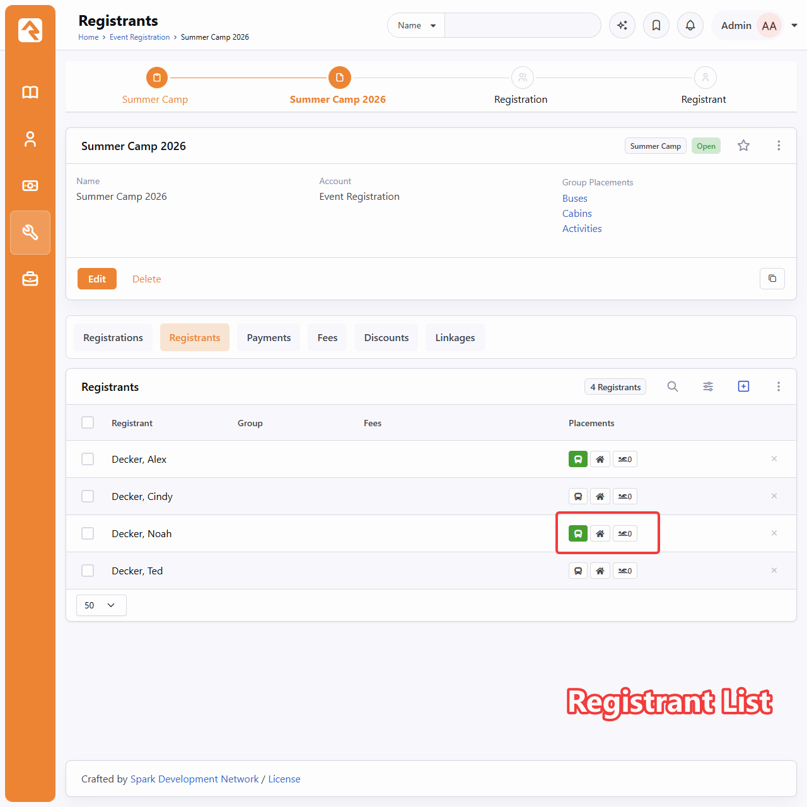
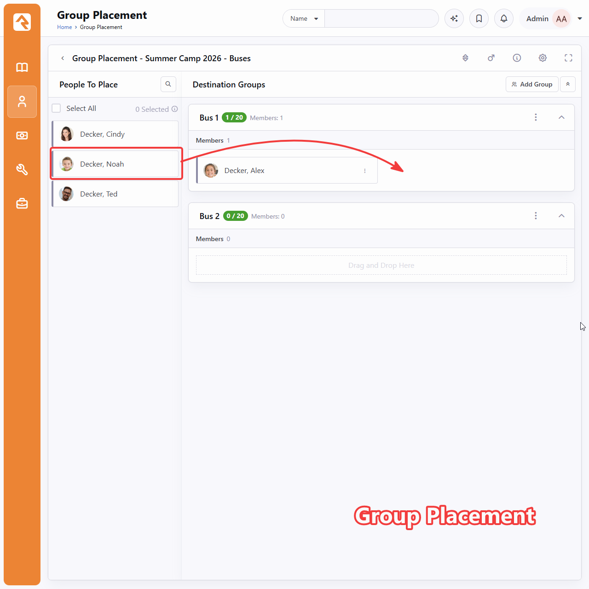
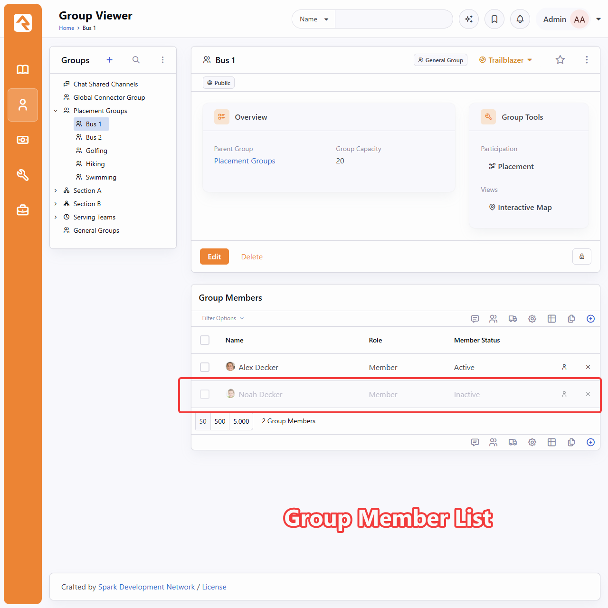
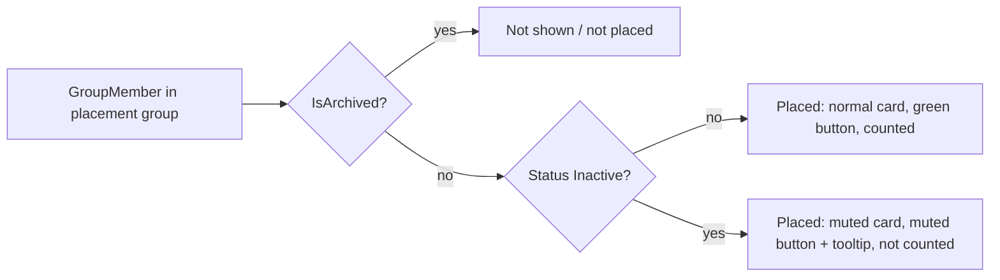

# Group Placement Inactive Members

## Summary

When a registrant is placed into a placement group and that group member is later set to Inactive, the two blocks disagree about whether the person is placed. Group Placement hides the inactive member and puts them back in People To Place. The Registrant List still shows a green "placed" button. This spec makes both blocks treat an inactive member as placed but inactive: Group Placement shows them muted inside their group, and the Registrant List shows a muted placement button with a tooltip that explains the inactive status.

## Motivation

Screenshots of the current behavior with Noah Decker, who is an inactive member of Bus 1:

| Block | Current behavior |
|---|---|
| Registrant List | Noah's bus button is green (placed). |
| Group Placement | Noah is missing from Bus 1 and appears in People To Place. |
| Group Member List | Noah is listed in Bus 1, muted, with status Inactive. |







This is confusing, and it invites a broken action. If a user drags Noah from People To Place back into Bus 1, `AddGroupMembersToGroup` tries to create a second active `GroupMember` for the same person and role. Validation rejects it as a duplicate (`Rock/Model/Group/GroupMember/GroupMember.Logic.cs:231`), so the user gets an error and nothing changes.

The legacy WebForms placement block (`RockWeb/Blocks/Event/RegistrationInstanceGroupPlacement.ascx.cs`) treated inactive members as placed (they did not return to the unplaced list). The Obsidian block started returning them to People To Place when the stored procedure began excluding `GroupMemberStatus = Inactive` in commit `a8b3667cd2`.

## Requirements

### Group Placement

- An inactive (`GroupMemberStatus.Inactive`), non-archived member of a destination group MUST appear in that group on the Group Placement block.
- Inactive member cards MUST appear muted, consistent with how inactive members appear in the Group Member List.
- An inactive member card SHOULD have a tooltip or label that states the member is inactive, so the muting is not the only signal.
- A person whose only placement is inactive MUST count as placed. They MUST NOT appear in People To Place, unless the placement allows multiple groups (today's `isPlacementAllowingMultiple` rule still applies).
- Inactive members MUST NOT count toward:
  - the capacity badge (e.g. "1 / 20") and its color,
  - role counts (e.g. "Members: 1") and their over/under capacity classes,
  - gender counts.
- Archived members MUST stay hidden, as they are today.
- Inactive members of the source group in Group mode stay excluded from People To Place (no change).
- Inactive member cards MUST remain draggable, the same as active cards.
- Dragging an inactive member out of their group (to another group or back to People To Place) removes them from that group. The Inactive status MUST NOT carry over; a member dropped into another group is added as Active.
- Changing a member's status is done through the card's existing Edit option. No new status actions are added to the card.
- No new block or placement configuration settings are added.

### Registrant List

- When a registrant is placed in a placement group only as an inactive member, the placement button MUST show a distinct muted state instead of the green placed state.
- The muted button MUST have a tooltip that identifies the inactive placement.
- If a registrant has at least one active membership for a placement, the button stays green.
- The group count shown for multiple placements SHOULD count active placements only, so it agrees with Group Placement.
- The export and quick filter text, which reuse the tooltip text, MUST remain readable with the new `(Inactive)` suffix.

## Design

### Group Placement

**Stored procedure** (`database/Procedures/spGetGroupPlacementPeople.sql`, shipped as a new plugin migration that alters the procedure):

- Remove `AND gm.GroupMemberStatus != 0` from the **destination** group member filters and joins. Keep `gm.IsArchived = 0`.
  - EntitySet mode destination: line 523.
  - Template mode "placed non-registrants" union and placement join: lines 745 and 750.
  - Instance mode equivalents: lines 984 and 989.
  - Group mode: line 343 filters both source and destination members. Split it so the source keeps the status filter and the destination drops it.
- Add `gm.GroupMemberStatus` to the result set.

**C# block** (`Rock.Blocks/Group/GroupPlacement.cs`):

- Add `GroupMemberStatus` to `PlacementPeopleResult` (line 2297).
- Add `IsInactive` (bool, default `false`) to `GroupMemberBag` (`Rock.ViewModels/Blocks/Group/GroupPlacement/GroupMemberBag.cs`) and set it when building destination cards (around line 1312).
- The `hasPlacements` check (line 1358) already treats any destination row as placed, so no change is needed once inactive rows come back from the procedure.
- Moving a card already removes the old membership (`RemoveGroupMemberFromGroup`, line 1635) and creates a new Active one (`AddGroupMembersToGroup`, line 1602). So the status does not carry over with no change here. The client drag handling MUST NOT skip inactive cards.
- `IsGroupRoleCapacityAvailable` (line 653) already counts every non-archived member, including inactive members, although its error message says "active members". Change it to count active members only, so the server-side role limit agrees with the client counts.

**Vue** (`Rock.JavaScript.Obsidian.Blocks/src/Group/GroupPlacement/`):

- `personCard.partial.obs:3`: apply a muted style to the card root when `groupMember.isInactive` is true, following Rock's existing inactive styling conventions.
- Add an "Inactive" indicator on the card, using the tooltip pattern at `destinationGroup.partial.obs:60`.
- `destinationGroup.partial.obs`: add a computed list of active members and use it for `capacityStatusClass` (355), `genderCounts` (377), `capacityText` (405), and the role count helpers (443 to 461). Keep the full list for rendering (`getGroupMembersFilteredByRole` at 468 and 472).
- Sort inactive members after active members within each role, so the active roster reads first.

### Registrant List

**C# block** (`Rock.Blocks/Event/RegistrationInstanceRegistrantList.cs`):

- In `LoadPlacementGroupInfo` (lines 1177 and 1188), project active and inactive person ids separately and exclude archived members:

  ```csharp
  .Select( g => new
  {
      g.Id,
      g.Name,
      ActivePersonIds = g.Members
          .Where( m => !m.IsArchived && m.GroupMemberStatus != GroupMemberStatus.Inactive )
          .Select( m => m.PersonId ),
      InactivePersonIds = g.Members
          .Where( m => !m.IsArchived && m.GroupMemberStatus == GroupMemberStatus.Inactive )
          .Select( m => m.PersonId )
  } )
  ```

- Extend `PlacementGroupInfo` (line 1776) with the inactive set.
- In `GetRegistrantPlacements` (line 758), fill a new `InactiveGroupNames` list on `RegistrantPlacementBag`. `GroupCount` and `GroupNames` become active-only.

**Bag** (`RegistrantPlacementBag.cs`): add `InactiveGroupNames` (`List<string>`). Additive; no existing property changes meaning for active placements.

**Vue** (`registrationInstanceRegistrantList.obs`):

| State | Classes | Tooltip |
|---|---|---|
| Active placement exists | `btn btn-success btn-xs btn-placement-status registrant-is-placed` (no change) | Active names (no change) |
| Only inactive placements | Placed button with a muted style and a `registrant-is-placed-inactive` marker class | Inactive names with `(Inactive)` |
| Not placed | `btn btn-default btn-xs btn-placement-status registrant-not-placed` (no change) | Empty |

- Update `getPlacementButtonCssClass` (552) and `getPlacementTooltip` (564).
- The inactive state reads as "placed, but muted" and is visually different from both the placed and not placed states.
- The existing native `title` attribute is kept for the tooltip. Switching to the Rock `tooltip()` helper is optional and not required.



## Fix Risks

- **Stored procedure change.** The procedure ships through hotfix migrations. It must be a new plugin migration that alters the latest version (hotfix 298) and keeps the wait-list fix.
- **Behavior change.** People To Place gets shorter for anyone whose only placement is inactive. This matches the legacy block and the Registrant List, but users who relied on inactive people reappearing will notice.
- **Registrant List archived members.** Excluding archived members fixes a long-standing inconsistency, but archived registrants who show as placed today will show as not placed.
- **Performance.** Two filtered `Members` projections replace one unfiltered one. The query shape is the same, so the impact should be negligible.

## Verification Steps

1. Set up a registration instance with a Buses placement (Bus 1 capacity 20). Place Alex and Noah in Bus 1, then set Noah to Inactive in the Group Member List.
2. Group Placement: Noah appears in Bus 1, muted, with an inactive indicator. He is not in People To Place. The badge reads `1 / 20` and the role count reads `Members: 1`.
3. Registrant List: Alex's bus button is green. Noah's bus button is muted, and its tooltip reads `Bus 1 (Inactive)`.
4. Set Noah back to Active. After reload, his card is no longer muted, the badge reads `2 / 20`, and his button is green.
5. With Noah inactive, drag his card from Bus 1 to Bus 2. He is removed from Bus 1 and appears in Bus 2 as an active (not muted) member, and his Registrant List button is green. Set him inactive again, then drag him to People To Place; he is removed from the group and shows as not placed.
6. Archive Noah's membership. He disappears from Bus 1, reappears in People To Place, and his button shows not placed.
7. With a multiple-placement configuration (Activities), place a registrant active in Golfing and inactive in Hiking. The button is green and the count shows 1.
8. Group mode: an inactive member of the source group still does not appear in People To Place.
9. Fill a role to its max with active members plus one inactive member. Adding another active member is blocked only when the active count reaches the max.
10. Export the Registrant List and confirm the placement column text includes the `(Inactive)` suffix.

## Out of Scope

- Changes to the WebForms `RegistrationInstanceGroupPlacement` block.
- Person record status (`is-inactive-person`). This spec covers only group member status.
- Group Member List changes. It already shows inactive members muted.
- Real-time updates for status changes. A member set to Inactive or Active while Group Placement is open is reflected on the next reload.

## Considered but Rejected

### Keep inactive members in People To Place and reactivate on drop
Rejected. The person is still in the group, so showing them as unplaced misrepresents the data, and it disagrees with the Registrant List and the legacy block. Reactivating on drop would also hide a status change inside a drag action.

### Hide inactive members entirely (no card, still counted as placed)
Rejected. This is what the legacy block did. Users could not see where the person was placed or why they were missing from the unplaced list.

### "Mark Active" / "Mark Inactive" card actions
Rejected. The card's existing Edit option already lets users change status.

### "Show Inactive Members" setting
Rejected. No new settings; inactive members are always shown.

### Keep the Inactive status when a card is moved to another group
Rejected. Moving a card removes the person from the original group, so the status on that membership does not apply to the new group.

### Show inactive placements on the Registrant List as not placed (default button)
Rejected. The person is still a group member. A "not placed" state would invite users to place them again, which runs into the duplicate member error.

## Related

- Commit `a8b3667cd2`: added the archived and inactive filters to the Group Placement stored procedure.
- `Rock/Plugin/HotFixes/298_FixGroupPlacementWaitList_spGetGroupPlacementPeople.sql`: latest shipped version of the procedure.
- Screenshots supplied by Kyle Henning (in `artifacts/260923-group-placement-inactive-members/`).
