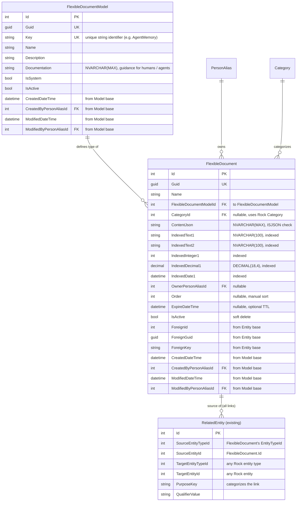

# FlexibleDocument Data Model

**Project:** Extensible Document Store for Rock RMS
**Date:** August 10, 2026
**Status:** Design — revised after review

---

## 1. Purpose

Provide an extensible data model in Rock RMS so developers and AI agents can persist
**real data produced by vibe-coded sources** without creating a new database table for
each use case. The store supports flexible, schema-less JSON payloads while still allowing
fast filtering on a small set of common dimensions.

The data written here is real and expected to be
read back and used by other processes.

---

## 2. Goals

1. Support highly dynamic / evolving document shapes.
2. Avoid constant schema changes.
3. Provide fast filtering on a few key fields.
4. Follow Rock conventions (entity base class, Guids, PersonAlias, Category, inactive records).
5. Be usable by both human developers and AI agents.

---

## 3. Design Overview

Two tables, both prefixed with `FlexibleDocument`:

| Table | Purpose |
|---|---|
| `FlexibleDocumentModel` | Registry of known document types |
| `FlexibleDocument` | Actual documents (JSON payload + indexed fields) |

Plus the existing Rock **`RelatedEntity`** table for all polymorphic links to other Rock
entities. `FlexibleDocument` carries no link columns of its own. Every association to another
entity, including the primary one, is expressed through `RelatedEntity`.

Both new tables inherit `Model<T>`, so they get `Id`, `Guid`, `ForeignId`, `ForeignGuid`,
`ForeignKey`, and the full audit field set (`CreatedDateTime`, `ModifiedDateTime`,
`CreatedByPersonAliasId`, `ModifiedByPersonAliasId`) for free. Those are not hand-declared
columns.

---

## 4. Entity Relationship Diagram

---

## 5. Table Definitions

### FlexibleDocumentModel

Registry of document types (for example `AgentMemory`, `UiPrototype`). Kept as a first-class
table (not a DefinedType) so it can carry rich metadata and governance over document types.
Implements `ISecured` (see Section 7).

Key columns:
- `Key` — unique string identifier
- `Name`, `Description`
- `Documentation` — NVARCHAR(MAX), long-form guidance describing the model for humans and
  agents (what it is for, what the JSON should contain, how to use it)
- `IsSystem`, `IsActive`
- Standard audit fields, inherited from `Model<T>`: `CreatedDateTime`,
  `CreatedByPersonAliasId`, `ModifiedDateTime`, `ModifiedByPersonAliasId`

### FlexibleDocument

The main document store. Inherits `Model<FlexibleDocument>` and is a registered Rock entity
(has its own `EntityTypeId`), which is what makes `RelatedEntity`, `Category`, and history
integration possible.

Core columns:
- `Name`
- `FlexibleDocumentModelId` (FK to `FlexibleDocumentModel`)
- `CategoryId` — uses Rock's `Category` entity (`ICategorized`) instead of a freetext string
- `ContentJson` — JSON payload (NVARCHAR(MAX) + ISJSON check)

Indexed filter columns (numbered for future expansion):
- `IndexedText1` (NVARCHAR(100))
- `IndexedText2` (NVARCHAR(100))
- `IndexedInteger1` (INT) — narrower and cheaper to compare than the decimal column; use it for
  integer dimensions (counts, years, enum values) so a model doesn't burn its decimal slot
- `IndexedDecimal1` (DECIMAL(18,4))
- `IndexedDate1` (DATETIME)

Linking:
- All links to other Rock entities go through the existing `RelatedEntity` table, including
  the primary "this document belongs to entity X" relationship. `FlexibleDocument` has no
  link columns of its own. Use `PurposeKey` on `RelatedEntity` to distinguish the primary
  link from secondary ones.

Other columns:
- `OwnerPersonAliasId` — the person the document is on behalf of. Distinct from
  `CreatedByPersonAliasId`, which is the actor (often an agent) that wrote the row.
- `Order` — nullable int for manual sort ordering of documents within a model or category.
- `ExpireDateTime` — nullable, optional TTL for sources that want their rows auto-purged.
- `IsActive` — soft delete.
- `ForeignId` / `ForeignGuid` / `ForeignKey` — inherited from the entity base (external
  system sync), not designed around.
- Standard audit fields, inherited from `Model<T>`: `CreatedDateTime`,
  `CreatedByPersonAliasId`, `ModifiedDateTime`, `ModifiedByPersonAliasId`

---

## 6. Key Design Decisions & Rationale

| Decision | Rationale |
|---|---|
| JSON in `ContentJson` column | Maximum flexibility, no schema changes required |
| `FlexibleDocument` inherits `Model<T>` | Free `Guid`, `Foreign*`, and audit fields; registers an `EntityTypeId` that unlocks `RelatedEntity` / `Category` / history |
| Separate `FlexibleDocumentModel` table (not DefinedType) | Rich metadata and governance over document types; supports type-level security |
| `Documentation` on the model | Long-form, human- and agent-readable guidance for each document type, so callers know how to produce and read the JSON |
| Four numbered indexed columns | The JSON paths worth indexing differ per model. A persisted computed column over `JSON_VALUE` is fixed per table and cannot vary per model, so a shared set of generic typed columns is the only fit. This is a deliberate EAV-lite tradeoff, not a SQL Server limitation. |
| All entity links via `RelatedEntity` | Integer `EntityTypeId` + `EntityId` (cheap joins), many links per document, `PurposeKey` to categorize each link, and it already carries `Note` / `Quantity` / `AdditionalSettingsJson`. Keeps `FlexibleDocument` free of link columns. |
| `CategoryId` via Rock `Category` | Tree UI and consistent values instead of freetext drift |
| `ExpireDateTime` (optional) | Lets a source opt into TTL cleanup; not required, since this is real data |
| Soft delete (`IsActive`) | Standard Rock pattern |
| Prefix `_com_yourorg_` | Standard plugin table naming |

---

## 7. Security — Type-Level Only

Security lives on the **type**, not the **instance**.

- `FlexibleDocumentModel` implements `ISecured`. You can grant or deny access per document
  type (for example, who may read or write `AgentMemory` documents). This gates access to a
  whole model.
- `FlexibleDocument` (individual rows) is **not** securable. There is no per-document or
  row-level access control. Anyone who can access a given model can read and write **every**
  document of that model.

Consequences and rules:
- Type-level security is coarse. If two rows of the same model need different access, this
  store cannot express that. Split them into different models, or use a purpose-built secured
  entity instead.
- Do **not** store PII, financial data, credentials, or anything needing row-level access
  control in `ContentJson` or the indexed columns.
- `OwnerPersonAliasId` records intent and ownership. It does **not** enforce anything.
- Because the data comes from vibe-coded sources, treat every payload as untrusted input.
  Callers reading `ContentJson` must validate and encode it before use (for example before
  rendering in a UI or feeding it into Lava).

---

## 8. Naming Decisions

- Main table: `FlexibleDocument`
- Model registry: `FlexibleDocumentModel`
- Filter columns use the `Indexed*` prefix and are numbered (`IndexedText1`,
  `IndexedDecimal1`, etc.) so more can be added by migration when a model proves the need.

---

## 9. Indexing Strategy

- Indexes on all five `Indexed*` columns
- Index on `FlexibleDocumentModelId`
- Index on `OwnerPersonAliasId`
- Index on `CategoryId`
- Supporting indexes on date fields where useful
- Entity-to-entity lookups are served by the existing indexes on `RelatedEntity`

---

## 10. Open Questions / Future Considerations

1. Do we need a history/versioning table for the documents themselves, or is Rock's history
   framework enough?
2. Full-text search on `ContentJson` (SQL FTS). Semantic/vector search would need a different store.
3. Cleanup job to purge rows past `ExpireDateTime`.

---

## 11. Next Steps

1. Review and approve this revised design.
2. Create Rock entity classes (`Model<T>`) + service layer.
3. Implement basic CRUD + query helpers.
4. Add seed data for common models (optional).
5. Build a simple admin UI for managing `FlexibleDocumentModel` records.
