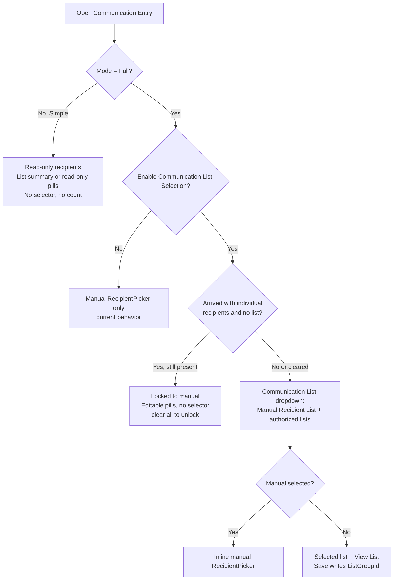
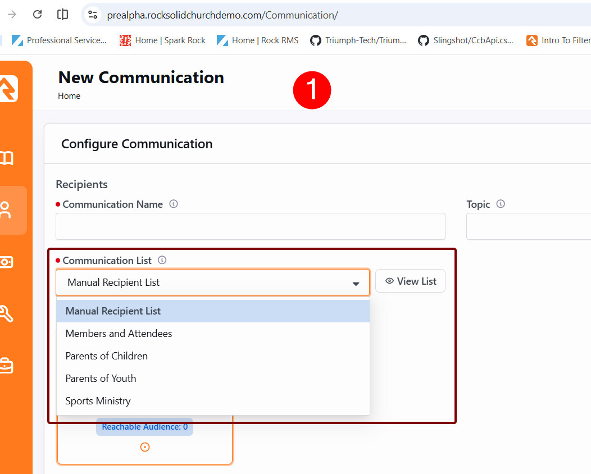
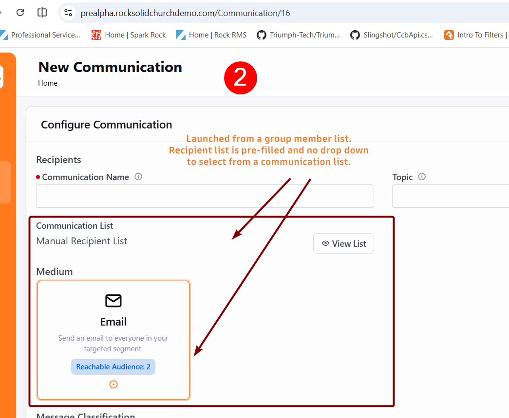
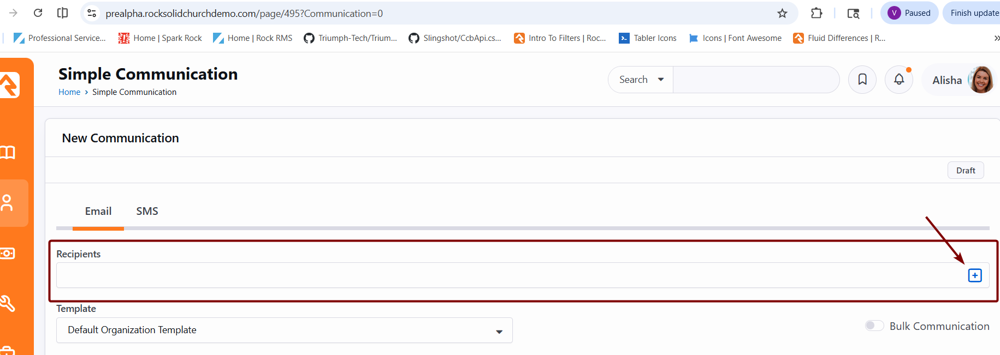

# Communication List Selection in the Simple Communication Entry Block

## Summary

The simple Communication Entry block (`Rock.Blocks/Communication/CommunicationEntry.cs`) forces the user to assemble recipients one person at a time. It cannot send to a Communication List, even though its backend already reads, displays, validates, and queries members for a list when one is already attached. This spec adds the missing piece: a list selector in the recipients area, gated behind a new `Enable Communication List Selection` block setting (default off), so a sender can pick a Communication List as the recipient source. The selector and an accompanying per-medium reachable recipient count appear only in Full mode, mirroring the Communication Wizard. Personalization segments are explicitly out of scope.

## Motivation

Compass Church (DEV-13016) is standardizing on the simple Communication Entry block as its primary staff communication tool, but the simple block cannot send to a Communication List at all; it forces recipients to be assembled by hand. The Obsidian Communication Wizard already offers list selection, so this work brings the simple block to parity with a sibling block staff already know rather than introducing a new pattern. The gap affects any organization that prefers the simple editor for routine list sends.

There is also a correctness dimension, not just convenience. The current workaround is List Detail then Communicate then "Use Simple Editor". Per the technical analysis (DEV-12659), the grid's Communicate action materializes recipients into a frozen snapshot and never sets `Communication.ListGroupId`. Scheduled sends from that path therefore reflect list membership as it was at authoring time, not at send time. Letting the simple block set `ListGroupId` directly means list membership resolves at send, which closes that correctness gap.

The only alternative available to partners today is to duplicate Communication Lists as ordinary groups and rebuild recipients by hand, which is unsustainable and breaks Rock best practice.

## Requirements

- The block MUST define a new `BooleanField` attribute named **Enable Communication List Selection**, defaulting to `false`. When `false`, the block behaves exactly as it does today (manual recipients only), preserving backward compatibility.
- The list selector and the recipient count MUST appear only when the block is in **Full** mode. Simple mode is documented as preventing users from searching for or adding people, so it stays read-only and shows neither the selector nor the count, regardless of the feature setting. `Mode` is the primary signal that separates a stripped external page (for example a group-roster send page in Simple mode) from the full editor.
- When the setting is `true` and the block is in Full mode, the recipients area MUST offer a **Communication List** selector that lets the sender choose either a Communication List or a manual recipient list, mirroring the Communication Wizard recipient experience (see Screenshot 1). Manual recipient entry MUST remain inline in the block; it is not relocated to a modal as the wizard does.
- The selectable lists MUST be the active groups of group type Communication List that the current person is authorized to `VIEW`, sorted by group order then name, displayed by their `PublicName` attribute when set and otherwise the group name. This matches the wizard's `GetCommunicationListGroupBags` behavior.
- Selecting a Communication List MUST persist `Communication.ListGroupId` on save (the "set" half of the save path, which does not exist today). Selecting the manual option MUST continue to clear `ListGroupId` (the "null-out" half already exists).
- On save, send, and schedule, a list-based communication MUST also materialize the list's current members as `CommunicationRecipient` rows (via `RefreshCommunicationRecipientList`) so it appears in recipient-based UI such as the Communication List grid and so the MaximumRecipients approval gate counts the real list size. `ListGroupId` stays set, so membership re-resolves at send. The **Test** action MUST NOT materialize or persist recipients; it sends to the current person against a non-persisted clone.
- Recipient handling for a list MUST NOT load the `communication.Recipients` navigation collection into memory, keeping large lists performant: in list mode the manual reconciliation is skipped (the sync proc owns the set), counts use a `CommunicationRecipientService` query, and switching a list back to manual clears the discarded snapshot by key.
- Recipient editability is governed by **Mode**, not by the recipient source. In **Simple** mode the recipients already on the communication MUST be read-only, whether they came from a Communication List or from individual `CommunicationRecipient` rows, and whether the communication is new or existing: no selector, and a read-only list summary (without the "Convert" action) or read-only recipient pills. In **Full** mode the recipients area is editable and offers the selector (defaulting to the loaded list), subject to the individual-recipient lock below. The partner's "launched from a list, retain recipients, no selector" case is satisfied because those pages run in Simple mode.
- In **Full** mode, a communication that arrived with **individual recipients and no list** (for example a grid "Communicate" launch) MUST keep its recipient source locked to manual *while those recipients remain*: the selector is hidden and the recipients show as an editable picker, so a curated set cannot be swapped wholesale for a list. Removing all of them releases the selector. This mirrors the Communication Wizard, which shows a read-only "Manual Recipient List" until its individual recipients are cleared. A communication that arrived with a Communication List, or a brand-new communication, is never locked. The lock is reactive (keyed on the live recipient count); the selector and the manual picker each animate in and out via `TransitionVerticalCollapse`.
- Switching the selector MUST keep recipient state coherent: switching to a Communication List MUST clear any stale manually entered or snapshot recipient rows; switching back to manual MUST accept user-chosen recipients. Both directions must be tested.
- When the feature is enabled in Full mode, the panel header MUST show a per-medium **reachable recipient count** to the left of the status (Draft) label, worded as "N Recipients" (singular "1 Recipient"). It MUST reflect the active recipient source, whether a Communication List or manual recipients, and MUST recompute as the selection, the recipients, or the active medium changes. It uses the same Full-mode basis as the status label and shows "0 Recipients" when empty.
- The reachable count MUST be deliverability-filtered per medium, counting only recipients reachable on the active medium (email honoring the bulk flag, SMS, or push), matching the wizard's per-medium "reachable audience" rather than a raw member count.
- Validation MUST continue to require either a selected list or at least one recipient (the existing either-or validation), not both.
- The selector and count MUST be available for every medium the block supports (email, SMS, push), since the list is a property of the communication, not of a single medium. The count MUST be stable across medium switches.
- The block MUST provide a "View List" action beside the selector that opens the existing recipient modal (`recipientModal.partial.obs`) to preview the resolved members of the selected list.
- Enabling the feature MUST be per block instance with no data migration; no existing block instance changes behavior on upgrade.

## Design

### Current state

The backend already carries most of the list plumbing; only the selection path and the client-facing list data are missing.

| Concern | Before | Change |
|---|---|---|
| Read existing list onto the bag | `SetInitialCommunicationListValues` ([CommunicationEntry.cs:1559](Rock.Blocks/Communication/CommunicationEntry.cs:1559)) | No change |
| Query list members | `GetCommunicationListMembers` via `GetRecipientQuery` ([CommunicationEntry.cs:1279](Rock.Blocks/Communication/CommunicationEntry.cs:1279)) | No change |
| Save: clear list | null-out branch ([CommunicationEntry.cs:1854](Rock.Blocks/Communication/CommunicationEntry.cs:1854)) | No change |
| Save: set list | absent | Add `ListGroupId = group.Id` branch |
| Validation (list or recipients) | [CommunicationEntry.cs:2126](Rock.Blocks/Communication/CommunicationEntry.cs:2126), [:2183](Rock.Blocks/Communication/CommunicationEntry.cs:2183) | No change |
| Available lists sent to client | absent | Add `CommunicationListGroups` + `IsCommunicationListSelectionEnabled` to init box |
| Resolve list members for the client | internal only | Expose via `GetCommunicationListRecipients` block action |
| Reachable recipient count | absent | Derived on the client from the resolved recipient bags; no dedicated count action |
| List selector UI | absent (read-only display only) | Add selector (Full mode only) |

The bag already exposes `CommunicationListGroupGuid`, `CommunicationListName`, and `CommunicationListRecipientCount` ([CommunicationEntryCommunicationBag.cs:39](Rock.ViewModels/Blocks/Communication/CommunicationEntry/CommunicationEntryCommunicationBag.cs:39)). The UI today only renders a read-only `Communication List: {name} ({count} individuals)` line plus a "Convert List to Recipients" button when a list is already attached ([communicationMediumEmail.partial.obs:37](Rock.JavaScript.Obsidian.Blocks/src/Communication/CommunicationEntry/communicationMediumEmail.partial.obs:37)); otherwise it shows the manual `RecipientPicker` ([recipientPicker.partial.obs](Rock.JavaScript.Obsidian.Blocks/src/Communication/CommunicationEntry/recipientPicker.partial.obs)).

### Backend changes

1. Add the `Enable Communication List Selection` `BooleanField` (default `false`) to the block's attribute declarations, with an `AttributeKey` constant and an `IsCommunicationListSelectionEnabled` getter.
2. Port `GetCommunicationListGroupBags` from `CommunicationEntryWizard.cs` ([CommunicationEntryWizard.cs:2360](Rock.Blocks/Communication/CommunicationEntryWizard.cs:2360)) into the simple block, filtered by `Authorization.VIEW`.
3. Populate `CommunicationListGroups` (`List<ListItemBag>`) and `IsCommunicationListSelectionEnabled` on `CommunicationEntryInitializationBox` only when the setting is on and the block was not launched from a list.
4. Add a `GetCommunicationListRecipients` block action that returns the resolved recipient bags for a selected list. The query MUST set `SegmentDataViewIds = new List<int>()` so a list with no segments does not throw a `NullReferenceException`. The client uses these bags both to compute the reachable count and to feed the "View List" preview modal; no separate count action exists.
5. Add the missing "set" branch in the save path so a bag carrying a list guid writes `Communication.ListGroupId = group.Id`. On save, send, and schedule, when `ListGroupId` is set, call `communication.RefreshCommunicationRecipientList( rockContext )` to materialize the list's current members; since simple comms carry no `Segments`, this uses the modern `spCommunication_SynchronizeListRecipients` path, which also removes stale pending recipients. In list mode, skip the manual recipient reconciliation and the medium fixup so `communication.Recipients` is never loaded; count via a `CommunicationRecipientService` query; and clear a discarded list snapshot (a list switched back to manual) with EF-tracked deletes by key. The **Test** action does not materialize recipients.

### Frontend changes

The parent block (`communicationEntry.obs`) owns the shared list state. When a list guid is set it fetches the resolved recipients once via `GetCommunicationListRecipients`, holds the bags and a fetching flag, and passes them down to every medium partial. This keeps the reachable count stable when the user switches mediums and avoids each medium re-fetching.

Each medium partial mirrors the wizard recipient pattern (`wizardStartStep.partial.obs` [:63](Rock.JavaScript.Obsidian.Blocks/src/Communication/CommunicationEntryWizard/wizardStartStep.partial.obs:63)): a single half-width (`col-sm-6`) **Communication List** `DropDownList` whose first item is "Manual Recipient List" (the manual sentinel), followed by the authorized lists. A "View List" button sits beside the dropdown, vertically aligned with it via a matching empty label (the wizard's technique). Selecting "Manual Recipient List" shows the existing inline `RecipientPicker`; selecting a real list shows the list name and the "View List" preview. The selector is wired with `useReloadBlock` and `onConfigurationValuesChanged` so toggling the block setting reflects without a manual reload. A communication that arrived with individual recipients (no list) hides the selector until those recipients are cleared (the reactive `isManualRecipientSourceLocked` gate); the selector and the manual `RecipientPicker` are each wrapped in `TransitionVerticalCollapse` so they animate in and out.

The reachable count renders in the panel header (`#subheaderRight`), to the left of the status label, as a `HighlightLabel`. It reads "N Recipients" (pluralized, with a loading spinner while the list fetch is in flight), matching the wizard's panel-header label. It is computed from the active recipient source, the list bags when a list is selected, otherwise the manual recipients, filtered to those reachable on the active medium.

Visibility rules, expressed against the config:

- Selector: `mode === Full && isCommunicationListSelectionEnabled && !isManualRecipientSourceLocked`, where `isManualRecipientSourceLocked = isLaunchedWithIndividualRecipients && liveRecipientCount > 0` and `isLaunchedWithIndividualRecipients` means "arrived with recipients and no list". The lock releases reactively as recipients are removed, and the selector is wrapped in `TransitionVerticalCollapse` so it animates in.
- Count: `mode === Full && isCommunicationListSelectionEnabled` (the same Full-mode basis as the status label).
- Locked list summary ("Communication List: {name} ({count} individuals)"): `hasCommunicationList && !showListSelector`, i.e. shown for a list-based communication whenever the editable selector is not (Simple mode, or Full mode with the feature off). The "Convert List to Recipients" action shows only in Full mode.

The recipient-source decision:

In Full mode with the feature enabled, the header shows the per-medium reachable count for whichever branch (manual or list) is active.

### Reference screenshots

Target experience, from the Communication Wizard the partner designated as canonical:

Launched-from-a-list case (no selector, recipients retained):

Current simple block behavior (manual recipients only):

## Out of Scope

- **Personalization segments / segment criteria.** The wizard exposes a segment (data view) filter and AND/OR criteria alongside its list picker. The partner confirmed they do not need this, and the acceptance criteria are pinned to "list picker only, no segments." Adding it later is an estimated 4 to 12 hour follow-up.
- **Brand-integrity lockdown.** The simple block is more permissive than the builder, so list selection does not enforce template or branding constraints. The durable fix for brand integrity is editable content regions (the Mailchimp / HubSpot / Marketo / Klaviyo pattern), which is a large product feature and a separate roadmap conversation.
- **Changing the grid Communicate snapshot path.** This spec lets the simple block set `ListGroupId` going forward; it does not retroactively repair communications already created as frozen snapshots by the grid action.

## Considered but Rejected

### A separate "List | Specific People" toggle instead of a combined dropdown
The technical estimate proposed a two-way toggle in each medium partial. The partner instead pointed to Screenshot 1, where the wizard models this as a single Communication List dropdown with "Manual Recipient List" as the first option. Treating the screenshot as canonical keeps the simple block consistent with the wizard the users already know, so the combined dropdown is preferred over a distinct toggle control.

### A dedicated server action for the recipient count
The technical analysis planned a block action returning just the count on picker change. During implementation the count was instead derived on the client from the recipient bags already fetched for the "View List" preview, so a separate count action was redundant and was removed. This avoids a second round trip and keeps the count, the preview, and the per-medium reachable filtering working from one source.

### "Reachable Audience: N" wording
The wizard's medium cards label the count "Reachable Audience: N", but its panel header (the placement adopted here) labels it "N Recipients" via a pluralized helper. The header wording was chosen to match the placement, so the count reads "N Recipients".

### Gating the selector on predefined recipients
An interim guard hid the selector whenever the communication loaded with recipients. This wrongly hid the dropdown when editing an existing communication in the full editor. `Mode` already distinguishes the read-only Simple page from the full editor, so the predefined-recipients guard was removed and gating rests on `Mode` alone.

### Locking the selector on the presence of a communication list (or only for unsaved launches)
Earlier versions locked the selector whenever the communication carried a `ListGroupId`, then only when it was also unsaved (`Transient`). Both diverged from the real rule: the Communication Wizard never locks a list-based communication, and Rock's "Simple" mode is defined as preventing recipient editing. Locking is governed by `Mode` (Simple locks, Full edits), plus a reactive individual-recipient gate in Full mode that mirrors the wizard (see Requirements).

### A permanent lock for grid-launched communications
The individual-recipient gate was first written as a permanent lock keyed on the initial load, so clearing the recipients never restored the selector. The wizard's lock is actually reactive (it keys on the live individual-recipient count), so the block matches that: removing all recipients releases the selector.

### A set-based SQL delete to clear a list snapshot on downgrade
Switching a list back to manual must clear the previously materialized recipients. A single `DELETE` would be fastest, but the **Test** action runs `UpdateCommunication` on a separate, intentionally non-persisted context, and raw SQL commits immediately, which would delete real recipients during a test send. The cleanup therefore uses EF-tracked deletes by key (an Id-only query plus stub deletes), which stay uncommitted on the Test context and avoid loading the entities.

### Limiting the count to list selection only
Asana scopes the count to "live recipient count on picker change", i.e. a list is selected. It was generalized to also count manual recipients so the header behaves consistently across both recipient sources and matches the wizard, which always shows the count in Full mode.

### Duplicating Communication Lists as ordinary groups
This is the only workaround available to partners today. Rejected as the supported solution: it doubles maintenance, drifts out of sync, and breaks Rock best practice. It is precisely the pain this spec removes.

### Leaving list sends to the Communication Wizard
Rejected. The partner is standardizing on the simple editor for routine staff sends and does not want to push users into the wizard just to reach a Communication List. The Obsidian wizard keeps its list picker, so giving the simple block the same capability keeps the two consistent.

## Related

- Asana dev task: [\[Compass Church\] Simple Communication Editor](https://app.asana.com/1/20866866924293/project/1208321217019996/task/1215074690312262) (DEV-13016, in progress, targeted v20). Source of the acceptance criteria and the canonical screenshots.
- Asana technical analysis: [TA Task: Simple Communication Editor](https://app.asana.com/1/20866866924293/project/1208364266328691/task/1214513864238962) (DEV-12659, completed). Source of the implementation approach, the `Enable Communication List Selection` setting name, the correctness-gap analysis, the segments scope decision, and the "live recipient count on picker change" that the count traces to.
- Asana parent request: [\[The Compass Church\] Communication Lists in Simple Communication Entry](https://app.asana.com/1/20866866924293/project/470445943316739/task/1214284370450549) (Custom Development, v20). Source of the strategic motivation and the launched-from-a-list confirmation.
- In-repo pattern to mirror: `CommunicationEntryWizard` recipient step ([wizardStartStep.partial.obs:63](Rock.JavaScript.Obsidian.Blocks/src/Communication/CommunicationEntryWizard/wizardStartStep.partial.obs:63), `GetCommunicationListGroupBags` [CommunicationEntryWizard.cs:2360](Rock.Blocks/Communication/CommunicationEntryWizard.cs:2360)).
- Screenshots stored under `artifacts/260617-communication-entry-list-selection/` (wizard list picker, launched-from-a-list, current manual recipients, current recipient entry).
