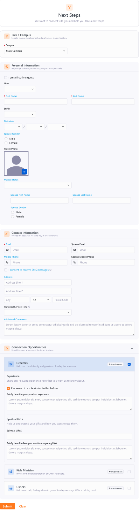
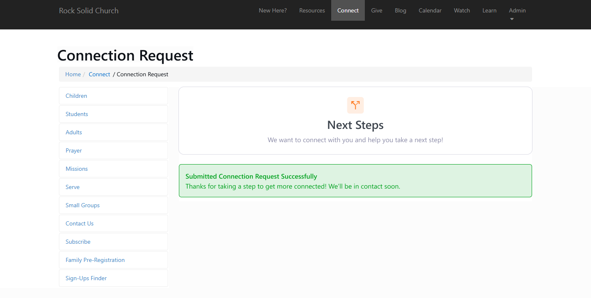
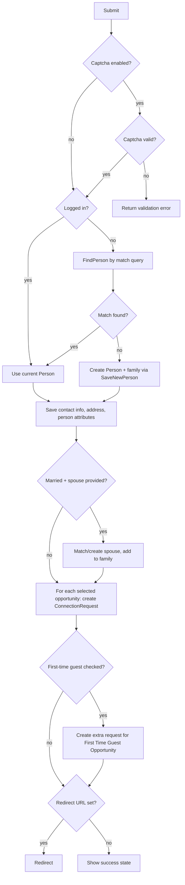

# Connection Request Entry

## Summary

`Connection Request Entry` is a net-new public-facing Obsidian block (`RockBlockType`) in the Connection domain. It presents an external visitor with a single self-service form: an optional campus selection, their personal information (with an optional spouse), contact information and address, an optional set of person attributes, and a multi-select list of active Connection Opportunities to get involved with. On submit the block matches or creates the visitor's Person (and optional spouse), saves their contact info and address, and creates one ConnectionRequest per selected opportunity. It then either redirects to a configured URL or shows a built-in success state.

Almost every field is governed by a Show / Hide / Required block setting, and all visible copy (banner, section titles and descriptions, success message) is configurable. The block ships seeded onto a new external page, "Get Connected" at `/connect/get-connected`.

## Motivation

Rock has no public, general-purpose "get involved" entry point. The existing `ConnectionOpportunitySignup` block (`Rock.Blocks/Connection/ConnectionOpportunitySignup.cs`) signs a person up for exactly **one** pre-pinned opportunity and collects only name, email, phone, and comments. Churches want a single page where a guest can tell them who they are and pick from several ways to serve or connect at once, while staff control which fields are asked for and which are required.

This block is a planned v20 Connection feature (Asana DEV-12493). The design is approved and final (prayer-request entry was explicitly cut from scope during design review). The requirements below are drawn from the approved Figma and the three resolved PO questions on the task.

The approved Connection Entry form and its success state:





## Requirements

### Page and deployment

- A migration MUST create a new external-site page "Get Connected" with route `/connect/get-connected`, placed at the top of the external site navigation, and add an instance of this block to it.
- The block type MUST be registered as an entity-based (Obsidian) block type using `AddOrUpdateEntityBlockType()`. It MUST NOT use the path-based `UpdateBlockTypeByGuid()` (that helper issues a `DELETE FROM [BlockType] WHERE [Path]` and can wipe entity-based block types, see `.claude/rules/data-model.md`).
- Seeding the Get Connected page is conditional on the "Involvement" connection type existing. The migration MUST look it up and, only when found, create the page and set the block instance's `Connection Types` setting to it. If it is absent, the migration MUST NOT create the connection type and MUST skip creating the page. "Involvement" is sample-data-only (`Documentation/sampledata*.xml`), not core seed, so installs without sample data simply do not get the page.

### Form structure

The form renders, top to bottom, the following sections. Each section uses the v20 ContentSection pattern (colorful section icon, title, and a description slot).

1. **Banner** (optional). Shown when `Display Banner` is true. Configurable icon, title, and description.
2. **Pick a Campus**. Shown ONLY when more than one active campus exists. Defaults to the campus context if one is set, otherwise the person's primary campus, otherwise the first available. Rendered with the lighter section style.
3. **Personal Information**. First-time-guest checkbox (conditional, see below), Title, First Name (required), Last Name (required), Suffix, Birthdate, Profile Photo, Marital Status, and a conditional spouse well (Spouse First Name, Spouse Last Name, Spouse Gender) that appears only when Marital Status is "Married."
4. **Contact Information**. Email (required by default), Spouse Email, Mobile Phone, Spouse Mobile Phone, an SMS-consent checkbox, Address, Preferred Service Time (conditional), and Additional Comments.
5. **Connection Opportunities**. A multi-select list of Display Cards, one per available opportunity. Selecting a card (checkbox) requests that opportunity. When a selected opportunity has request attributes configured, the card expands (accordion mode) to show those attribute editors and pushes the remaining cards down.
6. **Additional Information** (optional). Person attribute editors for the attributes in the configured `Person Attribute Category`. Hidden when no category is set.
7. **Footer**. Submit and Clear buttons. The footer MUST remain in the viewport while scrolling (sticky footer). An optional CAPTCHA sits above the footer when `Enable Captcha` is true.

### Field visibility and gating

- Every field marked with `*` below is governed by a Show / Hide / Required dropdown block setting. "Hide" removes the field; "Required" makes it mandatory.
- Spouse fields (Spouse First/Last Name, Spouse Gender, Spouse Email, Spouse Mobile Phone) MUST only render when Marital Status is "Married," in addition to their own Show/Hide/Required setting.
- Gender (person and spouse) MUST render as a two-option radio (Male / Female) on external sites. (On internal/admin contexts the same control renders as a dropdown with a null option; this block is external, so the radio form applies.)
- The first-time-guest checkbox MUST only render when `First Time Guest` is set to Show or Required.
- Preferred Service Time MUST only render when a `Preferred Service Time` category is configured.
- When the visitor is logged in, the form MUST auto-populate as many field values as possible from their Person record.

### Block settings (Tab 1: Basic Settings)

`*` denotes a CustomDropdownListField with options Show / Hide / Required.

| Setting | Type | Default | Notes |
|---|---|---|---|
| Connection Types | ConnectionTypesField (multi-select) | null | **Required.** Determines which opportunities are offered (active opportunities within the selected types). |
| Display Banner | Boolean | True | Shows the banner at the top of the form. |
| First Time Guest* | Show/Hide/Required | Hide | Shows the "I am a first time guest" option. |
| First Time Guest Opportunity | ConnectionOpportunitiesField | null | When the guest checks first-time-guest, their request is ALSO added to this opportunity (in addition to their selected opportunities). |
| Title* | Show/Hide/Required | Hide | |
| Suffix* | Show/Hide/Required | Hide | |
| Birthdate* | Show/Hide/Required | Show | |
| Gender* | Show/Hide/Required | Show | |
| Profile Photo* | Show/Hide/Required | Hide | |
| Marital Status* | Show/Hide/Required | Show | Drives the conditional spouse fields. |
| Spouse First Name* | Show/Hide/Required | Show | Only when Married. |
| Spouse Last Name* | Show/Hide/Required | Show | Only when Married. |
| Spouse Gender* | Show/Hide/Required | Show | Only when Married. |
| Email* | Show/Hide/Required | Required | |
| Spouse Email* | Show/Hide/Required | Hide | Only when Married. |
| Mobile Phone* | Show/Hide/Required | Show | |
| Spouse Mobile Phone* | Show/Hide/Required | Hide | Only when Married. |
| SMS Enabled* | Show/Hide/Required | Show | Consent to receive text messages. |
| Address* | Show/Hide/Required | Show | |
| Additional Comments* | Show/Hide/Required | Show | Maps to ConnectionRequest.Comments. |
| Enable Captcha | Boolean | False | |
| Person Attribute Category | CategoryField | null | Determines the person attributes shown in the Additional Information section. |
| Preferred Service Time | CategoryField (EntityType `Rock.Model.Schedule`) | null | Picks a Schedule category; the options are the Schedules in that category, mirroring Service Metrics Entry's `Schedule Category` setting. Hidden when unset. |
| Optional Redirect URL | UrlLinkField | none | Where to redirect after submit. Blank shows the default success state. |

In addition to the Figma list, the block needs new-person defaults that the design omitted but `ConnectionOpportunitySignup` proves are required when creating a guest Person. Add these as block settings, matching `ConnectionOpportunitySignup`'s defaults:

| Setting | Type | Default |
|---|---|---|
| Connection Status | DefinedValueField (Person Connection Status) | Prospect |
| Record Status | DefinedValueField (Person Record Status) | Pending |
| Record Source | DefinedValueField (Record Source Type) | Serving Connection |

### Block settings (Tab 2: Customize Text)

All TextFields. Defaults captured verbatim from the approved design.

| Setting | Default |
|---|---|
| Banner Icon | `ti ti-route-alt-left` |
| Banner Title | Next Steps |
| Banner Description | We want to connect with you and help you take a next step! |
| Personal Information Section Title | Personal Information |
| Personal Information Section Description | Help us get to know you and support you more personally. |
| Contact Information Section Title | Contact Information |
| Contact Information Section Description | Provide the best ways for us to stay in touch with you. |
| Additional Comments Label | Additional Comments |
| Connection Opportunities Section Title | Connection Opportunities |
| Connection Opportunities Description | Select the areas where you'd like to get involved. |
| Additional Information Section Title | Additional Information |
| Additional Information Section Description | Provide any additional details to help us better understand your request to get connected. |
| Submission Success Title | Submitted Connection Request Successfully |
| Submission Success Description | Thanks for taking a step to get more connected! We'll be in contact soon. |

Help text shown inline under specific fields: SMS consent reads "Allow us to send you text updates about your connection request."; Preferred Service Time reads "Let us know which service you usually attend or plan to attend so we can help get you better connected."

### Submission behavior

- On submit the block MUST match or create the visitor's Person, persist their contact info and address, save any person attribute values, and create one ConnectionRequest per selected opportunity.
- If the visitor checked first-time-guest, the block MUST create an ADDITIONAL ConnectionRequest against the configured First Time Guest Opportunity.
- At least one opportunity MUST be selected for submission to succeed, UNLESS the first-time-guest box is checked and a First Time Guest Opportunity is configured. In that case the first-time-guest request alone is a valid submission.
- After a successful submit: if `Optional Redirect URL` is set, redirect there; otherwise render the built-in success state (banner plus the configured Submission Success alert).
- When `Enable Captcha` is true, the submission MUST pass CAPTCHA verification before any records are created.

## Design / Proposed Approach

### Architecture

Standard Obsidian three-layer block, modeled on `ConnectionOpportunitySignup`:

- **C# block:** `Rock.Blocks/Connection/ConnectionRequestEntry.cs`, a `RockBlockType`. `GetObsidianBlockInitialization()` returns the initialization box; a `Save` block action accepts the request bag and returns a result bag.
- **Bags:** `Rock.ViewModels/Blocks/Connection/ConnectionRequestEntry/` with `ConnectionRequestEntryInitializationBox`, `ConnectionRequestEntryRequestBag`, `ConnectionRequestEntryResultBag`, and a `ConnectionRequestEntryOpportunityBag` (one per offered opportunity: id, title, description, icon, "Involvement" label, and its request-attribute editors).
- **Vue:** `Rock.JavaScript.Obsidian.Blocks/src/Connection/connectionRequestEntry.obs` plus per-section partials under `connectionRequestEntry/` (personalInformationSection, contactInformationSection, additionalInformationSection, connectionOpportunitiesSection).

Controls are all existing framework controls (confirmed present): `campusPicker`, `definedValuePicker` (Title, Suffix, Marital Status), `birthdayPicker`, `imageUploader` (profile photo), `addressControl`, `phoneNumberBox`, `emailBox`, and the gender radio. The `Connection Types` setting uses the existing `ConnectionTypesFieldType` (`Rock/Field/Types/ConnectionTypesFieldType.cs`).

### Available opportunities

On initialization the block loads active ConnectionOpportunities whose ConnectionType is in the configured (required) `Connection Types` set and whose ConnectionType is active. Each opportunity contributes a Display Card. Request-attribute editors per opportunity follow the `ConnectionOpportunitySignup` attribute pattern: load the opportunity/type ConnectionRequest attributes, filter to public attributes, and surface them as `PublicAttributeBag` editors that expand inside the card.

### Person match-or-create

Follow the proven guest-facing pattern from `ConnectionOpportunitySignup` and `Rock.Blocks/Prayer/PrayerRequestEntry.cs`:

1. If the visitor is logged in, use their Person directly (and pre-populate the form).
2. Otherwise call `PersonService.FindPerson(new PersonService.PersonMatchQuery(firstName, lastName, email, mobilePhone), updatePrimaryEmail: false)`.
3. On no match, create a new `Person` (RecordType = Person; ConnectionStatus / RecordStatus / RecordSource from block settings; email with `IsEmailActive = true`, `EmailPreference = EmailAllowed`; phone numbers via the mobile phone defined-value type with `IsMessagingEnabled` from the SMS-consent checkbox) and persist via `PersonService.SaveNewPerson(person, rockContext, campusId, savePersonAttributes: false)`, which auto-creates the family and known-relationships groups.
4. Save the address as a Home `GroupLocation` on the family group, and save person attribute values from the Additional Information section.

### Spouse

When Marital Status is "Married" and spouse fields are provided, match-or-create the spouse Person the same way and add them to the visitor's family group as an Adult (the `RegistrationEntry` family-handling pattern). Spouse contact fields persist to the spouse Person. For a logged-in visitor whose family already has a spouse, the existing spouse is loaded via `Person.GetSpouse()` and updated in place rather than duplicated.

### Preferred Service Time

When a `Preferred Service Time` Schedule category is configured, the field offers the Schedules in that category. This follows Service Metrics Entry's `Schedule Category` pattern (`Rock.Blocks/Reporting/ServiceMetricsEntry.cs`): a CategoryField scoped to `Rock.Model.Schedule`, then `ScheduleService` filtered by that category, defaulting to the core "Service Times" category (`SystemGuid.Category.SCHEDULE_SERVICE_TIMES`). The visitor's chosen schedule is persisted to a first-class `Person.PreferredServiceTimeScheduleId` foreign key (see Resolved during authoring).

### ConnectionRequest creation

For each selected opportunity (and the First Time Guest Opportunity when applicable), create:

```csharp
var request = new ConnectionRequest
{
    PersonAliasId       = person.PrimaryAliasId.Value,
    ConnectionOpportunityId = opportunity.Id,
    ConnectionTypeId    = opportunity.ConnectionTypeId,
    ConnectionState     = ConnectionState.Active,
    ConnectionStatusId  = opportunity.ConnectionType.ConnectionStatuses.First( s => s.IsDefault ).Id,
    CampusId            = campusId,
    ConnectorPersonAliasId = opportunity.GetDefaultConnectorPersonAliasId( campusId ),
    Comments            = additionalComments ?? string.Empty
};
```

Add via `ConnectionRequestService`, `SaveChanges()`, then `SaveAttributeValues()` for that request's attribute editors, all within a transaction. ConnectionRequest save hooks fire the normal post-create activity/workflow plumbing; no custom workflow trigger is added by this block.

### Submission flow



### Migration

A plugin or EF migration (target v20) registers the entity block type via `AddOrUpdateEntityBlockType()`. The page seeding is conditional: the migration looks up the "Involvement" connection type, and only when it is present does it create the "Get Connected" page and `/connect/get-connected` route under the external site, add the block instance, and set the instance's `Connection Types` attribute value to that type. "Involvement" is defined only in Rock's sample data (`Documentation/sampledata*.xml`), not core seed, so on installs without sample data the page is not created and nothing is force-created.

## Open Questions

None remaining.

### PO Heads-Up

- **Get Connected page seeding is conditional (structural checks only).** The migration seeds the "Get Connected" external page, its `connect/get-connected` route, the block instance, and the sidebar sub-nav only when the stock pieces it places into exist: the **Connect** parent page, the **Left Sidebar** layout, and the **Page Menu** block type. If any is missing, the site has diverged from stock, so seeding is skipped and the block type stays registered for manual placement. The "Involvement" connection type is no longer a gate — when present it seeds the block's Connection Types value, and when absent the block is placed for an admin to configure.

### Resolved during authoring

- **New-person record defaults (PO decision, 2026-07-07):** keep Connection Status (Prospect), Record Status (Pending), and Record Source (Serving Connection) as configurable block settings. They cannot be derived from existing configuration, and the values match `ConnectionOpportunitySignup`, the closest sibling block. The PO approved the settings and their defaults as-is.
- **Preferred Service Time source:** Schedules from the core "Service Times" schedule category (`SystemGuid.Category.SCHEDULE_SERVICE_TIMES`), following Service Metrics Entry's `Schedule Category` pattern (not a DefinedType).
- **Preferred Service Time storage (PO decision, 2026-06-30):** a first-class `Person.PreferredServiceTimeScheduleId` column — a nullable foreign key to `Schedule` with `ON DELETE SET NULL` (a deleted schedule clears the reference; it does not delete the person). Implemented as the entity property + `PersonConfiguration` mapping (`WillCascadeOnDelete(false)`) plus block save/prefill; the EF migration that adds the column is scaffolded in Visual Studio via `Add-Migration`.
- **Minimum to submit:** a first-time-guest submission can stand alone. When the first-time-guest box is checked and a First Time Guest Opportunity is configured, no opportunity card needs to be selected.
- **Connection Opportunities description:** "Select the areas where you'd like to get involved." (the form design copy; the settings-callout annotation had stale text).
- **Logged-in spouse:** load the existing spouse via `Person.GetSpouse()` and update it in place; never create a duplicate.
- **New-person defaults:** Connection Status = Prospect, Record Status = Pending, Record Source = Serving Connection (configurable block settings, matching `ConnectionOpportunitySignup`).
- **Involvement connection type:** sample-data-only, no core guid. When present, the migration seeds it as the block's Connection Types value; it is not a page-seeding gate and is never force-created.
- **Get Connected page layout and sub-nav (PO decision, 2026-06-30):** keep the fixed Left Sidebar layout + Page Menu sub-nav (matching the other Connect child pages). Gate seeding only on basic structural existence checks — Connect parent page, Left Sidebar layout, and Page Menu block type — rather than detecting or matching sibling pages.

## Considered but Rejected

### Extend `ConnectionOpportunitySignup` instead of a new block
Rejected. That block is built around a single pinned opportunity with name/email/phone/comments only. Adding multi-opportunity selection, spouse, address, person attributes, per-field Show/Hide/Required settings, and customizable section text would rewrite it and break its existing instances. A new block keeps backward compatibility.

### One ConnectionRequest spanning all selected opportunities
Rejected. ConnectionRequest is opportunity-scoped by model (`ConnectionOpportunityId` is required and single). One request per selected opportunity is the only shape that matches the data model and lets connectors and per-opportunity request attributes work.

### Reuse the `ConnectionTypeSettingsFieldType` composite picker for the block setting
Rejected for this setting. That composite (Type + Opportunity + Status + Source) is designed for pinning a single opportunity flow (SMS action). This block filters by one or more whole connection types, which the existing multi-select `ConnectionTypesFieldType` expresses directly.

## Related

- Approved design: [Figma "Connections-Entry"](https://www.figma.com/design/NXNsAHyxeP7QrJxeoyqXid/Connections-Entry?node-id=39-3) (treated as canonical; block-settings spec lives in the right-rail callout frames; the three resolved PO questions on the Asana task override the design where they conflict, notably the required multi-select Connection Types setting).
- Asana task: [Connection Request Entry (DEV-12493)](https://app.asana.com/1/20866866924293/project/1208321217019996/task/1213693775269156)
- Prime implementation analog: `Rock.Blocks/Connection/ConnectionOpportunitySignup.cs`
- Person match-or-create analog: `Rock.Blocks/Prayer/PrayerRequestEntry.cs`
- Family + spouse handling analog: `Rock.Blocks/Event/RegistrationEntry.cs`
- ConnectionRequest model: `Rock/Model/Connection/ConnectionRequest/ConnectionRequest.cs`
- Connection Types field type: `Rock/Field/Types/ConnectionTypesFieldType.cs`
- Preferred Service Time precedent (Schedule category to service-time Schedules): `Rock.Blocks/Reporting/ServiceMetricsEntry.cs`
- Planned-visit-as-workflow-context precedent (not persisted on any entity): `Rock.Blocks/Crm/FamilyPreRegistration.cs`
- Core "Service Times" schedule category: `SystemGuid.Category.SCHEDULE_SERVICE_TIMES` (`Rock/SystemGuid/Category.cs`)
- "Involvement" connection type (sample data only): `Documentation/sampledata_1_14_1.xml`
- Related prior spec (shared ConnectionRequest creation logic): [SMS Action: Create Connection Request](completed/communication/260506-sms-action-create-connection-request.md)
- Near-analog spec (Obsidian block that creates connection requests, person-entry patterns): `specs/260609-rapid-attendance-entry-obsidian-conversion.md`
