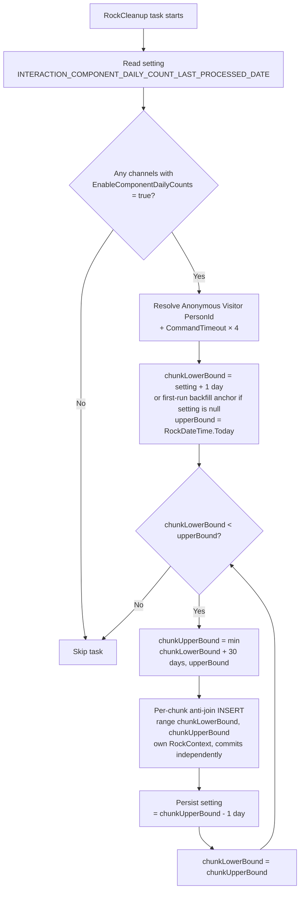

# Interaction Component Daily Count

## Summary

To speed up the retrieval of interaction metrics summarized at the component level, Rock will introduce a new lightweight aggregate table `InteractionComponentDailyCount` that pre-aggregates daily interaction counts per `InteractionComponent`. This eliminates expensive runtime aggregation against the full `Interaction` table for reporting and dashboard use cases. Aggregation is gated per channel by a new `EnableComponentDailyCounts` flag, with a per-medium default attribute that controls the initial value for new channels, and the Rock Clean-up job is responsible for keeping the table current.

## Motivation

Reporting and dashboarding against interaction data currently scans the raw `Interaction` table and aggregates at query time. As `Interaction` grows into the tens of millions of rows in busy organizations, this becomes prohibitive. A daily, per-component pre-aggregate covers the common reporting shape (counts and averages over time) at a fraction of the cost. The opt-in flag and per-medium defaults ensure organizations that do not need this data do not pay the storage or backfill cost.

## Requirements

- MUST create a new table `InteractionComponentDailyCount` with a composite primary key on (`InteractionComponentId`, `InteractionDate`, `Operation`) and the fields described in **Data Model** below.
- MUST add a non-nullable `EnableComponentDailyCounts` bit column to `InteractionChannel` with a default of `false`.
- MUST add a new `Default Component Daily Counts` boolean attribute on the "Interaction Mediums" `DefinedType` controlling the default value of `EnableComponentDailyCounts` for newly created channels of that medium.
- MUST add a pre-save hook on `InteractionChannel` that, on **Add only**, sets `EnableComponentDailyCounts = true` when the channel's medium has the `Default Component Daily Counts` attribute set to `true`.
- MUST backfill `EnableComponentDailyCounts` on existing `InteractionChannel` rows from their medium's attribute value during the migration.
- MUST seed `Default Component Daily Counts = true` on the mediums listed in **Migration B** below; all other mediums default to `false`.
- MUST translate a `null` `Interaction.Operation` to an empty string (`''`) when writing to `InteractionComponentDailyCount` because `Operation` is part of the composite primary key and cannot be null.
- MUST add a new step in the Rock Clean-up job that populates `InteractionComponentDailyCount` from the last recorded date through yesterday for every component belonging to a channel where `EnableComponentDailyCounts = true`. See **Rock Clean-up Job** for the full requirement set.
- MUST NOT recalculate dates that have already been written. Late-arriving `Interaction` rows for an already-written date are intentionally not reflected in the aggregate.
- MUST NOT write a record for the current day; aggregation stops at yesterday.
- MUST be implemented as a SQL-based aggregation, not row-by-row EF, to remain performant on large `Interaction` tables.
- SHOULD set the SQL command timeout high enough for the first run to complete a multi-year backfill without timing out.

## Data Model

### `InteractionComponentDailyCount` table

This is a lightweight aggregate table. It does **not** inherit from `Model<T>` and does **not** include standard Rock audit fields (`Id`, `Guid`, `CreatedDateTime`, `ModifiedDateTime`, `Created/ModifiedByPersonAliasId`, `Foreign*`). It also does not inherit from `Entity<T>` because it has no surrogate `Id`; instead it defines a composite primary key explicitly.

Class location: `Rock/Model/Core/InteractionComponentDailyCount/InteractionComponentDailyCount.cs` (matching the convention used by sibling interaction models). Namespace: `Rock.Model`.

**Structural precedent:** [WorkflowLog.cs](../../../Rock/Model/Workflow/WorkflowLog/WorkflowLog.cs) is a close shape match. It is a plain `partial class` (no `Model<T>` / `Entity<T>` inheritance), uses `[Table("WorkflowLog")]`, `[DataContract]`, `[NotAudited]`, defines its own primary key, and declares an `EntityTypeConfiguration<T>` partial class inside the same file for FK configuration. The new class follows the same shape with two differences: there is no surrogate `Id` (composite PK instead), and the FK cascade is `true` (see below).

| Field | Type | Notes |
|---|---|---|
| `InteractionComponentId` (PK) | `int` | FK to `InteractionComponent`; first column of composite PK. |
| `InteractionDate` (PK) | `date` | The date this record represents. Second column of composite PK. |
| `Operation` (PK) | `nvarchar(25)` | The `Interaction.Operation` value (or `''` when source is null). Third column of composite PK. |
| `InteractionDateKey` | `int` | Date as `YYYYMMDD` integer for fast indexed lookups. |
| `LoggedInInteractionCount` | `int` | Interactions where `PersonAliasId` references a non-nameless person. |
| `AnonymousInteractionCount` | `int` | Interactions where `PersonAliasId` is null or references a nameless person. |
| `LoggedInSessionCount` | `int` | Distinct sessions by non-nameless persons. |
| `AnonymousSessionCount` | `int` | Distinct sessions by null/nameless persons. |
| `TotalInteractionCount` | `int` | Sum of logged-in and anonymous interaction counts. |
| `TotalSessionCount` | `int` | Sum of logged-in and anonymous session counts. |
| `AverageInteractionLength` | `decimal(18,2)` | Average of `Interaction.InteractionLength` for this (component, date, operation). Units vary by channel (seconds, minutes, percent watched, etc.); semantics match `Interaction.InteractionLength`. |

**"Logged in" definition.** `Interaction.PersonAliasId` is **non-null** AND `PersonAlias.PersonId` does **not** equal the cached `Anonymous Visitor` person's `Id` (`SystemGuid.Person.ANONYMOUS_VISITOR = "7EBC167B-512D-4683-9D80-98B6BB02E1B9"`, [Rock/SystemGuid/Person.cs:32](../../../Rock/SystemGuid/Person.cs:32)). Every other row counts as "anonymous." This matches what [RockPage.GetOrCreateAnonymousVisitorPersonId](../../../Rock/Web/UI/RockPage.cs:1882) writes onto unauthenticated web interactions and aligns with the engagement team's intent (the `nameless` record type is reserved for SMS-originated identities and is not how interactions represent unauthenticated traffic).

### Composite primary key in EF 6

Because the table has no surrogate `Id`, EF 6 requires the composite PK to be declared explicitly on the model class with `[Key]` and `[Column(Order = n)]`:

```csharp
[Key, Column(Order = 0)]
public int InteractionComponentId { get; set; }

[Key, Column(Order = 1)]
[Column(TypeName = "date")]
public DateTime InteractionDate { get; set; }

[Key, Column(Order = 2)]
[MaxLength(25)]
public string Operation { get; set; }
```

The EF 6 migration `CreateTable(...)` call declares the same composite PK:

```csharp
CreateTable(
    "dbo.InteractionComponentDailyCount",
    c => new
    {
        InteractionComponentId   = c.Int( nullable: false ),
        InteractionDate          = c.DateTime( nullable: false, storeType: "date" ),
        Operation                = c.String( nullable: false, maxLength: 25 ),
        InteractionDateKey       = c.Int(),
        LoggedInInteractionCount = c.Int(),
        AnonymousInteractionCount= c.Int(),
        LoggedInSessionCount     = c.Int(),
        AnonymousSessionCount    = c.Int(),
        TotalInteractionCount    = c.Int(),
        TotalSessionCount        = c.Int(),
        AverageInteractionLength = c.Decimal( precision: 18, scale: 2 ),
    } )
    .PrimaryKey( t => new { t.InteractionComponentId, t.InteractionDate, t.Operation } )
    .ForeignKey( "dbo.InteractionComponent", t => t.InteractionComponentId, cascadeDelete: true )
    .Index( t => t.InteractionComponentId )
    .Index( t => t.InteractionDateKey );
```

`cascadeDelete: true` on the `InteractionComponentId` FK is intentional: the daily count rows are an aggregate that is meaningless without the parent component, so deleting a component should remove its rolled-up rows. This is the ownership exception in [data-model.md](../../../.claude/rules/data-model.md).

## Related Changes

### 1. `InteractionChannel.EnableComponentDailyCounts` (new column)

Add `EnableComponentDailyCounts` (`bit`, not null, default `false`) to `InteractionChannel`. This is the per-channel opt-in switch that the Rock Clean-up job reads to decide which components to aggregate.

Add the property to [InteractionChannel.cs](../../../Rock/Model/Core/InteractionChannel/InteractionChannel.cs) following the existing direct-property pattern (see `IsActive`, `UsesSession`, `RetentionDuration`). Boolean naming convention from `CLAUDE.md`: name reflects the `false` default.

### 2. "Interaction Mediums" defined type — new attribute

Add a new `Default Component Daily Counts` boolean attribute to the "Interaction Mediums" `DefinedType`. This controls whether newly created `InteractionChannel` records of that medium default to having `EnableComponentDailyCounts = true`. The attribute name and key are intentionally plural to match the Figma mockup and the channel-level `EnableComponentDailyCounts` flag.

- **Attribute name:** `Default Component Daily Counts`
- **Attribute key:** `DefaultComponentDailyCounts`
- **Field type:** Boolean (`FieldType.BOOLEAN` = `"1EDAFDED-DFE6-4334-B019-6EECBA89E05A"`)
- **DefinedType GUID:** `"9BF5777A-961F-49A8-A834-45E5C2077967"` (Interaction Medium)
- **Help text:** "When enabled, newly created interaction channels will automatically have Enable Component Daily Counts turned on." (verbatim from Figma item 4a)
- **Default value:** `False`
- **Attribute GUID:** `"813B4E21-D77F-45E8-B702-120EE7C90451"` — add as a new `public const string` in `Rock/SystemGuid/Attribute.cs` (suggested constant name: `DEFINED_TYPE_INTERACTION_MEDIUM_DEFAULT_COMPONENT_DAILY_COUNT`) and reference that constant from every migration call rather than repeating the literal.

```csharp
RockMigrationHelper.AddDefinedTypeAttribute(
    definedTypeGuid: "9BF5777A-961F-49A8-A834-45E5C2077967",
    fieldTypeGuid:   "1EDAFDED-DFE6-4334-B019-6EECBA89E05A",
    name:            "Default Component Daily Counts",
    key:             "DefaultComponentDailyCounts",
    description:     "When enabled, newly created interaction channels will automatically have Enable Component Daily Counts turned on.",
    order:           0,
    defaultValue:    "False",
    guid:            "813B4E21-D77F-45E8-B702-120EE7C90451"
);
```

### 3. `InteractionChannel` pre-save hook (Add only)

Create `Rock/Model/Core/InteractionChannel/InteractionChannel.SaveHook.cs` following the partial-class pattern from [InteractionComponent.SaveHook.cs](../../../Rock/Model/Core/InteractionComponent/InteractionComponent.SaveHook.cs).

On `EntityContextState.Added` (not `Modified` or `Deleted`), look up the channel's `ChannelTypeMediumValueId` ([InteractionChannel.cs:156](../../../Rock/Model/Core/InteractionChannel/InteractionChannel.cs:156)), resolve the `DefinedValue`'s `Default Component Daily Counts` attribute value, and set `EnableComponentDailyCounts = true` on the new `InteractionChannel` when that attribute is `true`. Use `DefinedValueCache` for the lookup; never load the `DefinedValue` through the context being saved.

If the channel has no medium (`ChannelTypeMediumValueId` is null), leave `EnableComponentDailyCounts` at its default of `false`.

The hook does **not** fire on `Modified`. Once a channel exists, the operator owns the flag's value; toggling the medium's default does not retroactively change existing channels.

### 4. `Operation` null handling

`Interaction.Operation` is nullable [Interaction.cs:108](../../../Rock/Model/Core/Interaction/Interaction.cs:108). Because `Operation` is part of the `InteractionComponentDailyCount` composite primary key, any `null` `Operation` value MUST be translated to an empty string (`''`) at write time inside the SQL aggregation (e.g. `ISNULL([Operation], '')`). Do not change `Interaction.Operation` to non-nullable; the source column stays nullable.

## Rock Clean-up Job

The existing Rock Clean-up job ([RockCleanup.cs](../../../Rock/Jobs/RockCleanup.cs)) gains a new task that maintains `InteractionComponentDailyCount`. The task is responsible for both the steady-state daily increment and the initial multi-year backfill that runs the first time the new task ever executes.

### Behavior (from Figma item 7)

- **a. SQL-first.** The aggregation MUST be implemented as a SQL `INSERT ... SELECT` against `Interaction`, joined to `InteractionComponent`, `InteractionChannel`, and `PersonAlias`, filtered to channels where `EnableComponentDailyCounts = true`. Row-by-row EF is not acceptable. The pattern in [RockCleanup.cs:2646 `UpdateMedianPageLoadTimes`](../../../Rock/Jobs/RockCleanup.cs:2646) is the closest existing precedent.
- **b. First-run timeout.** Use the job's existing global `CommandTimeout` attribute ([RockCleanup.cs:103](../../../Rock/Jobs/RockCleanup.cs:103), default 900s) **multiplied by a hard-coded factor for this task** (proposal: `4×`, so 3600s by default). This avoids introducing a new job attribute for a behavior that is unlikely to need per-environment tuning, while still letting operators raise the ceiling for the first run by raising the global value. The multiplier can be promoted to a dedicated job attribute later if real-world experience demonstrates it's needed.
- **c. No backward time travel after the first run.** Once a date has been written for a `(InteractionComponentId, InteractionDate, Operation)` row, that row is never recomputed. Late-arriving `Interaction` rows for a date the task already processed are intentionally **not** reflected in the aggregate.
- **Date-range lower bound.** Track the **last fully processed date** as a `date` (not a `datetime`) so day boundaries line up with the aggregate's `InteractionDate` column. A run-timestamp marker would leave a gap: a job running at noon on Day 1 with upper bound "start of today" would persist `Day 1 12:00`, and the next noon run on Day 2 (lower bound `Day 1 12:00`, upper bound `Day 2 00:00`) would never look at `Day 1 00:00 – Day 1 12:00`. The date-marker design avoids that entirely. Mechanically:
  - Persist a system setting `INTERACTION_COMPONENT_DAILY_COUNT_LAST_PROCESSED_DATE` (new key under `Rock.SystemKey.SystemSetting`) that records the most recent date for which counts are guaranteed complete. The value is a `date`, not a `datetime`.
  - On task start, read the setting.
    - **First run (setting is null):** the task performs a full historical backfill across all `EnableComponentDailyCounts = true` channels. The specific lower-bound choice is left to the implementer's judgment — any value at or before the earliest `Interaction.InteractionDateTime` produces correct output; a tighter bound is preferable for first-run performance.
    - **Subsequent runs:** lower bound is `(setting + 1 day) at 00:00:00` (start of the day after the last fully processed date).
  - On successful completion, update the setting to **yesterday** (i.e. `RockDateTime.Today.AddDays(-1)`), not the run's start time. This is the date the task just finished processing through; the next run picks up from "the day after."
- **Upper bound.** The upper bound on `InteractionDateTime` is `RockDateTime.Today` (exclusive — start of today). Today's interactions are excluded because today is still in flight.
- **Idempotency / multiple runs same day.** A noon run and a 6 PM run on the same day both compute upper = start of today. The second run's lower bound (`setting + 1 day` = today) equals the upper bound, so the SQL produces zero new rows and the anti-join guards against any edge-case duplicates.
- **Resumable on timeout or failure.** The task MUST process the date range in chunks, committing each chunk independently and advancing the system setting after each chunk commits. If the run is killed by a SQL timeout, a server restart, or any other failure mid-way, the setting reflects the last fully processed chunk and the next run resumes from `setting + 1 day` automatically. A single all-history `INSERT` is forbidden precisely because a SQL Server timeout would roll the entire statement back, leaving the setting unchanged, and the next run would attempt the same impossible single-statement insert again — a stuck-loop failure mode.
- **Write-time duplicate guard.** The `INSERT` is gated by a `NOT EXISTS` against `InteractionComponentDailyCount` on the natural key `(InteractionComponentId, InteractionDate, Operation)`. This is belt-and-suspenders against an aborted run that updated the system setting (it shouldn't, but the guard costs nothing).

### Implementation guidance

- **Chunked loop, one SQL statement per chunk.** Process the date range `[lowerBound, upperBound)` in N-day chunks (proposal: **30-day chunks**). Each iteration runs one anti-join `INSERT` for one chunk, commits, then updates `INTERACTION_COMPONENT_DAILY_COUNT_LAST_PROCESSED_DATE` to "chunk-end minus one day" (the last fully-processed date in that chunk). Steady-state runs (backfill complete, just yesterday to process) trivially execute exactly one iteration. Backfill runs iterate many times. The chunk size is intentionally larger than 1 day to keep round-trip overhead down on multi-year backfills (≈ 12 chunks/year vs. 365), but small enough that any single chunk fits comfortably inside `CommandTimeout × 4` even on the heaviest databases. The chunk size SHOULD be exposed as a `private const int` (e.g. `BackfillChunkDays = 30`) so it can be tuned without changing the contract.

- **Per-chunk INSERT shape, in pseudocode.** Each iteration runs one parameterized SQL statement of this shape:

  ```
  INSERT INTO InteractionComponentDailyCount (...)
  SELECT (component, date, operation, counts, average)
  FROM   (Interactions for enabled-channel components,
              joined LEFT JOIN PersonAlias for the anonymous check,
              filtered to InteractionDateTime ∈ [@ChunkLowerBound, @ChunkUpperBound),
              grouped by (component, CAST(InteractionDateTime AS DATE), ISNULL(Operation, '')))
  WHERE  NOT EXISTS (matching row already in InteractionComponentDailyCount)
  ```

  The canonical, fully-fleshed-out form of this statement, with the index-aware join order required for acceptable performance on heavy systems, is in [First-run optimization → Recommended query shape](#recommended-query-shape) below. That section is the source of truth; the pseudocode above is just for orientation.

  Inputs each iteration: `@AnonymousVisitorPersonId` resolved once via `DefinedValueCache`/`PersonService`; `@ChunkLowerBound` and `@ChunkUpperBound` computed in C# (see Loop shape below). Range is half-open `[lower, upper)` so chunks never overlap. Output `InteractionDateKey` is computed from `InteractionDate` in the projection (`CONVERT(INT, CONVERT(VARCHAR(8), date, 112))`). Totals are computed as the sum of logged-in and anonymous counts in the projection — never recomputed by querying Interaction a second time.

- **Loop shape in C#.** The chunk loop drives the per-chunk SQL above and is responsible for advancing the system setting after each successful chunk:

  ```csharp
  private const int BackfillChunkDays = 30;

  var lastProcessed = SystemSettings.GetValue( SystemSetting.INTERACTION_COMPONENT_DAILY_COUNT_LAST_PROCESSED_DATE )
                          .AsDateTime();
  // First-run anchor (when lastProcessed is null) is left to the implementer.
  // Any value at or before the earliest Interaction.InteractionDateTime is correct;
  // a tighter bound is preferable for first-run performance.
  var chunkLowerBound = lastProcessed.HasValue
                            ? lastProcessed.Value.Date.AddDays( 1 )
                            : ResolveFirstRunBackfillAnchor();
  var upperBound = RockDateTime.Today; // exclusive — today's interactions are not yet aggregated

  while ( chunkLowerBound < upperBound )
  {
      var chunkUpperBound = chunkLowerBound.AddDays( BackfillChunkDays );
      if ( chunkUpperBound > upperBound )
      {
          chunkUpperBound = upperBound;
      }

      using ( var rockContext = new RockContext() )
      {
          rockContext.Database.SetCommandTimeout( commandTimeout * 4 );
          rockContext.Database.ExecuteSqlCommand(
              perChunkInsertSql,
              new SqlParameter( "@ChunkLowerBound", chunkLowerBound ),
              new SqlParameter( "@ChunkUpperBound", chunkUpperBound )
          );
      }

      // Persist progress AFTER the INSERT commits. The "last fully processed date"
      // is the day before the (exclusive) chunk upper bound.
      var lastProcessedInChunk = chunkUpperBound.AddDays( -1 );
      SystemSettings.SetValue(
          SystemSetting.INTERACTION_COMPONENT_DAILY_COUNT_LAST_PROCESSED_DATE,
          lastProcessedInChunk.ToString( "yyyy-MM-dd" )
      );

      chunkLowerBound = chunkUpperBound;
  }
  ```

  Each iteration is an independent SQL statement under its own `RockContext`. If a SQL timeout, server restart, or other failure aborts the loop, every previously-completed chunk is durable and the system setting reflects the last fully-processed date. The next clean-up run picks up at `setting + 1 day` automatically — no special "resume" logic required.

- **Set the SQL `CommandTimeout` explicitly.** Follow the convention at [RockCleanup.cs:240](../../../Rock/Jobs/RockCleanup.cs:240): the new task creates its own `RockContext` and calls `Database.SetCommandTimeout(commandTimeout * 4)`, where `commandTimeout` is the global value resolved at job start.

- **Session counting** uses `COUNT(DISTINCT InteractionSessionId)` partitioned the same way as interaction counts. Note that `InteractionSessionId` is nullable on `Interaction`; `COUNT(DISTINCT ...)` ignores nulls, which is the correct behavior.

### First-run optimization

The hardest performance case is the first time the task runs against a database with many years of `Interaction` history and many `EnableComponentDailyCounts = true` channels. Two real-world constraints inform every recommendation below.

#### Interaction table index profile

The `Interaction` table has many single-column indexes and a few useful composites, but **no covering index** for our exact query shape (which needs the date predicate, `InteractionComponentId`, `PersonAliasId`, `InteractionSessionId`, `Operation`, and `InteractionLength` together). Indexes confirmed present on production-shaped databases:

| Index | Useful for |
|---|---|
| `PK_dbo.Interaction` (clustered, `Id`) | Row lookups after a non-clustered seek |
| `IX_InteractionDateTime` | Date-range scan when no component filter is in play |
| `IX_InteractionDateKey` | Same, but on the `int` date-key form |
| `IX_InteractionComponentId` | Driving from a specific component |
| **`IX_InteractionComponentId_InteractionDateTime`** | Driving from `(component, date)` — closest fit for this query |
| `IX_InteractionComponentId_InteractionDateKey` | Same, with date-key form |
| `IX_InteractionSessionId` / `IX_InteractionSessionId_CreatedDateTime` | Session-scoped queries |
| `IX_PersonAliasId_InteractionSessionId` | Person-scoped queries |
| `IX_ChannelCustomIndexed1`, `IX_PersonalDeviceId`, `IX_CreatedDateTime`, `IX_ForeignKey` (filtered), `IX_Guid` | Not useful for this query |

The implication is **drive the query from `(enabled channel → components → date range)`, not from `(date range → Interaction → join to channel)`.** Driving from the component side lets the planner pick `IX_InteractionComponentId_InteractionDateTime` for each component's scan, which is the closest thing to a covering index available. A naive date-first query has to key-lookup back to the clustered index for every interaction row, which becomes ruinous on multi-million-row tables.

#### Anonymous Visitor PersonAlias scale

On heavy Rock instances, the single `AnonymousVisitor` Person record has **millions** of `PersonAlias` rows pointing at it (one per anonymous-visitor browser cookie that's ever hit the site). This rules out a few otherwise-tempting shortcuts:

- **Do not** pre-materialize the set of "anonymous PersonAlias.Id values" into a `@TempTable` or `IN (...)` clause — the set can be millions of rows.
- **Do** join `Interaction.PersonAliasId` → `PersonAlias.Id` (PK seek, clustered-index lookup, cheap per row) and compare `PersonAlias.PersonId` against the cached `AnonymousVisitor.PersonId`. This is the right shape: one PK seek per scanned interaction row.
- The `PersonAlias` join is a `LEFT JOIN` so rows with `Interaction.PersonAliasId = NULL` survive and are counted as anonymous.

#### Recommended query shape

Apply the index-profile findings above:

```sql
DECLARE @AnonymousVisitorPersonId INT = (SELECT [Id] FROM [Person] WHERE [Guid] = '7EBC167B-512D-4683-9D80-98B6BB02E1B9');

-- Step 1: materialize the small list of components belonging to enabled channels.
-- This is the "drive from the small side" move; the result is at most a few thousand rows.
DECLARE @EnabledComponents TABLE ( [Id] INT PRIMARY KEY );
INSERT INTO @EnabledComponents ( [Id] )
SELECT [ic].[Id]
FROM [InteractionComponent] [ic]
INNER JOIN [InteractionChannel] [ich] ON [ich].[Id] = [ic].[InteractionChannelId]
WHERE [ich].[EnableComponentDailyCounts] = 1;

-- Step 2: per-chunk aggregation. The planner should drive from @EnabledComponents
-- and seek IX_InteractionComponentId_InteractionDateTime for each component's
-- date-range slice.
INSERT INTO [InteractionComponentDailyCount]
    ( [InteractionComponentId], [InteractionDate], [Operation], [InteractionDateKey],
      [LoggedInInteractionCount], [AnonymousInteractionCount],
      [LoggedInSessionCount], [AnonymousSessionCount],
      [TotalInteractionCount], [TotalSessionCount],
      [AverageInteractionLength] )
SELECT
    [src].[InteractionComponentId],
    [src].[InteractionDate],
    [src].[Operation],
    CONVERT( INT, CONVERT( VARCHAR(8), [src].[InteractionDate], 112 ) ) AS [InteractionDateKey],
    [src].[LoggedInInteractionCount],
    [src].[AnonymousInteractionCount],
    [src].[LoggedInSessionCount],
    [src].[AnonymousSessionCount],
    [src].[LoggedInInteractionCount] + [src].[AnonymousInteractionCount] AS [TotalInteractionCount],
    [src].[LoggedInSessionCount] + [src].[AnonymousSessionCount] AS [TotalSessionCount],
    [src].[AverageInteractionLength]
FROM (
    SELECT
        [i].[InteractionComponentId],
        CAST( [i].[InteractionDateTime] AS DATE ) AS [InteractionDate],
        ISNULL( [i].[Operation], '' ) AS [Operation],
        SUM( CASE WHEN [pa].[PersonId] IS NOT NULL AND [pa].[PersonId] <> @AnonymousVisitorPersonId THEN 1 ELSE 0 END ) AS [LoggedInInteractionCount],
        SUM( CASE WHEN [pa].[PersonId] IS NULL OR [pa].[PersonId] = @AnonymousVisitorPersonId THEN 1 ELSE 0 END ) AS [AnonymousInteractionCount],
        COUNT( DISTINCT CASE WHEN [pa].[PersonId] IS NOT NULL AND [pa].[PersonId] <> @AnonymousVisitorPersonId THEN [i].[InteractionSessionId] END ) AS [LoggedInSessionCount],
        COUNT( DISTINCT CASE WHEN [pa].[PersonId] IS NULL OR [pa].[PersonId] = @AnonymousVisitorPersonId THEN [i].[InteractionSessionId] END ) AS [AnonymousSessionCount],
        AVG( CAST( [i].[InteractionLength] AS DECIMAL(18, 2) ) ) AS [AverageInteractionLength]
    FROM @EnabledComponents [ec]
    INNER JOIN [Interaction] [i] ON [i].[InteractionComponentId] = [ec].[Id]
                                AND [i].[InteractionDateTime] >= @ChunkLowerBound
                                AND [i].[InteractionDateTime] <  @ChunkUpperBound
    LEFT JOIN [PersonAlias] [pa] ON [pa].[Id] = [i].[PersonAliasId]
    GROUP BY
        [i].[InteractionComponentId],
        CAST( [i].[InteractionDateTime] AS DATE ),
        ISNULL( [i].[Operation], '' )
) AS [src]
WHERE NOT EXISTS (
    SELECT 1
    FROM [InteractionComponentDailyCount] [icdc]
    WHERE [icdc].[InteractionComponentId] = [src].[InteractionComponentId]
      AND [icdc].[InteractionDate]        = [src].[InteractionDate]
      AND [icdc].[Operation]              = [src].[Operation]
);
```

#### Additional tuning levers, in priority order

1. **Chunk size tuning.** `BackfillChunkDays = 30` is a starting point. On heavy systems where a single 30-day chunk exceeds `CommandTimeout × 4`, reduce the constant (14, 7, or 1 day). On light systems where 30-day chunks fly, 30 minimizes round-trips. Empirical validation drives the final value.

2. **`OPTION (LOOP JOIN, FORCE ORDER)` hint** if the planner refuses to drive from `@EnabledComponents`. Only add this if profiling shows a bad plan; query hints freeze the plan and can age poorly.

3. **Use `InteractionDateKey` for the date GROUP BY** if profiling shows `CAST(InteractionDateTime AS DATE)` is the bottleneck. `InteractionDateKey` is a computed `int` ([Interaction.cs:374](../../../Rock/Model/Core/Interaction/Interaction.cs:374)) with an existing index (`IX_InteractionDateKey` and `IX_InteractionComponentId_InteractionDateKey`).

4. **Pre-aggregation in tempdb.** As a last resort, `SELECT INTO #temp ... GROUP BY ...` first, then `INSERT INTO InteractionComponentDailyCount ... SELECT FROM #temp WHERE NOT EXISTS (...)`. Decouples the heavy aggregation from the row-existence check, which can help when statistics on `InteractionComponentDailyCount` are misleading (e.g. empty on first run).

5. **Adding or extending an `Interaction` index to make the query covering** was considered and **rejected**. See **Considered but Rejected → Adding or extending an Interaction index for first-run-backfill speed** below for the full reasoning and the empirical numbers that drove the decision. In short: the existing indexes are the indexes; the cleanup task plans around them.

**Empirical validation summary.** Benchmarks against two production-shaped Rock databases (35.9M and 128.9M `Interaction` rows) confirmed that `BackfillChunkDays = 30` is workable and that the chunked, resumable loop above handles cold-cache first-run conditions acceptably. Full numbers, plan shapes, and the index-related architectural call are captured in the **Performance validation** section below.

### Job-flow sketch



### Performance validation

Benchmarks against two production-shaped Rock databases (run with the [benchmark script](artifacts/260615-interaction-component-daily-count/benchmark-per-chunk-aggregation.sql)) inform the chunk-size and architectural decisions.

**System A — ~128.9M `Interaction` rows.** Ran via the in-app Rock SQL Command block, so per-statement IO and TIME stats are not available; only the total wall clock and the count-query result were captured.

- Window: 30 days ending current date. Window contained 44,815 interactions (the system's recent activity is back-weighted to older dates).
- `@EnabledComponents` materialized to all components (worst-case benchmark; production filter not exercised on this system).
- Total wall clock for the script: **259,873 ms** (~4.3 minutes), cold buffer pool.

**System B — ~35.9M `Interaction` rows, 152,449 `InteractionComponent` rows.** Run in SSMS with `STATISTICS IO`, `STATISTICS TIME`, and actual execution plans captured. **No `Interaction` index changes** (production-equivalent index profile).

| Variant | Cold elapsed | Warm elapsed | CPU | `Interaction` logical reads | Plan shape |
|---|---|---|---|---|---|
| Worst-case `@EnabledComponents` (all 152,449 components) | 371,131 ms (~6:11) | 15,591 ms | 5,172 ms warm | 1,519,839 | Full clustered index scan + hash join (planner estimated 5.9M rows vs actual 344,606 — 17× over) |
| Production-filter `@EnabledComponents` (8,087 components, ~5.3% of total) | not captured | 15,887 ms | 1,078 ms | 957,238 | Nested-loop seek on `IX_InteractionComponentId_InteractionDateTime`, then per-row key lookup to `PK_dbo.Interaction` for `PersonAliasId` + `InteractionLength` (831,333 of the 957K reads) |

**System C — ~32.8M `Interaction` rows, test environment with the rejected covering index ADDED for validation.** The index `(InteractionComponentId, InteractionDateTime) INCLUDE (PersonAliasId, InteractionSessionId, Operation, InteractionLength)` was created on this non-production database specifically to confirm whether the index would have delivered the predicted benefit. Window: 2024-06-17 to 2024-07-17 (constrained by the freshness of the test data).

| Variant | Elapsed (cold-ish) | CPU | `Interaction` logical reads | Plan shape |
|---|---|---|---|---|
| Production-filter `@EnabledComponents` (6,093 components), **with the covering index in place** | 55,689 ms aggregation + 28,754 ms count = ~85 s | 1,390 ms (aggregation) | **47,458** (~20× fewer than System B without the index) | Nested-loop seek on the new covering index, **zero key lookups** — exactly as predicted |

**Findings from System C with the index:**

- **The index does what the plan predicted.** Logical reads on `Interaction` dropped from 957,238 (System B without the index) to 47,458 (System C with the index) — a ~20× reduction. The plan changed exactly as expected: clean seeks on the new covering index, no per-row key lookups to `PK_dbo.Interaction`. The design assumption was correct.
- **But elapsed time got *worse*, not better.** System C is on slow storage (the diagnostic clue: the sanity `COUNT_BIG(*)` query took 28.7 s for only 1,181 logical reads — ~24 ms per read, vs sub-millisecond on healthy SSD). On a storage-bound system, logical-read reductions don't translate proportionally to wall-clock wins; physical I/O latency dominates.
- **Building the index took 2.75+ hours** on this 32.8M-row test table. Extrapolating to the 128.9M-row System A, the same DDL would likely run a full operations window — multi-hour outage or `ONLINE = ON` with significant tempdb pressure.
- **Net conclusion:** the index is real and works. Its absence is also survivable. The architectural call to ship *without* the index trades a one-time multi-hour DDL + perpetual write amplification + variable benefit (great on fast storage, marginal on slow storage) for a longer one-time first-run backfill that the resumable-loop design already accommodates. The benchmark numbers reinforce rather than weaken the decision.

**Findings:**

1. **The production filter does flip the planner to the right plan shape** (nested-loop seek instead of hash scan). The full-scan worst case is not what production will see.
2. **Warm-cache wall time is essentially identical between the two shapes** (~15.6 s vs ~15.9 s) because the cost just shifts from sequential-scan I/O to random key-lookup I/O. The same column-availability problem dominates both shapes: `Interaction` has no index that covers every column the aggregation reads, so either the planner scans for everything or it seeks and then key-lookups the missing columns row by row.
3. **SQL Server's own missing-index recommendation** (Impact 89.5%) in the worst-case plan suggested a covering index on `Interaction`. See the Considered but Rejected entry for why we didn't take it.
4. **`BackfillChunkDays = 30` is acceptable.** On System B, a warm-cache 30-day chunk completes in ~16 s. Multi-year backfill across ~100 chunks fits well inside the `CommandTimeout × 4` (default 3600 s) budget on warm-cache runs and is resumable across job invocations on cold-cache runs.
5. **First-run cold-cache backfill on heavy systems will be slow** — minutes per chunk on multi-100M-row tables. The resumable-loop design accommodates this: if a cleanup-job invocation can't finish the backfill in one budget window, the next invocation continues where it left off. Operators turning the feature on for the first time should expect first-night backfill to consume the budget and the following night to complete it (on very heavy systems, potentially more nights).
6. The query shape **drives from `@EnabledComponents` → `Interaction` (via `IX_InteractionComponentId_InteractionDateTime`) → `PersonAlias` (PK seek)**. The planner picks this once `@EnabledComponents` is small enough (the medium filter brings it well under the planner's tipping point in practice).

## Migrations Required

### Migration A — Schema

- Create the `InteractionComponentDailyCount` table per **Data Model** above.
- Add the `EnableComponentDailyCounts` bit column to `InteractionChannel` (not null, default `false`).

### Migration B — Seed medium attribute defaults

After the `Default Component Daily Counts` attribute is created (in Migration A or the same migration), set the attribute value on the well-known mediums that should default to `true`. All other mediums (Communication, WiFi Presence, PBX CDR, Challenge Progress, Challenges, Interaction Intents, etc.) rely on the attribute's `defaultValue: "False"` and do not need an explicit row.

| Medium | `SystemGuid.DefinedValue` constant | GUID |
|---|---|---|
| Website | `INTERACTIONCHANNELTYPE_WEBSITE` | `E503E77D-CF35-E09F-41A2-B213184F48E8` |
| Content Channel | `INTERACTIONCHANNELTYPE_CONTENTCHANNEL` | `F1A19D09-E010-EEB3-465A-940A6F023CEB` |
| URL Shortener | `INTERACTIONCHANNELTYPE_URLSHORTENER` | `371066D5-C5F9-4783-88C8-D9AC8DC67468` |
| System Events | `INTERACTIONCHANNELTYPE_SYSTEM_EVENTS` | `5919214F-9C59-4913-BE4E-0DFB6A05F528` |
| Chat | `INTERACTIONCHANNELTYPE_CHAT` | `0E2EAE2C-957B-4CCB-8826-AA5627C27BBD` |

```csharp
var enabledMediumGuids = new[]
{
    "E503E77D-CF35-E09F-41A2-B213184F48E8", // Website
    "F1A19D09-E010-EEB3-465A-940A6F023CEB", // Content Channel
    "371066D5-C5F9-4783-88C8-D9AC8DC67468", // URL Shortener
    "5919214F-9C59-4913-BE4E-0DFB6A05F528", // System Events
    "0E2EAE2C-957B-4CCB-8826-AA5627C27BBD", // Chat
};

foreach ( var guid in enabledMediumGuids )
{
    RockMigrationHelper.AddDefinedValueAttributeValue(
        definedValueGuid: guid,
        attributeGuid:    "813B4E21-D77F-45E8-B702-120EE7C90451",
        value:            "True"
    );
}
```

### Migration C — Backfill `InteractionChannel.EnableComponentDailyCounts`

For every existing `InteractionChannel`, set `EnableComponentDailyCounts` based on the medium's `Default Component Daily Counts` attribute value. Implement as a single `UPDATE` joined to `AttributeValue` so the column is correctly seeded on first deploy and the clean-up job can pick up immediately on the next run.

```sql
UPDATE [ic]
SET [ic].[EnableComponentDailyCounts] = 1
FROM [InteractionChannel] AS [ic]
INNER JOIN [AttributeValue] AS [av]
    ON [av].[EntityId] = [ic].[ChannelTypeMediumValueId]
INNER JOIN [Attribute] AS [a]
    ON [a].[Id] = [av].[AttributeId]
   AND [a].[Guid] = '813B4E21-D77F-45E8-B702-120EE7C90451'
WHERE [av].[Value] = 'True';
```

## Verification Steps

1. After Migration A, confirm the new table exists with the composite PK and both indexes (`InteractionComponentId`, `InteractionDateKey`), and `InteractionChannel.EnableComponentDailyCounts` is present and defaulted to `0`.
2. After Migration B, confirm the `Default Component Daily Counts` attribute exists on the Interaction Mediums defined type and that the five mediums listed above have `AttributeValue.Value = 'True'`.
3. After Migration C, query `SELECT [Name], [EnableComponentDailyCounts] FROM [InteractionChannel]` and confirm channels of the seeded mediums show `1`, and channels of un-seeded mediums show `0`.
4. Create a fresh `InteractionChannel` of medium `Website` via the API and confirm `EnableComponentDailyCounts = true` is set automatically by the pre-save hook. Create another of medium `Communication` and confirm it remains `false`.
5. Confirm the new system setting `INTERACTION_COMPONENT_DAILY_COUNT_LAST_PROCESSED_DATE` does **not** yet exist (or is null) before the first task run.
6. Run the Rock Clean-up job manually on a database with existing interaction history. Confirm: rows are populated from the earliest interaction date through yesterday for every component on an enabled channel; no rows for today; no rows for components on disabled channels; the system setting is now populated with **yesterday's date**.
7. Re-run the Rock Clean-up job a few hours later on the same calendar day with no new interactions and confirm: no new rows are written, and the system setting is still yesterday's date (unchanged because no new day has been fully processed).
8. **Half-day gap test.** Wait until the next calendar day, run the job around midday, and confirm that all interactions from the prior day (including those written between 00:00 and the previous run's start time) are present in the aggregate — i.e. no half-day gap. The fix for the run-timestamp design is what makes this verification possible. After the run, confirm the setting advances to the new "yesterday."
9. Insert an `Interaction` with `InteractionDateTime` set to 5 days ago for an already-aggregated component and re-run the job. Confirm the existing row for that date is unchanged (no recalculation).
10. Toggle `EnableComponentDailyCounts` to `true` on a previously-disabled channel and re-run the job. Confirm: the channel's counts begin populating from "yesterday" forward (the global setting), **not** retroactively from the channel's earliest interaction. This is intentional per the design decision below.
11. **Resumability test.** On a database with multi-year history, start a first run and forcibly kill the job mid-loop (e.g. terminate the SQL session after a few chunks complete). Read the system setting and confirm it reflects the last fully-processed chunk's date, not null. Re-run the job and confirm it resumes from `setting + 1 day` and completes the backfill without redoing the chunks that already committed.
12. Verify that an `Interaction` with `Operation = NULL` produces a row where `Operation = ''` (empty string) and contributes its counts to that row.
13. Verify that an `Interaction` whose `PersonAlias.PersonId` equals the Anonymous Visitor's `Person.Id` contributes to `AnonymousInteractionCount`, not `LoggedInInteractionCount`, and similarly for the session counts.
14. Verify that an `Interaction` with `PersonAliasId = NULL` is counted as anonymous.

## Open Questions

All originally-open questions are resolved. The Performance validation section above captured the empirical numbers that drove the chunk-size and indexing decisions.

## Considered but Rejected

### Inherit from `Model<T>` for consistency

Rejected. `Model<T>` adds eight columns (`Id`, `Guid`, audit, foreign) that have no meaning on an aggregate row and roughly double its storage cost. The table is a derived rollup, not a domain entity that needs auditing. The [WorkflowLog](../../../Rock/Model/Workflow/WorkflowLog/WorkflowLog.cs) precedent shows the lightweight pattern.

### Inherit from `Entity<T>`

Rejected. `Entity<T>` requires a surrogate `Id` primary key. The natural key here is the `(InteractionComponentId, InteractionDate, Operation)` composite, and a surrogate `Id` would add bytes per row and require a unique index on the natural key anyway.

### `MERGE` or `UPSERT` instead of anti-join `INSERT`

Rejected. The append-only contract (Figma item 7c) means there is never anything to merge into an existing row. A `MERGE` carries higher locking cost and obscures the intent. Anti-join `INSERT` makes "skip already written" explicit in the query plan.

### Recompute the most recent N days on every run

Rejected. This was considered as a way to absorb late-arriving `Interaction` rows, but Figma item 7c is explicit: late writes for already-processed dates are intentionally not reflected. The cost of recomputing windowed days does not justify the divergence from the agreed contract.

### Fire the default-flag logic from the `Interaction` save path

Rejected. The default applies to channels, not interactions; firing the logic on every interaction save would be a performance regression for a value that is fixed at channel-creation time. The pre-save hook on `InteractionChannel` is the correct lifecycle hook.

### Define "logged in" via the Nameless person record type

Rejected. The Nameless record type (`SystemGuid.DefinedValue.PERSON_RECORD_TYPE_NAMELESS`) is what Rock assigns to partial identities created from inbound SMS traffic, not to unauthenticated web visitors. Unauthenticated web traffic — which is the bulk of what `InteractionComponentDailyCount` aggregates — is recorded against the `Anonymous Visitor` person (one fixed person record per Rock instance). Counting nameless persons as "anonymous" would incorrectly bucket known-but-unverified SMS contacts as unauthenticated traffic. Anonymous Visitor is the correct signal.

### Adding or extending an `Interaction` index for first-run-backfill speed

Rejected. During benchmarking on a 35.9M-row production-shaped database, SQL Server itself emitted a `MissingIndex` recommendation with Impact 89.5% suggesting a new covering index on `Interaction` to make the aggregation read-cheap. Two implementation routes were considered:

1. **New covering index.** A purpose-built `IX_InteractionComponentId_InteractionDateTime_CoveringForDailyCount` on `(InteractionComponentId, InteractionDateTime) INCLUDE (PersonAliasId, InteractionSessionId, Operation, InteractionLength)`.
2. **Extend an existing index.** The existing `IX_InteractionComponentId_InteractionDateTime` already includes `Operation` and `InteractionSessionId`; extending it by two INCLUDE columns (`PersonAliasId` int + `InteractionLength` float = 12 bytes/row) would have made it covering for this query.

Estimated storage cost of route 2 on heavy systems: **~450 MB on a 35.9M-row `Interaction`, ~1.5 GB on a 128.9M-row `Interaction`.** Route 1 is roughly double.

Either route was rejected because:

- **`Interaction` is the hottest insert table in Rock.** Every interaction insert pays the write-amplification cost of every index on the table — forever. The cost is paid by every Rock instance, on every interaction, regardless of whether that instance has the daily-count feature turned on.
- **The benefit is a one-time cost.** The covering index speeds up the first-run backfill. Steady-state runs (one day at a time) touch a handful of pages and finish in fractions of a second with the existing indexes; they don't need the new one.
- **The cleanup task is already resumable** (the chunked loop + `INTERACTION_COMPONENT_DAILY_COUNT_LAST_PROCESSED_DATE` system setting). A multi-hour or multi-night first-run backfill on a heavy system is tolerable because the job picks up exactly where it left off, and the feature is opt-in per channel — customers who flip the flag are signing up for the backfill window knowingly.
- **The DDL itself is expensive.** Creating the proposed index on a 32.8M-row test table took **2.75+ hours** (System C in the Performance validation section). On the 128.9M-row production-shaped database, the same DDL would likely run a full operations window — multi-hour outage or `ONLINE = ON` with significant tempdb pressure. The one-time cost of getting the index in place is itself a meaningful migration risk.
- **The benefit is variable.** System C's benchmark with the index in place showed the predicted 20× drop in logical reads but a *higher* total elapsed time, because that system is storage-bound. On fast-storage systems the index would speed up first-run backfill substantially; on slow-storage systems the win is marginal. We can't promise the index will deliver dramatic improvements across the entire customer fleet.
- **The architectural precedent matters.** Every Rock feature is one judgment call away from "we need another index on `Interaction`." Granting it here makes the next request harder to refuse.

The trade-off: first-run cold-cache backfill chunks can take minutes each on the heaviest systems (the System A benchmark projected to several hours for a multi-year backfill). On warm cache, ~16 seconds per 30-day chunk on a 35.9M-row system. The resumable-loop design accommodates both. **The cleanup task ships against the existing index profile; no `Interaction` index change.**

If a future Rock feature genuinely needs faster random access into `Interaction` and can amortize the index cost across multiple use cases, this decision should be revisited then — not by this feature alone.

### Historical backfill when an admin later enables a channel

Rejected. When an operator turns `EnableComponentDailyCounts` on for a channel that previously had it off, the next clean-up run will start populating that channel's counts from the global last-processed date forward — **not** from the channel's earliest interaction. This was a deliberate call from the engagement team: the job's single source of truth for "where am I" is the global system setting; per-channel rewind logic would require extra bookkeeping (per-channel last-processed date, or a separate "zero-row" backfill pass) for a use case that is rare and explicitly tolerated. If a customer needs the historical view for a newly enabled channel, the right fix is a one-off admin "rebuild counts for this channel" action, not silently extending the cleanup job's contract.

### A single all-history `INSERT` for the first run

Rejected. SQL Server rolls a single statement back on timeout, which would leave the system setting unchanged and force the next run to re-attempt the same impossible insert — a stuck-loop failure mode on heavy databases. The chunked loop with per-chunk commit is mandatory for the first run to be resumable across timeouts, server restarts, or any other failure mid-way.

### A dedicated `InteractionComponentDailyCountCommandTimeout` job attribute

Rejected (for now). Use the global `CommandTimeout` × 4 multiplier instead. Adding a per-task timeout attribute is overhead for a value that is unlikely to need per-environment tuning, and there is no existing precedent for per-task timeouts in this job. If real-world experience demonstrates the multiplier is wrong, a dedicated attribute can be promoted from the multiplier without changing the contract.

## Out of Scope

- Real-time or sub-daily count granularity.
- Per-person interaction breakdowns inside this table.
- Retroactive recalculation of already-processed dates (intentionally excluded; see Figma item 7c).
- UI for viewing or charting the aggregate; consumers are downstream reporting features.
- Retention/cleanup policy for `InteractionComponentDailyCount` rows. The table is append-only and is expected to grow indefinitely until a separate retention policy is specified.

## Related

- Figma reference: [Jon's Scratch Pad, node 10761-3844](https://www.figma.com/design/Sedg93yqucAcBJfr6Ux9xX/Jon-s-Scratch-Pad?node-id=10761-3844&t=ZyYwClpKmuQcen2Q-0) — auth-required at spec-write time and could not be fetched programmatically. The full nine-item Overview was reproduced verbatim from screenshots supplied by the author and is preserved in [artifacts/260615-interaction-component-daily-count/figma-overview-transcript.md](artifacts/260615-interaction-component-daily-count/figma-overview-transcript.md). That transcript is the canonical design source for this spec.
- Benchmark script for the per-chunk aggregation, used to validate `BackfillChunkDays = 30` on production-sized databases: [artifacts/260615-interaction-component-daily-count/benchmark-per-chunk-aggregation.sql](artifacts/260615-interaction-component-daily-count/benchmark-per-chunk-aggregation.sql). Non-destructive (SELECT-only). Findings to be reported into the spec's future Performance validation section.
- Existing RockCleanup SQL-aggregation precedent: [RockCleanup.cs:2646 `UpdateMedianPageLoadTimes`](../../../Rock/Jobs/RockCleanup.cs:2646).
- Existing interaction cleanup precedent: [RockCleanup.cs:1524 `CleanupOldInteractions`](../../../Rock/Jobs/RockCleanup.cs:1524).
- SaveHook pattern reference: [InteractionComponent.SaveHook.cs](../../../Rock/Model/Core/InteractionComponent/InteractionComponent.SaveHook.cs).
- Channel medium FK reference: [InteractionChannel.cs:156](../../../Rock/Model/Core/InteractionChannel/InteractionChannel.cs:156).
- Interaction Operation field: [Interaction.cs:108](../../../Rock/Model/Core/Interaction/Interaction.cs:108).
