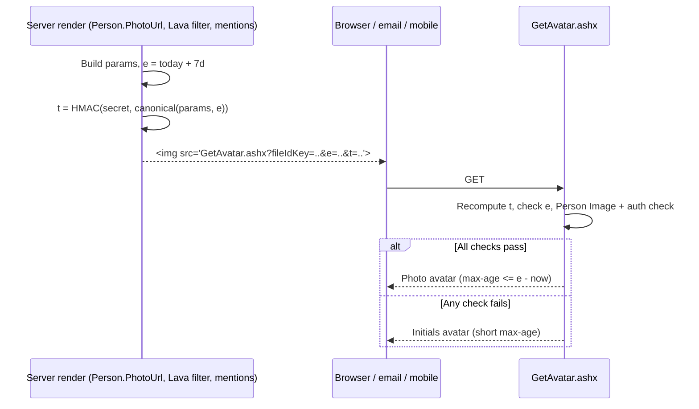

# Signed, Expiring Avatar URLs

## Summary

Today any `GetAvatar.ashx` URL works forever, and anyone can edit one to pull up another person's photo. This spec adds an expiration (`e`) and a server-side HMAC signature (`t`) to every avatar URL Rock creates. The endpoint shows the photo only when the signature matches and the URL hasn't expired. In every other case it returns the initials avatar, so nothing renders as a broken image. A new `PersonAvatarUrl` Lava filter gives templates a supported way to get a signed URL.

## Motivation

There's no security on the Person entity, so avatar URLs are the only thing between a viewer and a person's photo. Right now those URLs can be guessed or edited:

- With "Disable Predictable Ids" off, `PhotoId=N` is a plain integer that can be counted up through every photo ([GetAvatar.ashx.cs:267 before this change](https://github.com/SparkDevNetwork/Rock/blob/aae482d45b5460e6eebb7785a49eeae31b4d54bf/RockWeb/App_Code/GetAvatar.ashx.cs#L267)).
- `PersonGuid`, `PersonId`, `PersonIdKey`, `PersonAliasGuid`, `PersonAliasId` and `PersonAliasIdKey` look up the person on the server and use their `PhotoId` with no check ([GetAvatar.ashx.cs:389-477 before this change](https://github.com/SparkDevNetwork/Rock/blob/aae482d45b5460e6eebb7785a49eeae31b4d54bf/RockWeb/App_Code/GetAvatar.ashx.cs#L389-L477)). `PersonId` and `PersonAliasId` can also be counted up when predictable ids are on.
- The server image cache is keyed only by render settings, and the handler serves from it before any security runs ([GetAvatar.ashx.cs:107 before this change](https://github.com/SparkDevNetwork/Rock/blob/aae482d45b5460e6eebb7785a49eeae31b4d54bf/RockWeb/App_Code/GetAvatar.ashx.cs#L107), [AvatarSettings.cs:133](Rock/Drawing/Avatar/AvatarSettings.cs:133)). Once anyone loads a photo, every later request with the same settings gets the cached copy.
- Responses are cached by browsers and proxies for 7 days (`Cache-Control: public`).

## Requirements

### URL generation

- Every person avatar URL Rock creates MUST include `e` and `t`, including URLs for a person with no photo. Avatar URLs with no person behind them stay unsigned, because they can never show a photo: the text-only `GetAvatar.ashx?text=…` URLs from `SiteList` and `ReminderList`, and the `~/GetAvatar.ashx?Style=Icon` fallback the mention notifications use when the person no longer exists.
- When the person has a photo, the URL MUST identify it with `fileIdKey`. Rock MUST NOT emit `PhotoId`, whatever the "Disable Predictable Ids" setting is.
- `e` MUST be an ISO 8601 date/time (`RockDateTime` local, `"s"` format) set to the start of the current day plus 7 days. Rounding to the day keeps the URL stable all day, so browser and server caches still hit. (A URL therefore stays valid for between 6 and 7 days.)
- All query string values MUST be URL-encoded. `Text` was written raw ([Person.WebForms.cs:164 before this change](https://github.com/SparkDevNetwork/Rock/blob/aae482d45b5460e6eebb7785a49eeae31b4d54bf/Rock/Model/CRM/Person/Person.WebForms.cs#L164)).

### Signature

- `t` MUST be HMAC-SHA256 over a canonical string, keyed by a server-only secret, encoded as base64url without padding.
- The canonical string MUST be built from the parameters in the table below, in that order, as `key=value` pairs joined by `&`. Keys are written lowercase and matched case-insensitively against the query string. Each value is the URL-decoded value as received, then escaped with `Uri.EscapeDataString` so a value containing `&` or `=` can't shift into the next key. A parameter missing from the URL MUST still appear, with an empty value (`fileidkey=`), so the string is deterministic.

| # | Key | Notes |
|---|---|---|
| 1 | `fileidkey` | IdKey of the photo's binary file. Empty when the person has no photo. |
| 2 | `e` | Always last. |

Example canonical string (illustrative only; `Xy7Qa` is a placeholder value):

```
fileidkey=Xy7Qa&e=2026-10-12T00%3A00%3A00
```

- Only the parameters that decide whether a photo is shown are signed. Display parameters (`AgeClassification`, `Gender`, `RecordTypeId`, `Text`, `Style`, the size parameters and their aliases, the colors, `Bold`, `Radius`, `PrefersLight`) stay in the URL unsigned. Rock blocks, shipped mobile templates and custom Lava append them to `PhotoUrl` (see Considered but Rejected), and changing them can only restyle or resize the same photo before it expires, never reveal a different one.
- `t`, `RefreshCache`, `RefreshItemCache`, `PhotoId`, the Person lookup parameters, and anything unknown MUST NOT be part of the signed string.
- The token is signed, not encrypted. Every input is already visible in the URL.

### Endpoint (`GetAvatar.ashx`)

- The handler MUST read `fileIdKey` whatever the "Disable Predictable Ids" setting is. It MUST ignore `PhotoId`.
- The handler MUST allow the photo only when all of these hold:
  1. `fileIdKey` is present and resolves to an id.
  2. `t` matches the recomputed signature (constant-time comparison).
  3. `e` parses, and `RockDateTime.Now` is before it.
  4. The existing Person Image file type and authorization check passes ([RockImage.cs:82](Rock/Drawing/RockImage.cs:82)).
- If any check fails, the handler MUST return the initials (or icon) avatar built from `Text`, colors, age, gender and record type, with no photo. It MUST NOT return an error status for a failed check.
- Being logged in MUST NOT unlock the photo on an unsigned or expired URL.
- **Person lookup parameters MUST never unlock the photo, signed or not.** `PersonGuid`, `PersonId`, `PersonIdKey`, `PersonAliasGuid`, `PersonAliasId` and `PersonAliasIdKey` may still fill in initials, gender, age classification and record type. They MUST NOT set `PhotoId`.
- The server image cache MUST NOT serve a photo to a request that failed the check. The cache key MUST reflect whether the photo was allowed.
- The authorization check MUST run before the cache lookup whenever the Person Image file type has `RequiresViewSecurity` on. Otherwise a photo cached for one authorized viewer would be served to the next viewer.
- Responses that include the photo MUST cap the browser `max-age` at the time left until `e`. Initials-only responses MUST use a `max-age` of 1 hour. A fresh signed URL has a different query string anyway, so this mostly limits how long a URL rejected under a since-changed security setting stays cached. One accepted exception: a validly signed URL whose `fileIdKey` points at a file that isn't a Person Image falls back to initials but keeps the photo's `max-age`, because the file type is only checked when the photo loads, after the headers are set. Rock never signs such a URL, and the file's type doesn't change, so the longer cache is harmless.

### Generators

- `Person.PhotoUrl`, every `GetPersonPhotoUrl` overload, and `GetPersonNoPictureUrl` MUST produce signed URLs. All of them go through `GetPersonPhotoUrl( string initials, int? photoId, ... )` ([Person.WebForms.cs:140](Rock/Model/CRM/Person/Person.WebForms.cs:140)), so that is the one place the change lands.
- `FileUrlHelper.GetAvatarUrl` ([FileUrlHelper.cs:220](Rock/Utility/FileUrlHelper.cs:220)) MUST be fixed to produce signed `fileIdKey` URLs. Today it emits `id=` / `guid=`, which the handler never reads. The `Guid` overload MUST resolve the binary file's id so it can emit `fileIdKey`.
- `GetPersonPhotoUrl` and `FileUrlHelper.GetAvatarUrl` MUST build their query strings through the same signing method, so the parameter list and signing logic live in one place.
- Existing public signatures MUST NOT change. New behavior goes in new overloads if any are needed.
- `NoteMention`, `ConnectionRequestMention` and `SmsConversation` MUST switch from hand-built `PersonAliasIdKey=` / `PersonIdKey=` URLs to the signed generator ([NoteMention.cs:201](Rock/Core/NotificationMessageTypes/NoteMention.cs:201), [ConnectionRequestMention.cs:192](Rock/Core/NotificationMessageTypes/ConnectionRequestMention.cs:192), [SmsConversation.cs:234](Rock/Core/NotificationMessageTypes/SmsConversation.cs:234)).

### Lava filter

- Add a `PersonAvatarUrl` filter in [LavaFilters.Person.cs](Rock/Lava/Filters/LavaFilters.Person.cs). Its input can be a Person, a person Id, IdKey, or Guid. It uses the file's existing `GetPerson` helper for a Person or an integer, and otherwise `PersonService.Get( string )`, which accepts an Id, IdKey, or Guid.
- It takes an optional `size` argument, matching `GetPersonPhotoUrl`. A blank size uses the default.
- It returns a site-relative URL by default. An optional `rootUrl` argument (`true` or `'rootUrl'`, as on the `ImageUrl` filter) prefixes the PublicApplicationRoot global attribute, for emails and other places that need an absolute URL. The default stays relative so the avatar loads from the same host as the page on sites reached through more than one hostname.
- It always returns a loadable URL. Outside a web request, such as a job sending email, `GetPersonPhotoUrl` returns a `~/` virtual path, and the filter resolves it against the application's virtual root.
- It returns an empty string if no person is found.
- The filter MUST be documented (see Open Questions).
- The docs MUST say that the filter doesn't check permissions on the person, the same as `PersonById` and `PersonByGuid`. Any Lava author can get an avatar URL for any person they can name, which `{{ person.PhotoUrl }}` already allows.
- The docs MUST say that the URL still goes through the Endpoint checks on every request the browser doesn't serve from its own cache: a valid signature, an unexpired `e`, and the viewer's authorization when the Person Image file type has `RequiresViewSecurity` on.

## Design



GetAvatar.ashx only ever checks URLs. It never mints them. Signing happens in server-side C# during a page, block, email, or API render, and there's no endpoint that hands out signed URLs. If there were, anyone could ask it to sign a URL for any person.

### Components

- **Signer and validator.** New code in `Rock/Drawing/Avatar/` next to `AvatarHelper`, with a method to build the signed query string and a method to validate an incoming request's parameters. `GetPersonPhotoUrl` and `FileUrlHelper.GetAvatarUrl` both call the builder. The handler lives in `RockWeb/App_Code`, so the validator has to be `public`. Mark it `[RockInternal( "20.1" )]` until the API is settled.
- **Secret.** `t` is HMAC-SHA256 keyed by a sub-key derived from Rock's data encryption key, using the HKDF purpose derivation `Encryption` already provides (`BuildPurposeContext` and `DeriveKeys`, as `RockEncryptionDataProtector` uses) with the purpose `Rock.Avatar.UrlSignature`. The key bytes are private, so add a small `internal` method on `Encryption` that computes the HMAC for a given purpose and input, keeping the key inside that class. The data encryption key is the same on every web farm node, so every node produces and accepts the same tokens.
- **Handler flow.** Parse the settings as today, but have Person parameters stop setting `PhotoId`. Then run the token, expiry, and authorization checks, and set `settings.PhotoId = null` on failure *before* the cache key is computed. Because the cache key already varies by `PhotoId`, a failed request lands on the initials cache entry and can never be handed the photo entry.
- **Mention notifications.** These are notification message type components, not blocks. Their `GetMetadata( message )` returns the `PhotoUrl` that `NotificationMessageList` sends to the frontend, but the stored message only holds a `PersonId` or `PersonAliasId`. Each component loads the person (through `PersonAliasService.GetPerson` for an alias id) and calls the shared `Person.GetPersonPhotoUrl`, so the URL is signed by the same code path as every other avatar. That is one Person lookup per message in the list.
- **500 fallback.** `RockImage.GetPersonImageFromBinaryFileService` throws on a wrong file type or a failed authorization, and `AvatarHelper.CreateAvatar` turned that into `null`, which became a 500 ([AvatarHelper.cs:140-150 before this change](https://github.com/SparkDevNetwork/Rock/blob/aae482d45b5460e6eebb7785a49eeae31b4d54bf/Rock/Drawing/Avatar/AvatarHelper.cs#L140-L150)). The view-security check runs up front, before the cache, but only when the Person Image type has `RequiresViewSecurity` on, so a cached avatar still needs no database query with the default settings. The file type check stays where the photo is loaded. When either fails at load time, `CreateAvatar` falls through to the initials or icon avatar and skips writing it to the cache, so it is never stored under the photo's cache key.

## Open Questions

1. **Where the Lava filter docs go.** `docs/lava/` covers how to write filters, not the filter reference. The plan is to draft the filter documentation from the final code after implementation and add it as a subtask on the Asana task, so whoever owns the Lava filter reference can publish it.

## Fix Risks

- **Stored URLs lose their photos.** Anything that saves a rendered `PhotoUrl` falls back to initials after expiry: sent emails, persisted datasets, saved HTML content, Lava `cache` blocks, mobile app local storage, plugin tables. The ticket accepts this. It should go in the release notes as a Heads Up.
- **Hand-built Lava and SQL URLs** (`GetAvatar.ashx?PhotoId=...`, `?PersonId=...`) switch to initials at once. Same release note.
- **Key rotation.** Changing the data encryption key invalidates every outstanding URL until pages re-render. That's acceptable, but worth documenting.
- **Cache growth.** Each day's `e` value produces new URLs, but the server cache key doesn't include `e`, so server-side PNGs are still shared. Browser caches roll over once a day per avatar.
- **Notification list load.** Loading the person for each mention notification adds one query per message. If load testing shows the notification list is slow, switch to a projection that loads only the columns `GetPersonPhotoUrl` uses (`NickName`, `LastName`, `PhotoId`, `BirthDate`, `Gender`, `RecordTypeValueId`, `AgeClassification`), or batch the lookups for the whole list.
- **Mobile.** Rock Mobile receives `PhotoUrl` in block responses. Anything the app keeps longer than 7 days falls back to initials until it refreshes.

## Verification Steps

1. Render a person with a photo through `Person.PhotoUrl`. The URL has `fileIdKey`, `e`, `t`, and no `PhotoId`, whichever way "Disable Predictable Ids" is set. The photo shows. Render a person with no photo. The URL has `e` and `t`, and the initials show.
2. Change `fileIdKey`, `e`, or `t` on that URL. The response is the initials avatar, with HTTP 200.
3. Reorder the parameters, change key casing, or append display parameters (for example `&Style=icon&BackgroundColor=E4E4E7&Size=64`) on a valid URL. The photo still shows, restyled or resized. The person profile's Bio block appends these on every page view.
4. An expired URL shows initials. This is covered by the unit tests in [AvatarUrlSignatureTests.cs](Rock.Tests/Drawing/AvatarUrlSignatureTests.cs) (`TryValidate_ExpiredUrl_IsInvalid`), since a real expired URL can't be produced on demand. The test signs a past-dated URL itself with `Encryption.ComputePurposeHmacSha256`, so production code has no way to mint a URL with a chosen expiration, and a class-setup check fails every test if that test signer ever drifts from `AvatarUrlSignature.GetSignedQueryString`. The same tests cover the signature cases in steps 2 and 3.
5. Load `?PersonGuid=`, `?PersonIdKey=`, `?PersonAliasIdKey=` and `?PhotoId=` URLs, both signed and unsigned. Every one returns initials, never the photo.
6. Load a valid photo URL, then request the same settings with a bad token. The response is initials, not the cached photo, which confirms the server cache separation.
7. Turn on `RequiresViewSecurity` for the Person Image type. A signed URL shows the photo to an authorized viewer and initials (not a 500) to an unauthorized viewer, including after the authorized viewer has loaded it.
8. Point `fileIdKey` at a non-Person Image binary file, with a valid signature. The response is initials, not a 500.
9. Check the response headers. Photo responses have `max-age` at or below the time left until `e`, and initials responses have the short `max-age`.
10. `FileUrlHelper.GetAvatarUrl` with an int id and with a Guid both return signed `fileIdKey` URLs that show the photo.
11. Note, connection request, and SMS mention notifications show photos in the web and mobile notification lists.
12. `{{ CurrentPerson | PersonAvatarUrl }}`, `{{ 1 | PersonAvatarUrl:64 }}`, an IdKey input and a Guid input all return signed URLs. An unknown person returns an empty string.

## Out of Scope

- `GetImage.ashx` and `GetFile.ashx`.
- An on/off setting for signing. Per the ticket's decision, there isn't one.
- Re-signing URLs already stored in emails, datasets, or content.

## Considered but Rejected

### Fall back to the logged-in user's permissions on unsigned URLs
Rejected by the ticket. There's no security on Person, so there's nothing meaningful to check, and a fallback would leave the guessing problem in place for anyone who is logged in.

### Sign the Person lookup parameters instead of disabling them
Rejected. Letting Person parameters unlock the photo keeps a second way to reach it that has to be signed and audited separately. Restricting the photo to `fileIdKey` plus a token leaves one way in.

### Sign the raw query string
Rejected. Parameter order and key casing would break signatures. Signing a canonical string makes order and casing irrelevant.

### Use `Encryption.EncryptString` for the token
Rejected. `EncryptString` uses a random IV, so the same avatar gets a different `t` on every render. Browsers would treat each render as a new image and download it again, which defeats the day rounding. The token would also be a few hundred characters long. Validation would have to decrypt `t` and compare, rather than recompute it. The ticket only asks for signing, not encryption.

### Use a new system-setting salt (like `LocationObfuscator`)
Viable, but rejected in favor of deriving from the data encryption key. That key already exists on every install and every farm node, needs no first-use write, and is already managed as a secret.

### Sign every parameter that changes the image
Rejected after testing. The ticket lists every image parameter (and the size aliases change the image too), but Rock already appends display parameters to `PhotoUrl` in many places: the person profile's Bio, BioSummary, GroupMemberNavigation and GroupMembers blocks and the WebForms EditGroup block append `&Style=icon&BackgroundColor=E4E4E7&ForegroundColor=A1A1AA`, and shipped mobile templates (hotfix migrations 123, 125, and 133) append `&width=`. With every parameter signed, each of those lost the photo. The code callers could be changed to sign their own URLs, but templates stored in each Rock database and custom Lava can't be. Signing only `fileIdKey` and `e` keeps the goal, since only those decide whose photo is shown and for how long, and leaves restyling and resizing the same photo, which exposes nothing new.

### Exact 7-day expiration from the moment of creation
Rejected. Every render would produce a unique URL, which defeats browser caching and the stable-URL behavior the ticket asks for.

## Related

- [Asana: Signed, Expiring Avatar URLs (DEV-16096)](https://app.asana.com/1/20866866924293/project/1208321217019996/task/1219002511472476). This is the source of the requirements, read 2026-10-05, and every requirement and decision in it is carried into this spec. The ticket doesn't spell out every case, so this spec covers these too:
  - Person lookup parameters never unlock the photo. This follows from the ticket's goal that a photo can only be loaded through a URL Rock created.
  - Only `fileIdKey` and `e` are signed, not every image parameter the ticket lists, because Rock code and stored templates append display parameters to `PhotoUrl`. This departs from the ticket; Kyle Henning (dev lead) signed off on it on 2026-10-06 (see Considered but Rejected).
  - The handler ignores `PhotoId`, which follows from "token only".
  - The mention notifications switch to signed URLs, so they don't fall back to initials.
  - `FileUrlHelper.GetAvatarUrl` is fixed and signed through the same builder as `GetPersonPhotoUrl`.
  - A failed Person Image security check returns initials instead of a 500, per "nothing breaks visually".
  - The authorization check runs before the server cache lookup when the Person Image type requires view security.
  - Photo responses cap the browser `max-age` at the time left until `e`.
  - Details on building the signed string: a fixed ordered parameter table, empty values for missing parameters, URL-encoded values, base64url output, and constant-time comparison.
- `cf89a7412f`: limits `RockImage.GetPersonImageFromBinaryFileService` to the Person Image file type (the ticket's "dependency to confirm"; confirmed present).
- `de7dfafcfc`: GetAvatar respects Disable Predictable Ids for the Person parameters and adds `PersonIdKey` / `PersonAliasIdKey`.
