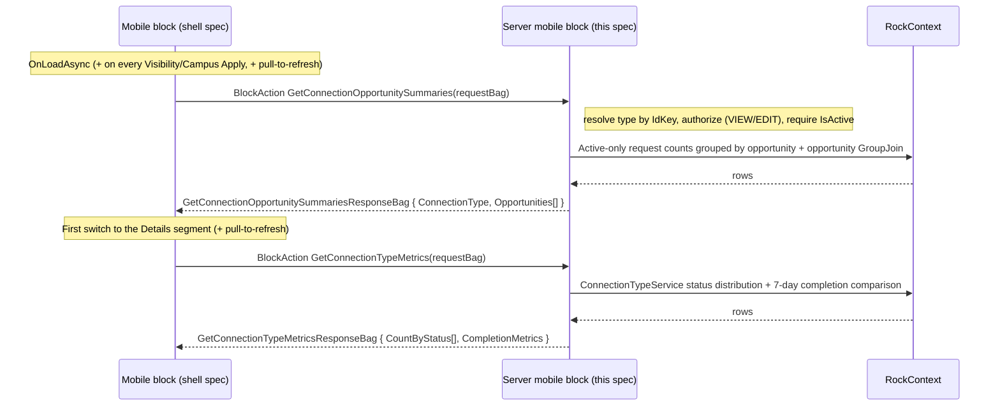

# Connection Type Detail / Opportunities (Mobile) Backend

## Summary

This is the backend half of the new mobile **Connection Type Detail** block, the second block in the Connections revamp port (after the [Connection Type List](260608-mobile-connection-type-list.md)). The block is a single native block that hosts a segment picker with two segments — **Opportunities** and **Details** — and this spec covers both. It covers only the server-side code in the Develop repo: a new mobile `RockBlockType` that returns (a) for **Opportunities**, the connection-type header plus per-opportunity request summaries via a count query duplicated from the web `Connection Opportunity Navigation` block, and (b) for **Details**, the type Description, the Count-By-Status distribution, and the 7-day Completion Metrics, reused directly from `ConnectionTypeService` (the same service the web `Connection Operational Snapshot` block calls); plus security, configuration delivery, and GUID registration. The mobile shell (segment picker, title, views, view model, bindings, search, cover sheet, metric cards, navigation) is specified separately in [the mobile shell spec](../../RM/specs/260608-mobile-connection-type-detail-shell.md) in the RM repo. The two halves share one `BlockTypeGuid`.

## Motivation

- Core revamped Connections on the web with a `Connection Type Navigation` block (per-type counts) followed by a `Connection Opportunity Navigation` block (per-opportunity counts for one type, plus metrics). Mobile is porting that workflow. The [Connection Type List](260608-mobile-connection-type-list.md) ported the first step; this block ports the second — the screen a connector lands on after tapping a connection type, showing that type's opportunities with the same five count badges.
- The current mobile server block ([ConnectionOpportunityList.cs](../Rock/Blocks/Types/Mobile/Connection/ConnectionOpportunityList.cs), GUID `0015A574-...`) renders a Lava template into XAML strings, supports only a single `OnlyMyConnections` toggle, and computes a narrow set of counts. It cannot supply the new five-count, filterable, natively-rendered data.
- Backward compatibility is a hard rule, so the new server block ships alongside the old one rather than replacing it.

## Scope

- In scope:
  - **Opportunities segment:** the per-opportunity count query, the connection-type header (name + icon + description) used for the title and the Details Description card, configuration, security, SystemGuid registration, and the contract returned.
  - **Details segment:** a block action returning the type-level Count-By-Status distribution and the 7-day Completion Metrics (Timeliness, Responsiveness, Completed, Avg Completion, each with a delta vs the prior 7 days), reused directly from `ConnectionTypeService`.
- Out of scope (this spec):
  - All mobile UI, which lives in the shell spec.
  - The web `Connection Operational Snapshot` pieces the Details mockup does **not** show: the connectors leaderboard grid, the request "health" totals (`GetConnectionRequestHealthSnapshot` — Active/Unassigned/DueSoon/Overdue/OnTrack), and the upcoming-follow-up timeline (`GetConnectionRequestUpcomingFollowUpWindows`). The service methods exist if a later iteration wants them.
  - The web date-range **picker**. The web offers Last 7 / Last 28 Days (default 7); mobile fixes the comparison at the last 7 days with no picker (per product direction). The service already takes a date range, so a picker is a shell-only addition later.
  - The 28-day `RequestCountsPerDay` sparkline and aggregate totals from `ConnectionOpportunityNavigationDetailsBag` — the Details mockup uses the Operational Snapshot status distribution + completion metrics instead, not that series.
  - Opportunity follow/favorite (`IsFollowed`). The web tracks it; the Opportunities mockup shows no follow affordance, so it is deferred (see Considered but Rejected).
  - Later blocks in this feature: request list/board, request detail, add-request.

## Requirements

### Functional (server) — Opportunities segment

- The block MUST resolve the target `ConnectionType` from the `ConnectionTypeIdKey` carried on the request bag (the shell passes the `ConnectionType` page parameter it was launched with). Resolve via `ConnectionTypeCache.Get( idKey, !PageCache... )`-style id-key lookup, mirroring the web.
- The block MUST authorize using Entity-based security on the connection type (`VIEW` or `EDIT`), mirroring the web block's `GetIsAuthorizedToView`. If unauthorized, return `ActionUnauthorized`. This is the type-level gate only; opportunities within an authorized type ARE additionally security-filtered per opportunity (see next bullet).
- The block MUST security-filter the opportunity set per opportunity via `GetViewAuthorizedConnectionOpportunityIds`, mirroring the web Connection Request Board and hub (`ConnectionsHub.GetViewAuthorizedConnectionOpportunityIds`). An opportunity is viewable when the current person has native `VIEW` authorization on it, or (only when the type has `EnableRequestSecurity`) when the person is the assigned connector on at least one request in that opportunity. Because `IsAuthorized` cannot be translated to SQL, the active opportunities are materialized for the check, and the resulting authorized id set is applied to the opportunity query as `authorizedOpportunityIds.Contains( co.Id )`. Unauthorized opportunities are dropped from the `GroupJoin`, so their request counts never surface.
- The block MUST treat a missing type as `ActionBadRequest`, and a non-active type (`!IsActive`) as `ActionBadRequest`, mirroring the web's three early-return checks.
- For each **active** opportunity in the (active) type, the block MUST compute five counts over `ConnectionState.Active` requests only:

  | Count property | Meaning |
  |---|---|
  | `AssignedToYouRequestCount` | Active requests in this opportunity where the current person is the connector |
  | `UnassignedRequestCount` | Active requests in this opportunity with no connector |
  | `ActiveRequestCount` | All active requests in this opportunity |
  | `DueSoonRequestCount` | Active requests due soon (not yet overdue) |
  | `OverdueRequestCount` | Active requests past their due date |

- Counts MUST reuse the web `ConnectionOpportunityNavigation.LoadConnectionOpportunitySummaries` logic (duplicated; see Considered but Rejected). Due-soon and overdue MUST use `DbFunctions.TruncateTime(...)` comparisons against `RockDateTime.Today`, identical to the web.
- The opportunity set MUST be filterable by visibility (all opportunities vs only those with a request assigned to the current person) and by campus (`cr.CampusId`).
- Under **My Opportunities**, web parity means: the request set is limited to the current person's requests, so `UnassignedRequestCount` is always 0 and `ActiveRequestCount` equals `AssignedToYouRequestCount`; and the opportunity set is reduced to opportunities having at least one such request. This is intended (the shell's Unassigned badge simply shows 0 under My Opportunities; see shell spec).
- Opportunities with zero matching requests MUST still appear under **All Opportunities** (the web uses a `GroupJoin` + `DefaultIfEmpty` against `ConnectionOpportunityService` for exactly this).
- The block MUST return opportunities in a stable default order (`Order` then `Name`, matching the web). Sorting is alphabetical (A-Z / Z-A) and handled client-side in the shell, so the server takes no sort parameter (decision confirmed; see Considered but Rejected — Server-side sort).
- The block MUST return a connection-type header summary (`Name`, `IconCssClass`, `Description`) so the shell can render the title shown in the mockup ("Connection Type Name") and the Details segment's Description card. `Description` is the connection type's `Description` field (returned on the Opportunities load so Details needs no extra round trip for it).
- The block MUST strip HTML from each opportunity `Summary` (`.StripHtml()`), matching the web.
- The block MUST deliver static configuration via `GetMobileConfigurationValues()`: the campus filter list (built from `CampusCache.All()`, active campuses only, ordered, mapped to `ListItemViewModel`; never a direct `Campus` table query) and the detail page. Building the campus list from `CampusCache.All()` follows the existing mobile-block pattern and matches the [Connection Type List backend](260608-mobile-connection-type-list.md).
- The block MUST expose a `GetConnectionOpportunitySummaries` block action that takes the current filter (type id-key, visibility, campus) and returns the header + summaries.

### Functional (server) — Details segment

- The block MUST expose a `GetConnectionTypeMetrics` block action that, for the same `ConnectionType` (resolved and authorized exactly as above — type-level `VIEW`/`EDIT`, must be active), returns the type-level **Count By Status** distribution and the **Completion Metrics** for the last 7 days.
- The block MUST NOT duplicate this logic. The metrics already live in `ConnectionTypeService` (in the `Rock` project), and the mobile server block lives in the `Rock.Blocks` project, which `Rock.dll` grants `InternalsVisibleTo( "Rock.Blocks" )` (`Rock/Properties/AssemblyInfo.cs`), so it MUST call the existing `internal` service methods directly:
  - **Count By Status** → `GetConnectionRequestStatusDistributions( connectionTypeQuery, options )` — active requests grouped by `ConnectionStatus`, returning `{ Status, Color (the status `HighlightColor`), Count }`, ordered by status `Order` then `Name`.
  - **Completion Metrics** → `GetConnectionRequestCompletionMetricsComparison( connectionTypeQuery, RockDateTime.Today.AddDays( -7 ), RockDateTime.Today, options )`, taking `.FirstOrDefault()` for the single type. It returns current-period values plus deltas vs the immediately preceding 7-day period (the service derives the previous window itself).
- `connectionTypeQuery` MUST be a single-type queryable (e.g. `new ConnectionTypeService( rockContext ).Queryable().Where( ct => ct.Id == connectionType.Id )`), mirroring how the web snapshot passes `GetQueryableByKey(...)`.
- Completion Metrics meanings (carried through verbatim; the shell only formats them):
  - **Timeliness** — `TimelinessPercent`: of requests completed (Connected) in the period, the fraction completed on or before their due date (a request with no due date counts as on-time). **This is a 0–1 ratio, not 0–100**; the shell multiplies by 100 for display. `TimelinessPercentDelta` is the ratio difference vs the prior period.
  - **Responsiveness** — `AverageResponsivenessDays`: average days from request creation to first logged activity. Lower is better.
  - **Completed** — `RequestsCompletedCount`: count of requests Connected in the period.
  - **Avg Completion** — `AverageCompletionDays`: average days from creation to connection. Lower is better.
  - Each carries a `…Delta` (current − previous). The shell renders an up/down arrow and color from the sign (see shell spec).
- If the comparison query returns no row (no requests modified in the period), the block MUST return zeroed Completion Metrics rather than null.
- The Details metrics ARE campus-scoped for v1: the `GetConnectionTypeMetricsRequestBag` carries a `CampusGuid?` (mirroring the campus filter applied to the opportunity summaries), and the block passes `CampusGuid = options.CampusGuid` into both service option objects so the Details metrics reflect the same campus scope. No opportunity or connector scoping is applied (the Details mockup has no such filter). The service `Options` also accept a `ConnectionOpportunityGuid` if opportunity scoping is added later.

### Non-functional / conventions (server)

- A single new `BlockTypeGuid` MUST be embedded identically as a string literal in both repos (shared with the mobile block defined in the shell spec).
- Server block: `RockBlockType`, `[SupportedSiteTypes( Model.SiteType.Mobile )]`, under `Develop/Rock.Blocks/Mobile/Connection/` (namespace `Rock.Blocks.Mobile.Connection`; new blocks go in the `Rock.Blocks` project, following `Rock.Blocks/Mobile/CheckIn/CheckIn.cs`), with new `EntityTypeGuid` and `BlockTypeGuid` SystemGuid constants.
- The block declares `RequiredMobileVersion => new Version( 1, 20 )` (mobile shell v20, following the `Version( 1, N )` convention used by existing blocks). The feature ships in Rock core v20.
- Leave the existing server mobile block (`0015A574-...`) intact.
- Follow [Develop/CLAUDE.md](../CLAUDE.md): `RockContext` lifetime, `RockDateTime`, no `System.Web` in shared code. Attributes declared per [Develop/.claude/rules/block-architecture.md](../.claude/rules/block-architecture.md) (vertical `FieldAttribute` by property, keys in a nested `AttributeKey` class).

## Design

### Server block identity and placement

| Piece | Path | Notes |
|---|---|---|
| New server block | `Develop/Rock.Blocks/Mobile/Connection/ConnectionOpportunityListV2.cs` | Class `ConnectionOpportunityListV2`, `[DisplayName("Connection Opportunity List V2")]`, `EntityTypeGuid` `8DD07282-8470-426C-8F89-7390599DB37F` + `BlockTypeGuid` `039AB104-FDFE-4BB0-944A-2C02F4C1D73A`. |
| Old server block | `Develop/Rock/Blocks/Types/Mobile/Connection/ConnectionOpportunityList.cs` (`0015A574-...`) | Untouched. |

The block class is **`ConnectionOpportunityListV2`** (decided 2026-06-12) and the user-facing `DisplayName` is "Connection Opportunity List V2", matching the block 1 precedent (`ConnectionTypeListV2`, shipped with `[DisplayName( "Connection Type List V2" )]`). The name marks the block as the native successor of the old Lava `ConnectionOpportunityList`: the server namespace is `Rock.Blocks.Mobile.Connection` (new project location, decided 2026-06-10), where no legacy class name collides, but the shell's `Rock.Mobile.Blocks.Connection` namespace still holds the old block classes, so the plain name is unavailable there and the server matches the shell name for consistency. The V2 display name also keeps the new block distinguishable from the old "Connection Opportunity List" in the Mobile > Connection category. "Connection Type Detail" remains this spec's working title for the screen, and is separate from the web block (named `ConnectionOpportunityNavigation`) whose count logic we copy. The same `BlockTypeGuid` literal is shared with the mobile block (see shell spec).

### Block settings (attributes)

For v1 the block exposes a single setting. Declared per [block-architecture.md](../.claude/rules/block-architecture.md): the `LinkedPage` assigned vertically by property, with the key in a nested `AttributeKey` static class.

| Setting | Field type | Key | Default | Purpose |
|---|---|---|---|---|
| Detail Page | `LinkedPage` | `DetailPage` | none | Page opened when an opportunity is tapped; the opportunity's `IdKey` is passed as the `ConnectionOpportunity` page parameter to the (future) mobile Connection Request List block. Same pattern as the Connection Type List block's Detail Page. |

Everything else is fixed in code for v1 rather than configurable: all active opportunities of the (authorized, active) type are shown; the campus list is all active campuses from `CampusCache.All()`; visibility defaults to My Opportunities (web parity), then the person's saved choice applies; the Sort By row is always shown and is alphabetical-only (client-side). There is no `HeaderTemplate` or per-row Lava template, because the new block renders natively. The web block's `ConnectionsHubPage` / `OperationalSnapshotPage` / `MyConnectionsPage` linked pages are **not** ported for v1 (mobile has no board/grid/snapshot/hub destinations yet); only Detail Page is needed. Any of these can graduate to a block setting later.

### Data flow



Static configuration (campus list and detail page) is delivered through `GetMobileConfigurationValues()`. The Opportunities summaries (and header) come from the `GetConnectionOpportunitySummaries` block action, which takes the type id-key, visibility, and campus, so changing visibility or campus re-invokes it. Search and alphabetical sort are applied client-side over the already-loaded list and do not hit the server (the request contract carries no search term or sort field). This matches the [Connection Type List](260608-mobile-connection-type-list.md) (config static, data per-action). The Details segment's Count-By-Status + Completion Metrics are loaded lazily by a separate `GetConnectionTypeMetrics` action on the first switch to Details (cached for the session, re-fetched on pull-to-refresh), so users who never open Details never pay for the metric queries; the type `Description` shown on Details rides along on the Opportunities header, so no extra call is needed for it.

### Counts query (duplicated from web)

A copy of `ConnectionOpportunityNavigation.LoadConnectionOpportunitySummaries` ([source](../Rock.Blocks/Connection/ConnectionOpportunityNavigation.cs)), adapted so that **campus** and **visibility** come from the mobile request bag (the web reads campus from a `ContextAware` context entity and visibility from a person preference), and so that the opportunity set is **security-filtered per opportunity** via `GetViewAuthorizedConnectionOpportunityIds` (native `VIEW`, plus the self-assigned connector fallback when the type has `EnableRequestSecurity`), matching the web Connection Request Board and hub. The follow (`FollowingService`) lookup and the merge-field comment are dropped (follow is deferred, see Scope); the `.StripHtml()` on `Summary` is kept.

```csharp
var connectionTypeId = connectionType.Id;
var personId = currentPerson?.Id ?? 0;
var today = RockDateTime.Today;
var limitToMyOpportunities = request.Visibility == ConnectionOpportunityVisibility.MyOpportunities;

// Active requests in this (active) type's (active) opportunities, optionally scoped to a campus.
var connectionRequestQry = new ConnectionRequestService( rockContext )
    .Queryable()
    .Where( cr =>
        cr.ConnectionState == ConnectionState.Active
        && ( !campusId.HasValue || cr.CampusId == campusId.Value )
        && cr.ConnectionOpportunity.ConnectionTypeId == connectionTypeId
        && cr.ConnectionOpportunity.ConnectionType.IsActive
        && cr.ConnectionOpportunity.IsActive
    );

// Security-filter the opportunity set to those the current person may view: native VIEW
// authorization, plus the self-assigned connector fallback only when the type has Request
// Security enabled. Unauthorized opportunities are dropped from the GroupJoin below.
var authorizedOpportunityIds = GetViewAuthorizedConnectionOpportunityIds( rockContext, connectionType );

// Active opportunities in this (active) type that the person may view.
var connectionOpportunityQry = new ConnectionOpportunityService( rockContext )
    .Queryable()
    .Where( co =>
        co.ConnectionTypeId == connectionTypeId
        && co.ConnectionType.IsActive
        && co.IsActive
        && authorizedOpportunityIds.Contains( co.Id )
    );

if ( limitToMyOpportunities )
{
    connectionRequestQry = connectionRequestQry
        .Where( cr =>
            cr.ConnectorPersonAliasId.HasValue
            && cr.ConnectorPersonAlias.PersonId == personId
        );

    // Reduce the opportunity set to those having at least one of my requests.
    connectionOpportunityQry = connectionOpportunityQry
        .Where( co => connectionRequestQry.Any( cr => cr.ConnectionOpportunityId == co.Id ) );
}

var requestCountsQry = connectionRequestQry
    .GroupBy( cr => cr.ConnectionOpportunityId )
    .Select( g => new
    {
        ConnectionOpportunityId = g.Key,
        ActiveRequestCount = g.Count(), // All active because of the filter above.
        DueSoonRequestCount = g.Count( r =>
            r.DueSoonDate.HasValue
            && DbFunctions.TruncateTime( r.DueSoonDate.Value ) <= today
            && !( r.DueDate.HasValue && DbFunctions.TruncateTime( r.DueDate.Value ) < today ) ),
        OverdueRequestCount = g.Count( r =>
            r.DueDate.HasValue && DbFunctions.TruncateTime( r.DueDate.Value ) < today ),
        UnassignedRequestCount = g.Count( r => !r.ConnectorPersonAliasId.HasValue ),
        AssignedToYouRequestCount = g.Count( r =>
            r.ConnectorPersonAliasId.HasValue && r.ConnectorPersonAlias.PersonId == personId )
    } );

// GroupJoin so opportunities with zero matching requests still appear (under All Opportunities).
// Project to an anonymous type first (carrying Id), order, then map to the contract bag.
var summaries = connectionOpportunityQry
    .GroupJoin(
        requestCountsQry,
        co => co.Id,
        counts => counts.ConnectionOpportunityId,
        ( co, counts ) => new { ConnectionOpportunity = co, RequestCounts = counts } )
    .SelectMany(
        x => x.RequestCounts.DefaultIfEmpty(),
        ( x, counts ) => new
        {
            x.ConnectionOpportunity.Id,
            x.ConnectionOpportunity.IconCssClass,
            x.ConnectionOpportunity.Name,
            x.ConnectionOpportunity.Summary,
            x.ConnectionOpportunity.Order,
            ActiveRequestCount = counts == null ? 0 : counts.ActiveRequestCount,
            DueSoonRequestCount = counts == null ? 0 : counts.DueSoonRequestCount,
            OverdueRequestCount = counts == null ? 0 : counts.OverdueRequestCount,
            UnassignedRequestCount = counts == null ? 0 : counts.UnassignedRequestCount,
            AssignedToYouRequestCount = counts == null ? 0 : counts.AssignedToYouRequestCount
        } )
    .OrderBy( s => s.Order )
    .ThenBy( s => s.Name )
    .ToList();

// Map to the contract bag. The bag has no Id property, only IdKey (derived from the Id via
// IdHasher for navigation); Summary is stripped of HTML. The shell passes IdKey as the
// ConnectionOpportunity page parameter on tap.
return summaries
    .Select( s => new ConnectionOpportunitySummaryBag
    {
        IdKey = IdHasher.Instance.GetHash( s.Id ),
        IconCssClass = s.IconCssClass,
        Name = s.Name,
        Summary = s.Summary.StripHtml(),
        Order = s.Order,
        ActiveRequestCount = s.ActiveRequestCount,
        DueSoonRequestCount = s.DueSoonRequestCount,
        OverdueRequestCount = s.OverdueRequestCount,
        UnassignedRequestCount = s.UnassignedRequestCount,
        AssignedToYouRequestCount = s.AssignedToYouRequestCount
    } )
    .ToList();
```

**Order.** The server returns opportunities ordered by `Order` then `Name`, identical to the web. The shell re-sorts alphabetically (A-Z or Z-A) client-side, so the server takes no sort parameter.

### Details segment (metrics)

Unlike the Opportunities count query (block-private in the web `ConnectionOpportunityNavigation`, so it must be duplicated), the Details metrics already live in shared `ConnectionTypeService` methods in the **`Rock`** project. The mobile server block lives in the `Rock.Blocks` project and calls them directly: the methods are `internal`, and `Rock.dll` grants `InternalsVisibleTo( "Rock.Blocks" )` (`Rock/Properties/AssemblyInfo.cs`), which is exactly how the web `Connection Operational Snapshot` block ([ConnectionOperationalSnapshot.cs](../Rock.Blocks/Engagement/ConnectionOperationalSnapshot.cs)) reaches the same service from the same project. No duplication needed.

```csharp
var connectionTypeService = new ConnectionTypeService( rockContext );
var connectionTypeQuery = connectionTypeService
    .Queryable()
    .Where( ct => ct.Id == connectionType.Id );

// Count By Status: active requests grouped by ConnectionStatus, scoped to the requested campus.
var countByStatus = connectionTypeService
    .GetConnectionRequestStatusDistributions(
        connectionTypeQuery,
        new ConnectionRequestStatusDistributionQueryOptions
        {
            CampusGuid = options.CampusGuid
        } )
    .Select( sd => new ConnectionRequestStatusCountBag
    {
        Status = sd.Status,
        Color = sd.Color,   // the ConnectionStatus HighlightColor — the colored dot in the mockup.
        Count = sd.Count
    } )
    .ToList();

// Completion Metrics: current 7 days vs the prior 7 days (the service derives the prior window),
// scoped to the requested campus.
var completionMetrics = connectionTypeService
    .GetConnectionRequestCompletionMetricsComparison(
        connectionTypeQuery,
        RockDateTime.Today.AddDays( -7 ),
        RockDateTime.Today,
        new ConnectionRequestCompletionMetricsQueryOptions
        {
            CampusGuid = options.CampusGuid
        } )
    .Select( c => new ConnectionCompletionMetricsBag
    {
        TimelinessPercent = c.Current.TimelinessPercent,                       // 0–1 ratio.
        TimelinessPercentDelta = c.TimelinessPercentDelta,
        AverageResponsivenessDays = c.Current.AverageResponsivenessDays,
        AverageResponsivenessDaysDelta = c.AverageResponsivenessDaysDelta,
        RequestsCompletedCount = c.Current.RequestsCompletedCount,
        RequestsCompletedCountDelta = c.RequestsCompletedCountDelta,
        AverageCompletionDays = c.Current.AverageCompletionDays,
        AverageCompletionDaysDelta = c.AverageCompletionDaysDelta
    } )
    .FirstOrDefault() ?? new ConnectionCompletionMetricsBag(); // zeroed when no activity in the period.
```

The `Description` shown on the Details segment comes from the connection type (`connectionType.Description`) and is returned on the Opportunities header, so `GetConnectionTypeMetrics` returns only `CountByStatus` + `CompletionMetrics`.

### Contract returned

The bags and enums live in `Rock.Common.Mobile` (RM repo) and are defined in full in the [shell spec](../../RM/specs/260608-mobile-connection-type-detail-shell.md). The server references the built `Rock.Common.Mobile.dll` in `RockWeb/Bin`. Property names MUST match the mobile definitions exactly. What the server populates:

- `GetConnectionOpportunitySummariesRequestBag` { `ConnectionTypeIdKey`, `Visibility` (`ConnectionOpportunityVisibility`), `CampusGuid?` }.
- `GetConnectionOpportunitySummariesResponseBag` { `ConnectionTypeHeaderBag ConnectionType`, `List<ConnectionOpportunitySummaryBag> Opportunities` }.
- `ConnectionTypeHeaderBag` { `Name`, `IconCssClass`, `Description` } — the title, leading icon, and the Details Description card text. (Mirrors the web's `ConnectionOpportunityNavigation.ConnectionTypeSummaryBag` plus the type's `Description`; `EnabledViews` is unused for v1.)
- `ConnectionOpportunitySummaryBag` { `IdKey`, `IconCssClass`, `Name`, `Summary`, `Order`, the five counts }. The bag has no `Id` property. The server sets `IdKey` (via `IdHasher.Instance.GetHash( id )`); the shell passes it as the `ConnectionOpportunity` page parameter on tap.
- `Configuration` (returned from `GetMobileConfigurationValues`) { `Campuses` (active campuses from `CampusCache.All()` as `ListItemViewModel`, Value = Guid, Text = Name), `Guid? DetailPageGuid` }.

Details segment:

- `GetConnectionTypeMetricsRequestBag` { `ConnectionTypeIdKey`, `CampusGuid?` }. The `CampusGuid` mirrors the campus filter applied to the opportunity summaries so the Details metrics reflect the same scope.
- `GetConnectionTypeMetricsResponseBag` { `List<ConnectionRequestStatusCountBag> CountByStatus`, `ConnectionCompletionMetricsBag CompletionMetrics` }.
- `ConnectionRequestStatusCountBag` { `Status`, `Color`, `Count` } — mirrors the web's `ConnectionOperationalSnapshot.RequestStatusCountBag`. `Color` is the `ConnectionStatus` HighlightColor (the dot in the mockup).
- `ConnectionCompletionMetricsBag` — mirrors the web's `ConnectionOperationalSnapshot.CompletionMetricsBag` exactly (same property names and types): `TimelinessPercent`, `TimelinessPercentDelta`, `AverageResponsivenessDays`, `AverageResponsivenessDaysDelta`, `RequestsCompletedCount`, `RequestsCompletedCountDelta`, `AverageCompletionDays`, `AverageCompletionDaysDelta`. `TimelinessPercent` and its delta are 0–1 ratios.

The campus filter is sent to the server as a `Guid?` but resolved to a `CampusId` before the LINQ `.Where()` (avoid `Guid` in `.Where()` when an `Id` from a cached item is available — [Develop/CLAUDE.md](../CLAUDE.md)).

## Open Questions (backend)

None outstanding for v1. (The prior campus-scope question is now resolved, see below.)

**Resolved 2026-06-12:**
- **Campus scope on the Details segment.** The Details metrics follow the campus filter rather than staying type-wide: `GetConnectionTypeMetricsRequestBag` carries a `CampusGuid?`, and the block passes `CampusGuid = options.CampusGuid` into both the `ConnectionRequestStatusDistributionQueryOptions` and the `ConnectionRequestCompletionMetricsQueryOptions`, so the Count By Status distribution and the Completion Metrics reflect the same campus scope as the opportunity summaries. Opportunity and connector scoping are still not applied.

- **Block class / namespace name:** `ConnectionOpportunityListV2` (server file `Develop/Rock.Blocks/Mobile/Connection/ConnectionOpportunityListV2.cs`, namespace `Rock.Blocks.Mobile.Connection`), with `[DisplayName( "Connection Opportunity List V2" )]`. Named as the successor of the old Lava `ConnectionOpportunityList` block with the V2 suffix, following block 1 (`ConnectionTypeListV2`); `ConnectionTypeDetail` and `ConnectionOpportunityNavigation` were passed over, and the old block keeps its name and GUID.

**Resolved 2026-06-08:**
- Authorization has two layers. The type-level gate is `VIEW`/`EDIT` on the connection type (mirroring the web). Within an authorized, active type the opportunities are **also security-filtered per opportunity** via `GetViewAuthorizedConnectionOpportunityIds`: an opportunity is viewable when the person has native `VIEW` authorization on it, or (only when the type has `EnableRequestSecurity`) when the person is the assigned connector on at least one request in that opportunity. This mirrors the web Connection Request Board and hub (`ConnectionsHub.GetViewAuthorizedConnectionOpportunityIds`). Unauthorized opportunities are dropped, so their request counts never surface.
- The Detail Page passes the opportunity's **`IdKey`** (not Guid) as the `ConnectionOpportunity` page parameter — web parity and consistent with the Type List block's `ConnectionType` IdKey. The receiving request-list block resolves it via `ConnectionOpportunityCache.Get( key, !PageCache.Layout.Site.DisablePredictableIds )` (the same overload transparently accepts a Guid or Id, so it stays robust). The old Lava request-list block's `ConnectionOpportunityGuid` param is left untouched for back-compat.

## Considered but Rejected (backend)

### Revamp the existing server block in place
Rejected (product decision). Changing its contract would break existing Lava customizations and any deployment using it. A new block preserves backward compatibility, matching how the web shipped a new Obsidian block (`ConnectionOpportunityNavigation`) rather than editing the legacy one, and matching the [Connection Type List](260608-mobile-connection-type-list.md) decision.

### Extract a shared service for the counts
Rejected for now (product decision). The count query is duplicated into the mobile block instead of being lifted into a shared service that both the web and mobile blocks call. This avoids a refactor of the shipping web block, at the cost of two copies that can drift. A future cleanup could unify the type-level and opportunity-level count queries in a `ConnectionTypeClientService` / `ConnectionOpportunityClientService`.

### Server-side search, sort, and paging of opportunities
Rejected. A connection type's opportunity list is small and loaded in full, so name search and alphabetical sort are client-side (in the shell) and no paging is needed. Only visibility and campus, which change which requests are counted, go to the server. **Note on the mockup:** the Filter & Sort mockup shows "Sort By: Last Activity (Newest First)" (a request-level sort from `ConnectionRequestViewModelSortProperty`). Sorting *opportunities* by last activity would require net-new server aggregation (a per-opportunity max-activity date) that neither the web opportunity block nor the Connection Type List computes. To stay consistent with the Type List and the "duplicate the web as-is, no net-new logic" rule, the opportunity sort is **alphabetical, client-side** (decision confirmed with Panha 2026-06-08); the mockup's Last Activity option is not implemented for v1.

### Show follow/favorite, the request "health" totals, and the 28-day series
Rejected for v1. The web's `IsFollowed` (follow/favorite), the aggregate `Total*RequestsCount` health totals, and the 28-day `RequestCountsPerDay` series are not in either mockup. The Details mockup shows the Count-By-Status distribution and Completion Metrics instead. Follow is deferred until a follow affordance is designed for mobile; the health totals and daily series can be added later without a contract change.

### Duplicate the Details metrics query into the mobile block
Rejected. Unlike the Opportunities count query (block-private in `Rock.Blocks`, hence duplicated), the Details metrics are already shared `ConnectionTypeService` methods in the `Rock` project that the mobile block calls directly. Duplicating them would be redundant and would risk drift from the web snapshot.

### Port the date-range picker (Last 7 / Last 28 Days)
Rejected for v1 (product direction). The web Operational Snapshot offers a 7/28-day picker (default 7); mobile shows only the last-7-days comparison with no picker. The service already accepts a date range, so a picker (and the 28-day option) is a shell-only addition later.

## Related

- Web block (count logic source of truth): [Develop/Rock.Blocks/Connection/ConnectionOpportunityNavigation.cs](../Rock.Blocks/Connection/ConnectionOpportunityNavigation.cs)
- Web opportunity summary bag: [Develop/Rock.ViewModels/Blocks/Connection/ConnectionOpportunityNavigation/ConnectionOpportunitySummaryBag.cs](../Rock.ViewModels/Blocks/Connection/ConnectionOpportunityNavigation/ConnectionOpportunitySummaryBag.cs)
- Details metrics — service (source of truth): [Develop/Rock/Model/Connection/ConnectionType/ConnectionTypeService.cs](../Rock/Model/Connection/ConnectionType/ConnectionTypeService.cs) — `GetConnectionRequestStatusDistributions`, `GetConnectionRequestCompletionMetricsComparison`
- Details metrics — web consumer + bags: [Develop/Rock.Blocks/Engagement/ConnectionOperationalSnapshot.cs](../Rock.Blocks/Engagement/ConnectionOperationalSnapshot.cs), [CompletionMetricsBag.cs](../Rock.ViewModels/Blocks/Engagement/ConnectionOperationalSnapshot/CompletionMetricsBag.cs), [RequestStatusCountBag.cs](../Rock.ViewModels/Blocks/Engagement/ConnectionOperationalSnapshot/RequestStatusCountBag.cs)
- Old mobile server block: [Develop/Rock/Blocks/Types/Mobile/Connection/ConnectionOpportunityList.cs](../Rock/Blocks/Types/Mobile/Connection/ConnectionOpportunityList.cs)
- Sibling backend spec (first block): [Develop/specs/260608-mobile-connection-type-list.md](260608-mobile-connection-type-list.md)
- Mobile shell spec: [../../RM/specs/260608-mobile-connection-type-detail-shell.md](../../RM/specs/260608-mobile-connection-type-detail-shell.md)
