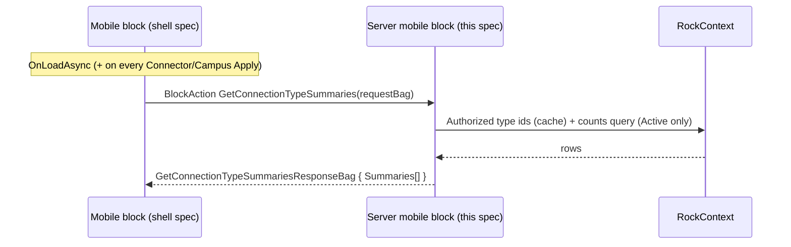

# Connection Type List (Mobile) Backend

## Summary

This is the backend half of the new mobile Connection Type List block, the first piece of porting the revamped Connections feature to Rock Mobile. It covers only the server-side code in the Develop repo: a new mobile `RockBlockType` that returns per-type request summaries, the count query duplicated from the web `Connection Type Navigation` block (now an exact copy, with no net-new logic), security, configuration delivery, and GUID registration. The mobile shell (view, view model, bindings, cover sheet, navigation) is specified separately in [the mobile shell spec](../../RM/specs/260608-mobile-connection-type-list-shell.md) in the RM repo. The two halves share one `BlockTypeGuid`.

## Motivation

- Core revamped Connections on the web (the `Connection Type Navigation` block plus the Connections Hub). Mobile should reach feature parity with the same connector-centric workflow and per-type counts; this spec brings the server side the mobile shell will consume.
- The current mobile server block ([ConnectionTypeList.cs](../Rock/Blocks/Types/Mobile/Connection/ConnectionTypeList.cs), GUID `31E1FCCF-...`) renders a Lava template into XAML strings and computes only a narrow set of counts (and only for the current person's own requests). It cannot supply the new five-count, filterable data.
- Backward compatibility is a hard rule, so the new server block ships alongside the old one rather than replacing it.

## Scope

- In scope: the server-side mobile block, the count query, configuration, security, SystemGuid registration, and the shape of the contract returned.
- Out of scope (this spec): all mobile UI, which lives in the shell spec. Out of scope for this first block but planned next in the feature: opportunity list, request list/board, request detail, add-request.

## Requirements

### Functional (server)

- The block MUST return the **active** connection types the current person is authorized to view: types are filtered on `ct.IsActive` and Entity-based security (`EDIT` or `VIEW`). This mirrors the web block's `GetAuthorizedConnectionTypeIds`, minus the type-limiting block setting (not included for now).
- For each type, the block MUST compute five counts over `ConnectionState.Active` requests only:

  | Count property | Meaning |
  |---|---|
  | `AssignedToYouRequestCount` | Active requests in this type where the current person is the connector |
  | `UnassignedRequestCount` | Active requests in this type with no connector |
  | `ActiveRequestCount` | All active requests in this type |
  | `DueSoonRequestCount` | Active requests due soon (not yet overdue) |
  | `OverdueRequestCount` | Active requests past their due date |

- Counts MUST reuse the web `LoadConnectionTypeSummaries` logic (duplicated; see Considered but Rejected). Due-soon and overdue MUST use `DbFunctions.TruncateTime(...)` comparisons against `RockDateTime.Today`, identical to the web.
- Under My Types, web parity means `UnassignedRequestCount` is always 0 and `ActiveRequestCount` equals `AssignedToYouRequestCount`; this is intended. As a result the shell hides the Unassigned badge under My Types (see shell spec).
- The request set MUST be filterable by connector scope (all requests vs only the current person's) and by campus (`cr.CampusId`).
- The block MUST return types in a stable default order (`Order` then `Name`, matching the web). Sorting is alphabetical and handled client-side in the shell, so the server takes no sort parameter.
- The block MUST deliver static configuration via `GetMobileConfigurationValues()`: the campus filter list (built from `CampusCache.All()`, active campuses only, ordered, mapped to `ListItemViewModel`; never a direct `Campus` table query) and the detail page. Building the campus list from `CampusCache.All()` follows the existing mobile-block pattern (`FinancialBatchList`, `PrayerRequestDetails`, `OnboardPerson`, `ProfileDetails`).
- The block MUST expose a `GetConnectionTypeSummaries` block action that takes the current filter and returns the summaries.

### Non-functional / conventions (server)

- A single new `BlockTypeGuid` MUST be embedded identically as a string literal in both repos (shared with the mobile block defined in the shell spec).
- Server block: `RockBlockType`, `[SupportedSiteTypes( Model.SiteType.Mobile )]`, under `Develop/Rock.Blocks/Mobile/Connection/` (namespace `Rock.Blocks.Mobile.Connection`; new blocks, mobile included, go in the `Rock.Blocks` project rather than the legacy `Rock/Blocks/Types/Mobile/` location, following `Rock.Blocks/Mobile/CheckIn/CheckIn.cs`), with new `EntityTypeGuid` and `BlockTypeGuid` SystemGuid constants.
- The block declares `RequiredMobileVersion => new Version( 1, 20 )` (mobile shell v20, following the `Version( 1, N )` convention used by existing blocks). The feature ships in Rock core v20.
- Leave the existing server mobile block (`31E1FCCF-...`) intact.
- Follow [Develop/CLAUDE.md](../CLAUDE.md): `RockContext` lifetime, `RockDateTime`, no `System.Web` in shared code.

## Design

### Server block identity and placement

| Piece | Path | Notes |
|---|---|---|
| New server block | `Develop/Rock.Blocks/Mobile/Connection/ConnectionTypeListV2.cs` | Class `ConnectionTypeListV2` (namespace `Rock.Blocks.Mobile.Connection`), `[DisplayName("Connection Type List V2")]`, `EntityTypeGuid` `88E9C088-5CCE-41F9-B99E-C3B03E123316` + `BlockTypeGuid` `A7FF3F7F-AC1D-4C07-A1E1-FBDE8F689F6A`. |
| Old server block | `Develop/Rock/Blocks/Types/Mobile/Connection/ConnectionTypeList.cs` (`31E1FCCF-...`) | Untouched. |

The user-facing `DisplayName` is **"Connection Type List V2"** (decided 2026-06-12, carrying the V2 suffix into the display name so the new block is distinguishable from the old "Connection Type List" in the `Mobile > Connection` category; supersedes the earlier display-name-stays-clean note). The block's class name is **`ConnectionTypeListV2`** (decided 2026-06-10), in namespace `Rock.Blocks.Mobile.Connection` in the **`Rock.Blocks` project** (also decided 2026-06-10: all new blocks, mobile included, go in `Rock.Blocks`, following the `Rock.Blocks/Mobile/CheckIn/CheckIn.cs` precedent; the legacy `Rock/Blocks/Types/Mobile/` location keeps only the old blocks). The old `ConnectionTypeList` stays untouched in the legacy location. In the new server namespace the old class name would not even collide, but the V2 suffix is kept: the shell namespace still collides (see shell spec), matching class names keep the pair easy to find, and the suffix follows existing precedent (`TransactionEntryV2`, `ScheduledTransactionEditV2`). This is separate from the web block (`ConnectionTypeNavigation`) whose count logic we copy. The same `BlockTypeGuid` literal is shared with the mobile block (see shell spec).

### Block settings (attributes)

For v1 the block exposes a single setting. Declared per [Develop/.claude/rules/block-architecture.md](../.claude/rules/block-architecture.md): the `FieldAttribute` assigned vertically by property, with the key in a nested `AttributeKey` static class.

| Setting | Field type | Key | Default | Purpose |
|---|---|---|---|---|
| Detail Page | `LinkedPage` | `DetailPage` | none | Page opened when a type is tapped; the type's `IdKey` is passed as the `ConnectionType` page parameter. Same pattern as the old mobile block and `SmsConversationList`. |

Everything else is fixed in code for v1 rather than configurable: all authorized connection types are shown (no type-limiting setting), the campus list is all active campuses from `CampusCache.All()` (no campus type/status scoping), the Connector scope defaults to My Types (web parity, then the person's saved choice applies), and the Sort By row is always shown. There is no `HeaderTemplate` or `TypeTemplate` setting, because the new block renders natively and exposes no Lava template. Any of these can graduate to a block setting later.

### Data flow



Static configuration (the campus list and detail page) is delivered through `GetMobileConfigurationValues()`. The summaries come from the `GetConnectionTypeSummaries` block action, which takes the Connector scope and Campus filter, so changing either re-invokes it. Search and alphabetical sort are applied client-side over the already-loaded list and do not hit the server (the request contract carries no search term or sort field). This matches the existing mobile Connection blocks (config static, data per-action).

### Counts query (duplicated from web)

An exact copy of `ConnectionTypeNavigation.LoadConnectionTypeSummaries` ([source](../Rock.Blocks/Connection/ConnectionTypeNavigation.cs)); the earlier net-new last-activity expression has been removed.

```csharp
var personId = currentPerson?.Id ?? 0;
var today = RockDateTime.Today;
var limitToMyTypes = request.ConnectorScope == ConnectionTypeConnectorScope.MyTypes;

var requestCountsQry = new ConnectionRequestService( rockContext )
    .Queryable()
    .Where( cr =>
        cr.ConnectionState == ConnectionState.Active
        && ( !campusId.HasValue || cr.CampusId == campusId.Value )
        && authorizedConnectionTypeIds.Contains( cr.ConnectionOpportunity.ConnectionTypeId )
        && (
            !limitToMyTypes
            || ( cr.ConnectorPersonAliasId.HasValue && cr.ConnectorPersonAlias.PersonId == personId )
        )
    )
    .GroupBy( cr => cr.ConnectionOpportunity.ConnectionTypeId )
    .Select( g => new
    {
        ConnectionTypeId = g.Key,
        ActiveRequestCount = g.Count(),
        DueSoonRequestCount = g.Count( r =>
            r.DueSoonDate.HasValue
            && DbFunctions.TruncateTime( r.DueSoonDate.Value ) <= today
            && !( r.DueDate.HasValue && DbFunctions.TruncateTime( r.DueDate.Value ) < today ) ),
        OverdueRequestCount = g.Count( r =>
            r.DueDate.HasValue && DbFunctions.TruncateTime( r.DueDate.Value ) < today ),
        UnassignedRequestCount = g.Count( r => !r.ConnectorPersonAliasId.HasValue ),
        AssignedToYouRequestCount = g.Count( r =>
            r.ConnectorPersonAliasId.HasValue && r.ConnectorPersonAlias.PersonId == personId )
    } );
```

The type set is first restricted to the active, authorized types (`ct.IsActive` and `EDIT`/`VIEW`) resolved by `GetAuthorizedConnectionTypeIds`. The type list is then produced by `GroupJoin` against `ConnectionTypeService.Queryable()` (so types with zero requests still appear under `All Types`), exactly as the web does, with `limitToMyTypes` reducing the type set to those having at least one matching request.

**Order.** The server returns types ordered by `Order` then `Name`, identical to the web. The shell re-sorts alphabetically (A-Z or Z-A) client-side, so the server takes no sort parameter.

### Contract returned

The bags and enums live in `Rock.Common.Mobile` (RM repo) and are defined in full in the [shell spec](../../RM/specs/260608-mobile-connection-type-list-shell.md). The server references the built `Rock.Common.Mobile.dll` in `RockWeb/Bin`. Property names MUST match the mobile definitions exactly. What the server populates:

- `GetConnectionTypeSummariesRequestBag` { `ConnectorScope`, `CampusGuid?` }.
- `GetConnectionTypeSummariesResponseBag` { `List<ConnectionTypeSummaryBag> Summaries` }.
- `ConnectionTypeSummaryBag` { `IdKey`, `IconCssClass`, `Name`, `Description`, `Order`, the five counts }. The server sets `IdKey` (via `IdHasher.Instance.GetHash( id )`); the shell passes it as the `ConnectionType` page parameter on tap.
- `Configuration` (returned from `GetMobileConfigurationValues`) { `Campuses` (active campuses from `CampusCache.All()` as `ListItemViewModel`, Value = Guid, Text = Name), `Guid? DetailPageGuid` }.

## Open Questions (backend)

1. **Block class / namespace name.** **Resolved 2026-06-10:** class `ConnectionTypeListV2`, file `Develop/Rock.Blocks/Mobile/Connection/ConnectionTypeListV2.cs`, namespace `Rock.Blocks.Mobile.Connection` (new blocks go in the `Rock.Blocks` project; the old `ConnectionTypeList` stays in the legacy `Rock/Blocks/Types/Mobile/Connection/` location, untouched and not renamed). The V2 suffix follows the `TransactionEntryV2` / `ScheduledTransactionEditV2` precedent and matches the shell class, where the old name still occupies the namespace. **Display name updated 2026-06-12:** "Connection Type List V2" (V2 suffix carried into the display name, matching block 2 and keeping the new block distinguishable from the old "Connection Type List" in `Mobile > Connection`; supersedes the earlier "stays Connection Type List" note).

## Considered but Rejected (backend)

### Revamp the existing server block in place
Rejected (product decision). Changing its contract would break existing `HeaderTemplate` / `TypeTemplate` Lava customizations and any deployment using it. A new block preserves backward compatibility, matching how the web shipped a new Obsidian block rather than editing the legacy WebForms one.

### Extract a shared service for the counts
Rejected for now (product decision). The count query is duplicated into the mobile block instead of being lifted into a shared service that both the web and mobile blocks call. This avoids a refactor of the shipping web block, at the cost of two copies that can drift. A future cleanup could unify them in `ConnectionTypeClientService`.

### Server-side search, sort, and paging of types
Rejected. Connection-type lists are small and loaded in full, so name search and alphabetical sort are client-side (in the shell) and no paging is needed. Only the Connector scope and Campus, which change which requests are counted, go to the server.

## Related

- Web block (count logic source of truth): [Develop/Rock.Blocks/Connection/ConnectionTypeNavigation.cs](../Rock.Blocks/Connection/ConnectionTypeNavigation.cs)
- Web summary bag: [Develop/Rock.ViewModels/Blocks/Connection/ConnectionTypeNavigation/ConnectionTypeSummaryBag.cs](../Rock.ViewModels/Blocks/Connection/ConnectionTypeNavigation/ConnectionTypeSummaryBag.cs)
- Old mobile server block: [Develop/Rock/Blocks/Types/Mobile/Connection/ConnectionTypeList.cs](../Rock/Blocks/Types/Mobile/Connection/ConnectionTypeList.cs)
- Mobile shell spec: [../../RM/specs/260608-mobile-connection-type-list-shell.md](../../RM/specs/260608-mobile-connection-type-list-shell.md)
