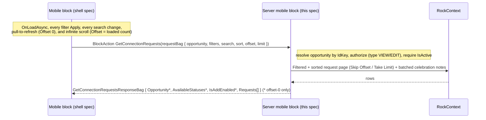

# Connection Opportunity Detail / Requests (Mobile) Backend

## Summary

This is the backend half of the new mobile **Connection Opportunity Detail** block, the third block in the Connections revamp port (after the [Connection Type List](260608-mobile-connection-type-list.md) and the [Connection Type Detail](260608-mobile-connection-type-detail.md)). It is the screen a connector lands on after tapping an opportunity in the Connection Type Detail block's Opportunities segment: the list of individual **Connection Requests** for that one opportunity. This spec covers only the server-side code in the Develop repo: a new mobile `RockBlockType` that returns a **paged**, server-filtered, server-sorted list of request summaries, a per-request has-celebration flag, the due-status computation, the per-row status name + status color (for the row's status pill), the opportunity header (title), the available statuses for the Status filter, an `IsAddEnabled` flag (drives the floating "Add Connection Request" button), security, configuration delivery (including the new `Add Page` linked-page setting that launches the separately-specced Add Connection Request V2 block), and GUID registration. The mobile shell (title, search, Filter & Sort cover sheet, the request rows with avatar/celebration badge/status pill/due badge/chevron, infinite scroll, floating Add button, navigation) is specified separately in [the mobile shell spec](../../RM/specs/260609-mobile-connection-opportunity-detail-shell.md) in the RM repo. The two halves share one `BlockTypeGuid`.

**This block diverges from the first two in one important way.** The Type List and Opportunity lists are small, so they load in full and search/sort client-side. A request list is unbounded (a busy opportunity can hold thousands of requests), so this block **pages from the server** and applies **search, sort, and every filter server-side** (decided with Panha 2026-06-09 — see Considered but Rejected → Load all client-side). The server therefore *does* take search, sort, and paging parameters here, which the prior two specs deliberately avoided. It follows the established mobile paging block **`MyContact`** ([MyContact.cs](../Rock/Blocks/Types/Mobile/Engagement/MyContact.cs)): **offset/limit** paging (`Skip( Offset ).Take( Limit )`), with the shell deriving "has more" from the returned row count — no page numbers, no probe row, and no `HasMore` flag on the wire.

## Motivation

- Core revamped Connections on the web. After the per-type and per-opportunity navigation, a connector opens an opportunity and works its **requests** — the people in that pipeline. The web renders this in the **Connections Hub** block ([ConnectionsHub.cs](../Rock.Blocks/Engagement/ConnectionsHub.cs)); this block ports the single-opportunity request list from it.
- The current mobile server block ([ConnectionRequestList.cs](../Rock/Blocks/Types/Mobile/Connection/ConnectionRequestList.cs), GUID `612E9E13-...`) renders a Lava `RequestTemplate` into XAML strings, supports only `OnlyMyConnections` / `OnlyPastDue` / state / campus, and pages via a server-rendered "Show More". It cannot supply the new natively-rendered, celebration-aware, status/due-filterable rows.
- Backward compatibility is a hard rule, so the new server block ships alongside the old one rather than replacing it.

## Scope

- In scope:
  - The paged request query for a single opportunity, with **all** filters applied server-side: connector scope (all vs mine), campus, connection state (multi), connection status (single), and due status (single); plus server-side **name search** and server-side **alphabetical sort** by requester; plus **offset/limit paging** (`Skip(Offset).Take(Limit)`, the shell deriving has-more from the returned count — the `MyContact` pattern).
  - A per-request **has-celebration** flag (whether a non-empty Celebration Note exists on the request), batched for the page. The badge is a pure indicator; no celebration text is returned and the type's Celebration feature flag is not consulted (see Design → Celebration).
  - The per-request **due status** (Overdue / Due Soon / On Track), computed with the same buckets the web uses.
  - The per-request **status name and highlight color** (from `ConnectionStatus.Name` and `ConnectionStatus.HighlightColor`), so the shell can render the status pill (colored dot + name) under the requester name on each row.
  - The **opportunity header** (Name) for the screen title, and the **available statuses** (the type's `ConnectionStatuses`) for the Status filter UI.
  - An **`IsAddEnabled`** flag on the offset-0 response — true when the `Add Page` block setting is configured AND the current person has `EDIT` auth on the opportunity's connection type — so the shell knows whether to render the floating "Add Connection Request" button.
  - Security, configuration delivery (campus list + detail page + add page + page size), SystemGuid registration, and the contract returned.
- Out of scope (this spec):
  - All mobile UI, which lives in the shell spec.
  - The Connections Hub features the mockup does **not** show: the board / Kanban view, grouping (by connector / campus / status / state / due), drag-to-reorder, the multi-type "My Connections" mode, attribute filters, the request-source filter, the reminders column and reminder editing, **celebration editing** (mobile v1 is display-only — the web's tap-to-add Celebration Note is deferred), group placement, workflow launching, request security editing, bulk actions, and the docked request-detail panel.
  - The connector identity shown on the row (the web shows a connector label; the mobile mockup shows only the celebration badge + the request's status pill, so connector display is deferred).
  - The Add Connection Request screen itself (its own block — specced in [260616-mobile-add-connection-request.md](260616-mobile-add-connection-request.md)). This block only **launches** the Add screen via the `Add Page` linked-page setting; it does not host the Add form.
  - Later blocks in this feature: request detail.

## Requirements

### Functional (server)

- The block MUST resolve the target `ConnectionOpportunity` from the `ConnectionOpportunityIdKey` on the request bag (the shell passes the `ConnectionOpportunity` page parameter it was launched with by the Connection Type Detail block). Resolve via `new ConnectionOpportunityService( rockContext ).Get( idKey, !PageCache.Layout.Site.DisablePredictableIds )` (the overload transparently accepts an Id, IdKey, or Guid). Note: there is **no** `ConnectionOpportunityCache` in Rock — opportunities are not cached — so the entity-service `Get` overload is used (per [block-architecture.md](../.claude/rules/block-architecture.md)). Use `ConnectionTypeCache.Get( connectionOpportunity.ConnectionTypeId )` for the `IsActive` check, the `EnableRequestSecurity` flag, and the type-level `EDIT` check behind `IsAddEnabled` (VIEW itself is checked at the opportunity level, see below), and the entity navigation `connectionOpportunity.ConnectionType.ConnectionStatuses` for the status lookup / `AvailableStatuses`.
- The block MUST authorize using Entity-based security. VIEW is evaluated at the **opportunity** level (`connectionOpportunity.IsAuthorized( Authorization.VIEW, currentPerson )`), mirroring the web Connections Hub. When the type has `EnableRequestSecurity` on, a person who lacks opportunity VIEW is still admitted if they are the assigned connector on at least one request in the opportunity (a single existence query, `IsCurrentPersonConnectorInOpportunity`). Type-level `EDIT` is reserved for the `IsAddEnabled` gate. Unauthorized → `ActionUnauthorized`. A missing opportunity, or an inactive opportunity/type → `ActionBadRequest`.
- The block MUST return a paged list of the opportunity's Connection Requests, with the following filters applied **server-side**:

  | Filter | Source on request bag | Server behavior |
  |---|---|---|
  | Connector scope | `ConnectorScope` (`AllRequests` / `MyRequests`) | `MyRequests` → `cr.ConnectorPersonAliasId.HasValue && cr.ConnectorPersonAlias.PersonId == currentPersonId`. Default `MyRequests` (web parity). |
  | Campus | `CampusGuid?` | resolved to a `CampusId` (cache) before the `.Where()`; `cr.CampusId == campusId`. Null → no campus filter. |
  | Connection state | `States` (`List<ConnectionState>`) | `cr.ConnectionState IN (states)`. Clamped to the offered set `{ Active, Inactive, FutureFollowUp }` (Connected is never offered); an empty/absent list means all three offered states. Default `[ Active ]`. |
  | Connection status | `StatusGuid?` | resolved to a `ConnectionStatusId` (from the type's cached statuses); `cr.ConnectionStatusId == statusId`. Null → all statuses. |
  | Due status | `DueStatus?` | one of `Overdue` / `DueSoon` / `DueLater` ("On Track"); null → all. Computed with `DbFunctions.TruncateTime(...)` against `RockDateTime.Today`, identical to the web buckets. |

- The block MUST apply a **name search** server-side when `SearchTerm` is non-empty: match the requester's `NickName`, `LastName`, or full name (`NickName + " " + LastName`) with `Contains`, so both partial and full-name searches work (mirroring `MyContact`'s name search).
- The block MUST apply **alphabetical sort by requester** server-side: `LastName` then `NickName`, ascending (`NameAscending`) or descending (`NameDescending`). This is the only sort offered (see Considered but Rejected → Server-side sort options). The server therefore takes a sort parameter for this block (unlike the first two).
- The block MUST **page** the result by **offset/limit**: `Skip( Offset ).Take( Limit )`, following the established mobile paging block `MyContact` ([MyContact.cs](../Rock/Blocks/Types/Mobile/Engagement/MyContact.cs)). `Offset` is the number of rows the shell already holds; `Limit` is the shell's load size, sourced from the `Page Size` block setting (default 15). The block returns just that page — the shell derives "has more" client-side from the returned count (`count >= Limit`), so the server needs **no** probe row and **no** `HasMore` flag. When the type enables per-request security, the page is taken **in memory** after per-row VIEW authorization rather than in the database (see Design → Request query); otherwise the database performs the paging.
- For each request on the page, the block MUST return: `IdKey` (for navigation), requester full name, requester photo URL (a full public URL when the requester has a photo, else null; the shell supplies the initials/avatar fallback, as `MyContact` does), the row subtitle text (the request `Comments` rendered to plain text — it is a markdown column, so markdown/HTML is stripped), `ConnectionState`, the computed `DueStatus`, a `HasCelebration` flag, and the **status name + status color** (`StatusName` from `ConnectionStatus.Name`; `StatusColor` from `ConnectionStatus.HighlightColor`). The status pair is resolved from the opportunity's cached type statuses by `ConnectionStatusId` after the page is materialized — no per-row DB hit.
- The block MUST compute each row's **due status** with the same buckets as the web `ConnectionsHub.GetDueStatus` (Overdue / Due Soon / On Track), so the shell's Due badge matches the web. Inactive requests are "On Track"; Connected is not relevant (excluded). The server-side Due **filter** MUST use these same buckets — including treating Inactive as On Track — so that a request's Due badge and its inclusion under a Due filter always agree (an Inactive past-due request is On Track, not Overdue, in both).
- The block MUST set a `HasCelebration` flag on each row indicating whether the request has a (non-empty) Celebration Note (`NoteType` `CELEBRATION_NOTE`). It MUST fetch these for the page's requests in a **single batched query** keyed by `EntityId` (never one query per row — see [data-model.md](../.claude/rules/data-model.md)). For v1 this is the whole celebration story: no celebration text is returned (the badge is a pure indicator), and the type's `EnabledFeatureFlags.Celebration` flag is not consulted — the badge shows wherever a celebration note exists.
- The block MUST return an **opportunity header** (Name) for the screen title, the **available statuses** (the type's `ConnectionStatuses` mapped to `{ Name, Guid, Color }`, ordered by `Order`) so the shell can populate the Status filter, and an **`IsAddEnabled`** flag (true when `AddPageGuid` is set on Configuration AND the current person has `EDIT` auth on the opportunity's `ConnectionType` — drives the floating Add button's visibility). All three are populated on the **offset-0 response** (the shell caches them from the first load); paging calls may leave them null/default.
- The block MUST deliver static configuration via `GetMobileConfigurationValues()`: the campus filter list (built from `CampusCache.All()`, active campuses only, ordered, mapped to `ListItemViewModel`; never a direct `Campus` table query), the **detail page** (opens when a request is tapped), the **add page** (opens when the floating "Add Connection Request" button is tapped — points at the new Add Connection Request V2 block, specced in [260616-mobile-add-connection-request.md](260616-mobile-add-connection-request.md)), and the **page size**. This matches the [Connection Type List](260608-mobile-connection-type-list.md) and [Connection Type Detail](260608-mobile-connection-type-detail.md) backends.
- The block MUST expose a `GetConnectionRequests` block action that takes the full filter/search/sort + offset/limit request bag and returns one page (plus the header + available statuses + `IsAddEnabled` on the offset-0 call).

### Non-functional / conventions (server)

- A single new `BlockTypeGuid` MUST be embedded identically as a string literal in both repos (shared with the mobile block defined in the shell spec).
- Server block: `RockBlockType`, `[SupportedSiteTypes( Model.SiteType.Mobile )]`, under `Develop/Rock.Blocks/Mobile/Connection/` (namespace `Rock.Blocks.Mobile.Connection`; new blocks go in the `Rock.Blocks` project, following `Rock.Blocks/Mobile/CheckIn/CheckIn.cs`), with new `EntityTypeGuid` and `BlockTypeGuid` SystemGuid constants.
- The block declares `RequiredMobileVersion => new Version( 1, 20 )` (mobile shell v20). The feature ships in Rock core v20.
- Leave the existing server mobile block (`612E9E13-...`) intact.
- Follow [Develop/CLAUDE.md](../CLAUDE.md): `RockContext` lifetime, `RockDateTime`, no `System.Web` in shared code, avoid `Guid` in `.Where()` when an `Id` from a cached item is available (resolve `CampusGuid`/`StatusGuid` to ids first). Attributes declared per [block-architecture.md](../.claude/rules/block-architecture.md) (vertical `FieldAttribute` by property, keys in a nested `AttributeKey` class; page-parameter keys in `PageParameterKey`).

## Design

### Server block identity and placement

| Piece | Path | Notes |
|---|---|---|
| New server block | `Develop/Rock.Blocks/Mobile/Connection/ConnectionRequestListV2.cs` | Class `ConnectionRequestListV2`, `[DisplayName("Connection Request List V2")]`, new `EntityTypeGuid` + `BlockTypeGuid`. |
| Old server block | `Develop/Rock/Blocks/Types/Mobile/Connection/ConnectionRequestList.cs` (`612E9E13-...`) | Untouched. |

The user-facing `DisplayName` is **"Connection Request List V2"** and the class name is **`ConnectionRequestListV2`** (locked 2026-06-16), succeeding the legacy mobile block `ConnectionRequestList` (`612E9E13-...`) per the V2 naming convention used by blocks 1 and 2 of this initiative (`ConnectionTypeListV2`, `ConnectionOpportunityListV2`). This is separate from the web block (`ConnectionsHub` in Engagement) whose request query we adapt. The same `BlockTypeGuid` literal is shared with the mobile block (see shell spec).

### Block settings (attributes)

For v1 the block exposes three settings. Declared per [block-architecture.md](../.claude/rules/block-architecture.md): each `FieldAttribute` assigned vertically by property, with the keys in a nested `AttributeKey` static class.

| Setting | Field type | Key | Default | Purpose |
|---|---|---|---|---|
| Detail Page | `LinkedPage` | `DetailPage` | none | Page opened when a request is tapped; the request's `IdKey` is passed as the `ConnectionRequest` page parameter to the (future) mobile Connection Request Detail block. Same pattern as the Connection Type Detail block's Detail Page. |
| Add Page | `LinkedPage` | `AddPage` | none | Page opened when the floating "Add Connection Request" button is tapped — points at the new Add Connection Request V2 block (specced in [260616-mobile-add-connection-request.md](260616-mobile-add-connection-request.md)). The current `ConnectionOpportunity` IdKey is passed as a page parameter so the Add block prefills + locks Type and Opportunity. When this setting is empty, the floating button is **not** rendered (the offset-0 `IsAddEnabled` flag is false). |
| Page Size | `IntegerField` | `PageSize` | 15 | The number of requests fetched per load (the infinite-scroll page size). Delivered to the shell via configuration; the shell uses it as its load size and sends it back as `Limit`. Because the shell's load size and the server's page size are the same value, the client-side has-more check (`Requests.Count >= Limit`) stays correct. No hard cap — the setting is trusted (matching the old block's `MaxRequestsToShow`). |

Everything else is fixed in code for v1: the campus list (all active campuses from `CampusCache.All()`), the connector-scope default (My Requests, web parity, then the person's saved choice), the state default (`[ Active ]`), and the alphabetical-only sort. There is no `HeaderTemplate` / `RequestTemplate` Lava template, because the new block renders natively. Any of these can graduate to a block setting later.

### Data flow



Static configuration (campus list, detail page, **add page**, page size) is delivered through `GetMobileConfigurationValues()`. Everything else — filters, search, sort, paging, plus the per-load `IsAddEnabled` gate for the floating Add button — flows through `GetConnectionRequests`. Because all of it is server-side, **any** change (filter Apply, search keystroke debounce, sort change) is a "new query": it resets `Offset` to 0, clears the list, and re-invokes the action; infinite scroll re-invokes with `Offset` = the count already loaded. This is the deliberate divergence from the first two blocks, where sort/search were client-side over an in-memory list.

### Request query (adapted from the web Connections Hub)

The web request grid is built by a raw SQL query in `ConnectionsHub` ([the `GetOtherGridData` SQL and `GetConnectionRequestGridRow`](../Rock.Blocks/Engagement/ConnectionsHub.cs)). That logic is block-private to the web block (and SQL-string based, with board/grouping concerns mobile does not need), so we **duplicate** the relevant filtering into a LINQ query on `ConnectionRequestService` for this single opportunity (accepted duplication, per the initiative's locked convention — see Considered but Rejected).

```csharp
var opportunityId = connectionOpportunity.Id;
var personId = currentPerson?.Id ?? 0;
var today = RockDateTime.Today;
var limitToMyRequests = request.ConnectorScope == ConnectionRequestConnectorScope.MyRequests;

// The shell only offers Active / Inactive / FutureFollowUp; Connected is never shown here.
// request.States carries the mobile ConnectionState enum, so cast to the model enum (the integer values line up).
var offeredStates = new[] { ConnectionState.Active, ConnectionState.Inactive, ConnectionState.FutureFollowUp };
var states = ( request.States != null && request.States.Count > 0 )
    ? request.States.Select( s => ( ConnectionState ) ( int ) s ).Where( s => offeredStates.Contains( s ) ).ToList()
    : offeredStates.ToList();

// A selection of only non-offered states (e.g. Connected) clamps to empty; fall back to all offered states.
if ( states.Count == 0 )
{
    states = offeredStates.ToList();
}

var requestsQry = new ConnectionRequestService( rockContext )
    .Queryable()
    .AsNoTracking() // read-only list, matching MyContact.
    .Where( cr => cr.ConnectionOpportunityId == opportunityId )
    .Where( cr => states.Contains( cr.ConnectionState ) );

if ( limitToMyRequests )
{
    requestsQry = requestsQry.Where( cr =>
        cr.ConnectorPersonAliasId.HasValue
        && cr.ConnectorPersonAlias.PersonId == personId );
}

if ( campusId.HasValue )
{
    requestsQry = requestsQry.Where( cr => cr.CampusId == campusId.Value );
}

if ( statusId.HasValue )
{
    requestsQry = requestsQry.Where( cr => cr.ConnectionStatusId == statusId.Value );
}

// Due filter — these buckets MUST match the display GetDueStatus below, which treats an
// Inactive request as always "On Track" regardless of its dates. So Overdue/DueSoon exclude
// Inactive, and On Track includes it; otherwise a request could be filtered in as Overdue yet
// render with no Overdue badge (or vice-versa).
switch ( request.DueStatus )
{
    case DueStatus.Overdue:
        requestsQry = requestsQry.Where( cr =>
            cr.ConnectionState != ConnectionState.Inactive
            && cr.DueDate.HasValue
            && DbFunctions.TruncateTime( cr.DueDate.Value ) < today );
        break;
    case DueStatus.DueSoon:
        requestsQry = requestsQry.Where( cr =>
            cr.ConnectionState != ConnectionState.Inactive
            && cr.DueSoonDate.HasValue
            && DbFunctions.TruncateTime( cr.DueSoonDate.Value ) <= today
            && !( cr.DueDate.HasValue && DbFunctions.TruncateTime( cr.DueDate.Value ) < today ) );
        break;
    case DueStatus.DueLater: // "On Track"
        requestsQry = requestsQry.Where( cr =>
            cr.ConnectionState == ConnectionState.Inactive
            || ( !( cr.DueDate.HasValue && DbFunctions.TruncateTime( cr.DueDate.Value ) < today )
                && !( cr.DueSoonDate.HasValue && DbFunctions.TruncateTime( cr.DueSoonDate.Value ) <= today ) ) );
        break;
    // null => no due filter (All).
}

// Server-side name search.
if ( !request.SearchTerm.IsNullOrWhiteSpace() )
{
    var term = request.SearchTerm.Trim();
    requestsQry = requestsQry.Where( cr =>
        cr.PersonAlias.Person.NickName.Contains( term )
        || cr.PersonAlias.Person.LastName.Contains( term )
        || ( cr.PersonAlias.Person.NickName + " " + cr.PersonAlias.Person.LastName ).Contains( term ) );
}

// Server-side alphabetical sort by requester (the only sort offered).
requestsQry = request.SortOrder == ConnectionRequestSortOption.NameDescending
    ? requestsQry.OrderByDescending( cr => cr.PersonAlias.Person.LastName )
                 .ThenByDescending( cr => cr.PersonAlias.Person.NickName )
    : requestsQry.OrderBy( cr => cr.PersonAlias.Person.LastName )
                 .ThenBy( cr => cr.PersonAlias.Person.NickName );

// Page by offset/limit, following the MyContact mobile block. The shell derives
// "has more" from the returned count (count >= Limit), so there is no probe row and no HasMore flag.
var offset = Math.Max( 0, request.Offset );
var pageSizeSetting = GetAttributeValue( AttributeKey.PageSize ).AsIntegerOrNull() ?? DefaultPageSize; // DefaultPageSize = 15.
var limit = request.Limit > 0 ? request.Limit : pageSizeSetting; // The shell sends the configured Page Size as Limit.

// Project the fields needed for the summary plus the campus and connector identity used by the
// per-request security filter.
var projectedQry = requestsQry
    .Select( cr => new
    {
        cr.Id,
        cr.ConnectionState,
        cr.ConnectionStatusId,
        cr.DueDate,
        cr.DueSoonDate,
        cr.Comments,
        cr.CampusId, // used by campus-scoped per-request security rules.
        ConnectorPersonId = ( int? ) cr.ConnectorPersonAlias.PersonId, // used by the connector shortcut.
        Requester = cr.PersonAlias.Person
    } );

// When the type enables per-request security every non-connector row must pass a VIEW check that
// cannot be expressed in SQL (explicit request-level rules plus opportunity/type inheritance), so
// the ordered candidates are materialized, authorized in memory (IsRequestViewable, mirroring
// ConnectionsHub.FilterRowsByViewAuthorization), then paged in memory. When security is disabled the
// caller has already authorized VIEW at the opportunity level, so the database performs the paging.
var pageRows = connectionType.EnableRequestSecurity
    ? projectedQry
        .ToList()
        .Where( r => IsRequestViewable( r.Id, r.CampusId, r.ConnectorPersonId, connectionOpportunity, personId, currentPerson ) )
        .Skip( offset )
        .Take( limit )
        .ToList()
    : projectedQry
        .Skip( offset )
        .Take( limit )
        .ToList();

// Build a status lookup ONCE from the opportunity's type, so each row's StatusName + StatusColor
// is an in-memory dictionary hit, never a per-row DB query.
var statusLookup = connectionOpportunity.ConnectionType.ConnectionStatuses
    .ToDictionary( s => s.Id, s => new { s.Name, Color = s.HighlightColor } );
```

**Campus / status resolution.** `request.CampusGuid` and `request.StatusGuid` arrive as `Guid?` and are resolved to a `CampusId` / `ConnectionStatusId` (via `CampusCache` and the type's cached `ConnectionStatuses`) **before** the `.Where()`, so the LINQ filters on ids, not Guids ([CLAUDE.md](../CLAUDE.md)).

### Celebration (batched, has-flag only)

For v1 the celebration badge is a **pure indicator**: the block reports only *whether* each request has a (non-empty) **Celebration Note** (`NoteType` `CELEBRATION_NOTE`, the same note the web `ConnectionsHub` uses). It does **not** return the celebration text (the badge shows no story — the web tooltip is just "Has Celebration"), and it does **not** consult the type's `EnabledFeatureFlags.Celebration` (decided with Panha 2026-06-09 — a celebration note only exists if the feature was enabled, so the badge simply shows wherever a note exists; the web instead hides its whole column when the feature is off). Fetch the page's notes in one query (not per row), returning a set of request ids that have a celebration:

```csharp
var requestIds = pageRows.Select( r => r.Id ).ToList(); // <= Limit ids, safe for Contains.
var celebrationNoteTypeId = NoteTypeCache.Get( Rock.SystemGuid.NoteType.CELEBRATION_NOTE.AsGuid() ).Id;

var celebratedRequestIds = new NoteService( rockContext ).Queryable().AsNoTracking()
    .Where( n => n.NoteTypeId == celebrationNoteTypeId
        && n.EntityId.HasValue
        && requestIds.Contains( n.EntityId.Value )
        && n.Text != null && n.Text != "" )
    .Select( n => n.EntityId.Value )
    .Distinct()
    .ToList()
    .ToHashSet();
```

### Due status for display

Each row's badge is driven by a `DueStatus` computed in memory after materialization, mirroring the web's `GetDueStatus` buckets (minus the Connected branch, which is excluded here):

```csharp
private static DueStatus GetDueStatus( DateTime? dueDate, DateTime? dueSoonDate, ConnectionState state )
{
    var today = RockDateTime.Today;

    if ( !dueDate.HasValue || state == ConnectionState.Inactive )
    {
        return DueStatus.DueLater; // "On Track"
    }

    if ( dueDate.Value.Date < today )
    {
        return DueStatus.Overdue;
    }

    if ( dueSoonDate.HasValue && dueSoonDate.Value.Date <= today )
    {
        return DueStatus.DueSoon;
    }

    return DueStatus.DueLater;
}
```

### Row projection

```csharp
var summaries = pageRows.Select( r =>
{
    var status = statusLookup.TryGetValue( r.ConnectionStatusId, out var s ) ? s : null;
    return new ConnectionRequestSummaryBag
    {
        IdKey = IdHasher.Instance.GetHash( r.Id ), // shell passes IdKey as the ConnectionRequest page parameter on tap.
        RequesterName = r.Requester.FullName,
        PhotoUrl = r.Requester.PhotoId.HasValue
            ? MobileHelper.BuildPublicApplicationRootUrl( FileUrlHelper.GetImageUrl( r.Requester.PhotoId.Value ) )
            : null, // full public photo URL when a photo exists; the shell supplies an initials/avatar fallback (same approach as MyContact).
        Gender = ( Rock.Common.Mobile.Enums.Gender ) ( int ) r.Requester.Gender, // drives the shell's avatar silhouette when PhotoUrl is null.
        Comment = r.Comments?.ConvertMarkdownToHtml().StripHtml(), // row subtitle: Comments is markdown, so render to plain text.
        ConnectionState = r.ConnectionState,
        DueStatus = GetDueStatus( r.DueDate, r.DueSoonDate, r.ConnectionState ),
        HasCelebration = celebratedRequestIds.Contains( r.Id ),
        StatusName = status?.Name, // shown as the status pill label (e.g. "In Progress").
        StatusColor = status?.Color // hex string from ConnectionStatus.HighlightColor; drives the pill's colored dot.
    };
} ).ToList();
```

### Contract returned

The bags and enums live in `Rock.Common.Mobile` (RM repo) and are defined in full in the [shell spec](../../RM/specs/260609-mobile-connection-opportunity-detail-shell.md). The server references the built `Rock.Common.Mobile.dll` in `RockWeb/Bin`. Property names MUST match the mobile definitions exactly. What the server populates:

- `GetConnectionRequestsRequestBag` { `ConnectionOpportunityIdKey`, `ConnectorScope` (`ConnectionRequestConnectorScope`), `CampusGuid?`, `States` (`List<ConnectionState>`), `StatusGuid?`, `DueStatus?` (`DueStatus`), `SearchTerm`, `SortOrder` (`ConnectionRequestSortOption`), `Offset`, `Limit` }. (`Offset`/`Limit` mirror `MyContact`'s `ContactSearchOptions`.)
- `GetConnectionRequestsResponseBag` { `ConnectionOpportunityHeaderBag Opportunity`, `List<ConnectionStatusItemBag> AvailableStatuses`, `bool IsAddEnabled`, `List<ConnectionRequestSummaryBag> Requests` }. `Opportunity`, `AvailableStatuses`, and `IsAddEnabled` are populated only on the offset-0 response; the shell derives "has more" from `Requests.Count >= Limit` (no `HasMore` on the wire).
- `ConnectionOpportunityHeaderBag` { `IconCssClass`, `Name` }: the screen title ("Connection Opportunity Name" in the mockup), plus the opportunity's icon CSS class (from `ConnectionOpportunity.IconCssClass`) for an optional title icon.
- `ConnectionStatusItemBag` { `Name`, `Value` (Guid), `Color` } — one per `ConnectionStatus` of the opportunity's type, for the Status filter. (Mirrors the web's `ConnectionStatusBag`. `Color` carries `ConnectionStatus.HighlightColor` for parity; in v1 the Status filter sheet still shows names-only, but the same color value is now also surfaced per row as `StatusColor` on `ConnectionRequestSummaryBag` for the row status pill.)
- `ConnectionRequestSummaryBag` { `IdKey`, `RequesterName`, `PhotoUrl`, `Gender`, `Comment`, `ConnectionState`, `DueStatus`, `HasCelebration`, `StatusName`, `StatusColor` }. `Gender` (the mobile `Gender` enum) drives the shell's avatar silhouette when `PhotoUrl` is null. `StatusName` is `ConnectionStatus.Name`; `StatusColor` is the hex `ConnectionStatus.HighlightColor`. Both are resolved in memory after the page materializes via the opportunity's cached type statuses (no per-row DB hit). The shell renders them as a colored-dot + name pill under the requester name. No celebration text — the badge is a pure indicator. `ConnectionState` is returned to support an optional non-Active state indicator on the row — see the shell spec's open question.
- `Configuration` (returned from `GetMobileConfigurationValues`) { `Campuses` (active campuses from `CampusCache.All()` as `ListItemViewModel`, Value = Guid, Text = Name), `Guid? DetailPageGuid`, `Guid? AddPageGuid` (the `Add Page` linked-page setting; null when not configured — drives whether the floating Add button can render at all), `int PageSize` (the `Page Size` setting, default 15 — the shell uses it as its load size) }.

`ConnectionState` and `DueStatus` already exist in `Rock.Common.Mobile/Enums/` and are reused (do not redefine). `ConnectionRequestConnectorScope` and `ConnectionRequestSortOption` are new shared enums (defined in the shell spec). Because sort crosses the wire for this block, `ConnectionRequestSortOption` lives in the shared contract — unlike the first two blocks, whose sort enums were shell-local.

## Open Questions (backend)

_None — all backend questions resolved as of 2026-06-16. See Resolved below._

**Resolved 2026-06-16 (with Panha):**
- **Block class name locked at `ConnectionRequestListV2`**, display name **"Connection Request List V2"**, succeeding the old mobile `ConnectionRequestList` (`612E9E13-...`). Follows the V2 naming convention used by blocks 1 (`ConnectionTypeListV2`) and 2 (`ConnectionOpportunityListV2`) — the new block is named after the legacy block it succeeds, not after the screen concept (`ConnectionOpportunityDetail` was considered and rejected). Old block left intact.
- **Per-request security (`EnableRequestSecurity`) IS honored in this block.** VIEW is evaluated at the **opportunity** level (`connectionOpportunity.IsAuthorized( Authorization.VIEW )`). When the type has `EnableRequestSecurity` on, a person who lacks opportunity VIEW is still admitted if they are the assigned connector on at least one request in the opportunity (a single existence query, `IsCurrentPersonConnectorInOpportunity`). Row-level filtering then applies: with security on, the ordered candidates are materialized, each non-connector row is VIEW-authorized in memory (`IsRequestViewable`, using a lightweight `ConnectionRequest` stub so explicit request-level rules and the opportunity/type inheritance chain are honored), and paging (`Skip`/`Take`) happens in memory over the authorized set. This mirrors the web `ConnectionsHub.FilterRowsByViewAuthorization` ([../Rock.Blocks/Engagement/ConnectionsHub.cs](../Rock.Blocks/Engagement/ConnectionsHub.cs)). With security off, the caller has already authorized VIEW at the opportunity level, so the database performs the paging. Type-level `EDIT` is reserved for the `IsAddEnabled` gate. Block 5 (Connection Request Detail) will additionally enforce per-request VIEW/EDIT on the single-request endpoints (open detail, save, reassign, change status, add activity).
- **Row contract gains `StatusName` + `StatusColor`** so the shell can render a status pill (colored dot + status name) under the requester name. Color sourced from `ConnectionStatus.HighlightColor` (Rock's canonical admin-settable status color); resolved in memory after page materialization via the opportunity's cached type statuses (no per-row DB hit). Confirmed by Panha after seeing the updated mockup.
- **New `Add Page` linked-page block setting** + an `IsAddEnabled` flag on the offset-0 response (true when `AddPageGuid` is set AND the current person has `EDIT` on the opportunity's type). The Add screen itself is a separate block (see [260616-mobile-add-connection-request.md](260616-mobile-add-connection-request.md)) — this block only launches it, passing the current `ConnectionOpportunity` IdKey as a page parameter so the Add block can prefill+lock Type and Opportunity.

**Resolved 2026-06-09 (with Panha):**
- **Server-side paging** (not load-all), following the `MyContact` mobile block's offset/limit + `IPaginator` pattern (`Skip(Offset).Take(Limit)`, has-more derived client-side). The request list pages from the server; search, sort, and all filters are server-side. This is the explicit divergence from the first two blocks.
- **Load size is the `Page Size` block setting, default 15** (an `IntegerField`). Delivered via configuration; the shell uses it as its load size and sends it as `Limit`. No hard cap — the setting is trusted (matching the old block's `MaxRequestsToShow`).
- **Row subtitle is the request `Comments`.** It is the request's own free text (the web detail surfaces the same field) and the only per-request text that varies row to row — the opportunity description would be identical for every row here. `Comments` is a markdown column, so the server returns it as plain text (markdown → HTML → stripped) and the shell tail-truncates it, with a fallback when empty.
- **State default is `[ Active ]`** (web standard-mode default). The shell offers Active / Inactive / Future Follow Up only; **Connected / "Completed" is not offered** and never appears in this list.
- The **avatar badge is the celebration indicator** — a blue `ti ti-confetti` badge shown whenever the request has a (non-empty) Celebration Note. v1 is just the badge: only a `HasCelebration` bool on the wire (no celebration text), no add/edit, and the type's Celebration feature flag is not consulted for display (decided with Panha 2026-06-09).

## Considered but Rejected (backend)

### Revamp the existing server block in place
Rejected (product decision). Changing its contract would break existing `RequestTemplate` Lava customizations and any deployment using it. A new block preserves backward compatibility, matching how the web shipped the new Obsidian `ConnectionsHub` rather than editing the legacy block, and matching the [Connection Type List](260608-mobile-connection-type-list.md) and [Connection Type Detail](260608-mobile-connection-type-detail.md) decisions.

### Load all requests and filter/search/sort client-side (the first-two-blocks / web approach)
Rejected for this block (decided with Panha 2026-06-09). The Type List and Opportunity lists are small and bounded, so they load in full and filter/search/sort client-side. The web Connections Hub also loads all and filters/sorts client-side with grid virtual scrolling. But a single opportunity's request list is unbounded, and the old mobile request block already paged server-side for exactly this reason. So this block pages server-side and applies search, sort, and every filter on the server. Consequence: the server takes search/sort/page parameters here (the prior two specs explicitly did not), and Status/Due are computed server-side rather than client-side as the web does.

### Extract a shared service for the request query
Rejected for now (product decision). The web request query is block-private to `ConnectionsHub` (raw SQL with board/grouping concerns). We duplicate the relevant filtering into a LINQ query rather than refactoring the shipping web block. A future cleanup could unify a request-list query in a `ConnectionRequestClientService`.

### Server-side sort options beyond alphabetical
Rejected. The web offers Date Added, Due Date, Requester (A-Z/Z-A), and Last Activity sorts; the mockup's Filter & Sort shows "Last Activity (Newest First)". To stay consistent with the Type List / Opportunity blocks and Panha's direction, the only sort offered is **alphabetical by requester (A-Z / Z-A)**. The other sorts can be added later (they are already server-translatable). Note this is alphabetical-*by-requester*, which the web also supports — so it is web-faithful, just narrowed.

### Multi-select Status and Due filters (web parity)
Rejected for v1. The web Status and Due filters are multi-select checkbox lists. The mobile mockup shows single-select dropdowns ("Status: All", "Due: Overdue"), so the contract uses a single `StatusGuid?` and a single `DueStatus?` (null = All). Multi-select can be added later by widening those to lists.

### Show celebration editing, reminders, connector, attribute filters, request source, board/grouping
Rejected for v1 — none are in the mockup. Celebration is display-only (no Celebration Note creation), reminders / connector / attribute filters / request source / board view / grouping / drag-reorder are all out of scope. The service data exists if a later iteration wants them.

## Related

- Web block (request query + celebration + due-status source of truth): [Develop/Rock.Blocks/Engagement/ConnectionsHub.cs](../Rock.Blocks/Engagement/ConnectionsHub.cs) — `GetConnectionRequestGridRow`, `GetDueStatus`, `GetCelebrationText`, the request grid SQL.
- Web request card (badge/state/due/connector treatment): [Develop/Rock.JavaScript.Obsidian.Blocks/src/Engagement/ConnectionsHub/connectionRequestCard.partial.obs](../Rock.JavaScript.Obsidian.Blocks/src/Engagement/ConnectionsHub/connectionRequestCard.partial.obs); celebration column: [connectionsHub.obs](../Rock.JavaScript.Obsidian.Blocks/src/Engagement/connectionsHub.obs).
- Web filter modal: [Develop/Rock.JavaScript.Obsidian.Blocks/src/Engagement/ConnectionsHub/viewOptionsModal.partial.obs](../Rock.JavaScript.Obsidian.Blocks/src/Engagement/ConnectionsHub/viewOptionsModal.partial.obs).
- Server-side paging pattern (offset/limit, bare-list page response): [Develop/Rock/Blocks/Types/Mobile/Engagement/MyContact.cs](../Rock/Blocks/Types/Mobile/Engagement/MyContact.cs) — the `Search( ContactSearchOptions )` action.
- Old mobile server block (left intact): [Develop/Rock/Blocks/Types/Mobile/Connection/ConnectionRequestList.cs](../Rock/Blocks/Types/Mobile/Connection/ConnectionRequestList.cs)
- Enums (reused): `Rock.Enums/Connection/ConnectionState.cs`, `Rock.Enums/Connection/DueStatus.cs`.
- Sibling backend specs: [Connection Type List](260608-mobile-connection-type-list.md), [Connection Type Detail](260608-mobile-connection-type-detail.md).
- Mobile shell spec: [../../RM/specs/260609-mobile-connection-opportunity-detail-shell.md](../../RM/specs/260609-mobile-connection-opportunity-detail-shell.md)
