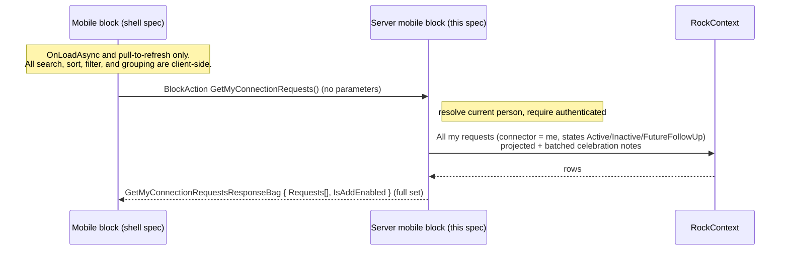

# My Connection Requests (Mobile) Backend

## Summary

This is the backend half of the new mobile **My Connection Requests** block, the fourth block in the Connections revamp port (after the [Connection Type List](260608-mobile-connection-type-list.md), the [Connection Type Detail](260608-mobile-connection-type-detail.md), and the [Connection Opportunity Detail](260609-mobile-connection-opportunity-detail.md)). It is a connector's personal, cross-opportunity worklist: every Connection Request assigned to the current person as connector, across **all** connection types and opportunities, that the shell renders in a **user-selectable grouping** (by Opportunity / Due / State / Status / Campus, defaulting to opportunity). This spec covers only the server-side code in the Develop repo: a new mobile `RockBlockType` that returns, in **one unpaged call**, the full set of the person's requests (states Active / Inactive / Future Follow Up; Connected is never returned), with each row carrying its display fields plus every key the shell needs to group, sort, and filter client-side, a per-request batched has-celebration flag, the due-status computation, the Add-button gate, security, configuration delivery, and GUID registration. The mobile shell (title, search, Customize cover sheet, the grouped request rows, the floating Add button, navigation) is specified separately in [the mobile shell spec](../../RM/specs/260609-mobile-my-connection-requests-shell.md) in the RM repo. The two halves share one `BlockTypeGuid`.

**This block loads everything and lets the shell do the work, like the first two blocks (not block 3).** The Type List and the Type Detail Opportunities list are small, so they load in full and search/sort client-side. The Opportunity Detail block (block 3) pages server-side because a single opportunity's request list is unbounded. A connector's *own* request set is bounded per person, so this block loads it **all in one call** and the shell does **grouping, search, sort, and every filter** in memory, mirroring blocks 1 and 2 and the web's My Connections mode (decided with Panha 2026-06-09). One direct consequence: because filtering is client-side, **every filter key** (state, owning opportunity, type, campus, status, due) rides on each row, so this block's row bag is richer than block 3's display-only row.

## Motivation

- Core's revamped Connections has a **My Connections** mode in the web Connections Hub ([ConnectionsHub.cs](../Rock.Blocks/Engagement/ConnectionsHub.cs), `IsMyConnectionsMode`): a multi-type view pre-scoped to the current person that shows every request assigned to them, not just one opportunity's. This block ports that mode to mobile.
- The [Connection Opportunity Detail](260609-mobile-connection-opportunity-detail.md) block deliberately deferred the multi-type "My Connections" mode (see its Scope). This block is that deferred mode.
- A connector wants a single personal worklist: all of their assigned requests, grouped by opportunity, with the same row, celebration, and due treatment as the other blocks.
- Backward compatibility is a hard rule, so the new server block ships alongside the existing ones.

## Scope

- In scope:
  - The query for **all requests where the connector is the current person**, in states `{ Active, Inactive, FutureFollowUp }` (Connected never returned), across all types and opportunities, returned in **one unpaged response**.
  - Each row's **display** fields (requester name parts, photo URL, comment plain text, due status, has-celebration) **and** the **filter/group keys** the shell needs client-side: `ConnectionState`, owning opportunity (`Guid` + `Name` + icon), owning type (`Guid` + `Name`), campus (`Guid?` + `Name`), and status (`Guid` + `Name`).
  - A per-request **has-celebration** flag, batched over the whole result set.
  - The per-request **due status** (Overdue / Due Soon / On Track), computed with the same buckets the web uses.
  - Configuration delivery (the detail page), SystemGuid registration, security, and the contract returned.
- Out of scope (this spec):
  - All mobile UI, which lives in the shell spec.
  - **Server-side search, sort, filtering, and paging.** The shell does all of it client-side over the loaded set, so the server takes no search/sort/filter/page parameters.
  - The **connector scope** choice. This block is always scoped to the current person; there is no Connector filter (the web's My Connections page is likewise pre-scoped, [ConnectionsHub.cs:278](../Rock.Blocks/Engagement/ConnectionsHub.cs)).
  - The Connections Hub features the mockup does **not** show: the board / Kanban view, drag-to-reorder, attribute filters, the request-source filter, the reminders column, **celebration editing** (display-only here), group placement, workflow launching, request-security editing, bulk actions, the docked request-detail panel, and the connector label on the row.
  - **The Add Connection Request screen itself** (its own block); this block only delivers the `AddPage` setting and the `IsAddEnabled` gate so the shell can show the floating launcher.
  - Later blocks: request detail (deferred), add request.

## Requirements

### Functional (server)

- The block MUST resolve the **current person** from the request context. The block requires an authenticated person; with none, return `ActionUnauthorized`.
- The block MUST return every `ConnectionRequest` where `cr.ConnectorPersonAliasId.HasValue && cr.ConnectorPersonAlias.PersonId == currentPersonId` and `cr.ConnectionState` is in `{ Active, Inactive, FutureFollowUp }`. **Connected is never returned.** There is no opportunity or type constraint (this is the cross-opportunity view).
- The block MUST honor **per-request VIEW security**. It materializes the candidate requests (with the navigations the auth-inheritance chain needs, including `ConnectorPersonAlias`) and then filters the materialized list in memory with `cr.IsAuthorized( Authorization.VIEW, currentPerson )`. Rock's authorization inheritance handles `ConnectionType.EnableRequestSecurity` transparently: when on, the request's own rules are consulted; when off, the request defers up to the opportunity and then the type, so no branching on the flag is needed. Being the assigned connector is not treated as the sole visibility boundary; the VIEW check is always applied.
- The block MUST take **no** filter, search, sort, or paging parameters. It returns the full set in one response; the shell groups, searches, sorts, and filters in memory. This is the deliberate divergence from block 3 (see Considered but Rejected).
- Because filtering and grouping are client-side, each row MUST include the keys the shell filters and groups on: `ConnectionState`; owning opportunity (`Guid` + display `Name` + icon, for the section header); owning type (`Guid` + `Name`); campus (`Guid?` + `Name`, null when the request has no campus); and status (`Guid` + `Name`), in addition to the display fields. The shell groups by Opportunity, Due, State, Status, or Campus, all from these row keys, so no extra payload is needed for grouping.
- Each row MUST include a **`StatusColor`** (the `ConnectionStatus.HighlightColor`) so the shell can tint the row's status pill, identical to block 3's per-row status dot.
- The block MUST compute each row's **due status** with the same buckets as the web `ConnectionsHub.GetDueStatus` (Overdue / Due Soon / On Track), identical to [block 3](260609-mobile-connection-opportunity-detail.md). Inactive is On Track; Connected is excluded (not returned). Because the row's single `DueStatus` value drives **both** the badge and the shell's client-side Due filter, the badge and the filter inherently agree, so block 3's "server Due filter must match the display buckets" gotcha does not arise here.
- The block MUST set a `HasCelebration` flag per row indicating whether the request has a non-empty **Celebration Note** (`NoteType` `CELEBRATION_NOTE`), fetched in a **single batched query** over all returned request ids (never per row, per [data-model.md](../.claude/rules/data-model.md)). As in block 3, this is the whole celebration story for v1: no text is returned (pure indicator) and the type's `EnabledFeatureFlags.Celebration` is not consulted.
- The block MUST return the row subtitle as the request `Comments` rendered to plain text (markdown column, so `ConvertMarkdownToHtml().StripHtml()`); the shell supplies the empty fallback and tail-truncation.
- The block MUST return the requester photo URL (full public URL when a photo exists, else null; the shell supplies the avatar fallback, as in block 3 and `MyContact`), plus the requester name as a **display string and the sort parts** (`NickName`, `LastName`) so the shell can sort alphabetically by requester (LastName, then NickName) client-side.
- The block MUST deliver static configuration via `GetMobileConfigurationValues()`: the **detail page** and the **add page** (`AddPageGuid`). It does **not** send a campus list (the shell derives the Campus filter options from the loaded rows) and does **not** send a page size (there is no paging).
- The block MUST set **`IsAddEnabled`** on the response: true when the `AddPage` setting is configured **and** the current person has `EDIT` authorization on at least one active connection type (so the shell shows the floating Add button only when the person can actually add a request somewhere). Compute the auth check over `ConnectionTypeCache.All()` (cached, no DB hit). This is the cross-opportunity analog of block 3's per-opportunity EDIT gate.
- The block MUST expose a `GetMyConnectionRequests` block action that takes **no** parameters and returns the full set (plus `IsAddEnabled`).

### Non-functional / conventions (server)

- A single new `BlockTypeGuid` MUST be embedded identically as a string literal in both repos (shared with the mobile block in the shell spec).
- Server block: `RockBlockType`, `[SupportedSiteTypes( Model.SiteType.Mobile )]`, under `Develop/Rock.Blocks/Mobile/Connection/` (namespace `Rock.Blocks.Mobile.Connection`; new blocks go in the `Rock.Blocks` project, following `Rock.Blocks/Mobile/CheckIn/CheckIn.cs`), with new `EntityTypeGuid` and `BlockTypeGuid` SystemGuid constants.
- The block declares `RequiredMobileVersion => new Version( 1, 20 )` (mobile shell v20). The feature ships in Rock core v20.
- Leave the existing server mobile block (`612E9E13-...`) intact.
- Follow [Develop/CLAUDE.md](../CLAUDE.md) and [data-model.md](../.claude/rules/data-model.md): `RockContext` lifetime, `RockDateTime`, no `System.Web` in shared code, batched note fetch (no N+1). The single `requestIds.Contains(...)` IN list is bounded by one person's assigned requests, far below the EF batch-size limit, so no batching of the celebration query is needed. Attributes declared per [block-architecture.md](../.claude/rules/block-architecture.md).

## Design

### Server block identity and placement

| Piece | Path | Notes |
|---|---|---|
| New server block | `Develop/Rock.Blocks/Mobile/Connection/MyConnectionRequests.cs` | Class `MyConnectionRequests`, `[DisplayName("My Connection Requests")]`, `EntityTypeGuid` `1160B498-50D7-4E8F-9B23-BFD87B7E7F22`, `BlockTypeGuid` `C6C6A0A3-D381-4A13-A5D0-EAA4302E78F1`. |
| Old server block | `Develop/Rock/Blocks/Types/Mobile/Connection/ConnectionRequestList.cs` (`612E9E13-...`) | Untouched. |

The user-facing `DisplayName` is "My Connection Requests" (the screen title reads "My Requests" per the mockup, set shell-side). The class is `MyConnectionRequests` in namespace `Rock.Blocks.Mobile.Connection`. The same `BlockTypeGuid` literal (`C6C6A0A3-D381-4A13-A5D0-EAA4302E78F1`) is shared with the mobile block (see shell spec).

### Block settings (attributes)

For v1 the block exposes **two** settings. Declared per [block-architecture.md](../.claude/rules/block-architecture.md): the `FieldAttribute` assigned vertically by property, the keys in a nested `AttributeKey` static class.

| Setting | Field type | Key | Default | Purpose |
|---|---|---|---|---|
| Detail Page | `LinkedPage` | `DetailPage` | none | Page opened when a request is tapped; the request's `IdKey` is passed as the `ConnectionRequest` page parameter to the (future) mobile Connection Request Detail block. Same pattern as block 3's Detail Page. |
| Add Page | `LinkedPage` | `AddPage` | none | Page opened by the shell's floating Add Connection Request button. Delivered as `Configuration.AddPageGuid`. Unlike block 3, **no** page parameter is passed (this is a cross-opportunity view), so the Add screen opens with its Type and Opportunity pickers unlocked. With `IsAddEnabled` it drives whether the button shows. |

There is no Page Size setting (the block does not page) and no campus-list configuration (the Campus filter options are derived client-side from the loaded rows). A max-results safety cap was considered and rejected for v1 (see Considered but Rejected).

### Data flow



Static configuration (the detail page) is delivered through `GetMobileConfigurationValues()`. The full request set flows once through `GetMyConnectionRequests`. The shell holds it as an in-memory master list and rebuilds the grouped, filtered, searched, sorted display from it without ever calling the server again (until pull-to-refresh). This is the deliberate divergence from block 3, where every filter / search / sort change was a new server query.

### Request query (adapted from the web My Connections mode)

The web builds the My Connections grid with a raw SQL query in `ConnectionsHub` ([the grid SQL and connector filter](../Rock.Blocks/Engagement/ConnectionsHub.cs), roughly lines 3812 to 4048), pre-scoped to the current person. That logic is block-private and SQL-string based with board/grouping concerns mobile does not need, so we **duplicate** the relevant filtering into a LINQ query (accepted duplication, per the initiative's locked convention, see Considered but Rejected).

Because per-request VIEW security is honored, the query does not project directly. It materializes the candidate entities (with the navigations the projection and the auth-inheritance chain both need), then runs an in-memory `IsAuthorized( VIEW )` pass, then projects. `ConnectorPersonAlias` **must** be `Include()`d: `AsNoTracking` disables lazy loading, and the per-request auth pass relies on that navigation for the `EnableRequestSecurity` connector self-view fast-path (it grants VIEW when the connector alias belongs to the current person). Without it the navigation is null on the detached entities and a connector's own requests would be wrongly filtered out for request-secured types.

```csharp
var personId = currentPerson.Id;

// The shell offers Active / Inactive / Future Follow Up only; Connected ("completed") is never returned.
var offeredStates = new[]
{
    ConnectionState.Active,
    ConnectionState.Inactive,
    ConnectionState.FutureFollowUp
};

// Materialize the candidate entities (with the navigations needed for both the
// projection and the auth-inheritance chain) so the per-request
// IsAuthorized( VIEW ) pass can run in memory.
var candidates = new ConnectionRequestService( rockContext )
    .Queryable()
    .AsNoTracking()
    .Include( cr => cr.ConnectionOpportunity.ConnectionType )
    .Include( cr => cr.PersonAlias.Person )
    .Include( cr => cr.Campus )
    .Include( cr => cr.ConnectionStatus )
    // Required for the EnableRequestSecurity connector self-view fast-path under AsNoTracking.
    .Include( cr => cr.ConnectorPersonAlias )
    .Where( cr => cr.ConnectorPersonAliasId.HasValue
        && cr.ConnectorPersonAlias.PersonId == personId )
    .Where( cr => offeredStates.Contains( cr.ConnectionState ) )
    .ToList();

// Honor per-request security. EnableRequestSecurity is handled transparently by
// Rock's authorization inheritance.
var authorized = candidates
    .Where( cr => cr.IsAuthorized( Authorization.VIEW, currentPerson ) )
    .ToList();
```

Campus and status resolve to null when the request has no campus / status (the projection is null-safe). No `Guid` appears in a `.Where()` because there are **no** server-side filters for this block; the connector is resolved to `personId` up front.

### Celebration (batched over the whole set, has-flag only)

As in block 3, the badge is a **pure indicator**: only whether each request has a non-empty Celebration Note. Fetch them in one query over all returned ids:

```csharp
var requestIds = authorized.Select( cr => cr.Id ).ToList(); // bounded by one person's requests.
var celebrationNoteTypeId = NoteTypeCache.Get( Rock.SystemGuid.NoteType.CELEBRATION_NOTE.AsGuid() ).Id;

var celebratedRequestIds = new NoteService( rockContext ).Queryable().AsNoTracking()
    .Where( n => n.NoteTypeId == celebrationNoteTypeId
        && n.EntityId.HasValue
        && requestIds.Contains( n.EntityId.Value )
        && n.Text != null && n.Text != "" )
    .Select( n => n.EntityId.Value )
    .Distinct()
    .ToList()
    .ToHashSet();
```

### Due status for display

Identical buckets to block 3 (and the web `GetDueStatus`, minus the Connected branch, which is not returned here):

```csharp
private static DueStatus GetDueStatus( DateTime? dueDate, DateTime? dueSoonDate, ConnectionState state )
{
    var today = RockDateTime.Today;

    if ( !dueDate.HasValue || state == ConnectionState.Inactive )
    {
        return DueStatus.DueLater; // "On Track"
    }

    if ( dueDate.Value.Date < today )
    {
        return DueStatus.Overdue;
    }

    if ( dueSoonDate.HasValue && dueSoonDate.Value.Date <= today )
    {
        return DueStatus.DueSoon;
    }

    return DueStatus.DueLater;
}
```

This is the same helper as block 3; a future cleanup could share it between the two mobile Connection blocks (both compile into the `Rock` project).

### Row projection

```csharp
var requests = authorized.Select( cr =>
{
    var person = cr.PersonAlias?.Person;
    var opportunity = cr.ConnectionOpportunity;
    var connectionType = opportunity?.ConnectionType;
    var campus = cr.Campus;
    var status = cr.ConnectionStatus;

    var opportunityName = opportunity == null
        ? null
        : ( opportunity.PublicName.IsNotNullOrWhiteSpace() ? opportunity.PublicName : opportunity.Name );

    return new ConnectionRequestSummaryBag
    {
        IdKey = IdHasher.Instance.GetHash( cr.Id ), // shell passes IdKey as the ConnectionRequest page parameter on tap.
        RequesterName = person?.FullName,
        RequesterNickName = person?.NickName,
        RequesterLastName = person?.LastName,
        PhotoUrl = person?.PhotoId != null
            ? MobileHelper.BuildPublicApplicationRootUrl( FileUrlHelper.GetImageUrl( person.PhotoId.Value ) )
            : null,
        // Gender lets the shell pick a gender-appropriate avatar silhouette when PhotoUrl is null.
        Gender = person != null ? ( Rock.Common.Mobile.Enums.Gender ) ( int ) person.Gender : Rock.Common.Mobile.Enums.Gender.Unknown,
        Comment = cr.Comments?.ConvertMarkdownToHtml().StripHtml(),
        ConnectionState = ( MobileConnectionState ) ( int ) cr.ConnectionState,
        DueStatus = GetDueStatus( cr.DueDate, cr.DueSoonDate, cr.ConnectionState ),
        HasCelebration = celebratedRequestIds.Contains( cr.Id ),
        OpportunityGuid = opportunity?.Guid ?? Guid.Empty,
        OpportunityName = opportunityName,
        OpportunityIconCssClass = opportunity?.IconCssClass,
        TypeGuid = connectionType?.Guid ?? Guid.Empty,
        TypeName = connectionType?.Name,
        CampusGuid = campus?.Guid,
        CampusName = campus?.Name,
        StatusGuid = status?.Guid ?? Guid.Empty,
        StatusName = status?.Name,
        StatusColor = status?.HighlightColor
    };
} ).ToList();
```

### Add button gate (`IsAddEnabled`)

The shell shows its floating Add button only when this is true. Cross-opportunity, so it gates on "can add somewhere" rather than a single opportunity:

```csharp
var addPageConfigured = GetAttributeValue( AttributeKey.AddPage ).AsGuidOrNull().HasValue;

var canAddSomewhere = ConnectionTypeCache.All()
    .Any( ct => ct.IsActive && ct.IsAuthorized( Rock.Security.Authorization.EDIT, RequestContext.CurrentPerson ) );

var isAddEnabled = addPageConfigured && canAddSomewhere;
```

`ConnectionTypeCache.All()` is cached (no DB hit). The shell additionally checks `AddPageGuid != null` before showing the button, so the server flag and the configured page agree.

### Contract returned

The bags live in `Rock.Common.Mobile` (RM repo) and are defined in full in the [shell spec](../../RM/specs/260609-mobile-my-connection-requests-shell.md). The server references the built `Rock.Common.Mobile.dll` in `RockWeb/Bin`. Property names MUST match the mobile definitions exactly. What the server populates:

- `GetMyConnectionRequestsResponseBag` { `List<ConnectionRequestSummaryBag> Requests`, `bool IsAddEnabled` }. The full set, in no required order (the shell sorts and groups). There is **no** request bag: the action takes no parameters.
- `ConnectionRequestSummaryBag` { `IdKey`, `RequesterName`, `RequesterNickName`, `RequesterLastName`, `PhotoUrl`, `Comment`, `ConnectionState`, `DueStatus`, `HasCelebration`, `OpportunityGuid`, `OpportunityName`, `OpportunityIconCssClass`, `TypeGuid`, `TypeName`, `CampusGuid` (nullable), `CampusName`, `StatusGuid`, `StatusName`, `StatusColor` }. This is **this block's own** summary bag (in its own contract folder), richer than block 3's display-only row because every client-side filter and group key rides on it. No celebration text (pure indicator).
- `Configuration` (from `GetMobileConfigurationValues`) { `Guid? DetailPageGuid`, `Guid? AddPageGuid` }. No campus list, no page size.

`ConnectionState` and `DueStatus` already exist in `Rock.Common.Mobile/Enums/` and are reused (do not redefine). `ConnectionRequestSortOption { NameAscending, NameDescending }` (from block 3) is reused **as-is** for the shell's Sort picker (v1 sort is alphabetical-by-requester; Last Activity deferred 2026-06-22); for this block the sort is **client-side**, so the enum does not appear on any bag and the server takes no sort parameter. The grouping enum (`ConnectionRequestGroupOption`) is **shell-local** (grouping never crosses the wire), so the server is unaware of it. No new shared enums are expected.

## Open Questions (backend)

1. **Block class / namespace name.** RESOLVED: the class is `MyConnectionRequests` in namespace `Rock.Blocks.Mobile.Connection` (`EntityTypeGuid` `1160B498-50D7-4E8F-9B23-BFD87B7E7F22`, `BlockTypeGuid` `C6C6A0A3-D381-4A13-A5D0-EAA4302E78F1`). It does not reuse the plain `ConnectionRequestList` class name, which the old block still occupies in the same mobile namespace.
2. **Honor per-request security (`EnableRequestSecurity`)?** RESOLVED as **(a) honor it** (decided with Panha 2026-06-22). The block materializes the candidate list (including the `ConnectorPersonAlias` navigation) and then runs an in-memory `IsAuthorized( VIEW )` pass over it, a clean single pass with no paging to disturb. Rock's authorization inheritance handles `EnableRequestSecurity` transparently, so no branching on the flag is needed: when on, the request's own rules are consulted; when off, it defers up to the opportunity then the type. Being the assigned connector is not treated as the sole visibility boundary.
3. **Result cap.** RESOLVED: no cap for v1 (the set is bounded per person and the web loads all). Could add a "Maximum Requests" setting later if a real payload problem appears.
4. **Opportunity display name source.** RESOLVED: the group header uses `PublicName` when non-blank (`IsNotNullOrWhiteSpace()`), else `Name`, matching the projection above.

**DECISION 2026-06-22 (expand to mockups, with Panha):** the kickoff mockups show more than the earlier locked v1, so the contract widens (see the shell spec's matching decision). Server impact: (a) add **`StatusColor`** (`ConnectionStatus.HighlightColor`) to the row for the status pill the mockups always show; (b) add an **`AddPage`** `LinkedPage` setting delivered as `AddPageGuid`, plus an **`IsAddEnabled`** flag on the response (Add page configured AND person has EDIT on at least one active connection type), with the Add screen opened **unprefilled**. **Sort stays alphabetical-by-requester for v1** ("try alphabetical for now"), so the mockup's Last Activity sort and its `LastActivityDateTime` field are **deferred** and `ConnectionRequestSortOption` is unchanged. Grouping (Opportunity / Due / State / Status / Campus, with Status grouping per-`StatusGuid`) and the alphabetical sort stay **client-side**, so the server still takes no filter/sort/group/page parameters; the only server work is `StatusColor` plus the `AddPage` / `IsAddEnabled` pair.

**Resolved 2026-06-09 (with Panha):**
- **Load all, client-side** (not server-paged). One unpaged call returns the full set; the shell does grouping, search, sort, and every filter in memory, like blocks 1 and 2 and the web's My Connections mode. The server takes no parameters. This is the explicit divergence from block 3.
- **Connector scope is always the current person.** No Connector filter (the web's My Connections page is likewise pre-scoped).
- **Filter options are derived client-side from the loaded rows** (only the types, opportunities, campuses, and statuses the person actually has requests in), so the server sends no separate filter-options payload. Each row carries its own type/opportunity/campus/status keys to make this possible and to drive the top-level Type slicer and the type-scoped Opportunity and Status filters.
- **States Active / Inactive / Future Follow Up are returned; Connected is never returned.** (The State default of all-three-on is a shell concern.)
- **The celebration badge is a pure indicator** (`HasCelebration` only), display-only, feature flag not consulted, identical to block 3.

## Considered but Rejected (backend)

### Server-side paging (the block 3 pattern)
Rejected for this block (decided with Panha 2026-06-09). Block 3 pages because a single opportunity's request list is unbounded. A connector's own assigned set is bounded per person, so loading it all in one call is feasible and makes opportunity grouping and the Type/Opportunity cascade trivial to derive client-side. Consequence: the server takes no parameters and the row bag carries every filter key.

### Server-side filter / search / sort
Rejected for the same reason. With the full set in memory, the shell filters, searches, and sorts without round-trips, so Apply is instant. The server stays parameterless.

### Reuse block 3's contract and row bag
Rejected. The query shape differs (cross-opportunity, my-requests-only, unpaged) and the row bag is richer (it carries the client-side filter and group keys plus the owning opportunity and type). A new block with its own contract is correct, matching the initiative's "each block is new" convention.

### Send a server-built filter-options payload (the web's full active-type tree)
Rejected. The web sends every active type and its opportunities, including ones the person has no requests in ([connectionsHub.obs:1546](../Rock.JavaScript.Obsidian.Blocks/src/Engagement/connectionsHub.obs)). For a personal worklist that produces empty filters. Instead, derive the Type / Opportunity / Campus / Status options client-side from the loaded rows (only-mine), which also scopes the type-specific Opportunity and Status filters to the selected type.

### Extract a shared request-list service
Rejected for now (product decision), matching block 3. Duplicate the relevant filtering rather than refactoring the shipping web block. A future cleanup could unify a request-list query in a `ConnectionRequestClientService`.

### Gate each request by type-level VIEW
Adopted (decided with Panha 2026-06-22). Being the assigned connector is not treated as the sole visibility boundary: the block honors per-request VIEW security with an in-memory `IsAuthorized( VIEW )` pass over the materialized list, and Rock's authorization inheritance handles `EnableRequestSecurity` transparently (request rules when on, deferring up to the opportunity then the type when off). Load-all makes this a clean single pass with no paging to disturb.

### Multi-select Status / Due
Rejected, matching block 3. Single-select Status and Due. The web's multi-selects can be added later.

### Last Activity, Date Added, and Due Date sorts (rest of the web sort set)
Deferred for v1 (decided 2026-06-22, "try alphabetical for now"). v1 sorts alphabetically by the requester name parts only. Last Activity (the mockup default) would add a `LastActivityDateTime` (max `ConnectionRequestActivity.CreatedDateTime`, mirroring [ConnectionsHub.cs:2773](../Rock.Blocks/Engagement/ConnectionsHub.cs)); Date Added (`CreatedDateTime`) and Due Date (the projection already has the due fields) are likewise cheap to add later when wanted.

### A max-results safety cap
Rejected for v1. The set is bounded per person and the web loads all. Revisit if a real power-user payload problem appears.

## Related

- Web block (My Connections mode, request query, celebration, due-status source of truth): [Develop/Rock.Blocks/Engagement/ConnectionsHub.cs](../Rock.Blocks/Engagement/ConnectionsHub.cs) (`IsMyConnectionsMode`, the My Connections options around lines 645 to 713, and the grid SQL / connector filter around lines 3812 to 4048).
- Web Type/Opportunity cascade and grouping: [connectionsHub.obs](../Rock.JavaScript.Obsidian.Blocks/src/Engagement/connectionsHub.obs) (cascade lines 1546 to 1556, grouping options 1190 to 1219); filter modal [viewOptionsModal.partial.obs](../Rock.JavaScript.Obsidian.Blocks/src/Engagement/ConnectionsHub/viewOptionsModal.partial.obs).
- Old mobile server block (left intact): [Develop/Rock/Blocks/Types/Mobile/Connection/ConnectionRequestList.cs](../Rock/Blocks/Types/Mobile/Connection/ConnectionRequestList.cs).
- Enums (reused): `Rock.Enums/Connection/ConnectionState.cs`, `Rock.Enums/Connection/DueStatus.cs`; shared sort enum `ConnectionRequestSortOption` (from block 3).
- Sibling backend specs: [Connection Type List](260608-mobile-connection-type-list.md), [Connection Type Detail](260608-mobile-connection-type-detail.md), [Connection Opportunity Detail](260609-mobile-connection-opportunity-detail.md).
- Mobile shell spec: [../../RM/specs/260609-mobile-my-connection-requests-shell.md](../../RM/specs/260609-mobile-my-connection-requests-shell.md)
