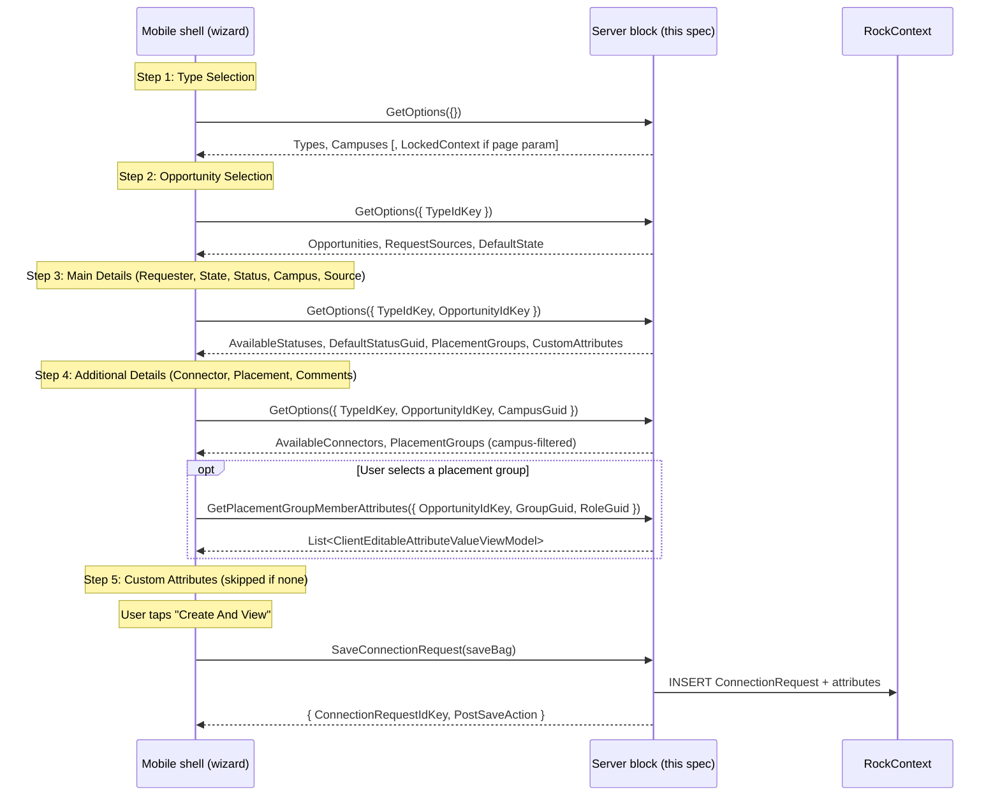

# Add Connection Request V2 (Mobile) Backend

## Summary

This is the backend half of the new mobile **Add Connection Request V2** block, the sixth block in the Connections revamp port. It backs the native **multi-step wizard** (5 pages) a connector walks through after tapping the floating "Add Connection Request" button on the Connection Opportunity Detail block. This spec covers only the server-side code in the Develop repo: a new mobile `RockBlockType` that returns cascading option lists, placement groups, and custom attribute definitions; validates and saves the new request (including placement and attribute values); returns the new request's IdKey; and delivers a `Post Save Action` (`MobileNavigationActionField`) setting the shell honors after save. The mobile shell (the wizard pages, field rendering, navigation, persistence) is specified separately in [the mobile shell spec](../../RM/specs/260616-mobile-add-connection-request-shell.md).

Per the locked V2 convention, the block is named **`AddConnectionRequestV2`** (display name "Add Connection Request V2"), mirroring the existing native mobile `AddConnectionRequest` block at `1380115A`, which is left intact.

**Design update (2026-06-22):** the original spec described a single cover-sheet form with 9 fields and cascading dropdowns. The Figma mockup redesigns the flow as a **5-page wizard** (Type > Opportunity > Main Details > Additional Details > Custom Attributes) with Back/Continue navigation. Placement groups and custom attributes are now **in scope** (previously deferred to block 5).

## Motivation

- The new [Connection Opportunity Detail](260609-mobile-connection-opportunity-detail.md) screen surfaces a floating "Add Connection Request" button that needs a destination. Reusing the existing `AddConnectionRequest` (`1380115A`) is rejected: it predates the revamp, ships with Lava `FormTemplate` customizations, and depends on legacy `Guid`-keyed page parameters.
- The web Connections Hub uses a focused [Add Connection Request modal](../Rock.JavaScript.Obsidian.Blocks/src/Engagement/ConnectionsHub/addConnectionRequestModal.partial.obs) (Obsidian). Mobile v1 ports that focused flow, enhanced with placement groups and custom attributes on the Add form (the web defers both to the docked panel).
- Backward compatibility is a hard rule; the new block ships alongside the existing one.

## Scope

- In scope:
  - **Cascading option queries:** types, opportunities-for-type, request sources-for-type, statuses-for-opportunity, connectors-for-opportunity-and-campus, placement-groups-for-opportunity (all groups; each carries its campus for client-side filtering), custom-attribute-definitions-for-type.
  - **Locked context:** when launched with a `ConnectionOpportunity` IdKey page parameter, return the opportunity's Type already resolved and locked (the shell skips the Type and Opportunity wizard steps).
  - **Placement group member attributes:** a separate lazy action returning `ClientEditableAttributeValueViewModel` list for a given group+role combo.
  - **Validation + persistence:** create a new `ConnectionRequest`, set fields including placement and custom attributes, save, return the new IdKey.
  - **Security:** VIEW on `ConnectionType` for the cascade; EDIT on the type to save.
  - **Post Save Action** (`MobileNavigationActionField`) block setting.
- Out of scope (this spec):
  - All mobile UI (see shell spec).
  - Manual workflow launch, create-new-person inline from the Requester picker, request-security editing.
  - The floating Add button itself (lives in the Connection Opportunity Detail block).

## Requirements

### Functional (server)

- The block MUST accept an **optional** `ConnectionOpportunity` page parameter (IdKey). When present, the block resolves the opportunity, authorizes VIEW on its type, and surfaces the opportunity (and type) as the wizard's locked initial selection (the shell skips steps 1 and 2). Missing/inactive opportunity -> `ActionBadRequest`. Unauthorized -> `ActionUnauthorized`.

- When launched **without** a `ConnectionOpportunity` page parameter, the block surfaces the list of types the current person has VIEW on.

- The block MUST expose a **`GetOptions`** block action returning options for the current wizard state. The request carries `TypeIdKey?`, `OpportunityIdKey?`, `CampusGuid?`, and `RequesterPersonGuid?` (used to default the Campus field from the requester's primary campus); the response carries:

  | Returned field | When populated | Source |
  |---|---|---|
  | `Types` | Always | `ConnectionTypeService.GetConnectionTypesQuery()` filtered by `GetViewAuthorizedConnectionTypes()` for the current person, ordered by Order/Name. `{ IdKey, Name, IconCssClass, Description }`. |
  | `Campuses` | Always | Active campuses, ordered. `ListItemViewModel`. |
  | `Opportunities` | TypeIdKey set | Type's active opportunities the user has VIEW on. `{ IdKey, Name, IconCssClass, Description }`. |
  | `RequestSources` | TypeIdKey set | Type's `ConnectionTypeSources` (active, ordered). `ListItemViewModel`. |
  | `DefaultState` | TypeIdKey set | Always `Active` (hard-coded). |
  | `AvailableStatuses` | OpportunityIdKey set | Type's `ConnectionStatuses` (active, ordered). `{ Name, Value (Guid), Color }`. |
  | `DefaultStatusGuid` | OpportunityIdKey set | Type's default status Guid. |
  | `AvailableConnectors` | OpportunityIdKey set | Opportunity's connector-group members, campus-filtered, plus the current person injected as self-assignable. `{ PersonGuid, FullName, PhotoUrl, CampusGuid }`. |
  | `PlacementGroups` | OpportunityIdKey set | Opportunity's placement groups (NOT campus-filtered server-side: all groups are returned, each carrying its `CampusGuid` for the shell to filter client-side). Each carries Roles (with Statuses). Reuses `PlacementGroupItemBag` shape from block 5. |
  | `CustomAttributes` | OpportunityIdKey set | Editable custom attributes for a new `ConnectionRequest` of this type. `List<ClientEditableAttributeValueViewModel>`. Empty when the type has no mobile-supported attributes. |
  | `RequesterPrimaryCampusGuid` | RequesterPersonGuid set | The requester's primary campus Guid, used to default the Campus field. `null` when the requester has none. |
  | `LockedContext` | First call with incoming page param | `{ TypeIdKey, OpportunityIdKey }`. |

  The action is safe to call repeatedly. Subsequent calls do not return `LockedContext`.

- The block MUST expose a **`GetPlacementGroupMemberAttributes`** block action. Request: `{ OpportunityIdKey, GroupGuid, GroupMemberRoleGuid }`. Response: `{ List<ClientEditableAttributeValueViewModel> Attributes }`. Creates an empty `GroupMember` for the resolved group+role, `LoadAttributes()`, restores no saved values (new request), and returns the attributes mapped via `GetPublicAttributesForEdit()` + `GetPublicAttributeValuesForEdit()` (edit-shaped `Value` seeding, same pattern as block 5's `GetPlacementGroupMemberAttributes`). Auth: EDIT on the opportunity's type.

- The block MUST expose a **`SaveConnectionRequest`** block action:

  ```csharp
  public class SaveConnectionRequestBag
  {
      public Guid RequesterPersonGuid { get; set; }               // required
      public string OpportunityIdKey { get; set; }                // required
      public Guid? ConnectorPersonGuid { get; set; }              // optional (null = no connector)
      public Guid? ConnectionTypeSourceGuid { get; set; }         // optional
      public ConnectionState State { get; set; }                  // required, default Active
      public DateTimeOffset? FollowupDate { get; set; }           // required when State == FutureFollowUp
      public Guid? CampusGuid { get; set; }                       // optional
      public Guid StatusGuid { get; set; }                        // required
      public string Comments { get; set; }                        // optional
      public Guid? PlacementGroupGuid { get; set; }               // optional
      public Guid? PlacementGroupMemberRoleGuid { get; set; }     // required when PlacementGroupGuid set
      public GroupMemberStatus? PlacementGroupMemberStatus { get; set; }  // GroupMemberStatus enum
      public Dictionary<string, string> PlacementGroupMemberAttributeValues { get; set; }
      public Dictionary<string, string> AttributeValues { get; set; }  // connection request custom attrs
  }
  ```

  Validation (server-enforced): unknown/inactive opportunity -> `ActionBadRequest`; EDIT on type -> required; requester required; status must belong to the type; state is Active/Inactive/FutureFollowUp (Connected rejected); FutureFollowUp -> FollowupDate required; source (if provided) belongs to the type; placement group (if provided) belongs to the opportunity and role belongs to the group.

  Save creates the `ConnectionRequest`, sets all fields. **Placement:** when `PlacementGroupGuid` is set, resolves the group, sets `AssignedGroupId`, `AssignedGroupMemberRoleId`, `AssignedGroupMemberStatus`, and persists `AssignedGroupMemberAttributeValues` as JSON (same field block 5's `ApplyPlacementGroup` writes). **Custom attributes:** after creating the request, `LoadAttributes()`, `SetPublicAttributeValues(bag.AttributeValues)`, `SaveAttributeValues()`. **Connector activity:** when a connector is set, the block records a connector-assigned `ConnectionRequestActivity` (ASSIGNED activity type) for the new request.

  On success returns `{ ConnectionRequestIdKey, PostSaveAction }`.

- The block MUST deliver the `Post Save Action` (`MobileNavigationActionField`) block setting via `GetMobileConfigurationValues()`. Default: `PopSinglePageValue` (close the wizard). Pattern matches [AddContact.cs](../Rock/Blocks/Types/Mobile/Engagement/AddContact.cs).

### Non-functional / conventions

- Single new `BlockTypeGuid` shared between repos (inline string literal, no SystemGuid constant).
- Server block at `Develop/Rock.Blocks/Mobile/Connection/AddConnectionRequestV2.cs`, namespace `Rock.Blocks.Mobile.Connection`.
- `RequiredMobileVersion => new Version( 1, 20 )`. Rock core v20.
- Leave the existing `AddConnectionRequest` (`1380115A`) intact.

## Design

### Server block identity

| Piece | Path | Notes |
|---|---|---|
| New server block | `Develop/Rock.Blocks/Mobile/Connection/AddConnectionRequestV2.cs` | `[DisplayName("Add Connection Request V2")]`, new `EntityTypeGuid` + `BlockTypeGuid` inline literals. |
| Old server block | `Develop/Rock/Blocks/Types/Mobile/Connection/AddConnectionRequest.cs` | Untouched. |

### Block settings

| Setting | Field type | Key | Default | Purpose |
|---|---|---|---|---|
| Post Save Action | `MobileNavigationActionField` | `PostSaveAction` | `PopSinglePageValue` | Navigation the shell performs after save. Default pops the wizard. Admins may override to push Connection Request Detail with the new IdKey. |

Page parameter `ConnectionOpportunity` (PascalCase IdKey, optional) is read from incoming parameters.

### Data flow (multi-step wizard)



When launched with a `ConnectionOpportunity` page parameter, the shell skips steps 1 and 2 entirely. The first `GetOptions` call passes the locked `TypeIdKey` + `OpportunityIdKey`, and the server returns the full option set (Types, Opportunities, Statuses, Connectors, PlacementGroups, CustomAttributes, LockedContext) in a single response.

### Custom attributes on Add

Custom attributes for `ConnectionRequest` are defined at the `ConnectionType` level (entity attributes with `EntityTypeId` = `ConnectionRequest` and optionally `EntityTypeQualifierColumn` = `ConnectionTypeId`, `EntityTypeQualifierValue` = the type's Id). The server:

1. Creates a temporary in-memory `ConnectionRequest` with `ConnectionOpportunityId` set.
2. Calls `entity.LoadAttributes( rockContext )`.
3. Calls `entity.GetPublicAttributesForEdit( currentPerson, enforceSecurity: true )` to get the editable set.
4. Seeds each value via `entity.GetPublicAttributeValuesForEdit( currentPerson, enforceSecurity: true )` (edit-shaped `Value`), filtered to supported mobile field types.
5. Returns only attributes whose `FieldTypeGuid` maps to a known mobile `FieldType` (same check block 5 uses).

On save, after creating and saving the `ConnectionRequest`, the block calls `LoadAttributes()`, `SetPublicAttributeValues( bag.AttributeValues, currentPerson, enforceSecurity: true )`, `SaveAttributeValues( rockContext )`.

### Placement groups on Add

Reuses the same data source as block 5's placement group editor: `ConnectionOpportunity.PlacementGroups` (active groups). The server does NOT campus-filter: it returns all placement groups for the opportunity, each carrying its `CampusGuid` so the shell can filter by campus client-side. Each group carries its Roles (with member statuses). On save, sets `AssignedGroupId`, `AssignedGroupMemberRoleId`, `AssignedGroupMemberStatus`, and serializes `PlacementGroupMemberAttributeValues` as JSON to `AssignedGroupMemberAttributeValues`.

### Contracts

Bags and enums live in `Rock.Common.Mobile` (RM repo). The server references the built DLL. New bags under `Rock.Common.Mobile/Blocks/Connection/AddConnectionRequestV2/`:

- `Configuration` { `MobileNavigationActionViewModel PostSaveAction` }
- `GetOptionsRequestBag` { `TypeIdKey?`, `OpportunityIdKey?`, `CampusGuid?`, `RequesterPersonGuid?` }
- `GetOptionsResponseBag` { Types, Opportunities, RequestSources, AvailableStatuses, AvailableConnectors, Campuses, PlacementGroups, CustomAttributes, DefaultState?, DefaultStatusGuid?, RequesterPrimaryCampusGuid?, LockedContext? }
- `ConnectionTypeOptionBag` { `IdKey`, `Name`, `IconCssClass`, `Description` }
- `ConnectionOpportunityOptionBag` { `IdKey`, `Name`, `IconCssClass`, `Description` }
- `ConnectorOptionBag` { `PersonGuid`, `FullName`, `PhotoUrl`, `CampusGuid` }
- `LockedContextBag` { `TypeIdKey`, `OpportunityIdKey` }
- `SaveConnectionRequestBag` (shown above)
- `SaveConnectionRequestResponseBag` { `ConnectionRequestIdKey`, `PostSaveAction` }
- `GetPlacementGroupMemberAttributesRequestBag` { `OpportunityIdKey`, `GroupGuid`, `GroupMemberRoleGuid` }
- `GetPlacementGroupMemberAttributesResponseBag` { `List<ClientEditableAttributeValueViewModel> Attributes` }

Reused from other blocks (do NOT redefine):
- `ConnectionStatusItemBag` from `Rock.Common.Mobile/Blocks/Connection/ConnectionRequestDetailV2/`
- `PlacementGroupItemBag` from `Rock.Common.Mobile/Blocks/Connection/ConnectionRequestDetailV2/`
- `ConnectionState` enum from `Rock.Common.Mobile/Enums/`
- `ClientEditableAttributeValueViewModel` from `Rock.Common.Mobile/ViewModels/`

### Security

- VIEW on `ConnectionType` to surface its cascade data.
- EDIT on `ConnectionType` to save.
- The block does NOT consider `EnableRequestSecurity` on Add (the request does not yet exist).

## Resolved Decisions

(2026-06-16, original spec):
- Launched-from-block-3: Type and Opportunity are prefilled and locked.
- Connector: web parity, members of the opportunity's connector groups, campus-filtered.
- Request Source: `ConnectionTypeSource` (per-type, not a DefinedValue).
- Post-save: `MobileNavigationActionField`, default `PopSinglePageValue`.

(2026-06-22, Figma redesign):
- **Multi-step wizard:** 5 pages (Type > Opportunity > Main Details > Additional Details > Custom Attributes) replaces the original single cover-sheet form.
- **Placement groups in scope:** the Additional Details step (page 4) includes a placement group picker with dependent role/status/member-attributes, mirroring block 5's editor.
- **Custom attributes in scope:** the Custom Attributes step (page 5) shows editable custom attributes inline. Skipped when none exist. Footnote "Some attributes may only be edited on the website." shown when unsupported field types are omitted.
- **Skip steps on locked context:** when launched with a `ConnectionOpportunity` page param, the shell skips steps 1 (Type) and 2 (Opportunity) and lands directly on step 3 (Main Details).
- **Single GetOptions + Save:** one cascading `GetOptions` action (called per-step with increasing context) and one `SaveConnectionRequest` at the end. No per-step server actions.
- **Connector picker:** bounded `PersonSelector` (from block 5), not the free-text `PersonPicker`. Limited to the opportunity's connector groups.
- **Post-save:** configurable via `MobileNavigationActionField` block setting, default `PopSinglePageValue`.

## Considered but Rejected

### Single cover-sheet form (original spec design)
Rejected (2026-06-22). The Figma redesigned the flow as a multi-step wizard to break a complex form into digestible steps. The wizard is now the spec'd design.

### Per-step server actions (GetTypes, GetOpportunities, GetMainDetailsOptions, ...)
Rejected. A single `GetOptions` action with progressive parameters is simpler and follows the existing cascade pattern. The shell calls it with increasing context as the user advances through steps.

### Free-text PersonPicker for Connector
Rejected. The Figma annotates "Limited to Connector Group based on type." The bounded `PersonSelector` (from block 5) enforces this constraint and matches the web's connector-group rule.

### Create-new-person inline from the Requester picker
Rejected for v1. The mobile PersonPicker requires an existing person.

## Related

- Web Add modal: [addConnectionRequestModal.partial.obs](../Rock.JavaScript.Obsidian.Blocks/src/Engagement/ConnectionsHub/addConnectionRequestModal.partial.obs).
- Web server actions: [ConnectionsHub.cs](../Rock.Blocks/Engagement/ConnectionsHub.cs) `GetConnectionRequestForAddOptions` / `SaveConnectionRequest`.
- MobileNavigationAction pattern: [AddContact.cs](../Rock/Blocks/Types/Mobile/Engagement/AddContact.cs).
- Old server block (intact): [AddConnectionRequest.cs](../Rock/Blocks/Types/Mobile/Connection/AddConnectionRequest.cs).
- Caller: [Connection Opportunity Detail](260609-mobile-connection-opportunity-detail.md) (its `Add Page` setting points here).
- Post-save target: [Connection Request Detail](260610-mobile-connection-request-detail.md).
- Shell spec: [../../RM/specs/260616-mobile-add-connection-request-shell.md](../../RM/specs/260616-mobile-add-connection-request-shell.md).
- Block 5 placement pattern: [Connection Request Detail V2](260610-mobile-connection-request-detail.md) (placement group editor + member attributes).
