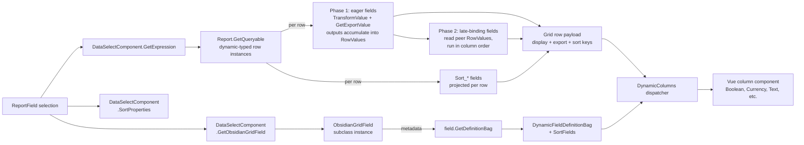

# DataSelectComponent Obsidian Grid Rendering

## Summary

Rock's [`DataSelectComponent`](Rock/Reporting/DataSelectComponent.cs) base class exposes a WebForms-only `GetGridField(Type, string)` method that returns a `System.Web.UI.WebControls.DataControlField` describing how the selected value renders as a column in the report's WebForms `Grid`. That method is the last remaining WebForms-only piece of the DataSelect contract, blocking a future Obsidian ReportDetail block (which ships in a later Rock version, not this changeset — the framework lands first so plugin authors have a grace-period window to add their own `GetObsidianGridField` overrides before any shipped Obsidian ReportDetail block starts consuming them). This spec introduces a parallel, Obsidian-facing virtual method that returns a typed `ObsidianGridField` object, plus a hierarchy of Rock-owned subclasses: seven root-tier leaves that each map to a Vue column type (Text, Html, Boolean, Number, Currency, Date, DateTime), and four value-shaping subclasses that build on the roots to preserve WebForms fidelity (`LabelObsidianGridField`, `PhoneObsidianGridField`, `ListObsidianGridField`, `LavaObsidianGridField`). Each subclass knows its Vue column type, how to project its raw expression value into whatever the Vue column expects, and how to produce the wire-side [`DynamicFieldDefinitionBag`](Rock.ViewModels/Core/Grid/DynamicFieldDefinitionBag.cs) that already ships from the [`DynamicData` block](Rock.Blocks/Reporting/DynamicData.cs). Transforms receive a per-row `ObsidianGridFieldContext` POCO carrying the request `RockContext`, the raw dynamic-typed row instance, a list of per-column descriptors, and (for fields that opt in via `ReadsPeerValues`) a dictionary of peer columns' transformed outputs, so Lava templates that reference other columns still work. Plugin authors add domain-specific rendering by subclassing a root or a shipped value-shaping subclass, following the exact pattern Rock uses. The design mirrors the `GetComponentDefinition` / `GetObsidianComponentData` split already used for the admin configuration UI, keeps the WebForms method untouched, and defers deprecating `GetGridField` until the Obsidian ReportDetail block has replaced its WebForms counterpart.

## Motivation

The Obsidian conversion of Data Views and Reports is otherwise ready: [`DataFilterComponent`](Rock/Reporting/DataFilterComponent.cs) and [`DataSelectComponent`](Rock/Reporting/DataSelectComponent.cs) both received the `GetComponentDefinition` / `GetObsidianComponentData` / `GetSelectionFromObsidianComponentData` methods in the v18/v19 wave, enabling their configuration UIs to run in Obsidian. The remaining WebForms coupling is on the runtime rendering side: [`ReportingHelper.BindGrid`](Rock/Reporting/ReportingHelper.cs) is the production path that builds the report grid today, calling `selectComponent.GetGridField(...)` per column and attaching the returned `DataControlField` to a WebForms `Grid`. There is no equivalent path for an Obsidian `Grid`.

The Obsidian [`DynamicData` block](Rock.Blocks/Reporting/DynamicData.cs) has already solved the Obsidian side of this problem for its own use case: it defines a small set of column-type strings (`boolean`, `currency`, `date`, `dateTime`, `html`, `number`, `person`, `text`), maps them to Vue column components via a `columnComponents` dictionary in [`dynamicData.obs`](Rock.JavaScript.Obsidian.Blocks/src/Reporting/dynamicData.obs), and ships column metadata to the client through [`DynamicFieldDefinitionBag`](Rock.ViewModels/Core/Grid/DynamicFieldDefinitionBag.cs). We want DataSelects to describe their column using the same vocabulary so the Obsidian ReportDetail block can consume DynamicData's rendering pipeline unchanged, and so that other blocks that want to expose dynamic column shapes (list blocks, list-block plugins) can eventually adopt the same hierarchy.

Without this contract, converting ReportDetail to Obsidian either forces every DataSelect column into a plain text render (losing currency alignment, boolean check icon, HTML columns) or requires the ReportDetail block to hard-code column-type dispatch based on `ColumnFieldType`, duplicating logic that belongs on each DataSelect.

## Requirements

- `DataSelectComponent` MUST expose a virtual method that returns an `ObsidianGridField` describing how the selected value renders in an Obsidian `Grid`. The method MUST live outside the `#if WEBFORMS` block so Obsidian-only assemblies can call it.
- The base class implementation MUST return a working default derived from `ColumnFieldType`, using a mapping compatible with the one [`DynamicData.GetColumnTypeFromDataType`](Rock.Blocks/Reporting/DynamicData.cs) uses today. DataSelects that only expose a scalar type via `ColumnFieldType` MUST work without any override.
- The method MUST NOT return `null`. The base default always returns an `ObsidianGridField`, and any override that returns `null` is a programmer error. Consumers MAY assume a non-null return and are not required to guard against it.
- The `ObsidianGridField` hierarchy MUST be closed to plugin subclassing at the abstract base level: only Rock ships the abstract base and its root-tier subclasses. Plugins with custom rendering needs subclass one of the root-tier subclasses (typically `TextObsidianGridField` or `HtmlObsidianGridField`) or a Rock-shipped value-shaping subclass, and override the value-projection hook.
- Each built-in subclass MUST seal its `ColumnType`. Plugin subclasses inherit whatever column type the built-in leaf declares.
- `ObsidianGridField` MUST produce a [`DynamicFieldDefinitionBag`](Rock.ViewModels/Core/Grid/DynamicFieldDefinitionBag.cs) so the wire contract stays consistent with what DynamicData already ships. No new wire-side bag is introduced.
- `ObsidianGridField` MUST support projecting the raw value produced by the DataSelect's expression into the shape the Vue column expects. The transform MUST be a server-side method; it MUST NOT appear on the wire bag.
- The transform hook MUST receive per-row context at call time via an `ObsidianGridFieldContext` POCO that carries the request-scoped `RockContext`, the raw dynamic-typed `RowObject`, an `IReadOnlyList<ObsidianGridColumnDescriptor>` describing the grid's columns, an optional `RowValues` dictionary of peer transformed outputs, and a typed cache accessor (`GetCache<T>()`) whose backing store is shared across every row of one report render. The `ObsidianGridField` instance MUST NOT store `RockContext`, `RockRequestContext`, or per-row state on itself. The instance is intended to be usable across requests without state accumulation. The `ObsidianGridFieldContext` type MUST be extensible (properties added over time) so future context additions do not force method-signature changes.
- `ObsidianGridField` MUST expose a virtual `ReadsPeerValues` property (default false). Fields that need peer-column transformed values (e.g. `LavaObsidianGridField`) MUST set this to true. The output helper MUST run eager (non-late) fields first for each row, accumulate their `TransformValue` outputs into a per-row `RowValues` dictionary keyed by merge key, then run late-binding fields in column order. Each late-binding field's own `TransformValue` output MUST be added to `RowValues` before the next late-binding field runs. Eager fields MUST receive `RowValues = null`; late-binding fields MUST receive a populated dictionary.
- The existing `GetGridField` method and every current override MUST continue to work unchanged. WebForms `ReportDetail.ascx` MUST render identically after this change.
- The change MUST NOT introduce a hard dependency on `System.Web` types in any Obsidian-buildable assembly, with the standard exception of `System.Web.HttpUtility` (which is supported in .NET Core and is permitted where an equally good alternative is not available). All new types MUST compile outside `#if WEBFORMS`.
- `ObsidianGridField` MUST expose a `GetExportValue` virtual whose default returns null (meaning "use the display value for export"). The output helper MUST project the return into a paired `{Name}__export` field per row. Row serialization SHOULD omit fields whose value is null so identity-export cells cost zero wire bytes; where the serializer does not naturally support this, the Vue-side fallback still yields correct behavior. The Vue side MUST configure column `exportValue` props to prefer the paired field and fall back to the display field when the paired field is absent or null. v1 SHIPS the machinery but does NOT override `GetExportValue` on any built-in subclass, matching WebForms behavior exactly (raw HTML in Excel cells, raw booleans as TRUE/FALSE). Future "better than WebForms" export improvements land as opt-in subclass overrides.
- The output helper MUST project `DataSelectComponent.SortProperties(selection)` results as extra fields on each row and populate `DynamicFieldDefinitionBag.SortFields` with their names. The Vue column's `sortValue` reads them so click-sort matches the WebForms sort order for DataSelects that declare custom sort properties.
- `GetGridField` MUST NOT be marked `[Obsolete]` in this spec's changeset. Its deprecation is deferred until the Obsidian ReportDetail block replaces the WebForms version in the shipped product.

## Design

### High-level shape



A new internal helper class, [`ObsidianReportGridBuilder`](Rock/Reporting/ObsidianReportGridBuilder.cs), walks each `ReportField`, asks its DataSelect for an `ObsidianGridField`, and drives a two-phase materialization: eager fields first (accumulating outputs into a per-row `RowValues` dict when late-binding fields exist), then late-binding fields (in column order) with `RowValues` populated. The Vue side reuses the `DynamicColumns` dispatcher already shipping with DynamicData. See Design → "Obsidian report grid helper" for the class shape and rationale.

### The `ObsidianGridField` hierarchy

New files under `Rock/Obsidian/UI/GridField/` in the `Rock.Obsidian.UI.GridField` namespace:

```csharp
/// <summary>
/// Per-row context supplied to <see cref="ObsidianGridField.TransformValue"/>.
/// The output helper builds one instance per row and reuses the same caches
/// backing store across every row of a single report render, so memoized
/// lookups accumulate across the whole grid build.
/// </summary>
public class ObsidianGridFieldContext
{
    // Shared across every row of one report render; ConcurrentDictionary
    // chosen so GetCache<T> stays safe if the row-materialization loop is
    // ever refactored to be multi-threaded.
    private readonly ConcurrentDictionary<Type, object> _caches;

    /// <summary>Request-scoped RockContext for lookups.</summary>
    public RockContext RockContext { get; }

    /// <summary>
    /// The raw dynamic-typed row instance produced by the report query. All
    /// columns' raw expression outputs are accessible as public fields on this
    /// object; consumers typically use
    /// <see cref="ObsidianGridColumnDescriptor.SourceFieldName"/> to look them
    /// up via reflection when they need raw peer values.
    /// </summary>
    public object RowObject { get; }

    /// <summary>
    /// Per-column metadata for every column in the current grid, in the order
    /// the output helper registered them. Late-binding fields iterate this
    /// collection to find peer columns and read their transformed outputs
    /// from <see cref="RowValues"/>.
    /// </summary>
    public IReadOnlyList<ObsidianGridColumnDescriptor> Columns { get; }

    /// <summary>
    /// The <see cref="ObsidianGridField.TransformValue"/> outputs of prior
    /// columns for the current row, keyed by
    /// <see cref="ObsidianGridColumnDescriptor.MergeKey"/>. Populated by the
    /// output helper ONLY for fields whose
    /// <see cref="ObsidianGridField.ReadsPeerValues"/> is <c>true</c>; for
    /// eager fields this is <c>null</c>. When multiple late-binding fields
    /// exist, they run in column order and <c>RowValues</c> accumulates each
    /// one's output before the next runs.
    /// </summary>
    public IReadOnlyDictionary<string, object> RowValues { get; }

    public ObsidianGridFieldContext(
        RockContext rockContext,
        object rowObject,
        IReadOnlyList<ObsidianGridColumnDescriptor> columns,
        IReadOnlyDictionary<string, object> rowValues,
        ConcurrentDictionary<Type, object> sharedCaches )
    {
        RockContext = rockContext;
        RowObject = rowObject;
        Columns = columns;
        RowValues = rowValues;
        _caches = sharedCaches;
    }

    /// <summary>
    /// Returns a per-report-render cache of type <typeparamref name="T"/>,
    /// allocating it on first access. The same instance is returned to every
    /// field's <see cref="ObsidianGridField.TransformValue"/> call for the
    /// current report render, so lookups memoized on one row are available
    /// on all subsequent rows.
    /// </summary>
    /// <typeparam name="T">
    /// The caller-defined cache shape (typically a class with one or more
    /// typed <see cref="Dictionary{TKey,TValue}"/> properties). Type identity
    /// prevents collisions between different fields' caches; a field that
    /// keys by <c>int PersonId</c> for one purpose does not collide with
    /// another field that keys by <c>int</c> for a different purpose because
    /// each defines its own cache type.
    /// </typeparam>
    public T GetCache<T>() where T : class, new()
    {
        return (T)_caches.GetOrAdd( typeof( T ), _ => new T() );
    }
}

/// <summary>
/// Metadata describing a single column in the grid. The output helper
/// populates one descriptor per column and exposes the collection on
/// <see cref="ObsidianGridFieldContext.Columns"/>.
/// </summary>
public class ObsidianGridColumnDescriptor
{
    /// <summary>The friendly merge-key (e.g. "FirstName"), used as the key in RowValues.</summary>
    public string MergeKey { get; }

    /// <summary>Runtime dynamic-type field name for reading raw values from RowObject.</summary>
    public string SourceFieldName { get; }

    /// <summary>The ObsidianGridField instance registered for this column.</summary>
    public ObsidianGridField Field { get; }

    public ObsidianGridColumnDescriptor( string mergeKey, string sourceFieldName, ObsidianGridField field )
    {
        MergeKey = mergeKey;
        SourceFieldName = sourceFieldName;
        Field = field;
    }
}

public abstract class ObsidianGridField
{
    /// <summary>
    /// Internal so only Rock.dll can add new column-type roots. Plugins extend
    /// the hierarchy by subclassing one of the sealed built-in leaves
    /// (typically <see cref="TextObsidianGridField"/> or
    /// <see cref="HtmlObsidianGridField"/>).
    /// </summary>
    internal ObsidianGridField() { }

    /// <summary>The Obsidian grid column-type string this field maps to.</summary>
    public abstract string ColumnType { get; }

    /// <summary>
    /// When true, this field runs in the late-binding pass AFTER all non-late
    /// fields have been transformed for the current row. The output helper
    /// populates <see cref="ObsidianGridFieldContext.RowValues"/> with the
    /// transformed outputs of prior columns; late-binding fields read from it.
    /// Multiple late-binding fields run in column order, with RowValues
    /// updated after each. Default is false; the only shipped subclass that
    /// opts in is <see cref="LavaObsidianGridField"/>.
    /// </summary>
    public virtual bool ReadsPeerValues => false;

    /// <summary>
    /// Projects the raw value produced by
    /// <see cref="DataSelectComponent.GetExpression"/> into whatever the Vue
    /// column expects. Default is identity. Subclasses override when the raw
    /// value shape does not match what the Vue column expects, or when peer
    /// column values are needed (via <paramref name="context"/>.RowValues, for
    /// fields that set <see cref="ReadsPeerValues"/> to true).
    /// </summary>
    /// <param name="rawValue">Raw value for this column on the current row.</param>
    /// <param name="context">
    /// Per-row context, supplied at call time so the field instance itself
    /// remains stateless and safely reusable across requests. Includes the
    /// request-scoped <see cref="ObsidianGridFieldContext.RockContext"/> and
    /// the raw row dictionary for cross-column templates.
    /// </param>
    public virtual object TransformValue( object rawValue, ObsidianGridFieldContext context )
        => rawValue;

    /// <summary>
    /// Produces the value used for Excel / CSV export of this cell. Returns
    /// null by default, which the output helper and Vue side both interpret
    /// as "no distinct export value; use the display value." Subclasses
    /// override when the exported shape should differ from what renders on
    /// screen (e.g. stripping HTML markup, sending "Yes"/"No" instead of raw
    /// booleans, extracting inner text from a single-anchor cell).
    /// </summary>
    /// <remarks>
    /// The output helper projects the return into a paired {name}__export
    /// field on each row. Row-serialization SHOULD omit fields whose value is
    /// null so identity-export cells cost zero wire bytes; where the serializer
    /// does not naturally support this, the Vue-side fallback still yields
    /// correct behavior. The Vue side configures every column's exportValue
    /// prop to prefer the paired field when it is present and non-null, and
    /// fall back to the display field otherwise. No per-column configuration,
    /// no marker on the wire bag.
    /// </remarks>
    public virtual object GetExportValue( object rawValue, ObsidianGridFieldContext context )
        => null;

    /// <summary>
    /// Populates the per-column-type props flowed to Vue via
    /// <see cref="DynamicFieldDefinitionBag.FieldProperties"/>. Empty by
    /// default; subclasses that expose typed props override.
    /// </summary>
    protected virtual Dictionary<string, object> GetFieldProperties()
        => new Dictionary<string, object>();

    /// <summary>
    /// Produces the wire bag consumed by the Obsidian Grid. Non-virtual by
    /// design; subclasses influence the output via <see cref="ColumnType"/>
    /// and <see cref="GetFieldProperties"/>. The output helper additionally
    /// populates SortFields (from <see cref="DataSelectComponent.SortProperties"/>)
    /// on the returned bag after this method runs. Export handling does not
    /// need a bag flag; see <see cref="GetExportValue"/>.
    /// </summary>
    public DynamicFieldDefinitionBag GetDefinitionBag()
    {
        return new DynamicFieldDefinitionBag
        {
            ColumnType = ColumnType,
            FieldProperties = GetFieldProperties()
        };
    }
}
```

### Wire bag additions

One new property on [`DynamicFieldDefinitionBag`](Rock.ViewModels/Core/Grid/DynamicFieldDefinitionBag.cs), populated by the output helper (not by the field itself). Existing `DynamicData` consumers ignore the field; behavior is preserved.

```csharp
/// <summary>
/// Names of fields on the row bag to use as sort keys for this column,
/// in priority order. Empty = client sorts by the display value on Name.
/// Populated from DataSelectComponent.SortProperties(selection).
/// </summary>
public List<string> SortFields { get; set; }
```

Export doesn't get a bag flag because per-row null handling covers it: the output helper always projects the paired `{Name}__export` field via the field's `GetExportValue`. Rows where the method returns null (the base default) can be omitted from the wire payload by the row serializer when it supports null-skipping; when it doesn't, the values simply travel as null and the Vue side treats them the same as absent. The DynamicColumns dispatcher configures every column's `exportValue` prop to prefer `row[Name + "__export"]` when it is present and non-null, and fall back to `row[Name]` otherwise. No per-column configuration, no marker to remember to set.

### Using the per-render cache

A field that resolves the same value repeatedly across rows (a DefinedValue display text, a Campus name, a resolved attribute) can memoize via `ObsidianGridFieldContext.GetCache<T>()`. Author defines a private cache type; each call to `GetCache<T>` on any row's context returns the same instance for the current report render.

The following is an **excerpt** showing only the cache pattern on `LabelObsidianGridField`; the authoritative class definition (including `LabelType` and the full body) lives in the value-shaping subclasses code block below.

```csharp
public class LabelObsidianGridField : HtmlObsidianGridField
{
    // LabelType and other members omitted for brevity; see full definition below.

    private class DefinedValueCacheState
    {
        public Dictionary<int, string> DisplayText { get; } = new();
    }

    public override object TransformValue( object rawValue, ObsidianGridFieldContext context )
    {
        if ( rawValue is not int definedValueId )
        {
            return null;
        }

        var cache = context.GetCache<DefinedValueCacheState>();
        if ( !cache.DisplayText.TryGetValue( definedValueId, out var text ) )
        {
            text = DefinedValueCache.Get( definedValueId )?.Value ?? string.Empty;
            cache.DisplayText[definedValueId] = text;
        }

        return $"<span class=\"label label-default\">{HttpUtility.HtmlEncode( text )}</span>";
    }
}
```

Multiple fields on the same report can share a cache type if they truly resolve identical keys; more commonly each field defines its own private cache class so type identity keeps them isolated. `DefinedValueCache.Get` itself is already a memory-cache hit — memoizing catches its per-call string-allocation overhead, which measured ~10x savings in the Check-in v2 tight loops that established this pattern.

Seven sealed built-in subclasses ship in v1:

```csharp
public class TextObsidianGridField : ObsidianGridField
{
    public sealed override string ColumnType => "text";
}

public class HtmlObsidianGridField : ObsidianGridField
{
    public sealed override string ColumnType => "html";
}

public class BooleanObsidianGridField : ObsidianGridField
{
    public sealed override string ColumnType => "boolean";
}

public class NumberObsidianGridField : ObsidianGridField
{
    public sealed override string ColumnType => "number";
}

public class CurrencyObsidianGridField : ObsidianGridField
{
    public sealed override string ColumnType => "currency";
}

public class DateObsidianGridField : ObsidianGridField
{
    public sealed override string ColumnType => "date";
}

public class DateTimeObsidianGridField : ObsidianGridField
{
    public sealed override string ColumnType => "dateTime";
}
```

The seven column-type roots are the only classes with a `sealed override ColumnType`; they are the only Rock-owned entry points to a Vue column component. Value-shaping subclasses (Rock-shipped or plugin-authored) inherit a root's ColumnType and override `TransformValue` to coerce a domain-shaped raw value into whatever that root's Vue column expects. The base class's `internal` ctor prevents subclasses of `ObsidianGridField` itself from being added outside `Rock.dll`, so the closed set of seven wire column types is guaranteed.

Rock ships four additional value-shaping subclasses in v1 to preserve fidelity with WebForms behavior the 28-file sweep identified as lost by default:

```csharp
/// <summary>
/// Renders a value as a Rock-styled label (badge) via server-rendered HTML.
/// Backs the DefinedValueField behavior of attribute-typed DataSelects.
/// </summary>
public class LabelObsidianGridField : HtmlObsidianGridField
{
    /// <summary>
    /// Rock label CSS suffix (e.g. "info", "success", "warning", "danger",
    /// "default"). Consumers set this to control the badge color.
    /// </summary>
    public string LabelType { get; set; } = "default";

    public override object TransformValue( object rawValue, ObsidianGridFieldContext context )
    {
        // Emit <span class="label label-{LabelType}">{HtmlEncode(rawValue)}</span>.
    }
}

/// <summary>
/// Renders a phone number as a tel: link via server-rendered HTML. Restores
/// the click-to-dial affordance PhoneNumberSelect had in WebForms without
/// depending on the inline javascript: PBX handler (which does not survive
/// an Obsidian SPA).
/// </summary>
public class PhoneObsidianGridField : HtmlObsidianGridField
{
    public override object TransformValue( object rawValue, ObsidianGridFieldContext context )
    {
        // Emit <a href="tel:{normalized}">{formatted}</a>.
    }
}

/// <summary>
/// Joins an IEnumerable value with a configurable delimiter. Backs the
/// ListDelimitedField and list-shaped CallbackField DataSelects (parent
/// names, related people, group participation, etc.).
/// </summary>
public class ListObsidianGridField : TextObsidianGridField
{
    /// <summary>Delimiter used to join items. Default matches WebForms ListDelimitedField.</summary>
    public string Delimiter { get; set; } = ", ";

    public override object TransformValue( object rawValue, ObsidianGridFieldContext context )
    {
        // Join the IEnumerable with Delimiter; each item rendered via ToString().
    }
}

/// <summary>
/// Resolves a Lava template against the transformed peer-column values for
/// the current row. Backs LiquidSelect, whose whole purpose is to let the
/// Report author write a template that can reference peer columns by name.
/// </summary>
/// <remarks>
/// Opts into the late-binding pass by returning true from
/// <see cref="ReadsPeerValues"/>. The output helper runs all eager (non-late)
/// fields first, populates <see cref="ObsidianGridFieldContext.RowValues"/>
/// with their transformed outputs (keyed by MergeKey), then invokes this
/// field. The template therefore sees the DISPLAY values of peer columns
/// (e.g. a DefinedValue attribute column rendered via LabelObsidianGridField
/// appears as its badge markup rather than as a raw Guid). This differs
/// subtly from the WebForms LavaField path, which gives raw expression
/// values plus a DefinedValueField special-case; the new behavior is more
/// consistent (every column shows its display form) and needs no
/// special-casing of specific field types.
/// </remarks>
public class LavaObsidianGridField : HtmlObsidianGridField
{
    public string LavaTemplate { get; set; }

    public override bool ReadsPeerValues => true;

    public override object TransformValue( object rawValue, ObsidianGridFieldContext context )
    {
        // Merge fields = context.RowValues (transformed peer values).
        // Resolve LavaTemplate; return the resolved HTML string.
    }
}
```

Plugin authors extend the hierarchy the same way Rock does: subclass a built-in leaf (or one of these Rock-shipped value-shaping subclasses), override `TransformValue`, add typed configuration properties as needed. No plugin can invent a new Vue column type; the wire surface stays closed at the seven roots.

### The new virtual on `DataSelectComponent`

Added to [`Rock/Reporting/DataSelectComponent.cs`](Rock/Reporting/DataSelectComponent.cs), outside the `#if WEBFORMS` block:

```csharp
/// <summary>
/// Describes how this DataSelect's value should render as a column in an
/// Obsidian Grid. The default implementation maps
/// <see cref="ColumnFieldType"/> to a built-in Obsidian column type (boolean,
/// currency, date, dateTime, number, text). Override when the raw expression
/// value needs transforming, or when the column configuration depends on
/// <paramref name="selection"/>.
///
/// Overrides MUST return a non-null <see cref="ObsidianGridField"/>. Consumers
/// treat null as a programmer error.
/// </summary>
/// <remarks>
/// Passed <see cref="RockContext"/> and <see cref="RockRequestContext"/>
/// SHOULD only be used during field construction. Do not store them on the
/// returned instance; <see cref="ObsidianGridField.TransformValue"/> receives
/// a per-row <see cref="ObsidianGridFieldContext"/> at call time.
/// </remarks>
public virtual ObsidianGridField GetObsidianGridField(
    Type entityType,
    string selection,
    RockContext rockContext,
    RockRequestContext requestContext )
{
    var t = Nullable.GetUnderlyingType( ColumnFieldType ) ?? ColumnFieldType;
    if ( t == typeof( bool ) )     return new BooleanObsidianGridField();
    if ( t == typeof( decimal ) )  return new CurrencyObsidianGridField();
    if ( t == typeof( DateTime ) ) return new DateTimeObsidianGridField();
    if ( t == typeof( int )
      || t == typeof( long )
      || t == typeof( double )
      || t == typeof( float ) )    return new NumberObsidianGridField();
    return new TextObsidianGridField();
}
```

The parameter list mirrors `GetComponentDefinition` verbatim so DataSelects that already override the config-side method have a familiar shape and access to the same dependencies.

### Sample overrides

**Currency** ([`TotalAmountSelect`](Rock/Reporting/DataSelect/FinancialTransaction/TotalAmountSelect.cs)) needs no override. `ColumnFieldType = typeof(decimal?)` maps to `CurrencyObsidianGridField` via the base default.

**Boolean** ([`HasCompletedProgramSelect`](Rock/Reporting/DataSelect/Person/HasCompletedProgramSelect.cs)) needs no override. `ColumnFieldType = typeof(bool)` maps to `BooleanObsidianGridField` via the base default.

**HTML-emitting DataSelect** ([`PhotoSelect`](Rock/Reporting/DataSelect/Person/PhotoSelect.cs), [`LastNoteSelect`](Rock/Reporting/DataSelect/Person/LastNoteSelect.cs)) overrides to use the HTML column instead of the plain text default:

```csharp
public override ObsidianGridField GetObsidianGridField(
    Type entityType,
    string selection,
    RockContext rockContext,
    RockRequestContext requestContext )
{
    return new HtmlObsidianGridField();
}
```

**Attribute-typed DataSelect** ([`GroupAttributeSelect`](Rock/Reporting/DataSelect/GroupMember/GroupAttributeSelect.cs)) dispatches on the resolved attribute's field type, mirroring the WebForms override. Most Rock field types map to a built-in subclass; unusual field types can be handled by a plugin subclassing `TextObsidianGridField` with a `TransformValue` override that renders the value to a string.

### Consumer sketch (`ObsidianReportGridBuilder`)

Two-phase materialization: for each row, run all eager fields first, then all
late-binding fields (in column order) with `RowValues` populated from prior
outputs. The pre-pass builds a plan per column and the descriptor list; the
per-row loop uses them:

```csharp
// Pre-pass: build one ColumnPlan per ReportField.
var plans = new List<ColumnPlan>();
var descriptors = new List<ObsidianGridColumnDescriptor>();
var seenMergeKeys = new HashSet<string>( StringComparer.OrdinalIgnoreCase );

foreach ( var reportField in orderedReportFields )
{
    var plan = BuildColumnPlan( reportField, ... );
    if ( plan == null ) continue;
    plans.Add( plan );
    descriptors.Add( new ObsidianGridColumnDescriptor( plan.MergeKey, plan.SourceFieldName, plan.Field ) );
}

var eager = plans.Where( p => !p.Field.ReadsPeerValues ).ToList();
var late = plans.Where( p => p.Field.ReadsPeerValues ).ToList();

// Per-row RowValues dictionary; only allocated when late-binding fields exist.
// The entity Id is pre-seeded so Lava templates can reference {{ Id }} the
// same way they could in WebForms; every Report is built from an IEntity
// queryable and Report.GetQueryable always projects Id as a field on the
// runtime dynamic type.
List<Dictionary<string, object>> rowValuesByRow = null;
if ( late.Count > 0 )
{
    rowValuesByRow = new List<Dictionary<string, object>>( rowObjects.Count );
    var idFieldInfo = fieldInfoByName.TryGetValue( "id", out var fi ) ? fi : null;
    for ( int i = 0; i < rowObjects.Count; i++ )
    {
        var dict = new Dictionary<string, object>();
        if ( idFieldInfo != null )
        {
            dict["Id"] = idFieldInfo.GetValue( rowObjects[i] );
        }
        rowValuesByRow.Add( dict );
    }
}

var sharedCaches = new ConcurrentDictionary<Type, object>();

// Phase 1: eager fields. Their transformed outputs accumulate into RowValues.
foreach ( var plan in eager )
{
    for ( int i = 0; i < rowObjects.Count; i++ )
    {
        var raw = plan.SourceFieldInfo?.GetValue( rowObjects[i] );
        var context = new ObsidianGridFieldContext(
            rockContext, rowObjects[i], descriptors, rowValues: null, sharedCaches );

        var transformed = plan.Field.TransformValue( raw, context );
        outputRows[i][plan.CamelName] = transformed;
        rowValuesByRow?[i][plan.MergeKey] = transformed;

        var exportValue = plan.Field.GetExportValue( raw, context );
        if ( exportValue != null )
        {
            outputRows[i][$"{plan.CamelName}__export"] = exportValue;
        }

        // Sort-field projection: for each declared SortProperties entry the
        // plan pre-resolved a FieldInfo pointing at the runtime type's Sort_*
        // backing field. Copy those values into the output row under the
        // client-facing {camelName}__sort_{property} names; DynamicFieldDefinitionBag.SortFields
        // (populated in AddColumnToDefinition) names them for the Vue side.
        if ( plan.SortSourceFieldsByOutKey != null )
        {
            foreach ( var kvp in plan.SortSourceFieldsByOutKey )
            {
                outputRows[i][kvp.Key] = kvp.Value.GetValue( rowObjects[i] );
            }
        }
    }
    AddColumnToDefinition( plan, definition );
}

// Phase 2: late-binding fields, in column order. RowValues is non-null.
foreach ( var plan in late )
{
    for ( int i = 0; i < rowObjects.Count; i++ )
    {
        var raw = plan.SourceFieldInfo?.GetValue( rowObjects[i] );
        var context = new ObsidianGridFieldContext(
            rockContext, rowObjects[i], descriptors, rowValuesByRow[i], sharedCaches );

        var transformed = plan.Field.TransformValue( raw, context );
        outputRows[i][plan.CamelName] = transformed;

        // Late-binding fields also add themselves so subsequent late fields
        // can reference this one.
        rowValuesByRow[i][plan.MergeKey] = transformed;

        var exportValue = plan.Field.GetExportValue( raw, context );
        if ( exportValue != null )
        {
            outputRows[i][$"{plan.CamelName}__export"] = exportValue;
        }
    }
    AddColumnToDefinition( plan, definition );
}
```

The consumer preserves WebForms parity on title resolution: the ReportField's `ColumnHeaderText` wins if set; otherwise the DataSelect component's `ColumnHeaderText` virtual is the fallback. See [`ReportingHelper.BindGrid`](Rock/Reporting/ReportingHelper.cs) for the WebForms precedent.

### Obsidian report grid helper

The algorithm above lives in a new class, `ObsidianReportGridBuilder`, at `Rock/Reporting/ObsidianReportGridBuilder.cs`. Both the builder and its return type are `internal` — plugins do not have a supported path to render Reports into Obsidian grids directly; if one needs it, the standard "request access" path applies. Concrete shape:

```csharp
namespace Rock.Reporting
{
    internal static class ObsidianReportGridBuilder
    {
        internal static ObsidianGridResult Build(
            Report report,
            RockContext rockContext,
            RockRequestContext requestContext );
    }

    internal class ObsidianGridResult
    {
        public GridDefinitionBag Definition { get; set; }
        public GridDataBag Data { get; set; }
    }
}
```

**Why a new class instead of extending existing helpers:** the POC preview block ([`Rock.Blocks/Reporting/ReportOutputPreview.cs`](Rock.Blocks/Reporting/ReportOutputPreview.cs)) surfaced that the algorithm shares zero internal logic with [`ReportingHelper.BindGrid`](Rock/Reporting/ReportingHelper.cs) (which manipulates a WebForms `Rock:Grid` control directly) or [`ReportOutputBuilder`](Rock/Reporting/ReportOutputBuilder.cs) (which is unused in production and builds `RockBoundField` instances). Both existing helpers would have been extended for co-location only, not reuse. A new class avoids the split-personality problem and keeps the two eras of grid rendering cleanly separated.

**Why `internal`:** the helper's return shape (dual-bag `GridDefinitionBag` + `GridDataBag`) commits Rock to a specific consumer model — the Obsidian ReportDetail block. Exposing it publicly would force us to treat that model as a plugin API contract. Keeping both types `internal` preserves the freedom to reshape the consumer surface (e.g. splitting into definition-in-init + data-via-block-action later) without a breaking change window. Plugin authors that need Report-to-grid rendering can request access through the standard channel.

**What lives outside the helper:** everything block-scope — reading query string / block settings for the ReportGuid, `RockContext` lifecycle, wrapping the result in an initialization box, error-message surfacing, whether to ship definition + data together or split. The helper stays focused on `(Report, RockContext, RockRequestContext) -> (GridDefinitionBag, GridDataBag)`.

### Vue-side rendering

No new Vue work is required. The Obsidian ReportDetail block reuses the `columnComponents` dictionary and `DynamicColumns` marker component already shipping in [`dynamicData.obs`](Rock.JavaScript.Obsidian.Blocks/src/Reporting/dynamicData.obs):

```ts
const columnComponents = {
    "boolean":  BooleanColumn,
    "currency": CurrencyColumn,
    "date":     DateColumn,
    "dateTime": DateTimeColumn,
    "html":     HtmlColumn,
    "number":   NumberColumn,
    "person":   PersonColumn,
    "text":     TextColumn
};
```

Person is present in DynamicData's dictionary today; it stays there for DynamicData's use. No in-tree DataSelect currently opts into Obsidian Person rendering, so v1 does not require a `PersonObsidianGridField`, though the shape is described under Future Ideas and may ship as bonus.

### Parity with existing DataSelects

A sweep of the 28 in-tree DataSelects that override `GetGridField` confirms the v1 seven subclasses are sufficient. The `TransformValue` hook lets each DataSelect pre-render its raw value to whatever shape the Vue column expects, so cases that WebForms handles with a custom `CallbackField` or a raw-HTML `BoundField { HtmlEncode = false }` all fit within the closed set.

| WebForms return | v1 mapping | Files |
|---|---|---|
| `BoundField { HtmlEncode = false }` (raw HTML string) | `HtmlObsidianGridField` | 10 (person/group link selects, `SignalSelect`, `PhotoSelect`, `LastNoteSelect`, `ScheduleSelect`, etc.) |
| `CurrencyField` | `CurrencyObsidianGridField` | 2 (`TotalAmountSelect`, `TotalBenevolenceSelect`) |
| `CallbackField` returning a currency string | `CurrencyObsidianGridField` (transform runs the callback) | 1 (`TotalGivingAmountSelect`) |
| `CallbackField` returning a short string (grade) | `TextObsidianGridField` (transform runs the callback) | 1 (`GradeSelect`) |
| `CallbackField` returning list-of-names with anchors | `HtmlObsidianGridField` (transform pre-renders) | 3 (`MemberListSelect`, `ParentGroupMemberListSelect`, `ChildNamesSelect`) |
| `CallbackField` for phone (with optional PBX anchor) | `PhoneObsidianGridField` | 1 (`PhoneNumberSelect`) |
| `ListDelimitedField` | `ListObsidianGridField` | 5 (`GroupParticipationSelect`, `ParentEmailSelect`, `ParentPhoneNumberSelect`, `RelatedPeopleSelect`, `ParentsNamesSelect`) |
| `LavaField` (with cross-column peer merge) | `LavaObsidianGridField` (opts into late binding via `ReadsPeerValues = true`; reads transformed peer values from `ObsidianGridFieldContext.RowValues`, resolves Lava server-side) | 1 (`LiquidSelect`) |
| `LavaBoundField` (single-value Lava, no peer merge) | `HtmlObsidianGridField` (transform resolves Lava against own raw value) | 1 (`FormattedFieldSelect`) |
| Attribute-driven `BoolField` / `DateField` / `DateTimeField` / `BoundField` | `BooleanObsidianGridField` / `DateObsidianGridField` / `DateTimeObsidianGridField` / `TextObsidianGridField` | 2 (`GroupAttributeSelect`, `GroupMemberAttributeSelect`) |
| Attribute-driven `DefinedValueField` | `GroupAttributeSelect.DefinedValueTextField` (internal `TextObsidianGridField` subclass that resolves Guid/Int storage values to display text via `DefinedValueCache`, comma-joined for multi-select). Mirrors WebForms `DefinedValueField.FormatDataValue` which returns plain text (not label markup). | 2 (same files, DefinedValue attribute path) |
| Plain `BoundField` | `TextObsidianGridField` | 1 (`GroupCampus`) |

**Residual fidelity notes** (not blockers):

- `ListObsidianGridField`'s server-side join means the Vue grid can't filter by individual list items, but WebForms `ListDelimitedField` did not offer that either, so this matches the WebForms baseline.
- `PhoneObsidianGridField` intentionally drops the WebForms inline `javascript:Rock.controls.pbx.originate(...)` handler in favor of a `tel:` link. This is a deliberate change of behavior: the SPA-hostile inline handler is replaced with the platform-native call affordance. Any future PBX integration lands by extending `PhoneObsidianGridField` (Vue-side event, no root-tier changes), keeping it a single pinch point.

### Grid feature parity

A static-analysis sweep of `Rock:Grid` + [`ReportingHelper.BindGrid`](Rock/Reporting/ReportingHelper.cs) versus the Obsidian `<Grid>` + `GridBuilder` stack surfaced a set of behavioral differences that the future Obsidian ReportDetail block will inherit. Some are addressed by the `ObsidianGridField` hierarchy directly; some are accepted regressions matching the trade every WebForms-to-Obsidian grid conversion has made; some are entirely outside this spec's scope and belong to the ReportDetail conversion. After iterative refinement, no true "Known v1 limitations" bucket remains — every DataSelect-column-rendering concern is either addressed or classified accurately elsewhere.

Listing them here so the ReportDetail spec, when written, has a checklist and none of these regressions land silently.

**Addressed by this spec.** These fall out of the design choices made above.

- **Right-alignment for numeric/date columns.** `NumberObsidianGridField`, `CurrencyObsidianGridField`, `DateObsidianGridField`, and `DateTimeObsidianGridField` map to Vue columns that already right-align via CSS. Attribute-typed DataSelects that pick the correct root-tier subclass (as [`GroupMemberAttributeSelect`](Rock/Reporting/DataSelect/GroupMember/GroupMemberAttributeSelect.cs) does) preserve the WebForms right-align behavior for numeric and date attribute values.
- **Communication recipient wiring for Person rows.** Person-emitting DataSelects that ship via `PersonObsidianGridField` (Future Ideas) produce a `PersonFieldBag` with `IdKey`, which the block registers as the `communicationRecipientPersonKeyField`. No new hook required.
- **`ColumnHeaderText` merge rule.** Consumer resolves ReportField → component `ColumnHeaderText`, then passes into `DynamicFieldDefinitionBag.Title`. Documented in the consumer sketch.
- **`ShowInGrid` semantics.** Consumer maps `ReportField.ShowInGrid == false` to `DynamicFieldDefinitionBag.HideOnScreen = true`. WebForms behavior preserved.
- **`DataSelectComponent.SortProperties(selection)` correctness on click-sort.** Output helper projects each declared sort property into a paired row field and populates `DynamicFieldDefinitionBag.SortFields`. Vue column reads that list for its `sortValue`, so click-sort orders by the DataSelect's declared sort key rather than the display value. Fixes correctness for the ~23 of 28 in-tree DataSelects that declare custom sort properties (Person names sort by LastName, Grade sorts by GraduationYear, etc.). `SortReversed(selection)` is honored the same way.
- **Screen value vs export value framework.** `GetExportValue` virtual on `ObsidianGridField`, base default returns null, output helper always projects a paired `{Name}__export` row field. Row serializer should omit null-valued fields where it supports null-skipping so identity-export cells cost zero wire bytes; where it doesn't, nulls travel over the wire and the Vue side handles them the same as absent. No marker property, no bag flag; the Vue side's DynamicColumns dispatcher configures `exportValue` to prefer the paired field when present and non-null, and fall back to display otherwise. v1 does not override the hook on any built-in subclass, so effective behavior matches WebForms exactly (raw HTML in Excel cells, raw booleans as TRUE/FALSE, single-anchor cells not extracted to hyperlinked cells). The framework is present so future "better than WebForms" export improvements land as opt-in subclass overrides without an API break.

**Accepted regressions.** Known losses we ship with because they match how every other WebForms-to-Obsidian grid conversion in Rock has landed. Called out so nobody re-litigates them as blockers.

- **Server-side paging.** WebForms Grid pages the LINQ query on the server; the Obsidian `<Grid>` receives the full row set and pages client-side. Every list block that has converted from WebForms Grid to Obsidian `<Grid>` in Rock has shipped with this same limitation, and it is the reason DataSelect expressions and `TransformValue` implementations must stay fast: the whole result set is materialized, projected, and shipped to the browser on each grid load. Reports with millions of rows are the pathological case. The Obsidian ReportDetail block will need to enforce the same practical row-cap Rock's other Obsidian list blocks do; it does not need to rebuild server-side paging. Ship-side implication for this spec: `TransformValue` on any `ObsidianGridField` subclass runs once per row per page load, and any per-row DB access will show up as an N+1 the client-side pager cannot mask (which is why `PersonObsidianGridField`'s hydration story matters).

**Deferred to the Obsidian ReportDetail conversion.** These are grid-plumbing concerns unrelated to the DataSelect contract. Called out so the ReportDetail spec inherits them explicitly.

- **Multi-column sort from `ReportField.SortOrder`.** WebForms accepts a comma-delimited sort expression that orders across multiple report columns, not just within one column's `SortProperties`. Obsidian client sort is single-column. Initial data order can honor the multi-column sort; subsequent clicks flatten it. (Single-column-with-compound-sort-keys — e.g. `SortProperties = "LastName,NickName"` — is addressed by the `SortFields` mechanism, subject to POC verification that the Vue grid accepts a compound `sortValue`; if it does not, sort keys are shipped as a padded composite string per column.)
- **DataView filter override UI.** WebForms `DynamicReport` block renders a `PlaceHolder` of `FilterField` controls above the grid. The Obsidian ReportDetail block needs its own DataView-filter editor and a block action that passes overrides to `Report.GetQueryable`.
- **`IRecipientDataSelect` for non-Person recipients.** WebForms builds `Recipient_{fieldId}` from any DataSelect that implements `IRecipientDataSelect`; used by DataSelects that emit multi-recipient shapes (households, group members, etc.). Person-shaped recipients work through `PersonFieldBag`; anything else needs a follow-up hook on the ReportDetail wiring.
- **Friendly SQL-timeout message.** `ReportingHelper.BindGrid` catches `SqlException.Number == -2` and renders "This report did not complete in a timely manner" inline. Obsidian ReportDetail must reproduce this in the block-action exception path.
- **Entity-attribute rendering fidelity.** WebForms `ReportingHelper` renders raw entity-attribute Report columns (not DataSelects) through `attribute.FieldType.Field.FormatValueAsHtml(...)` with `condensed = !MaximumLength.HasValue`. The current Obsidian `AddAttributeFieldsFrom` extension hardcodes `condensed = true` via `GetAttributeCondensedHtmlValue`. Field types that render differently in condensed mode (images, HTML editor values, colors) will differ from WebForms. Also covers `AttributeReportField.MaximumLength` truncation, which the current Obsidian extension does not apply. The ReportDetail block's entity-attribute path will need its own extension or an `AddAttributeFieldsFrom` overload that reads `MaximumLength` and toggles the condensed flag.

**Non-regressions** (looked like risks, aren't):

- Header column filter icons (Obsidian gain; WebForms Report grid had none).
- Aggregate/footer rows (neither path uses them today).
- Deceased-marker rendering (Report grid never rendered it in WebForms).
- Sticky headers, virtual scroll, CSV export (Obsidian gains).
- Row highlighting via `RowDataBound` (never hooked by ReportingHelper).
- MergeTemplate / MergePerson / MergeBusiness / BulkUpdate / LaunchWorkflow (Obsidian `GridBuilderExtensions.WithBlock` + `WithLaunchWorkflow` provide parity).
- `OutputFieldMask` (`ReportOutputBuilder`-only, not used by `BindGrid`).

This list came from a static read of both stacks and may miss behaviors that only surface at runtime. The POC preview block (see Validation Plan) is the earliest opportunity to shake more out.

### Backward compatibility

- `GetGridField(Type, string)` stays inside `#if WEBFORMS`, unchanged. Every existing override continues to compile and run.
- Base `GetObsidianGridField` returns a non-null default, so DataSelects that only defined `ColumnFieldType` render in Obsidian with the appropriate built-in column and no override needed.
- Plugin DataSelects that need HTML rendering or custom value coercion opt in by overriding `GetObsidianGridField`. Nothing forces them to; a plugin that only implements the WebForms path continues to work in the WebForms ReportDetail block and falls back to whatever `ColumnFieldType` yields when rendered in Obsidian.
- The eventual `[Obsolete]` marker on `GetGridField` will land in a later changeset, timed with the Obsidian ReportDetail block replacing the WebForms version. It will use `[RockObsolete("X.Y")]` matching Rock's convention.
- **Plugin grace period.** v1 ships the framework, `ObsidianReportGridBuilder`, and `GetObsidianGridField` overrides on every in-tree DataSelect — but does NOT ship a consuming block. Plugin DataSelects that inherit the base default work today (they render via `ColumnFieldType` → root-tier subclass mapping) and their authors have from v1 shipping until the future Obsidian ReportDetail block ships to add their own `GetObsidianGridField` overrides for any DataSelect where the base default is not correct (HTML-emitting selects, callback-shaped transforms, attribute-dispatch, etc.). Plugin authors who never opt in continue to work; they just render as text.
- **Value-shaping subclass inheritance is part of the public API.** Once shipped, the parent-class chain of `LabelObsidianGridField`, `PhoneObsidianGridField`, `ListObsidianGridField`, and `LavaObsidianGridField` is stable across minor versions. Promoting any of them to a new root-tier column type (e.g. giving `LabelObsidianGridField` its own `"label"` `ColumnType`) requires reparenting away from the current `HtmlObsidianGridField` / `TextObsidianGridField` root, which changes the runtime Vue column for plugin subclasses. Such a promotion is a Rock-major concern; see the corresponding Future Ideas entry for the shape.
- **The hierarchy is consumer-agnostic.** Nothing in `ObsidianGridField`, `ObsidianGridFieldContext`, or `ObsidianGridColumnDescriptor` references `DataSelectComponent` or any Report-specific type. `GetDefinitionBag` returns a `DynamicFieldDefinitionBag` — the same wire bag any Obsidian block that wants dynamic column shapes would need — and `TransformValue` receives raw values with no DataSelect coupling. The POC preview block confirms this: nothing about the field/context/descriptor types is aware of Reports specifically. If a future list block or plugin block wants dynamic-column shapes, it can construct `ObsidianGridField` instances and per-row contexts directly without going through the DataSelect layer. That is a future refactor opportunity, not a requirement of this spec.

### Validation plan (POC)

The validation plan below was executed during v1 development. All steps completed; the POC block was hand-rolled, smoke-tested against real reports, and removed before this changeset landed. The pipeline it hand-rolled was extracted into [`ObsidianReportGridBuilder`](Rock/Reporting/ObsidianReportGridBuilder.cs).

Original plan (kept here for future spec readers):

1. Land the abstract base, the `ObsidianGridFieldContext` POCO, the seven root-tier sealed subclasses, the four Rock-shipped value-shaping subclasses (`LabelObsidianGridField`, `PhoneObsidianGridField`, `ListObsidianGridField`, `LavaObsidianGridField`), and the `DataSelectComponent.GetObsidianGridField` virtual with its default implementation.
2. Override `GetObsidianGridField` on five DataSelects that exercise each extension shape:
   - [`PhotoSelect`](Rock/Reporting/DataSelect/Person/PhotoSelect.cs) — returns `HtmlObsidianGridField`. Direct root-tier use.
   - [`PhoneNumberSelect`](Rock/Reporting/DataSelect/Person/PhoneNumberSelect.cs) — returns `PhoneObsidianGridField`. Exercises a Rock-shipped value-shaping subclass; drops the WebForms inline PBX handler in favor of a `tel:` link.
   - [`ParentEmailSelect`](Rock/Reporting/DataSelect/Person/ParentEmailSelect.cs) — returns `ListObsidianGridField`. Exercises server-side list joining.
   - [`GroupMemberAttributeSelect`](Rock/Reporting/DataSelect/GroupMember/GroupMemberAttributeSelect.cs) — returns `LabelObsidianGridField` when the attribute's field type is a DefinedValue; otherwise dispatches to the matching root-tier subclass. Exercises attribute-driven dispatch and `LabelType` configuration.
   - [`LiquidSelect`](Rock/Reporting/DataSelect/LiquidSelect.cs) — returns `LavaObsidianGridField` with the user-authored template. Exercises the late-binding pass and `ObsidianGridFieldContext.RowValues` for cross-column merge fields against a template like `{{ NickName }} {{ LastName }}`.
3. Confirm the base default handles two more DataSelects without any code change:
   - [`TotalAmountSelect`](Rock/Reporting/DataSelect/FinancialTransaction/TotalAmountSelect.cs) — currency via `ColumnFieldType = typeof(decimal?)`.
   - [`HasCompletedProgramSelect`](Rock/Reporting/DataSelect/Person/HasCompletedProgramSelect.cs) — boolean via `ColumnFieldType = typeof(bool)`.
4. Build a temporary Obsidian preview block (`Rock.Blocks/Reporting/ReportOutputPreview.cs` plus a matching `.obs`) that takes a `Report` Guid via query string parameter and drives the report end to end: `Report.GetQueryable` for the raw dynamic-typed rows, reflection to read raw field values, per-row `ObsidianGridFieldContext` construction, two-phase materialization for eager and late-binding fields, hand-rolled `GridDefinitionBag` + `GridDataBag` construction, `<Grid>` + `DynamicColumns` on the Vue side. Deliberately does not route through any existing helper — the POC surfaces where the shared logic wants to live, which resolves the helper-location Open Question (see Design → "Obsidian report grid helper").
5. Confirm all seven column types render correctly: currency right-alignment, boolean check icon, HTML for the photo, `tel:` phone link, joined list, label badge with the correct color for the DefinedValue, and a Lava-resolved template referencing peer columns.
6. Verify click-sort correctness by clicking each column header. Person-name columns MUST sort by LastName first; Grade columns MUST sort by GraduationYear (K, 5th, 12th, not 12th, 5th, K); currency columns MUST sort numerically. This exercises the `SortFields` machinery end to end.
7. Confirm whether the Obsidian `<Grid>` accepts a compound `sortValue` (array of comparable values) or requires a single scalar per column. If compound is not supported, adjust the output helper to ship a composite string per column with padded/zero-filled elements so lexicographic sort matches numeric intent. This is the one implementation shape the POC MUST determine before the machinery is considered complete.

The preview block was scaffolding, not shipped product; it existed only to validate the descriptor shape before we invested in the real Obsidian ReportDetail conversion. It was deleted before this changeset landed. Only ancillary discovery from smoke testing: the WebForms `DefinedValueField` renders as plain text (not label markup), so the attribute-driven DefinedValue path uses a private `TextObsidianGridField` subclass in `GroupAttributeSelect` rather than `LabelObsidianGridField`.

## Open Questions

*None. The two questions this spec opened were resolved during the POC. See Design → "Obsidian report grid helper" for the helper-location resolution, and Backward Compatibility for the "usable outside DataSelect context" resolution.*

## Future Ideas

These were considered during design but pushed here to keep v1 small. Add them when there is a concrete need, not preemptively.

### Better-than-WebForms export via `GetExportValue` overrides

v1 ships the `GetExportValue` framework but does not override it on any built-in subclass, so effective behavior matches WebForms exactly. Future work can restore or improve on WebForms behavior by overriding `GetExportValue` on the shipped subclasses (returning null keeps the default behavior; returning a value ships it as the paired export field). Candidates:

- `HtmlObsidianGridField.GetExportValue` -> strip HTML tags. Would improve on WebForms, which leaves markup in Excel cells except for the single-anchor person-link special case.
- `HtmlObsidianGridField` single-anchor detection -> extract inner text and attach an Excel hyperlink, mirroring the [`Grid.cs:3120-3144`](Rock/Web/UI/Controls/Grid/Grid.cs:3120) HtmlAgilityPack path.
- `BooleanObsidianGridField.GetExportValue` -> "Yes" / "No" strings. Would improve on both WebForms (which exports raw booleans in the DataSource path) and Obsidian defaults.
- `PhoneObsidianGridField.GetExportValue` -> raw formatted phone number without the `tel:` anchor.
- `LabelObsidianGridField.GetExportValue` -> raw label text without the `<span class="label">` markup.

These are opt-in improvements, not parity fixes. Ship when there is a concrete "this Excel export looks bad" ask or as part of a Rock 20 "improve Excel export" theme.

### Additional properties on `ObsidianGridField`

`DynamicFieldDefinitionBag` carries `Title` (string), `Width` (string, e.g. `"20px"`), `VisiblePriority` (string, e.g. `"md"` / `"sm"`), and `EnableFiltering` (bool). Any of them could plausibly become optional inputs on `ObsidianGridField`:

- **`Title`.** Currently resolved by the consumer as ReportField's `ColumnHeaderText` → `component.ColumnHeaderText`, matching WebForms. A field-level `Title` would enable selection-aware titles (e.g. an attribute-typed DataSelect setting `Title = attribute.Name`), which `ColumnHeaderText` cannot do because it has no access to `selection`. It would also make the field self-sufficient for non-DataSelect consumers.
- **`Width`, `VisiblePriority`, `EnableFiltering`.** These are candidates for component-controlled defaults that the consumer can override. Useful if we decide grid appearance for a given DataSelect should follow the component, not the report configuration. Skipped in v1 pending clarity on which system (component or ReportField) should be authoritative.

Adding them later is additive: nullable properties on the base + population in `GetDefinitionBag` + consumer merge rules.

### Custom Vue column components via URL

`DynamicComponentDefinitionBag`-style URL hosting for a plugin-supplied `.obs` column component. Explicitly out of scope in v1 — plugins that need custom rendering subclass a built-in leaf and coerce into text or HTML. Revisit if a real plugin surfaces a case that genuinely can't fit the built-in Vue columns.

### `PersonObsidianGridField`

Not required for v1 (no in-tree DataSelect currently emits a Person for the Obsidian path), but the shape is understood well enough to describe. Could be built as bonus scope during v1 with the caveat that nothing consumes it until a DataSelect opts in.

**The projection approach.** The DataSelect's `GetExpression` projects into a lean POCO shape, not a raw `PersonId`. The runtime dynamic-type binder in the query pipeline already supports this: setting `ColumnFieldType = typeof(PersonGridProjection)` gives the dynamic type a `PersonGridProjection`-typed field, and EF6 emits a JOIN with the exact columns the projection needs — no per-row round-trip, no full-`Person`-entity over-fetch.

**Three pieces ship together:**

1. **`internal class PersonGridProjection`** in `Rock.Obsidian.UI.GridField` — private / internal to Rock. Carries the fields `PersonFieldBag` needs plus any secondary lookup keys (`ConnectionStatusValueId`, `PhotoId`, etc.) that require in-memory resolution rather than direct SQL columns. Never crosses the wire.
2. **`public class PersonObsidianGridField : ObsidianGridField`** — an 8th root-tier subclass with `public sealed override string ColumnType => "person"`. Its `TransformValue(object rawValue, ObsidianGridFieldContext context)` reads a `PersonGridProjection` off `rawValue` and produces a `PersonFieldBag`, resolving `ConnectionStatus` via `DefinedValueCache.Get(...)` and `PhotoUrl` via Rock's photo URL builder (the same pattern [`AddPersonField`](Rock/Obsidian/UI/GridBuilderExtensions.cs:50) uses today). `context.RowValues` is unused for the Person case (Person does not opt into late-binding).
3. **A helper method** on `PersonObsidianGridField` (or a static in the same namespace, TBD) that takes a navigation-expression lambda and returns the fully-composed `Expression` a DataSelect can return from `GetExpression`. Something like:

   ```csharp
   // In the DataSelect's GetExpression:
   return PersonObsidianGridField.BuildProjectionExpression<Group>(
       entityIdExpression,
       g => g.LeaderPersonAlias.Person );
   ```

   This mirrors the ergonomics of the existing `GridBuilderExtensions.AddPersonField(name, valueExpression)` helper: the DataSelect author says "here is how to navigate from this entity to the Person," and the helper composes the projection into `PersonGridProjection`. Makes Person-emitting DataSelects a one-liner rather than a hand-rolled `MemberInit`.

**Trade the DataSelect commits to.** Its `ColumnFieldType` is `typeof(PersonGridProjection)`, not `typeof(int)` or `typeof(Person)`. That's a specific-shape contract, same kind WebForms DataSelects already make with their `ColumnFieldType`. Existing WebForms `PersonLinkSelect`-style DataSelects that return raw HTML strings need updating to project into `PersonGridProjection` when they want the Obsidian PersonColumn affordances. Alternatively they stay on `HtmlObsidianGridField` and render an anchor.

**Wire surface.** Promoting Person to a root-tier subclass adds `"person"` to the columnComponents map the Obsidian output helper feeds through `DynamicColumns`. `PersonColumn` is already in DynamicData's map, so no Vue-side plumbing changes are required.

### Additional root-tier column types

The seven root-tier subclasses were chosen because each corresponds to a Vue column already in [`dynamicData.obs`](Rock.JavaScript.Obsidian.Blocks/src/Reporting/dynamicData.obs)'s `columnComponents` map. [`grid.ts`](Rock.JavaScript.Obsidian/Framework/Controls/grid.ts) exports additional column types (`LabelColumn`, `AttributeColumns`, `NumberBadgeColumn`, `RockFieldColumn`) that could be promoted to root-tier subclasses in the future. The current sweep of DataSelects does not require any of them: value-shaping subclasses of the seven roots cover every existing WebForms behavior. Add root-tier subclasses only when the DynamicData `columnComponents` map is extended and a real DataSelect surfaces a need the value-shaping pattern cannot satisfy.

### First-class Vue integrations for the Rock-shipped subclasses

`LabelObsidianGridField` currently emits `<span class="label label-{type}">` markup that the Vue `HtmlColumn` renders. `PhoneObsidianGridField` emits a `tel:` anchor rendered by the same column. Either could later be promoted to a first-class Vue column (mapping `LabelObsidianGridField` to Vue's `LabelColumn`; giving `PhoneObsidianGridField` a native Vue column that emits a click event for PBX integration).

Promotion is **not** a purely additive change. Because value-shaping subclasses inherit `sealed override ColumnType` from their root, they cannot re-override `ColumnType` while remaining under that root. Real promotion means one of:

- **Reparent to `ObsidianGridField`.** Change `LabelObsidianGridField : HtmlObsidianGridField` to `LabelObsidianGridField : ObsidianGridField` with `sealed override ColumnType => "label"`. Plugins that subclassed `LabelObsidianGridField` still compile because the class name is unchanged, but their runtime Vue column shifts from `HtmlColumn` to `LabelColumn`. That is a behavioral change that could break plugin authors who depended on HTML rendering.
- **Ship a new sibling class.** Add `NativeLabelObsidianGridField : ObsidianGridField` for the promoted variant, keep the existing class as-is. No plugin break, but authors have to know which one to use.
- **New major version cutover.** Rock 21+ ships the reparented version, migration notes explain the shift.

Whichever path is chosen, promotion is a Rock-major concern rather than a drop-in change, and it should be treated as such when the time comes. The `TransformValue` return also has to change from an HTML string to whatever bag shape the promoted Vue column expects.

### Bulk transform hook for genuinely batchable sources

The per-render cache on `ObsidianGridFieldContext` handles the common case of "repeated same lookup, in-memory source with per-call overhead." What it does NOT close is the case of a transform whose underlying source is genuinely batchable: a DataSelect that hits a database table (not a cache) or an external service where "give me all these at once" is materially cheaper than N separate calls. Memoization still triggers one call per distinct key on first encounter; bulk transforms would collapse those to one call total.

Nothing in-tree today falls into this category. Every DataSelect lookup Rock currently makes is an in-memory cache (`DefinedValueCache`, `CampusCache`, `GroupTypeCache`, `AttributeCache`, `EntityTypeCache`), all of which have no batch API and are already fast enough that memoization captures the full available speedup.

If a plugin surfaces a genuinely-batchable case (a `SELECT * FROM CustomLookup WHERE Id IN (@ids)` pattern, an HTTP service that supports batch requests, etc.), add a bulk hook then:

```csharp
public virtual IReadOnlyList<object> TransformAllValues(
    IReadOnlyList<(object rawValue, ObsidianGridFieldContext context)> rowInputs )
    => rowInputs.Select( r => TransformValue( r.rawValue, r.context ) ).ToList();
```

Adding this later is a non-breaking additive change: the base default preserves per-row semantics for every existing subclass. The output helper detects overrides via reflection (or a marker) and switches to a two-pass materialization for just those columns. Design the exact shape when a real overrider forces the decisions (tuple vs parallel arrays, per-row context vs shared, dict-out vs list-out).

### Cache `ObsidianGridField` instances across requests

The design deliberately keeps `ObsidianGridField` stateless (no captured contexts) so this is theoretically viable. Whether it's worth the machinery is a v2 optimization question — `GetObsidianGridField` runs once per column per report execution, not per row.

## Considered but Rejected

### Return a `Dictionary<string, object>`-style bag instead of a typed hierarchy

Rejected. A dictionary bag forces plugin authors into stringly-typed `FieldProperties` with no compile-time help; a typed hierarchy (`PersonObsidianGridField.ShowAsLink`, etc.) documents itself and gives IntelliSense a chance. Also collapses to a `[JsonIgnore]` problem for the value transform, which `Rock.ViewModels` cannot express (no `System.Text.Json` or `Newtonsoft.Json` references in that project).

### Introduce a new wire bag (`ObsidianGridFieldBag`) alongside `DynamicFieldDefinitionBag`

Rejected. `DynamicFieldDefinitionBag` already carries the fields we need (`ColumnType`, `FieldProperties`), plus the additional consumer-owned fields (`Name`, `HideOnScreen`, `VisiblePriority`, `Width`, `EnableFiltering`, `ExcludeFromExport`) that the ReportDetail block populates from the `ReportField`. Adding a parallel bag would fork the two producers (DataSelects and DynamicData) for no benefit; reusing the existing bag keeps both on the same wire contract.

### Allow plugins to subclass `ObsidianGridField` directly

Rejected. The abstract base has an `internal` constructor. Plugins that need custom rendering subclass one of the seven built-in leaves (typically `TextObsidianGridField` or `HtmlObsidianGridField`) and override `TransformValue`. This keeps the Vue-side column-type surface a closed set that Rock owns, and reduces the risk of plugin authors misusing the type by inventing new `ColumnType` strings the Vue side doesn't know about.

### Ship `CustomColumnUrl` on `ObsidianGridField` for plugin-supplied Vue components

Rejected for v1. The subclass-a-leaf pattern covers every plugin case we can currently name. Adding a URL escape hatch preemptively adds a Vue-side dynamic-loading path we would then have to maintain and secure. Revisit if a real plugin genuinely can't fit the built-in Vue columns.

### Extend `GetGridField` with an Obsidian overload instead of a new method

Rejected. `GetGridField` returns a WebForms `DataControlField`, which pulls `System.Web` into the base contract. Every DataSelect that already implements `GetGridField` would need a separate Obsidian body anyway. A separate virtual with an Obsidian-native return type is cheaper and keeps the WebForms/Obsidian split identical to the one used for the config UI.

### Infer everything from `ColumnFieldType` at the consumer side

Rejected. The consumer (a future Obsidian ReportDetail block) already has to know which DataSelect it is consuming. Placing the column type on the DataSelect keeps the knowledge co-located with the value producer. DataSelects like [`PersonLinkSelect`](Rock/Reporting/DataSelect/Person/PersonLinkSelect.cs) that return `string` from `GetExpression` cannot be described by `ColumnFieldType` alone.

### Reuse `DynamicComponentDefinitionBag` as the return type

Rejected. `DynamicComponentDefinitionBag` describes a Vue component URL plus options. It has no concept of a column type or value transform. Overloading it to carry grid-column semantics would muddy the config-UI use case.

### Ship `context.Row` as a raw-value dictionary keyed by friendly merge keys

Rejected. The pre-refactor design had the output helper build a per-row `Dictionary<string, object>` of raw expression values keyed by WebForms-parity friendly names (ColumnHeaderText with spaces/special chars stripped), plus DefinedValue attribute resolution baked in. That approach paid dict-building cost for every row of every report even though the only shipped subclass that reads peer values is `LavaObsidianGridField`, and it silently mixed raw values with resolved-display values for the DefinedValue special case (a subtle lie about what "raw" meant). The current design exposes `RowObject` (truly raw) for direct access, `Columns` for metadata, and `RowValues` (transformed peer outputs, only populated for late-binding fields) — same functional outcome, zero cost for reports without Lava columns, no special-cases.

Verified pre-refactor: across 12+ years of Rock the ONLY grid field subclass that consumes peer-column row context is `LavaField` itself, and only `LiquidSelect` uses it. Scoping the design to a single opt-in field matches the actual usage.

### Plain `IDictionary<object, object>` for the per-render cache

Rejected. A single shared dictionary risks key collision when multiple fields memoize different lookups keyed by the same shape (e.g., two fields both key by `int PersonId` for unrelated purposes). Typed `GetCache<T>()` isolates each field's cache in its own type, so type identity does the collision prevention automatically. Small extra API surface (one generic method), meaningful ergonomic and safety win.

### Store `RockContext` on the `ObsidianGridField` instance

Rejected. `RockContext` is request-scoped. Storing it on the field forces the field to be request-scoped too, closing the door on cross-request caching. `TransformValue` receives an `ObsidianGridFieldContext` (which carries the current request's `RockContext`) as a parameter instead; the field stays stateless.

### Ship a batched `Func<DataTable, object[]>` value transform from day one

Rejected for the initial change. Per-row `TransformValue(object, ObsidianGridFieldContext)` covers every non-Person subclass without an N+1 concern. Batched hydration is a real concern for Person specifically; that is addressed by projecting the Person shape at expression time (see `PersonObsidianGridField` in Future Ideas).

### Fold column-type dispatch into `DataSelectContainer`

Rejected. `DataSelectContainer` is a MEF resolver, not a rendering pipeline. Keeping rendering on the DataSelect itself preserves the existing separation of concerns.

## Out of Scope

- The actual Obsidian ReportDetail block conversion. This spec unblocks it but does not deliver it; the shipped block lands in a future Rock version after plugin authors have had a chance to add their own `GetObsidianGridField` overrides.
- The `[Obsolete]` marker on `GetGridField`. Timed with the Obsidian ReportDetail replacing the WebForms block.
- Refactoring `DynamicData.cs` to use the new hierarchy. Cheap follow-up, but not part of this changeset.
- `PersonObsidianGridField` as a required v1 deliverable. Described under Future Ideas; may ship as bonus scope during v1 since no in-tree DataSelect consumes it.
- `LabelColumn` / `AttributeColumns` / `RockFieldColumn` subclasses. None map to a current DataSelect need.
- Any change to `DataFilterComponent`. The filter component's Obsidian work is complete; this spec is DataSelect-only.
- Cross-request caching of `ObsidianGridField` instances. The design keeps this possible; the machinery is not built in v1.
- Grid-plumbing regressions that belong to the future Obsidian ReportDetail conversion, not to the DataSelect contract: multi-column sort across `ReportField.SortOrder`, DataView filter override UI, `IRecipientDataSelect` for non-Person recipients, friendly SQL-timeout messaging, and entity-attribute rendering fidelity. See "Grid feature parity" for the full list; each is called out so the ReportDetail spec picks them up rather than losing them.

## Related

- [`Rock/Reporting/DataSelectComponent.cs`](Rock/Reporting/DataSelectComponent.cs) — target of the new virtual.
- [`Rock/Reporting/DataFilterComponent.cs`](Rock/Reporting/DataFilterComponent.cs) — reference for the Obsidian split pattern this spec mirrors.
- [`Rock.Blocks/Reporting/DynamicData.cs`](Rock.Blocks/Reporting/DynamicData.cs) — source of the column-type vocabulary and consumer sketch.
- [`Rock.JavaScript.Obsidian.Blocks/src/Reporting/dynamicData.obs`](Rock.JavaScript.Obsidian.Blocks/src/Reporting/dynamicData.obs) — Vue-side `columnComponents` and `DynamicColumns` usage the ReportDetail conversion will reuse.
- [`Rock.ViewModels/Core/Grid/DynamicFieldDefinitionBag.cs`](Rock.ViewModels/Core/Grid/DynamicFieldDefinitionBag.cs) — the wire bag `GetDefinitionBag` returns.
- [`Rock.ViewModels/Core/Grid/PersonFieldBag.cs`](Rock.ViewModels/Core/Grid/PersonFieldBag.cs) — the shape `PersonObsidianGridField.TransformValue` produces (see Future Ideas).
- [`Rock/Obsidian/UI/GridBuilderExtensions.cs`](Rock/Obsidian/UI/GridBuilderExtensions.cs) — reference for `AddPersonField`, which the `PersonObsidianGridField.BuildProjectionExpression` helper mirrors.
- [`Rock.ViewModels/Controls/DynamicComponentDefinitionBag.cs`](Rock.ViewModels/Controls/DynamicComponentDefinitionBag.cs) — precedent for the config-UI URL pattern this spec deliberately does not repeat.
- [`Rock/Reporting/ReportingHelper.cs`](Rock/Reporting/ReportingHelper.cs) — the WebForms `BindGrid` consumer that calls `GetGridField`. Evaluated as a host for the Obsidian-facing helper methods and rejected in favor of a new class; see Design → "Obsidian report grid helper".
- [`Rock/Reporting/ReportOutputBuilder.cs`](Rock/Reporting/ReportOutputBuilder.cs) — has WebForms-independent query/materialization machinery but appears unused in production. Also considered as a host and rejected for the same reason.
- [`Rock/Reporting/ObsidianReportGridBuilder.cs`](Rock/Reporting/ObsidianReportGridBuilder.cs) — new internal helper introduced by this spec; drives the two-phase materialization from `(Report, RockContext, RockRequestContext)` to `(GridDefinitionBag, GridDataBag)`. Extracted from the POC preview block during v1 development; the POC block itself was removed before this changeset landed.
- [`Rock.JavaScript.Obsidian/Framework/Controls/grid.ts`](Rock.JavaScript.Obsidian/Framework/Controls/grid.ts) — the full Vue column catalog for future subclass expansion.
