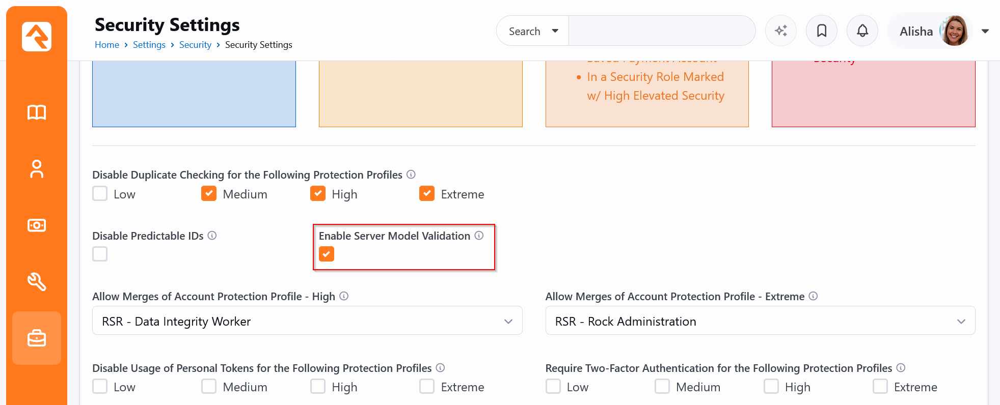
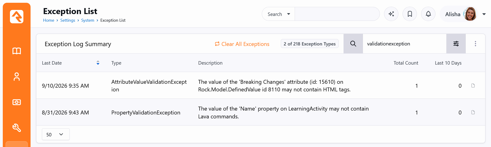
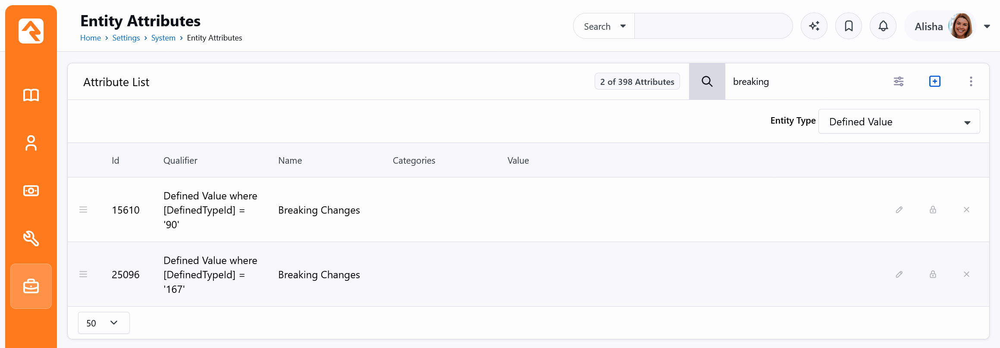
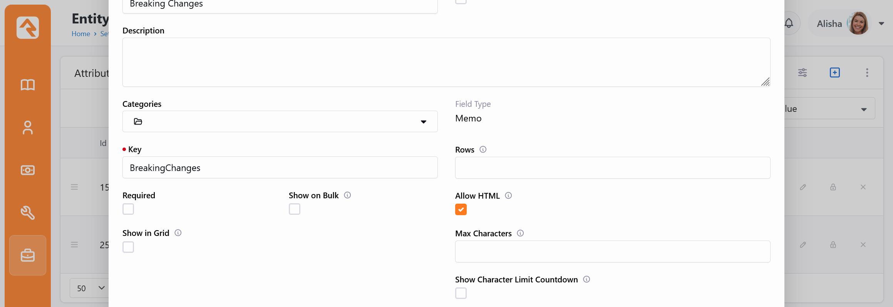

# Server Model Validation: Fixing Exception Log Entries

This guide is the technical companion to **Server Model Validation: Overview** (`01-server-model-validation-overview.md`). It explains how to find validation exceptions in the Exception Log, how to read them, and how to resolve each one, primarily by turning on the **Allow Lava** and **Allow HTML** options on the affected attributes. In other cases, the content should never have been there, and the fix is to change the process that is saving it.

This applies to Rock **17.9, 18.5, 19.5, 20.0**, and later releases in each of those version lines. Earlier versions do not log these exceptions.

## Readiness Checklist

Work through these steps before turning the setting on.

1. **Confirm your version.** Your server must be running Rock 17.9, 18.5, 19.5, 20.0, or a later release in the same version line.
2. **Plan on about a month.** Check the Exception Log once a week for roughly four weeks. This gives your regular weekly and monthly processes a chance to log anything they would trip over.
3. **Review the Exception Log** for the two exception types described below. See **Finding the Exceptions**.
4. **Fix attribute exceptions** by adjusting the attribute settings or cleaning up the source of the content. See **Fixing Attribute Exceptions**.
5. **Fix property exceptions** by updating the workflows, imports, integrations, or staff procedures that produce them. See **Fixing Property Exceptions**.
6. **Confirm the log is quiet.** By your last weekly check, you want zero new validation exceptions, or only ones you have reviewed and accept will now be blocked.
7. **Turn it on.** Go to Admin Tools > Settings > Security > Security Settings, check **Enable Server Model Validation**, and save.
8. **Restart Rock.** The setting is only read when Rock starts. It does not take effect until the application is restarted.
9. **Monitor.** For the first few weeks, keep an eye on the Exception Log and on reports from staff about saves that fail. This catches anything that did not come up during your review. Failures are usually logged and will point to the exact attribute or field involved.

When you are ready to enable it, the setting is on the Security Settings page:



## The Two Exception Types

Rock logs two kinds of validation exceptions, and you will handle them differently.

- **Attribute Value Validation** (`Rock.Security.AttributeValueValidationException`): a value saved into an attribute contained something that attribute is not configured to allow. The most common case by far is Lava or HTML in a Text or Memo attribute.
- **Property Validation** (`Rock.Security.PropertyValidationException`): a value saved into one of Rock's built-in fields (such as a person's name, a group's name, or a page title) contained something that field never allows.

Validation only runs when something is saved. Records that are never edited will not generate errors, even if they already contain content that is not allowed, so the Exception Log reflects what is actually happening in day-to-day use. When a record is saved, the checks work as follows:

- **Attribute values** are checked only when the value is new or has changed. Workflow form fields are the exception: every editable field is checked each time the form is submitted.
- **Built-in fields** are all checked whenever the record is saved, not just the ones that changed. For example, if a person's last name already contains HTML, editing only their email address will still log (or, once enabled, block) the save.

## Finding the Exceptions

1. Go to **Admin Tools > Settings > System > Exception List**.
2. Type `validationexception` in the search box. This narrows the list to validation exceptions. Look for `AttributeValueValidationException` and `PropertyValidationException` in the **Type** column; other types that match the search are not covered by this guide.
3. Use the **Description** column to see which attribute or property is affected. The next section explains how to read these messages.



If you need more information about where an exception came from, click it to see each occurrence, including the page URL and stack trace.

## Reading the Messages

### Attribute exceptions

```
The value of the '<Attribute Name>' attribute (id: <AttributeId>) on <Entity Type> id <EntityId> <reason>.
```

For example:

> The value of the 'Breaking Changes' attribute (id: 15610) on Rock.Model.DefinedValue id 8110 may not contain HTML tags.

- **Attribute Name and id** tell you exactly which attribute to fix.
- **Entity Type** tells you what kind of record the attribute belongs to, which helps you find it.
- **Entity id** is the specific record that was being saved, useful for looking at the actual value.
- **Reason** tells you what kind of content was rejected.

Global attributes use a slightly different format: `The value of the '<Name>' global attribute (id: <Id>) on entity id 0 <reason>.`

### Property exceptions

```
The value of the '<Property Name>' property on <Entity Type> <reason>.
```

For example:

> The value of the 'Name' property on LearningActivity may not contain Lava commands.

These refer to a built-in field on the entity, not an attribute. See **Fixing Property Exceptions** below.

## Fixing Attribute Exceptions

### Step 1: Decide whether the content belongs there

Before changing anything, you may want to look at the actual value that was saved, if you are able to. Ask:

- **Is this attribute meant to hold Lava or HTML?** For example, a group type attribute that holds a Lava template for a welcome email, or a content channel attribute that holds formatted text. If so, turn on the matching option.
- **Or did the content arrive by accident?** For example, a person pasted formatted text into a plain text field, or a workflow wrote Lava output that still contained unresolved Lava. In that case, fix the source and leave the attribute locked down.

Turning on Allow Lava or Allow HTML loosens protection on that attribute. Only turn them on where the content is genuinely expected, and be especially careful with attributes that the public can edit (registration forms, workflow entry forms shown on the external site, public profile editing).

### Step 2: Choose the fix

Only change the attribute's settings when the content is genuinely expected:

- **Some field types can be configured to allow Lava and/or HTML.** Turn on only the option that matches the reason in the message: **Allow Lava** for Lava, **Allow HTML** for HTML tags.
  - **Text:** Allow Lava and Allow HTML. These options have no effect when the attribute is marked as a first name field.
  - **Value List:** Allow Lava and Allow HTML.
  - **Memo:** Allow HTML. Memo attributes always allow Lava.
- **Some content is never allowed in these field types,** even with both options on. If the reason in the message is anything other than Lava or HTML tags, treat it as a source problem.
- **Other field types do not have these options.** Fix the source instead.

A few field types are unrestricted and never generate these exceptions: HTML, Code Editor, Lava, and Structured Content Editor. Markdown allows Lava and basic HTML.

Also remember that Lava detection is a simple text check. Any value containing `{{`, `{%`, or `{[` counts as Lava, even if it was not intended as Lava (for example, JSON or text copied from a template). The fix is the same: turn on Allow Lava if that content is expected.

### Step 3: Find and edit the attribute

If you already know where the attribute is managed (for example, on a defined type or a workflow type), you can go there and edit it directly. Otherwise, the **Entity Attributes** page lists every attribute in Rock and is a quick way to find it:

1. Go to **Admin Tools > Settings > System > Entity Attributes**.
2. Set **Entity Type** to the entity type from the exception message (for example, `Rock.Model.DefinedValue` is **Defined Value**). For global attributes, choose **Global Attributes**.
3. Type part of the attribute name in the search box.
4. If more than one attribute matches, use the **Id** column to pick the one whose id matches the id in the exception message.

In the example below, two Defined Value attributes are named "Breaking Changes". The exception message said `(id: 15610)`, so the first row is the one to edit.



If the entity type is `Rock.Model.Block`, `Rock.Model.WorkflowActionType`, or another component whose attributes are defined in code, do not edit the attribute. See **Code-defined attributes** below.

To make the change:

1. Click the edit (pencil) icon on the attribute row.
2. In the field type configuration area (below the Field Type selection), check **Allow Lava** and/or **Allow HTML** as determined in Step 2.
3. Save the attribute.

The example below is a Memo attribute, so only **Allow HTML** is shown. Text and Value List attributes show **Allow Lava** in the same area.



The change takes effect immediately. No restart is required.

### Step 4: Verify

Re-save one of the affected records (or re-run the process that produced the value) and confirm that no new exception is logged for that attribute. The existing log entries do not go away on their own, so note the time you made the fix and only look at entries logged after it.

### Code-defined attributes

Attributes on blocks, workflow actions, jobs, and other components are declared in code. If one of these appears in the log with reasonable content (for example, a block setting that is meant to hold a Lava template), the attribute definition likely just needs to be updated to allow that content. This is usually a simple oversight in Rock or in the plugin that defines it:

- If it comes from core Rock, report it on the Rock issue tracker with your Rock version and the full exception message.
- If it comes from a plugin, report it to the plugin's author.

## Fixing Property Exceptions

Built-in properties have fixed rules that cannot be changed through settings. A person's name, for example, will never allow HTML. To resolve these, you need to find and change whatever is putting the content there.

### Step 1: Change the process

Change the process that is saving the invalid content so it only saves plain content. Common examples include:

- **Workflows:** make sure Lava used to set names, titles, or other simple fields outputs plain text. Use filters such as `StripHtml` where formatted content might sneak in.
- **Imports and integrations:** clean or strip formatting from the source data before it is sent to Rock.
- **Lava templates:** check that entity commands set only plain values on simple properties.
- **Staff procedures:** train staff to paste as plain text (Ctrl+Shift+V in most browsers) when entering names and titles, and to avoid copying from word processors or emails into simple fields.
- **Plugins:** contact the plugin's author.

### Step 2: Correct existing data

Changing the process stops new invalid content, but records that already contain it will continue to report the same error whenever they are saved, even if the invalid field was not changed. Once validation is enabled, those saves will fail. Either clean up the existing data, or be aware that these errors will keep appearing until you do.

### Step 3: Verify

As with attributes, note the time of the fix and confirm no new entries appear for that property afterward (other than from records you have not cleaned up yet).

## When You Are Done

Once no new validation exceptions are being logged, or only ones you have reviewed and are comfortable having blocked, continue with step 7 of the **Readiness Checklist** at the top of this guide to turn on **Enable Server Model Validation** and restart Rock.

That is everything an administrator needs. The remaining section is intended for plugin developers and can be skipped if you do not write plugins.

## For Plugin Developers

Validation covers two things: string properties on entity models, and attribute values. Both apply to plugins as well as core Rock. We recommend testing your plugin on a development server with **Enable Server Model Validation** turned on so that problems surface as failed saves rather than log entries.

### Model properties

Each string property should declare what kind of content it is meant to hold using the `[StringValidation]` attribute (`Rock.Security`) and a `StringValidationProfile` (`Rock.Enums.Security`):

| Profile | Intended for |
|-|-|
| `PlainText` | Ordinary text with no formatting. |
| `Name` | Names of people, groups, and similar values. Stricter than `PlainText`. |
| `BasicHtml` | Short formatted text that should not contain Lava. |
| `LavaAndBasicHtml` | Formatted text or templates that may contain Lava. |
| `Unrestricted` | Content edited only by trusted administrators, such as raw templates or code. |

```csharp
[DataMember]
[StringValidation( StringValidationProfile.Name )]
public string Name { get; set; }

[DataMember]
[StringValidation( StringValidationProfile.LavaAndBasicHtml )]
public string Description { get; set; }
```

A few things to keep in mind:

- **Only decorated properties are checked, for now.** A string property without `[StringValidation]` is not validated today so that existing plugins keep working. In a future version, undecorated properties will be treated as `PlainText`. Decorate every string property on your models now, especially any that need to hold HTML or Lava, so your plugin keeps working when that change arrives.
- The property must also have `[DataMember]`, must not have `[NotMapped]`, and must have a public setter.
- Choose the most restrictive profile that fits the data. Use `Unrestricted` sparingly.
- `ExcludedRules` and `AdditionalRules` on the attribute let you fine-tune a profile for a single property when none of the profiles fit exactly. Use these sparingly as well.

### Attributes declared in code

Block settings, workflow action settings, jobs, and other components declare their attributes in code. Values for these attributes are validated using the same Allow HTML and Allow Lava options described earlier in this guide. If an attribute is meant to hold HTML or Lava, say so in its declaration:

```csharp
[TextField( "Welcome Message",
    Key = AttributeKey.WelcomeMessage,
    AllowHtml = true,
    AllowLava = true )]

[MemoField( "Summary Template",
    Key = AttributeKey.SummaryTemplate,
    AllowHtml = true )]
```

`TextFieldAttribute` and `ValueListFieldAttribute` support both `AllowHtml` and `AllowLava`. `MemoFieldAttribute` supports `AllowHtml`, and always allows Lava. For settings that hold full templates or code, use a field type designed for it, such as `CodeEditorField` or `LavaField`.
